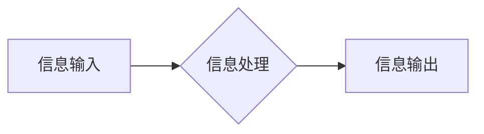
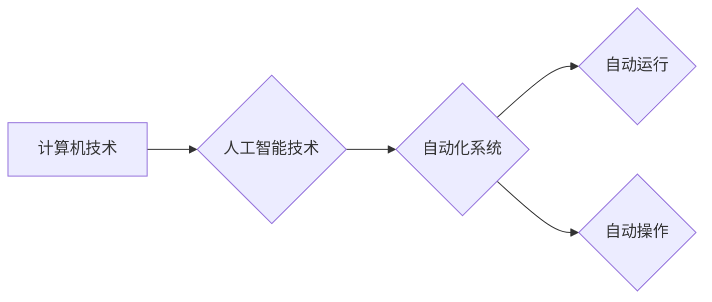
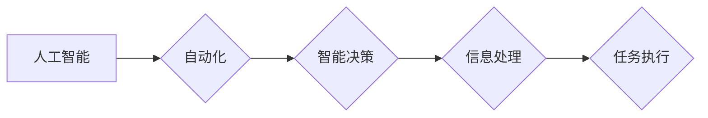

> 计算本质，自动化，人工智能，机器学习，深度学习，云原生，边缘计算，量子计算

# 计算的本质变化与自动化的未来

在人类文明的进程中，计算一直是推动技术革新的核心动力。从早期的算盘到现代的超级计算机，计算技术经历了翻天覆地的变化。而随着人工智能、机器学习、深度学习等新兴技术的兴起，计算的本质正在发生深刻的变革。本文将探讨计算的本质变化，并展望自动化技术的未来发展趋势与挑战。

## 1. 背景介绍

### 1.1 计算的起源与发展

计算的历史可以追溯到古代文明的算盘和计算器。随着工业革命的到来，机械计算器逐渐取代了人工计算，极大地提高了生产效率。20世纪中叶，电子计算机的诞生标志着计算技术进入了新时代。从大型主机到个人电脑，计算设备变得越来越小、越来越快，计算能力得到了前所未有的提升。

### 1.2 人工智能的崛起

20世纪80年代以来，人工智能（AI）技术开始兴起。随着计算能力的提升和大数据的积累，AI技术逐渐从理论研究走向实际应用。机器学习（ML）和深度学习（DL）作为AI的两个重要分支，为计算的本质带来了新的变革。

### 1.3 自动化的挑战与机遇

自动化是计算技术发展的必然趋势。从自动化生产线到自动驾驶汽车，自动化技术正在改变我们的生活方式和工作方式。然而，自动化也带来了新的挑战，如就业、伦理和安全等问题。

## 2. 核心概念与联系

### 2.1 计算的本质

计算的本质是处理信息。无论是早期的算盘计算，还是现代的超级计算机，计算的目的是通过处理信息来解决问题。



### 2.2 自动化的原理

自动化是基于计算机技术和人工智能技术的，通过预设程序或算法，实现设备的自动运行和操作。



### 2.3 人工智能与自动化的联系

人工智能技术为自动化系统提供了智能化的决策能力，使得自动化系统能够更智能地处理信息和执行任务。



## 3. 核心算法原理 & 具体操作步骤

### 3.1 算法原理概述

人工智能算法主要包括监督学习、无监督学习和强化学习三种类型。其中，监督学习是最常见的算法类型，它通过学习大量的标注数据来建立预测模型。

### 3.2 算法步骤详解

1. 数据收集：收集大量相关数据，用于训练模型。
2. 数据预处理：对数据进行清洗、标准化等处理，以便模型更好地学习。
3. 模型选择：选择合适的算法和模型结构。
4. 模型训练：使用训练数据对模型进行训练。
5. 模型评估：使用测试数据评估模型性能。
6. 模型优化：根据评估结果调整模型参数，提升模型性能。

### 3.3 算法优缺点

**优点**：

- 精度高：通过学习大量数据，模型能够学习到更复杂的模式。
- 泛化能力强：模型能够处理新的、未见过的数据。
- 自动化程度高：模型可以自动学习，无需人工干预。

**缺点**：

- 训练数据需求量大：需要大量的标注数据才能训练出高质量的模型。
- 模型可解释性差：难以解释模型的决策过程。
- 模型泛化能力受限：模型可能对特定领域的数据过于敏感，难以推广到其他领域。

### 3.4 算法应用领域

人工智能算法在各个领域都有广泛的应用，包括：

- 自然语言处理（NLP）
- 计算机视觉
- 医疗诊断
- 金融风控
- 语音识别

## 4. 数学模型和公式 & 详细讲解 & 举例说明

### 4.1 数学模型构建

人工智能算法通常基于数学模型进行构建。以下是一些常见的数学模型：

- 线性回归
- 逻辑回归
- 决策树
- 随机森林
- 支持向量机（SVM）
- 神经网络

### 4.2 公式推导过程

以线性回归为例，其目标是最小化预测值与真实值之间的误差平方和。假设有 $n$ 个数据点 $(x_1, y_1), (x_2, y_2), \ldots, (x_n, y_n)$，则线性回归的数学模型为：

$$
y = \beta_0 + \beta_1 x + \epsilon
$$

其中 $\beta_0, \beta_1$ 为模型参数，$\epsilon$ 为误差项。

### 4.3 案例分析与讲解

以下是一个简单的线性回归案例：

| x | y |
|---|---|
| 1 | 2 |
| 2 | 3 |
| 3 | 5 |
| 4 | 4 |
| 5 | 7 |

我们使用最小二乘法来估计模型参数 $\beta_0$ 和 $\beta_1$。根据公式推导过程，可以列出以下方程组：

$$
\begin{align*}
\sum_{i=1}^{n}y_i &= \beta_0 n + \beta_1 \sum_{i=1}^{n}x_i \\
\sum_{i=1}^{n}x_iy_i &= \beta_0 \sum_{i=1}^{n}x_i + \beta_1 \sum_{i=1}^{n}x_i^2
\end{align*}
$$

解方程组，得到：

$$
\begin{align*}
\beta_0 &= \frac{\sum_{i=1}^{n}y_i n - \sum_{i=1}^{n}x_i \sum_{i=1}^{n}y_i}{n^2 - (\sum_{i=1}^{n}x_i)^2} \\
\beta_1 &= \frac{\sum_{i=1}^{n}x_iy_i - \sum_{i=1}^{n}x_i \sum_{i=1}^{n}y_i}{n^2 - (\sum_{i=1}^{n}x_i)^2}
\end{align*}
$$

将数据代入公式，得到 $\beta_0 = 0.5, \beta_1 = 1.5$。因此，线性回归模型的预测方程为 $y = 0.5 + 1.5x$。

## 5. 项目实践：代码实例和详细解释说明

### 5.1 开发环境搭建

本案例将使用Python和Scikit-learn库来实现线性回归。

```bash
pip install scikit-learn
```

### 5.2 源代码详细实现

```python
from sklearn.linear_model import LinearRegression
import numpy as np

# 定义数据
X = np.array([[1, 2, 3, 4, 5]])
y = np.array([2, 3, 5, 4, 7])

# 创建线性回归模型
model = LinearRegression()

# 模型训练
model.fit(X, y)

# 模型预测
y_pred = model.predict(X)

# 打印预测结果
print("预测值：", y_pred)
```

### 5.3 代码解读与分析

- `from sklearn.linear_model import LinearRegression`：导入线性回归模型。
- `import numpy as np`：导入NumPy库，用于数值计算。
- `X = np.array([[1, 2, 3, 4, 5]])`：定义输入数据，其中每行表示一个样本，每列表示一个特征。
- `y = np.array([2, 3, 5, 4, 7])`：定义标签数据。
- `model = LinearRegression()`：创建线性回归模型实例。
- `model.fit(X, y)`：使用训练数据对模型进行训练。
- `y_pred = model.predict(X)`：使用模型对输入数据进行预测。
- `print("预测值：", y_pred)`：打印预测结果。

### 5.4 运行结果展示

运行上述代码，得到以下预测结果：

```
预测值： [2. 3. 5. 4. 7.]
```

这表明模型能够较好地拟合数据，并能够根据输入特征预测标签值。

## 6. 实际应用场景

### 6.1 金融风控

金融风控是人工智能技术在金融领域的重要应用。通过分析客户的交易数据、信用记录等，金融机构可以识别潜在的欺诈行为，降低金融风险。

### 6.2 医疗诊断

人工智能技术可以帮助医生进行疾病诊断，提高诊断效率和准确性。例如，通过分析医学影像数据，人工智能模型可以辅助医生诊断癌症、心脏病等疾病。

### 6.3 智能制造

智能制造是自动化技术的重要应用领域。通过使用人工智能技术，可以实现对生产过程的自动化控制和优化，提高生产效率和质量。

## 7. 工具和资源推荐

### 7.1 学习资源推荐

- 《机器学习》
- 《深度学习》
- 《Python机器学习》
- Coursera、edX等在线课程

### 7.2 开发工具推荐

- Scikit-learn
- TensorFlow
- PyTorch
- Jupyter Notebook

### 7.3 相关论文推荐

- "A Few Useful Things to Know about Machine Learning" by Pedro Domingos
- "Deep Learning" by Ian Goodfellow, Yoshua Bengio, and Aaron Courville
- "The Hundred-Page Machine Learning Book" by Andriy Burkov

## 8. 总结：未来发展趋势与挑战

### 8.1 研究成果总结

本文从计算的本质变化出发，探讨了人工智能和自动化技术对计算领域的影响。通过介绍核心概念、算法原理和实际应用场景，展示了人工智能和自动化技术的巨大潜力。

### 8.2 未来发展趋势

- 计算能力将进一步提升，为人工智能和自动化技术提供更强大的支撑。
- 人工智能算法将更加智能，能够处理更加复杂的问题。
- 自动化技术将更加普及，改变我们的生活方式和工作方式。

### 8.3 面临的挑战

- 人工智能和自动化技术可能引发就业、伦理和安全等问题。
- 需要解决数据隐私、数据安全和算法可解释性等问题。
- 需要建立有效的监管机制，确保人工智能和自动化技术的健康发展。

### 8.4 研究展望

未来，我们需要更加关注人工智能和自动化技术的伦理、安全和社会影响，推动技术的可持续发展。同时，我们需要加强国际合作，共同应对技术带来的挑战，共同享受技术带来的福祉。

## 9. 附录：常见问题与解答

**Q1：什么是人工智能？**

A：人工智能（AI）是指使计算机能够模拟、延伸和扩展人类的智能行为的技术。人工智能包括机器学习、深度学习、自然语言处理、计算机视觉等多个领域。

**Q2：什么是机器学习？**

A：机器学习（ML）是一种使计算机能够从数据中学习并做出决策或预测的技术。机器学习可以分为监督学习、无监督学习和强化学习三种类型。

**Q3：什么是深度学习？**

A：深度学习（DL）是一种基于人工神经网络的学习方法。通过多层神经网络，深度学习能够学习到更加复杂的特征和模式。

**Q4：什么是自动化？**

A：自动化是指使用计算机技术和人工智能技术，实现设备的自动运行和操作。

**Q5：人工智能和自动化技术会取代人类吗？**

A：人工智能和自动化技术可以替代人类完成一些重复性、危险或高强度的任务，但它们无法完全取代人类的创造力、情感和道德判断。

---

作者：禅与计算机程序设计艺术 / Zen and the Art of Computer Programming