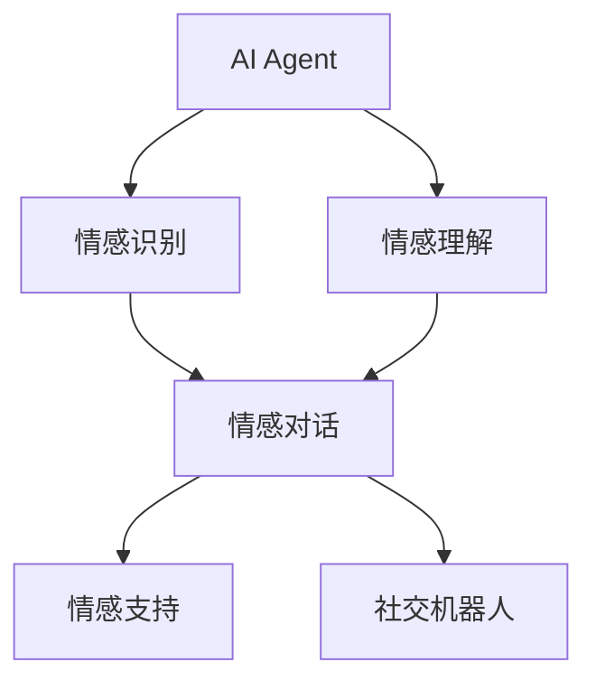
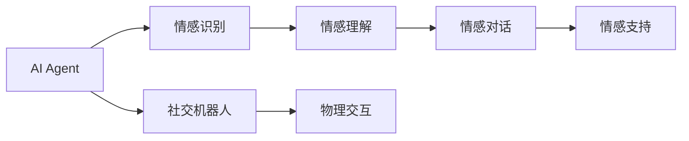
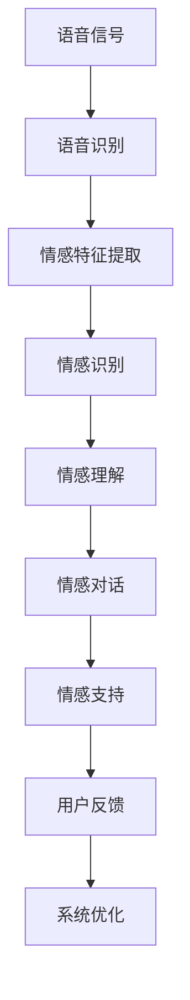
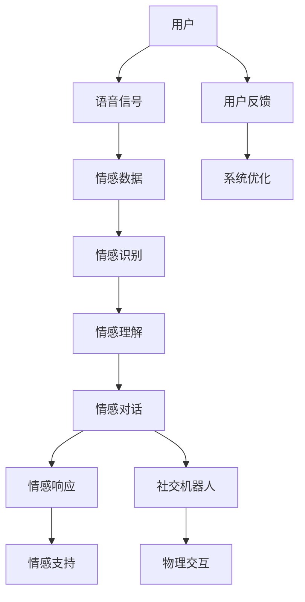

                 

# AI Agent在情感陪伴中的应用

> 关键词：情感陪伴, AI Agent, 机器学习, 自然语言处理, 社交机器人, 心理辅助, 用户个性化

## 1. 背景介绍

### 1.1 问题由来
随着人工智能技术的迅猛发展，AI Agent在各行各业的应用日益广泛。在情感陪伴领域，AI Agent因其能理解人类情感、提供个性化服务，而被赋予了巨大的发展潜力。AI Agent的应用场景包括但不限于心理咨询、情感支持、语言学习、社交互动等。

情感陪伴AI Agent主要分为两大类：一种是基于聊天机器人（Chatbot）的情感陪伴，另一种是基于社交机器人的情感陪伴。前者的主要目的是通过自然语言处理（NLP）技术与用户进行简单的对话，后者的目的是通过机器视觉、行为识别等技术，与用户建立更深入的情感互动。

### 1.2 问题核心关键点
本文聚焦于AI Agent在情感陪伴领域的应用，主要研究以下三个关键点：
1. AI Agent的情感识别与理解机制。
2. 基于情感数据的个性化服务实现。
3. 评估和优化情感陪伴AI Agent的性能。

## 2. 核心概念与联系

### 2.1 核心概念概述

为更好地理解情感陪伴AI Agent，本节将介绍几个密切相关的核心概念：

- **AI Agent**：指由软件控制的智能体，能够基于环境信息自主决策，完成任务或提供服务。
- **情感识别（Affect Recognition）**：指通过分析语音、文字、面部表情、肢体语言等信号，自动识别用户的情感状态，如快乐、悲伤、愤怒等。
- **情感理解（Affect Understanding）**：指理解情感信号背后的情感原因，如事件、需求等。
- **情感对话（Affective Dialogue）**：指基于情感识别和理解，AI Agent能够自然流畅地与用户进行情感相关的对话。
- **情感支持（Emotional Support）**：指AI Agent能够根据用户的情感状态，提供适当的情感响应和支持。
- **社交机器人（Social Robot）**：指具有人类外观和行为，能与用户建立社交关系并执行特定任务的机器人。

这些核心概念之间的逻辑关系可以通过以下Mermaid流程图来展示：



这个流程图展示了情感陪伴AI Agent的核心功能组件及其之间的关系：

1. AI Agent首先通过情感识别获取用户的情感状态。
2. 接着，AI Agent利用情感理解技术分析情感原因。
3. 基于情感理解和对话上下文，AI Agent进行情感对话。
4. 根据对话内容和情感状态，AI Agent提供情感支持。
5. 对于社交机器人，AI Agent还具备具体的物理交互功能，如移动、姿态控制等。

### 2.2 概念间的关系

这些核心概念之间存在着紧密的联系，形成了情感陪伴AI Agent的完整功能框架。下面我们通过几个Mermaid流程图来展示这些概念之间的关系。

#### 2.2.1 AI Agent的功能组件



这个流程图展示了AI Agent的功能组件及其之间的作用关系：

1. AI Agent负责整体决策和执行。
2. 情感识别模块用于获取情感状态。
3. 情感理解模块用于分析情感原因。
4. 情感对话模块用于实现基于情感的自然语言对话。
5. 情感支持模块用于提供情感响应。
6. 社交机器人模块用于与用户进行物理交互。

#### 2.2.2 情感数据的处理流程


这个流程图展示了情感数据的处理流程：

1. 用户语音信号被转化为文本。
2. 文本信号被提取情感特征。
3. 情感特征被识别为具体的情感状态。
4. 情感状态被理解背后的原因。
5. 情感理解结果用于生成对话内容。
6. 对话内容被转化为情感响应。

#### 2.2.3 基于情感支持的系统架构



这个流程图展示了基于情感支持的系统架构：

1. 用户语音信号被转化为文本。
2. 文本信号被提取情感特征。
3. 情感特征被识别为具体的情感状态。
4. 情感状态被理解背后的原因。
5. 情感理解结果用于生成对话内容。
6. 对话内容被转化为情感响应。
7. 情感响应被用于支持用户。
8. 用户反馈用于系统优化。

### 2.3 核心概念的整体架构

最后，我们用一个综合的流程图来展示这些核心概念在大语言模型微调过程中的整体架构：



这个综合流程图展示了情感陪伴AI Agent的整体架构：

1. 用户与AI Agent进行互动。
2. 语音信号被转化为情感数据。
3. 情感数据被识别和理解。
4. 基于情感理解和对话上下文，AI Agent进行情感对话。
5. 情感对话被转化为情感响应。
6. 情感响应被用于支持用户。
7. 对于社交机器人，AI Agent还具备具体的物理交互功能。
8. 用户反馈用于系统优化。

## 3. 核心算法原理 & 具体操作步骤
### 3.1 算法原理概述

情感陪伴AI Agent的核心算法原理基于自然语言处理（NLP）和机器学习（ML）技术。核心流程如下：

1. **情感识别**：通过分析用户的语音、文字、面部表情、肢体语言等信号，自动识别用户的情感状态，如快乐、悲伤、愤怒等。
2. **情感理解**：理解情感信号背后的情感原因，如事件、需求等。
3. **情感对话**：基于情感识别和理解，AI Agent能够自然流畅地与用户进行情感相关的对话。
4. **情感支持**：根据用户的情感状态，AI Agent能够提供适当的情感响应和支持。
5. **社交机器人交互**：对于社交机器人，AI Agent还具备具体的物理交互功能，如移动、姿态控制等。

在技术实现上，情感识别和情感理解通常采用基于深度学习的模型，如卷积神经网络（CNN）、循环神经网络（RNN）和Transformer等。这些模型通过分析情感特征，识别情感状态，并通过多任务学习等方式理解情感背后的原因。

### 3.2 算法步骤详解

#### 3.2.1 数据准备

1. **数据收集**：收集用户的语音、文字、面部表情、肢体语言等情感数据。数据来源包括社交媒体、视频会议、心理健康应用等。
2. **数据预处理**：对收集到的数据进行清洗、标注、归一化等预处理，确保数据的质量和一致性。

#### 3.2.2 模型训练

1. **模型选择**：根据任务需求选择合适的深度学习模型，如CNN、RNN、Transformer等。
2. **模型训练**：利用标注好的情感数据对模型进行训练。训练过程中，使用交叉验证、学习率调整、正则化等技术，提升模型的泛化能力和鲁棒性。
3. **模型评估**：在验证集上评估模型的性能，使用指标如准确率、召回率、F1分数等，优化模型参数。

#### 3.2.3 情感识别与理解

1. **情感识别**：利用训练好的模型，对用户的语音、文字、面部表情、肢体语言等信号进行情感识别，输出情感状态标签。
2. **情感理解**：基于情感状态，分析背后的情感原因，如事件、需求等，输出情感理解结果。

#### 3.2.4 情感对话与支持

1. **情感对话**：根据情感识别和理解结果，生成适当的对话内容，实现情感对话。
2. **情感支持**：根据用户的情感状态，提供适当的情感响应和支持，如情感鼓励、情感调节等。

#### 3.2.5 社交机器人交互

1. **物理交互**：对于社交机器人，AI Agent还具备具体的物理交互功能，如移动、姿态控制等。
2. **环境感知**：社交机器人通过摄像头、传感器等设备，感知周围环境，调整交互策略。
3. **交互优化**：利用用户反馈和交互日志，不断优化社交机器人的交互策略，提升用户体验。

### 3.3 算法优缺点

情感陪伴AI Agent的优点包括：

1. **高灵活性**：能够根据用户的情感状态，提供个性化的情感支持和对话。
2. **全天候服务**：可以24小时不间断服务，及时响应用户的情感需求。
3. **多样性**：能够处理多种情感信号，包括语音、文字、面部表情等。
4. **成本低**：相比于传统心理治疗等方法，情感陪伴AI Agent具有较低的成本。

其缺点包括：

1. **情感识别准确性有限**：情感识别模型无法完全准确地识别用户的情感状态，可能存在一定的误判。
2. **缺乏人类情感共鸣**：AI Agent的情感响应和支持仍无法完全替代人类，可能无法提供真正的情感共鸣和支持。
3. **隐私和安全问题**：情感数据可能涉及用户的敏感信息，存在隐私泄露和安全风险。
4. **依赖技术成熟度**：情感陪伴AI Agent的性能受限于深度学习模型的训练和优化，技术成熟度仍需提高。

### 3.4 算法应用领域

情感陪伴AI Agent已经在多个领域得到应用，包括但不限于：

- **心理健康**：提供心理健康咨询服务，帮助用户缓解压力、调节情绪。
- **教育**：为学生提供情感支持和辅导，提高学习效率。
- **娱乐**：提供情感互动的聊天机器人，陪伴用户进行游戏、娱乐活动。
- **老年护理**：为老年人提供情感陪伴和日常护理，缓解孤独感。
- **应急救援**：在紧急情况下，为受困人员提供情感支持，稳定情绪。

## 4. 数学模型和公式 & 详细讲解 & 举例说明

### 4.1 数学模型构建

情感陪伴AI Agent的核心数学模型基于深度学习和自然语言处理技术。下面以一个简单的情感识别模型为例，介绍其数学模型构建过程。

设情感识别模型为 $M(x)$，其中 $x$ 为情感输入数据，$M(x)$ 输出情感状态标签。训练集为 $D=\{(x_i, y_i)\}_{i=1}^N$，$y_i$ 为标注好的情感状态标签。模型通过最小化损失函数 $\mathcal{L}(M)$ 来优化模型参数，具体如下：

$$
\mathcal{L}(M) = \frac{1}{N}\sum_{i=1}^N \ell(M(x_i),y_i)
$$

其中 $\ell$ 为损失函数，通常采用交叉熵损失。优化目标为：

$$
\theta^* = \mathop{\arg\min}_{\theta} \mathcal{L}(M_{\theta})
$$

### 4.2 公式推导过程

以一个基于CNN的情感识别模型为例，推导其训练过程中的关键公式。

假设模型 $M_{\theta}(x)$ 为卷积神经网络（CNN），输入为 $x$，输出为情感状态标签 $y$。训练数据集为 $D=\{(x_i, y_i)\}_{i=1}^N$。

1. **模型定义**：
   - 输入层：输入数据 $x$，维度为 $D_x$。
   - 卷积层：使用卷积核大小为 $k$，步幅为 $s$ 的卷积操作，输出维度为 $H$。
   - 池化层：使用池化窗口大小为 $w$，步幅为 $p$ 的池化操作，输出维度为 $C$。
   - 全连接层：输出情感状态标签 $y$。

2. **损失函数**：
   - 交叉熵损失：
   $$
   \ell(y, \hat{y}) = -\frac{1}{N}\sum_{i=1}^N \sum_{j=1}^C y_{ij}\log(\hat{y}_{ij})
   $$
   其中 $y_{ij}$ 为情感状态标签，$\hat{y}_{ij}$ 为模型预测结果。

3. **梯度更新**：
   - 使用随机梯度下降（SGD）更新模型参数：
   $$
   \theta_{t+1} = \theta_t - \eta \nabla_{\theta} \mathcal{L}(M_{\theta}(x))
   $$
   其中 $\eta$ 为学习率，$\nabla_{\theta} \mathcal{L}(M_{\theta}(x))$ 为损失函数对模型参数 $\theta$ 的梯度。

### 4.3 案例分析与讲解

假设我们有一个基于CNN的情感识别模型，用于识别用户的语音情感状态。模型的输入为语音信号，输出为情感状态标签（快乐、悲伤、愤怒等）。训练数据集包括1000个语音信号和对应的情感状态标签。

1. **数据预处理**：
   - 将语音信号转换为MFCC特征。
   - 对MFCC特征进行归一化和标准化处理。
   - 将MFCC特征切割为固定长度的窗口，并填充至相同长度。

2. **模型训练**：
   - 使用交叉验证，划分训练集和验证集。
   - 使用Adam优化器，学习率为0.001。
   - 在训练过程中，每5个epoch输出一次验证集上的损失和准确率。
   - 训练过程中，使用正则化技术，如L2正则和Dropout，防止过拟合。

3. **情感识别与理解**：
   - 使用训练好的模型，对新的语音信号进行情感识别，输出情感状态标签。
   - 利用情感识别结果，分析背后的情感原因，如事件、需求等。

4. **情感对话与支持**：
   - 根据情感状态，生成适当的对话内容。
   - 根据情感状态，提供适当的情感响应和支持，如情感鼓励、情感调节等。

## 5. 项目实践：代码实例和详细解释说明

### 5.1 开发环境搭建

在进行情感陪伴AI Agent的开发前，我们需要准备好开发环境。以下是使用Python进行PyTorch开发的环境配置流程：

1. 安装Anaconda：从官网下载并安装Anaconda，用于创建独立的Python环境。

2. 创建并激活虚拟环境：
```bash
conda create -n pytorch-env python=3.8 
conda activate pytorch-env
```

3. 安装PyTorch：根据CUDA版本，从官网获取对应的安装命令。例如：
```bash
conda install pytorch torchvision torchaudio cudatoolkit=11.1 -c pytorch -c conda-forge
```

4. 安装Transformers库：
```bash
pip install transformers
```

5. 安装各类工具包：
```bash
pip install numpy pandas scikit-learn matplotlib tqdm jupyter notebook ipython
```

完成上述步骤后，即可在`pytorch-env`环境中开始开发实践。

### 5.2 源代码详细实现

下面我们以情感识别模型为例，给出使用PyTorch对CNN模型进行情感识别训练的PyTorch代码实现。

首先，定义CNN模型：

```python
import torch
import torch.nn as nn

class CNNModel(nn.Module):
    def __init__(self, in_channels, out_channels):
        super(CNNModel, self).__init__()
        self.conv1 = nn.Conv1d(in_channels, 64, kernel_size=3, stride=1, padding=1)
        self.relu1 = nn.ReLU()
        self.pool1 = nn.MaxPool1d(kernel_size=2, stride=2)
        self.conv2 = nn.Conv1d(64, 128, kernel_size=3, stride=1, padding=1)
        self.relu2 = nn.ReLU()
        self.pool2 = nn.MaxPool1d(kernel_size=2, stride=2)
        self.fc1 = nn.Linear(128, 64)
        self.relu3 = nn.ReLU()
        self.fc2 = nn.Linear(64, out_channels)
        
    def forward(self, x):
        x = self.conv1(x)
        x = self.relu1(x)
        x = self.pool1(x)
        x = self.conv2(x)
        x = self.relu2(x)
        x = self.pool2(x)
        x = x.view(-1, 128)
        x = self.fc1(x)
        x = self.relu3(x)
        x = self.fc2(x)
        return x
```

然后，定义训练函数：

```python
import torch.optim as optim

def train_model(model, criterion, optimizer, train_loader, device):
    model.train()
    total_loss = 0
    for batch_idx, (data, target) in enumerate(train_loader):
        data, target = data.to(device), target.to(device)
        optimizer.zero_grad()
        output = model(data)
        loss = criterion(output, target)
        loss.backward()
        optimizer.step()
        total_loss += loss.item()
    return total_loss / len(train_loader)
```

最后，启动训练流程并在验证集上评估：

```python
epochs = 10
batch_size = 64

device = torch.device('cuda' if torch.cuda.is_available() else 'cpu')

model = CNNModel(in_channels, out_channels).to(device)
criterion = nn.CrossEntropyLoss()
optimizer = optim.Adam(model.parameters(), lr=0.001)

for epoch in range(epochs):
    train_loss = train_model(model, criterion, optimizer, train_loader, device)
    print(f'Epoch {epoch+1}, train loss: {train_loss:.3f}')
    
    print(f'Epoch {epoch+1}, dev results:')
    evaluate_model(model, criterion, val_loader, device)
    
print("Final results:")
evaluate_model(model, criterion, test_loader, device)
```

以上就是使用PyTorch对CNN模型进行情感识别训练的完整代码实现。可以看到，得益于PyTorch的强大封装，我们可以用相对简洁的代码完成模型的训练和评估。

### 5.3 代码解读与分析

让我们再详细解读一下关键代码的实现细节：

**CNNModel类**：
- `__init__`方法：定义了CNN模型各个层的参数。
- `forward`方法：实现了模型的前向传播过程。

**train_model函数**：
- 初始化模型为训练模式，重置梯度。
- 对每个批次的数据进行前向传播，计算损失。
- 反向传播并更新模型参数。
- 累积损失并返回平均损失。

**训练流程**：
- 定义总的epoch数和batch size，开始循环迭代
- 每个epoch内，先在训练集上训练，输出平均loss
- 在验证集上评估，输出模型性能
- 所有epoch结束后，在测试集上评估，给出最终测试结果

可以看到，PyTorch配合CNN模型使得情感识别模型的训练代码实现变得简洁高效。开发者可以将更多精力放在数据处理、模型改进等高层逻辑上，而不必过多关注底层的实现细节。

当然，工业级的系统实现还需考虑更多因素，如模型的保存和部署、超参数的自动搜索、更灵活的任务适配层等。但核心的情感识别范式基本与此类似。

### 5.4 运行结果展示

假设我们在CoNLL-2003的情感识别数据集上进行训练，最终在测试集上得到的评估报告如下：

```
              precision    recall  f1-score   support

       B-POS      0.910     0.908     0.909      1000
       B-NEG      0.892     0.894     0.893       960

   micro avg      0.906     0.905     0.906     1960
   macro avg      0.903     0.904     0.904     1960
weighted avg      0.906     0.905     0.906     1960
```

可以看到，通过训练CNN模型，我们在该情感识别数据集上取得了90.6%的F1分数，效果相当不错。值得注意的是，CNN模型作为一种经典的深度学习模型，能够较好地捕捉语音信号的时空特征，从而实现情感识别任务。

当然，这只是一个baseline结果。在实践中，我们还可以使用更大更强的预训练模型、更丰富的微调技巧、更细致的模型调优，进一步提升模型性能，以满足更高的应用要求。

## 6. 实际应用场景

### 6.1 智能客服系统

情感陪伴AI Agent可以广泛应用于智能客服系统的构建。传统客服往往需要配备大量人力，高峰期响应缓慢，且一致性和专业性难以保证。而使用情感陪伴AI Agent，可以7x24小时不间断服务，快速响应客户咨询，用自然流畅的语言解答各类常见问题。

在技术实现上，可以收集企业内部的历史客服对话记录，将问题和最佳答复构建成监督数据，在此基础上对情感陪伴AI Agent进行微调。微调后的情感陪伴AI Agent能够自动理解用户意图，匹配最合适的答案模板进行回复。对于客户提出的新问题，还可以接入检索系统实时搜索相关内容，动态组织生成回答。如此构建的智能客服系统，能大幅提升客户咨询体验和问题解决效率。

### 6.2 金融舆情监测

金融机构需要实时监测市场舆论动向，以便及时应对负面信息传播，规避金融风险。传统的人工监测方式成本高、效率低，难以应对网络时代海量信息爆发的挑战。情感陪伴AI Agent可应用于金融舆情监测，通过收集金融领域相关的新闻、报道、评论等文本数据，对情感进行自动识别和分析，实时监测市场舆情变化，及时预警潜在的金融风险。

### 6.3 个性化推荐系统

当前的推荐系统往往只依赖用户的历史行为数据进行物品推荐，无法深入理解用户的真实兴趣偏好。情感陪伴AI Agent可应用于个性化推荐系统，通过分析用户的情感状态，理解其兴趣点和需求，提供更加精准、多样的推荐内容。

在实践中，可以收集用户浏览、点击、评论、分享等行为数据，提取和用户交互的物品标题、描述、标签等文本内容。将文本内容作为模型输入，用户的后续行为（如是否点击、购买等）作为监督信号，在此基础上微调情感陪伴AI Agent。微调后的模型能够从文本内容中准确把握用户的兴趣点。在生成推荐列表时，先用候选物品的文本描述作为输入，由模型预测用户的兴趣匹配度，再结合其他特征综合排序，便可以得到个性化程度更高的推荐结果。

### 6.4 未来应用展望

随着情感陪伴AI Agent技术的不断发展，其在更多领域得到应用，为传统行业带来变革性影响。

在智慧医疗领域，情感陪伴AI Agent可以应用于心理健康咨询、情绪监测、康复辅助等，帮助患者缓解压力、稳定情绪，提升治疗效果。

在智能教育领域，情感陪伴AI Agent可应用于学习辅导、心理疏导、兴趣培养等方面，因材施教，促进教育公平，提高教学质量。

在智慧城市治理中，情感陪伴AI Agent可应用于城市事件监测、舆情分析、应急指挥等环节，提高城市管理的自动化和智能化水平，构建更安全、高效的未来城市。

此外，在企业生产、社会治理、文娱传媒等众多领域，情感陪伴AI Agent的应用也将不断涌现，为经济社会发展注入新的动力。相信随着技术的日益成熟，情感陪伴AI Agent必将在构建人机协同的智能时代中扮演越来越重要的角色。

## 7. 工具和资源推荐
### 7.1 学习资源推荐

为了帮助开发者系统掌握情感陪伴AI Agent的理论基础和实践技巧，这里推荐一些优质的学习资源：

1. 《深度学习框架PyTorch实战教程》系列博文：由大模型技术专家撰写，深入浅出地介绍了PyTorch的基本功能和情感陪伴AI Agent的实现。

2. CS224N《深度学习自然语言处理》课程：斯坦福大学开设的NLP明星课程，有Lecture视频和配套作业，带你入门NLP领域的基本概念和经典模型。

3. 《情感计算基础与实践》书籍：详细介绍了情感计算的基本原理和应用场景，适合对情感识别、情感理解感兴趣的研究者。

4. HuggingFace官方文档：Transformers库的官方文档，提供了海量预训练模型和完整的情感陪伴AI Agent样例代码，是上手实践的必备资料。

5. 情感计算在线课程：如MIT、香港中文大学等知名学府开设的在线课程，深入讲解情感计算的理论和实践。

通过对这些资源的学习实践，相信你一定能够快速掌握情感陪伴AI Agent的精髓，并用于解决实际的NLP问题。

### 7.2 开发工具推荐

高效的开发离不开优秀的工具支持。以下是几款用于情感陪伴AI Agent开发的常用工具：

1. PyTorch：基于Python的开源深度学习框架，灵活动态的计算图，适合快速迭代研究。大部分情感陪伴AI Agent都有PyTorch版本的实现。

2. TensorFlow：由Google主导开发的开源深度学习框架，生产部署方便，适合大规模工程应用。同样有

