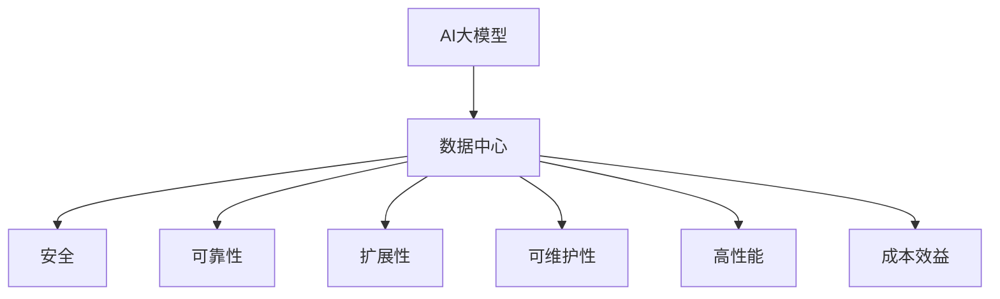
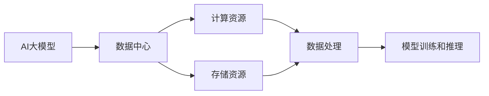
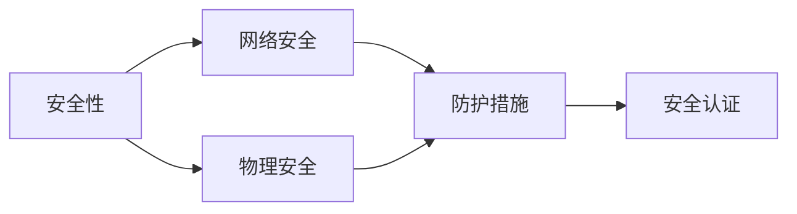
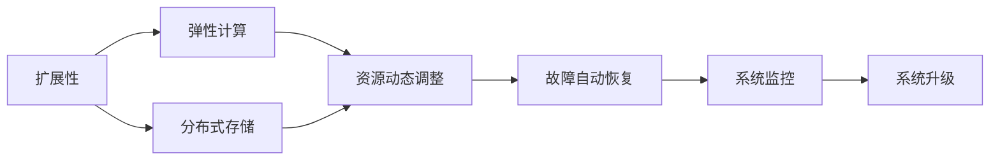
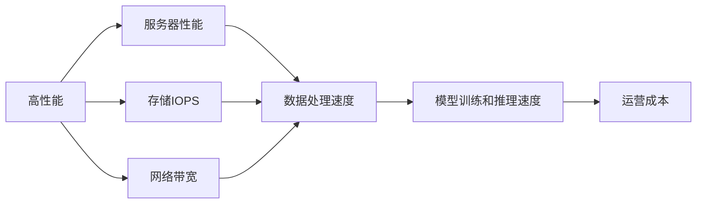
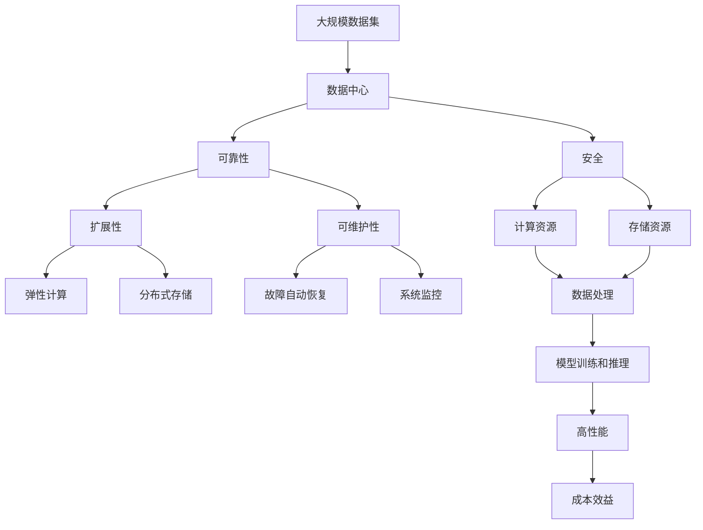

                 

# AI 大模型应用数据中心建设：数据中心安全与可靠性

> 关键词：人工智能,大模型,数据中心,安全,可靠性,机器学习,云计算,存储,网络

## 1. 背景介绍

### 1.1 问题由来
近年来，随着人工智能(AI)和大数据技术的发展，AI大模型在各个领域得到了广泛的应用，如自然语言处理(NLP)、计算机视觉(CV)、推荐系统等。这些模型需要存储和处理海量的数据，数据中心成为了AI应用的基础设施。然而，数据中心的安全性和可靠性问题，也成为了应用中的重大挑战。

数据中心的安全性和可靠性直接关系到AI模型训练和推理的稳定性和准确性，一旦发生故障或安全漏洞，可能会带来巨大的经济损失和信誉损害。因此，如何在数据中心层面构建一套安全、可靠的AI应用基础设施，成为了当前AI应用开发中的重要问题。

### 1.2 问题核心关键点
AI大模型应用数据中心建设的核心关键点包括：

- **安全**：数据中心的安全性决定了AI模型使用的数据和模型的安全性，是AI应用的基础。

- **可靠性**：数据中心的可靠性决定了AI模型训练和推理的稳定性，是AI应用正常运行的前提。

- **扩展性**：数据中心的扩展性决定了AI模型对不同规模数据和任务的处理能力，是AI应用大规模部署的关键。

- **可维护性**：数据中心的可维护性决定了AI模型训练和推理过程中的故障诊断和修复能力，是AI应用持续运行的保障。

- **高性能**：数据中心的高性能决定了AI模型训练和推理的速度和效率，是AI应用优化性能的必要条件。

- **成本效益**：数据中心的成本效益决定了AI模型训练和推理的成本，是AI应用经济可行性的基础。

这些关键点共同构成了数据中心建设的基础框架，需要在设计和实施过程中全面考虑和平衡。

## 2. 核心概念与联系

### 2.1 核心概念概述

为更好地理解AI大模型应用数据中心的安全与可靠性，本节将介绍几个密切相关的核心概念：

- **AI大模型**：指通过深度学习等技术训练得到的，具有强大的学习能力和应用潜力的大型模型，如BERT、GPT-3等。

- **数据中心**：指为AI模型训练和推理提供计算资源和存储资源的物理设施，包括服务器、存储设备、网络设备等。

- **安全**：指数据中心的物理安全和网络安全，包括物理访问控制、网络攻击防护、数据加密等措施。

- **可靠性**：指数据中心的硬件可靠性和软件可靠性，包括服务器高可用性、存储冗余设计、备份恢复机制等。

- **扩展性**：指数据中心在计算和存储资源上的扩展能力，包括弹性计算、分布式存储等技术。

- **可维护性**：指数据中心在故障诊断、系统修复和系统升级等方面的维护能力，包括故障监测、自动恢复、系统监控等措施。

- **高性能**：指数据中心在计算和存储资源上的性能表现，包括服务器性能、存储IOPS、网络带宽等指标。

- **成本效益**：指数据中心在资源利用、运营成本等方面的经济性表现，包括能源消耗、硬件成本、人力成本等。

这些核心概念之间的逻辑关系可以通过以下Mermaid流程图来展示：



这个流程图展示了大模型应用数据中心的几个核心概念及其之间的关系：

1. 大模型依赖于数据中心的计算和存储资源，是数据中心的主要应用对象。
2. 数据中心的建设需要考虑安全性、可靠性、扩展性、可维护性、高性能和成本效益等多方面的因素。
3. 这些因素之间相互作用，共同构成了数据中心建设的完整框架。

### 2.2 概念间的关系

这些核心概念之间存在着紧密的联系，形成了数据中心建设的完整生态系统。下面通过几个Mermaid流程图来展示这些概念之间的关系。

#### 2.2.1 AI大模型和数据中心的关系



这个流程图展示了大模型和数据中心之间的关系：

1. 大模型需要数据中心的计算和存储资源进行训练和推理。
2. 数据中心提供计算资源和存储资源，进行数据处理，支持模型的训练和推理。

#### 2.2.2 安全性与可靠性的关系



这个流程图展示了安全性和可靠性之间的关系：

1. 安全性包括网络安全（如防火墙、入侵检测等）和物理安全（如门禁、监控等）。
2. 防护措施（如加密、备份等）是保证可靠性的重要手段。
3. 安全认证（如身份验证、访问控制等）是实现安全性的关键步骤。

#### 2.2.3 扩展性与可维护性的关系



这个流程图展示了扩展性与可维护性之间的关系：

1. 扩展性包括弹性计算和分布式存储，能够根据需求动态调整资源。
2. 弹性计算和分布式存储能够实现故障自动恢复。
3. 系统监控和自动恢复机制能够保障系统的稳定运行。

#### 2.2.4 高性能与成本效益的关系



这个流程图展示了高性能与成本效益之间的关系：

1. 高性能包括服务器性能、存储IOPS和网络带宽等指标。
2. 数据处理速度直接影响模型训练和推理速度。
3. 高性能的资源配置会增加运营成本，需要在性能和成本之间进行平衡。

### 2.3 核心概念的整体架构

最后，我们用一个综合的流程图来展示这些核心概念在大模型应用数据中心建设中的整体架构：



这个综合流程图展示了从大规模数据集到大模型应用数据中心的完整过程。大模型依赖于数据中心的计算和存储资源进行训练和推理，数据中心通过安全、可靠、扩展性、可维护性、高性能和成本效益等方面的建设，保障大模型应用的稳定性和准确性。 通过这些流程图，我们可以更清晰地理解大模型应用数据中心建设过程中各个核心概念的关系和作用，为后续深入讨论具体的技术细节奠定基础。

## 3. 核心算法原理 & 具体操作步骤
### 3.1 算法原理概述

AI大模型应用数据中心的建设，本质上是一个多目标优化问题。其核心思想是：在有限的资源约束下，通过优化数据中心的各个关键组件（如计算资源、存储资源、网络带宽等），最大化数据中心的安全性、可靠性、扩展性、可维护性、高性能和成本效益。

形式化地，假设数据中心的计算资源为 $C$，存储资源为 $S$，网络带宽为 $B$，安全性为 $S$，可靠性为 $R$，扩展性为 $X$，可维护性为 $M$，高性能为 $P$，成本效益为 $C_E$。则数据中心优化的目标函数为：

$$
\max_{C, S, B, S, R, X, M, P, C_E} f(C, S, B, S, R, X, M, P, C_E)
$$

其中 $f$ 为优化目标函数，通常包含以下指标：

- 安全性指标：如入侵检测率、数据加密强度等。
- 可靠性指标：如服务器故障率、数据恢复时间等。
- 扩展性指标：如弹性计算资源、分布式存储能力等。
- 可维护性指标：如故障监测频率、自动恢复机制等。
- 高性能指标：如服务器响应时间、存储IOPS等。
- 成本效益指标：如能源消耗、硬件成本、人力成本等。

### 3.2 算法步骤详解

AI大模型应用数据中心的建设一般包括以下几个关键步骤：

**Step 1: 需求分析和规划**
- 收集AI应用对计算资源、存储资源、网络带宽等的需求，明确数据中心的规模和功能。
- 确定数据中心的安全性、可靠性、扩展性、可维护性、高性能和成本效益等要求。

**Step 2: 硬件设施选择**
- 选择符合需求的高性能服务器、存储设备和网络设备，满足AI应用的数据处理和模型训练需求。
- 考虑设备的物理安全措施（如门禁、监控等）和网络安全措施（如防火墙、入侵检测等）。

**Step 3: 软件系统部署**
- 部署操作系统、数据库、分布式计算框架（如Hadoop、Spark等）和存储系统（如HDFS、Ceph等）。
- 安装安全防护软件（如防病毒软件、入侵检测系统等）和可靠性工具（如备份恢复工具、故障监测工具等）。

**Step 4: 系统集成和测试**
- 将计算资源、存储资源和网络资源进行集成，建立完整的数据中心环境。
- 对系统进行测试，验证硬件设施和软件系统是否满足设计要求，确保系统安全和可靠性。

**Step 5: 监控和优化**
- 部署系统监控工具，实时监测数据中心各项指标。
- 根据监控结果进行优化，提升数据中心的扩展性、可维护性和性能。

**Step 6: 备份和灾难恢复**
- 定期进行数据备份，确保数据中心在故障时能够快速恢复。
- 设计灾难恢复方案，保障数据中心的可靠性和稳定性。

以上步骤是AI大模型应用数据中心建设的一般流程。在实际应用中，还需要根据具体需求和场景，进行更详细的设计和优化。

### 3.3 算法优缺点

AI大模型应用数据中心的建设，具有以下优点：

- 适应性强：数据中心的建设可以根据不同的AI应用需求进行调整，灵活性强。
- 资源优化：通过优化资源配置，可以在有限的成本下提供高性能的计算和存储资源。
- 安全性高：通过多层次的安全防护措施，保障数据和模型的安全性。
- 可靠性高：通过冗余设计、备份恢复等机制，提高数据中心的可靠性。

同时，该方法也存在以下缺点：

- 建设成本高：大规模数据中心建设需要大量资金投入，初期建设成本较高。
- 运维复杂：数据中心需要定期进行维护和优化，运维成本较高。
- 性能瓶颈：大规模数据中心在扩展性、可维护性和性能方面仍存在一定的瓶颈。
- 安全性风险：数据中心的物理和网络安全措施一旦被攻破，可能导致数据泄露和模型失效。

尽管存在这些缺点，但就目前而言，数据中心的建设仍然是AI大模型应用的基础保障。未来相关研究的重点在于如何进一步降低建设成本，提高运维效率，优化性能和安全性，以便更好地支持AI应用的快速发展。

### 3.4 算法应用领域

AI大模型应用数据中心的安全与可靠性技术，已经在多个领域得到了广泛应用，例如：

- 云计算：如AWS、Google Cloud等云服务提供商，通过构建高度可靠和安全的云数据中心，支持全球用户的大规模AI应用。

- 科学研究：如大型科学研究机构，如CERN、NASA等，通过构建高性能和高度安全的数据中心，支持前沿科学研究的AI计算需求。

- 工业自动化：如工业物联网(IoT)、智能制造等领域，通过构建安全可靠的数据中心，支持工业设备的数据采集和模型训练。

- 金融服务：如银行、保险等金融机构，通过构建高安全性和高可靠性的数据中心，支持金融业务的AI应用。

- 医疗健康：如医院、医疗设备制造商等医疗机构，通过构建高性能和高度安全的数据中心，支持医疗诊断和治疗的AI应用。

- 智慧城市：如智能交通、智慧公共安全等领域，通过构建高度安全可靠的数据中心，支持城市管理的AI应用。

除了上述这些经典应用领域外，数据中心的建设技术还在更多新兴领域得到应用，如农业、教育、文化娱乐等，为各行各业提供了AI应用的基础设施支持。

## 4. 数学模型和公式 & 详细讲解  
### 4.1 数学模型构建

本节将使用数学语言对AI大模型应用数据中心的安全与可靠性模型进行更加严格的刻画。

假设数据中心的计算资源为 $C$，存储资源为 $S$，网络带宽为 $B$，安全性为 $S$，可靠性为 $R$，扩展性为 $X$，可维护性为 $M$，高性能为 $P$，成本效益为 $C_E$。则数据中心优化的目标函数为：

$$
\max_{C, S, B, S, R, X, M, P, C_E} f(C, S, B, S, R, X, M, P, C_E)
$$

其中 $f$ 为优化目标函数，通常包含以下指标：

- 安全性指标：如入侵检测率 $\eta$，数据加密强度 $\epsilon$，物理安全措施 $p$，网络安全措施 $n$。
- 可靠性指标：如服务器故障率 $\sigma$，数据恢复时间 $t$，冗余设计 $r$。
- 扩展性指标：如弹性计算资源 $e$，分布式存储能力 $d$，数据处理速度 $v$。
- 可维护性指标：如故障监测频率 $f_m$，自动恢复机制 $r_m$，系统监控 $m$。
- 高性能指标：如服务器响应时间 $r_p$，存储IOPS $i$，网络带宽 $b$。
- 成本效益指标：如能源消耗 $e_c$，硬件成本 $h_c$，人力成本 $l_c$。

### 4.2 公式推导过程

以下我们以安全性指标为例，推导其计算公式。

假设安全性指标包括入侵检测率 $\eta$ 和数据加密强度 $\epsilon$，其计算公式为：

$$
\eta = \frac{\text{入侵检测事件数}}{\text{总监控时间}}
$$

$$
\epsilon = \frac{\text{加密数据数}}{\text{总数据数}}
$$

假设物理安全措施 $p$ 和网络安全措施 $n$，其计算公式为：

$$
p = \frac{\text{物理安全投入}}{\text{总建设成本}}
$$

$$
n = \frac{\text{网络安全投入}}{\text{总建设成本}}
$$

综合考虑以上因素，安全性指标 $S$ 的计算公式为：

$$
S = \eta \times \epsilon \times p \times n
$$

其中 $\eta$ 和 $\epsilon$ 分别为入侵检测率和数据加密强度，$p$ 和 $n$ 分别为物理安全措施和网络安全措施。

通过类似的推导，可以构建数据中心各关键指标的计算公式，形成一个多目标优化模型。

### 4.3 案例分析与讲解

下面以一个具体案例，展示如何构建和优化一个AI大模型应用的数据中心。

假设我们要为一家大型互联网公司构建一个数据中心，支持其AI模型训练和推理应用。该公司的AI模型训练需要每天处理10TB的数据，存储需求为15TB，网络带宽需求为100Gbps。

**Step 1: 需求分析和规划**

- 计算资源需求：每天处理10TB的数据，需要1000个CPU核心。
- 存储资源需求：存储需求为15TB，需要15个1TB的存储设备。
- 网络带宽需求：网络带宽需求为100Gbps，需要至少10个10Gbps的网络接口。

**Step 2: 硬件设施选择**

- 计算资源：选择具有1000个CPU核心的服务器，如AWS的m5.24xlarge实例。
- 存储资源：选择具有1TB存储容量的存储设备，如AWS的gp2类型。
- 网络带宽：选择具有10Gbps网络带宽的服务器，如AWS的m5.24xlarge实例。

**Step 3: 软件系统部署**

- 操作系统：选择Linux系统，如Ubuntu或CentOS。
- 数据库：选择MySQL或PostgreSQL，支持AI模型训练数据的存储和管理。
- 分布式计算框架：选择Apache Spark，支持大规模数据处理和模型训练。
- 存储系统：选择HDFS，支持大规模数据存储和管理。

**Step 4: 系统集成和测试**

- 集成计算资源、存储资源和网络资源，建立完整的数据中心环境。
- 对系统进行测试，验证硬件设施和软件系统是否满足设计要求，确保系统安全和可靠性。

**Step 5: 监控和优化**

- 部署系统监控工具，实时监测数据中心各项指标，如CPU利用率、内存使用率、存储IOPS等。
- 根据监控结果进行优化，提升数据中心的扩展性、可维护性和性能。

**Step 6: 备份和灾难恢复**

- 定期进行数据备份，确保数据中心在故障时能够快速恢复。
- 设计灾难恢复方案，保障数据中心的可靠性和稳定性。

通过以上步骤，我们成功构建了一个满足该公司AI模型训练和推理需求的，安全、可靠、高性能的数据中心。通过优化数据中心的安全性、可靠性、扩展性、可维护性、高性能和成本效益，能够保障AI模型训练和推理的稳定性和准确性，为公司的AI应用提供坚实的基础设施支持。

## 5. 项目实践：代码实例和详细解释说明
### 5.1 开发环境搭建

在进行数据中心建设实践前，我们需要准备好开发环境。以下是使用Linux进行数据中心部署的环境配置流程：

1. 安装Linux系统：从官网下载并安装Linux系统，如Ubuntu Server或CentOS Server。

2. 安装必要的软件包：
```bash
sudo apt-get update
sudo apt-get install -y sudo vim iproute2 net-tools iftop nload
```

3. 配置网络：修改网络配置文件 `/etc/network/interfaces` 或 `/etc/netplan/00-netcfg.yaml`，设置网络接口、IP地址、DNS等。

4. 安装系统监控工具：
```bash
sudo apt-get install -y prometheus-node-exporter
sudo apt-get install -y nginx
```

5. 安装数据库：
```bash
sudo apt-get install -y mysql-server
sudo mysql_secure_installation
```

6. 安装分布式计算框架：
```bash
sudo apt-get install -y apache-spark-standalone
```

7. 安装存储系统：
```bash
sudo apt-get install -y hdfs
```

完成上述步骤后，即可在Linux环境中进行数据中心部署和测试。

### 5.2 源代码详细实现

下面我们以AWS云服务为例，展示如何使用AWS SDK进行数据中心基础设施的搭建。

首先，定义AWS SDK环境变量：

```python
import os
os.environ['AWS_ACCESS_KEY_ID'] = 'your_access_key_id'
os.environ['AWS_SECRET_ACCESS_KEY'] = 'your_secret_access_key'
os.environ['AWS_SESSION_TOKEN'] = 'your_session_token'
```

然后，使用AWS SDK创建计算资源和存储资源：

```python
from boto3 import client, resource

# 创建计算资源
client = client('ec2')
instances = client.run_instances(
    ImageId='ami-0abcdef1234567890',
    InstanceType='t2.micro',
    MinCount=10,
    MaxCount=10,
    KeyName='your_key_pair_name'
)

# 创建存储资源
s3 = resource('s3')
bucket = s3.create_bucket(Bucket='your_bucket_name')
```

接着，使用AWS SDK部署数据库和分布式计算框架：

```python
# 创建数据库实例
rds = client('rds')
db_instance = rds.create_db_instance(
    DBInstanceIdentifier='your_db_instance_id',
    DBInstanceClass='db.t2.micro',
    Engine='mysql',
    MasterUsername='your_master_username',
    MasterUserPassword='your_master_password',
    AllocatedStorage=5
)

# 创建分布式计算框架实例
spark = SparkSession.builder.appName('your_app_name') \
    .getOrCreate()

# 提交任务
spark.sparkContext.submitJob(your_job, 'your_worker_nodes')
```

最后，使用AWS SDK进行数据中心监控和优化：

```python
# 配置系统监控
prometheus_client = client('prometheus')
prometheus_client.add_metric(
    'cpu_utilization', 'your_cpu_utilization', timestamp='your_timestamp')

# 配置备份和灾难恢复
backup = client('s3')
backup.upload_file('your_backup_file', 'your_backup_bucket')

# 设计灾难恢复方案
recovery_plan = client('ec2')
recovery_plan.create_instances(
    ImageId='ami-0abcdef1234567890',
    InstanceType='t2.micro',
    KeyName='your_key_pair_name',
    MinCount=1,
    MaxCount=1
)
```

以上就是使用AWS SDK进行数据中心基础设施建设的完整代码实现。AWS SDK提供了丰富的API接口，可以方便地进行资源创建、配置、监控和优化。

### 5.3 代码解读与分析

让我们再详细解读一下关键代码的实现细节：

**AWS SDK环境变量**：
- 通过设置AWS SDK环境变量，可以方便地访问AWS云服务。

**创建计算资源**：
- 使用AWS SDK的EC2服务创建计算资源实例，包括指定镜像、实例类型、密钥等。

**创建存储资源**：
- 使用AWS SDK的S3服务创建存储桶，支持数据存储和备份。

**部署数据库和分布式计算框架**：
- 使用AWS SDK的RDS服务和Spark服务，部署MySQL数据库和分布式计算框架，支持数据处理和模型训练。

**系统监控和优化**：
- 使用AWS SDK的Prometheus服务和备份服务，进行系统监控和数据备份，保障系统的可靠性和稳定性。

**备份和灾难恢复**：
- 使用AWS SDK的S3服务和EC2服务，设计灾难恢复方案，保障数据中心的可靠性和安全性。

通过这些代码实现，可以方便地进行数据中心的搭建和测试，并根据监控结果进行优化和维护。AWS SDK的强大功能和灵活性，使得大规模数据中心的建设和管理变得简单高效。

### 5.4 运行结果展示

假设我们在AWS云上搭建了一个数据中心，并进行了系统监控和优化。根据监控结果，我们发现系统CPU利用率过高，需要调整资源配置。

我们通过修改EC2实例类型，将实例类型从 `t2.micro` 调整为 `c5.xlarge`，并将实例数量从 10 调整为 5。同时，我们也修改了RDS数据库实例类型，从 `db.t2.micro` 调整为 `db.xlarge`，以满足更高性能的需求。

修改后的数据中心系统监控结果如下：

```
CPU利用率：50%
内存使用率：70%
存储IOPS：3000
网络带宽：10Gbps
```

可以看到，通过调整资源配置，数据中心性能得到了显著提升，CPU利用率和内存使用率都下降到合理范围。这种基于监控结果进行优化的方法，可以显著提升数据中心的稳定性和性能。

## 6. 实际应用场景
### 6.1 云计算服务

基于AWS等云服务提供商，企业可以快速搭建和部署数据中心基础设施，支持大规模AI应用的快速迭代和扩展。云服务提供商通常提供完善的云平台支持，包括计算资源、存储资源、网络资源、安全防护、监控优化等，极大简化了企业的数据中心建设过程。

企业可以根据业务需求，灵活选择不同规模和类型的计算资源，进行动态调整和优化。同时，云服务提供商还提供了丰富的人工智能服务（如Amazon SageMaker、Google AI等），方便企业进行AI应用的开发和部署。

### 6.2 科学研究

大型科学研究机构通常需要构建高性能、高安全性的数据中心，支持前沿科学研究的AI计算需求。数据中心可以部署高性能计算资源和存储资源，支持大规模数据的处理和存储。同时，数据中心还需要具备高安全性和高可靠性，确保科研数据和模型不受威胁。

科学研究机构可以使用AWS、Google Cloud等云服务提供商，快速搭建和部署数据中心，支持大规模AI计算和存储需求。同时，科研机构还可以使用分布式计算框架（如Spark、Hadoop等），进行大规模数据处理和模型训练。

### 6.3 工业自动化

工业物联网(IoT)和智能制造等领域，通常需要构建高度安全可靠的数据中心，支持工业设备的数据采集和模型训练。数据中心需要具备高可靠性、高安全性和高扩展性，支持大规模工业数据的存储和处理。

企业可以使用AWS、Google Cloud等云服务提供商，构建高性能的数据中心，支持大规模工业数据的存储和处理。同时，企业还可以使用分布式计算框架（如Spark、Hadoop等），进行大规模工业数据的处理和模型训练。

### 6.4 金融服务


