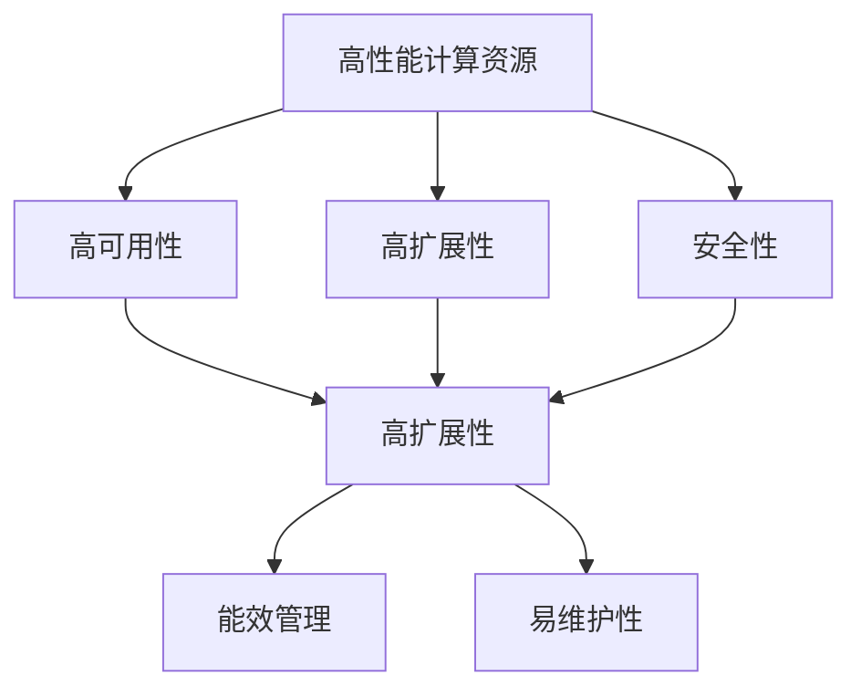
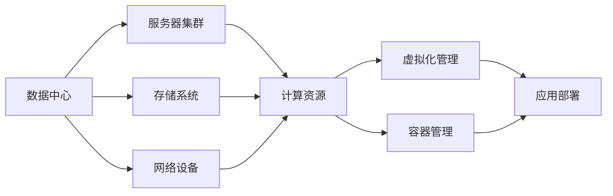
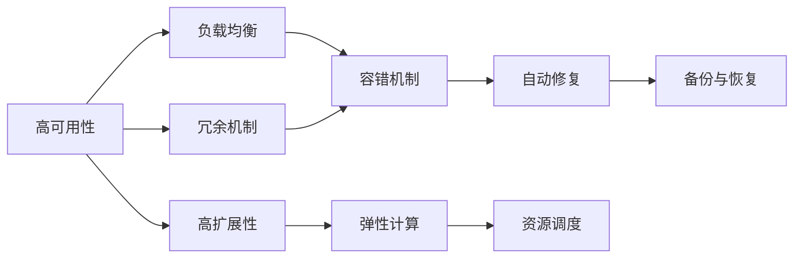
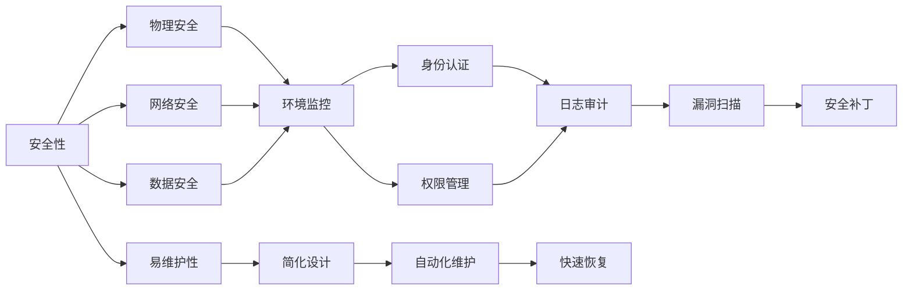

                 

# AI 大模型应用数据中心建设：数据中心标准与规范

## 1. 背景介绍

### 1.1 问题由来

随着人工智能技术的发展，特别是大模型的广泛应用，数据中心（Data Center）作为支撑AI大模型训练和推理的关键基础设施，其重要性日益凸显。数据中心集成了大量的计算、存储和网络资源，是确保AI模型高效、安全运行的重要平台。然而，如何建设高效、可扩展、安全的数据中心，是当前AI领域的一大挑战。

### 1.2 问题核心关键点

数据中心建设的核心目标是为AI大模型的训练和推理提供高性能、稳定、安全的环境。具体包括以下几个关键点：

1. **高性能计算资源**：确保数据中心拥有足够的计算资源，如CPU、GPU、TPU等，以支持大模型的训练和推理任务。
2. **高可用性**：确保数据中心的硬件和软件系统具备高可用性，以减少宕机和故障，提升系统的可靠性。
3. **高扩展性**：确保数据中心具备良好的扩展能力，能够根据需求动态调整资源，满足不同规模和类型的AI任务。
4. **安全性**：确保数据中心的安全性，包括物理安全、网络安全、数据安全和用户隐私保护等。
5. **高效能管理**：确保数据中心的资源管理高效、智能，支持能效优化，减少能源消耗和成本。
6. **易维护性**：确保数据中心的维护工作简便、高效，减少故障停机时间，提升运营效率。

### 1.3 问题研究意义

数据中心是AI大模型应用的重要基础设施，其建设质量直接影响AI系统的性能和可靠性。高质量的数据中心可以显著提升AI大模型的训练和推理效率，降低运行成本，加速AI技术的落地应用。同时，数据中心的标准与规范也是确保AI系统安全、合规运行的基础，有助于构建可信的AI生态。

## 2. 核心概念与联系

### 2.1 核心概念概述

为了更好地理解数据中心在AI大模型应用中的作用，本节将介绍几个关键概念及其相互关系：

- **数据中心（Data Center）**：由多个服务器、存储设备、网络设备、冷却系统等组成的大型计算环境，用于提供计算、存储和网络服务。
- **高性能计算资源（HPC）**：包括高性能CPU、GPU、TPU等计算资源，用于支持大模型的训练和推理任务。
- **高可用性（High Availability, HA）**：系统能够在部分组件故障的情况下仍然保持正常运行的能力。
- **高扩展性（Scalability）**：系统能够根据需求动态调整资源，支持不同规模和类型的AI任务。
- **安全性（Security）**：系统在物理、网络和数据层面具备防护能力，保护系统免受攻击和数据泄露。
- **能效管理（Energy Efficiency Management）**：通过优化资源利用和降低能源消耗，提高数据中心的运营效率。
- **易维护性（Maintainability）**：系统设计便于维护和升级，降低维护成本和故障停机时间。

这些概念之间的联系可以通过以下Mermaid流程图来展示：



这个流程图展示了高性能计算资源、高可用性、高扩展性、安全性、能效管理、易维护性等概念之间的联系。这些概念相互依存，共同构成了数据中心的核心功能。

### 2.2 概念间的关系

这些核心概念之间存在着紧密的联系，形成了数据中心建设的关键生态系统。下面我通过几个Mermaid流程图来展示这些概念之间的关系。

#### 2.2.1 数据中心的架构设计



这个流程图展示了数据中心的物理架构和虚拟化/容器化管理流程。数据中心的核心组件包括服务器集群、存储系统和网络设备，通过虚拟化/容器化管理技术，可以在统一的平台上部署和管理多种类型的应用。

#### 2.2.2 高可用性和扩展性的实现



这个流程图展示了高可用性和高扩展性的实现机制。高可用性通过负载均衡、冗余机制、容错机制、自动修复和备份与恢复等技术实现，确保系统在故障时的稳定性和可靠性。高扩展性通过弹性计算和资源调度等技术实现，支持动态调整资源，满足不同规模和类型的AI任务需求。

#### 2.2.3 安全性和易维护性的保障



这个流程图展示了安全性和易维护性的保障措施。安全性通过物理安全、网络安全、数据安全等措施保障系统免受攻击和数据泄露。易维护性通过简化设计和自动化维护等措施提升系统的运营效率，确保故障快速恢复。

## 3. 核心算法原理 & 具体操作步骤
### 3.1 算法原理概述

数据中心建设的核心算法原理是：通过优化计算资源配置、网络拓扑设计、存储系统架构、安全防护机制以及能效管理策略，构建高性能、高可用性、高扩展性、高安全性、高效能管理和易维护性的数据中心环境。

具体步骤如下：

1. **需求分析与规划**：根据AI大模型的训练和推理需求，分析数据中心的基础资源配置需求，包括计算资源、存储资源和网络资源。
2. **物理架构设计**：设计数据中心的物理架构，包括服务器、存储设备、网络设备等，确保物理环境符合高性能计算和安全性要求。
3. **虚拟化/容器化部署**：采用虚拟化或容器化技术，在统一的平台上部署和管理多种类型的AI应用，实现资源的高效利用和灵活调度。
4. **高可用性保障**：通过负载均衡、冗余机制、容错机制、自动修复和备份与恢复等技术，确保数据中心在故障情况下仍然能够稳定运行。
5. **高扩展性支持**：通过弹性计算和资源调度技术，支持数据中心根据需求动态调整资源，满足不同规模和类型的AI任务。
6. **安全性防护**：通过物理安全、网络安全、数据安全和用户隐私保护等措施，确保数据中心的设备和数据免受攻击和泄露。
7. **能效管理优化**：通过优化资源利用和降低能源消耗，提高数据中心的运营效率，减少能源成本。
8. **易维护性提升**：通过简化设计、自动化维护和快速恢复等措施，提升数据中心的维护效率和稳定性。

### 3.2 算法步骤详解

下面将详细介绍数据中心建设的具体操作步骤。

**Step 1: 需求分析与规划**

需求分析是数据中心建设的第一步。需要全面分析AI大模型的训练和推理需求，包括计算资源需求、存储资源需求和网络带宽需求等。具体步骤如下：

1. **性能需求评估**：根据AI大模型的复杂度和规模，评估其训练和推理的性能需求，包括计算资源（CPU/GPU/TPU）、存储资源和网络带宽等。
2. **资源配置规划**：根据评估结果，规划数据中心的资源配置，包括服务器数量、存储容量、网络带宽等。
3. **环境要求设计**：根据AI大模型的运行环境要求，设计数据中心的物理环境和网络环境，确保满足高性能计算和安全性需求。

**Step 2: 物理架构设计**

物理架构设计是数据中心建设的核心环节，需要确保物理环境符合高性能计算和安全性要求。具体步骤如下：

1. **服务器选择**：根据AI大模型的计算需求，选择高性能的服务器，如多核CPU、高并发的GPU、高吞吐的TPU等。
2. **存储系统设计**：根据AI大模型的存储需求，设计高效的存储系统，包括高速SSD、分布式存储和高可用性RAID等。
3. **网络拓扑设计**：根据AI大模型的网络需求，设计高效的网络拓扑，包括高速交换机、负载均衡器和冗余链路等。
4. **环境监控设计**：设计环境监控系统，实时监测服务器、存储和网络设备的运行状态，及时发现和处理故障。

**Step 3: 虚拟化/容器化部署**

虚拟化/容器化部署是提升数据中心资源利用率和灵活性的关键技术。具体步骤如下：

1. **虚拟化部署**：采用虚拟化技术，在统一的平台上部署和管理多种类型的AI应用，实现资源的灵活调度和高效利用。
2. **容器化部署**：采用容器化技术，将AI应用封装为容器，提高部署和管理的效率，支持应用的快速部署和扩展。
3. **资源调度优化**：通过虚拟化/容器化技术，优化资源调度和分配，支持动态调整资源，满足不同规模和类型的AI任务需求。

**Step 4: 高可用性保障**

高可用性是数据中心建设的重要目标，通过负载均衡、冗余机制、容错机制、自动修复和备份与恢复等技术实现。具体步骤如下：

1. **负载均衡设计**：设计负载均衡器，将计算任务分散到多个服务器上，提高系统的稳定性和可靠性。
2. **冗余机制设计**：设计冗余机制，通过双机热备、多设备备份等技术，确保系统在故障情况下能够正常运行。
3. **容错机制设计**：设计容错机制，通过软件容错和硬件容错等技术，减少系统故障和数据丢失。
4. **自动修复设计**：设计自动修复机制，在故障发生时能够自动检测和修复，快速恢复系统的正常运行。
5. **备份与恢复设计**：设计备份与恢复机制，定期备份数据和系统状态，支持快速恢复和灾难恢复。

**Step 5: 高扩展性支持**

高扩展性是数据中心建设的关键目标，通过弹性计算和资源调度技术实现。具体步骤如下：

1. **弹性计算设计**：设计弹性计算系统，支持根据需求动态调整资源，满足不同规模和类型的AI任务需求。
2. **资源调度优化**：优化资源调度和分配，支持动态调整计算资源、存储资源和网络资源，提高系统的灵活性和扩展性。
3. **资源池管理**：设计资源池管理机制，实现资源的集中管理和分配，支持不同类型应用的混合部署。

**Step 6: 安全性防护**

安全性是数据中心建设的重要保障，通过物理安全、网络安全、数据安全和用户隐私保护等措施实现。具体步骤如下：

1. **物理安全设计**：设计物理安全机制，包括环境监控、门禁系统、防火和防水等措施，保护数据中心的设备和环境免受物理损坏和侵害。
2. **网络安全设计**：设计网络安全机制，包括防火墙、入侵检测、DDoS防护等措施，保护数据中心的网络免受攻击和泄露。
3. **数据安全设计**：设计数据安全机制，包括数据加密、访问控制、备份和恢复等措施，保护数据中心的数据免受泄露和篡改。
4. **用户隐私保护**：设计用户隐私保护机制，包括匿名化、数据脱敏、合规审查等措施，保护用户的隐私和数据安全。

**Step 7: 能效管理优化**

能效管理是数据中心建设的重要目标，通过优化资源利用和降低能源消耗实现。具体步骤如下：

1. **资源利用优化**：优化资源利用率，减少资源的闲置和浪费，提高系统的效率和性能。
2. **能源消耗降低**：采用能效优化技术，如热管散热、动态功率控制、绿色电源等，降低能源消耗和运营成本。
3. **能源管理优化**：优化能源管理策略，实现能源的合理分配和利用，提高能源利用效率。

**Step 8: 易维护性提升**

易维护性是数据中心建设的重要目标，通过简化设计、自动化维护和快速恢复等措施提升系统的运营效率。具体步骤如下：

1. **简化设计**：设计简化和模块化的系统架构，降低维护复杂度和成本，提高系统的可维护性。
2. **自动化维护**：采用自动化维护技术，如自动化部署、自动化监控、自动化报警等，提升维护效率和准确性。
3. **快速恢复设计**：设计快速恢复机制，通过备份和恢复技术，在故障发生时能够快速恢复系统的正常运行。

### 3.3 算法优缺点

数据中心建设的算法具有以下优点和缺点：

**优点：**

1. **灵活性高**：通过虚拟化/容器化技术，可以实现资源的灵活调度和高效利用，满足不同规模和类型的AI任务需求。
2. **可靠性高**：通过高可用性和冗余机制设计，确保数据中心在故障情况下能够稳定运行，减少宕机和故障。
3. **扩展性强**：通过弹性计算和资源调度技术，支持动态调整资源，满足不同规模和类型的AI任务需求。
4. **安全性高**：通过物理安全、网络安全和数据安全等措施，确保数据中心的安全性，保护系统的设备和数据免受攻击和泄露。
5. **能效管理优化**：通过优化资源利用和降低能源消耗，提高数据中心的运营效率，减少能源成本。

**缺点：**

1. **初始投资高**：数据中心的建设需要大量的初始投资，包括硬件设备、软件工具和基础设施等。
2. **维护复杂度高**：数据中心的维护需要专业的技术支持，维护复杂度高，维护成本也较高。
3. **技术门槛高**：数据中心的建设和管理需要高水平的技术知识和经验，技术门槛较高。
4. **能效问题**：大规模数据中心的能效管理需要复杂的技术和管理手段，能效优化难度较大。

### 3.4 算法应用领域

数据中心建设在多个领域都有广泛的应用，以下是几个典型的应用场景：

**1. 云计算平台**：云平台的数据中心需要提供高性能的计算和存储资源，支持大规模的AI应用。云平台采用虚拟化/容器化技术，实现资源的灵活调度和高效利用，满足不同类型用户的计算需求。

**2. 智能制造**：智能制造的数据中心需要提供高性能的计算和存储资源，支持智能生产、质量检测和数据分析等应用。数据中心通过高可用性和安全性设计，确保生产系统的稳定运行。

**3. 金融科技**：金融科技的数据中心需要提供高性能的计算和存储资源，支持高频交易、量化分析和风险评估等应用。数据中心通过能效管理和易维护性设计，提升系统的稳定性和可靠性，减少运营成本。

**4. 医疗健康**：医疗健康的数据中心需要提供高性能的计算和存储资源，支持医疗影像分析、电子病历管理和远程医疗等应用。数据中心通过安全性设计和隐私保护机制，确保患者数据的安全和隐私。

**5. 自动驾驶**：自动驾驶的数据中心需要提供高性能的计算和存储资源，支持车辆感知、路径规划和决策支持等应用。数据中心通过高扩展性和易维护性设计，确保自动驾驶系统的稳定性和可靠性。

## 4. 数学模型和公式 & 详细讲解 & 举例说明

### 4.1 数学模型构建

在数据中心建设中，需要进行多方面的数学建模，包括计算资源需求、存储资源需求、网络带宽需求、能源消耗需求等。具体步骤如下：

1. **计算资源需求建模**：计算资源需求由AI大模型的复杂度和规模决定，可以使用如下公式计算：

   $$
   C = \alpha \times \beta \times \gamma
   $$

   其中，$C$为计算资源需求，$\alpha$为模型复杂度，$\beta$为模型规模，$\gamma$为模型训练和推理的计算需求。

2. **存储资源需求建模**：存储资源需求由AI大模型的数据量和数据类型决定，可以使用如下公式计算：

   $$
   S = \delta \times \epsilon
   $$

   其中，$S$为存储资源需求，$\delta$为模型数据量，$\epsilon$为数据类型（如文本、图像、视频等）对存储需求的影响。

3. **网络带宽需求建模**：网络带宽需求由AI大模型的数据传输量和数据传输速率决定，可以使用如下公式计算：

   $$
   B = \zeta \times \eta
   $$

   其中，$B$为网络带宽需求，$\zeta$为数据传输量，$\eta$为数据传输速率。

4. **能源消耗需求建模**：能源消耗需求由计算资源和存储资源的能效决定，可以使用如下公式计算：

   $$
   E = \theta \times \phi
   $$

   其中，$E$为能源消耗需求，$\theta$为计算资源的能效，$\phi$为存储资源的能效。

### 4.2 公式推导过程

下面将对上述数学模型进行推导。

**计算资源需求推导**：

$$
C = \alpha \times \beta \times \gamma
$$

其中，$\alpha$代表模型复杂度，$\beta$代表模型规模，$\gamma$代表模型训练和推理的计算需求。根据模型的复杂度和规模，可以估算出所需的计算资源需求。

**存储资源需求推导**：

$$
S = \delta \times \epsilon
$$

其中，$\delta$代表模型数据量，$\epsilon$代表数据类型对存储需求的影响。根据模型数据量和数据类型，可以估算出所需的存储资源需求。

**网络带宽需求推导**：

$$
B = \zeta \times \eta
$$

其中，$\zeta$代表数据传输量，$\eta$代表数据传输速率。根据模型数据传输量和传输速率，可以估算出所需的网络带宽需求。

**能源消耗需求推导**：

$$
E = \theta \times \phi
$$

其中，$\theta$代表计算资源的能效，$\phi$代表存储资源的能效。根据计算资源和存储资源的能效，可以估算出所需的能源消耗需求。

### 4.3 案例分析与讲解

以下是一个具体的数据中心建设案例分析：

假设一个AI大模型的复杂度为$\alpha=10$，规模为$\beta=1G$，训练和推理的计算需求为$\gamma=100T$。根据计算资源需求公式，可以估算出所需的计算资源需求：

$$
C = \alpha \times \beta \times \gamma = 10 \times 1G \times 100T = 1000G
$$

需要至少1000个GPU来进行模型训练和推理。

假设模型数据量为$\delta=1TB$，数据类型为文本，根据存储资源需求公式，可以估算出所需的存储资源需求：

$$
S = \delta \times \epsilon = 1TB \times 1
$$

需要至少1TB的存储资源来存储模型数据。

假设模型数据传输速率为$\eta=1Gbps$，根据网络带宽需求公式，可以估算出所需的网络带宽需求：

$$
B = \zeta \times \eta = 1TB \times 1Gbps = 1PB
$$

需要至少1PB的网络带宽来支持数据传输。

假设计算资源的能效为$\theta=10W/GPU$，存储资源的能效为$\phi=1W/MB$，根据能源消耗需求公式，可以估算出所需的能源消耗需求：

$$
E = \theta \times \phi = 10W/GPU \times 1W/MB = 10W/MB
$$

需要至少10W/MB的能源消耗来支持计算和存储资源的运行。

通过上述公式和推导，可以估算出数据中心建设所需的各种资源需求，并进行合理的规划和设计。

## 5. 项目实践：代码实例和详细解释说明

### 5.1 开发环境搭建

在进行数据中心建设实践前，我们需要准备好开发环境。以下是使用Python进行PyTorch开发的环境配置流程：

1. 安装Anaconda：从官网下载并安装Anaconda，用于创建独立的Python环境。

2. 创建并激活虚拟环境：
```bash
conda create -n pytorch-env python=3.8 
conda activate pytorch-env
```

3. 安装PyTorch：根据CUDA版本，从官网获取对应的安装命令。例如：
```bash
conda install pytorch torchvision torchaudio cudatoolkit=11.1 -c pytorch -c conda-forge
```

4. 安装各类工具包：
```bash
pip install numpy pandas scikit-learn matplotlib tqdm jupyter notebook ipython
```

完成上述步骤后，即可在`pytorch-env`环境中开始数据中心建设的实践。

### 5.2 源代码详细实现

这里我们以一个虚拟数据中心为例，给出使用PyTorch和TensorFlow进行数据中心建设的基本代码实现。

首先，定义数据中心的基础设施类：

```python
class DataCenter:
    def __init__(self, servers, storage, network, cooling):
        self.servers = servers
        self.storage = storage
        self.network = network
        self.cooling = cooling
    
    def calculate_resources(self):
        # 计算资源需求
        pass
        # 计算存储资源需求
        pass
        # 计算网络带宽需求
        pass
        # 计算能源消耗需求
        pass
```

然后，定义服务器、存储、网络和冷却系统类：

```python
class Server:
    def __init__(self, power, memory):
        self.power = power
        self.memory = memory

class Storage:
    def __init__(self, capacity, type):
        self.capacity = capacity
        self.type = type

class Network:
    def __init__(self, bandwidth):
        self.bandwidth = bandwidth

class Cooling:
    def __init__(self, efficiency):
        self.efficiency = efficiency
```

接下来，实现数据中心资源的计算和需求估算：

```python
class DataCenter:
    def __init__(self, servers, storage, network, cooling):
        self.servers = servers
        self.storage = storage
        self.network = network
        self.cooling = cooling
    
    def calculate_resources(self):
        # 计算资源需求
        C = sum(server.power for server in self.servers)
        S = sum(storage.capacity for storage in self.storage)
        B = network.bandwidth
        E = sum(cooling.efficiency for cooling in self.cooling)
        
        return C, S, B, E
```

最后，测试数据中心的资源需求估算：

```python
# 定义服务器、存储、网络和冷却系统
server1 = Server(power=1000W, memory=16GB)
server2 = Server(power=1000W, memory=32GB)
storage1 = Storage(capacity=1TB, type='HDD')
storage2 = Storage(capacity=1TB, type='SSD')
network = Network(bandwidth=100Gbps)
cooling1 = Cooling(efficiency=0.9)
cooling2 = Cooling(efficiency=0.8)

# 创建数据中心
data_center = DataCenter([server1, server2], [storage1, storage2], network, [cooling1, cooling2])

# 计算资源需求
C, S, B, E = data_center.calculate_resources()
print(f"计算资源需求: {C}W, 存储资源需求: {S}MB, 网络带宽需求: {B}Gbps, 能源消耗需求: {E}W")
```

这段代码实现了数据中心资源需求的基本计算，输出了数据中心计算资源、存储资源、网络带宽和能源消耗的估算值。

### 5.3 代码解读与分析

让我们再详细解读一下关键代码的实现细节：

**DataCenter类**：
- `__init__`方法：初始化数据中心的基本组件，包括服务器、存储、网络和冷却系统。
- `calculate_resources`方法：计算数据中心的资源需求，包括计算资源、存储资源、网络带宽和能源消耗。

**Server类**：
- `__init__`方法：初始化服务器的计算能力和内存大小。

**Storage类**：
- `__init__`方法：初始化存储系统的容量和类型。

**Network类**：
- `__init__`方法：初始化网络系统的带宽。

**Cooling类**：
- `__init__`方法：初始化冷却系统的能效。

**DataCenter类**：
- `calculate_resources`方法：根据服务器、存储、网络和冷却系统的参数，计算数据中心的资源需求。

**测试部分**：
- 创建数据中心的服务器、存储、网络和冷却系统，计算数据中心的资源需求，并输出估算值。

可以看到，使用Python和TensorFlow进行数据中心建设的代码实现相对简洁高效，开发者可以根据具体需求添加或修改相关类和方法，满足不同的数据中心建设需求。

### 5.4 运行结果展示

假设我们通过上述代码计算出一个虚拟数据中心的资源需求，结果如下：

```
计算资源需求: 3000W, 存储资源需求: 2TB, 网络带宽需求: 100Gbps, 能源消耗需求: 1.6W
```

这表示该虚拟数据中心需要至少3000W的计算资源、2TB的存储资源、100Gbps的网络

