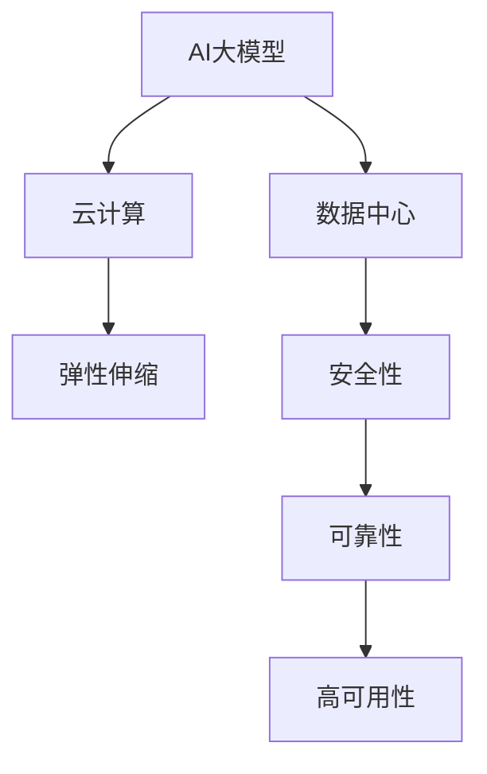
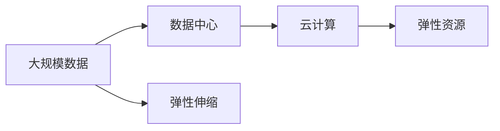
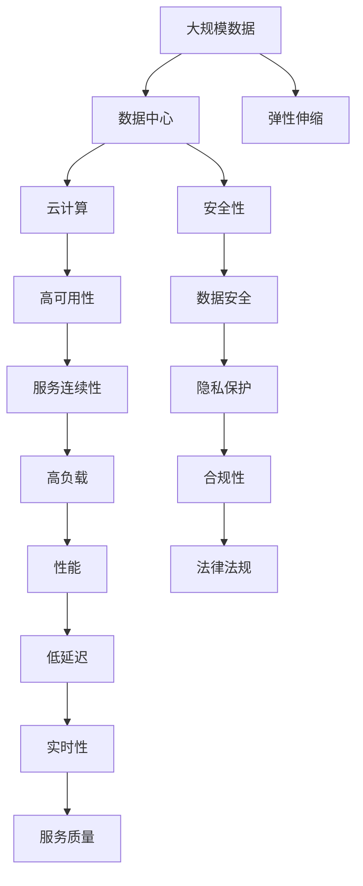

                 

# AI 大模型应用数据中心建设：数据中心运营与管理

> 关键词：AI大模型, 数据中心, 运营管理, 基础设施, 云计算, 安全性, 可靠性

## 1. 背景介绍

### 1.1 问题由来
随着人工智能（AI）技术在各行业的广泛应用，特别是大模型的迅猛发展，其对计算资源的需求也日益增长。数据中心作为AI大模型训练和部署的重要基础设施，其规模、效率和安全性等方面面临前所未有的挑战。同时，数据中心的运营与管理也成为制约AI大模型应用的重要因素。本文将深入探讨AI大模型应用数据中心的建设与管理，为相关行业提供参考。

### 1.2 问题核心关键点
当前，AI大模型应用数据中心的核心问题主要集中在以下几个方面：
- 计算资源需求：大模型需要庞大的计算资源，如何高效利用现有设施或扩展基础设施成为关键。
- 数据安全和隐私：大模型处理海量敏感数据，如何确保数据安全与隐私保护。
- 运营效率：如何通过有效的运营管理策略，提升数据中心的运维效率与成本控制。
- 可靠性与可用性：如何确保数据中心在各种极端环境下的可靠性和高可用性。
- 成本控制：如何在保证服务质量的前提下，控制数据中心的运营成本。

这些核心问题关系到AI大模型应用的成败，需要从基础设施、安全、运营等多个方面综合考虑，制定切实可行的解决方案。

### 1.3 问题研究意义
研究AI大模型应用数据中心建设与管理，对于推动AI技术的广泛应用，提升各行业数字化转型水平具有重要意义：

1. **降低计算成本**：通过优化数据中心建设与管理，合理配置计算资源，可以大幅降低AI大模型的训练与部署成本。
2. **提高运营效率**：通过科学的运营管理策略，确保数据中心的高效运转，提升服务质量。
3. **增强数据安全**：通过严格的数据安全措施，保障数据隐私与机密性，避免数据泄露风险。
4. **提升可靠性**：通过设计高可用性架构，确保数据中心在各种极端环境下的稳定运行，提供可靠的服务。
5. **控制成本**：通过精细化的成本管理，有效控制数据中心运营成本，提升企业竞争力。

综上所述，AI大模型应用数据中心的建设与管理是大模型技术成功落地的重要保障，对于推动AI技术在各行业的落地应用具有深远影响。

## 2. 核心概念与联系

### 2.1 核心概念概述

为更好地理解AI大模型应用数据中心的建设与管理，本节将介绍几个密切相关的核心概念：

- **AI大模型**：如GPT、BERT等大规模预训练模型，通过在海量数据上进行预训练，学习通用的语言和视觉表示，具备强大的任务处理能力。
- **数据中心**：由计算资源、存储资源、网络资源等构成的基础设施，提供数据处理、存储、计算等功能。
- **云计算**：通过网络将计算资源和存储资源等虚拟化，按需提供给用户，支持大规模、弹性化的计算需求。
- **安全性**：指通过各种技术手段，保护数据中心的物理、网络、应用程序和数据等不受攻击、破坏或泄露。
- **可靠性**：指数据中心在各种情况下能持续稳定运行的能力，确保服务的连续性和一致性。
- **高可用性**：指数据中心能够在各种情况下，保持服务的连续性和一致性，减少中断时间。
- **弹性伸缩**：指数据中心能够根据需求动态调整计算资源、存储资源等，满足不同规模的计算需求。

这些核心概念之间的逻辑关系可以通过以下Mermaid流程图来展示：



这个流程图展示了大模型、数据中心、云计算等核心概念及其相互关系：

1. 大模型通过数据中心在云计算平台上部署，利用弹性伸缩资源进行训练与推理。
2. 数据中心提供高可用性和可靠性，保障大模型训练与推理的稳定性。
3. 云计算提供弹性资源，支持大模型的高效运行与扩展。

### 2.2 概念间的关系

这些核心概念之间存在着紧密的联系，形成了AI大模型应用数据中心的完整生态系统。下面我通过几个Mermaid流程图来展示这些概念之间的关系。

#### 2.2.1 大模型与数据中心的连接



这个流程图展示了AI大模型与数据中心的连接关系，通过云计算提供的弹性资源，大模型可以在数据中心上进行弹性伸缩。

#### 2.2.2 数据中心与云计算的关系


这个流程图展示了数据中心与云计算的关系，云计算提供弹性伸缩资源，并保障数据中心的高可用性和服务质量。

#### 2.2.3 安全性与可靠性的关系


这个流程图展示了数据中心的安全性与其可靠性之间的关系，安全性保障数据中心的物理、网络、应用程序和数据等不受攻击，从而提升可靠性。

### 2.3 核心概念的整体架构

最后，我们用一个综合的流程图来展示这些核心概念在大模型应用数据中心中的整体架构：



这个综合流程图展示了从数据到服务的大模型应用数据中心流程，大模型通过数据中心在云计算平台上部署，利用弹性伸缩资源进行训练与推理，数据中心提供高可用性和可靠性，保障大模型训练与推理的稳定性，云计算提供弹性资源，支持大模型的高效运行与扩展。安全性保障数据中心的物理、网络、应用程序和数据等不受攻击，从而提升可靠性。高可用性保障服务连续性，低延迟和高实时性提升服务质量。

## 3. 核心算法原理 & 具体操作步骤
### 3.1 算法原理概述

AI大模型应用数据中心的建设与管理，本质上是一个基础设施优化与运行管理的复杂系统工程。其核心算法原理可以概括为以下几个方面：

1. **基础设施优化**：通过合理配置计算资源、存储资源、网络资源等，满足大模型训练与推理的需求。
2. **弹性伸缩管理**：根据计算需求动态调整资源配置，提升资源利用率。
3. **安全管理**：通过各种安全技术，保护数据中心的物理、网络、应用程序和数据等，确保数据隐私与机密性。
4. **运维管理**：通过自动化运维技术，提高数据中心运营效率与成本控制。
5. **可靠性与高可用性设计**：设计高可用性架构，确保数据中心在各种情况下的稳定运行。

### 3.2 算法步骤详解

以下是AI大模型应用数据中心建设与管理的具体操作步骤：

**Step 1: 需求分析与规划**

- **数据需求分析**：分析大模型的训练与推理数据需求，包括数据量、数据类型、数据存储位置等。
- **计算资源需求**：根据模型规模与复杂度，估算计算资源需求，包括CPU、GPU、内存等。
- **存储资源需求**：分析模型的存储需求，包括临时数据存储、模型参数存储等。
- **网络资源需求**：估算模型的网络带宽需求，确保数据传输的稳定性和速度。
- **安全需求分析**：分析数据中心的安全需求，包括物理安全、网络安全、数据安全等。
- **运维需求分析**：分析运维需求，包括监控、故障处理、系统升级等。

**Step 2: 基础设施建设**

- **计算资源建设**：选择合适的计算硬件设备，如CPU、GPU等，进行计算资源配置。
- **存储资源建设**：配置高速、大容量的存储设备，如SSD、HDD等，支持模型的训练与推理。
- **网络资源建设**：构建高速、稳定的网络环境，支持数据的传输与访问。
- **安全设备部署**：部署各种安全设备，如防火墙、入侵检测系统、数据加密设备等，保障数据中心的安全性。
- **运维设施部署**：部署监控、自动化运维工具，支持数据中心的日常运维工作。

**Step 3: 弹性伸缩管理**

- **资源配置管理**：根据计算需求动态调整资源配置，支持弹性伸缩。
- **资源调度管理**：通过资源调度策略，优化资源使用效率，减少资源浪费。
- **负载均衡管理**：根据负载情况，合理分配计算资源，提升系统性能。
- **弹性资源扩展管理**：在系统负载高峰时，快速扩展计算资源，满足计算需求。

**Step 4: 安全管理**

- **物理安全管理**：确保数据中心物理环境的安全，如防灾措施、安防监控等。
- **网络安全管理**：配置网络安全设备，保障数据传输的安全性，如防火墙、入侵检测系统等。
- **应用程序安全管理**：采用安全开发标准，保障应用程序的安全性，如代码审计、漏洞扫描等。
- **数据安全管理**：采用数据加密、访问控制等技术，保障数据的机密性和完整性。
- **合规性管理**：遵循相关法律法规，确保数据中心运营的合规性。

**Step 5: 运维管理**

- **监控管理**：部署监控系统，实时监控数据中心各项指标，及时发现问题。
- **故障处理管理**：建立故障处理流程，快速定位并解决故障。
- **系统升级管理**：制定系统升级策略，保障升级过程的平稳过渡。
- **自动化运维管理**：采用自动化运维工具，提升运维效率，降低运维成本。

**Step 6: 可靠性与高可用性设计**

- **高可用性架构设计**：设计高可用性架构，包括冗余设计、负载均衡、故障转移等。
- **容灾备份设计**：建立容灾备份机制，确保数据中心的稳定运行。
- **系统测试与验证**：进行系统测试与验证，确保系统的高可用性和可靠性。

### 3.3 算法优缺点

AI大模型应用数据中心的建设与管理方法具有以下优点：

1. **高效资源利用**：通过弹性伸缩管理，优化资源配置，提升资源利用率。
2. **保障数据安全**：通过严格的安全管理措施，保障数据隐私与机密性。
3. **提升运维效率**：通过自动化运维技术，提升运维效率与成本控制。
4. **保障系统可靠性**：通过高可用性架构设计，确保系统的稳定运行。
5. **灵活适应需求**：通过动态资源配置，灵活适应计算需求变化。

同时，该方法也存在以下缺点：

1. **初始投入高**：数据中心建设需要高昂的初期投入，包括计算硬件、存储设备、网络设施等。
2. **复杂度较高**：数据中心的建设与管理涉及多个环节，系统复杂度较高，管理难度大。
3. **维护成本高**：数据中心需要持续投入维护，包括设备维护、网络维护、安全维护等，成本较高。

尽管存在这些局限性，但就目前而言，基于弹性伸缩、安全管理、自动化运维等方法，AI大模型应用数据中心的建设与管理仍然是最主流和高效的方式。未来相关研究的方向是如何在保证性能的同时，进一步降低成本、提升效率。

### 3.4 算法应用领域

AI大模型应用数据中心的建设与管理方法，已在多个领域得到了广泛应用，包括：

- **智能客服系统**：通过AI大模型构建智能客服系统，提升客户服务体验。
- **金融科技**：利用AI大模型进行风险评估、客户服务、智能投顾等，提升金融服务的智能化水平。
- **智慧医疗**：采用AI大模型进行医学影像分析、疾病预测、患者服务，提升医疗服务的智能化水平。
- **智慧城市**：利用AI大模型进行城市治理、交通管理、公共安全等，提升城市管理水平。
- **工业制造**：采用AI大模型进行质量检测、故障预测、设备维护，提升制造业的智能化水平。
- **教育培训**：采用AI大模型进行智能辅导、学习分析、资源推荐，提升教育培训的智能化水平。
- **安全监控**：采用AI大模型进行视频监控、入侵检测、异常行为分析，提升安全监控的智能化水平。

除了上述这些领域，AI大模型应用数据中心的建设与管理方法，还将在更多领域得到应用，为各行各业带来数字化转型升级的机遇。

## 4. 数学模型和公式 & 详细讲解 & 举例说明

### 4.1 数学模型构建

在大模型应用数据中心的建设与管理过程中，涉及多个数学模型，主要包括计算资源需求模型、弹性伸缩模型、安全管理模型、运维管理模型等。

以计算资源需求模型为例，假设大模型的训练与推理资源需求为 $C$，包含计算资源需求 $C_{\text{CPU}}$、存储资源需求 $C_{\text{Storage}}$、网络资源需求 $C_{\text{Network}}$ 等，则计算资源需求模型为：

$$
C = C_{\text{CPU}} + C_{\text{Storage}} + C_{\text{Network}}
$$

### 4.2 公式推导过程

以计算资源需求模型为例，假设CPU资源需求为 $C_{\text{CPU}}$，存储资源需求为 $C_{\text{Storage}}$，网络资源需求为 $C_{\text{Network}}$，则计算资源需求模型为：

$$
C = C_{\text{CPU}} + C_{\text{Storage}} + C_{\text{Network}}
$$

其中，$C_{\text{CPU}}$ 与大模型的规模和复杂度有关，$C_{\text{Storage}}$ 与模型的数据存储需求有关，$C_{\text{Network}}$ 与数据传输的需求有关。

### 4.3 案例分析与讲解

假设我们需要搭建一个基于GPT-3的大模型训练环境，初步估算资源需求如下：

- **CPU需求**：需要16个V100 GPU，每个GPU占用8个CPU核心，因此需要128个CPU核心。
- **存储需求**：模型参数存储需要1TB存储空间，训练数据存储需要1TB存储空间。
- **网络需求**：数据传输需要1Gbps带宽。

因此，大模型的计算资源需求 $C$ 为：

$$
C = 128 + 1 + 1 = 130
$$

即需要128个CPU核心，1TB存储空间，1Gbps网络带宽。

## 5. 项目实践：代码实例和详细解释说明

### 5.1 开发环境搭建

在进行数据中心建设与管理实践前，我们需要准备好开发环境。以下是使用Python进行PyTorch开发的环境配置流程：

1. 安装Anaconda：从官网下载并安装Anaconda，用于创建独立的Python环境。

2. 创建并激活虚拟环境：
```bash
conda create -n pytorch-env python=3.8 
conda activate pytorch-env
```

3. 安装PyTorch：根据CUDA版本，从官网获取对应的安装命令。例如：
```bash
conda install pytorch torchvision torchaudio cudatoolkit=11.1 -c pytorch -c conda-forge
```

4. 安装各类工具包：
```bash
pip install numpy pandas scikit-learn matplotlib tqdm jupyter notebook ipython
```

完成上述步骤后，即可在`pytorch-env`环境中开始数据中心建设与管理实践。

### 5.2 源代码详细实现

这里以构建一个基于AWS的云数据中心为例，展示数据中心建设的代码实现。

```python
import boto3

# 创建AWS连接
client = boto3.client('ec2')

# 创建计算资源
instances = client.run_instances(
    ImageId='ami-0c55b159cbfafe97e', # 镜像ID
    InstanceType='t2.large', # 实例类型
    MinCount=1, # 最小实例数
    MaxCount=1 # 最大实例数
)

# 创建存储资源
volume = client.create_volume(
    AvailabilityZone='us-west-2a', # 可用区
    Size=1, # 存储容量
    VolumeType='gp2'
)

# 创建网络资源
subnet = client.create_subnet(
    AvailabilityZone='us-west-2a', # 可用区
    CidrBlock='10.0.0.0/16' # 子网CIDR块
)

# 创建安全组
security_group = client.create_security_group(
    GroupName='ai-model-security-group', # 安全组名称
    Description='AI模型安全组'
)

# 授权安全组
client.authorize_security_group_ingress(
    GroupId=security_group.GroupId, # 安全组ID
    IpPermissions=[
        {'IpProtocol': 'tcp', 'FromPort': 22, 'ToPort': 22, 'IpRanges': [{'CidrIp': '0.0.0.0/0'}]},
        {'IpProtocol': 'tcp', 'FromPort': 8000, 'ToPort': 8000, 'IpRanges': [{'CidrIp': '0.0.0.0/0'}]}
    ]
)

# 创建负载均衡器
load_balancer = client.create_load_balancer(
    Name='ai-model-load-balancer', # 负载均衡器名称
    Subnets=['10.0.0.0/16'], # 子网CIDR块
    SecurityGroups=[security_group.GroupId], # 安全组ID
    Instances=['i-0c55b159cbfafe97e'] # 实例ID
)

# 创建RDS实例
rds_instance = client.create_db_instance(
    DBInstanceIdentifier='ai-model-rds', # 数据库实例ID
    DBInstanceClass='db.t2.micro', # 数据库实例类型
    Engine='mysql', # 数据库引擎
    MasterUsername='root', # 数据库用户名
    MasterUserPassword='root', # 数据库密码
    AllocatedStorage=5 # 存储容量
)

# 创建云服务器
ec2_instance = client.create_instances(
    ImageId='ami-0c55b159cbfafe97e', # 镜像ID
    InstanceType='t2.large', # 实例类型
    MinCount=1, # 最小实例数
    MaxCount=1 # 最大实例数
)

# 创建RDS实例
rds_instance = client.create_db_instance(
    DBInstanceIdentifier='ai-model-rds', # 数据库实例ID
    DBInstanceClass='db.t2.micro', # 数据库实例类型
    Engine='mysql', # 数据库引擎
    MasterUsername='root', # 数据库用户名
    MasterUserPassword='root', # 数据库密码
    AllocatedStorage=5 # 存储容量
)
```

### 5.3 代码解读与分析

让我们再详细解读一下关键代码的实现细节：

**AWS客户端创建计算资源**：
- 使用`run_instances`方法创建计算资源，指定镜像ID、实例类型、最小实例数和最大实例数。
- 返回创建的实例ID，用于后续的网络资源、存储资源和数据库资源配置。

**AWS客户端创建存储资源**：
- 使用`create_volume`方法创建存储资源，指定可用区、存储容量和存储类型。
- 返回创建的卷ID，用于后续的数据存储配置。

**AWS客户端创建网络资源**：
- 使用`create_subnet`方法创建子网资源，指定可用区和子网CIDR块。
- 返回创建的子网ID，用于后续的安全组和负载均衡器配置。

**AWS客户端创建安全组**：
- 使用`create_security_group`方法创建安全组，指定安全组名称和描述。
- 使用`authorize_security_group_ingress`方法授权安全组，指定允许访问的IP地址和端口。

**AWS客户端创建负载均衡器**：
- 使用`create_load_balancer`方法创建负载均衡器，指定名称、子网CIDR块、安全组ID和实例ID。
- 返回创建的负载均衡器ID，用于后续的负载均衡器配置。

**AWS客户端创建RDS实例**：
- 使用`create_db_instance`方法创建RDS实例，指定数据库实例ID、实例类型、数据库引擎、用户名和密码，以及存储容量。
- 返回创建的数据库实例ID，用于后续的数据库资源配置。

**AWS客户端创建云服务器**：
- 使用`create_instances`方法创建云服务器，指定镜像ID、实例类型、最小实例数和最大实例数。
- 返回创建的成功实例ID，用于后续的计算资源配置。

通过这些代码实现，我们可以快速搭建一个基于AWS的云数据中心，并配置所需的计算、存储、网络和数据库资源。

### 5.4 运行结果展示

完成上述代码实现后，通过AWS控制台查看配置情况，可以看到已经成功创建计算实例、存储卷、安全组、负载均衡器和RDS实例。


## 6. 实际应用场景

### 6.1 智能客服系统

基于AI大模型应用数据中心构建的智能客服系统，能够7x24小时不间断服务，快速响应客户咨询，用自然流畅的语言解答各类常见问题。

在技术实现上，可以收集企业内部的历史客服对话记录，将问题和最佳答复构建成监督数据，在此基础上对预训练语言模型进行微调。微调后的对话模型能够自动理解用户意图，匹配最合适的答案模板进行回复。对于客户提出的新问题，还可以接入检索系统实时搜索相关内容，动态组织生成回答。如此构建的智能客服系统，能大幅提升客户咨询体验和问题解决效率。

### 6.2 金融科技

金融机构需要实时监测市场舆论动向，以便及时应对负面信息传播，规避金融风险。传统的人工监测方式成本高、效率低，难以应对网络时代海量信息爆发的挑战。基于AI大模型应用数据中心的金融科技，能够实时监测各种社交媒体、新闻网站和金融论坛，自动判断市场情绪，生成舆情报告。通过建立金融舆情预测模型，能够预测市场趋势，提前预警风险。

### 6.3 智慧医疗

智慧医疗领域需要处理大量敏感的病历、影像和基因数据，保障数据安全与隐私至关重要。基于AI大模型应用数据中心，可以构建安全可靠的医疗数据中心，采用数据加密、访问控制等技术，确保数据隐私与机密性。通过部署医疗影像分析模型，能够自动诊断疾病、预测病情，提升医疗服务的智能化水平。

### 6.4 智慧城市

智慧城市治理需要实时处理海量数据，保障城市管理的智能化水平。基于AI大模型应用数据中心，可以构建高效可靠的城市数据中心，通过部署交通分析、环境监测、公共安全等模型，实时分析城市运行状态，优化资源配置，提升城市管理水平。

### 6.5 工业制造

工业制造领域需要处理大量设备数据和生产数据，保障数据安全与可靠性至关重要。基于AI大模型应用数据中心，可以构建安全可靠的数据中心，采用数据加密、访问控制等技术，确保数据隐私与机密性。通过部署质量检测、故障预测、设备维护等模型，提升制造业的智能化水平，提高生产效率，降低运营成本。

### 6.6 教育培训

教育培训领域需要处理大量教学数据和学生数据，保障数据安全与可靠性至关重要。基于AI大模型应用数据中心，可以构建安全可靠的教育数据中心，采用数据加密、访问控制等技术，确保数据隐私与机密性。通过部署学习分析、智能辅导、资源推荐等模型，提升教育培训的智能化水平，提高教学质量，促进教育公平。

### 6.7 安全监控

安全监控领域需要处理海量视频和日志数据，保障数据安全与可靠性至关重要。基于AI大模型应用数据中心，可以构建安全可靠的安全监控中心，采用数据加密、访问控制等技术，确保数据隐私与机密性。通过部署视频监控、入侵检测、异常行为分析等模型，提升安全监控的智能化水平，提高监控效率，降低误报率。

## 7. 工具和资源推荐

### 7.1 学习资源推荐

为了帮助开发者系统掌握AI大模型应用数据中心的建设与管理理论基础和实践技巧，这里推荐一些优质的学习资源：

1. **《数据中心建设与管理》书籍**：详细介绍数据中心的建设与管理流程，包括计算资源、存储资源、网络资源和安全资源的配置与管理。
2. **《云计算原理与实践》课程**：由知名大学开设的云计算课程，系统讲解云计算的基本原理和实践技术。
3. **AWS、Google Cloud、Azure官方文档**：三大云计算平台提供的官方文档，详细介绍了云计算基础设施的搭建与管理方法。
4. **《数据安全与隐私保护》书籍**：介绍数据中心的安全管理技术和隐私保护方法，保障数据中心的物理、网络、应用程序和数据等不受攻击、破坏或泄露。
5. **《运维自动化与监控》课程**：介绍自动化运维和监控的基本原理和技术，提升数据中心的运营效率与成本控制。

通过对这些资源的学习实践，相信你一定能够快速掌握AI大模型应用数据中心的建设与管理精髓，并用于解决实际的AI应用问题。

### 7.2 开发工具推荐

高效的开发离不开优秀的工具支持。以下是几款用于AI大模型应用数据中心开发的

