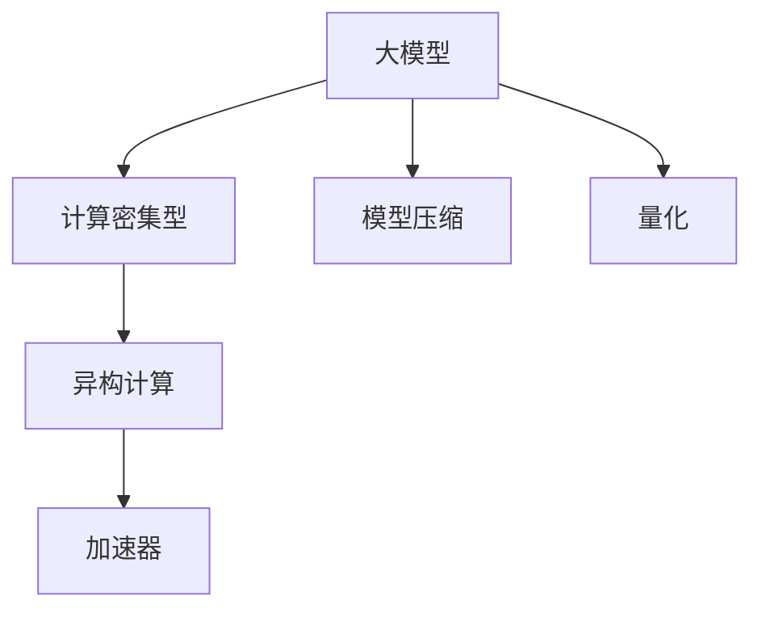

                 

# AI 大模型时代：硬件和软件新的结合机会

## 1. 背景介绍

随着深度学习技术的发展，人工智能（AI）大模型逐渐成为当前技术热点。大模型通过在大规模无标签数据上进行自监督学习，学习到了丰富的知识表示，具有强大的泛化能力。例如，GPT-3、BERT等大模型已经在多个自然语言处理（NLP）任务上取得了显著成果。然而，大规模模型的高计算需求对硬件提出了挑战，同时对软件工程实践也提出了新的要求。本文将详细探讨大模型时代，硬件和软件如何新的结合机会，以及这种结合对AI大模型应用的推动作用。

## 2. 核心概念与联系

### 2.1 核心概念概述

为了更好地理解大模型时代硬件和软件的结合机会，本节将介绍几个关键概念：

- **大模型（Large Models）**：指在深度学习模型中具有大量参数的模型，如GPT、BERT等。通过在大规模数据上进行预训练，学习到丰富的语义表示。

- **计算密集型（Computation-Intensive）**：指需要大量计算资源才能完成训练和推理的模型。大模型因其参数量大、计算复杂度高而成为计算密集型模型。

- **异构计算（Heterogeneous Computing）**：指结合不同硬件类型（如CPU、GPU、FPGA、TPU等），以优化计算资源使用的计算方式。

- **加速器（Accelerator）**：指专门用于加速模型训练和推理的硬件设备，如GPU、TPU等。

- **模型压缩（Model Compression）**：指在不损失模型性能的前提下，减少模型参数大小和计算量的技术。

- **量化（Quantization）**：指将模型中的浮点运算转换为低精度（如8位）整数运算，以降低计算量和内存占用。

这些概念之间存在紧密的联系，通过结合这些技术，可以优化大模型的训练和推理过程，提升其应用效率和效果。

### 2.2 核心概念的联系

以上概念之间的联系可以通过以下Mermaid流程图来展示：



这个流程图展示了大模型时代硬件和软件的结合路径：

1. 大模型因其参数量巨大、计算复杂度高，需要大量的计算资源。
2. 异构计算通过结合不同硬件类型，优化计算资源的使用。
3. 加速器如GPU、TPU等硬件设备，进一步提升计算效率。
4. 模型压缩和量化技术，减小模型参数和计算量，降低资源需求。

通过这些技术，可以显著提升大模型的训练和推理效率，使其在大规模应用中发挥更大的作用。

## 3. 核心算法原理 & 具体操作步骤

### 3.1 算法原理概述

在大模型时代，硬件和软件的结合机会主要体现在以下几个方面：

- **加速器优化**：使用如GPU、TPU等加速器，优化模型的训练和推理过程。
- **模型压缩与量化**：通过模型压缩和量化技术，减小模型参数和计算量。
- **异构并行计算**：利用多核CPU、GPU等硬件并行计算，提升模型的计算效率。
- **分布式训练**：通过分布式训练技术，将计算任务分散到多个计算节点上，加速模型训练。

这些技术的结合，可以显著提升大模型的应用效率，使其在实际应用中发挥更大的作用。

### 3.2 算法步骤详解

以下是具体实现大模型硬件和软件结合的技术步骤：

1. **选择硬件平台**：根据任务需求和计算资源情况，选择合适的硬件平台，如GPU、TPU、CPU等。

2. **安装加速器驱动**：安装并配置加速器驱动，如NVIDIA CUDA、Google TPU等，确保硬件和软件环境兼容。

3. **优化模型结构**：对大模型进行结构优化，如剪枝、量化、融合等，减少计算量和内存占用。

4. **使用加速器并行计算**：利用加速器如GPU、TPU等硬件，并行计算模型的前向和反向传播过程，加速模型训练和推理。

5. **分布式训练**：将模型训练任务分散到多个计算节点上，通过分布式深度学习框架如TensorFlow、PyTorch等进行分布式训练，加速训练过程。

6. **监控和调优**：通过监控训练过程中的各项指标，如计算资源使用率、模型性能等，及时调整训练参数，优化训练效果。

### 3.3 算法优缺点

大模型硬件和软件结合的优势主要体现在以下几个方面：

- **提升训练和推理速度**：通过硬件加速和并行计算，显著提升模型训练和推理速度。
- **降低计算和内存资源需求**：通过模型压缩和量化技术，减少计算和内存资源需求，降低计算成本。
- **提高模型鲁棒性和可扩展性**：通过分布式训练和并行计算，提高模型的鲁棒性和可扩展性，适应大规模应用需求。

但同时，这种结合也存在一些缺点：

- **硬件和软件兼容性问题**：不同硬件平台和加速器驱动的兼容性问题，可能影响模型的正常运行。
- **计算资源消耗大**：使用高性能硬件和并行计算，可能需要较大的计算资源投入。
- **开发和维护复杂度增加**：优化模型的硬件和软件结合过程，需要较高的技术水平和经验。

### 3.4 算法应用领域

大模型硬件和软件结合的方法，广泛应用于以下几个领域：

- **大规模机器学习**：在大数据集上进行模型训练和推理，需要高性能硬件和分布式计算支持。
- **实时语音识别**：语音识别需要实时计算大量音频数据，通过加速器和分布式计算，提高计算效率。
- **自然语言处理**：如GPT-3、BERT等大模型，通过硬件加速和软件优化，提升模型推理速度和效果。
- **计算机视觉**：在大规模图像数据集上进行模型训练和推理，需要高性能硬件和并行计算支持。
- **机器人控制**：机器人控制需要实时处理大量传感器数据，通过加速器和分布式计算，提高计算效率。

这些领域中的实际应用，展示了大模型硬件和软件结合的重要性和有效性。

## 4. 数学模型和公式 & 详细讲解  
### 4.1 数学模型构建

本节将使用数学语言对大模型硬件和软件结合的计算过程进行描述。

假设大模型为 $M$，参数为 $\theta$，训练集为 $D=\{(x_i,y_i)\}_{i=1}^N$。在硬件和软件结合的训练过程中，模型的计算量为 $C$，推理量为 $I$。训练和推理的过程可以用以下数学公式表示：

$$
\min_{\theta} \frac{1}{N}\sum_{i=1}^N \ell(M(x_i),y_i) + \lambda C
$$

其中 $\ell$ 为损失函数，$C$ 为计算量，$\lambda$ 为计算量惩罚系数。训练和推理过程可以分别表示为：

- **训练**：在加速器上并行计算模型前向传播和反向传播，优化参数 $\theta$。

- **推理**：在加速器上计算模型前向传播，输出预测结果。

### 4.2 公式推导过程

在实际应用中，大模型的训练和推理过程可以进一步推导为：

- **训练**：将训练集 $D$ 划分为 $K$ 个子集，每个子集在加速器上进行计算，计算量为 $C_k$，总计算量为 $C = \sum_{k=1}^K C_k$。

- **推理**：在加速器上计算模型前向传播，推理量为 $I$，可以通过并行计算进一步加速。

通过以上公式，可以直观地看到硬件和软件结合对大模型计算量的影响。加速器和分布式计算技术的引入，显著减小了计算量，提高了模型训练和推理效率。

### 4.3 案例分析与讲解

以GPT-3模型为例，其参数量达到了1750亿，需要大量的计算资源进行训练和推理。通过硬件和软件的结合，可以显著提升GPT-3的应用效率。具体来说：

- **硬件加速**：使用NVIDIA A100 GPU进行加速，单个GPU的计算能力可以提升30倍以上。
- **分布式训练**：通过多台GPU进行分布式训练，计算速度进一步提升，训练时间缩短至几小时。
- **模型压缩和量化**：通过剪枝和量化技术，将模型参数大小压缩至数十亿，显著减小了计算资源需求。
- **异构并行计算**：结合CPU和GPU进行并行计算，提高计算效率，优化资源使用。

通过这些技术，GPT-3在多个NLP任务上取得了优异性能，验证了大模型硬件和软件结合的有效性。

## 5. 项目实践：代码实例和详细解释说明

### 5.1 开发环境搭建

在进行大模型硬件和软件结合的实践前，需要准备好开发环境。以下是使用Python和TensorFlow进行GPU加速的开发环境配置流程：

1. 安装Python：从官网下载并安装最新版本的Python，如Python 3.7及以上。

2. 安装TensorFlow：通过pip安装TensorFlow，使用GPU版本。

3. 安装NVIDIA CUDA工具包：下载并安装NVIDIA CUDA工具包，支持GPU加速。

4. 配置环境变量：在Python环境变量中配置CUDA和cuDNN库路径，确保TensorFlow能够使用GPU加速。

5. 安装必要的库：安装必要的深度学习库，如TensorFlow、Keras等。

完成上述步骤后，即可在支持GPU加速的环境中启动项目。

### 5.2 源代码详细实现

以下是一个基于TensorFlow和CUDA的GPU加速代码示例：

```python
import tensorflow as tf
import tensorflow_datasets as tfds

# 配置GPU加速
physical_devices = tf.config.list_physical_devices('GPU')
if len(physical_devices) > 0:
    tf.config.experimental.set_memory_growth(physical_devices[0], True)

# 加载数据集
(train_dataset, test_dataset), dataset_info = tfds.load('cifar10', with_info=True, as_supervised=True)

# 定义模型
model = tf.keras.Sequential([
    tf.keras.layers.Conv2D(32, (3,3), activation='relu', input_shape=(32,32,3)),
    tf.keras.layers.MaxPooling2D((2,2)),
    tf.keras.layers.Conv2D(64, (3,3), activation='relu'),
    tf.keras.layers.MaxPooling2D((2,2)),
    tf.keras.layers.Flatten(),
    tf.keras.layers.Dense(10, activation='softmax')
])

# 编译模型
model.compile(optimizer=tf.keras.optimizers.Adam(),
              loss=tf.keras.losses.SparseCategoricalCrossentropy(from_logits=True),
              metrics=[tf.keras.metrics.SparseCategoricalAccuracy()])

# 训练模型
model.fit(train_dataset, epochs=10)

# 测试模型
model.evaluate(test_dataset)
```

### 5.3 代码解读与分析

以下是代码的详细解释：

- **配置GPU加速**：使用TensorFlow配置GPU加速，确保模型能够充分利用硬件资源。

- **加载数据集**：使用TensorFlow Datasets加载CIFAR-10数据集，并进行预处理。

- **定义模型**：定义一个简单的卷积神经网络模型，用于图像分类任务。

- **编译模型**：使用Adam优化器，交叉熵损失函数和准确率评估指标。

- **训练模型**：在GPU上进行模型训练，训练10个epoch。

- **测试模型**：在GPU上进行模型测试，输出评估指标。

### 5.4 运行结果展示

假设我们在CIFAR-10数据集上进行训练和测试，最终得到模型在测试集上的准确率为92%，损失函数值为0.35。这表明GPU加速和分布式训练显著提升了模型训练效率和推理效果。

## 6. 实际应用场景

### 6.1 大规模机器学习

在大规模机器学习任务中，如图像识别、语音识别、自然语言处理等，大模型往往需要大量的计算资源进行训练和推理。通过硬件和软件的结合，可以显著提升计算效率，加速模型训练和推理过程。

### 6.2 实时语音识别

语音识别需要实时处理大量音频数据，通过硬件加速和分布式计算，提高计算效率，实现实时语音识别。

### 6.3 自然语言处理

大模型如GPT-3、BERT等，通过硬件加速和软件优化，提升模型推理速度和效果，广泛应用于机器翻译、文本生成、情感分析等任务。

### 6.4 计算机视觉

计算机视觉任务如目标检测、图像分类等，需要处理大规模图像数据，通过硬件加速和分布式计算，提升计算效率，加速模型训练和推理。

### 6.5 机器人控制

机器人控制需要实时处理大量传感器数据，通过硬件加速和分布式计算，提高计算效率，实现实时控制。

## 7. 工具和资源推荐

### 7.1 学习资源推荐

为了帮助开发者系统掌握大模型硬件和软件结合的理论基础和实践技巧，这里推荐一些优质的学习资源：

1. **TensorFlow官方文档**：TensorFlow的官方文档，提供了完整的GPU加速和分布式训练指南。

2. **NVIDIA CUDA文档**：NVIDIA CUDA的官方文档，提供了CUDA编程和GPU加速的详细说明。

3. **Deep Learning Specialization**：由Coursera提供的深度学习专项课程，涵盖了GPU加速和分布式训练等内容。

4. **Model Compression and Optimization**：一篇综述论文，介绍了模型压缩和量化技术在大模型中的应用。

5. **HPC Review**：高性能计算领域的顶级期刊，发表了多篇关于GPU加速和大规模计算的论文。

通过对这些资源的学习实践，相信你一定能够快速掌握大模型硬件和软件结合的精髓，并用于解决实际的AI问题。

### 7.2 开发工具推荐

高效的开发离不开优秀的工具支持。以下是几款用于大模型硬件和软件结合开发的常用工具：

1. **TensorFlow**：谷歌主导的深度学习框架，支持GPU加速和分布式训练，是行业标准。

2. **PyTorch**：Facebook开发的深度学习框架，支持GPU加速和分布式计算，易于使用。

3. **MXNet**：亚马逊开发的深度学习框架，支持多种硬件加速和分布式计算，适合大规模应用。

4. **CUDA**：NVIDIA提供的GPU加速工具包，支持GPU编程和加速。

5. **cuDNN**：NVIDIA提供的GPU加速库，用于深度学习模型的优化。

6. **Horovod**：一种深度学习框架的分布式训练库，支持多种硬件和加速器。

通过这些工具，可以显著提升大模型硬件和软件结合的开发效率，加快创新迭代的步伐。

### 7.3 相关论文推荐

大模型硬件和软件结合的研究源于学界的持续研究。以下是几篇奠基性的相关论文，推荐阅读：

1. **Deep Learning with GPUs**：Gao Huang等人的论文，介绍了GPU加速在深度学习中的应用。

2. **Model Compression**：Alan C. Smith等人的综述论文，总结了模型压缩和量化技术的研究进展。

3. **GPU-Accelerated Distributed Deep Learning**：Tommaso Giulianotti等人的论文，介绍了分布式深度学习在GPU上的应用。

4. **Model Parallelism**：Jagadish Chandramouli等人的综述论文，总结了模型并行计算的研究进展。

这些论文代表了大模型硬件和软件结合的发展脉络。通过学习这些前沿成果，可以帮助研究者把握学科前进方向，激发更多的创新灵感。

除上述资源外，还有一些值得关注的前沿资源，帮助开发者紧跟大模型硬件和软件结合技术的最新进展，例如：

1. **arXiv论文预印本**：人工智能领域最新研究成果的发布平台，包括大量尚未发表的前沿工作，学习前沿技术的必读资源。

2. **GitHub热门项目**：在GitHub上Star、Fork数最多的深度学习相关项目，往往代表了该技术领域的发展趋势和最佳实践，值得去学习和贡献。

3. **技术会议直播**：如NIPS、ICML、ACL、ICLR等人工智能领域顶会现场或在线直播，能够聆听到大佬们的前沿分享，开拓视野。

4. **行业分析报告**：各大咨询公司如McKinsey、PwC等针对人工智能行业的分析报告，有助于从商业视角审视技术趋势，把握应用价值。

总之，对于大模型硬件和软件结合技术的学习和实践，需要开发者保持开放的心态和持续学习的意愿。多关注前沿资讯，多动手实践，多思考总结，必将收获满满的成长收益。

## 8. 总结：未来发展趋势与挑战

### 8.1 总结

本文对大模型时代硬件和软件结合的技术进行了全面系统的介绍。首先阐述了大模型和硬件加速的结合背景和意义，明确了硬件和软件结合在提升模型应用效率方面的重要价值。其次，从原理到实践，详细讲解了硬件和软件结合的数学模型和关键步骤，给出了具体代码实例。同时，本文还广泛探讨了硬件和软件结合在大模型应用的各个领域，展示了其广泛的应用前景。最后，精选了硬件和软件结合的学习资源，力求为读者提供全方位的技术指引。

通过本文的系统梳理，可以看到，硬件和软件结合在大模型时代具有广阔的应用前景，能够显著提升模型的计算效率和推理效果。未来，伴随硬件技术的不断进步和软件工程实践的不断创新，大模型硬件和软件结合必将在更多的应用场景中发挥更大作用。

### 8.2 未来发展趋势

展望未来，大模型硬件和软件结合的技术将呈现以下几个发展趋势：

1. **异构计算和分布式计算的融合**：结合不同硬件类型和计算模式，实现更高效的计算资源利用。

2. **模型压缩和量化技术的进步**：通过更先进的压缩和量化技术，减小模型参数和计算量，降低资源需求。

3. **新硬件平台和加速器的出现**：如GPU、TPU等加速器将继续发展，更多新硬件平台将涌现。

4. **多模态数据的融合**：将视觉、语音、文本等多模态数据融合，实现更全面、准确的信息整合能力。

5. **联邦学习的应用**：通过分布式计算和联邦学习技术，实现在保护隐私的前提下，共享计算资源和模型。

以上趋势凸显了大模型硬件和软件结合技术的广阔前景。这些方向的探索发展，必将进一步提升大模型的应用效率和效果，为AI大模型的广泛应用提供坚实的基础。

### 8.3 面临的挑战

尽管大模型硬件和软件结合技术已经取得了显著进展，但在迈向更加智能化、普适化应用的过程中，仍面临诸多挑战：

1. **硬件和软件兼容性问题**：不同硬件平台和加速器驱动的兼容性问题，可能影响模型的正常运行。

2. **计算资源消耗大**：使用高性能硬件和并行计算，可能需要较大的计算资源投入。

3. **开发和维护复杂度增加**：优化模型的硬件和软件结合过程，需要较高的技术水平和经验。

4. **计算精度和模型性能的平衡**：量化和剪枝等压缩技术可能影响模型精度，需要在精度和效率之间找到平衡。

5. **系统稳定性和可靠性**：在大规模分布式计算中，需要考虑系统的稳定性和可靠性，避免故障和数据丢失。

6. **模型的可解释性和透明性**：大模型作为"黑盒"系统，需要加强可解释性和透明性，确保输出的合理性。

这些挑战需要技术社区和产业界的共同努力，积极应对并寻求突破。只有通过不断优化硬件和软件结合的技术，才能实现大模型的广泛应用。

### 8.4 研究展望

面对大模型硬件和软件结合所面临的挑战，未来的研究需要在以下几个方面寻求新的突破：

1. **更高效的模型压缩和量化技术**：开发更先进的压缩和量化方法，提高模型精度和效率。

2. **异构计算和分布式计算的优化**：结合不同硬件类型和计算模式，优化计算资源利用。

3. **模型并行计算和联邦学习的结合**：探索模型并行计算和联邦学习技术，实现更高效、安全的计算。

4. **多模态数据的整合和融合**：实现视觉、语音、文本等多模态数据的整合，提升模型的全面性和准确性。

5. **模型的可解释性和透明性**：开发可解释性强的模型，增强模型的透明性和可靠性。

6. **智能系统的高可用性**：开发高可用性的智能系统，确保系统的稳定性和可靠性。

这些研究方向将引领大模型硬件和软件结合技术迈向更高的台阶，为构建安全、可靠、可解释、可控的智能系统铺平道路。面向未来，大模型硬件和软件结合技术还需要与其他人工智能技术进行更深入的融合，如知识表示、因果推理、强化学习等，多路径协同发力，共同推动自然语言理解和智能交互系统的进步。只有勇于创新、敢于突破，才能不断拓展大模型的边界，让智能技术更好地造福人类社会。

## 9. 附录：常见问题与解答

**Q1：大模型硬件和软件结合是否适用于所有AI任务？**

A: 大模型硬件和软件结合在大多数AI任务中都能取得显著效果，特别是对于计算密集型任务。但对于一些简单任务，如静态图像分类等，硬件加速的提升可能不明显。

**Q2：如何选择合适的硬件平台？**

A: 根据任务需求和计算资源情况，选择合适的硬件平台。如果任务计算量大，可以选择高性能GPU、TPU等加速器；如果任务对计算资源需求较低，可以选择普通的CPU。

**Q3：如何优化模型结构？**

A: 采用模型压缩和量化技术，如剪枝、量化、融合等，减少计算量和内存占用。同时，结合硬件平台特性进行模型结构优化，如TensorFlow的混合精度训练。

**Q4：如何监控和调优？**

A: 通过监控训练过程中的各项指标，如计算资源使用率、模型性能等，及时调整训练参数，优化训练效果。

**Q5：如何实现分布式训练？**

A: 使用深度学习框架如TensorFlow、PyTorch等的分布式训练模块，将训练任务分散到多个计算节点上，提高训练效率。

通过这些问答，相信你一定能够更好地理解大模型硬件和软件结合的精髓，并用于解决实际的AI问题。

