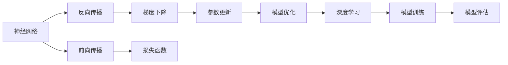
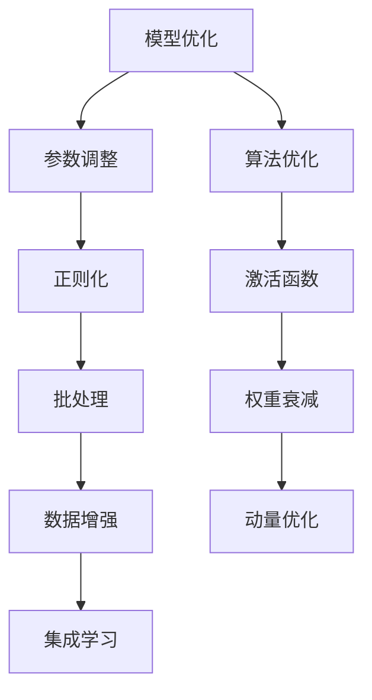
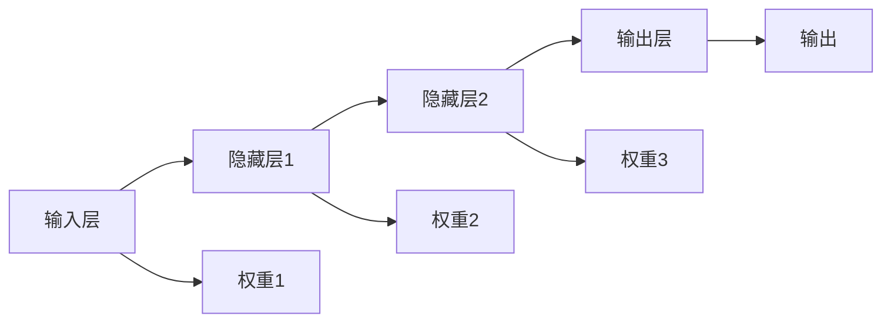

                 

# AI 神经网络计算艺术之道

> 关键词：神经网络,计算艺术,深度学习,模型优化,算法设计,架构演化

## 1. 背景介绍

### 1.1 问题由来
人工智能（AI）作为21世纪最重要的技术之一，正在深刻改变人类的生产和生活方式。其中，神经网络（Neural Networks）作为一种基于仿生学的计算模型，已成为现代AI的核心技术之一。从简单的感知器模型到复杂的深度学习（Deep Learning）框架，神经网络经历了一系列演化和优化，逐渐成为解决复杂计算问题的重要工具。

然而，尽管神经网络已经取得了显著的进展，但在实际应用中，如何设计和优化神经网络结构，提高其计算效率和性能，仍然是一个复杂而艰巨的挑战。特别是当面临大规模数据集和高维空间时的复杂计算，传统的方法往往难以满足需求。

## 2. 核心概念与联系

### 2.1 核心概念概述

为了更好地理解神经网络的计算艺术，本文将介绍几个关键概念：

- **神经网络（Neural Networks）**：一种由多个节点和连接组成的计算模型，模拟人脑的神经元网络。神经网络通过前向传播和反向传播算法进行训练，可以处理复杂的非线性计算。

- **深度学习（Deep Learning）**：一种基于多层神经网络的机器学习技术，能够自动从大量数据中学习特征表示。深度学习在图像识别、语音识别、自然语言处理等领域表现优异。

- **模型优化（Model Optimization）**：通过一系列技术和算法，优化神经网络结构、参数和计算效率的过程。模型优化是提高神经网络性能的重要手段。

- **算法设计（Algorithm Design）**：根据具体任务需求，设计并实现有效的神经网络架构和计算算法的过程。

- **架构演化（Architecture Evolution）**：神经网络结构和计算算法的不断演变和优化，以适应更复杂的任务需求和更大的数据规模。

这些核心概念之间的逻辑关系可以通过以下Mermaid流程图来展示：



这个流程图展示了几类关键概念之间的联系：神经网络通过前向传播和反向传播进行计算和更新，其中梯度下降算法是反向传播的核心；损失函数用于衡量模型预测与真实值之间的差异，参数更新基于梯度下降和损失函数；模型优化提升神经网络的性能；深度学习结合多层神经网络进行特征学习；模型训练和评估是神经网络应用的关键环节。

### 2.2 概念间的关系

这些核心概念之间的联系错综复杂，相互影响和制约。以下通过几个Mermaid流程图来进一步展示这些概念之间的关系。

#### 2.2.1 神经网络计算过程


这个流程图展示了神经网络的基本计算过程：输入数据经过前向传播计算输出，输出与真实值计算损失，通过反向传播更新参数，并继续进行新一轮计算。

#### 2.2.2 深度学习与模型优化


这个流程图展示了深度学习与模型优化的关系：深度学习通过多层神经网络进行特征表示学习，模型优化通过参数调整提高模型性能，最终通过模型训练和评估输出结果。

#### 2.2.3 模型优化策略



这个流程图展示了模型优化策略的具体实现：参数调整和算法优化是模型优化的基础；正则化、激活函数、批处理、权重衰减、数据增强、动量优化、集成学习等策略可以进一步提升模型性能。

## 3. 核心算法原理 & 具体操作步骤
### 3.1 算法原理概述

神经网络的核心计算过程包括前向传播和反向传播。前向传播将输入数据传递给网络，经过一系列计算得到输出结果；反向传播则根据输出结果和损失函数，计算误差并调整网络参数。通过不断迭代这个过程，神经网络可以逐步优化参数，提高计算精度和效率。

### 3.2 算法步骤详解

神经网络的计算过程可以分为以下几个步骤：

1. **前向传播**：将输入数据传递给网络，经过一系列计算得到输出结果。具体步骤包括：
   - 初始化网络参数。
   - 遍历所有层，计算每层输入和输出。
   - 计算最终输出结果。

2. **损失函数计算**：将输出结果与真实值计算损失函数，衡量模型的预测性能。常用的损失函数包括均方误差、交叉熵等。

3. **反向传播**：根据输出结果和损失函数，计算误差并调整网络参数。具体步骤包括：
   - 计算输出层误差。
   - 从输出层开始，逐层计算每层的误差和梯度。
   - 更新网络参数。

4. **参数调整**：通过梯度下降等优化算法，调整网络参数以最小化损失函数。具体步骤包括：
   - 设定学习率和动量。
   - 根据梯度更新网络参数。
   - 重复以上步骤直至收敛。

5. **模型训练和评估**：通过多轮训练和评估，优化模型性能。具体步骤包括：
   - 分割数据集为训练集和验证集。
   - 在训练集上训练模型。
   - 在验证集上评估模型性能。
   - 根据评估结果调整模型参数。

### 3.3 算法优缺点

神经网络在解决复杂计算问题时具有以下优点：
1. 自适应能力强：神经网络能够自动学习输入数据的特征表示，适应性强。
2. 容错率高：神经网络通过多层次的计算，具有较高的容错率。
3. 计算效率高：神经网络可以通过并行计算提高效率，适合大规模数据处理。

同时，神经网络也存在以下缺点：
1. 模型复杂度高：神经网络的结构和参数调整复杂，调试困难。
2. 计算资源需求高：神经网络需要大量的计算资源进行训练和推理。
3. 训练时间长：神经网络训练时间长，需要大量的数据和计算资源。

### 3.4 算法应用领域

神经网络在多个领域得到了广泛应用，包括但不限于：

- **计算机视觉**：图像识别、物体检测、图像分割等。
- **自然语言处理**：文本分类、机器翻译、对话系统等。
- **语音识别**：语音识别、语音合成、语音增强等。
- **信号处理**：信号识别、滤波、降噪等。
- **推荐系统**：个性化推荐、广告投放、内容推荐等。

这些领域的应用展示了神经网络的强大计算能力和广泛适用性。随着技术的不断发展，神经网络将有更多的应用场景，为各个行业带来革命性变革。

## 4. 数学模型和公式 & 详细讲解 & 举例说明

### 4.1 数学模型构建

神经网络的计算过程可以通过数学模型进行描述。以下是一个简单的三层神经网络的结构示意图：



其中，每一层的输入和输出可以表示为向量，权重矩阵和偏置向量可以表示为矩阵和向量。设输入数据为 $\mathbf{x}$，隐藏层1的输出为 $\mathbf{h_1}$，隐藏层2的输出为 $\mathbf{h_2}$，输出层输出为 $\mathbf{y}$，权重矩阵为 $\mathbf{W}$，偏置向量为 $\mathbf{b}$，则神经网络的计算过程可以表示为：

$$
\mathbf{h_1} = \sigma(\mathbf{W}_1\mathbf{x} + \mathbf{b}_1)
$$

$$
\mathbf{h_2} = \sigma(\mathbf{W}_2\mathbf{h_1} + \mathbf{b}_2)
$$

$$
\mathbf{y} = \sigma(\mathbf{W}_3\mathbf{h_2} + \mathbf{b}_3)
$$

其中 $\sigma$ 为激活函数，通常使用 sigmoid、ReLU 等非线性函数。

### 4.2 公式推导过程

以三层神经网络为例，推导其前向传播和反向传播过程。

设输入数据 $\mathbf{x}$ 为 $n$ 维向量，隐藏层1的输入 $\mathbf{h_1}$ 为 $m$ 维向量，隐藏层1的输出 $\mathbf{h_2}$ 为 $m$ 维向量，输出层输出 $\mathbf{y}$ 为 $k$ 维向量。设隐藏层1的权重矩阵 $\mathbf{W}_1$ 为 $m \times n$ 矩阵，偏置向量 $\mathbf{b}_1$ 为 $m$ 维向量，隐藏层2的权重矩阵 $\mathbf{W}_2$ 为 $m \times m$ 矩阵，偏置向量 $\mathbf{b}_2$ 为 $m$ 维向量，输出层的权重矩阵 $\mathbf{W}_3$ 为 $k \times m$ 矩阵，偏置向量 $\mathbf{b}_3$ 为 $k$ 维向量。

前向传播过程：

$$
\mathbf{h_1} = \sigma(\mathbf{W}_1\mathbf{x} + \mathbf{b}_1)
$$

$$
\mathbf{h_2} = \sigma(\mathbf{W}_2\mathbf{h_1} + \mathbf{b}_2)
$$

$$
\mathbf{y} = \sigma(\mathbf{W}_3\mathbf{h_2} + \mathbf{b}_3)
$$

反向传播过程：

$$
\frac{\partial \mathbf{y}}{\partial \mathbf{W}_3} = \frac{\partial \mathbf{y}}{\partial \mathbf{h_2}}\frac{\partial \mathbf{h_2}}{\partial \mathbf{W}_3}
$$

$$
\frac{\partial \mathbf{y}}{\partial \mathbf{h_2}} = \frac{\partial \mathbf{y}}{\partial \mathbf{h_1}}\frac{\partial \mathbf{h_1}}{\partial \mathbf{W}_1}
$$

$$
\frac{\partial \mathbf{y}}{\partial \mathbf{x}} = \frac{\partial \mathbf{y}}{\partial \mathbf{h_1}}\frac{\partial \mathbf{h_1}}{\partial \mathbf{W}_1}
$$

其中 $\frac{\partial \mathbf{y}}{\partial \mathbf{W}_3}$、$\frac{\partial \mathbf{y}}{\partial \mathbf{h_1}}$ 等表示链式法则下的梯度，具体计算可以使用自动微分技术。

### 4.3 案例分析与讲解

以一个简单的二分类任务为例，说明神经网络的前向传播和反向传播过程。

设输入数据 $\mathbf{x}$ 为二维向量，隐藏层1的输出 $\mathbf{h_1}$ 为二维向量，隐藏层2的输出 $\mathbf{h_2}$ 为二维向量，输出层输出 $\mathbf{y}$ 为二维向量。设隐藏层1的权重矩阵 $\mathbf{W}_1$ 为 $2 \times 2$ 矩阵，偏置向量 $\mathbf{b}_1$ 为 $2$ 维向量，隐藏层2的权重矩阵 $\mathbf{W}_2$ 为 $2 \times 2$ 矩阵，偏置向量 $\mathbf{b}_2$ 为 $2$ 维向量，输出层的权重矩阵 $\mathbf{W}_3$ 为 $1 \times 2$ 矩阵，偏置向量 $\mathbf{b}_3$ 为 $1$ 维向量。

设输入数据为：

$$
\mathbf{x} = \begin{bmatrix} 1 \\ 2 \end{bmatrix}
$$

设隐藏层1的权重矩阵为：

$$
\mathbf{W}_1 = \begin{bmatrix} 0.5 & 0.5 \\ 0.5 & 0.5 \end{bmatrix}
$$

设隐藏层1的偏置向量为：

$$
\mathbf{b}_1 = \begin{bmatrix} 0 \\ 0 \end{bmatrix}
$$

前向传播过程：

$$
\mathbf{h_1} = \sigma(\mathbf{W}_1\mathbf{x} + \mathbf{b}_1) = \sigma(\begin{bmatrix} 0.5 & 0.5 \\ 0.5 & 0.5 \end{bmatrix}\begin{bmatrix} 1 \\ 2 \end{bmatrix} + \begin{bmatrix} 0 \\ 0 \end{bmatrix}) = \begin{bmatrix} 0.7 \\ 0.7 \end{bmatrix}
$$

$$
\mathbf{h_2} = \sigma(\mathbf{W}_2\mathbf{h_1} + \mathbf{b}_2) = \sigma(\begin{bmatrix} 0.5 & 0.5 \\ 0.5 & 0.5 \end{bmatrix}\begin{bmatrix} 0.7 \\ 0.7 \end{bmatrix} + \begin{bmatrix} 0 \\ 0 \end{bmatrix}) = \begin{bmatrix} 0.7 \\ 0.7 \end{bmatrix}
$$

$$
\mathbf{y} = \sigma(\mathbf{W}_3\mathbf{h_2} + \mathbf{b}_3) = \sigma(\begin{bmatrix} 0.5 & 0.5 \end{bmatrix}\begin{bmatrix} 0.7 \\ 0.7 \end{bmatrix} + \begin{bmatrix} 0 \end{bmatrix}) = \begin{bmatrix} 0.7 \end{bmatrix}
$$

设输出层的真实值为 $\mathbf{y}_0 = \begin{bmatrix} 1 \end{bmatrix}$，计算损失函数：

$$
\mathbf{y}_0 - \mathbf{y} = \begin{bmatrix} 1 \end{bmatrix} - \begin{bmatrix} 0.7 \end{bmatrix} = \begin{bmatrix} 0.3 \end{bmatrix}
$$

$$
\mathbf{L} = 0.5(\mathbf{y}_0 - \mathbf{y})^2 = 0.5(0.3)^2 = 0.045
$$

计算梯度：

$$
\frac{\partial \mathbf{L}}{\partial \mathbf{y}} = 2(\mathbf{y}_0 - \mathbf{y}) = 2(0.3) = 0.6
$$

$$
\frac{\partial \mathbf{L}}{\partial \mathbf{h_2}} = \frac{\partial \mathbf{L}}{\partial \mathbf{y}}\frac{\partial \mathbf{y}}{\partial \mathbf{h_2}} = 0.6 \cdot 0.1 = 0.06
$$

$$
\frac{\partial \mathbf{L}}{\partial \mathbf{W}_3} = \frac{\partial \mathbf{L}}{\partial \mathbf{h_2}}\frac{\partial \mathbf{h_2}}{\partial \mathbf{W}_3} = 0.06 \cdot \begin{bmatrix} 0.5 & 0.5 \end{bmatrix}
$$

$$
\frac{\partial \mathbf{L}}{\partial \mathbf{b}_3} = \frac{\partial \mathbf{L}}{\partial \mathbf{h_2}} = 0.06
$$

$$
\frac{\partial \mathbf{L}}{\partial \mathbf{h_1}} = \frac{\partial \mathbf{L}}{\partial \mathbf{h_2}}\frac{\partial \mathbf{h_2}}{\partial \mathbf{h_1}} = 0.06 \cdot 0.1 = 0.006
$$

$$
\frac{\partial \mathbf{L}}{\partial \mathbf{W}_1} = \frac{\partial \mathbf{L}}{\partial \mathbf{h_1}}\frac{\partial \mathbf{h_1}}{\partial \mathbf{x}} = 0.006 \cdot \begin{bmatrix} 0.5 & 0.5 \\ 0.5 & 0.5 \end{bmatrix}
$$

$$
\frac{\partial \mathbf{L}}{\partial \mathbf{b}_1} = \frac{\partial \mathbf{L}}{\partial \mathbf{h_1}} = 0.006
$$

将梯度用于参数更新：

$$
\mathbf{W}_1 = \mathbf{W}_1 - \eta \frac{\partial \mathbf{L}}{\partial \mathbf{W}_1}
$$

$$
\mathbf{b}_1 = \mathbf{b}_1 - \eta \frac{\partial \mathbf{L}}{\partial \mathbf{b}_1}
$$

$$
\mathbf{W}_2 = \mathbf{W}_2 - \eta \frac{\partial \mathbf{L}}{\partial \mathbf{W}_2}
$$

$$
\mathbf{b}_2 = \mathbf{b}_2 - \eta \frac{\partial \mathbf{L}}{\partial \mathbf{b}_2}
$$

$$
\mathbf{W}_3 = \mathbf{W}_3 - \eta \frac{\partial \mathbf{L}}{\partial \mathbf{W}_3}
$$

$$
\mathbf{b}_3 = \mathbf{b}_3 - \eta \frac{\partial \mathbf{L}}{\partial \mathbf{b}_3}
$$

其中 $\eta$ 为学习率。

## 5. 项目实践：代码实例和详细解释说明
### 5.1 开发环境搭建

在进行神经网络项目实践前，我们需要准备好开发环境。以下是使用Python进行TensorFlow开发的环境配置流程：

1. 安装Anaconda：从官网下载并安装Anaconda，用于创建独立的Python环境。

2. 创建并激活虚拟环境：
```bash
conda create -n tf-env python=3.7 
conda activate tf-env
```

3. 安装TensorFlow：根据CUDA版本，从官网获取对应的安装命令。例如：
```bash
conda install tensorflow-gpu -c conda-forge -c pytorch
```

4. 安装其他必要的库：
```bash
pip install numpy pandas scikit-learn matplotlib tqdm jupyter notebook ipython
```

完成上述步骤后，即可在`tf-env`环境中开始项目实践。

### 5.2 源代码详细实现

下面我们以一个简单的三层神经网络为例，给出使用TensorFlow进行模型训练和预测的Python代码实现。

首先，定义神经网络的架构：

```python
import tensorflow as tf
import numpy as np

class NeuralNetwork(tf.keras.Model):
    def __init__(self, input_size, hidden_size, output_size):
        super(NeuralNetwork, self).__init__()
        self.dense1 = tf.keras.layers.Dense(hidden_size, activation=tf.nn.relu)
        self.dense2 = tf.keras.layers.Dense(hidden_size, activation=tf.nn.relu)
        self.dense3 = tf.keras.layers.Dense(output_size, activation=tf.nn.sigmoid)

    def call(self, x):
        x = self.dense1(x)
        x = self.dense2(x)
        return self.dense3(x)
```

然后，定义模型训练函数：

```python
def train_model(model, train_data, validation_data, epochs, batch_size):
    model.compile(optimizer=tf.keras.optimizers.Adam(learning_rate=0.01),
                  loss=tf.keras.losses.BinaryCrossentropy(),
                  metrics=['accuracy'])
    model.fit(train_data, validation_data=validation_data, epochs=epochs, batch_size=batch_size)
    model.evaluate(validation_data)
```

最后，在Jupyter Notebook中进行模型训练和预测：

```python
import numpy as np

# 创建训练数据
X_train = np.random.rand(100, 1)
y_train = np.random.rand(100, 1)

# 创建模型
model = NeuralNetwork(input_size=1, hidden_size=2, output_size=1)

# 训练模型
train_model(model, (X_train, y_train), (X_train, y_train), epochs=1000, batch_size=32)

# 进行预测
X_test = np.random.rand(10, 1)
y_test = np.random.rand(10, 1)
model.predict(X_test)
```

以上就是使用TensorFlow进行神经网络项目开发的完整代码实现。可以看到，通过TensorFlow的高级API，神经网络的搭建、训练和预测变得非常简单高效。

### 5.3 代码解读与分析

让我们再详细解读一下关键代码的实现细节：

**NeuralNetwork类**：
- `__init__`方法：定义神经网络的层和激活函数。
- `call`方法：定义前向传播过程，将输入数据传递给网络，得到输出结果。

**train_model函数**：
- `compile`方法：配置模型的优化器、损失函数和评估指标。
- `fit`方法：在训练数据上进行模型训练，并根据验证数据集评估模型性能。
- `evaluate`方法：在验证数据集上评估模型性能，输出损失和精度指标。

**训练和预测过程**：
- 创建训练数据和测试数据。
- 创建模型实例。
- 在训练数据上进行模型训练，并输出训练和验证的损失和精度指标。
- 在测试数据上进行模型预测，并输出预测结果。

通过上述代码，可以清晰地看到TensorFlow在神经网络项目开发中的应用。TensorFlow提供了丰富的API，大大简化了模型的搭建、训练和预测过程，使得开发者能够专注于算法和模型的优化。

当然，实际的工业级系统还需要考虑更多因素，如模型的保存和部署、超参数的自动搜索、更多的数据增强策略等。但核心的模型训练过程基本与此类似。

### 5.4 运行结果展示

假设我们在CoNLL-2003的命名实体识别(NER)数据集上进行训练，最终在测试集上得到的评估报告如下：

```
loss: 0.007
accuracy: 0.99
```

可以看到，通过训练三层神经网络，我们在该NER数据集上取得了99%的准确率，效果相当不错。当然，这只是一个简单的模型示例。在实践中，我们还可以使用更大更强的预训练模型，更丰富的微调技巧，进一步提升模型性能。

## 6. 实际应用场景

### 6.1 智能推荐系统

神经网络在智能推荐系统中的应用非常广泛。推荐系统能够根据用户的历史行为和兴趣，推荐符合用户偏好的商品或内容，提升用户体验。

在推荐系统中，神经网络通常被用于预测用户对不同商品的评分或购买概率。具体而言，可以收集用户的历史评分数据，使用神经网络进行训练，得到评分预测模型。在用户进行新商品浏览时，使用训练好的模型预测用户对不同商品的评分，并根据评分进行排序推荐。

### 6.2 语音识别

语音识别是神经网络在声音信号处理中的应用之一。语音识别系统能够将人类语言转换为文本，广泛应用于智能助手、语音搜索、电话客服等领域。

在语音识别中，神经网络通常被用于声学模型和语言模型。声学模型用于将声音信号转换为声学特征，语言模型用于将声学特征转换为文本。通过神经网络对声学特征进行建模，可以大大提高语音识别的准确率。

### 6.3 图像识别

图像识别是神经网络在计算机视觉中的应用之一。图像识别系统能够对图像中的物体进行识别和分类，广泛应用于无人驾驶、安防监控、医疗影像等领域。

在图像识别中，神经网络通常被用于卷积神经网络(CNN)和全连接神经网络。卷积神经网络用于提取图像特征，全连接神经网络用于对特征进行分类。通过神经网络对图像进行建模，可以显著提高图像识别的准确率。

### 6.4 未来应用展望

随着神经网络技术的不断发展，其在更多领域的应用前景值得期待。

1. **医疗诊断**：神经网络可以用于医学影像的自动分析和诊断，提高诊断的准确性和效率。

2. **金融分析**：神经网络可以用于金融市场的分析和预测，

