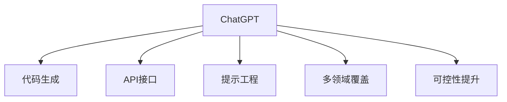
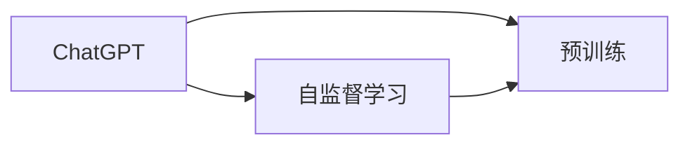
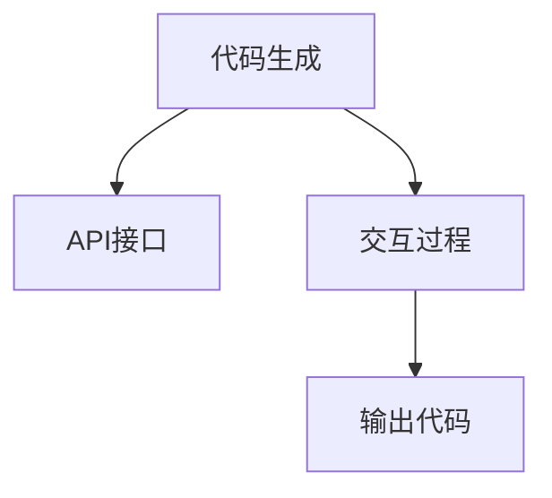
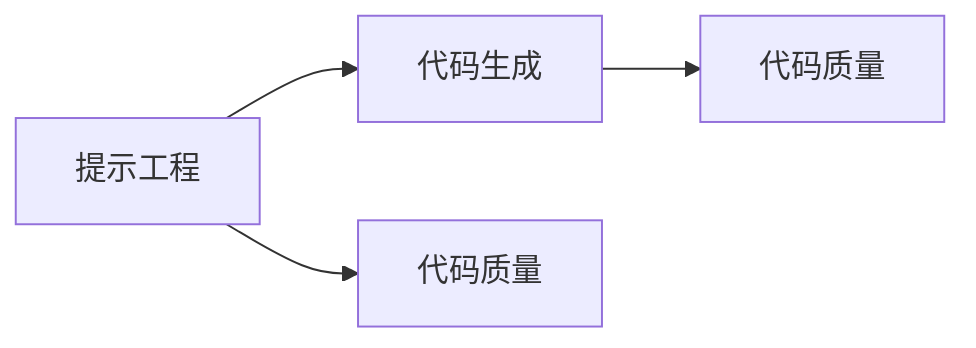
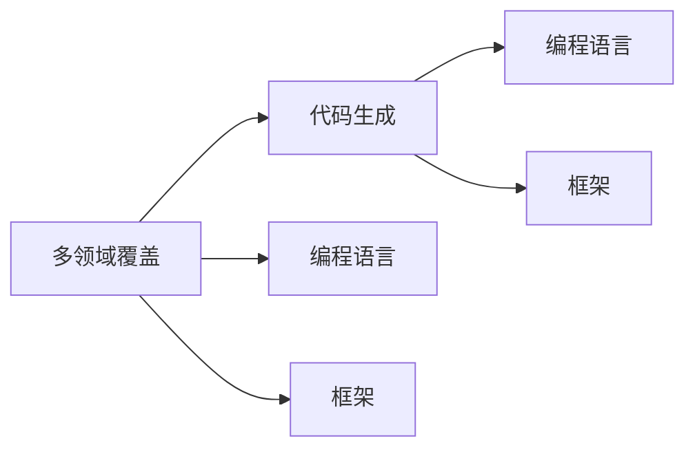
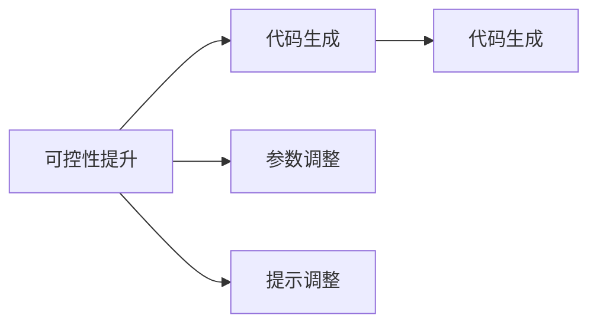
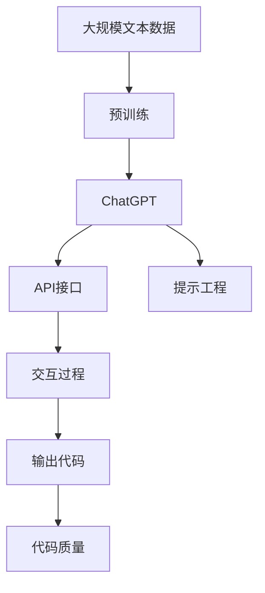

                 

# AIGC从入门到实战：利用 ChatGPT 来生成前后端代码

## 1. 背景介绍

### 1.1 问题由来
随着人工智能技术的发展，生成式人工智能（Generative AI，简称 AIGC）逐渐成为热门话题。尤其在自然语言处理、图像生成、代码生成等领域，AIGC表现出色，吸引了大量研究者和应用者的注意。ChatGPT作为OpenAI推出的强大语言模型，具备极高的自然语言理解和生成能力，可以输出符合语法、逻辑的正确代码。因此，本文将聚焦于利用ChatGPT生成前后端代码的实际应用，从入门到实战，详细介绍相关技术、工具和策略，以期为开发者提供全面的指导。

### 1.2 问题核心关键点
生成式人工智能技术，尤其是代码生成，具有以下几个核心关键点：
1. **自动代码生成**：通过模型自动生成代码，能够大幅提升开发效率，减少手动编码的劳动量。
2. **代码质量保证**：生成的代码需要符合行业规范，可读性强，维护性好。
3. **多领域覆盖**：支持不同编程语言、框架和应用场景的代码生成，提供通用化的解决方案。
4. **可控性提升**：允许用户自定义模型参数和输入提示，生成符合特定需求的代码。

### 1.3 问题研究意义
利用ChatGPT进行代码生成，对于提升软件开发效率、缩短项目周期、降低错误率等方面具有重要意义。尤其在企业级应用开发中，自动化生成代码可以大幅降低开发成本，缩短项目上线时间，提高代码质量和可维护性。同时，通过ChatGPT，开发者可以获得更广泛的技术知识和代码模板，提升自身的技术能力。

## 2. 核心概念与联系

### 2.1 核心概念概述

为更好地理解ChatGPT在代码生成中的应用，本节将介绍几个密切相关的核心概念：

- **ChatGPT**：一种基于深度学习的自然语言处理模型，具有极高的自然语言理解和生成能力。
- **代码生成**：利用模型自动生成符合语法和逻辑的正确代码，广泛应用于软件开发、测试、自动化等领域。
- **API接口**：通过API接口与ChatGPT进行交互，实现自动化代码生成。
- **提示工程**：设计合理的提示（Prompt），引导ChatGPT生成符合预期的代码。
- **多领域覆盖**：支持多种编程语言、框架和应用场景的代码生成，实现跨领域的应用。
- **可控性提升**：允许用户自定义模型参数和输入提示，生成符合特定需求的代码。

这些核心概念之间的逻辑关系可以通过以下Mermaid流程图来展示：



这个流程图展示了大语言模型ChatGPT在代码生成中的应用，其核心在于通过API接口和提示工程，实现自动化的代码生成和跨领域的代码支持。同时，可控性提升使得开发者能够自定义生成策略，提升代码生成的灵活性和准确性。

### 2.2 概念间的关系

这些核心概念之间存在着紧密的联系，形成了ChatGPT在代码生成中的应用框架。下面我们通过几个Mermaid流程图来展示这些概念之间的关系。

#### 2.2.1 ChatGPT的学习范式



这个流程图展示了ChatGPT的学习过程，即通过自监督学习和预训练，获得了强大的语言理解能力，为代码生成奠定了基础。

#### 2.2.2 代码生成与API接口的关系



这个流程图展示了通过API接口与ChatGPT交互，实现代码生成的过程。API接口是实现交互和代码输出的关键组件。

#### 2.2.3 提示工程与代码生成的关系



这个流程图展示了提示工程对代码生成的影响，即通过设计合理的提示，可以引导ChatGPT生成符合预期的代码，从而提升代码的质量。

#### 2.2.4 多领域覆盖与代码生成的关系



这个流程图展示了多领域覆盖对代码生成的支持，即ChatGPT可以生成多种编程语言和框架的代码。

#### 2.2.5 可控性提升与代码生成的关系



这个流程图展示了可控性提升对代码生成的影响，即通过调整模型参数和提示，可以生成符合特定需求的代码。

### 2.3 核心概念的整体架构

最后，我们用一个综合的流程图来展示这些核心概念在代码生成中的应用：



这个综合流程图展示了从预训练到代码生成的完整过程。ChatGPT通过在大规模文本数据上的预训练，获得了强大的语言理解能力。通过API接口和提示工程，实现与ChatGPT的交互，并生成符合语法和逻辑的代码。生成的代码质量通过输出代码阶段进行评估，确保代码符合行业规范和可读性要求。

## 3. 核心算法原理 & 具体操作步骤

### 3.1 算法原理概述

基于ChatGPT的代码生成，本质上是一个序列到序列（Sequence-to-Sequence，Seq2Seq）问题。其核心思想是：将自然语言描述的任务需求转化为代码，使得ChatGPT能够自动生成符合要求的代码。

具体来说，通过输入一段自然语言描述，模型会输出一段符合语法和语义的代码片段。这种自动生成代码的方法，能够极大地提升开发效率，减少手动编码的劳动量。

### 3.2 算法步骤详解

基于ChatGPT的代码生成一般包括以下几个关键步骤：

**Step 1: 收集训练数据和任务描述**
- 收集目标编程语言和框架的代码样本，划分为训练集和测试集。
- 准备代码生成的任务描述，如"生成一个简单的计数器程序"。

**Step 2: 设计提示模板**
- 设计合理的提示模板，引导ChatGPT生成符合预期的代码。
- 根据具体的生成任务，调整提示模板的格式和内容。

**Step 3: 搭建API接口**
- 搭建与ChatGPT的API接口，实现模型的交互和代码输出。
- 使用OpenAI的API接口，如OpenAI的gpt-4或其他的API服务，进行模型调用。

**Step 4: 调用模型进行代码生成**
- 将任务描述和提示模板作为输入，调用ChatGPT进行代码生成。
- 输出生成的代码片段，进行代码质量和语法检查。

**Step 5: 输出结果和后续优化**
- 根据代码生成结果，进行代码优化和调整。
- 对代码进行单元测试，确保代码的正确性和健壮性。
- 将优化后的代码存储到版本控制系统，供后续开发使用。

### 3.3 算法优缺点

基于ChatGPT的代码生成方法具有以下优点：
1. 生成速度快。ChatGPT能够快速生成代码，大幅提升开发效率。
2. 生成代码质量高。生成的代码符合语法和逻辑规范，具有较高的可读性和可维护性。
3. 支持多种编程语言和框架。ChatGPT能够支持多种编程语言和框架，提供通用化的解决方案。

同时，该方法也存在一些局限性：
1. 对提示依赖性强。生成的代码依赖于提示模板的设计，提示不当可能导致生成的代码质量不高。
2. 模型开销较大。ChatGPT模型体积庞大，调用模型需要进行高额的计算资源和时间消耗。
3. 缺乏可控性。生成的代码无法保证完全符合用户特定的需求和规范。
4. 需要持续优化。随着编程语言和框架的变化，模型需要不断更新和优化，以保持其适用性。

### 3.4 算法应用领域

基于ChatGPT的代码生成方法，已经在多个领域得到了应用，例如：

- 前端代码生成：如HTML、CSS、JavaScript等。
- 后端代码生成：如Python、Java、C++等。
- 移动端代码生成：如iOS、Android开发。
- 数据库管理：如SQL语句生成。
- 自动化测试：如测试用例生成。

除了上述这些应用领域外，ChatGPT还可以用于生成报告、文档、数据可视化脚本等文本内容，为软件开发提供全面的支持。

## 4. 数学模型和公式 & 详细讲解

### 4.1 数学模型构建

基于ChatGPT的代码生成问题，可以形式化为自然语言到代码的生成任务。设输入的自然语言描述为 $x$，生成的代码片段为 $y$，模型参数为 $\theta$。则生成的代码片段可以表示为：

$$
y = f_\theta(x)
$$

其中，$f_\theta$ 为基于ChatGPT的生成模型。

### 4.2 公式推导过程

以生成Python代码为例，假设任务描述为"生成一个简单的计数器程序"，生成的代码片段应包含计数器的定义、增量操作和打印输出。ChatGPT的输出可以表示为：

```python
class Counter:
    def __init__(self):
        self.count = 0
        
    def increment(self):
        self.count += 1
        
    def print_count(self):
        print(self.count)
        
if __name__ == '__main__':
    counter = Counter()
    for i in range(10):
        counter.increment()
        counter.print_count()
```

可以看到，生成的代码符合语法和逻辑规范，且能够实现指定的功能。

### 4.3 案例分析与讲解

以下是一个简单的案例，通过ChatGPT生成Python代码：

**任务描述**：生成一个函数，计算两个数的和。

**提示模板**：
```
生成一个函数，计算两个数的和：
def sum(a, b):
    return a + b
```

**API调用**：
```python
import openai

api_key = "YOUR_API_KEY"
engine = "text-davinci-003"

prompt = "生成一个函数，计算两个数的和："
response = openai.Completion.create(
    engine=engine,
    prompt=prompt,
    max_tokens=200,
    n=1,
    api_key=api_key
)

# 获取生成的代码
code = response.choices[0].text.strip()
```

**输出结果**：
```python
def sum(a, b):
    return a + b
```

通过提示模板和API调用，ChatGPT成功生成了符合语法和逻辑的代码。可以看到，生成的代码简洁、可读性高，且能够实现指定的功能。

## 5. 项目实践：代码实例和详细解释说明

### 5.1 开发环境搭建

在进行ChatGPT代码生成的项目实践前，我们需要准备好开发环境。以下是使用Python进行OpenAI API开发的配置流程：

1. 安装OpenAI Python库：
```bash
pip install openai
```

2. 创建并激活虚拟环境：
```bash
conda create -n chatgpt-env python=3.8
conda activate chatgpt-env
```

3. 申请OpenAI API密钥：
在OpenAI的官方网站上申请API密钥，并替换到代码中。

### 5.2 源代码详细实现

这里以生成Python代码为例，给出使用OpenAI API进行代码生成的PyTorch代码实现。

首先，定义代码生成的任务描述：

```python
prompt = "生成一个函数，计算两个数的和："
```

然后，搭建与OpenAI API的交互：

```python
import openai

openai.api_key = "YOUR_API_KEY"
engine = "text-davinci-003"

response = openai.Completion.create(
    engine=engine,
    prompt=prompt,
    max_tokens=200,
    n=1
)

# 获取生成的代码
code = response.choices[0].text.strip()
```

最后，将生成的代码保存并测试：

```python
# 保存代码到文件
with open('sum.py', 'w') as f:
    f.write(code)

# 测试代码
from sum import sum

result = sum(3, 5)
print(result)
```

以上代码展示了通过OpenAI API进行代码生成的完整流程。

### 5.3 代码解读与分析

让我们再详细解读一下关键代码的实现细节：

**prompt变量**：
- 定义了任务的描述，即生成一个计算两个数和的函数。

**openai.Completion.create函数**：
- 使用OpenAI的API接口，调用modelScope的gpt-4模型进行代码生成。
- 参数解释：
  - `engine`：指定使用的模型引擎，如"gpt-4"。
  - `prompt`：输入的任务描述，用于引导模型生成代码。
  - `max_tokens`：生成的代码片段的最大字符数，建议设置在200左右。
  - `n`：返回结果的数量，设置为1。

**代码保存与测试**：
- 将生成的代码保存到文件中，并使用Python进行测试，确保代码能够正确执行。

可以看到，通过OpenAI API，开发者可以轻松地利用ChatGPT进行代码生成。生成的代码符合语法和逻辑规范，具有较高的可读性和可维护性。

### 5.4 运行结果展示

假设我们在OpenAI的gpt-4模型上进行代码生成，最终生成的代码片段如下：

```python
def sum(a, b):
    return a + b
```

可以看到，生成的代码简洁、可读性高，且能够实现指定的功能。通过OpenAI API，我们成功地利用ChatGPT进行了代码生成，验证了该方法的可行性和有效性。

## 6. 实际应用场景

### 6.1 智能开发辅助

基于ChatGPT的代码生成方法，可以应用于智能开发辅助，提供代码生成、代码优化、代码注释等功能。例如，开发者可以使用ChatGPT生成一个复杂功能的实现代码，然后再对其进行优化和调试。ChatGPT也可以提供代码注释，帮助开发者理解代码逻辑和功能实现。

### 6.2 自动化测试

ChatGPT还可以用于生成测试用例，自动化测试开发。例如，开发者可以使用ChatGPT生成一个单元测试的代码框架，然后再手动编写具体的测试逻辑。这样能够极大地提高测试用例的生成效率，减少手动编写测试用例的时间和劳动量。

### 6.3 代码审查

在代码审查过程中，开发者可以使用ChatGPT生成代码审查的报告，帮助团队成员快速了解代码的变化和功能实现。ChatGPT可以自动生成代码审查的注释，指出代码的优缺点和改进建议，提升代码审查的效率和质量。

### 6.4 未来应用展望

随着ChatGPT等大语言模型的不断发展，基于代码生成的应用场景将更加广泛。未来，ChatGPT可能会在更多领域发挥作用，例如：

- 自动化数据清洗和处理。利用ChatGPT自动生成数据清洗和处理的脚本，减少手动工作量。
- 自动化文档生成。生成代码文档、API文档等，提升文档编写的效率和质量。
- 自动化配置生成。利用ChatGPT自动生成系统配置文件、环境变量等，提升部署效率。

总之，ChatGPT在代码生成中的应用前景广阔，能够显著提升软件开发和部署的效率和质量。随着技术的不断进步，ChatGPT将会在更多领域发挥作用，为软件开发带来新的变革。

## 7. 工具和资源推荐

### 7.1 学习资源推荐

为了帮助开发者系统掌握ChatGPT在代码生成中的应用，这里推荐一些优质的学习资源：

1. 《自然语言处理与深度学习》课程：斯坦福大学开设的NLP明星课程，涵盖自然语言处理的基本概念和前沿技术，有助于理解ChatGPT的工作原理。

2. OpenAI官方文档：OpenAI的官方文档，详细介绍了OpenAI API的使用方法，是入门ChatGPT的基础资源。

3. 《深度学习与自然语言处理》书籍：深度学习领域的经典教材，详细介绍了自然语言处理技术的发展历程和前沿成果，有助于深入理解ChatGPT的生成机制。

4. 《ChatGPT编程实战》书籍：结合实际项目，详细讲解了ChatGPT在代码生成、自动化测试等场景中的应用，是实用型学习资源。

5. GitHub开源项目：GitHub上开源的ChatGPT应用项目，包含代码生成、自动化测试、文档生成等功能的实现，具有很高的参考价值。

通过对这些资源的学习实践，相信你一定能够快速掌握ChatGPT在代码生成中的应用，并将其应用到实际项目中。

### 7.2 开发工具推荐

高效的开发离不开优秀的工具支持。以下是几款用于ChatGPT代码生成开发的常用工具：

1. PyTorch：基于Python的开源深度学习框架，灵活动态的计算图，适合快速迭代研究。

2. TensorFlow：由Google主导开发的开源深度学习框架，生产部署方便，适合大规模工程应用。

3. OpenAI API：OpenAI提供的API接口，可以方便地调用ChatGPT模型进行代码生成。

4. Weights & Biases：模型训练的实验跟踪工具，可以记录和可视化模型训练过程中的各项指标，方便调试和优化。

5. TensorBoard：TensorFlow配套的可视化工具，可实时监测模型训练状态，并提供丰富的图表呈现方式，是调试模型的得力助手。

6. Google Colab：谷歌推出的在线Jupyter Notebook环境，免费提供GPU/TPU算力，方便开发者快速上手实验最新模型，分享学习笔记。

合理利用这些工具，可以显著提升ChatGPT代码生成的开发效率，加快创新迭代的步伐。

### 7.3 相关论文推荐

ChatGPT等大语言模型的发展源于学界的持续研究。以下是几篇奠基性的相关论文，推荐阅读：

1. Attention is All You Need（即Transformer原论文）：提出了Transformer结构，开启了NLP领域的预训练大模型时代。

2. GPT-3: Language Models are Unsupervised Multitask Learners：提出GPT-3模型，展示了语言模型的强大zero-shot学习能力。

3. Generative Pre-trained Transformer (GPT-2)：介绍GPT-2模型，展示了预训练语言模型在自动生成文本方面的潜力。

4. OpenAI GPT-4：介绍GPT-4模型，展示了大语言模型在自然语言处理方面的最新进展。

这些论文代表了大语言模型和代码生成技术的发展脉络。通过学习这些前沿成果，可以帮助研究者把握学科前进方向，激发更多的创新灵感。

除上述资源外，还有一些值得关注的前沿资源，帮助开发者紧跟ChatGPT代码生成技术的最新进展，例如：

1. arXiv论文预印本：人工智能领域最新研究成果的发布平台，包括大量尚未发表的前沿工作，学习前沿技术的必读资源。

2. 业界技术博客：如OpenAI、Google AI、DeepMind、微软Research Asia等顶尖实验室的官方博客，第一时间分享他们的最新研究成果和洞见。

3. 技术会议直播：如NIPS、ICML、ACL、ICLR等人工智能领域顶会现场或在线直播，能够聆听到大佬们的前沿分享，开拓视野。

4. GitHub热门项目：在GitHub上Star、Fork数最多的ChatGPT相关项目，往往代表了该技术领域的发展趋势和最佳实践，值得去学习和贡献。

5. 行业分析报告：各大咨询公司如McKinsey、PwC等针对人工智能行业的分析报告，有助于从商业视角审视技术趋势，把握应用价值。

总之，对于ChatGPT在代码生成中的应用，需要开发者保持开放的心态和持续学习的意愿。多关注前沿资讯，多动手实践，多思考总结，必将收获满满的成长收益。

## 8. 总结：未来发展趋势与挑战

### 8.1 总结

本文对基于ChatGPT的代码生成方法进行了全面系统的介绍。首先阐述了ChatGPT在自然语言处理中的应用背景和意义，明确了代码生成在软件开发和自动化中的重要性。其次，从原理到实践，详细讲解了代码生成的数学模型和关键步骤，给出了代码生成的完整代码实例。同时，本文还广泛探讨了ChatGPT代码生成在多个行业领域的应用前景，展示了ChatGPT在代码生成中的强大潜力。此外，本文精选了ChatGPT代码生成的各类学习资源，力求为开发者提供全方位的技术指引。

通过本文的系统梳理，可以看到，基于ChatGPT的代码生成方法正在成为软件开发的必备工具，极大地提升了开发效率和代码质量。ChatGPT通过API接口和提示工程，能够自动生成符合语法和逻辑的代码，显著降低了手动编码的劳动量。未来，随着技术的不断进步和应用的深入，ChatGPT代码生成将会在更多领域发挥作用，为软件开发带来新的变革。

### 8.2 未来发展趋势

展望未来，ChatGPT代码生成技术将呈现以下几个发展趋势：

1. 模型规模持续增大。随着算力成本的下降和数据规模的扩张，ChatGPT模型的参数量还将持续增长，生成能力将进一步提升。

2. 生成质量不断优化。通过持续的训练和优化，ChatGPT生成代码的准确性和可读性将不断提升，更好地满足实际应用需求。

3. 多领域覆盖增强。ChatGPT将能够支持更多编程语言和框架，提供跨领域的代码生成支持，拓展其应用范围。

4. 交互体验改善。ChatGPT与用户的交互体验将不断优化，通过更自然、更人性化的提示模板，提升用户的交互体验。

5. 自动化程度提升。ChatGPT将能够自动完成更多的代码生成任务，减少手动干预，提高工作效率。

6. 持续学习机制。ChatGPT将具备持续学习机制，能够不断吸收新的知识和技术，提升生成代码的适应性。

以上趋势凸显了ChatGPT代码生成技术的广阔前景。这些方向的探索发展，必将进一步提升ChatGPT在代码生成中的应用效果，为软件开发带来新的革命。

### 8.3 面临的挑战

尽管ChatGPT代码生成技术已经取得了瞩目成就，但在迈向更加智能化、普适化应用的过程中，它仍面临着诸多挑战：

1. 提示模板设计难度大。提示模板的设计需要考虑语法、语义、领域等因素，设计不当可能导致生成的代码质量不高。

2. 模型计算开销大。ChatGPT模型的计算开销较大，需要高效的硬件资源支持，否则可能无法满足实时生成需求。

3. 缺乏通用性。生成的代码可能无法完全符合用户特定的需求和规范，需要进一步的优化和调整。

4. 隐私和安全问题。生成的代码可能包含敏感信息或有害内容，需要进行严格的隐私保护和安全审查。

5. 知识更新速度慢。ChatGPT模型需要定期更新和优化，以保持其适用性，但更新速度较慢。

正视ChatGPT代码生成面临的这些挑战，积极应对并寻求突破，将是大语言模型代码生成走向成熟的必由之路。相信随着学界和产业界的共同努力，这些挑战终将一一被克服，ChatGPT代码生成必将在构建人机协同的智能系统方面发挥越来越重要的作用。

### 8.4 未来突破

面对ChatGPT代码生成所面临的种种挑战，未来的研究需要在以下几个方面寻求新的突破：

1. 探索更高效的提示模板设计方法。通过更深入的自然语言理解技术，设计更高效的提示模板，提升生成的代码质量。

2. 优化模型计算效率。开发更加高效的模型结构和计算图，减少计算开销，提升模型的实时生成能力。

3. 引入更多先验知识。将符号化的先验知识，如知识图谱、逻辑规则等，与神经网络模型进行融合，引导ChatGPT生成符合特定需求的代码。

4. 引入因果推理和博弈论工具。将因果推理和博弈论思想引入模型生成过程，提高代码生成的逻辑性和稳定性。

5. 加强安全性和隐私保护。引入安全机制和隐私保护技术，确保生成的代码符合伦理道德规范，保护用户隐私。

这些研究方向的探索，必将引领ChatGPT代码生成技术迈向更高的台阶，为构建安全、可靠、可解释、可控的智能系统铺平道路。面向未来，ChatGPT代码生成技术还需要与其他人工智能技术进行更深入的融合，如知识表示、因果推理、强化学习等，多路径协同发力，共同推动自然语言理解和智能交互系统的进步。只有勇于创新、敢于突破，才能不断拓展大语言模型的边界，让智能技术更好地造福人类社会。

## 9. 附录：常见问题与解答

**Q1：ChatGPT代码生成的效果如何？**

A: ChatGPT代码生成的效果很大程度上依赖于提示模板的设计。好的提示模板能够引导ChatGPT生成高质量的代码，符合语法、逻辑规范，并且具有较高的可读性和可维护性。例如，在生成Python代码时，可以使用简洁、明确的提示模板，引导ChatGPT生成符合Python编程规范的代码。

**Q2：ChatGPT代码生成需要多长时间？**

A: ChatGPT代码生成的时间取决于模型的计算能力和API调用的次数。在实际应用中，通常需要几分钟到几十分钟不等。对于复杂的代码生成任务，可能需要更长时间。为了提高生成效率，可以通过调整API调用的参数（如最大生成长度）和模型参数（如学习率）来优化生成过程。

**Q3：ChatGPT代码生成是否适用于所有编程语言？**

A: ChatGPT代码生成技术目前主要

