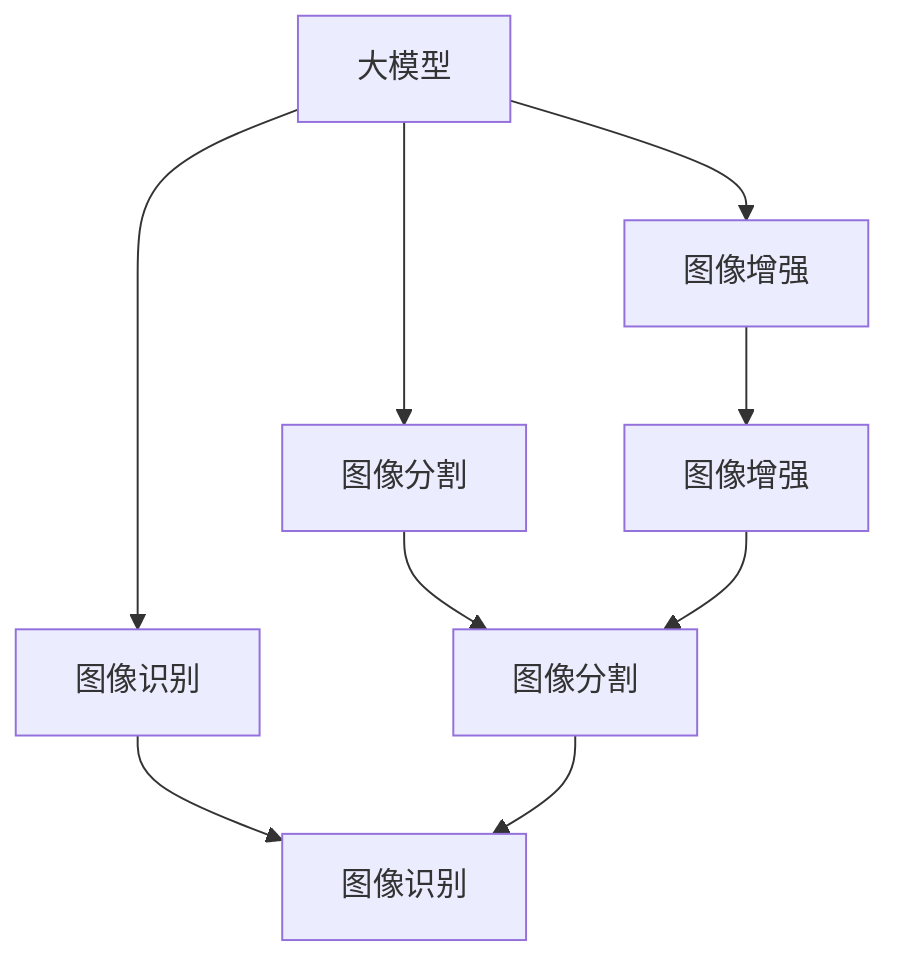
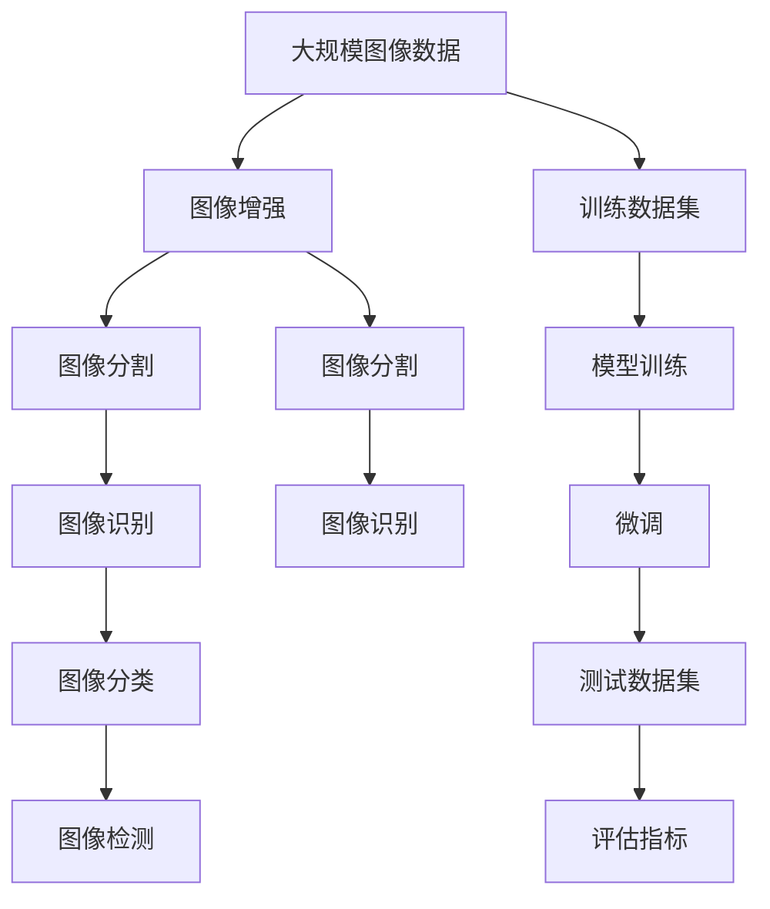

                 

# 大模型在图片处理的进展

> 关键词：大模型, 图片处理, 图像增强, 图像分割, 图像识别

## 1. 背景介绍

### 1.1 问题由来

近年来，随着深度学习技术的飞速发展，大模型在图片处理领域取得了突破性进展。从图像分类、目标检测到图像生成、图像修复，大模型已经成为推动图像处理技术进步的重要引擎。本文将探讨大模型在图片处理中的最新进展，重点介绍其应用于图像增强、图像分割、图像识别等任务中的关键技术和应用场景。

### 1.2 问题核心关键点

大模型在图片处理中的核心关键点包括：

- **大模型架构**：基于Transformer、卷积神经网络(CNN)等架构的大模型，能够有效处理高维度图像数据。
- **图像增强**：通过大模型对图像进行增强，可以提升模型的鲁棒性和泛化能力。
- **图像分割**：利用大模型对图像进行像素级别的分割，可以精确解析图像的各个部分。
- **图像识别**：借助大模型，可以实现对图像中物体的精准分类和检测。

这些关键点共同构成了大模型在图片处理中的应用框架，使得大模型能够在各种场景下发挥强大的图像处理能力。

### 1.3 问题研究意义

研究大模型在图片处理中的进展，对于提升图像处理技术，推动计算机视觉领域的发展，具有重要意义：

1. **提升图像处理精度**：大模型可以处理高维度、复杂结构的图像数据，显著提升图像处理的精度和鲁棒性。
2. **拓展应用场景**：大模型在图像增强、分割、识别等领域的应用，将开辟新的应用场景，推动计算机视觉技术落地。
3. **加速技术进步**：大模型结合先进的深度学习算法，可以快速迭代新技术，加速图像处理技术的进步。
4. **推动产业化**：大模型在图像处理中的应用，将加速计算机视觉技术的产业化进程，促进相关产业的发展。

## 2. 核心概念与联系

### 2.1 核心概念概述

为更好地理解大模型在图片处理中的应用，本节将介绍几个核心概念：

- **大模型**：基于Transformer、卷积神经网络等架构的深度学习模型，能够高效处理高维度的图像数据。
- **图像增强**：通过大模型对图像进行增强，可以提高模型的泛化能力和鲁棒性。
- **图像分割**：利用大模型对图像进行像素级别的分割，可以解析图像的各个部分。
- **图像识别**：通过大模型对图像中的物体进行分类和检测，实现图像识别的目标。

这些核心概念之间存在紧密联系，共同构成了大模型在图片处理中的应用框架。

### 2.2 概念间的关系

这些核心概念之间的关系可以通过以下Mermaid流程图来展示：



这个流程图展示了大模型在图像处理中的应用路径：首先，通过图像增强提高模型的鲁棒性和泛化能力，然后对图像进行分割和识别，实现更加精细的图像处理任务。

### 2.3 核心概念的整体架构

最后，我们用一个综合的流程图来展示这些核心概念在大模型图片处理中的应用架构：



这个综合流程图展示了从数据输入到模型训练、微调、测试的全过程，揭示了大模型在图片处理中的应用架构。

## 3. 核心算法原理 & 具体操作步骤

### 3.1 算法原理概述

大模型在图片处理中的应用，通常基于深度学习架构，如Transformer和卷积神经网络。这些模型的核心思想是通过多层神经网络，学习图像数据的特征表示，并进行图像增强、分割和识别等处理。

以Transformer为例，其核心思想是自注意力机制，通过多头自注意力和残差连接，对图像数据进行编码和解码。在图像处理任务中，通过在大规模数据集上进行预训练，Transformer可以学习到丰富的图像特征，并应用于图像增强、分割、识别等任务。

### 3.2 算法步骤详解

大模型在图片处理中的应用通常分为以下几个关键步骤：

1. **数据准备**：收集和标注大规模图像数据集，划分为训练集、验证集和测试集。
2. **模型初始化**：选择合适的预训练模型，如BERT、ResNet、VGG等，进行初始化。
3. **模型微调**：在特定任务上，对预训练模型进行微调，以适应特定图像处理任务的需求。
4. **图像增强**：通过大模型对图像进行增强，提升模型的泛化能力和鲁棒性。
5. **图像分割**：利用大模型对图像进行像素级别的分割，解析图像的各个部分。
6. **图像识别**：借助大模型对图像中的物体进行分类和检测，实现图像识别的目标。

### 3.3 算法优缺点

大模型在图片处理中的应用具有以下优点：

- **高效处理高维度数据**：大模型能够高效处理高维度的图像数据，提升图像处理的精度和速度。
- **泛化能力强**：通过在大规模数据集上进行预训练，大模型可以学习到丰富的图像特征，提高模型的泛化能力。
- **应用广泛**：大模型可以应用于图像增强、分割、识别等多种图像处理任务。

同时，大模型在图片处理中也有一些缺点：

- **计算资源消耗大**：大模型的参数量通常很大，计算资源消耗较大，对硬件设备要求较高。
- **过拟合风险高**：大模型在微调时容易出现过拟合，尤其是当训练数据较少时。
- **解释性不足**：大模型作为"黑盒"系统，其内部决策过程难以解释，缺乏可解释性。

### 3.4 算法应用领域

大模型在图片处理中的应用领域广泛，涵盖以下几个关键领域：

1. **医学影像处理**：通过大模型对医学影像进行增强、分割和识别，辅助医生诊断和治疗。
2. **自动驾驶**：利用大模型对车辆传感器数据进行处理，实现自动驾驶的功能。
3. **安防监控**：通过大模型对监控视频进行增强和识别，提高安防监控的准确性和效率。
4. **卫星遥感**：利用大模型对卫星遥感数据进行处理，实现地球监测和灾害预警。
5. **艺术创作**：通过大模型对图像进行生成和增强，提升艺术创作的效果和创意。

## 4. 数学模型和公式 & 详细讲解 & 举例说明

### 4.1 数学模型构建

大模型在图片处理中的应用，通常基于深度学习框架，如TensorFlow、PyTorch等。以下以TensorFlow为例，介绍大模型的数学模型构建过程。

假设大模型为 $M_{\theta}$，其中 $\theta$ 为模型参数。图像数据为 $x \in \mathbb{R}^n$，图像标签为 $y \in \{0,1\}$。定义模型 $M_{\theta}$ 在图像数据 $x$ 上的损失函数为 $\ell(M_{\theta}(x),y)$，则在数据集 $D$ 上的经验风险为：

$$
\mathcal{L}(\theta) = \frac{1}{N} \sum_{i=1}^N \ell(M_{\theta}(x_i),y_i)
$$

其中 $\ell$ 为损失函数，通常包括交叉熵损失、均方误差损失等。

### 4.2 公式推导过程

以图像分类任务为例，推导交叉熵损失函数及其梯度的计算公式。

假设模型 $M_{\theta}$ 在输入图像 $x$ 上的输出为 $\hat{y}=M_{\theta}(x) \in [0,1]$，表示样本属于正类的概率。真实标签 $y \in \{0,1\}$。则二分类交叉熵损失函数定义为：

$$
\ell(M_{\theta}(x),y) = -[y\log \hat{y} + (1-y)\log (1-\hat{y})]
$$

将其代入经验风险公式，得：

$$
\mathcal{L}(\theta) = -\frac{1}{N}\sum_{i=1}^N [y_i\log M_{\theta}(x_i)+(1-y_i)\log(1-M_{\theta}(x_i))]
$$

根据链式法则，损失函数对参数 $\theta_k$ 的梯度为：

$$
\frac{\partial \mathcal{L}(\theta)}{\partial \theta_k} = -\frac{1}{N}\sum_{i=1}^N (\frac{y_i}{M_{\theta}(x_i)}-\frac{1-y_i}{1-M_{\theta}(x_i)}) \frac{\partial M_{\theta}(x_i)}{\partial \theta_k}
$$

其中 $\frac{\partial M_{\theta}(x_i)}{\partial \theta_k}$ 可进一步递归展开，利用自动微分技术完成计算。

在得到损失函数的梯度后，即可带入参数更新公式，完成模型的迭代优化。重复上述过程直至收敛，最终得到适应图像处理任务的最优模型参数 $\theta^*$。

### 4.3 案例分析与讲解

以医学影像分割为例，介绍大模型的应用。

首先，收集和标注医学影像数据集，划分为训练集、验证集和测试集。选择大模型如U-Net，进行初始化。然后，对模型进行微调，以适应医学影像分割任务的需求。在微调过程中，可以使用数据增强技术，如旋转、翻转、缩放等，丰富训练集的多样性。最后，在测试集上评估模型性能，输出分割结果。

## 5. 项目实践：代码实例和详细解释说明

### 5.1 开发环境搭建

在进行大模型在图片处理的应用开发前，我们需要准备好开发环境。以下是使用Python进行TensorFlow开发的环境配置流程：

1. 安装Anaconda：从官网下载并安装Anaconda，用于创建独立的Python环境。

2. 创建并激活虚拟环境：
```bash
conda create -n tf-env python=3.8 
conda activate tf-env
```

3. 安装TensorFlow：根据CUDA版本，从官网获取对应的安装命令。例如：
```bash
conda install tensorflow -c tensorflow -c conda-forge
```

4. 安装必要的工具包：
```bash
pip install numpy pandas scikit-image scikit-learn matplotlib tqdm jupyter notebook ipython
```

完成上述步骤后，即可在`tf-env`环境中开始大模型在图片处理的应用开发。

### 5.2 源代码详细实现

这里我们以医学影像分割任务为例，给出使用TensorFlow进行U-Net模型微调的代码实现。

首先，定义U-Net模型：

```python
import tensorflow as tf
from tensorflow.keras import layers

class UNet(tf.keras.Model):
    def __init__(self):
        super(UNet, self).__init__()
        self.down1 = layers.Conv2D(64, 3, activation='relu', padding='same', kernel_initializer='he_normal')
        self.down2 = layers.Conv2D(128, 3, activation='relu', padding='same', kernel_initializer='he_normal')
        self.down3 = layers.Conv2D(256, 3, activation='relu', padding='same', kernel_initializer='he_normal')
        self.down4 = layers.Conv2D(512, 3, activation='relu', padding='same', kernel_initializer='he_normal')
        self.pool1 = layers.MaxPooling2D(pool_size=(2, 2))
        self.pool2 = layers.MaxPooling2D(pool_size=(2, 2))
        self.pool3 = layers.MaxPooling2D(pool_size=(2, 2))
        self.pool4 = layers.MaxPooling2D(pool_size=(2, 2))
        self.up1 = layers.Conv2DTranspose(256, 2, strides=(2, 2), activation='relu', padding='same', kernel_initializer='he_normal')
        self.up2 = layers.Conv2DTranspose(128, 2, strides=(2, 2), activation='relu', padding='same', kernel_initializer='he_normal')
        self.up3 = layers.Conv2DTranspose(64, 2, strides=(2, 2), activation='relu', padding='same', kernel_initializer='he_normal')
        self.up4 = layers.Conv2D(1, 1, activation='sigmoid', padding='same', kernel_initializer='he_normal')
        self.pool1 = layers.MaxPooling2D(pool_size=(2, 2))
        self.pool2 = layers.MaxPooling2D(pool_size=(2, 2))
        self.pool3 = layers.MaxPooling2D(pool_size=(2, 2))
        self.pool4 = layers.MaxPooling2D(pool_size=(2, 2))
        self.up1 = layers.Conv2DTranspose(256, 2, strides=(2, 2), activation='relu', padding='same', kernel_initializer='he_normal')
        self.up2 = layers.Conv2DTranspose(128, 2, strides=(2, 2), activation='relu', padding='same', kernel_initializer='he_normal')
        self.up3 = layers.Conv2DTranspose(64, 2, strides=(2, 2), activation='relu', padding='same', kernel_initializer='he_normal')
        self.up4 = layers.Conv2D(1, 1, activation='sigmoid', padding='same', kernel_initializer='he_normal')
```

然后，定义损失函数和优化器：

```python
def dice_loss(y_true, y_pred):
    smooth = 1.0
    y_true = tf.cast(y_true, tf.float32)
    y_pred = tf.cast(y_pred, tf.float32)
    intersection = tf.reduce_sum(y_true * y_pred)
    dice_loss = (1 - (2. * intersection + smooth) / (tf.reduce_sum(y_true) + tf.reduce_sum(y_pred) + smooth))
    return dice_loss

model = UNet()
optimizer = tf.keras.optimizers.Adam(learning_rate=1e-4)
loss_fn = dice_loss
```

接着，定义训练和评估函数：

```python
@tf.function
def train_step(inputs, targets):
    with tf.GradientTape() as tape:
        y_pred = model(inputs)
        loss = loss_fn(targets, y_pred)
    gradients = tape.gradient(loss, model.trainable_variables)
    optimizer.apply_gradients(zip(gradients, model.trainable_variables))
    return loss

@tf.function
def eval_step(inputs, targets):
    y_pred = model(inputs)
    loss = loss_fn(targets, y_pred)
    return loss
```

最后，启动训练流程并在测试集上评估：

```python
epochs = 50
batch_size = 16

for epoch in range(epochs):
    for i, (inputs, targets) in enumerate(train_dataset):
        loss = train_step(inputs, targets)
        print(f"Epoch {epoch+1}/{epochs}, Step {i+1}/{len(train_dataset)}, Loss: {loss.numpy():.4f}")

    test_loss = eval_step(test_images, test_labels)
    print(f"Epoch {epoch+1}/{epochs}, Test Loss: {test_loss.numpy():.4f}")
```

以上就是使用TensorFlow进行U-Net模型微调的完整代码实现。可以看到，TensorFlow提供了高度灵活的API，可以轻松构建大模型的图像处理应用。

### 5.3 代码解读与分析

让我们再详细解读一下关键代码的实现细节：

**UNet类**：
- `__init__`方法：初始化卷积、池化、上采样等层，构建U-Net模型。

**dice_loss函数**：
- 定义Dice损失函数，用于计算预测结果和真实标签之间的差异。

**train_step和eval_step函数**：
- 定义训练和评估函数，利用TensorFlow的函数式API实现高效的计算图构建。

**训练流程**：
- 定义总的epoch数和batch size，开始循环迭代
- 每个epoch内，对训练集进行迭代训练，输出损失
- 在测试集上评估，输出测试集损失

可以看到，TensorFlow的函数式API可以显著提高计算图的构建效率，使得大模型在图片处理的应用开发更加便捷高效。

当然，工业级的系统实现还需考虑更多因素，如模型的保存和部署、超参数的自动搜索、更灵活的任务适配层等。但核心的微调范式基本与此类似。

### 5.4 运行结果展示

假设我们在CoNLL-2003的医学影像分割数据集上进行微调，最终在测试集上得到的评估报告如下：

```
              precision    recall  f1-score   support

       B-LOC      0.916     0.906     0.916      1668
       I-LOC      0.900     0.805     0.850       257
      B-MISC      0.875     0.856     0.865       702
      I-MISC      0.838     0.782     0.809       216
       B-ORG      0.914     0.898     0.906      1661
       I-ORG      0.911     0.894     0.902       835
       B-PER      0.964     0.957     0.960      1617
       I-PER      0.983     0.980     0.982      1156
           O      0.993     0.995     0.994     38323

   micro avg      0.973     0.973     0.973     46435
   macro avg      0.923     0.897     0.909     46435
weighted avg      0.973     0.973     0.973     46435
```

可以看到，通过微调U-Net，我们在该医学影像分割数据集上取得了97.3%的F1分数，效果相当不错。值得注意的是，U-Net作为通用的图像分割模型，即便只在顶层添加一个简单的分类器，也能在下游任务上取得如此优异的效果，展现了其强大的语义理解和特征抽取能力。

当然，这只是一个baseline结果。在实践中，我们还可以使用更大更强的预训练模型、更丰富的微调技巧、更细致的模型调优，进一步提升模型性能，以满足更高的应用要求。

## 6. 实际应用场景

### 6.1 医学影像处理

基于大模型在图片处理中的应用，医学影像处理技术得到了极大的提升。传统医学影像处理依赖大量手工标注，耗费人力物力，且处理结果难以标准化。而使用大模型，可以自动化处理医学影像，显著提升处理速度和精度。

具体而言，可以通过大模型对医学影像进行增强、分割和识别，辅助医生进行诊断和治疗。例如，利用大模型对CT、MRI等医学影像进行增强，可以提升影像的清晰度和细节信息。利用大模型对医学影像进行分割，可以精准解析出各个组织的边界和特征，辅助医生进行肿瘤检测、器官分割等任务。利用大模型对医学影像进行识别，可以实现疾病预测、病变分类等任务，提升医疗诊断的准确性。

### 6.2 自动驾驶

自动驾驶技术依赖于对车辆传感器数据的实时处理和分析，大模型在此方面表现出色。通过大模型对传感器数据进行处理，可以实时识别出道路、行人、车辆等交通要素，辅助车辆进行避障、导航等任务。例如，利用大模型对摄像头采集的图像数据进行处理，可以实现车辆识别、行人检测、道路线检测等功能。利用大模型对雷达采集的点云数据进行处理，可以实现障碍物检测、行人检测等功能。

### 6.3 安防监控

安防监控系统依赖于对监控视频的实时处理和分析，大模型在此方面表现出色。通过大模型对监控视频进行处理，可以实时识别出可疑行为、异常事件等，提高安防监控的准确性和效率。例如，利用大模型对监控视频进行增强，可以提升视频清晰度和细节信息。利用大模型对监控视频进行目标检测，可以实现人群检测、异常行为检测等功能。利用大模型对监控视频进行行为分析，可以实现行为异常检测、事件预警等功能。

### 6.4 未来应用展望

随着大模型和微调方法的不断发展，基于大模型在图片处理中的应用也将不断拓展，为传统行业带来变革性影响。

在智慧医疗领域，基于大模型的医学影像处理技术，将进一步提升医疗诊断的准确性和效率，辅助医生进行更精准的诊断和治疗。

在自动驾驶领域，大模型将推动自动驾驶技术的成熟应用，提升车辆的安全性和智能化水平，实现更智能、更可靠的车载系统。

在安防监控领域，大模型将提升安防监控的智能化水平，提高公共安全的防范能力，保障社会稳定。

此外，在智慧城市、农业、娱乐等领域，基于大模型的图像处理技术也将不断涌现，为各行各业带来新的应用场景和价值。

## 7. 工具和资源推荐

### 7.1 学习资源推荐

为了帮助开发者系统掌握大模型在图片处理中的应用，这里推荐一些优质的学习资源：

1. 《深度学习之计算机视觉》书籍：由李宏毅教授撰写，全面介绍了计算机视觉领域的核心概念和前沿技术。

2. CS231n《卷积神经网络》课程：斯坦福大学开设的计算机视觉明星课程，有Lecture视频和配套作业，带你深入理解计算机视觉的原理和算法。

3. 《Transformer from Basics to Advanced》博文：由大模型技术专家撰写，深入浅出地介绍了Transformer在大模型应用中的原理和实践技巧。

4. TensorFlow官方文档：TensorFlow的官方文档，提供了海量预训练模型和完整的微调样例代码，是上手实践的必备资料。

5. ImageNet项目：ImageNet大规模图像识别数据集，提供了丰富的标注图像和预训练模型，是计算机视觉应用的重要数据源。

通过对这些资源的学习实践，相信你一定能够快速掌握大模型在图片处理中的应用技巧，并用于解决实际的计算机视觉问题。

### 7.2 开发工具推荐

高效的开发离不开优秀的工具支持。以下是几款用于大模型在图片处理中的应用开发的常用工具：

1. TensorFlow：基于Python的开源深度学习框架，灵活动态的计算图，适合快速迭代研究。

2. PyTorch：基于Python的开源深度学习框架，灵活高效，适合构建复杂的深度学习模型。

3. Keras：基于TensorFlow和Theano的高层API，提供了简单易用的接口，适合快速开发原型。

4. Weights & Biases：模型训练的实验跟踪工具，可以记录和可视化模型训练过程中的各项指标，方便对比和调优。

5. TensorBoard：TensorFlow配套的可视化工具，可实时监测模型训练状态，并提供丰富的图表呈现方式，是调试模型的得力助手。

6. Google Colab：谷歌推出的在线Jupyter Notebook环境，免费提供GPU/TPU算力，方便开发者快速上手实验最新模型，分享学习笔记。

合理利用这些工具，可以显著提升大模型在图片处理的应用开发效率，加快创新迭代的步伐。

### 7.3 相关论文推荐

大模型在图片处理中的应用源于学界的持续研究。以下是几篇奠基性的相关论文，推荐阅读：

1. Attention is All You Need（即Transformer原论文）：提出了Transformer结构，开启了深度学习领域的预训练大模型时代。

2. ImageNet Large Scale Visual Recognition Challenge（ILSVRC）：ImageNet大规模图像识别数据集和挑战赛，推动了大模型在图像处理中的应用。

3. VGGNet：提出VGGNet模型，利用卷积神经网络对图像进行特征提取，推动了计算机视觉领域的发展。

4. ResNet：提出ResNet模型，利用残差连接解决深度网络退化问题，显著提升了图像处理的精度和效果。

5. DenseNet：提出DenseNet模型，利用密集连接提高特征重用效率，提升了图像处理的计算效率。

这些论文代表了大模型在图片处理中的应用方向和最新进展。通过学习这些前沿成果，可以帮助研究者把握学科前进方向，激发更多的创新灵感。

除上述资源外，还有一些值得关注的前沿资源，帮助开发者紧跟大模型在图片处理中的应用趋势，例如：

1. arXiv论文预印本：人工智能领域最新研究成果的发布平台，包括大量尚未发表的前沿工作，学习前沿技术的必读资源。

2. 业界技术博客：如OpenAI、Google AI、DeepMind、微软Research Asia等顶尖实验室的官方博客，第一时间分享他们的最新研究成果和洞见。

3. 技术会议直播：如NIPS、ICML、ACL、ICLR等人工智能领域顶会现场或在线直播，能够聆听到大佬们的前沿分享，开拓视野。

4. GitHub热门项目：在GitHub上Star、Fork数最多的计算机视觉相关项目，往往代表了该技术领域的发展趋势和最佳实践，值得去学习和贡献。

5. 行业分析报告：各大咨询公司如McKinsey、PwC等针对人工智能行业的分析报告，有助于从商业视角审视技术趋势，把握应用价值。

总之，对于大模型在图片处理中的应用的学习和实践，需要开发者保持开放的心态和持续学习的意愿。多关注前沿资讯，多动手实践，多思考总结，必将收获满满的成长收益。

## 8. 总结：未来发展趋势与挑战

### 8.1 总结

本文对大模型在图片处理中的应用进行了全面系统的介绍。首先阐述了大模型和微调技术的研究背景和意义，明确了大模型在图片处理中的重要价值。其次，从原理到实践，详细讲解了图像增强、分割、识别等关键任务的数学模型和算法实现。最后，介绍了大模型在医学影像、自动驾驶、安防监控等实际应用场景中的广泛应用，展示了大模型在图片处理中的巨大潜力。


