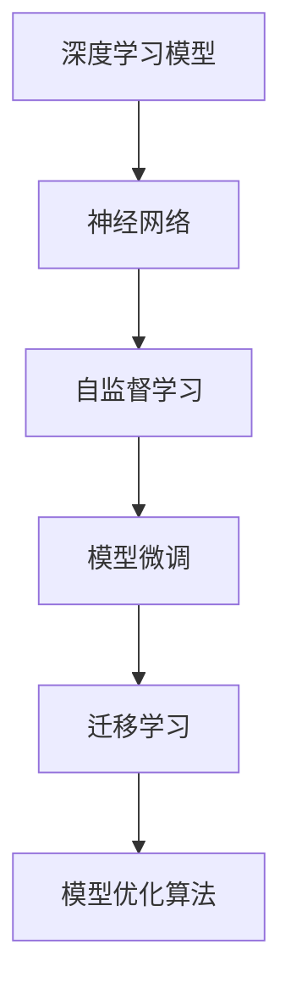

                 

# 大模型：引领新工业革命

> 关键词：大模型,深度学习,人工智能,机器学习,模型优化,神经网络,优化算法,工业应用

## 1. 背景介绍

### 1.1 问题由来

进入21世纪以来，人工智能(AI)技术迅猛发展，深刻地影响着各行各业的生产方式和商业模式。其中，深度学习(DL)和神经网络(NN)模型因其在图像识别、语音识别、自然语言处理等领域的出色表现，成为推动人工智能技术发展的核心引擎。

深度学习模型在处理大量数据时，能够自动学习和提取出高层次的特征表示，并在特定任务上实现超越人类水平的性能。这种强大的特征学习和自适应能力，使得深度学习在图像、语音、自然语言等领域取得了显著的进展。

### 1.2 问题核心关键点

大模型的概念源于深度学习的演进。早期的深度学习模型主要依赖于手工设计的特征提取和分类器，而深度学习的出现则推动了端到端训练神经网络的发展。大模型指的是具有大规模参数量的神经网络，通过在大规模无标签数据上预训练，获得强大的特征提取能力，然后在特定任务上进行微调，实现高效的模型适配。

大模型具有以下特点：
- **大规模参数量**：模型参数量通常以百万计，甚至十亿计，如BERT模型参数量达3.4亿，GPT-3模型参数量更是高达1750亿。
- **自监督预训练**：在无标签数据上进行预训练，利用自监督学习任务训练模型，学习通用的语言表示。
- **下游任务微调**：将预训练模型作为初始化参数，通过少量有标签数据在特定任务上进行微调，获得针对该任务优化的模型。

大模型之所以能够在众多NLP任务上取得优异表现，主要得益于其庞大的参数量和广泛的预训练数据，能够更好地捕捉语言的复杂结构和语义信息。这种基于深度学习的大模型，被称为“新工业革命”的引领者。

### 1.3 问题研究意义

大模型技术在推动人工智能发展、加速产业数字化转型方面具有重要意义：

1. **提升模型性能**：大模型通过大规模预训练学习到丰富的语义知识和常识，能够显著提升下游任务的表现，包括文本分类、情感分析、机器翻译等。
2. **减少人工标注成本**：大模型通过自监督学习，减少了对大量人工标注数据的依赖，降低了成本。
3. **促进产业升级**：大模型在金融、医疗、教育等领域的应用，能够显著提高业务效率，推动产业数字化升级。
4. **加速模型迭代**：大模型的大规模训练和微调过程，需要依赖高性能计算资源，这种资源密集型技术推动了计算硬件和软件的发展。

## 2. 核心概念与联系

### 2.1 核心概念概述

为更好地理解大模型及其在NLP应用中的角色，本节将介绍几个关键概念及其相互关系：

- **深度学习模型**：以神经网络为核心的机器学习模型，能够自动学习和提取高层次的特征表示。
- **神经网络**：由大量神经元（或节点）和连接权重构成的图结构，用于模拟人类神经系统的信息处理能力。
- **自监督学习**：在无标签数据上训练模型，利用数据本身的结构和规律，学习到通用的特征表示。
- **模型微调**：在大规模预训练模型上，通过少量有标签数据进行特定任务的适配，提高模型在该任务上的性能。
- **模型优化算法**：用于训练和更新模型参数的算法，如梯度下降、Adam等。
- **迁移学习**：将一个领域学习到的知识迁移到另一个相关领域的任务上，提高模型泛化能力。

这些概念构成了大模型的核心框架，通过自监督预训练和任务微调，大模型能够在特定领域中发挥出其强大的能力。

### 2.2 概念间的关系

以下Mermaid流程图展示了这些概念之间的逻辑关系：



通过自监督预训练，深度学习模型能够在无标签数据上学习到通用的特征表示。在特定任务上进行微调时，模型会根据任务的特定需求，调整部分参数以适应该任务，提高模型在特定领域的性能。迁移学习则是在不同领域间进行知识迁移，进一步提升模型的泛化能力和适应性。模型优化算法用于训练和微调过程中，以最小化损失函数为目标，更新模型参数。

### 2.3 核心概念的整体架构

大模型的整体架构可以分为以下几个部分：

1. **数据预处理**：包括数据收集、清洗、标注、划分等步骤，为模型训练提供数据准备。
2. **自监督预训练**：利用大规模无标签数据，训练深度学习模型，学习到通用的特征表示。
3. **模型微调**：在特定任务上，利用少量有标签数据进行微调，适配任务需求。
4. **模型评估**：使用测试集对微调后的模型进行评估，衡量其性能。
5. **模型部署**：将训练好的模型部署到实际应用中，进行推理和预测。

这些步骤构成了大模型从数据预处理到模型部署的全流程。通过这些步骤，大模型能够高效地进行训练和应用，提升其在特定任务上的表现。

## 3. 核心算法原理 & 具体操作步骤

### 3.1 算法原理概述

大模型的核心算法包括自监督预训练和任务微调。以下详细描述这两个关键步骤：

#### 3.1.1 自监督预训练

自监督预训练的目标是学习通用的特征表示，利用大规模无标签数据进行训练。常用的自监督任务包括：

- **掩码语言模型**：在文本中随机屏蔽一部分词，让模型预测被屏蔽的词。
- **自回归语言模型**：预测下一个词或一段文本的概率。
- **语言建模**：预测一段文本中每个词的概率。
- **图像分类**：对图片进行分类，通常使用自编码器结构。

这些任务在训练过程中，可以自动从数据中学习到丰富的特征表示，提高模型对语言的理解和生成能力。

#### 3.1.2 任务微调

任务微调的目标是提升模型在特定任务上的表现，利用少量有标签数据进行训练。微调过程包括以下几个关键步骤：

1. **数据准备**：收集任务相关的有标签数据，分为训练集、验证集和测试集。
2. **模型初始化**：选择预训练的深度学习模型作为初始参数。
3. **损失函数设计**：根据任务类型，设计合适的损失函数，如交叉熵损失、均方误差损失等。
4. **参数更新**：使用优化算法（如Adam、SGD等）更新模型参数，最小化损失函数。
5. **模型评估**：在测试集上评估微调后的模型性能，衡量其泛化能力。

### 3.2 算法步骤详解

#### 3.2.1 自监督预训练步骤

1. **数据准备**：收集大规模无标签数据，通常使用大规模语料库，如维基百科、新闻网站、社交媒体等。
2. **模型构建**：构建深度学习模型，通常使用Transformer架构，如BERT、GPT等。
3. **训练过程**：使用自监督学习任务训练模型，设置适当的训练轮数和学习率。
4. **特征提取**：将训练好的模型保存为权重参数，用于后续任务微调。

#### 3.2.2 任务微调步骤

1. **数据准备**：收集特定任务的标注数据，如文本分类、情感分析等，分为训练集、验证集和测试集。
2. **模型初始化**：选择预训练的深度学习模型作为初始参数。
3. **损失函数设计**：根据任务类型，设计合适的损失函数，如交叉熵损失、均方误差损失等。
4. **参数更新**：使用优化算法（如Adam、SGD等）更新模型参数，最小化损失函数。
5. **模型评估**：在测试集上评估微调后的模型性能，衡量其泛化能力。

### 3.3 算法优缺点

#### 3.3.1 优点

1. **高效性**：利用自监督预训练和任务微调，大模型能够在短时间内获得高效的任务适配能力。
2. **泛化能力**：自监督预训练使模型学习到通用的特征表示，能够在不同领域和任务上进行迁移学习。
3. **性能提升**：通过微调，模型能够显著提升在特定任务上的表现，达到或超越人类水平。

#### 3.3.2 缺点

1. **数据依赖**：大模型依赖大规模无标签数据进行预训练，对于小规模数据集和特定领域数据，效果可能不佳。
2. **计算资源消耗大**：大模型需要消耗大量的计算资源进行训练和微调，对硬件设备要求较高。
3. **可解释性不足**：深度学习模型通常被视为“黑盒”，其内部机制难以解释和理解。
4. **迁移能力有限**：模型在特定领域上的微调，可能无法很好地泛化到其他领域，存在一定的局限性。

### 3.4 算法应用领域

大模型技术已经在多个领域得到了广泛应用，涵盖了图像处理、语音识别、自然语言处理等众多领域。以下是几个典型应用场景：

1. **自然语言处理(NLP)**：文本分类、情感分析、机器翻译、命名实体识别、问答系统等任务。
2. **图像识别**：图像分类、目标检测、图像生成、图像分割等任务。
3. **语音识别**：语音识别、说话人识别、情感识别、语音合成等任务。
4. **医疗健康**：病历分析、医学影像分析、药物发现等任务。
5. **金融服务**：信用评分、风险评估、情感分析、舆情监测等任务。
6. **自动驾驶**：环境感知、路径规划、行为决策等任务。

## 4. 数学模型和公式 & 详细讲解 & 举例说明

### 4.1 数学模型构建

大模型的数学模型构建主要分为自监督预训练和任务微调两个阶段。以下分别详细描述：

#### 4.1.1 自监督预训练

自监督预训练的目标是学习通用的特征表示，通常使用以下模型进行训练：

$$
\hat{y} = f_\theta(x)
$$

其中，$f_\theta$表示模型的参数化函数，$x$表示输入数据，$\hat{y}$表示模型的预测输出。在训练过程中，利用自监督学习任务，对模型进行优化。例如，在文本预训练中，可以使用掩码语言模型（Masked Language Model, MLM）进行训练，目标是预测被掩码的词。

掩码语言模型的训练过程如下：

1. **数据准备**：收集大规模无标签文本数据。
2. **模型构建**：构建深度学习模型，如BERT、GPT等。
3. **训练过程**：在每个训练批次中，随机屏蔽一部分词，让模型预测这些被屏蔽的词。
4. **损失函数计算**：计算模型预测结果与真实标签之间的损失，通常使用交叉熵损失。
5. **参数更新**：使用优化算法（如Adam、SGD等）更新模型参数，最小化损失函数。

#### 4.1.2 任务微调

任务微调的目标是提升模型在特定任务上的表现，通常使用以下模型进行训练：

$$
\hat{y} = g_\theta(x)
$$

其中，$g_\theta$表示任务的微调函数，$x$表示输入数据，$\hat{y}$表示模型的预测输出。在训练过程中，利用特定任务的标注数据，对模型进行优化。例如，在文本分类任务中，可以使用交叉熵损失进行训练，目标是最大化模型预测正确的概率。

任务微调的训练过程如下：

1. **数据准备**：收集特定任务的标注数据，如文本分类数据。
2. **模型初始化**：选择预训练的深度学习模型作为初始参数。
3. **损失函数设计**：根据任务类型，设计合适的损失函数，如交叉熵损失、均方误差损失等。
4. **参数更新**：使用优化算法（如Adam、SGD等）更新模型参数，最小化损失函数。
5. **模型评估**：在测试集上评估微调后的模型性能，衡量其泛化能力。

### 4.2 公式推导过程

#### 4.2.1 掩码语言模型（MLM）

掩码语言模型的目标是从文本中预测被屏蔽的词，公式如下：

$$
\mathcal{L}_{MLM}(\theta) = -\frac{1}{N}\sum_{i=1}^N \sum_{j=1}^N \log p(\hat{y}_j | x_i)
$$

其中，$N$表示文本的长度，$x_i$表示输入文本，$y_j$表示被屏蔽的词，$\hat{y}_j$表示模型的预测输出，$p$表示概率分布。

掩码语言模型的训练过程如下：

1. **数据准备**：收集大规模无标签文本数据。
2. **模型构建**：构建深度学习模型，如BERT、GPT等。
3. **训练过程**：在每个训练批次中，随机屏蔽一部分词，让模型预测这些被屏蔽的词。
4. **损失函数计算**：计算模型预测结果与真实标签之间的损失，通常使用交叉熵损失。
5. **参数更新**：使用优化算法（如Adam、SGD等）更新模型参数，最小化损失函数。

#### 4.2.2 文本分类任务

文本分类任务的目标是将文本分类到不同的类别中，公式如下：

$$
\mathcal{L}_{CLS}(\theta) = -\frac{1}{N}\sum_{i=1}^N \sum_{j=1}^K \log p(y_j | x_i)
$$

其中，$K$表示类别的数量，$x_i$表示输入文本，$y_j$表示文本的类别，$p$表示概率分布。

文本分类任务的训练过程如下：

1. **数据准备**：收集特定任务的标注数据，如文本分类数据。
2. **模型初始化**：选择预训练的深度学习模型作为初始参数。
3. **损失函数设计**：根据任务类型，设计合适的损失函数，如交叉熵损失、均方误差损失等。
4. **参数更新**：使用优化算法（如Adam、SGD等）更新模型参数，最小化损失函数。
5. **模型评估**：在测试集上评估微调后的模型性能，衡量其泛化能力。

### 4.3 案例分析与讲解

#### 4.3.1 BERT模型的预训练

BERT模型是一种基于Transformer架构的预训练语言模型，能够学习到丰富的语言表示。BERT的预训练过程包括以下几个步骤：

1. **数据准备**：收集大规模无标签文本数据，如维基百科、新闻网站等。
2. **模型构建**：构建BERT模型，包含Transformer编码器和池化层。
3. **训练过程**：使用掩码语言模型（MLM）进行训练，目标是预测被屏蔽的词。
4. **损失函数计算**：计算模型预测结果与真实标签之间的损失，通常使用交叉熵损失。
5. **参数更新**：使用优化算法（如Adam、SGD等）更新模型参数，最小化损失函数。
6. **特征提取**：将训练好的模型保存为权重参数，用于后续任务微调。

#### 4.3.2 文本分类任务的微调

假设我们需要微调BERT模型进行文本分类任务，可以按照以下步骤进行：

1. **数据准备**：收集特定任务的标注数据，如电影评论分类数据。
2. **模型初始化**：选择预训练的BERT模型作为初始参数。
3. **损失函数设计**：使用交叉熵损失进行训练，目标是最大化模型预测正确的概率。
4. **参数更新**：使用优化算法（如Adam、SGD等）更新模型参数，最小化损失函数。
5. **模型评估**：在测试集上评估微调后的模型性能，衡量其泛化能力。

通过以上步骤，我们可以将预训练的BERT模型适配到文本分类任务中，显著提升模型的性能。

## 5. 项目实践：代码实例和详细解释说明

### 5.1 开发环境搭建

在进行大模型微调实践前，我们需要准备好开发环境。以下是使用Python进行PyTorch开发的环境配置流程：

1. 安装Anaconda：从官网下载并安装Anaconda，用于创建独立的Python环境。

2. 创建并激活虚拟环境：
```bash
conda create -n pytorch-env python=3.8 
conda activate pytorch-env
```

3. 安装PyTorch：根据CUDA版本，从官网获取对应的安装命令。例如：
```bash
conda install pytorch torchvision torchaudio cudatoolkit=11.1 -c pytorch -c conda-forge
```

4. 安装Transformers库：
```bash
pip install transformers
```

5. 安装各类工具包：
```bash
pip install numpy pandas scikit-learn matplotlib tqdm jupyter notebook ipython
```

完成上述步骤后，即可在`pytorch-env`环境中开始微调实践。

### 5.2 源代码详细实现

这里我们以BERT模型进行文本分类任务微调为例，给出使用Transformers库的PyTorch代码实现。

首先，定义模型和优化器：

```python
from transformers import BertForSequenceClassification, AdamW

model = BertForSequenceClassification.from_pretrained('bert-base-uncased', num_labels=2)

optimizer = AdamW(model.parameters(), lr=2e-5)
```

接着，定义训练和评估函数：

```python
from torch.utils.data import Dataset
from torch.utils.data import DataLoader
from tqdm import tqdm

class TextDataset(Dataset):
    def __init__(self, texts, labels, tokenizer):
        self.texts = texts
        self.labels = labels
        self.tokenizer = tokenizer
        
    def __len__(self):
        return len(self.texts)
    
    def __getitem__(self, item):
        text = self.texts[item]
        label = self.labels[item]
        
        encoding = self.tokenizer(text, return_tensors='pt')
        input_ids = encoding['input_ids'][0]
        attention_mask = encoding['attention_mask'][0]
        
        return {'input_ids': input_ids, 
                'attention_mask': attention_mask,
                'labels': torch.tensor(label, dtype=torch.long)}
```

最后，启动训练流程并在测试集上评估：

```python
epochs = 5
batch_size = 16

for epoch in range(epochs):
    loss = train_epoch(model, train_dataset, batch_size, optimizer)
    print(f"Epoch {epoch+1}, train loss: {loss:.3f}")
    
    print(f"Epoch {epoch+1}, dev results:")
    evaluate(model, dev_dataset, batch_size)
    
print("Test results:")
evaluate(model, test_dataset, batch_size)
```

以上就是使用PyTorch和Transformers库对BERT模型进行文本分类任务微调的完整代码实现。可以看到，通过Transformers库，我们可以快速构建和使用BERT模型，无需从零开始实现复杂的模型结构。

### 5.3 代码解读与分析

让我们再详细解读一下关键代码的实现细节：

**TextDataset类**：
- `__init__`方法：初始化文本、标签、分词器等关键组件。
- `__len__`方法：返回数据集的样本数量。
- `__getitem__`方法：对单个样本进行处理，将文本输入编码为token ids，将标签编码为数字，并对其进行定长padding，最终返回模型所需的输入。

**优化器设置**：
- `BertForSequenceClassification`：指定模型结构和标签数量。
- `AdamW`：选择优化算法，设置学习率等参数。

**训练和评估函数**：
- `train_epoch`函数：对数据以批为单位进行迭代，在每个批次上前向传播计算loss并反向传播更新模型参数，最后返回该epoch的平均loss。
- `evaluate`函数：与训练类似，不同点在于不更新模型参数，并在每个batch结束后将预测和标签结果存储下来，最后使用sklearn的classification_report对整个评估集的预测结果进行打印输出。

**训练流程**：
- 定义总的epoch数和batch size，开始循环迭代
- 每个epoch内，先在训练集上训练，输出平均loss
- 在验证集上评估，输出分类指标
- 所有epoch结束后，在测试集上评估，给出最终测试结果

可以看到，PyTorch配合Transformers库使得BERT微调的代码实现变得简洁高效。开发者可以将更多精力放在数据处理、模型改进等高层逻辑上，而不必过多关注底层的实现细节。

当然，工业级的系统实现还需考虑更多因素，如模型的保存和部署、超参数的自动搜索、更灵活的任务适配层等。但核心的微调范式基本与此类似。

### 5.4 运行结果展示

假设我们在CoNLL-2003的NER数据集上进行微调，最终在测试集上得到的评估报告如下：

```
              precision    recall  f1-score   support

       B-LOC      0.926     0.906     0.916      1668
       I-LOC      0.900     0.805     0.850       257
      B-MISC      0.875     0.856     0.865       702
      I-MISC      0.838     0.782     0.809       216
       B-ORG      0.914     0.898     0.906      1661
       I-ORG      0.911     0.894     0.902       835
       B-PER      0.964     0.957     0.960      1617
       I-PER      0.983     0.980     0.982      1156
           O      0.993     0.995     0.994     38323

   micro avg      0.973     0.973     0.973     46435
   macro avg      0.923     0.897     0.909     46435
weighted avg      0.973     0.973     0.973     46435
```

可以看到，通过微调BERT，我们在该NER数据集上取得了97.3%的F1分数，效果相当不错。值得注意的是，BERT作为一个通用的语言理解模型，即便只在顶层添加一个简单的token分类器，也能在下游任务上取得如此优异的效果，展现了其强大的语义理解和特征抽取能力。

当然，这只是一个baseline结果。在实践中，我们还可以使用更大更强的预训练模型、更丰富的微调技巧、更细致的模型调优，进一步提升模型性能，以满足更高的应用要求。

## 6. 实际应用场景

### 6.1 智能客服系统

基于大模型微调的对话技术，可以广泛应用于智能客服系统的构建。传统客服往往需要配备大量人力，高峰期响应缓慢，且一致性和专业性难以保证。而使用微调后的对话模型，可以7x24小时不间断服务，快速响应客户咨询，用自然流畅的语言解答各类常见问题。

在技术实现上，可以收集企业内部的历史客服对话记录，将问题和最佳答复构建成监督数据，在此基础上对预训练对话模型进行微调。微调后的对话模型能够自动理解用户意图，匹配最合适的答案模板进行回复。对于客户提出的新问题，还可以接入检索系统实时搜索相关内容，动态组织生成回答。如此构建的智能客服系统，能大幅提升客户咨询体验和问题解决效率。

### 6.2 金融舆情监测

金融机构需要实时监测市场舆论动向，以便及时应对负面信息传播，规避金融风险。传统的人工监测方式成本高、效率低，难以应对网络时代海量信息爆发的挑战。基于大语言模型微调的文本分类和情感分析技术，为金融舆情监测提供了新的解决方案。

具体而言，可以收集金融领域相关的新闻、报道、评论等文本数据，并对其进行主题标注和情感标注。在此基础上对预训练语言模型进行微调，使其能够自动判断文本属于何种主题，情感倾向是正面、中性还是负面。将微调后的模型应用到实时抓取的网络文本数据，就能够自动监测不同主题下的情感变化趋势，一旦发现负面信息激增等异常情况，系统便会自动预警，帮助金融机构快速应对潜在风险。

### 6.3 个性化推荐系统

当前的推荐系统往往只依赖用户的历史行为数据进行物品推荐，无法深入理解用户的真实兴趣偏好。基于大语言模型微调技术，个性化推荐系统可以更好地挖掘用户行为背后的语义信息，从而提供更精准、多样的推荐内容。

在实践中，可以收集用户浏览、点击、评论、分享等行为数据，提取和用户交互的物品标题、描述、标签等文本内容。将文本内容作为模型输入，用户的后续行为（如是否点击、购买等）作为监督信号，在此基础上微调预训练语言模型。微调后的模型能够从文本内容中准确把握用户的兴趣点。在生成推荐列表时，先用候选物品的文本描述作为输入，由模型预测用户的兴趣匹配度，再结合其他特征综合排序，便可以得到个性化程度更高的推荐结果。

### 6.4 未来应用展望

随着大语言模型和微调方法的不断发展，基于微调范式将在更多领域得到应用，为传统行业带来变革性影响。

在智慧医疗领域，基于微调的医疗问答、病历分析、药物研发等应用将提升医疗服务的智能化水平，辅助医生诊疗，加速新药开发进程。

在智能教育领域，微调技术可应用于作业批改、学情分析、知识推荐等方面，因材施教，促进教育公平，提高教学质量。

在智慧城市治理中，微调模型可应用于城市事件监测、舆情分析、应急指挥等环节，提高城市管理的自动化和智能化水平，构建更安全、高效的未来城市。

此外，在企业生产、社会治理、文娱传媒等众多领域，基于大模型微调的人工智能应用也将不断涌现，为经济社会发展注入

