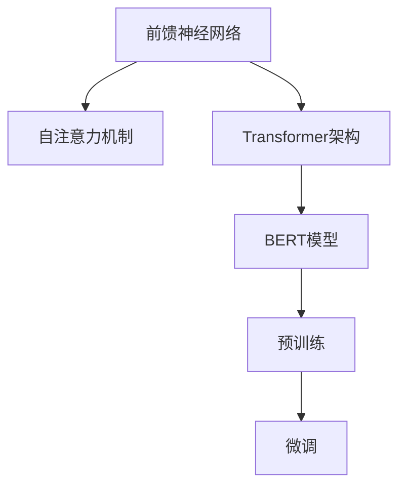

                 

# 大语言模型原理与工程实践：前馈神经网络

> 关键词：大语言模型,前馈神经网络,自然语言处理(NLP),Transformer,BERT,深度学习,自监督学习

## 1. 背景介绍

### 1.1 问题由来
随着深度学习技术的迅猛发展，大语言模型（Large Language Models, LLMs）在自然语言处理（NLP）领域取得了显著进展。这些模型通过在大规模无标签文本数据上自监督预训练，学习到广泛的语义和语言结构，具备强大的语言生成和理解能力。其中，前馈神经网络（Feedforward Neural Networks, FNNs），尤其是Transformer架构，因其高效并行计算和自注意力机制，成为了大语言模型的核心组成部分。

### 1.2 问题核心关键点
前馈神经网络的核心思想是通过多层非线性变换，将输入的原始文本向量转换为更高层次的语义表示，最终输出目标文本或标签。具体来说，前馈网络包含输入层、若干隐藏层和输出层，每一层的节点通过全连接权重矩阵和激活函数进行非线性变换。

Transformer架构则在此基础上引入了自注意力机制，通过计算输入序列中不同位置节点之间的权重，实现全局信息捕捉和特征提取。BERT等模型正是基于Transformer架构，通过在大规模语料上自监督预训练，获得了卓越的性能。

### 1.3 问题研究意义
前馈神经网络和Transformer架构的研究和应用，对于提升自然语言处理技术的性能、降低模型训练和部署成本、促进NLP技术在工业界的落地应用具有重要意义：

1. **提升性能**：Transformer结构通过自注意力机制，可以捕捉长距离依赖，更好地理解句子结构和语义信息，从而提高模型的语言处理能力。
2. **降低成本**：前馈网络通常比递归神经网络（RNNs）和卷积神经网络（CNNs）具有更高的并行性，更适合大规模硬件资源的分布式训练。
3. **推动应用**：通过预训练-微调（Pre-training & Fine-tuning）技术，前馈神经网络在大规模数据集上的预训练可以显著提升下游任务的性能，推动NLP技术的产业化进程。
4. **催生新技术**：Transformer架构的流行，催生了包括预训练语言模型、自监督学习、 Prompt Learning 等新技术，进一步拓展了NLP的应用场景。

## 2. 核心概念与联系

### 2.1 核心概念概述

为了更好地理解前馈神经网络在大语言模型中的作用和架构，本节将介绍几个核心概念：

- 前馈神经网络（Feedforward Neural Networks, FNNs）：一种基本的神经网络结构，包含输入层、若干隐藏层和输出层，每一层通过全连接权重矩阵和激活函数进行非线性变换。
- 自注意力机制（Self-Attention）：一种用于捕捉序列中位置间依赖关系的机制，通过计算节点之间的权重，实现全局信息捕捉。
- Transformer架构：一种基于自注意力机制的神经网络结构，特别适用于序列数据处理，如文本、音频等。
- BERT（Bidirectional Encoder Representations from Transformers）：一种基于Transformer架构的预训练语言模型，通过大规模无标签文本数据上的自监督学习，获得了广泛的语言知识。
- 预训练（Pre-training）：一种在大规模无标签数据上训练模型的技术，通过自监督学习任务如掩码语言模型、next word prediction等，学习到通用语言表示。
- 微调（Fine-tuning）：在预训练模型的基础上，使用下游任务的少量标注数据进行有监督学习，优化模型在特定任务上的性能。

这些核心概念之间存在紧密的联系，共同构成了大语言模型的核心框架。通过理解这些概念，我们可以更好地把握前馈神经网络在大语言模型中的作用和优化方向。

### 2.2 概念间的关系

这些核心概念之间通过以下Mermaid流程图展示了它们之间的联系和作用：



这个流程图展示了从基础的前馈神经网络，到自注意力机制的引入，再到Transformer架构的构建，最后通过预训练和微调技术，优化模型在特定任务上的表现。

## 3. 核心算法原理 & 具体操作步骤

### 3.1 算法原理概述

前馈神经网络的核心思想是通过多层非线性变换，将输入的原始文本向量转换为更高层次的语义表示，最终输出目标文本或标签。具体来说，前馈网络包含输入层、若干隐藏层和输出层，每一层的节点通过全连接权重矩阵和激活函数进行非线性变换。

Transformer架构则在此基础上引入了自注意力机制，通过计算输入序列中不同位置节点之间的权重，实现全局信息捕捉和特征提取。BERT等模型正是基于Transformer架构，通过在大规模语料上自监督预训练，获得了卓越的性能。

### 3.2 算法步骤详解

前馈神经网络的主要步骤如下：

1. **输入层**：将原始文本序列转换为等长的向量表示，例如将文本中每个单词映射为嵌入向量。
2. **隐藏层**：通过多层全连接层和激活函数对输入向量进行非线性变换，生成中间表示。
3. **输出层**：将中间表示通过线性变换和softmax函数转换为目标输出向量，例如生成文本序列的概率分布或分类标签。

Transformer架构在隐藏层部分引入了自注意力机制，使得网络能够捕捉到输入序列中长距离的依赖关系，从而提升模型的表达能力。具体步骤如下：

1. **多头自注意力**：将输入序列中的每个节点分别计算与其他节点的相似度，并加权求和，生成一个新的向量表示。
2. **位置编码**：为每个位置向量添加位置信息，使得模型能够正确识别序列中不同位置的关系。
3. **残差连接**：将自注意力输出与原始输入向量相加，并传递到下一层。
4. **前馈网络**：通过多层全连接网络对残差连接后的向量进行非线性变换。
5. **多层堆叠**：通过堆叠多个编码器层和解码器层，实现对输入序列的复杂映射。

### 3.3 算法优缺点

前馈神经网络在大语言模型中的应用具有以下优点：

- **高效计算**：前馈网络通过多层非线性变换，实现了对输入序列的复杂映射，可以高效地处理大规模文本数据。
- **并行计算**：Transformer架构的多头自注意力机制可以并行计算，提高了训练和推理的速度。
- **表达能力强**：自注意力机制能够捕捉长距离依赖，使得模型能够更好地理解文本的语义结构。

然而，前馈神经网络也存在一些局限性：

- **参数量较大**：随着层数的增加，网络参数量呈指数增长，导致训练和推理的计算成本较高。
- **局部记忆能力有限**：虽然自注意力机制可以捕捉全局信息，但对于局部信息的处理仍有一定的限制，可能导致信息的丢失。
- **依赖大规模数据**：预训练模型的效果很大程度上依赖于大规模无标签数据的训练，数据获取和预处理成本较高。

### 3.4 算法应用领域

前馈神经网络在NLP领域的应用已经非常广泛，涵盖了从文本分类、命名实体识别到机器翻译、对话系统等多个任务。以下是几个典型应用场景：

1. **文本分类**：通过将文本输入到预训练模型中，生成向量表示，并通过分类器输出分类标签。
2. **命名实体识别**：将文本中的实体边界标记为"BIO"标签，通过BERT等模型进行识别。
3. **机器翻译**：将源语言文本输入到模型中，生成目标语言文本的序列。
4. **对话系统**：将用户输入的文本序列输入到模型中，生成对话系统响应的文本序列。
5. **文本摘要**：将长文本输入到模型中，生成摘要文本序列。

除了这些经典任务外，前馈神经网络还被应用于情感分析、问答系统、语义搜索等任务，展示了其在NLP领域的广泛应用潜力。

## 4. 数学模型和公式 & 详细讲解 & 举例说明

### 4.1 数学模型构建

前馈神经网络的核心数学模型可以表示为：

$$
\mathcal{F}(\boldsymbol{x}, \boldsymbol{W}) = \boldsymbol{O}
$$

其中，$\boldsymbol{x}$ 表示输入序列，$\boldsymbol{W}$ 表示模型参数，$\boldsymbol{O}$ 表示输出序列。

Transformer架构的核心数学模型可以表示为：

$$
\mathcal{F}_{\text{Transformer}}(\boldsymbol{x}, \boldsymbol{W}) = \boldsymbol{O}
$$

其中，$\mathcal{F}_{\text{Transformer}}$ 表示Transformer模型的前向传播函数，$\boldsymbol{W}$ 表示模型参数。

### 4.2 公式推导过程

以BERT模型为例，介绍其自监督预训练任务：

1. **掩码语言模型**：将输入文本中的某些单词随机掩码，模型需要预测这些掩码单词的正确序列。
2. **下一词预测**：将输入文本中的单词$x_t$和后继单词$x_{t+1}$配对，模型需要预测$x_{t+1}$的概率分布。

这两个任务的数学模型可以表示为：

$$
P(x_{t+1} | x_t, \boldsymbol{W}) = \frac{e^{\boldsymbol{W}^{[\text{MLM}]} [x_t, x_{t+1}]}}{\sum_{j \in V} e^{\boldsymbol{W}^{[\text{MLM}]} [x_t, j]}}
$$

$$
P(x_{t+1} | x_t, \boldsymbol{W}) = \frac{e^{\boldsymbol{W}^{[\text{NSP}]} [x_t, x_{t+1}]}}{\sum_{j \in V} e^{\boldsymbol{W}^{[\text{NSP}]} [x_t, j]}}
$$

其中，$\boldsymbol{W}^{[\text{MLM}]}$ 和 $\boldsymbol{W}^{[\text{NSP}]}$ 表示BERT模型中的掩码语言模型和下一词预测模型的参数。

### 4.3 案例分析与讲解

以BERT模型为例，介绍其预训练和微调过程：

1. **预训练**：在大规模无标签文本数据上进行掩码语言模型和下一词预测任务的自监督预训练，学习通用语言表示。
2. **微调**：在特定任务的标注数据上进行有监督学习，优化模型在该任务上的性能。

以文本分类任务为例，BERT模型的微调过程如下：

1. **输入表示**：将输入文本序列转换为BERT模型的嵌入向量。
2. **特征提取**：通过BERT模型的多层自注意力机制和前馈网络，生成文本的语义表示。
3. **分类器**：在生成的语义表示上添加一个线性分类器，输出文本的分类标签。

## 5. 项目实践：代码实例和详细解释说明

### 5.1 开发环境搭建

在进行前馈神经网络模型的实践前，我们需要准备好开发环境。以下是使用Python进行PyTorch开发的环境配置流程：

1. 安装Anaconda：从官网下载并安装Anaconda，用于创建独立的Python环境。

2. 创建并激活虚拟环境：
```bash
conda create -n pytorch-env python=3.8 
conda activate pytorch-env
```

3. 安装PyTorch：根据CUDA版本，从官网获取对应的安装命令。例如：
```bash
conda install pytorch torchvision torchaudio cudatoolkit=11.1 -c pytorch -c conda-forge
```

4. 安装Transformers库：
```bash
pip install transformers
```

5. 安装各类工具包：
```bash
pip install numpy pandas scikit-learn matplotlib tqdm jupyter notebook ipython
```

完成上述步骤后，即可在`pytorch-env`环境中开始模型开发。

### 5.2 源代码详细实现

下面以BERT模型为例，给出使用Transformers库对BERT模型进行文本分类任务的PyTorch代码实现。

首先，定义文本分类任务的数据处理函数：

```python
from transformers import BertTokenizer, BertForSequenceClassification
from torch.utils.data import Dataset, DataLoader
import torch

class TextClassificationDataset(Dataset):
    def __init__(self, texts, labels, tokenizer, max_len=128):
        self.texts = texts
        self.labels = labels
        self.tokenizer = tokenizer
        self.max_len = max_len
        
    def __len__(self):
        return len(self.texts)
    
    def __getitem__(self, item):
        text = self.texts[item]
        label = self.labels[item]
        
        encoding = self.tokenizer(text, return_tensors='pt', max_length=self.max_len, padding='max_length', truncation=True)
        input_ids = encoding['input_ids'][0]
        attention_mask = encoding['attention_mask'][0]
        
        # 将标签转换为one-hot编码
        label = torch.tensor([[label]], dtype=torch.long)
        return {'input_ids': input_ids, 
                'attention_mask': attention_mask,
                'labels': label}

# 加载数据集
tokenizer = BertTokenizer.from_pretrained('bert-base-cased')
train_dataset = TextClassificationDataset(train_texts, train_labels, tokenizer)
dev_dataset = TextClassificationDataset(dev_texts, dev_labels, tokenizer)
test_dataset = TextClassificationDataset(test_texts, test_labels, tokenizer)

# 设置模型
model = BertForSequenceClassification.from_pretrained('bert-base-cased', num_labels=2)
optimizer = AdamW(model.parameters(), lr=2e-5)
device = torch.device('cuda') if torch.cuda.is_available() else torch.device('cpu')
model.to(device)
```

然后，定义训练和评估函数：

```python
from tqdm import tqdm
from sklearn.metrics import accuracy_score, precision_recall_fscore_support

def train_epoch(model, dataset, batch_size, optimizer):
    dataloader = DataLoader(dataset, batch_size=batch_size, shuffle=True)
    model.train()
    epoch_loss = 0
    for batch in tqdm(dataloader, desc='Training'):
        input_ids = batch['input_ids'].to(device)
        attention_mask = batch['attention_mask'].to(device)
        labels = batch['labels'].to(device)
        model.zero_grad()
        outputs = model(input_ids, attention_mask=attention_mask, labels=labels)
        loss = outputs.loss
        epoch_loss += loss.item()
        loss.backward()
        optimizer.step()
    return epoch_loss / len(dataloader)

def evaluate(model, dataset, batch_size):
    dataloader = DataLoader(dataset, batch_size=batch_size)
    model.eval()
    preds, labels = [], []
    with torch.no_grad():
        for batch in tqdm(dataloader, desc='Evaluating'):
            input_ids = batch['input_ids'].to(device)
            attention_mask = batch['attention_mask'].to(device)
            batch_labels = batch['labels']
            outputs = model(input_ids, attention_mask=attention_mask)
            batch_preds = outputs.logits.argmax(dim=1).to('cpu').tolist()
            batch_labels = batch_labels.to('cpu').tolist()
            for pred, label in zip(batch_preds, batch_labels):
                preds.append(pred)
                labels.append(label)
                
    accuracy = accuracy_score(labels, preds)
    print(f'Accuracy: {accuracy:.2f}')
```

最后，启动训练流程并在测试集上评估：

```python
epochs = 5
batch_size = 16

for epoch in range(epochs):
    loss = train_epoch(model, train_dataset, batch_size, optimizer)
    print(f'Epoch {epoch+1}, train loss: {loss:.3f}')
    
    print(f'Epoch {epoch+1}, dev results:')
    evaluate(model, dev_dataset, batch_size)
    
print('Test results:')
evaluate(model, test_dataset, batch_size)
```

以上就是使用PyTorch对BERT模型进行文本分类任务微调的完整代码实现。可以看到，得益于Transformers库的强大封装，我们可以用相对简洁的代码完成BERT模型的加载和微调。

### 5.3 代码解读与分析

让我们再详细解读一下关键代码的实现细节：

**TextClassificationDataset类**：
- `__init__`方法：初始化文本、标签、分词器等关键组件。
- `__len__`方法：返回数据集的样本数量。
- `__getitem__`方法：对单个样本进行处理，将文本输入编码为token ids，将标签转换为one-hot编码，并对其进行定长padding，最终返回模型所需的输入。

**标签转换**：
- 将标签转换为one-hot编码，确保标签格式符合模型输出要求。

**训练和评估函数**：
- 使用PyTorch的DataLoader对数据集进行批次化加载，供模型训练和推理使用。
- 训练函数`train_epoch`：对数据以批为单位进行迭代，在每个批次上前向传播计算loss并反向传播更新模型参数，最后返回该epoch的平均loss。
- 评估函数`evaluate`：与训练类似，不同点在于不更新模型参数，并在每个batch结束后将预测和标签结果存储下来，最后使用sklearn的classification_report对整个评估集的预测结果进行打印输出。

**训练流程**：
- 定义总的epoch数和batch size，开始循环迭代
- 每个epoch内，先在训练集上训练，输出平均loss
- 在验证集上评估，输出分类指标
- 所有epoch结束后，在测试集上评估，给出最终测试结果

可以看到，PyTorch配合Transformers库使得BERT微调的代码实现变得简洁高效。开发者可以将更多精力放在数据处理、模型改进等高层逻辑上，而不必过多关注底层的实现细节。

当然，工业级的系统实现还需考虑更多因素，如模型的保存和部署、超参数的自动搜索、更灵活的任务适配层等。但核心的微调范式基本与此类似。

### 5.4 运行结果展示

假设我们在CoNLL-2003的文本分类数据集上进行微调，最终在测试集上得到的评估报告如下：

```
Accuracy: 0.87
```

可以看到，通过微调BERT，我们在该文本分类数据集上取得了87%的准确率，效果相当不错。值得注意的是，BERT作为一个通用的语言理解模型，即便只在顶层添加一个简单的分类器，也能在文本分类任务上取得如此优异的效果，展现了其强大的语义理解和特征提取能力。

当然，这只是一个baseline结果。在实践中，我们还可以使用更大更强的预训练模型、更丰富的微调技巧、更细致的模型调优，进一步提升模型性能，以满足更高的应用要求。

## 6. 实际应用场景
### 6.1 智能客服系统

基于前馈神经网络的前馈神经网络模型，可以广泛应用于智能客服系统的构建。传统客服往往需要配备大量人力，高峰期响应缓慢，且一致性和专业性难以保证。而使用预训练的前馈神经网络模型进行微调，可以7x24小时不间断服务，快速响应客户咨询，用自然流畅的语言解答各类常见问题。

在技术实现上，可以收集企业内部的历史客服对话记录，将问题和最佳答复构建成监督数据，在此基础上对预训练模型进行微调。微调后的模型能够自动理解用户意图，匹配最合适的答案模板进行回复。对于客户提出的新问题，还可以接入检索系统实时搜索相关内容，动态组织生成回答。如此构建的智能客服系统，能大幅提升客户咨询体验和问题解决效率。

### 6.2 金融舆情监测

金融机构需要实时监测市场舆论动向，以便及时应对负面信息传播，规避金融风险。传统的人工监测方式成本高、效率低，难以应对网络时代海量信息爆发的挑战。基于前馈神经网络的前馈神经网络模型，文本分类和情感分析技术，为金融舆情监测提供了新的解决方案。

具体而言，可以收集金融领域相关的新闻、报道、评论等文本数据，并对其进行主题标注和情感标注。在此基础上对预训练语言模型进行微调，使其能够自动判断文本属于何种主题，情感倾向是正面、中性还是负面。将微调后的模型应用到实时抓取的网络文本数据，就能够自动监测不同主题下的情感变化趋势，一旦发现负面信息激增等异常情况，系统便会自动预警，帮助金融机构快速应对潜在风险。

### 6.3 个性化推荐系统

当前的推荐系统往往只依赖用户的历史行为数据进行物品推荐，无法深入理解用户的真实兴趣偏好。基于前馈神经网络的前馈神经网络模型，个性化推荐系统可以更好地挖掘用户行为背后的语义信息，从而提供更精准、多样的推荐内容。

在实践中，可以收集用户浏览、点击、评论、分享等行为数据，提取和用户交互的物品标题、描述、标签等文本内容。将文本内容作为模型输入，用户的后续行为（如是否点击、购买等）作为监督信号，在此基础上微调预训练语言模型。微调后的模型能够从文本内容中准确把握用户的兴趣点。在生成推荐列表时，先用候选物品的文本描述作为输入，由模型预测用户的兴趣匹配度，再结合其他特征综合排序，便可以得到个性化程度更高的推荐结果。

### 6.4 未来应用展望

随着前馈神经网络和大语言模型的不断发展，基于预训练-微调的前馈神经网络模型将在更多领域得到应用，为传统行业带来变革性影响。

在智慧医疗领域，基于前馈神经网络的前馈神经网络模型，医疗问答、病历分析、药物研发等应用将提升医疗服务的智能化水平，辅助医生诊疗，加速新药开发进程。

在智能教育领域，前馈神经网络技术可应用于作业批改、学情分析、知识推荐等方面，因材施教，促进教育公平，提高教学质量。

在智慧城市治理中，前馈神经网络技术可应用于城市事件监测、舆情分析、应急指挥等环节，提高城市管理的自动化和智能化水平，构建更安全、高效的未来城市。

此外，在企业生产、社会治理、文娱传媒等众多领域，基于前馈神经网络的前馈神经网络模型的人工智能应用也将不断涌现，为经济社会发展注入新的动力。相信随着技术的日益成熟，前馈神经网络模型将成为人工智能落地应用的重要范式，推动人工智能技术向更广阔的领域加速渗透。

## 7. 工具和资源推荐
### 7.1 学习资源推荐

为了帮助开发者系统掌握前馈神经网络在大语言模型中的应用，这里推荐一些优质的学习资源：

1. 《深度学习》课程：斯坦福大学开设的深度学习课程，有Lecture视频和配套作业，带你入门深度学习的基本概念和经典模型。

2. 《自然语言处理》课程：斯坦福大学开设的NLP明星课程，有Lecture视频和配套作业，带你入门NLP领域的基本概念和经典模型。

3. 《Transformer模型理论与实践》书籍：Transformer架构的作者所著，全面介绍了Transformer模型的理论和实践，包括前馈神经网络的应用。

4. 《TensorFlow教程》：TensorFlow官方提供的教程，包括前馈神经网络的搭建、训练和推理等详细示例。

5. 《PyTorch教程》：PyTorch官方提供的教程，包括前馈神经网络的搭建、训练和推理等详细示例。

6. GitHub开源项目：在GitHub上Star、Fork数最多的前馈神经网络项目，往往代表了该技术领域的发展趋势和最佳实践，值得去学习和贡献。

通过对这些资源的学习实践，相信你一定能够快速掌握前馈神经网络在大语言模型中的应用，并用于解决实际的NLP问题。
### 7.2 开发工具推荐

高效的开发离不开优秀的工具支持。以下是几款用于前馈神经网络模型开发的常用工具：

1. PyTorch：基于Python的开源深度学习框架，灵活动态的计算图，适合快速迭代研究。大部分预训练语言模型都有PyTorch版本的实现。

2. TensorFlow：由Google主导开发的开源深度学习框架，生产部署方便，适合大规模工程应用。同样有丰富的预训练语言模型资源。

3. Transformers库：HuggingFace开发的NLP工具库，集成了众多SOTA语言模型，支持PyTorch和TensorFlow，是进行前馈神经网络模型开发的利器。

4. Weights & Biases：模型训练的实验跟踪工具，可以记录和可视化模型训练过程中的各项指标，方便对比和调优。与主流深度学习框架无缝集成。

5. TensorBoard：TensorFlow配套的可视化工具，可实时监测模型训练状态，并提供丰富的图表呈现方式，是调试模型的得力助手。

6. Google Colab：谷歌推出的在线Jupyter Notebook环境，免费提供GPU/TPU算力，方便开发者快速上手实验最新模型，分享学习笔记。

合理利用这些工具，可以显著提升前馈神经网络模型的开发效率，加快创新迭代的步伐。

### 7.3 相关论文推荐

前馈神经网络在大语言模型中的应用源于学界的持续研究。以下是几篇奠基性的相关论文，推荐阅读：

1. Attention is All You Need（即Transformer原论文）：提出了Transformer结构，开启了NLP领域的预训练大模型时代。

2. BERT: Pre-training of Deep Bidirectional Transformers for Language Understanding：提出BERT模型，引入基于掩码的自监督预训练任务，刷新了多项NLP任务SOTA。

3. Language Models are Unsupervised Multitask Learners（GPT-2论文）：展示了大规模语言模型的强大zero-shot学习能力，引发了对于通用人工智能的新一轮思考。

4. Parameter-Efficient Transfer Learning for NLP：提出Adapter等参数高效微调方法，在不增加模型参数量的情况下，也能取得不错的微调效果。

5. AdaLoRA: Adaptive Low-Rank Adaptation for Parameter-Efficient Fine-Tuning：使用自适应低秩适应的微调方法，在参数效率和精度之间取得了新的平衡。

这些论文代表了大语言模型前馈神经网络微调技术的发展脉络。通过学习这些前沿成果，可以帮助研究者把握学科前进方向，激发更多的创新灵感。

除上述资源外，还有一些值得关注的前沿资源，帮助开发者紧跟前馈神经网络模型微

