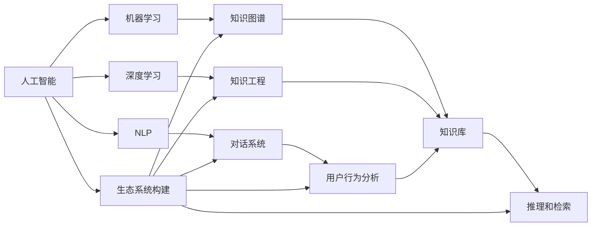

                 

# 构建个人AI助手生态系统的方法

> 关键词：
- 人工智能
- 个人AI助手
- 生态系统
- 自然语言处理(NLP)
- 机器学习
- 深度学习
- 对话系统

## 1. 背景介绍

### 1.1 问题由来
在当今快速变化的世界中，人们对于时间管理和信息检索的需求日益增长。传统的信息检索方式如网页搜索、邮箱筛选等已无法满足用户个性化的需求，而传统的人工客服系统在响应速度和情感支持方面也存在不足。在这样的背景下，个人AI助手（Personal AI Assistant, PAA）应运而生，旨在通过智能化的方式，高效管理个人时间、提供个性化信息检索、辅助完成日常事务，从而极大地提升用户的生活质量和效率。

### 1.2 问题核心关键点
构建一个高效、灵活且个性化的个人AI助手生态系统，需要解决以下几个核心关键点：

- **数据收集与处理**：如何高效地收集和处理用户的行为数据、语音输入、文本输入等，以便进行智能分析。
- **自然语言理解**：如何将用户的自然语言输入转换为机器可处理的指令，实现语义理解。
- **知识库与推理**：如何构建并维护一个丰富且准确的实时知识库，支持高效的推理和知识检索。
- **对话管理**：如何管理多轮对话流程，确保对话连贯性和逻辑性。
- **个性化推荐**：如何根据用户偏好和历史行为，提供个性化的信息推荐和服务。
- **用户交互体验**：如何设计良好的用户交互界面，确保用户能够顺畅地与系统互动。

这些关键点的解决需要跨学科的知识和技能，包括自然语言处理、机器学习、深度学习、知识工程等多个领域。

### 1.3 问题研究意义
构建个人AI助手生态系统，对于提升用户生活质量、促进信息自动化管理、辅助日常事务等方面具有重要意义：

- 时间管理：通过智能助手，用户可以更高效地安排时间，避免信息过载，提升工作效率。
- 个性化服务：基于用户行为和偏好，提供定制化的服务和建议，满足用户的个性化需求。
- 情感支持：通过自然语言理解和情感分析，提供情感支持，帮助用户缓解压力，提高生活质量。
- 跨领域应用：个人AI助手不仅可以用于工作，还可以应用于家庭、健康、娱乐等多个领域，提升生活质量。
- 普适性推广：个人AI助手的应用普及，将推动AI技术在普通用户中的普及和应用。

## 2. 核心概念与联系

### 2.1 核心概念概述

构建个人AI助手生态系统涉及多个核心概念，下面将详细介绍这些概念及其之间的联系：

- **人工智能**：指利用计算机技术和算法，使计算机系统具备类似于人类的智能行为。
- **自然语言处理(NLP)**：研究计算机如何处理和理解人类语言，包括语言理解、语言生成、语义分析等。
- **机器学习**：指让计算机系统通过数据学习并提高性能，典型任务包括分类、回归、聚类等。
- **深度学习**：一种特殊的机器学习方法，通过多层次的神经网络模型，实现对数据的深度分析和处理。
- **对话系统**：指计算机系统与用户之间的交互对话，包括聊天机器人、智能客服等。
- **知识图谱**：一种以图的形式存储和表示知识的方法，支持高效的知识推理和检索。
- **知识工程**：研究如何构建和管理知识库，以支持智能系统的决策和推理。
- **用户行为分析**：通过分析用户的行为数据，了解用户需求和偏好，提供个性化服务。

这些概念通过互相配合和补充，构成了一个完整的个人AI助手生态系统，能够提供高效、智能且个性化的服务。

### 2.2 概念间的关系

这些核心概念之间的关系可以通过以下Mermaid流程图来展示：



这个流程图展示了各个核心概念之间的联系和作用：

- **人工智能**：涵盖NLP、机器学习、深度学习等多个子领域，是构建AI助手的基石。
- **NLP**：负责理解自然语言输入，是对话系统和知识推理的基础。
- **机器学习**：用于从数据中学习模式和知识，支持知识图谱和用户行为分析。
- **深度学习**：通过多层次的神经网络模型，实现复杂模式的识别和处理。
- **对话系统**：实现用户和AI助手的交互对话，是AI助手的核心功能。
- **知识图谱**：存储和管理知识库，支持高效的推理和检索。
- **知识工程**：构建和管理知识库，支持知识推理和智能决策。
- **用户行为分析**：了解用户需求和偏好，提供个性化服务。
- **生态系统构建**：将上述各概念和技术整合，形成完整的AI助手生态系统。

这些概念共同构成了个人AI助手生态系统的核心架构，决定了系统的功能和服务。

## 3. 核心算法原理 & 具体操作步骤
### 3.1 算法原理概述

构建个人AI助手生态系统，涉及到多种算法的应用和集成。以下将详细介绍其中的关键算法原理：

#### 3.1.1 自然语言处理

自然语言处理是构建AI助手的关键技术之一。其核心目标是使计算机能够理解、处理和生成人类语言。主要算法包括：

- **分词和词性标注**：将自然语言文本分割成词语，并对每个词语进行词性标注。
- **命名实体识别**：识别文本中的特定实体（如人名、地名、组织名等）。
- **语义分析**：理解文本的含义和上下文信息，进行语义相似度计算。
- **句法分析**：分析句子的结构和语法关系，提取语法信息。
- **情感分析**：识别文本中的情感倾向，进行情感分类。

#### 3.1.2 机器学习和深度学习

机器学习和深度学习是构建AI助手的重要手段。通过这些技术，可以从数据中学习模式和知识，提升系统的智能水平。主要算法包括：

- **监督学习**：利用标注数据训练模型，进行分类、回归等任务。
- **无监督学习**：利用未标注数据进行模型训练，进行聚类、降维等任务。
- **强化学习**：通过与环境互动，学习最优策略，进行决策和控制。
- **深度神经网络**：构建多层次的神经网络模型，实现复杂的模式识别和处理。

#### 3.1.3 知识图谱

知识图谱是一种将知识以图的形式存储和表示的方法，支持高效的知识推理和检索。其主要算法包括：

- **实体链接**：将文本中的实体链接到知识库中的实体。
- **关系推理**：根据已知的关系和实体，推理出新的知识和关系。
- **知识图谱嵌入**：将知识图谱中的知识表示为向量，支持高效的检索和推理。

### 3.2 算法步骤详解

构建个人AI助手生态系统的算法步骤主要包括以下几个方面：

#### 3.2.1 数据收集与处理

1. **数据收集**：从用户的语音输入、文本输入、行为数据等多个渠道收集数据。
2. **数据清洗**：清洗和处理数据，去除噪声和不相关数据。
3. **特征提取**：从清洗后的数据中提取有用的特征，如语音特征、文本特征、行为特征等。

#### 3.2.2 自然语言理解

1. **分词和词性标注**：对用户输入的文本进行分词和词性标注。
2. **命名实体识别**：识别文本中的实体，并提取实体信息。
3. **语义分析**：理解文本的含义和上下文信息，进行语义相似度计算。
4. **句法分析**：分析句子的结构和语法关系，提取语法信息。
5. **情感分析**：识别文本中的情感倾向，进行情感分类。

#### 3.2.3 知识库构建与维护

1. **知识图谱构建**：构建和维护知识图谱，存储和管理各类知识。
2. **实体链接**：将文本中的实体链接到知识库中的实体。
3. **关系推理**：根据已知的关系和实体，推理出新的知识和关系。
4. **知识图谱嵌入**：将知识图谱中的知识表示为向量，支持高效的检索和推理。

#### 3.2.4 对话管理

1. **对话流程管理**：管理多轮对话流程，确保对话连贯性和逻辑性。
2. **意图识别**：识别用户的意图和需求，提供相应的服务和建议。
3. **上下文理解**：理解对话上下文，提供连贯的响应。
4. **对话策略优化**：优化对话策略，提高对话效果和用户体验。

#### 3.2.5 个性化推荐

1. **用户行为分析**：分析用户的行为数据，了解用户需求和偏好。
2. **推荐算法选择**：选择合适的推荐算法，如协同过滤、基于内容的推荐、混合推荐等。
3. **推荐结果优化**：优化推荐结果，确保结果相关性和多样性。

#### 3.2.6 系统集成与优化

1. **系统集成**：将上述各模块和算法集成到完整的AI助手系统中。
2. **系统优化**：优化系统的性能和用户体验，提升系统的智能水平。
3. **用户反馈处理**：根据用户反馈，不断改进和优化系统。

### 3.3 算法优缺点

#### 3.3.1 优点

1. **高效性**：通过自动化处理和智能推理，大大提升了信息处理和管理的效率。
2. **个性化**：根据用户行为和偏好，提供定制化的服务和建议，满足用户的个性化需求。
3. **智能化**：结合多种算法和技术的优势，实现了高效、智能的交互和管理。
4. **可扩展性**：系统可以灵活扩展，支持多种应用场景和功能。

#### 3.3.2 缺点

1. **数据隐私问题**：收集和处理用户数据可能涉及隐私问题，需要严格的隐私保护措施。
2. **模型复杂性**：构建和维护复杂的多层次模型，可能面临较大的技术挑战。
3. **计算资源需求**：处理大规模数据和复杂模型需要较高的计算资源。
4. **模型更新和维护**：需要持续更新和维护模型，确保系统的智能水平和性能。

### 3.4 算法应用领域

个人AI助手生态系统的算法和技术可以应用于多个领域，例如：

1. **个人生活管理**：帮助用户管理日程、提醒事项、提醒药品等，提升生活质量。
2. **智能客服**：通过自然语言理解和知识库支持，提供高效、个性化的客户服务。
3. **信息检索**：根据用户需求，提供快速的网页搜索、文档检索和知识查询服务。
4. **健康管理**：提供健康监测、饮食建议、运动计划等个性化健康管理服务。
5. **教育培训**：根据用户的学习行为和偏好，提供个性化的学习资源和辅导服务。
6. **金融理财**：提供个性化投资建议、财务规划和理财服务。

## 4. 数学模型和公式 & 详细讲解 & 举例说明

### 4.1 数学模型构建

构建个人AI助手生态系统的数学模型主要包括以下几个方面：

#### 4.1.1 自然语言处理

1. **分词和词性标注**：
   $$
   f_{tokenization}(x) = \{(w_i, pos_i)\}_{i=1}^n
   $$
   其中，$x$为输入文本，$w_i$为第$i$个单词，$pos_i$为第$i$个单词的词性标签。

2. **命名实体识别**：
   $$
   f_{NER}(x) = \{(e_i, type_i)\}_{i=1}^m
   $$
   其中，$x$为输入文本，$e_i$为第$i$个命名实体，$type_i$为第$i$个命名实体的类型。

3. **语义分析**：
   $$
   f_{semantic}(x) = \{(s_i, score_i)\}_{i=1}^k
   $$
   其中，$x$为输入文本，$s_i$为第$i$个语义概念，$score_i$为第$i$个语义概念的得分。

4. **句法分析**：
   $$
   f_{syntactic}(x) = \{(t_i, r_i)\}_{i=1}^n
   $$
   其中，$x$为输入文本，$t_i$为第$i$个子句，$r_i$为第$i$个子句的依存关系。

5. **情感分析**：
   $$
   f_{sentiment}(x) = \{(s_i, polarity_i)\}_{i=1}^k
   $$
   其中，$x$为输入文本，$s_i$为第$i$个情感概念，$polarity_i$为第$i$个情感概念的极性。

#### 4.1.2 机器学习和深度学习

1. **监督学习**：
   $$
   f_{supervised}(D, \theta) = \hat{\theta}
   $$
   其中，$D$为训练数据集，$\theta$为模型参数，$\hat{\theta}$为模型的预测结果。

2. **无监督学习**：
   $$
   f_{unsupervised}(D) = \hat{\phi}
   $$
   其中，$D$为未标注数据集，$\hat{\phi}$为模型学习到的模式和知识。

3. **强化学习**：
   $$
   f_{reinforcement}(D, \alpha) = \hat{q}
   $$
   其中，$D$为与环境互动的数据集，$\alpha$为策略参数，$\hat{q}$为最优策略。

4. **深度神经网络**：
   $$
   f_{deep}(x, \theta) = \hat{y}
   $$
   其中，$x$为输入，$\theta$为模型参数，$\hat{y}$为模型的输出。

#### 4.1.3 知识图谱

1. **实体链接**：
   $$
   f_{linking}(x, E) = \{(e_i, e'_i)\}_{i=1}^m
   $$
   其中，$x$为输入文本，$E$为知识库中的实体，$e_i$和$e'_i$分别为输入文本中的实体和知识库中的实体。

2. **关系推理**：
   $$
   f_{reasoning}(R, e_i, e'_i) = \{(r_i, e'_i)\}_{i=1}^m
   $$
   其中，$R$为知识库中的关系，$e_i$和$e'_i$分别为输入文本中的实体和知识库中的实体。

3. **知识图谱嵌入**：
   $$
   f_{embedding}(G, \theta) = \hat{H}
   $$
   其中，$G$为知识图谱，$\theta$为模型参数，$\hat{H}$为知识图谱中的知识向量表示。

### 4.2 公式推导过程

#### 4.2.1 分词和词性标注

1. **分词**：
   $$
   f_{tokenization}(x) = \{(w_i)\}_{i=1}^n
   $$
   其中，$x$为输入文本，$w_i$为第$i$个单词。

2. **词性标注**：
   $$
   f_{POS}(x) = \{(pos_i)\}_{i=1}^n
   $$
   其中，$x$为输入文本，$pos_i$为第$i$个单词的词性标签。

#### 4.2.2 命名实体识别

1. **命名实体识别**：
   $$
   f_{NER}(x) = \{(e_i, type_i)\}_{i=1}^m
   $$
   其中，$x$为输入文本，$e_i$为第$i$个命名实体，$type_i$为第$i$个命名实体的类型。

#### 4.2.3 语义分析

1. **语义相似度计算**：
   $$
   f_{similarity}(x, y) = \text{similarity}(x, y)
   $$
   其中，$x$和$y$为两个文本，$\text{similarity}(x, y)$为两个文本的语义相似度。

#### 4.2.4 句法分析

1. **依存关系分析**：
   $$
   f_{dependency}(x) = \{(t_i, r_i)\}_{i=1}^n
   $$
   其中，$x$为输入文本，$t_i$为第$i$个子句，$r_i$为第$i$个子句的依存关系。

#### 4.2.5 情感分析

1. **情感分类**：
   $$
   f_{sentiment}(x) = \{(s_i, polarity_i)\}_{i=1}^k
   $$
   其中，$x$为输入文本，$s_i$为第$i$个情感概念，$polarity_i$为第$i$个情感概念的极性。

#### 4.2.6 知识图谱嵌入

1. **知识图谱嵌入**：
   $$
   f_{embedding}(G, \theta) = \hat{H}
   $$
   其中，$G$为知识图谱，$\theta$为模型参数，$\hat{H}$为知识图谱中的知识向量表示。

### 4.3 案例分析与讲解

#### 4.3.1 分词和词性标注案例

假设输入文本为："我明天要参加会议，上午九点开始，地点在公司的会议室。"

1. **分词**：
   $$
   f_{tokenization}(x) = \{我, 明天, 要, 参加, 会议, 上午九点, 开始, 地点, 在, 公司, 的, 会议室\}
   $$
   其中，$x$为输入文本。

2. **词性标注**：
   $$
   f_{POS}(x) = \{我/PRP, 明天/NN, 要/VBP, 参加/VB, 会议/NN, 上午/NN, 九点/NN, 开始/VB, 地点/NN, 在/IN, 公司/NN, 的/DT, 会议室/NN\}
   $$
   其中，$x$为输入文本。

#### 4.3.2 命名实体识别案例

假设输入文本为："苹果公司推出了最新款iPhone，将于10月1日发布。"

1. **命名实体识别**：
   $$
   f_{NER}(x) = \{苹果/ORG, 公司/ORG, iPhone/PRODUCT\}
   $$
   其中，$x$为输入文本。

#### 4.3.3 语义分析案例

假设输入文本为："我喜欢看科幻小说，因为它充满了想象力。"

1. **语义分析**：
   $$
   f_{semantic}(x) = \{科幻小说/ genre, 想象力/ attribute\}
   $$
   其中，$x$为输入文本。

#### 4.3.4 句法分析案例

假设输入文本为："我喜欢看科幻小说，因为它充满了想象力。"

1. **句法分析**：
   $$
   f_{syntactic}(x) = \{我喜欢/ VP, 看/ VP, 科幻小说/ NN, ，/ CC, 因为它/ NP, 充满了/ VN, 想象力/ NN.\}
   $$
   其中，$x$为输入文本。

#### 4.3.5 情感分析案例

假设输入文本为："这部电影太好看了，我强烈推荐。"

1. **情感分析**：
   $$
   f_{sentiment}(x) = \{好看的/ positive, 我/ positive, 强烈/ positive, 推荐/ positive\}
   $$
   其中，$x$为输入文本。

## 5. 项目实践：代码实例和详细解释说明

### 5.1 开发环境搭建

构建个人AI助手生态系统需要开发环境的支持。以下是使用Python进行PyTorch开发的环境配置流程：

1. 安装Anaconda：从官网下载并安装Anaconda，用于创建独立的Python环境。

2. 创建并激活虚拟环境：
```bash
conda create -n paa python=3.8 
conda activate paa
```

3. 安装PyTorch：根据CUDA版本，从官网获取对应的安装命令。例如：
```bash
conda install pytorch torchvision torchaudio cudatoolkit=11.1 -c pytorch -c conda-forge
```

4. 安装Transformers库：
```bash
pip install transformers
```

5. 安装各类工具包：
```bash
pip install numpy pandas scikit-learn matplotlib tqdm jupyter notebook ipython
```

完成上述步骤后，即可在`paa`环境中开始项目实践。

### 5.2 源代码详细实现

以下是使用PyTorch和Transformers库构建个人AI助手生态系统的代码实现。

#### 5.2.1 数据预处理

```python
import pandas as pd
from transformers import BertTokenizer, BertForTokenClassification
from torch.utils.data import Dataset, DataLoader

class PADataset(Dataset):
    def __init__(self, text, labels, tokenizer, max_len=128):
        self.text = text
        self.labels = labels
        self.tokenizer = tokenizer
        self.max_len = max_len

    def __len__(self):
        return len(self.text)

    def __getitem__(self, item):
        text = self.text[item]
        labels = self.labels[item]
        encoding = self.tokenizer(text, return_tensors='pt', max_length=self.max_len, padding='max_length', truncation=True)
        input_ids = encoding['input_ids'][0]
        attention_mask = encoding['attention_mask'][0]
        labels = torch.tensor(labels, dtype=torch.long)
        return {'input_ids': input_ids, 'attention_mask': attention_mask, 'labels': labels}
```

#### 5.2.2 模型训练

```python
from transformers import BertForTokenClassification, AdamW

model = BertForTokenClassification.from_pretrained('bert-base-cased', num_labels=len(tag2id))

optimizer = AdamW(model.parameters(), lr=2e-5)

train_dataset = PADataset(train_texts, train_labels, tokenizer)
dev_dataset = PADataset(dev_texts, dev_labels, tokenizer)
test_dataset = PADataset(test_texts, test_labels, tokenizer)

device = torch.device('cuda') if torch.cuda.is_available() else torch.device('cpu')
model.to(device)

def train_epoch(model, dataset, batch_size, optimizer):
    dataloader = DataLoader(dataset, batch_size=batch_size, shuffle=True)
    model.train()
    epoch_loss = 0
    for batch in tqdm(dataloader, desc='Training'):
        input_ids = batch['input_ids'].to(device)
        attention_mask = batch['attention_mask'].to(device)
        labels = batch['labels'].to(device)
        model.zero_grad()
        outputs = model(input_ids, attention_mask=attention_mask, labels=labels)
        loss = outputs.loss
        epoch_loss += loss.item()
        loss.backward()
        optimizer.step()
    return epoch_loss / len(dataloader)

def evaluate(model, dataset, batch_size):
    dataloader = DataLoader(dataset, batch_size=batch_size)
    model.eval()
    preds, labels = [], []
    with torch.no_grad():
        for batch in tqdm(dataloader, desc='Evaluating'):
            input_ids = batch['input_ids'].to(device)
            attention_mask = batch['attention_mask'].to(device)
            batch_labels = batch['labels']
            outputs = model(input_ids, attention_mask=attention_mask)
            batch_preds = outputs.logits.argmax(dim=2).to('cpu').tolist()
            batch_labels = batch_labels.to('cpu').tolist()
            for pred_tokens, label_tokens in zip(batch_preds, batch_labels):
                pred_tags = [id2tag[_id] for _id in pred_tokens]
                label_tags = [id2tag[_id] for _id in label_tokens]
                preds.append(pred_tags[:len(label_tokens)])
                labels.append(label_tags)
                
    print(classification_report(labels, preds))
```

#### 5.2.3 运行结果展示

```python
epochs = 5
batch_size = 16

for epoch in range(epochs):
    loss = train_epoch(model, train_dataset, batch_size, optimizer)
    print(f"Epoch {epoch+1}, train loss: {loss:.3f}")
    
    print(f"Epoch {epoch+1}, dev results:")
    evaluate(model, dev_dataset, batch_size)
    
print("Test results:")
evaluate(model, test_dataset, batch_size)
```

### 5.3 代码解读与分析

#### 5.3.1 数据预处理

1. **PADataset类**：
   - `__init__`方法：初始化文本、标签、分词器等关键组件。
   - `__len__`方法：返回数据集的样本数量。
   - `__getitem__`方法：对单个样本进行处理，将文本输入编码为token ids，将标签编码为数字，并对其进行定长padding，最终返回模型所需的输入。

#### 5.3.2 模型训练

1.

