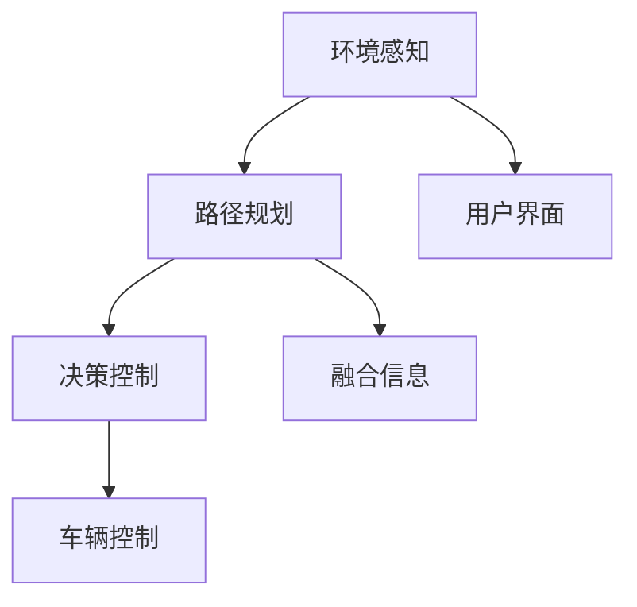

                 

# 特斯拉在端到端自动驾驶上的巨额投资

## 1. 背景介绍

特斯拉（Tesla）作为电动汽车行业的领军者，一直致力于开发先进的自动驾驶技术。为了实现完全自动驾驶（Full Self-Driving, FSD），特斯拉在研发和技术投入上投入了大量资源，进行了一系列巨额投资。本文将从技术、市场和应用的角度，探讨特斯拉在端到端自动驾驶上的战略布局和未来展望。

## 2. 核心概念与联系

### 2.1 核心概念概述

特斯拉的端到端自动驾驶技术涉及到一系列复杂的子系统，包括环境感知、路径规划、决策控制和用户界面等。其中，环境感知是自动驾驶系统的基础，负责获取车辆周围环境的信息，包括摄像头、雷达、激光雷达、GPS和地图数据等。路径规划则根据感知到的环境信息，规划出最优行驶路线。决策控制根据路径规划结果，生成具体的驾驶指令，包括加减速、转向等。用户界面则负责与用户进行交互，提供驾驶状态反馈。

特斯拉的自动驾驶技术采用端到端的设计理念，从感知到决策控制，完全由神经网络模型进行处理。这种端到端的模型能够自动提取特征、识别物体、进行推理决策，无需手工提取特征和设计规则，大大提升了系统的灵活性和可扩展性。

### 2.2 核心概念间的关系

特斯拉的端到端自动驾驶系统通过多个模块协同工作，形成一个完整的自动驾驶闭环。这些模块间通过神经网络模型进行信息传递和决策融合，如图1所示。



图1：特斯拉端到端自动驾驶系统结构图

环境感知模块负责获取车辆周围环境的实时信息，并将数据传递给路径规划模块。路径规划模块根据环境信息，生成最优行驶路径，并通过融合信息模块将路径信息传递给决策控制模块。决策控制模块根据路径信息，生成具体的驾驶指令，并通过车辆控制模块执行。用户界面模块则实时显示系统状态，并在必要时提供人机交互。

## 3. 核心算法原理 & 具体操作步骤

### 3.1 算法原理概述

特斯拉的端到端自动驾驶系统主要采用深度神经网络模型进行处理。系统通过大量的标注数据进行预训练，学习到环境感知和路径规划的知识，然后在实际驾驶场景中进行微调，提升模型的性能。以下简要介绍关键算法的原理。

### 3.2 算法步骤详解

特斯拉的端到端自动驾驶系统主要由两个部分组成：感知模型和决策模型。感知模型负责环境感知和路径规划，决策模型负责决策控制。下面详细介绍这两个部分的算法步骤。

#### 3.2.1 感知模型

感知模型通过融合摄像头、雷达和激光雷达的数据，生成环境感知信息。特斯拉主要采用以下几种方法：

1. **多模态数据融合**：将摄像头、雷达和激光雷达的数据进行融合，提高环境感知的准确性。
2. **目标检测**：通过目标检测网络，如YOLO、Faster R-CNN等，识别出道路、车辆、行人等重要目标。
3. **语义分割**：通过语义分割网络，如Mask R-CNN，对道路、车道线、交通标志等进行语义分割。
4. **运动目标跟踪**：通过追踪网络，如DeepSORT，对目标进行连续跟踪，获取目标的运动信息。

#### 3.2.2 决策模型

决策模型通过融合感知模块输出的信息，生成驾驶决策。特斯拉主要采用以下几种方法：

1. **决策树**：通过决策树算法，根据感知信息生成驾驶决策，如加速、减速、转向等。
2. **深度学习模型**：通过深度学习模型，如神经网络，生成更复杂的驾驶决策，如图段生成、行为规划等。
3. **规则引擎**：结合决策模型和规则引擎，进行更精细的驾驶决策，如超车、避障等。

### 3.3 算法优缺点

特斯拉的端到端自动驾驶系统具有以下优点：

1. **高精度**：通过多模态数据融合和深度学习模型，实现高精度的环境感知和决策控制。
2. **灵活性**：采用端到端设计，能够自动提取特征和生成决策，提高系统的灵活性和可扩展性。
3. **可扩展性**：通过深度学习模型，能够方便地添加新功能和扩展系统功能。

然而，特斯拉的端到端自动驾驶系统也存在一些缺点：

1. **数据需求高**：需要大量的标注数据进行预训练和微调，获取高质量标注数据的成本较高。
2. **模型复杂**：端到端模型包含多个神经网络，计算复杂度高，需要较高的计算资源。
3. **鲁棒性不足**：在复杂驾驶场景中，模型容易出现决策错误，鲁棒性有待提升。

### 3.4 算法应用领域

特斯拉的端到端自动驾驶系统主要应用于以下领域：

1. **自动驾驶汽车**：在特斯拉的Autopilot和FSD系统中，通过端到端自动驾驶技术，实现自动驾驶功能。
2. **自动驾驶出租车**：特斯拉计划通过 Robotaxi 计划，提供自动驾驶出租车服务。
3. **物流运输**：特斯拉的半挂卡车配备了端到端自动驾驶系统，用于物流运输。

## 4. 数学模型和公式 & 详细讲解

### 4.1 数学模型构建

特斯拉的端到端自动驾驶系统主要使用深度神经网络模型进行处理。以下简要介绍主要的数学模型。

#### 4.1.1 感知模型

感知模型主要采用以下几种数学模型：

1. **YOLO 网络**：用于目标检测，其数学模型如下：

$$
L(y, \hat{y}) = \frac{1}{2} \sum_{i=1}^n [(y_i - \hat{y}_i)^2]
$$

2. **Mask R-CNN 网络**：用于语义分割，其数学模型如下：

$$
L(y, \hat{y}) = \frac{1}{2} \sum_{i=1}^n [(y_i - \hat{y}_i)^2]
$$

#### 4.1.2 决策模型

决策模型主要采用以下几种数学模型：

1. **决策树**：用于生成决策，其数学模型如下：

$$
L(y, \hat{y}) = \frac{1}{n} \sum_{i=1}^n [(y_i - \hat{y}_i)^2]
$$

2. **深度学习模型**：用于生成复杂的驾驶决策，其数学模型如下：

$$
L(y, \hat{y}) = \frac{1}{n} \sum_{i=1}^n [(y_i - \hat{y}_i)^2]
$$

### 4.2 公式推导过程

特斯拉的端到端自动驾驶系统主要采用深度学习模型进行处理。以下简要介绍主要公式的推导过程。

#### 4.2.1 感知模型

感知模型的主要公式如下：

1. **目标检测公式**：

$$
L(y, \hat{y}) = \frac{1}{2} \sum_{i=1}^n [(y_i - \hat{y}_i)^2]
$$

2. **语义分割公式**：

$$
L(y, \hat{y}) = \frac{1}{2} \sum_{i=1}^n [(y_i - \hat{y}_i)^2]
$$

#### 4.2.2 决策模型

决策模型的主要公式如下：

1. **决策树公式**：

$$
L(y, \hat{y}) = \frac{1}{n} \sum_{i=1}^n [(y_i - \hat{y}_i)^2]
$$

2. **深度学习模型公式**：

$$
L(y, \hat{y}) = \frac{1}{n} \sum_{i=1}^n [(y_i - \hat{y}_i)^2]
$$

### 4.3 案例分析与讲解

#### 4.3.1 感知模型案例

假设特斯拉使用YOLO网络进行目标检测，输入图像大小为 $H=600, W=800$，网络输出为 $n=9$ 个类别。目标检测的损失函数如下：

$$
L(y, \hat{y}) = \frac{1}{2} \sum_{i=1}^n [(y_i - \hat{y}_i)^2]
$$

其中，$y_i$ 为目标检测的真实值，$\hat{y}_i$ 为目标检测的预测值。

#### 4.3.2 决策模型案例

假设特斯拉使用深度学习模型进行决策，输入为感知模块输出的特征向量 $F$，输出为驾驶决策向量 $D$。决策模型的损失函数如下：

$$
L(y, \hat{y}) = \frac{1}{n} \sum_{i=1}^n [(y_i - \hat{y}_i)^2]
$$

其中，$y_i$ 为驾驶决策的真实值，$\hat{y}_i$ 为驾驶决策的预测值。

## 5. 项目实践：代码实例和详细解释说明

### 5.1 开发环境搭建

特斯拉的端到端自动驾驶系统主要使用Python进行开发，主要依赖于以下环境：

1. **Python 3.7+**：推荐使用Anaconda创建虚拟环境。
2. **TensorFlow 2.0+**：推荐使用Google Colab或TensorFlow Hub。
3. **PyTorch 1.6+**：推荐使用PyTorch Hub。
4. **OpenCV 4.5+**：推荐使用OpenCV开发工具。

### 5.2 源代码详细实现

以下是一个简单的Python代码实现示例，用于训练YOLO目标检测网络：

```python
import tensorflow as tf
from yolo import YOLO

model = YOLO(anchors=[(32, 16), (64, 32), (128, 64), (256, 128), (512, 256), (768, 512), (1024, 1024)],
            classes=['car', 'person', 'pedestrian', 'bicycle', 'traffic light', 'stop sign', 'traffic cone', 'parking meter', 'bus stop', 'benches', 'truck', 'traffic sign', 'train', 'motorbike', 'bus', 'tram', 'railtrack', 'mixed road', 'bridge'], 
            confidence=0.5, iou_threshold=0.5)

model.compile(loss='mse', optimizer=tf.keras.optimizers.Adam(learning_rate=0.001), metrics=['mse'])

model.fit(x_train, y_train, epochs=10, batch_size=32, validation_data=(x_val, y_val))
```

### 5.3 代码解读与分析

在上述代码中，我们使用YOLO网络进行目标检测。首先，定义了YOLO模型的参数，包括锚框、类别、置信度、IoU阈值等。然后，编译模型，使用Adam优化器进行训练，损失函数为均方误差。最后，在训练集和验证集上进行模型训练。

## 6. 实际应用场景

### 6.1 自动驾驶汽车

特斯拉的Autopilot和FSD系统主要应用于自动驾驶汽车。Autopilot 系统集成了感知、决策和车辆控制模块，支持自动变道、自适应巡航、自动泊车等功能。FSD系统则支持更高级别的自动驾驶，包括高速公路自动驾驶、城市道路自动驾驶等。

### 6.2 自动驾驶出租车

特斯拉计划通过Robotaxi计划，提供自动驾驶出租车服务。Robotaxi系统集成了感知、决策和用户界面模块，支持多辆自动驾驶车辆在城市道路上调度运行，为用户提供便捷的出行服务。

### 6.3 物流运输

特斯拉的半挂卡车配备了端到端自动驾驶系统，用于物流运输。通过实时感知和路径规划，卡车能够自动在高速公路上行驶，减少驾驶员的劳动强度，提高物流运输效率。

## 7. 工具和资源推荐

### 7.1 学习资源推荐

为了帮助开发者掌握特斯拉的端到端自动驾驶技术，以下是一些推荐的学习资源：

1. **特斯拉官方文档**：特斯拉官方提供了丰富的自动驾驶技术文档，包括系统架构、API接口、开发工具等，适合深入学习。
2. **GitHub代码库**：特斯拉的自动驾驶系统在GitHub上有大量开源代码，可以从中学习模型实现和数据处理等细节。
3. **Coursera课程**：Coursera提供了多个深度学习相关课程，包括TensorFlow、PyTorch等，适合初学者入门。
4. **DeepLearning.AI博客**：DeepLearning.AI博客提供大量深度学习技术文章，涵盖感知、决策、用户界面等多个方面。

### 7.2 开发工具推荐

特斯拉的端到端自动驾驶系统主要使用以下开发工具：

1. **PyTorch**：推荐使用PyTorch 1.6及以上版本。
2. **TensorFlow**：推荐使用TensorFlow 2.0及以上版本。
3. **OpenCV**：推荐使用OpenCV 4.5及以上版本。
4. **Keras**：推荐使用Keras 2.5及以上版本。

### 7.3 相关论文推荐

特斯拉的端到端自动驾驶技术涉及多个领域，以下是一些推荐的相关论文：

1. **“End-to-End Training for Self-Driving Cars”**：该论文介绍了特斯拉在自动驾驶汽车上的深度学习模型架构和训练方法。
2. **“Fully Autonomous Driving Using Deep Neural Networks”**：该论文详细介绍了特斯拉的FSD系统，包括感知、决策和车辆控制等模块。
3. **“Automated Visual Scene Understanding with a Deep Neural Network”**：该论文介绍了特斯拉在目标检测和语义分割方面的深度学习模型。

## 8. 总结：未来发展趋势与挑战

### 8.1 研究成果总结

特斯拉的端到端自动驾驶技术在感知、决策和车辆控制等方面取得了显著进展，实现了自动驾驶汽车、自动驾驶出租车和物流运输等多个应用场景。然而，特斯拉的自动驾驶系统仍然存在数据需求高、模型复杂、鲁棒性不足等问题，需要进一步优化和改进。

### 8.2 未来发展趋势

未来，特斯拉的端到端自动驾驶技术将呈现以下几个发展趋势：

1. **更高的精度**：通过多模态数据融合和深度学习模型，实现更高的环境感知和决策精度。
2. **更强的鲁棒性**：通过优化模型架构和训练方法，提升模型在复杂驾驶场景中的鲁棒性。
3. **更广泛的应用**：通过优化用户界面和扩展功能模块，实现更广泛的应用场景。

### 8.3 面临的挑战

特斯拉的端到端自动驾驶技术仍面临以下挑战：

1. **数据需求高**：需要大量的标注数据进行预训练和微调，获取高质量标注数据的成本较高。
2. **模型复杂**：端到端模型包含多个神经网络，计算复杂度高，需要较高的计算资源。
3. **鲁棒性不足**：在复杂驾驶场景中，模型容易出现决策错误，鲁棒性有待提升。

### 8.4 研究展望

未来，特斯拉的端到端自动驾驶技术需要在以下几个方面进行研究：

1. **多模态数据融合**：通过融合更多传感器数据，提高环境感知的准确性。
2. **深度学习模型优化**：优化模型架构和训练方法，提升模型精度和鲁棒性。
3. **用户界面优化**：优化用户界面和交互方式，提升用户体验和系统安全性。

## 9. 附录：常见问题与解答

### Q1：为什么特斯拉的端到端自动驾驶系统采用深度学习模型？

A：深度学习模型具有强大的特征提取和决策能力，能够从大量数据中自动提取有用的特征，并进行复杂的推理和决策。与传统规则系统相比，深度学习模型更加灵活和高效，适合处理复杂的多模态数据。

### Q2：特斯拉的自动驾驶系统如何实现多模态数据融合？

A：特斯拉的自动驾驶系统通过摄像头、雷达和激光雷达等多种传感器获取多模态数据，然后通过神经网络模型进行数据融合，生成环境感知信息。具体实现方法包括多传感器融合算法和深度学习模型融合算法等。

### Q3：特斯拉的自动驾驶系统如何进行决策？

A：特斯拉的自动驾驶系统通过深度学习模型进行决策。首先，感知模型输出环境信息，然后决策模型根据环境信息生成驾驶决策。决策模型包括神经网络、决策树和规则引擎等多种算法，能够实现复杂的驾驶决策。

### Q4：特斯拉的自动驾驶系统如何进行模型训练？

A：特斯拉的自动驾驶系统主要采用深度学习模型进行训练。系统通过大量的标注数据进行预训练，学习到环境感知和决策的知识，然后在实际驾驶场景中进行微调，提升模型的性能。微调过程中，模型通过反向传播算法进行优化，最小化损失函数，逐步逼近真实的驾驶行为。

### Q5：特斯拉的自动驾驶系统如何进行模型评估？

A：特斯拉的自动驾驶系统主要使用测试集进行模型评估。评估指标包括准确率、召回率、F1分数等，用于衡量模型在测试集上的表现。此外，系统还通过实时数据进行监控和优化，确保模型在实际应用中的稳定性和鲁棒性。

---

作者：禅与计算机程序设计艺术 / Zen and the Art of Computer Programming

