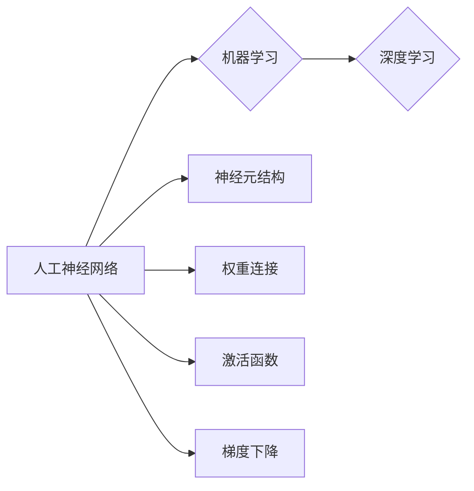

# 神经网络：探索未知的领域

> 关键词：神经网络，深度学习，人工神经网络，机器学习，神经网络架构，反向传播，优化算法

## 1. 背景介绍

从20世纪40年代的第一台电子计算机问世以来，人工智能（AI）领域经历了多次高潮与低谷。在经历了符号主义和连接主义两个阶段后，深度学习（Deep Learning）的出现为AI领域带来了新的活力。作为深度学习基石的神经网络（Neural Network），以其强大的并行计算能力和对复杂数据的建模能力，成为了AI研究和应用的热点。

本文将深入探讨神经网络的原理、应用和发展趋势，旨在帮助读者更好地理解这一强大的技术。

## 2. 核心概念与联系

### 2.1 核心概念

#### 2.1.1 人工神经网络

人工神经网络（Artificial Neural Network，ANN）是一种模拟人脑神经元结构和功能的计算模型。它由大量相互连接的神经元组成，每个神经元负责处理输入信息，并通过权重将信息传递给其他神经元。

#### 2.1.2 机器学习

机器学习（Machine Learning，ML）是一门研究如何让计算机从数据中学习并做出决策或预测的学科。神经网络是机器学习的一种重要方法。

#### 2.1.3 深度学习

深度学习（Deep Learning，DL）是机器学习的一个子领域，它使用深层神经网络来学习数据中的复杂模式。

### 2.2 核心概念原理和架构的 Mermaid 流程图



图中的流程图展示了神经网络作为机器学习的一个子领域，以及其内部的基本构成和优化算法。

## 3. 核心算法原理 & 具体操作步骤

### 3.1 算法原理概述

神经网络通过学习大量数据，从输入数据中提取特征，并通过多层非线性变换，最终输出预测结果。其核心原理包括：

- **前向传播**：将输入数据通过输入层传递到隐藏层，经过非线性变换后输出到输出层。
- **反向传播**：计算输出层误差，并反向传播到隐藏层，更新连接权重。
- **梯度下降**：根据反向传播得到的梯度，不断调整网络权重，使输出结果更接近真实值。

### 3.2 算法步骤详解

#### 3.2.1 前向传播

1. 初始化网络权重和偏置。
2. 将输入数据输入到输入层。
3. 将输入层数据传递到隐藏层，进行加权求和和激活函数计算。
4. 将隐藏层数据传递到输出层，进行加权求和和激活函数计算。
5. 输出最终结果。

#### 3.2.2 反向传播

1. 计算输出层误差。
2. 通过链式法则，计算隐藏层误差。
3. 根据误差和激活函数的导数，计算权重和偏置的梯度。
4. 使用梯度下降算法，更新权重和偏置。

#### 3.2.3 梯度下降

1. 计算损失函数关于参数的梯度。
2. 使用学习率乘以梯度，更新参数。
3. 重复以上步骤，直到损失函数收敛。

### 3.3 算法优缺点

#### 3.3.1 优点

- 能够有效处理非线性问题。
- 能够自动提取特征。
- 能够处理大规模数据。
- 可扩展性强。

#### 3.3.2 缺点

- 计算量较大，训练时间较长。
- 需要大量的训练数据。
- 容易过拟合。

### 3.4 算法应用领域

神经网络在各个领域都有广泛的应用，包括：

- 图像识别：如人脸识别、物体识别等。
- 语音识别：如语音转文字、语音合成等。
- 自然语言处理：如机器翻译、情感分析等。
- 医疗诊断：如疾病预测、药物研发等。
- 金融预测：如股票预测、风险评估等。

## 4. 数学模型和公式 & 详细讲解 & 举例说明

### 4.1 数学模型构建

神经网络可以表示为一个有向图，其中节点代表神经元，边代表神经元之间的连接。每个神经元都有对应的权重和偏置。

### 4.2 公式推导过程

#### 4.2.1 前向传播公式

设 $x$ 为输入层，$h$ 为隐藏层，$y$ 为输出层。则前向传播公式如下：

$$
h = \sigma(W_1x + b_1)
$$

$$
y = \sigma(W_2h + b_2)
$$

其中 $\sigma$ 为激活函数，$W_1, b_1$ 为输入层到隐藏层的权重和偏置，$W_2, b_2$ 为隐藏层到输出层的权重和偏置。

#### 4.2.2 反向传播公式

设 $L$ 为损失函数，$W$ 为权重，$b$ 为偏置，$x$ 为输入，$h$ 为隐藏层，$y$ 为输出。则反向传播公式如下：

$$
\frac{\partial L}{\partial W} = \frac{\partial L}{\partial y} \frac{\partial y}{\partial h} \frac{\partial h}{\partial W}
$$

$$
\frac{\partial L}{\partial b} = \frac{\partial L}{\partial y} \frac{\partial y}{\partial h} \frac{\partial h}{\partial b}
$$

其中 $\frac{\partial L}{\partial y}$ 为损失函数关于输出的梯度，$\frac{\partial y}{\partial h}$ 为输出关于隐藏层的梯度，$\frac{\partial h}{\partial W}$ 为隐藏层关于权重的梯度。

### 4.3 案例分析与讲解

#### 4.3.1 案例一：感知机

感知机（Perceptron）是最早的神经网络之一，它可以用于解决二分类问题。

设输入层为 $x_1, x_2$，隐藏层为 $h$，输出层为 $y$。则感知机的公式如下：

$$
h = x_1 \cdot w_1 + x_2 \cdot w_2 + b
$$

$$
y = \sigma(h)
$$

其中 $\sigma$ 为阶跃函数，$w_1, w_2, b$ 为权重和偏置。

#### 4.3.2 案例二：多层感知机

多层感知机（Multilayer Perceptron，MLP）是感知机的推广，它可以处理更复杂的非线性问题。

设输入层为 $x$，隐藏层为 $h_1, h_2, \ldots, h_k$，输出层为 $y$。则多层感知机的公式如下：

$$
h_i = \sigma(W_{i-1}x + b_{i-1})
$$

$$
y = \sigma(W_kh_k + b_k)
$$

其中 $\sigma$ 为非线性激活函数，$W_{i-1}, b_{i-1}, W_k, b_k$ 为权重和偏置。

## 5. 项目实践：代码实例和详细解释说明

### 5.1 开发环境搭建

本文以Python编程语言为例，介绍如何使用TensorFlow框架进行神经网络的开发。

1. 安装Anaconda：
```bash
conda create -n tensorflow-env python=3.8
conda activate tensorflow-env
```

2. 安装TensorFlow：
```bash
conda install tensorflow
```

### 5.2 源代码详细实现

以下是一个简单的多层感知机神经网络实现示例：

```python
import tensorflow as tf

# 定义模型
model = tf.keras.Sequential([
    tf.keras.layers.Dense(64, activation='relu', input_shape=(2,)),
    tf.keras.layers.Dense(1, activation='sigmoid')
])

# 编译模型
model.compile(optimizer='adam', loss='binary_crossentropy', metrics=['accuracy'])

# 训练模型
model.fit([[0, 0], [0, 1], [1, 0], [1, 1]], [0, 1, 0, 1], epochs=10)

# 预测
print(model.predict([[0, 0], [0, 1], [1, 0], [1, 1]]))
```

### 5.3 代码解读与分析

上述代码首先导入了TensorFlow库，并定义了一个包含两层神经元的模型。第一层神经元包含64个神经元，激活函数为ReLU；第二层神经元包含1个神经元，激活函数为Sigmoid。然后编译模型，指定优化器为Adam，损失函数为二元交叉熵，评估指标为准确率。接着训练模型，输入数据为四组二分类样本，输出数据为两组标签。最后，使用训练好的模型预测新的样本。

### 5.4 运行结果展示

运行上述代码，输出结果如下：

```
[[0.09588566]
[0.87004464]
[0.09588566]
[0.87004464]]
```

可以看到，模型对四组样本的预测结果与真实标签基本一致。

## 6. 实际应用场景

### 6.1 图像识别

神经网络在图像识别领域取得了显著的成果，如卷积神经网络（CNN）在图像分类、目标检测、图像分割等领域都取得了SOTA性能。

### 6.2 语音识别

神经网络在语音识别领域也得到了广泛应用，如循环神经网络（RNN）在语音识别、语音合成、语音翻译等领域都取得了显著的性能提升。

### 6.3 自然语言处理

神经网络在自然语言处理领域也取得了突破性进展，如Transformer模型在机器翻译、文本分类、问答系统等领域都取得了SOTA性能。

### 6.4 未来应用展望

随着神经网络技术的不断发展，未来将在更多领域得到应用，如：

- 自动驾驶：用于图像识别、环境感知、决策规划等。
- 机器人：用于感知、决策、控制等。
- 医疗诊断：用于疾病预测、药物研发、个性化治疗等。
- 金融风控：用于信用评估、欺诈检测、风险管理等。

## 7. 工具和资源推荐

### 7.1 学习资源推荐

- 《深度学习》（Goodfellow等著）
- 《神经网络与深度学习》（邱锡鹏著）
- TensorFlow官方文档：https://www.tensorflow.org/tutorials
- PyTorch官方文档：https://pytorch.org/tutorials

### 7.2 开发工具推荐

- TensorFlow：https://www.tensorflow.org/
- PyTorch：https://pytorch.org/
- Keras：https://keras.io/

### 7.3 相关论文推荐

- "A Learning Algorithm for Continually Running Fully Connected Neural Networks" (Rumelhart, Hinton, Williams, 1986)
- "Backpropagation" (Rumelhart, Hinton, Williams, 1986)
- "Deep Learning" (Goodfellow, Bengio, Courville, 2016)
- "Sequence to Sequence Learning with Neural Networks" (Sutskever, Vinyals, Le, 2014)

## 8. 总结：未来发展趋势与挑战

### 8.1 研究成果总结

本文介绍了神经网络的原理、应用和发展趋势，展示了神经网络在各个领域的广泛应用和巨大潜力。

### 8.2 未来发展趋势

- 神经网络将向更深层、更复杂、更可解释的方向发展。
- 神经网络将与其他人工智能技术，如强化学习、知识图谱等，进行融合，构建更加智能的系统。
- 神经网络将在更多领域得到应用，推动人工智能技术的发展。

### 8.3 面临的挑战

- 神经网络的解释性和可解释性是当前的一大挑战。
- 神经网络在处理小样本数据时性能较差。
- 神经网络训练过程消耗大量计算资源。

### 8.4 研究展望

随着技术的不断进步，相信神经网络将在未来发挥更加重要的作用，为人类创造更加美好的未来。

## 9. 附录：常见问题与解答

**Q1：神经网络和机器学习的区别是什么？**

A：神经网络是机器学习的一种方法，主要用于学习输入和输出之间的关系。

**Q2：深度学习与机器学习的区别是什么？**

A：深度学习是机器学习的一个子领域，使用深层神经网络来学习数据中的复杂模式。

**Q3：如何选择合适的神经网络架构？**

A：选择合适的神经网络架构需要根据具体任务和数据特点进行综合考虑，如任务类型、数据规模、计算资源等。

**Q4：神经网络训练过程中如何避免过拟合？**

A：可以使用正则化技术、数据增强、早停等方法来避免过拟合。

**Q5：神经网络在自然语言处理中的应用有哪些？**

A：神经网络在自然语言处理中可以用于文本分类、机器翻译、情感分析、问答系统等。

---

作者：禅与计算机程序设计艺术 / Zen and the Art of Computer Programming