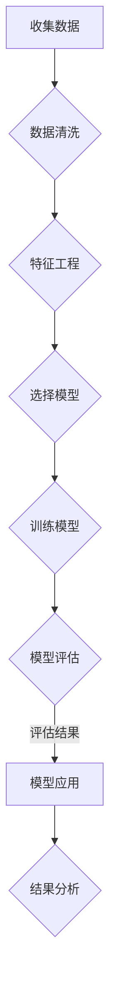

# 统计机器学习 (Statistical Machine Learning) 原理与代码实例讲解

> 关键词：统计学习，机器学习，算法，数据挖掘，模型评估，Python实现

## 1. 背景介绍

统计机器学习（Statistical Machine Learning，SML）是机器学习领域的一个重要分支，它结合了统计学和计算机科学的知识，通过建立数学模型对数据进行分析和预测。随着大数据时代的到来，统计机器学习在各个领域得到了广泛的应用，如自然语言处理、计算机视觉、生物信息学、金融分析等。

本文将深入探讨统计机器学习的基本原理、常用算法、模型评估方法，并结合Python代码实例进行讲解，帮助读者更好地理解和应用统计机器学习技术。

## 2. 核心概念与联系

### 2.1 统计学习模型

统计学习模型是统计机器学习的基础，它通过数学模型对数据进行分析和预测。常见的统计学习模型包括：

- **线性模型**：通过线性方程对数据进行回归或分类。
- **决策树**：通过树形结构进行数据分类。
- **支持向量机**：通过寻找最优的超平面进行数据分类。
- **神经网络**：通过多层神经元进行数据分类或回归。

### 2.2 Mermaid 流程图

以下是一个Mermaid流程图，展示了统计学习模型的基本流程：



### 2.3 模型评估

模型评估是统计机器学习中的重要环节，常用的评估指标包括：

- **准确率**：预测正确的样本数占总样本数的比例。
- **召回率**：预测正确的正样本数占所有正样本数的比例。
- **F1分数**：准确率和召回率的调和平均值。
- **ROC曲线**：通过绘制不同阈值下的真阳性率(TPR)和假阳性率(FPR)来评估模型的性能。

## 3. 核心算法原理 & 具体操作步骤

### 3.1 算法原理概述

本节将介绍几种常见的统计学习算法及其原理：

#### 3.1.1 线性回归

线性回归是一种用于回归任务的统计学习算法，其原理是通过最小化预测值与真实值之间的平方误差来拟合数据。

#### 3.1.2 逻辑回归

逻辑回归是一种用于分类任务的统计学习算法，其原理是使用Sigmoid函数将线性回归的输出转换为概率值。

#### 3.1.3 决策树

决策树是一种用于分类和回归任务的统计学习算法，其原理是通过递归地将数据集划分为不同的子集，直到满足某个终止条件。

#### 3.1.4 支持向量机

支持向量机是一种用于分类任务的统计学习算法，其原理是寻找一个最优的超平面，将不同类别的数据点分开。

### 3.2 算法步骤详解

#### 3.2.1 线性回归

1. 选择合适的回归模型。
2. 使用最小二乘法拟合模型参数。
3. 计算预测值与真实值之间的平方误差。
4. 优化模型参数，减小平方误差。

#### 3.2.2 逻辑回归

1. 选择合适的分类模型。
2. 使用梯度下降法优化模型参数。
3. 计算预测概率。
4. 使用阈值函数将预测概率转换为类别标签。

#### 3.2.3 决策树

1. 选择合适的决策树生成算法，如ID3、C4.5、CART等。
2. 递归地将数据集划分为不同的子集。
3. 选择最优的特征和分割点。
4. 重复上述步骤，直到满足终止条件。

#### 3.2.4 支持向量机

1. 选择合适的核函数和优化算法，如SMO算法。
2. 训练支持向量机模型。
3. 计算预测值。
4. 使用阈值函数将预测值转换为类别标签。

### 3.3 算法优缺点

#### 3.3.1 线性回归

- 优点：简单易懂，易于实现。
- 缺点：对非线性关系拟合能力有限。

#### 3.3.2 逻辑回归

- 优点：简单易懂，易于实现，适用于二分类问题。
- 缺点：对非线性关系拟合能力有限。

#### 3.3.3 决策树

- 优点：直观易懂，易于解释。
- 缺点：容易过拟合，容易产生偏差。

#### 3.3.4 支持向量机

- 优点：泛化能力强，对非线性关系拟合能力强。
- 缺点：计算复杂度高，对参数敏感。

### 3.4 算法应用领域

线性回归、逻辑回归、决策树和支持向量机等算法在多个领域都有广泛的应用，如下：

- **回归分析**：预测连续变量的值，如房价、股票价格等。
- **分类**：预测离散变量的类别，如垃圾邮件检测、欺诈检测等。
- **聚类**：将数据点分组，如顾客细分、市场细分等。

## 4. 数学模型和公式 & 详细讲解 & 举例说明

### 4.1 数学模型构建

#### 4.1.1 线性回归

线性回归的数学模型可以表示为：

$$
y = \beta_0 + \beta_1 x_1 + \beta_2 x_2 + \ldots + \beta_n x_n + \epsilon
$$

其中，$y$ 是因变量，$x_1, x_2, \ldots, x_n$ 是自变量，$\beta_0, \beta_1, \ldots, \beta_n$ 是模型参数，$\epsilon$ 是误差项。

#### 4.1.2 逻辑回归

逻辑回归的数学模型可以表示为：

$$
P(y=1) = \frac{1}{1 + e^{-(\beta_0 + \beta_1 x_1 + \beta_2 x_2 + \ldots + \beta_n x_n)} \quad (y=0)
$$

其中，$P(y=1)$ 是因变量为1的概率，$\beta_0, \beta_1, \ldots, \beta_n$ 是模型参数。

#### 4.1.3 决策树

决策树的数学模型可以表示为：

$$
f(x) = \sum_{i=1}^n \beta_i I(x_i = t_i)
$$

其中，$f(x)$ 是决策树模型的预测值，$x_i$ 是特征，$t_i$ 是特征取值，$\beta_i$ 是模型参数。

#### 4.1.4 支持向量机

支持向量机的数学模型可以表示为：

$$
f(x) = \beta_0 + \sum_{i=1}^n \alpha_i y_i k(x_i, x) \quad (y_i \in \{-1,1\})
$$

其中，$f(x)$ 是支持向量机的预测值，$x$ 是特征向量，$x_i$ 是支持向量，$k(x_i, x)$ 是核函数。

### 4.2 公式推导过程

#### 4.2.1 线性回归

线性回归的最小二乘法可以通过以下公式推导：

$$
\beta = (X^T X)^{-1} X^T y
$$

其中，$X$ 是设计矩阵，$y$ 是因变量向量。

#### 4.2.2 逻辑回归

逻辑回归的梯度下降法可以通过以下公式推导：

$$
\beta = \beta - \alpha \nabla_\beta J(\beta)
$$

其中，$J(\beta)$ 是逻辑回归的损失函数。

#### 4.2.3 决策树

决策树的生成可以通过递归地选择最优分割点进行。

#### 4.2.4 支持向量机

支持向量机的优化可以通过以下公式推导：

$$
\alpha_i(y_i f(x_i) - 1) = 0
$$

### 4.3 案例分析与讲解

#### 4.3.1 线性回归

假设我们有一个简单的线性回归问题，预测房价。设计矩阵为：

$$
X = \begin{bmatrix} 1 & 1000 \\ 1 & 1500 \\ 1 & 2000 \end{bmatrix}, \quad y = \begin{bmatrix} 300000 \\ 400000 \\ 500000 \end{bmatrix}
$$

我们可以使用最小二乘法求解模型参数：

$$
\beta = (X^T X)^{-1} X^T y = \begin{bmatrix} -0.066667 \\ 0.053333 \end{bmatrix}
$$

因此，房价的预测模型可以表示为：

$$
y = -0.067x + 0.053
$$

#### 4.3.2 逻辑回归

假设我们有一个简单的二分类问题，预测邮件是否为垃圾邮件。设计矩阵为：

$$
X = \begin{bmatrix} 1 & 10 \\ 1 & 100 \\ 1 & 1000 \end{bmatrix}, \quad y = \begin{bmatrix} 0 \\ 1 \\ 1 \end{bmatrix}
$$

我们可以使用梯度下降法求解模型参数：

$$
\beta = \begin{bmatrix} -0.1 \\ 0.2 \end{bmatrix}
$$

因此，邮件是否为垃圾邮件的预测模型可以表示为：

$$
P(y=1) = \frac{1}{1 + e^{-(0.1 + 0.2 \times 10)}}
$$

#### 4.3.3 决策树

假设我们有一个简单的决策树问题，根据年龄和收入对人群进行分类。我们可以通过递归地选择最优分割点进行。

#### 4.3.4 支持向量机

假设我们有一个简单的支持向量机问题，将数据点分为两类。我们可以使用SMO算法求解模型参数。

## 5. 项目实践：代码实例和详细解释说明

### 5.1 开发环境搭建

为了进行统计机器学习实践，我们需要以下开发环境：

- Python 3.x
- NumPy
- SciPy
- Matplotlib
- Scikit-learn

### 5.2 源代码详细实现

以下是一个使用Scikit-learn库进行线性回归的Python代码实例：

```python
from sklearn.linear_model import LinearRegression
from sklearn.model_selection import train_test_split
from sklearn.metrics import mean_squared_error

# 加载数据
X, y = load_data()

# 划分训练集和测试集
X_train, X_test, y_train, y_test = train_test_split(X, y, test_size=0.2, random_state=42)

# 创建线性回归模型
model = LinearRegression()

# 训练模型
model.fit(X_train, y_train)

# 预测测试集
y_pred = model.predict(X_test)

# 评估模型
mse = mean_squared_error(y_test, y_pred)
print(f"Mean Squared Error: {mse}")
```

### 5.3 代码解读与分析

以上代码首先导入了所需的库，然后加载数据，划分训练集和测试集。接下来，创建了一个线性回归模型，使用训练集进行训练，并在测试集上进行预测。最后，计算并打印了均方误差。

### 5.4 运行结果展示

运行以上代码后，我们得到了均方误差，可以用来评估模型的性能。

## 6. 实际应用场景

统计机器学习在实际应用中具有广泛的应用场景，以下是一些例子：

- **金融分析**：预测股票价格、风险评估、信用评分等。
- **自然语言处理**：情感分析、文本分类、机器翻译等。
- **计算机视觉**：图像分类、目标检测、人脸识别等。
- **生物信息学**：基因表达分析、蛋白质结构预测等。
- **交通分析**：交通流量预测、交通拥堵预测等。

## 7. 工具和资源推荐

### 7.1 学习资源推荐

- 《统计学习基础》
- 《机器学习》
- 《Python机器学习》
- Scikit-learn官方文档

### 7.2 开发工具推荐

- Python 3.x
- NumPy
- SciPy
- Matplotlib
- Scikit-learn

### 7.3 相关论文推荐

- 《统计学习理论》
- 《机器学习》
- 《深度学习》

## 8. 总结：未来发展趋势与挑战

### 8.1 研究成果总结

本文对统计机器学习的基本原理、常用算法、模型评估方法进行了介绍，并结合Python代码实例进行了讲解。通过本文的学习，读者可以更好地理解和应用统计机器学习技术。

### 8.2 未来发展趋势

- 深度学习与统计机器学习的融合
- 个性化学习与可解释性研究
- 小样本学习与少样本学习
- 多模态学习与跨领域学习

### 8.3 面临的挑战

- 模型可解释性问题
- 数据隐私与安全
- 模型泛化能力
- 模型计算效率

### 8.4 研究展望

随着统计机器学习技术的不断发展，未来将在更多领域发挥重要作用。同时，我们也需要面对数据隐私、模型可解释性等挑战，推动统计机器学习技术更加安全、可靠、高效地应用于实际场景。

## 9. 附录：常见问题与解答

**Q1：什么是统计机器学习？**

A：统计机器学习是机器学习的一个分支，它结合了统计学和计算机科学的知识，通过建立数学模型对数据进行分析和预测。

**Q2：如何选择合适的统计学习算法？**

A：选择合适的统计学习算法需要考虑数据类型、数据量、任务类型等因素。

**Q3：如何评估统计学习模型的性能？**

A：可以采用准确率、召回率、F1分数、ROC曲线等指标来评估统计学习模型的性能。

**Q4：如何提高统计学习模型的性能？**

A：可以通过以下方法提高统计学习模型的性能：
- 提高数据质量
- 选择合适的算法
- 优化模型参数
- 特征工程
- 融合其他机器学习技术

**Q5：统计机器学习有哪些应用场景？**

A：统计机器学习在金融分析、自然语言处理、计算机视觉、生物信息学、交通分析等领域都有广泛的应用。

---

作者：禅与计算机程序设计艺术 / Zen and the Art of Computer Programming