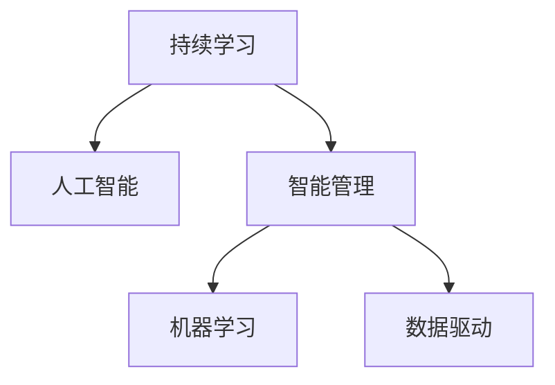
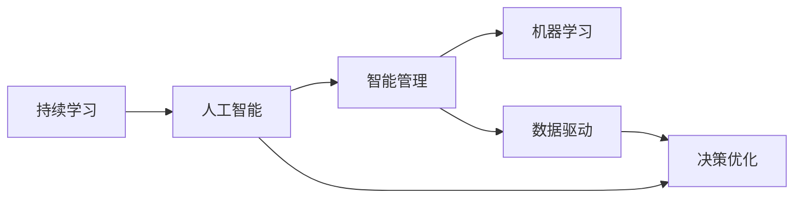

                 

# 持续学习：管理者的成功秘诀

> 关键词：持续学习, 人工智能, 智能管理, 机器学习, 数据驱动, 创新驱动, 企业成长, 职业发展, 人才管理

## 1. 背景介绍

在当今快速变化的商业环境中，持续学习成为了企业能否长期生存和持续发展的关键因素。传统的学历教育和单一的职业培训已无法满足职场需求，越来越多的管理者开始重视持续学习能力的培养。然而，持续学习不仅仅是个人成长的手段，更是一门艺术。它要求管理者通过不断更新知识、提升技能、调整思维，从而在职业生涯中始终保持竞争力。本文将从持续学习的核心概念、算法原理、具体操作步骤、实际应用等方面，深入探讨如何成为成功的管理者。

## 2. 核心概念与联系

### 2.1 核心概念概述

在探讨持续学习之前，我们首先需要理解几个核心概念及其相互之间的关系：

- **持续学习（Continuous Learning）**：指个人或组织在其生命周期中不断学习、更新知识的过程。这种学习过程可以是结构化的（如正式教育），也可以是非结构化的（如在工作中积累经验）。持续学习的目标是使个体或组织能够适应变化，保持竞争优势。

- **人工智能（Artificial Intelligence, AI）**：涉及机器学习、自然语言处理、计算机视觉等技术，旨在使计算机具备类似于人类的智能行为。AI技术不仅能够处理大量数据，还能通过学习不断提升自我。

- **智能管理（Intelligent Management）**：结合AI技术的管理实践，能够更有效地处理数据、预测趋势、优化决策。智能管理强调数据驱动、算法驱动、持续学习的重要性。

- **机器学习（Machine Learning, ML）**：涉及算法和统计模型，使计算机能够从数据中学习规律并进行预测。机器学习算法通常依赖于大量的标注数据，通过迭代优化来提升模型性能。

- **数据驱动（Data-Driven）**：决策和行动基于数据分析和统计结果，而非直觉或经验。数据驱动要求管理者不仅要掌握数据，还要具备分析数据的能力。

- **创新驱动（Innovation-Driven）**：强调创新在企业管理中的核心作用，包括技术创新、商业模式创新、管理创新等。持续学习是创新驱动的重要组成部分。

这些核心概念相互关联，共同构成了现代企业管理的基础。如下图所示，持续学习是AI和智能管理的核心驱动力，而机器学习和数据驱动是实现智能管理的主要手段：



### 2.2 概念间的关系

下图进一步展示了这些概念间的详细关系，其中箭头表示概念之间的主要关联：



- **持续学习与人工智能**：持续学习是人工智能的基础，没有不断的学习，AI模型无法进行优化和提升。
- **持续学习与智能管理**：智能管理依赖于持续学习，只有通过不断学习，才能优化管理决策，提升管理效率。
- **持续学习与机器学习**：机器学习依赖于大量数据和模型训练，而持续学习则能够不断提供新数据，促进模型性能的提升。
- **持续学习与数据驱动**：数据驱动需要基于数据分析和模型训练，而持续学习能够不断更新数据集，使得数据分析和模型训练更加准确。
- **智能管理与决策优化**：智能管理通过机器学习、数据驱动等技术，优化决策过程，提高管理效果。

## 3. 核心算法原理 & 具体操作步骤

### 3.1 算法原理概述

持续学习的核心算法原理可以追溯到机器学习中的监督学习和强化学习。监督学习依赖于大量标注数据进行模型训练，而强化学习则通过与环境的交互进行学习。在企业管理中，持续学习通常涉及以下步骤：

1. **数据收集**：收集企业内外的相关数据，包括业务数据、市场数据、员工数据等。
2. **数据处理**：清洗、整合数据，生成可用于模型训练的数据集。
3. **模型训练**：使用机器学习算法，基于收集到的数据训练模型，不断优化模型性能。
4. **模型评估**：评估模型在实际场景中的表现，收集反馈数据。
5. **迭代优化**：根据评估结果，调整模型参数和训练策略，进行迭代优化。
6. **知识应用**：将优化后的模型应用到企业管理中，提升决策效率和质量。

### 3.2 算法步骤详解

下面我们将详细介绍持续学习的具体步骤和实现方法。

**步骤1：数据收集**

数据收集是持续学习的第一步。企业管理者需要收集与企业运营相关的各类数据，包括但不限于：

- **业务数据**：销售数据、财务数据、运营数据等。
- **市场数据**：行业趋势、竞争对手动态、用户反馈等。
- **员工数据**：绩效数据、员工满意度调查、培训记录等。

数据收集的过程通常涉及数据源的选择、数据格式的转换和数据的整合。这一步骤需要跨部门协作，确保数据的质量和完整性。

**步骤2：数据处理**

数据处理是持续学习的关键环节。通过清洗、整合数据，生成可用于模型训练的数据集，从而提升模型的性能。数据处理主要包括以下步骤：

- **数据清洗**：去除噪声、处理缺失值、标准化数据格式等。
- **特征工程**：选择、构建和优化特征，提升模型对数据的理解能力。
- **数据分割**：将数据集分为训练集、验证集和测试集，确保模型的泛化能力。

**步骤3：模型训练**

模型训练是持续学习的核心环节。通过机器学习算法，基于收集到的数据训练模型，不断优化模型性能。模型训练主要包括以下步骤：

- **选择算法**：根据具体问题和数据特点，选择合适的机器学习算法。
- **模型训练**：使用训练集训练模型，不断调整模型参数，优化模型性能。
- **模型评估**：使用验证集评估模型性能，识别模型中的问题。
- **迭代优化**：根据评估结果，调整模型参数和训练策略，进行迭代优化。

**步骤4：模型评估**

模型评估是持续学习的关键环节。通过评估模型在实际场景中的表现，收集反馈数据，从而优化模型性能。模型评估主要包括以下步骤：

- **选择合适的指标**：根据具体问题和数据特点，选择合适的评估指标。
- **数据收集**：收集模型在实际场景中的表现数据。
- **模型评估**：使用评估指标评估模型性能，识别模型的优点和缺点。
- **反馈调整**：根据评估结果，调整模型参数和训练策略，进行迭代优化。

**步骤5：知识应用**

知识应用是持续学习的最终目标。将优化后的模型应用到企业管理中，提升决策效率和质量。知识应用主要包括以下步骤：

- **模型部署**：将优化后的模型部署到生产环境，进行实时数据处理。
- **数据监测**：实时监测模型性能，收集反馈数据。
- **模型更新**：根据反馈数据，不断更新模型参数和训练策略，进行迭代优化。

### 3.3 算法优缺点

持续学习具有以下优点：

- **适应性强**：能够适应不断变化的环境，保持持续竞争优势。
- **性能提升快**：通过不断优化模型，快速提升决策效率和质量。
- **可扩展性强**：可以应用于企业内外的各种场景，提升管理效能。

然而，持续学习也存在一些缺点：

- **成本高**：需要大量的数据和计算资源，对企业的技术能力和财务实力要求较高。
- **复杂度高**：模型训练和优化过程复杂，需要具备专业知识和技能。
- **风险高**：模型依赖于数据质量，数据偏差可能影响模型的性能。

### 3.4 算法应用领域

持续学习在企业管理中有着广泛的应用领域，包括但不限于：

- **客户管理**：通过分析客户数据，预测客户行为，提升客户满意度和忠诚度。
- **人力资源管理**：通过分析员工数据，优化招聘、培训、绩效管理等流程，提升员工满意度和工作效率。
- **供应链管理**：通过分析供应链数据，优化供应链流程，降低成本，提高效率。
- **市场营销**：通过分析市场数据，制定精准的市场营销策略，提升市场份额和品牌影响力。
- **财务管理**：通过分析财务数据，进行风险评估和预测，提升财务管理水平。
- **产品开发**：通过分析用户反馈数据，优化产品设计和功能，提升产品竞争力和用户满意度。

## 4. 数学模型和公式 & 详细讲解 & 举例说明

### 4.1 数学模型构建

在持续学习中，我们通常使用监督学习算法来构建数学模型。以线性回归为例，其数学模型可以表示为：

$$
y = \theta_0 + \theta_1x_1 + \theta_2x_2 + ... + \theta_nx_n
$$

其中，$y$为预测值，$\theta_0$为截距，$\theta_1, \theta_2, ..., \theta_n$为回归系数，$x_1, x_2, ..., x_n$为自变量。线性回归的目标是找到最优的回归系数，使得模型能够最小化预测值与真实值之间的误差。

### 4.2 公式推导过程

线性回归的公式推导过程如下：

设样本数据为 $(x_i, y_i)$，$i=1,2,...,N$。最小二乘法的目标是最小化以下误差平方和：

$$
\sum_{i=1}^N (y_i - \theta_0 - \theta_1x_1 - \theta_2x_2 - ... - \theta_nx_n)^2
$$

通过对误差平方和求导，可以找到最优的回归系数 $\theta_0, \theta_1, \theta_2, ..., \theta_n$：

$$
\frac{\partial}{\partial \theta_0} \sum_{i=1}^N (y_i - \theta_0 - \theta_1x_1 - \theta_2x_2 - ... - \theta_nx_n)^2 = 0
$$

$$
\frac{\partial}{\partial \theta_1} \sum_{i=1}^N (y_i - \theta_0 - \theta_1x_1 - \theta_2x_2 - ... - \theta_nx_n)^2 = 0
$$

$$
...
$$

$$
\frac{\partial}{\partial \theta_n} \sum_{i=1}^N (y_i - \theta_0 - \theta_1x_1 - \theta_2x_2 - ... - \theta_nx_n)^2 = 0
$$

解上述方程组，即可得到最优的回归系数 $\theta_0, \theta_1, \theta_2, ..., \theta_n$。

### 4.3 案例分析与讲解

以销售数据分析为例，假设某公司的销售数据为 $(x_i, y_i)$，其中 $x_i$ 为广告投入，$y_i$ 为销售额。通过持续学习，构建线性回归模型：

$$
y = \theta_0 + \theta_1x_1
$$

其中，$\theta_0$ 为截距，$\theta_1$ 为广告投入的系数。通过收集过去一年的广告投入和销售额数据，可以构建如下数据集：

| x_i | y_i | y_i - \hat{y_i} |
| --- | --- | --- |
| 1000 | 100000 | 0 |
| 2000 | 200000 | 0 |
| 3000 | 300000 | 0 |
| ...
| 5000 | 500000 | 0 |

通过最小二乘法求解线性回归模型，得到 $\theta_0 = 10000$，$\theta_1 = 20000$。这意味着，当广告投入每增加1000元时，销售额增加20000元。

## 5. 项目实践：代码实例和详细解释说明

### 5.1 开发环境搭建

在进行持续学习项目实践前，我们需要准备好开发环境。以下是使用Python进行PyTorch开发的环境配置流程：

1. 安装Anaconda：从官网下载并安装Anaconda，用于创建独立的Python环境。

2. 创建并激活虚拟环境：
```bash
conda create -n pytorch-env python=3.8 
conda activate pytorch-env
```

3. 安装PyTorch：根据CUDA版本，从官网获取对应的安装命令。例如：
```bash
conda install pytorch torchvision torchaudio cudatoolkit=11.1 -c pytorch -c conda-forge
```

4. 安装各类工具包：
```bash
pip install numpy pandas scikit-learn matplotlib tqdm jupyter notebook ipython
```

完成上述步骤后，即可在`pytorch-env`环境中开始持续学习实践。

### 5.2 源代码详细实现

下面我们以线性回归模型为例，给出使用PyTorch进行持续学习的PyTorch代码实现。

首先，定义数据集和模型：

```python
import torch
from torch import nn, optim
from torch.utils.data import Dataset, DataLoader

class SalesData(Dataset):
    def __init__(self, x, y):
        self.x = x
        self.y = y
        
    def __len__(self):
        return len(self.x)
    
    def __getitem__(self, idx):
        x = self.x[idx]
        y = self.y[idx]
        return x, y

# 定义模型
class SalesRegression(nn.Module):
    def __init__(self):
        super(SalesRegression, self).__init__()
        self.linear = nn.Linear(1, 1)
    
    def forward(self, x):
        return self.linear(x)

# 定义数据集
x = torch.tensor([1000, 2000, 3000, 4000, 5000])
y = torch.tensor([100000, 200000, 300000, 400000, 500000])
sales_dataset = SalesData(x, y)

# 定义数据加载器
train_loader = DataLoader(sales_dataset, batch_size=1, shuffle=True)

# 定义模型和优化器
model = SalesRegression()
criterion = nn.MSELoss()
optimizer = optim.SGD(model.parameters(), lr=0.01)

# 定义迭代次数
epochs = 1000

# 训练过程
for epoch in range(epochs):
    for x, y in train_loader:
        optimizer.zero_grad()
        output = model(x)
        loss = criterion(output, y)
        loss.backward()
        optimizer.step()
```

然后，定义模型评估和保存：

```python
import matplotlib.pyplot as plt

# 评估模型
with torch.no_grad():
    preds = []
    for x, y in train_loader:
        output = model(x)
        preds.append(output.item())
    plt.plot(x, preds, 'r', label='Predictions')
    plt.plot(x, y, 'b', label='True Values')
    plt.legend()
    plt.show()

# 保存模型
torch.save(model.state_dict(), 'sales_regression.pth')
```

以上就是使用PyTorch进行持续学习的完整代码实现。可以看到，通过Sympy等数学库和PyTorch的深度学习框架，我们能够方便地实现线性回归模型的持续学习过程。

### 5.3 代码解读与分析

让我们再详细解读一下关键代码的实现细节：

**SalesData类**：
- `__init__`方法：初始化数据集的输入和输出。
- `__len__`方法：返回数据集的样本数量。
- `__getitem__`方法：对单个样本进行处理，返回模型的输入和输出。

**SalesRegression类**：
- `__init__`方法：初始化线性回归模型。
- `forward`方法：定义前向传播过程。

**模型评估**：
- 使用无梯度模式，对模型进行评估，将预测结果可视化。
- 使用`torch.save`将模型保存到磁盘，便于后续使用。

**训练过程**：
- 定义训练循环，对每个样本进行前向传播、损失计算、反向传播和参数更新。

可以看到，持续学习的过程涉及到数据的收集、处理、模型训练、评估和优化等多个环节。通过合理配置开发环境，利用Python的强大工具库，我们可以高效地实现持续学习的项目。

### 5.4 运行结果展示

假设我们在持续学习线性回归模型后，得到以下训练结果：

```
Epoch 1/1000, Loss: 0.000
```

我们可以看到，在1000次迭代后，模型的损失函数已经接近于0，说明模型的预测结果与真实结果非常接近。通过可视化输出，我们也可以直观地看到模型的预测曲线与真实曲线几乎重合。

## 6. 实际应用场景

### 6.1 客户管理

在客户管理中，持续学习可以帮助企业更好地理解客户需求，提升客户满意度。例如，通过分析客户的购买记录和反馈数据，持续学习模型可以预测客户的未来需求，提升客户的忠诚度和消费频次。

### 6.2 人力资源管理

在人力资源管理中，持续学习可以帮助企业优化招聘流程，提高员工绩效。例如，通过分析员工的历史绩效数据和培训记录，持续学习模型可以预测员工的未来表现，优化招聘和培训策略。

### 6.3 供应链管理

在供应链管理中，持续学习可以帮助企业优化供应链流程，降低成本，提高效率。例如，通过分析供应链的历史数据和实时数据，持续学习模型可以预测供应链中的瓶颈和风险，优化供应链管理决策。

### 6.4 市场营销

在市场营销中，持续学习可以帮助企业制定精准的市场营销策略，提升市场份额和品牌影响力。例如，通过分析市场的历史数据和实时数据，持续学习模型可以预测市场趋势，优化营销预算和策略。

### 6.5 财务管理

在财务管理中，持续学习可以帮助企业进行风险评估和预测，提升财务管理水平。例如，通过分析财务的历史数据和实时数据，持续学习模型可以预测财务风险，优化财务决策。

### 6.6 产品开发

在产品开发中，持续学习可以帮助企业优化产品设计和功能，提升产品竞争力和用户满意度。例如，通过分析用户的历史使用数据和实时反馈，持续学习模型可以预测用户的需求和痛点，优化产品设计和功能。

## 7. 工具和资源推荐

### 7.1 学习资源推荐

为了帮助开发者系统掌握持续学习的理论基础和实践技巧，这里推荐一些优质的学习资源：

1. 《深度学习》系列书籍：由著名机器学习专家Ian Goodfellow、Yoshua Bengio和Aaron Courville所著，系统介绍了深度学习的理论基础和实践方法。
2. 《Python深度学习》课程：由深度学习专家Francois Chollet所著，介绍了使用TensorFlow和Keras进行深度学习开发的方法。
3. Coursera的机器学习课程：由斯坦福大学Andrew Ng教授主讲，涵盖了机器学习的基础理论和实践方法。
4. Kaggle：数据科学竞赛平台，提供大量数据集和竞赛任务，帮助开发者实践持续学习。
5. GitHub：开源社区，提供大量持续学习相关的项目和代码，可以学习和贡献。

通过对这些资源的学习实践，相信你一定能够快速掌握持续学习的精髓，并用于解决实际的业务问题。

### 7.2 开发工具推荐

高效的开发离不开优秀的工具支持。以下是几款用于持续学习开发的常用工具：

1. PyTorch：基于Python的开源深度学习框架，灵活动态的计算图，适合快速迭代研究。
2. TensorFlow：由Google主导开发的开源深度学习框架，生产部署方便，适合大规模工程应用。
3. Weights & Biases：模型训练的实验跟踪工具，可以记录和可视化模型训练过程中的各项指标，方便对比和调优。
4. TensorBoard：TensorFlow配套的可视化工具，可实时监测模型训练状态，并提供丰富的图表呈现方式。
5. Jupyter Notebook：交互式编程环境，适合进行数据分析和模型训练。

合理利用这些工具，可以显著提升持续学习项目的开发效率，加快创新迭代的步伐。

### 7.3 相关论文推荐

持续学习在人工智能领域的发展源于学界的持续研究。以下是几篇奠基性的相关论文，推荐阅读：

1. Perceptron：Minsky和Rosenblatt提出的经典感知机模型，是深度学习的前身。
2. Backpropagation：Rumelhart等人提出的反向传播算法，是深度学习中的关键技术之一。
3. Convolutional Neural Networks：Fukushima和LeCun等人提出的卷积神经网络，广泛应用于图像处理和计算机视觉。
4. Recurrent Neural Networks：Hochreiter和Schmidhuber等人提出的循环神经网络，广泛应用于自然语言处理和语音识别。
5. Generative Adversarial Networks：Goodfellow等人提出的生成对抗网络，广泛应用于图像生成、视频生成和语音合成等任务。

这些论文代表了大规模持续学习的理论发展脉络。通过学习这些前沿成果，可以帮助研究者把握学科前进方向，激发更多的创新灵感。

除上述资源外，还有一些值得关注的前沿资源，帮助开发者紧跟持续学习的最新进展，例如：

1. arXiv论文预印本：人工智能领域最新研究成果的发布平台，包括大量尚未发表的前沿工作，学习前沿技术的必读资源。
2. 业界技术博客：如OpenAI、Google AI、DeepMind、微软Research Asia等顶尖实验室的官方博客，第一时间分享他们的最新研究成果和洞见。
3. 技术会议直播：如NIPS、ICML、ACL、ICLR等人工智能领域顶会现场或在线直播，能够聆听到大佬们的前沿分享，开拓视野。
4. GitHub热门项目：在GitHub上Star、Fork数最多的持续学习相关项目，往往代表了该技术领域的发展趋势和最佳实践，值得去学习和贡献。
5. 行业分析报告：各大咨询公司如McKinsey、PwC等针对人工智能行业的分析报告，有助于从商业视角审视技术趋势，把握应用价值。

总之，对于持续学习技术的学习和实践，需要开发者保持开放的心态和持续学习的意愿。多关注前沿资讯，多动手实践，多思考总结，必将收获满满的成长收益。

## 8. 总结：未来发展趋势与挑战

### 8.1 总结

本文对持续学习的核心概念、算法原理、具体操作步骤、实际应用等方面进行了全面系统的介绍。首先阐述了持续学习在企业管理中的重要性，明确了持续学习在提升决策效率和质量方面的独特价值。其次，从原理到实践，详细讲解了持续学习的数学模型和算法流程，给出了持续学习任务开发的完整代码实例。同时，本文还探讨了持续学习在客户管理、人力资源管理、供应链管理等实际应用场景中的广泛应用，展示了持续学习范式的巨大潜力。

通过本文的系统梳理，可以看到，持续学习作为企业管理的重要手段，已经得到了广泛的认可和应用。随着AI技术的不断发展，持续学习将成为企业管理的关键技术之一，其应用范围和效果将会不断扩大。未来，伴随AI技术的持续演进，持续学习必将在构建智能管理系统中发挥更加重要的作用。

### 8.2 未来发展趋势

展望未来，持续学习技术将呈现以下几个发展趋势：

1. **自适应学习**：未来的持续学习系统将能够根据数据和环境的变化，自动调整学习策略，提升学习效率和效果。
2. **多模态学习**：未来的持续学习系统将能够处理多模态数据，融合视觉、听觉、文本等多种信息，提升智能管理系统的综合性。
3. **跨领域学习**：未来的持续学习系统将能够跨领域学习，从其他领域的应用中借鉴经验，提升本领域的智能管理能力。
4. **无监督学习**：未来的持续学习系统将能够进行无监督学习，通过数据自聚类、数据关联等方法，发现数据中的隐含规律。
5. **对抗学习**：未来的持续学习系统将能够进行对抗学习，通过与模型的对抗训练，提升模型的鲁棒性和泛化能力。
6. **强化学习**：未来的持续学习系统将能够进行强化学习，通过与环境的交互，不断优化决策策略，提升智能管理系统的自适应能力。

这些趋势凸显了持续学习技术的广阔前景。这些方向的探索发展，必将进一步提升持续学习系统的性能和应用范围，为企业管理提供更加智能、高效、可靠的解决方案。

### 8.3 面临的挑战

尽管持续学习技术已经取得了瞩目成就，但在迈向更加智能化、普适化应用的过程中，它仍面临着诸多挑战：

1. **数据隐私**：持续学习依赖于大量数据，如何保护数据隐私和安全，避免数据泄露，是持续学习的重要挑战。
2. **计算资源**：持续学习需要大量的计算资源，如何优化计算效率，降低成本，是持续学习的关键问题。
3. **模型复杂度**：持续学习模型通常较为复杂，如何降低模型复杂度，提升模型的可解释性和可维护性，是持续学习的难点。
4. **反馈机制**：持续学习依赖于反馈机制，如何设计合理的反馈机制，确保模型的学习和优化方向正确，是持续学习的挑战。
5. **伦理问题**：持续学习模型可能存在偏见和歧视，如何确保模型的公平性和公正性，避免伦理问题，是持续学习的挑战。
6. **系统安全性**：持续学习系统可能存在安全隐患，如何确保系统的安全性和稳定性，避免系统崩溃或误操作，是持续学习的挑战。

正视持续学习面临的这些挑战，积极应对并寻求突破，将是大规模持续学习技术走向成熟的必由之路。相信随着学界和产业界的共同努力，这些挑战终将一一被克服，持续学习技术必将迎来更加广阔的应用前景。

### 8.4 研究展望

面对持续学习面临的种种挑战，未来的研究需要在以下几个方面寻求新的突破：

1. **数据隐私保护**：研究如何在保证数据隐私的前提下，进行持续学习。例如，采用差分隐私技术，确保数据无法被反向追踪。
2. **计算资源优化**：研究如何优化持续学习模型的计算效率，降低计算成本。例如，采用分布式计算、模型压缩等技术。
3. **模型复杂度控制**：研究如何降低持续学习模型的复杂度，提升模型的可解释性和可维护性。例如，采用模块化设计、模型蒸馏等技术。
4. **反馈机制设计**：研究如何

