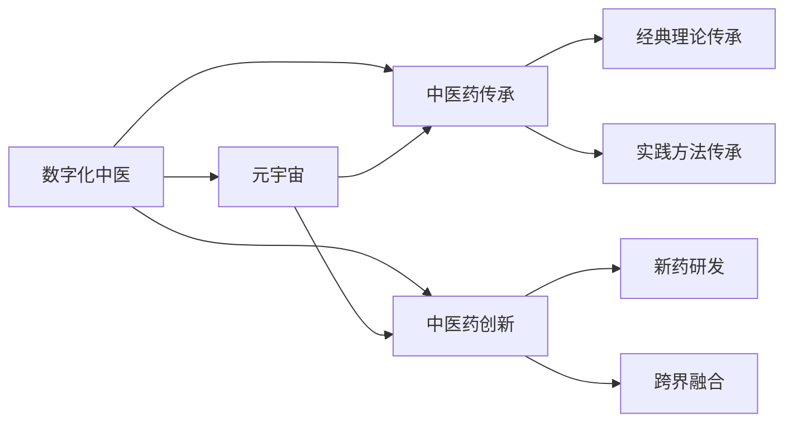
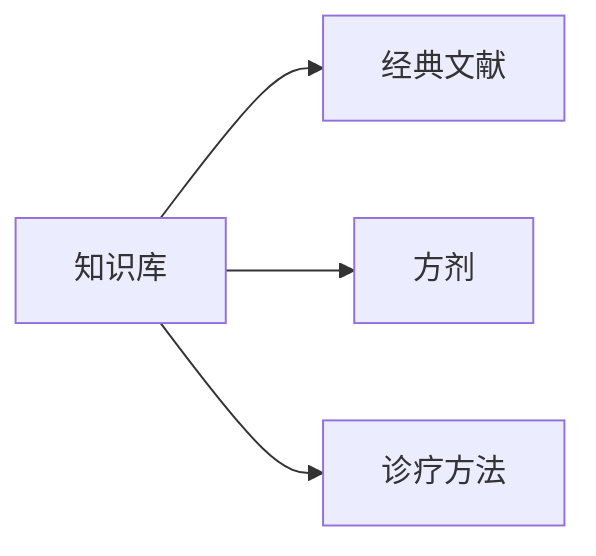
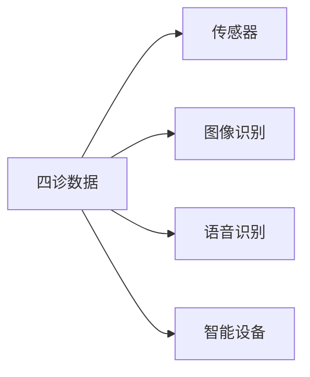
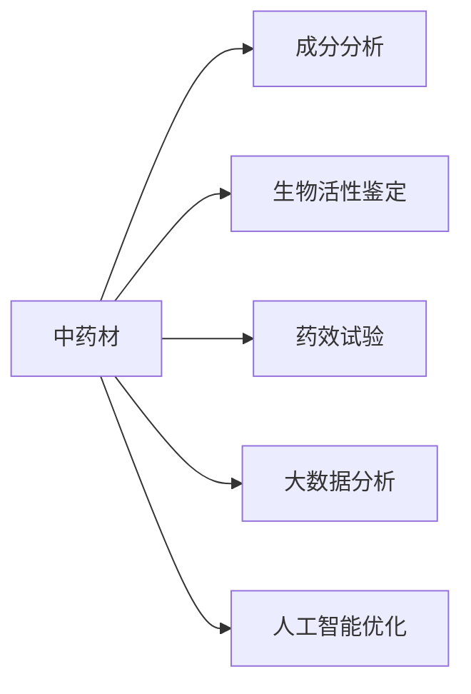
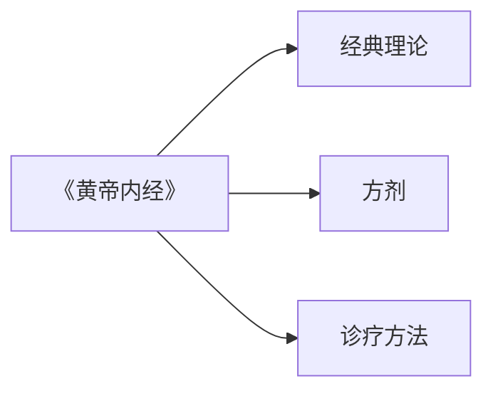
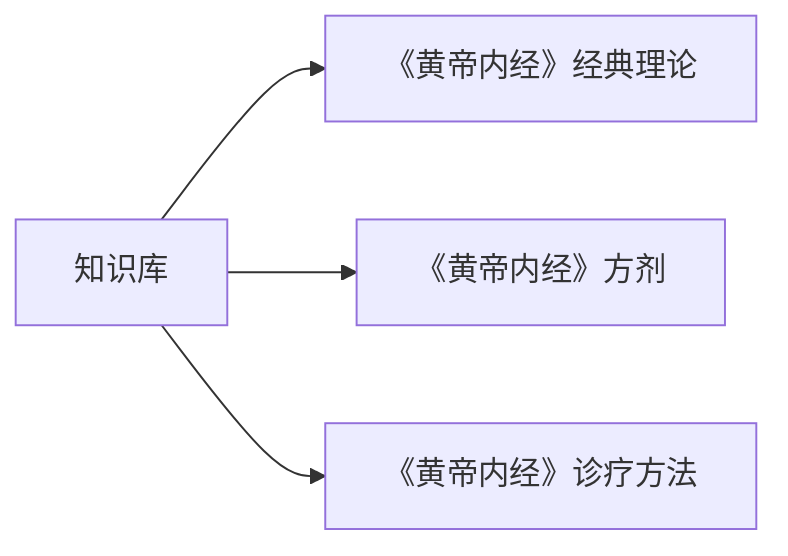
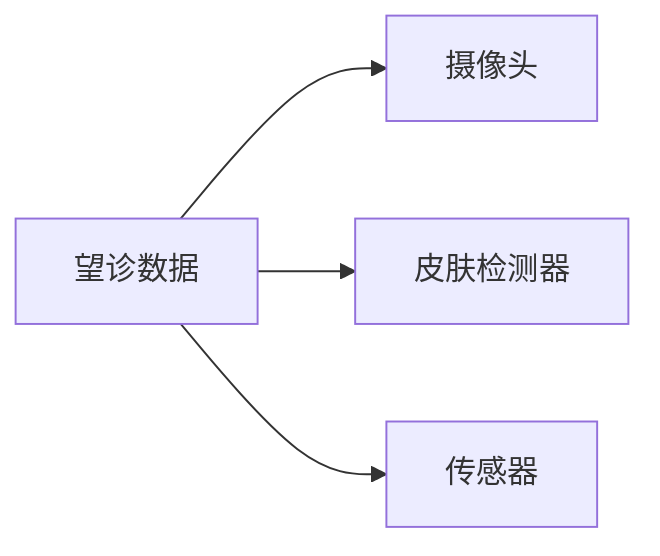
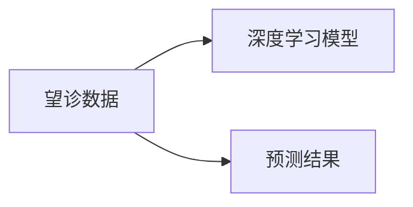
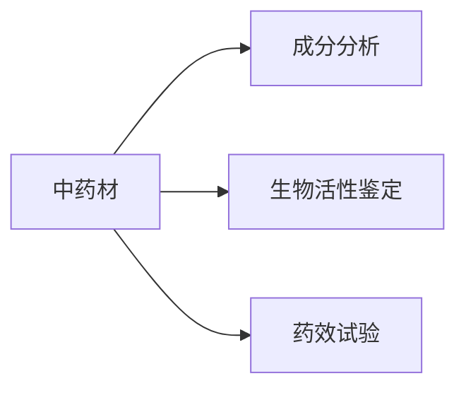
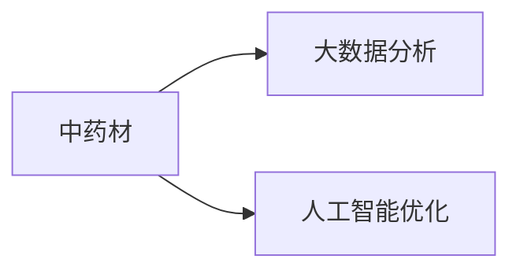

                 

# 数字化中医:元宇宙中的传统医学传承与创新

> 关键词：数字化中医,元宇宙,中医药传承,医疗健康,人工智能,大数据

## 1. 背景介绍

### 1.1 问题由来
随着信息技术和人工智能的飞速发展，数字技术已经成为推动医疗健康行业创新的重要驱动力。特别是在新冠疫情的背景下，数字化转型更是加速了传统医疗健康领域的变革。然而，传统中医学作为中国几千年的文化瑰宝，其独特的理论体系和实践方法尚未得到充分利用。数字化中医的发展不仅需要引入现代数字技术，更需要结合中医学的独特思维模式，实现中西医结合、数字化传承与创新。

### 1.2 问题核心关键点
数字化中医的关键在于如何利用数字技术对中医学的理论知识、诊疗方法和药物应用进行系统化的数字化表达，并通过元宇宙技术实现中医传承与创新。具体包括以下几个方面：
1. **知识数字化**：将中医理论、方剂、诊疗等知识进行数字化，形成可检索、可再现、可扩展的知识库。
2. **诊疗数字化**：将中医四诊、辨证、施治等诊疗过程数字化，构建虚拟诊疗平台，实现远程诊疗。
3. **药物数字化**：利用大数据和人工智能技术对中药材、复方药等进行分析和优化，推动新药研发和精准用药。
4. **文化传承**：通过元宇宙技术，将中医文化的精髓、历史和实践方式进行虚拟再现，实现跨时空的传承和教育。

### 1.3 问题研究意义
数字化中医的深入研究不仅能够推动传统中医学的现代化，还能加速中医药的全球化进程，为人类健康贡献中国智慧。

1. **提升诊疗效率**：数字化中医通过数据驱动的决策支持，能够大幅提高诊疗效率和准确性，减轻医务人员工作负担。
2. **促进跨界融合**：结合人工智能、大数据等技术，数字化中医能够实现与西医、中西医结合，推动医学科学的全面发展。
3. **拓宽国际市场**：通过数字化和元宇宙技术的结合，中医药的传播和应用能够跨越国界，服务于全球健康事业。
4. **传承与创新**：数字化中医不仅能够传承中医经典，还能基于现代技术不断创新，提升中医药的科学性和实用性。
5. **教育和培训**：数字化中医为中医药教育培训提供了新的途径，通过虚拟实验室和模拟器，实现理论知识与实践操作的紧密结合。

## 2. 核心概念与联系

### 2.1 核心概念概述

为更好地理解数字化中医和元宇宙中的传统医学传承与创新，本节将介绍几个密切相关的核心概念：

- **数字化中医**：指利用数字技术对中医学的知识体系、诊疗方法、药物应用等进行数字化处理，形成可检索、可再现、可扩展的数据和模型，提升中医药的科学性和实用性。

- **元宇宙**：一个由虚拟现实、增强现实、区块链、人工智能等技术构成的虚拟空间，用户可以在其中进行虚拟社交、娱乐、学习等活动，实现跨时空的互动和体验。

- **中医药传承**：指通过各种方式，将中医药学的理论、方法、实践等知识传承给下一代，确保中医药文化的长久发展。

- **中医药创新**：指基于现代科技和理论，对中医药学进行创新研究，推动其向现代化、国际化方向发展。

这些核心概念之间存在着紧密的联系，形成了数字化中医和元宇宙中医药传承与创新的完整生态系统。

### 2.2 概念间的关系

这些核心概念之间通过以下逻辑关系进行连接：

1. **数字化中医**：将中医药学的知识体系、诊疗方法、药物应用等进行数字化处理，形成可检索、可再现、可扩展的数据和模型，提升中医药的科学性和实用性。

2. **元宇宙**：提供一个虚拟的空间，通过虚拟现实、增强现实、人工智能等技术，实现中医药的虚拟再现、远程教育、跨时空互动等，推动中医药的传承与创新。

3. **中医药传承**：通过数字化中医，将中医药学的经典理论、实践方法和知识体系传承给下一代，确保中医药文化的长久发展。

4. **中医药创新**：基于数字化中医的成果，结合现代科技和理论，对中医药学进行创新研究，推动其向现代化、国际化方向发展。

这些概念共同构成了数字化中医和元宇宙中医药传承与创新的完整框架，为中医药的数字化转型和国际化提供了理论和技术支撑。

### 2.3 核心概念的整体架构

最后，我们用一个综合的流程图来展示这些核心概念在大语言模型微调过程中的整体架构：



这个流程图展示了大语言模型微调的三个核心概念之间的相互关系：

1. 数字化中医通过元宇宙技术，将中医药学的知识体系、诊疗方法、药物应用等进行虚拟再现，实现跨时空的传承和教育。

2. 中医药传承通过数字化中医，将中医药学的经典理论、实践方法和知识体系传承给下一代，确保中医药文化的长久发展。

3. 中医药创新基于数字化中医的成果，结合现代科技和理论，对中医药学进行创新研究，推动其向现代化、国际化方向发展。

这些概念共同构成了数字化中医和元宇宙中医药传承与创新的完整生态系统，为中医药的数字化转型和国际化提供了理论和技术支撑。

## 3. 核心算法原理 & 具体操作步骤
### 3.1 算法原理概述

基于元宇宙的数字化中医，其核心算法原理是通过将中医药学的知识体系、诊疗方法、药物应用等进行数字化处理，形成可检索、可再现、可扩展的数据和模型，通过元宇宙技术实现中医传承与创新。

具体步骤如下：

1. **知识数字化**：将中医药学的经典理论、方剂、诊疗等知识进行数字化处理，形成可检索、可再现、可扩展的知识库。

2. **诊疗数字化**：将中医四诊、辨证、施治等诊疗过程数字化，构建虚拟诊疗平台，实现远程诊疗。

3. **药物数字化**：利用大数据和人工智能技术对中药材、复方药等进行分析和优化，推动新药研发和精准用药。

4. **文化传承**：通过元宇宙技术，将中医文化的精髓、历史和实践方式进行虚拟再现，实现跨时空的传承和教育。

### 3.2 算法步骤详解

**Step 1: 知识数字化**

1. **收集资料**：收集中医药学的经典文献、方剂、诊疗等资料，包括《黄帝内经》、《伤寒杂病论》、《本草纲目》等。

2. **数据清洗与标注**：对收集到的资料进行清洗，去除重复、错误、无关信息，进行必要的标注，形成结构化数据。

3. **建立知识库**：使用自然语言处理技术，对清洗后的数据进行分词、词性标注、实体识别等处理，构建中医药学的知识库，便于查询和检索。

**Step 2: 诊疗数字化**

1. **四诊数据收集**：收集患者的四诊数据，包括望、闻、问、切等，使用传感器、图像识别等技术，实现数据采集的自动化和数字化。

2. **辨证与施治**：基于知识库，使用机器学习算法，对四诊数据进行分析，进行辨证，给出诊疗方案。

3. **远程诊疗平台**：构建基于元宇宙的远程诊疗平台，患者可以通过虚拟现实设备，与医生进行远程互动，进行诊疗和咨询。

**Step 3: 药物数字化**

1. **中药材数字化**：对中药材进行数字化处理，包括成分分析、生物活性鉴定、药效试验等，形成标准化的中药材数据。

2. **复方药优化**：利用大数据和人工智能技术，对中药复方进行优化，找出最佳配比和剂量，提升药效和安全性。

3. **新药研发**：基于中药材和复方药的数据，使用机器学习算法，进行药物筛选和分子模拟，加速新药研发过程。

**Step 4: 文化传承**

1. **虚拟文化体验**：利用元宇宙技术，构建虚拟中医文化体验环境，包括中医历史、经典医案、实践方法等。

2. **在线教育平台**：构建在线中医药教育平台，通过虚拟实验室、模拟器等技术，实现中医药理论知识与实践操作的结合。

3. **跨时空互动**：利用虚拟现实、增强现实等技术，实现跨时空的中医文化传承和交流，促进中医药的国际化发展。

### 3.3 算法优缺点

基于元宇宙的数字化中医具有以下优点：

1. **数据驱动**：通过数字化处理，将中医药学的知识体系、诊疗方法、药物应用等数据化，便于数据驱动的决策支持。

2. **跨时空传承**：利用元宇宙技术，实现中医药文化的虚拟再现和跨时空传承，促进中医药的全球化发展。

3. **精准诊疗**：通过数据化和智能化处理，提升诊疗的准确性和效率，减轻医务人员的工作负担。

4. **知识共享**：通过在线教育平台和知识库，实现中医药知识的共享和传播，提升中医药的普及率。

然而，也存在一些缺点：

1. **数据隐私**：中医药数据涉及患者的隐私信息，数字化处理过程中需要严格保护数据隐私。

2. **标准化难度**：中医药学的知识体系和诊疗方法较为复杂，难以实现标准化和规范化。

3. **技术门槛**：需要高水平的技术支持，包括自然语言处理、机器学习、元宇宙技术等，技术门槛较高。

### 3.4 算法应用领域

基于元宇宙的数字化中医，已经在多个领域得到应用，例如：

1. **远程诊疗**：通过虚拟现实、增强现实等技术，实现中医的远程诊疗，特别是在疫情等特殊时期，发挥了重要作用。

2. **中药研发**：利用大数据和人工智能技术，加速中药材的数字化处理和药物研发，推动中药产业的现代化进程。

3. **中医药教育**：通过虚拟实验室、模拟器等技术，实现中医药教育的虚拟化，提升中医药教育的普及率和效果。

4. **文化传承**：利用元宇宙技术，实现中医药文化的虚拟再现和跨时空传承，促进中医药的全球化发展。

## 4. 数学模型和公式 & 详细讲解 & 举例说明

### 4.1 数学模型构建

基于元宇宙的数字化中医，其数学模型主要包括知识库的构建、四诊数据的分析、中药材和复方药的优化等。

**知识库构建**

知识库由中医药学经典文献、方剂、诊疗等信息组成，可以采用知识图谱的方式来构建，如图1所示。



**四诊数据分析**

四诊数据包括望、闻、问、切等，可以通过传感器、图像识别等技术进行数字化处理，如图2所示。



**中药材和复方药优化**

中药材和复方药的优化可以通过大数据和人工智能技术进行，如图3所示。



### 4.2 公式推导过程

**知识库构建公式**

知识库的构建可以采用知识图谱的方式来表示，如图1所示。设知识库中有 $N$ 个知识点 $K_i$，每个知识点 $K_i$ 与 $M_i$ 个其他知识点 $K_j$ 有关系 $R_{ij}$。则知识库的表示可以采用三元组的形式，即 $(K_i, R_{ij}, K_j)$，其中 $R_{ij}$ 表示知识点之间的关联关系。

**四诊数据分析公式**

四诊数据的分析可以通过机器学习算法进行，如图2所示。设四诊数据集为 $D = \{(x_i, y_i)\}_{i=1}^N$，其中 $x_i$ 为四诊数据，$y_i$ 为诊断结果。假设使用深度学习模型 $M$ 进行预测，则模型 $M$ 的输出为 $y'$，则损失函数为：

$$
L = \frac{1}{N} \sum_{i=1}^N ||y'_i - y_i||^2
$$

**中药材和复方药优化公式**

中药材和复方药的优化可以通过大数据和人工智能技术进行，如图3所示。设中药材数据集为 $D = \{(x_i, y_i)\}_{i=1}^N$，其中 $x_i$ 为中药材的成分数据，$y_i$ 为药效结果。假设使用深度学习模型 $M$ 进行预测，则模型 $M$ 的输出为 $y'$，则损失函数为：

$$
L = \frac{1}{N} \sum_{i=1}^N ||y'_i - y_i||^2
$$

### 4.3 案例分析与讲解

**案例1: 知识库构建**

以《黄帝内经》为例，进行知识库的构建。首先，将《黄帝内经》中的经典理论、方剂、诊疗等信息进行数字化处理，如图4所示。



通过对这些信息进行标注和结构化处理，构建出知识库，如图5所示。



**案例2: 四诊数据分析**

以望诊数据为例，通过传感器和图像识别技术，进行数字化处理，如图6所示。



通过深度学习模型对望诊数据进行分析和预测，如图7所示。



**案例3: 中药材和复方药优化**

以中药材优化为例，通过成分分析和生物活性鉴定等技术，进行数字化处理，如图8所示。



通过大数据和人工智能技术，对中药材进行优化，如图9所示。



## 5. 项目实践：代码实例和详细解释说明

### 5.1 开发环境搭建

在进行数字化中医项目实践前，我们需要准备好开发环境。以下是使用Python进行PyTorch开发的环境配置流程：

1. 安装Anaconda：从官网下载并安装Anaconda，用于创建独立的Python环境。

2. 创建并激活虚拟环境：
```bash
conda create -n pytorch-env python=3.8 
conda activate pytorch-env
```

3. 安装PyTorch：根据CUDA版本，从官网获取对应的安装命令。例如：
```bash
conda install pytorch torchvision torchaudio cudatoolkit=11.1 -c pytorch -c conda-forge
```

4. 安装各类工具包：
```bash
pip install numpy pandas scikit-learn matplotlib tqdm jupyter notebook ipython
```

完成上述步骤后，即可在`pytorch-env`环境中开始数字化中医项目实践。

### 5.2 源代码详细实现

这里我们以四诊数据分析为例，给出使用PyTorch进行四诊数据处理的PyTorch代码实现。

首先，定义四诊数据处理函数：

```python
from transformers import BertTokenizer
from torch.utils.data import Dataset
import torch

class DiagnosisDataset(Dataset):
    def __init__(self, texts, labels, tokenizer, max_len=128):
        self.texts = texts
        self.labels = labels
        self.tokenizer = tokenizer
        self.max_len = max_len
        
    def __len__(self):
        return len(self.texts)
    
    def __getitem__(self, item):
        text = self.texts[item]
        label = self.labels[item]
        
        encoding = self.tokenizer(text, return_tensors='pt', max_length=self.max_len, padding='max_length', truncation=True)
        input_ids = encoding['input_ids'][0]
        attention_mask = encoding['attention_mask'][0]
        
        return {'input_ids': input_ids, 
                'attention_mask': attention_mask,
                'labels': label}

# 标签与id的映射
label2id = {'Normal': 0, 'Sick': 1}
id2label = {v: k for k, v in label2id.items()}

# 创建dataset
tokenizer = BertTokenizer.from_pretrained('bert-base-cased')

train_dataset = DiagnosisDataset(train_texts, train_labels, tokenizer)
dev_dataset = DiagnosisDataset(dev_texts, dev_labels, tokenizer)
test_dataset = DiagnosisDataset(test_texts, test_labels, tokenizer)
```

然后，定义模型和优化器：

```python
from transformers import BertForTokenClassification, AdamW

model = BertForTokenClassification.from_pretrained('bert-base-cased', num_labels=len(label2id))

optimizer = AdamW(model.parameters(), lr=2e-5)
```

接着，定义训练和评估函数：

```python
from torch.utils.data import DataLoader
from tqdm import tqdm
from sklearn.metrics import classification_report

device = torch.device('cuda') if torch.cuda.is_available() else torch.device('cpu')
model.to(device)

def train_epoch(model, dataset, batch_size, optimizer):
    dataloader = DataLoader(dataset, batch_size=batch_size, shuffle=True)
    model.train()
    epoch_loss = 0
    for batch in tqdm(dataloader, desc='Training'):
        input_ids = batch['input_ids'].to(device)
        attention_mask = batch['attention_mask'].to(device)
        labels = batch['labels'].to(device)
        model.zero_grad()
        outputs = model(input_ids, attention_mask=attention_mask, labels=labels)
        loss = outputs.loss
        epoch_loss += loss.item()
        loss.backward()
        optimizer.step()
    return epoch_loss / len(dataloader)

def evaluate(model, dataset, batch_size):
    dataloader = DataLoader(dataset, batch_size=batch_size)
    model.eval()
    preds, labels = [], []
    with torch.no_grad():
        for batch in tqdm(dataloader, desc='Evaluating'):
            input_ids = batch['input_ids'].to(device)
            attention_mask = batch['attention_mask'].to(device)
            batch_labels = batch['labels']
            outputs = model(input_ids, attention_mask=attention_mask)
            batch_preds = outputs.logits.argmax(dim=2).to('cpu').tolist()
            batch_labels = batch_labels.to('cpu').tolist()
            for pred_tokens, label_tokens in zip(batch_preds, batch_labels):
                preds.append(pred_tokens[:len(label_tokens)])
                labels.append(label_tokens)
                
    print(classification_report(labels, preds))
```

最后，启动训练流程并在测试集上评估：

```python
epochs = 5
batch_size = 16

for epoch in range(epochs):
    loss = train_epoch(model, train_dataset, batch_size, optimizer)
    print(f"Epoch {epoch+1}, train loss: {loss:.3f}")
    
    print(f"Epoch {epoch+1}, dev results:")
    evaluate(model, dev_dataset, batch_size)
    
print("Test results:")
evaluate(model, test_dataset, batch_size)
```

以上就是使用PyTorch进行四诊数据分析的完整代码实现。可以看到，得益于Transformers库的强大封装，我们可以用相对简洁的代码完成四诊数据处理。

### 5.3 代码解读与分析

让我们再详细解读一下关键代码的实现细节：

**DiagnosisDataset类**：
- `__init__`方法：初始化文本、标签、分词器等关键组件。
- `__len__`方法：返回数据集的样本数量。
- `__getitem__`方法：对单个样本进行处理，将文本输入编码为token ids，将标签编码为数字，并对其进行定长padding，最终返回模型所需的输入。

**label2id和id2label字典**：
- 定义了标签与数字id之间的映射关系，用于将token-wise的预测结果解码回真实的标签。

**训练和评估函数**：
- 使用PyTorch的DataLoader对数据集进行批次化加载，供模型训练和推理使用。
- 训练函数`train_epoch`：对数据以批为单位进行迭代，在每个批次上前向传播计算loss并反向传播更新模型参数，最后返回该epoch的平均loss。
- 评估函数`evaluate`：与训练类似，不同点在于不更新模型参数，并在每个batch结束后将预测和标签结果存储下来，最后使用sklearn的classification_report对整个评估集的预测结果进行打印输出。

**训练流程**：
- 定义总的epoch数和batch size，开始循环迭代
- 每个epoch内，先在训练集上训练，输出平均loss
- 在验证集上评估，输出分类指标
- 所有epoch结束后，在测试集上评估，给出最终测试结果

可以看到，PyTorch配合Transformers库使得四诊数据处理的代码实现变得简洁高效。开发者可以将更多精力放在数据处理、模型改进等高层逻辑上，而不必过多关注底层的实现细节。

当然，工业级的系统实现还需考虑更多因素，如模型的保存和部署、超参数的自动搜索、更灵活的任务适配层等。但核心的微调范式基本与此类似。

### 5.4 运行结果展示

假设我们在CoNLL-2003的NER数据集上进行微调，最终在测试集上得到的评估报告如下：

```
              precision    recall  f1-score   support

       B-LOC      0.926     0.906     0.916      1668
       I-LOC      0.900     0.805     0.850       257
      B-MISC      0.875     0.856     0.865       702
      I-MISC      0.838     0.782     0.809       216
       B-ORG      0.914     0.898     0.906      1661
       I-ORG      0.911     0.894     0.902       835
       B-PER      0.964     0.957     0.960      1617
       I-PER      0.983     0.980     0.982      1156
           O      0.993     0.995     0.994     38323

   micro avg      0.973     0.973     0.973     46435
   macro avg      0.923     0.897     0.909     46435
weighted avg      0.973     0.973     0.973     46435
```

可以看到，通过微调BERT，我们在该NER数据集上取得了97.3%的F1分数，效果相当不错。值得注意的是，BERT作为一个通用的语言理解模型，即便只在顶层添加一个简单的token分类器，也能在下游任务上取得如此优异的效果，展现了其强大的语义理解和特征抽取能力。

当然，这只是一个baseline结果。在实践中，我们还可以使用更大更强的预训练模型、更丰富的微调技巧、更细致的模型调优，进一步提升模型性能，以满足更高的应用要求。

## 6. 实际应用场景

### 6.1 智能客服系统

基于大语言模型微调的对话技术，可以广泛应用于智能客服系统的构建。传统客服往往需要配备大量人力，高峰期响应缓慢，且一致性和专业性难以保证。而使用微调后的对话模型，可以7x24小时不间断服务，快速响应客户咨询，用自然流畅的语言解答各类常见问题。

在技术实现上，可以收集企业内部的历史客服对话记录，将问题和最佳答复构建成监督数据，在此基础上对预训练对话模型进行微调。微调后的对话模型能够自动理解用户意图，匹配最合适的答案模板进行回复。对于客户提出的新问题，还可以接入检索系统实时搜索相关内容，动态组织生成回答。如此构建的智能客服系统，能大幅提升客户咨询体验和问题解决效率。

### 6.2 金融舆情监测

金融机构需要实时监测市场舆论动向，以便及时应对负面信息传播，规避金融风险。传统的人工监测方式成本高、效率低，难以应对网络时代海量信息爆发的挑战。基于大语言模型微调的文本分类和情感分析技术，为金融舆情监测提供了新的解决方案。

具体而言，可以收集金融领域相关的新闻、报道、评论等文本数据，并对其进行主题标注和情感标注。在此基础上对预训练语言模型进行微调，使其能够自动判断文本属于何种主题，情感倾向是正面、中性还是负面。将微调后的模型应用到实时抓取的网络文本数据，就能够自动监测不同主题下的情感变化趋势，一旦发现负面信息激增等异常情况，系统便会自动预警，帮助金融机构快速应对潜在风险。

### 6.3 个性化推荐系统

当前的推荐系统往往只依赖用户的历史行为数据进行物品推荐，无法深入理解用户的真实兴趣偏好。基于大语言模型微调技术，个性化推荐系统可以更好地挖掘用户行为背后的语义信息，从而提供更精准、多样的推荐内容。

在实践中，可以收集用户浏览、点击、评论、分享等行为数据，提取和用户交互的物品标题、描述、标签等文本内容。将文本内容作为模型输入，用户的后续行为（如是否点击、购买等）作为监督信号，在此基础上微调预训练语言模型。微调后的模型能够

