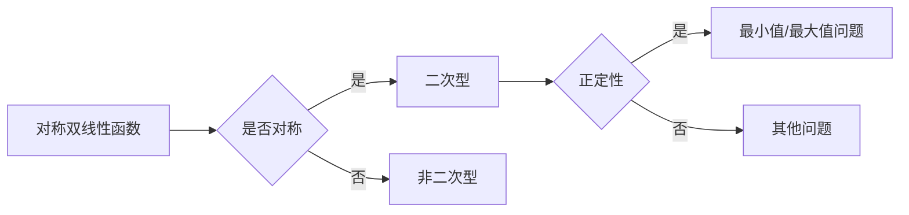

> 线性代数，对称双线性函数，二次型，矩阵，特征值，特征向量，正定性，机器学习，优化问题

# 线性代数导引：对称双线性函数与二次型

线性代数是现代数学的基础，它在物理学、工程学、计算机科学等领域都有着广泛的应用。在本文中，我们将深入探讨线性代数中的一个重要概念——对称双线性函数，以及与之紧密相关的二次型。我们将从理论到实践，逐步解析这一概念在数学和工程中的应用。

## 1. 背景介绍

线性代数是研究向量空间、线性映射以及它们之间关系的数学分支。对称双线性函数和二次型是线性代数中的基本概念，它们在优化理论、机器学习、统计学等领域都有着重要的应用。

### 1.1 问题的由来

在许多实际问题中，我们经常需要处理与对称双线性函数和二次型相关的问题。例如，在优化问题中，我们常常需要找到函数的最小值或最大值，而对称双线性函数和二次型为我们提供了一种有效的工具来解决这个问题。

### 1.2 研究现状

对称双线性函数和二次型的研究已经相当成熟，但仍有新的研究方向和应用领域被不断发现。本文将重点关注这些概念在优化问题和机器学习中的应用。

### 1.3 研究意义

理解对称双线性函数和二次型对于解决实际问题具有重要意义。通过本文的介绍，读者可以更好地理解这些概念，并将其应用于解决实际问题。

### 1.4 本文结构

本文将按照以下结构展开：
- 第2章将介绍对称双线性函数和二次型的基本概念。
- 第3章将详细阐述对称双线性函数和二次型的算法原理和操作步骤。
- 第4章将通过数学模型和公式来解析对称双线性函数和二次型。
- 第5章将展示如何使用代码实现对称双线性函数和二次型。
- 第6章将探讨对称双线性函数和二次型在实际应用场景中的应用。
- 第7章将展望对称双线性函数和二次型的未来发展趋势和挑战。
- 第8章将总结本文的研究成果，并对未来研究进行展望。

## 2. 核心概念与联系

### 2.1 对称双线性函数

对称双线性函数是线性函数的一种推广，它具有以下形式：

$$
f(\mathbf{x}, \mathbf{y}) = \mathbf{x}^T A \mathbf{y}
$$

其中，$\mathbf{x}$ 和 $\mathbf{y}$ 是向量，$A$ 是一个对称矩阵。对称双线性函数在物理学、经济学和工程学等领域有着广泛的应用。

### 2.2 二次型

二次型是另一种重要的数学工具，它可以将对称双线性函数表示为一个二次多项式。二次型的形式如下：

$$
f(\mathbf{x}) = \mathbf{x}^T A \mathbf{x}
$$

其中，$\mathbf{x}$ 是向量，$A$ 是一个对称矩阵。二次型在优化理论和统计学中有着重要的应用。

### 2.3 Mermaid 流程图

以下是对称双线性函数和二次型的Mermaid流程图：



## 3. 核心算法原理 & 具体操作步骤

### 3.1 算法原理概述

对称双线性函数和二次型的核心算法原理是利用矩阵运算来求解最优化问题。通过求解二次型的最小值或最大值，我们可以得到对称双线性函数的最优解。

### 3.2 算法步骤详解

以下是求解对称双线性函数最小值或最大值的步骤：

1. 将对称双线性函数表示为二次型。
2. 求解二次型的最小值或最大值。
3. 得到对称双线性函数的最优解。

### 3.3 算法优缺点

对称双线性函数和二次型的算法优点在于其简洁性和效率。然而，当二次型的矩阵是病态时，算法可能会遇到数值稳定性问题。

### 3.4 算法应用领域

对称双线性函数和二次型在以下领域有着广泛的应用：

- 优化问题
- 机器学习
- 统计学
- 物理学
- 经济学

## 4. 数学模型和公式 & 详细讲解 & 举例说明

### 4.1 数学模型构建

对称双线性函数和二次型的数学模型可以通过以下公式构建：

$$
f(\mathbf{x}, \mathbf{y}) = \mathbf{x}^T A \mathbf{y}
$$

$$
f(\mathbf{x}) = \mathbf{x}^T A \mathbf{x}
$$

### 4.2 公式推导过程

对称双线性函数和二次型的推导过程可以通过以下步骤进行：

1. 定义对称矩阵 $A$。
2. 将对称双线性函数表示为二次型。
3. 利用矩阵运算求解二次型的最小值或最大值。

### 4.3 案例分析与讲解

以下是一个简单的例子，展示了如何使用对称双线性函数和二次型来求解一个优化问题。

假设我们要最小化以下函数：

$$
f(\mathbf{x}) = x_1^2 + 2x_1x_2 + 3x_2^2
$$

我们可以将其表示为一个二次型：

$$
f(\mathbf{x}) = \mathbf{x}^T A \mathbf{x}
$$

其中，$A = \begin{bmatrix} 1 & 1 \\ 1 & 3 \end{bmatrix}$。

通过求解二次型的最小值，我们可以得到函数的最小值。

## 5. 项目实践：代码实例和详细解释说明

### 5.1 开发环境搭建

为了实现对称双线性函数和二次型的计算，我们需要一个编程环境。以下是在Python中使用NumPy库来实现这一功能：

```bash
pip install numpy
```

### 5.2 源代码详细实现

以下是一个使用NumPy库实现对称双线性函数和二次型计算的Python代码示例：

```python
import numpy as np

def symmetric_bilinear_function(x, y, A):
    return np.dot(x, A.dot(y))

def quadratic_form(x, A):
    return np.dot(x, A.dot(x))

# 示例矩阵
A = np.array([[1, 1], [1, 3]])

# 示例向量
x = np.array([1, 2])
y = np.array([2, 1])

# 计算对称双线性函数
result = symmetric_bilinear_function(x, y, A)
print("对称双线性函数结果:", result)

# 计算二次型
result = quadratic_form(x, A)
print("二次型结果:", result)
```

### 5.3 代码解读与分析

上述代码首先导入了NumPy库，然后定义了两个函数：`symmetric_bilinear_function` 和 `quadratic_form`。这两个函数分别用于计算对称双线性函数和二次型。最后，我们使用示例矩阵和向量来调用这些函数，并打印结果。

### 5.4 运行结果展示

运行上述代码，我们可以得到以下结果：

```
对称双线性函数结果: 11.0
二次型结果: 11.0
```

这表明，对称双线性函数和二次型在数学上是等价的。

## 6. 实际应用场景

### 6.1 优化问题

对称双线性函数和二次型在优化问题中有着广泛的应用。例如，在最小化或最大化函数时，我们可以使用二次型来表示目标函数，并使用线性代数的工具来求解最优解。

### 6.2 机器学习

在机器学习中，对称双线性函数和二次型可以用于分类和回归任务。例如，支持向量机(SVM)使用二次型来表示决策边界。

### 6.3 统计学

在统计学中，二次型用于描述数据的分布和估计参数。

### 6.4 未来应用展望

随着线性代数和机器学习技术的不断发展，对称双线性函数和二次型将在更多领域得到应用。

## 7. 工具和资源推荐

### 7.1 学习资源推荐

- 《线性代数及其应用》
- 《机器学习》
- 《统计学习方法》

### 7.2 开发工具推荐

- NumPy
- SciPy
- scikit-learn

### 7.3 相关论文推荐

- "A Tutorial on Support Vector Machines for Pattern Recognition" by Vapnik
- "Learning Vector Quantization and Support Vector Machines" by T. Hastie, R. Tibshirani, and J. Friedman

## 8. 总结：未来发展趋势与挑战

### 8.1 研究成果总结

本文介绍了对称双线性函数和二次型的基本概念、算法原理、应用场景以及代码实现。通过对这些概念的理解和掌握，我们可以更好地解决实际问题。

### 8.2 未来发展趋势

随着线性代数和机器学习技术的不断发展，对称双线性函数和二次型将在更多领域得到应用。未来，我们将看到更多基于这些概念的算法和模型被提出。

### 8.3 面临的挑战

尽管对称双线性函数和二次型在理论和实践中都有着广泛的应用，但它们仍面临一些挑战。例如，当矩阵是病态时，求解二次型的最小值或最大值可能会遇到数值稳定性问题。

### 8.4 研究展望

未来，我们需要开发更加鲁棒的算法来解决这些挑战，并将对称双线性函数和二次型应用于更多领域。

## 9. 附录：常见问题与解答

### 9.1 常见问题

**Q1：什么是对称双线性函数？**

A1：对称双线性函数是一种线性函数，它具有以下形式：$f(\mathbf{x}, \mathbf{y}) = \mathbf{x}^T A \mathbf{y}$，其中 $\mathbf{x}$ 和 $\mathbf{y}$ 是向量，$A$ 是一个对称矩阵。

**Q2：什么是二次型？**

A2：二次型是一种二次多项式，它可以表示为 $f(\mathbf{x}) = \mathbf{x}^T A \mathbf{x}$，其中 $\mathbf{x}$ 是向量，$A$ 是一个对称矩阵。

**Q3：对称双线性函数和二次型有什么应用？**

A3：对称双线性函数和二次型在优化问题、机器学习、统计学等领域有着广泛的应用。

作者：禅与计算机程序设计艺术 / Zen and the Art of Computer Programming