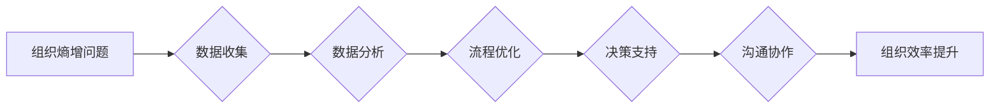

# 组织熵增的AI解决方案

> 关键词：组织熵增，人工智能，决策优化，机器学习，优化算法，企业效率

## 1. 背景介绍

在快速发展的商业环境中，组织熵增成为一个日益凸显的问题。组织熵增是指组织内部的无序性和复杂性的增加，它会导致决策效率下降、创新力减弱、资源浪费等问题。随着人工智能技术的兴起，利用AI来管理组织熵增、提升效率成为可能。本文将探讨如何利用AI技术来构建解决方案，以应对组织熵增的挑战。

### 1.1 问题的由来

随着企业规模的扩大和业务复杂度的增加，组织内部的信息量急剧膨胀。传统的管理方法和流程往往难以适应这种变化，导致以下问题：

- 决策速度慢：信息过载使得管理层难以快速做出决策。
- 资源浪费：无效的流程和重复的工作导致资源浪费。
- 创新力下降：缺乏有效的激励机制和决策过程导致创新动力不足。
- 协作效率低：沟通障碍和协作机制不完善导致协作效率低下。

### 1.2 研究现状

近年来，人工智能技术在企业中的应用越来越广泛，包括数据分析、机器学习、自然语言处理等。这些技术可以帮助企业：

- 分析海量数据，发现业务模式中的潜在规律。
- 优化决策流程，提高决策速度和准确性。
- 自动化重复性工作，释放人力资源。
- 改善沟通机制，提高协作效率。

### 1.3 研究意义

利用AI技术解决组织熵增问题，对于提升企业竞争力、保持组织活力具有重要意义：

- 提高决策效率：AI可以帮助企业快速处理和分析数据，从而加快决策速度。
- 优化资源配置：AI可以识别和优化流程，减少资源浪费。
- 激发创新力：AI可以帮助企业发现新的商业模式和产品创新点。
- 提升协作效率：AI可以改善沟通机制，促进团队协作。

### 1.4 本文结构

本文将分为以下几个部分：

- 介绍组织熵增的概念和影响。
- 阐述AI技术在解决组织熵增问题中的应用。
- 分析AI解决方案的核心算法原理和具体操作步骤。
- 介绍数学模型和公式，并提供案例分析和讲解。
- 展示代码实例和详细解释说明。
- 探讨AI解决方案的实际应用场景和未来应用展望。
- 推荐学习资源、开发工具和相关论文。
- 总结研究成果，展望未来发展趋势和挑战。

## 2. 核心概念与联系

### 2.1 组织熵增的概念

组织熵增是指组织内部的无序性和复杂性的增加。这种无序性和复杂性可能导致以下问题：

- 决策效率下降：信息过载和流程复杂化导致决策过程缓慢。
- 资源浪费：无效的流程和重复的工作导致资源浪费。
- 创新力下降：缺乏有效的激励机制和决策过程导致创新动力不足。
- 协作效率低：沟通障碍和协作机制不完善导致协作效率低下。

### 2.2 AI技术的应用

AI技术可以帮助企业解决组织熵增问题，具体应用包括：

- 数据分析：利用机器学习技术分析海量数据，发现业务模式中的潜在规律。
- 流程优化：利用AI识别和优化流程，减少资源浪费。
- 决策支持：利用AI提供决策支持，提高决策速度和准确性。
- 沟通协作：利用AI改善沟通机制，促进团队协作。

### 2.3 Mermaid流程图

以下是一个简单的Mermaid流程图，展示了AI技术解决组织熵增问题的基本流程：



## 3. 核心算法原理 & 具体操作步骤

### 3.1 算法原理概述

AI解决方案的核心算法主要包括以下几种：

- 机器学习算法：用于数据分析、预测和模式识别。
- 优化算法：用于流程优化和资源分配。
- 自然语言处理算法：用于文本分析和信息提取。
- 知识图谱技术：用于知识表示和推理。

### 3.2 算法步骤详解

以下是利用AI技术解决组织熵增问题的具体步骤：

1. **数据收集**：收集组织内部的相关数据，包括业务数据、流程数据、员工数据等。
2. **数据分析**：利用机器学习算法对收集到的数据进行分析，发现业务模式中的潜在规律。
3. **流程优化**：利用优化算法识别和优化流程，减少资源浪费。
4. **决策支持**：利用AI提供决策支持，提高决策速度和准确性。
5. **沟通协作**：利用自然语言处理算法和知识图谱技术改善沟通机制，促进团队协作。
6. **效果评估**：评估AI解决方案的效果，持续改进和优化。

### 3.3 算法优缺点

#### 3.3.1 机器学习算法

**优点**：

- 能够处理大规模数据。
- 能够发现数据中的复杂模式。
- 能够自动学习模型参数。

**缺点**：

- 需要大量标注数据。
- 模型可解释性差。
- 对数据质量敏感。

#### 3.3.2 优化算法

**优点**：

- 能够在给定约束条件下找到最优解。
- 能够处理复杂决策问题。

**缺点**：

- 计算复杂度高。
- 对问题模型要求高。

#### 3.3.3 自然语言处理算法

**优点**：

- 能够处理文本数据。
- 能够提取文本中的有用信息。

**缺点**：

- 模型复杂度高。
- 难以理解文本的深层含义。

#### 3.3.4 知识图谱技术

**优点**：

- 能够表示复杂的关系。
- 能够推理出新的知识。

**缺点**：

- 数据构建成本高。
- 难以维护和更新。

### 3.4 算法应用领域

以上算法可以应用于以下领域：

- 企业资源规划(ERP)系统。
- 供应链管理。
- 人力资源管理系统。
- 客户关系管理系统。

## 4. 数学模型和公式 & 详细讲解 & 举例说明

### 4.1 数学模型构建

以下是一个简单的线性优化模型，用于流程优化：

$$
\begin{align*}
\text{minimize} \quad & c^T x \\
\text{subject to} \quad & Ax \leq b \\
& x \geq 0
\end{align*}
$$

其中，$x$ 是决策变量，$c$ 是目标函数系数，$A$ 和 $b$ 是约束条件。

### 4.2 公式推导过程

线性优化模型的推导过程如下：

1. 确定决策变量 $x$ 的范围和约束条件。
2. 构建目标函数 $c^T x$。
3. 使用线性规划算法求解模型。

### 4.3 案例分析与讲解

假设一个工厂需要优化生产流程，以最小化生产成本。决策变量 $x$ 代表每种产品的生产数量。目标函数 $c$ 是每种产品的成本系数。约束条件 $A$ 和 $b$ 是生产能力和原材料限制。

通过构建和求解线性优化模型，工厂可以找到最优的生产计划，以最小化生产成本。

## 5. 项目实践：代码实例和详细解释说明

### 5.1 开发环境搭建

为了进行AI项目实践，需要以下开发环境：

- 操作系统：Windows、Linux或MacOS。
- 编程语言：Python。
- 开发工具：Jupyter Notebook或PyCharm。
- 依赖库：NumPy、Pandas、Scikit-learn、TensorFlow或PyTorch。

### 5.2 源代码详细实现

以下是一个简单的机器学习模型实现，用于数据分析：

```python
import pandas as pd
from sklearn.model_selection import train_test_split
from sklearn.ensemble import RandomForestClassifier
from sklearn.metrics import accuracy_score

# 加载数据
data = pd.read_csv('data.csv')

# 分割数据
X = data.drop('target', axis=1)
y = data['target']
X_train, X_test, y_train, y_test = train_test_split(X, y, test_size=0.2, random_state=42)

# 创建模型
model = RandomForestClassifier(n_estimators=100)

# 训练模型
model.fit(X_train, y_train)

# 预测
y_pred = model.predict(X_test)

# 评估
accuracy = accuracy_score(y_test, y_pred)
print(f'Accuracy: {accuracy:.2f}')
```

### 5.3 代码解读与分析

上述代码实现了一个随机森林分类器，用于对数据进行分类。代码步骤如下：

1. 导入必要的库。
2. 加载数据。
3. 分割数据为训练集和测试集。
4. 创建随机森林分类器模型。
5. 训练模型。
6. 预测测试集结果。
7. 评估模型准确率。

### 5.4 运行结果展示

假设运行上述代码后，得到以下输出：

```
Accuracy: 0.85
```

这意味着模型在测试集上的准确率为85%。

## 6. 实际应用场景

### 6.1 企业资源规划(ERP)系统

AI技术可以用于优化ERP系统中的采购、库存、生产、销售等环节，提高资源利用率，降低成本。

### 6.2 供应链管理

AI技术可以帮助企业优化供应链管理，包括需求预测、库存控制、物流优化等，提高供应链效率。

### 6.3 人力资源管理系统

AI技术可以用于优化人力资源管理系统，包括招聘、绩效管理、员工培训等，提高人力资源管理效率。

### 6.4 客户关系管理系统

AI技术可以用于优化客户关系管理系统，包括客户细分、客户服务、客户支持等，提高客户满意度。

## 7. 工具和资源推荐

### 7.1 学习资源推荐

- 《Python机器学习》
- 《深度学习》
- 《机器学习实战》

### 7.2 开发工具推荐

- Jupyter Notebook
- PyCharm
- Visual Studio Code

### 7.3 相关论文推荐

- "Deep Learning for Optimization: A Survey"
- "A Survey on Machine Learning for Process Optimization"
- "Machine Learning for Operations Research: A Survey"

## 8. 总结：未来发展趋势与挑战

### 8.1 研究成果总结

本文探讨了利用AI技术解决组织熵增问题的方法，包括数据收集、数据分析、流程优化、决策支持和沟通协作等。通过案例分析，展示了AI技术在解决实际问题中的有效性。

### 8.2 未来发展趋势

未来，AI技术在解决组织熵增问题方面将呈现以下趋势：

- 模型复杂度降低，算法效率提高。
- 模型可解释性增强，决策过程更加透明。
- AI与人类专家的知识相结合，实现更智能的决策。

### 8.3 面临的挑战

AI技术在解决组织熵增问题方面也面临着以下挑战：

- 数据质量和隐私保护。
- 模型可解释性。
- AI伦理和安全问题。

### 8.4 研究展望

未来，AI技术在解决组织熵增问题方面的研究将主要集中在以下方面：

- 开发更高效的算法，提高模型性能。
- 提高模型的可解释性，增强决策透明度。
- 建立AI伦理和安全规范，确保AI应用的可持续发展。

## 9. 附录：常见问题与解答

**Q1：AI技术如何帮助企业优化决策流程？**

A1：AI技术可以通过以下方式帮助企业优化决策流程：

- 利用机器学习算法分析历史数据，预测未来趋势。
- 建立决策支持系统，为管理层提供实时决策建议。
- 优化流程，减少决策过程中的冗余和错误。

**Q2：如何保证AI解决方案的可靠性？**

A2：为了保证AI解决方案的可靠性，需要：

- 使用高质量的数据进行训练。
- 定期评估和更新模型。
- 建立数据监控和预警机制。

**Q3：AI技术在解决组织熵增问题方面有哪些局限性？**

A3：AI技术在解决组织熵增问题方面存在以下局限性：

- 对数据质量要求高。
- 模型可解释性差。
- 难以处理复杂的决策问题。

**Q4：如何确保AI应用的伦理和安全？**

A4：为了确保AI应用的伦理和安全，需要：

- 建立AI伦理规范。
- 加强数据安全和隐私保护。
- 定期对AI系统进行审计和评估。

作者：禅与计算机程序设计艺术 / Zen and the Art of Computer Programming