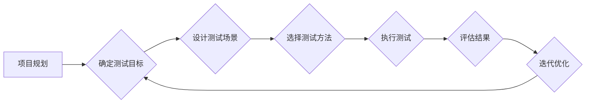

# 自动驾驶中的开环评测与闭环评测

> 关键词：自动驾驶，开环评测，闭环评测，仿真测试，实车测试，安全评估，性能测试，人工智能

## 1. 背景介绍

自动驾驶技术作为人工智能领域的热点，正在逐步从理论走向实践。随着技术的不断进步，自动驾驶汽车已经能够在特定的场景下实现自动驾驶功能。然而，自动驾驶系统的安全性和可靠性是至关重要的，这要求我们必须对自动驾驶系统进行全面而严格的测试和评估。在自动驾驶测试与评估领域，开环评测与闭环评测是两种重要的方法。

### 1.1 自动驾驶测试与评估的重要性

自动驾驶系统的测试与评估是确保其安全性和可靠性的关键环节。以下是一些关键点：

- **安全性**：自动驾驶系统必须在各种复杂场景下都能够安全地操作，避免发生交通事故。
- **可靠性**：自动驾驶系统需要在各种环境和条件下稳定运行，确保乘客的舒适性和出行效率。
- **法规遵循**：自动驾驶系统必须符合国家和地区的相关法规要求。

### 1.2 开环评测与闭环评测的概念

开环评测和闭环评测是自动驾驶测试与评估的两种主要方法。

- **开环评测**：在开环评测中，测试环境是预先设定的，系统不需要对外部环境做出响应。测试者可以精确控制测试条件，从而更容易地评估系统的性能。

- **闭环评测**：在闭环评测中，系统需要对外部环境做出响应。测试者无法完全控制测试环境，需要评估系统在动态环境下的表现。

## 2. 核心概念与联系

### 2.1 自动驾驶测试与评估的流程

以下是一个简化的自动驾驶测试与评估流程的Mermaid流程图：



### 2.2 开环评测与闭环评测的关系

开环评测和闭环评测是自动驾驶测试与评估的两种互补方法。开环评测适用于对系统性能的初步评估和优化，而闭环评测则更关注系统在实际运行中的表现。

## 3. 核心算法原理 & 具体操作步骤

### 3.1 算法原理概述

自动驾驶测试与评估的核心算法涉及多个方面，包括但不限于：

- **感知算法**：用于收集环境信息，如激光雷达、摄像头和雷达等传感器数据。
- **定位算法**：用于确定车辆在环境中的位置和运动状态。
- **决策算法**：根据感知和定位信息，规划车辆的行驶路径。
- **控制算法**：根据决策信息，控制车辆的转向、加速和制动。

### 3.2 算法步骤详解

自动驾驶测试与评估的步骤如下：

1. **定义测试目标**：明确测试的目的和预期结果。
2. **设计测试场景**：根据测试目标设计各种测试场景，包括正常场景、异常场景和边界场景。
3. **选择测试方法**：根据测试场景选择合适的测试方法，如仿真测试、实车测试等。
4. **执行测试**：按照测试计划执行测试，收集测试数据。
5. **评估结果**：分析测试数据，评估系统的性能和安全性。
6. **迭代优化**：根据评估结果，对系统进行优化和改进。

### 3.3 算法优缺点

- **感知算法**：优点是能够提供丰富的环境信息，缺点是可能会受到传感器性能和环境噪声的影响。
- **定位算法**：优点是能够提供高精度的位置信息，缺点是可能会受到多路径效应和信号衰减的影响。
- **决策算法**：优点是能够根据环境信息规划合理的行驶路径，缺点是可能存在决策错误。
- **控制算法**：优点是实现车辆的精确控制，缺点是可能存在响应延迟和执行误差。

### 3.4 算法应用领域

自动驾驶测试与评估算法应用领域广泛，包括：

- **自动驾驶汽车**：用于测试和评估自动驾驶汽车的感知、决策和控制能力。
- **自动驾驶自行车**：用于测试和评估自动驾驶自行车的稳定性、安全性和可靠性。
- **无人机**：用于测试和评估无人机的自主导航、避障和任务执行能力。

## 4. 数学模型和公式 & 详细讲解 & 举例说明

### 4.1 数学模型构建

自动驾驶测试与评估的数学模型涉及多个方面，以下是一些常见的数学模型：

- **卡尔曼滤波器**：用于估计系统的状态。
- **贝叶斯网络**：用于描述系统的不确定性。
- **决策树**：用于决策算法的设计。

### 4.2 公式推导过程

以卡尔曼滤波器为例，其状态更新公式如下：

$$
x_{k|k} = Fx_{k-1|k-1} + Bu_k
$$

其中，$x_{k|k}$ 表示在第 k 时刻的状态估计，$x_{k-1|k-1}$ 表示在第 k-1 时刻的状态估计，$F$ 表示状态转移矩阵，$u_k$ 表示在第 k 时刻的输入。

### 4.3 案例分析与讲解

以下是一个简单的自动驾驶测试场景分析案例：

假设一辆自动驾驶汽车在行驶过程中，需要通过一个交叉路口。此时，系统需要根据交叉路口的交通灯状态来做出决策。

- **感知**：传感器检测到交通灯为红色。
- **定位**：定位系统确定汽车位于交叉路口附近。
- **决策**：决策算法根据交通灯状态和车辆位置，决定停车等待。
- **控制**：控制算法控制车辆减速并停车。

## 5. 项目实践：代码实例和详细解释说明

### 5.1 开发环境搭建

为了进行自动驾驶测试与评估，我们需要搭建以下开发环境：

- **操作系统**：Linux或Windows
- **编程语言**：Python
- **开发工具**：PyCharm、Visual Studio Code
- **测试平台**：ROS（Robot Operating System）

### 5.2 源代码详细实现

以下是一个简单的Python代码示例，用于模拟自动驾驶汽车的决策过程：

```python
import numpy as np

def make_decision(traffic_light_state, vehicle_position):
    if traffic_light_state == "RED" and vehicle_position < 10:
        return "STOP"
    elif traffic_light_state == "GREEN":
        return "GO"
    else:
        return "SLOW_DOWN"
```

### 5.3 代码解读与分析

以上代码定义了一个简单的决策函数 `make_decision`，根据交通灯状态和车辆位置，返回相应的决策结果。

### 5.4 运行结果展示

以下是一个简单的运行结果示例：

```python
traffic_light_state = "RED"
vehicle_position = 5

decision = make_decision(traffic_light_state, vehicle_position)
print(decision)  # 输出：STOP
```

## 6. 实际应用场景

自动驾驶技术在实际应用场景中具有广泛的应用，以下是一些常见的应用场景：

- **城市交通**：自动驾驶汽车可以减少交通拥堵，提高道路利用率。
- **物流运输**：自动驾驶卡车可以降低物流成本，提高运输效率。
- **公共交通**：自动驾驶公交车可以提供更加便捷的公共交通服务。

### 6.4 未来应用展望

随着自动驾驶技术的不断发展，未来自动驾驶系统将在以下方面取得突破：

- **安全性**：通过引入更多的传感器和算法，提高系统的安全性。
- **可靠性**：通过提高系统的稳定性和鲁棒性，确保系统的可靠性。
- **效率**：通过优化算法和硬件，提高系统的效率。

## 7. 工具和资源推荐

### 7.1 学习资源推荐

- **书籍**：《自动驾驶汽车：技术原理与应用》、《深度学习与自动驾驶》
- **在线课程**：Coursera、edX上的自动驾驶相关课程
- **技术社区**：ROS社区、GitHub

### 7.2 开发工具推荐

- **仿真平台**：CARLA、AirSim
- **开发框架**：ROS、CyberRT
- **工具链**：CMake、Makefile

### 7.3 相关论文推荐

- **论文1**："Autonomous driving: perception for autonomous vehicles" by Forster et al.
- **论文2**："Deep Learning for Autonomous Driving" by Zhang et al.
- **论文3**："ROS-based simulation and testing platform for autonomous driving" by Xiao et al.

## 8. 总结：未来发展趋势与挑战

### 8.1 研究成果总结

自动驾驶技术已经取得了显著的进展，但仍面临着诸多挑战。

### 8.2 未来发展趋势

- **感知技术**：更加精准和稳定的传感器技术。
- **决策算法**：更加智能和高效的决策算法。
- **控制算法**：更加精确和稳定的控制算法。

### 8.3 面临的挑战

- **技术挑战**：感知、决策和控制技术的集成和优化。
- **伦理挑战**：自动驾驶系统的伦理和责任问题。
- **法规挑战**：自动驾驶系统的法规和标准。

### 8.4 研究展望

自动驾驶技术的研究将在以下方面取得突破：

- **技术突破**：在感知、决策和控制技术方面取得突破。
- **产业应用**：推动自动驾驶技术的产业化应用。
- **社会影响**：改变人们的出行方式和生活方式。

## 9. 附录：常见问题与解答

**Q1：自动驾驶测试与评估的目的是什么？**

A1：自动驾驶测试与评估的目的是确保自动驾驶系统的安全性和可靠性，确保其在各种环境和条件下能够安全地运行。

**Q2：开环评测和闭环评测有什么区别？**

A2：开环评测是预先设定测试环境，系统不需要对外部环境做出响应；闭环评测是系统需要对外部环境做出响应。

**Q3：自动驾驶测试与评估的关键技术有哪些？**

A3：自动驾驶测试与评估的关键技术包括感知、定位、决策和控制。

**Q4：自动驾驶技术在实际应用中面临哪些挑战？**

A4：自动驾驶技术在实际应用中面临的挑战包括技术挑战、伦理挑战和法规挑战。

---

作者：禅与计算机程序设计艺术 / Zen and the Art of Computer Programming