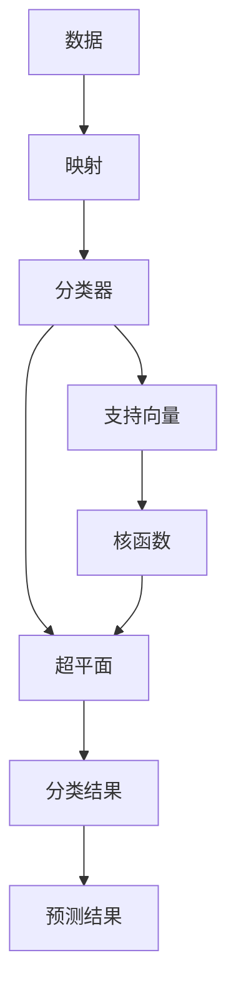

                 

# 支持向量机 (Support Vector Machines, SVM) 原理与代码实例讲解

> 关键词：支持向量机, 机器学习, 分类算法, 核方法, 优化问题, 凸二次规划, Python

## 1. 背景介绍

支持向量机（Support Vector Machines, SVM）是一种经典的机器学习算法，特别适用于分类和回归任务。由于其优异的分类性能和泛化能力，SVM在学术界和工业界都得到了广泛的应用。

### 1.1 问题由来

SVM的最初灵感来源于统计学习理论中的“支持向量”概念，旨在通过寻找最优的决策边界来实现样本的分类。在数据集线性可分的情况下，SVM通过最大化“分类间隔”来确定最佳的分类超平面。这一方法由于其简单高效，逐渐被发展成一种通用的分类和回归算法。

在实际应用中，SVM还被扩展到非线性情况下的核方法，以及大规模数据集下的随机梯度下降（SGD）优化算法等。这些扩展使得SVM能够处理更为复杂的数据结构，适用于众多实际问题。

### 1.2 问题核心关键点

SVM的核心思想是通过寻找最优的超平面来实现样本分类。核心步骤包括：
1. 数据映射：将数据映射到高维空间。
2. 求解最优超平面：在映射后的空间中求解具有最大分类间隔的超平面。
3. 核函数选择：根据实际问题选择适当的核函数，进行非线性处理。
4. 正则化参数调节：调节模型复杂度和泛化能力。

这些步骤共同构成了SVM的算法框架，使得其能够在不同的数据集和任务中发挥高效、稳健的分类能力。

### 1.3 问题研究意义

SVM作为一种简单而有效的机器学习算法，对于提升数据处理和模型训练的自动化水平，降低模型复杂度和解释难度，具有重要意义：
1. 简单易用：相比于复杂的深度学习模型，SVM算法更加直观易懂。
2. 泛化能力强：在大多数数据集上，SVM都能获得较好的分类性能。
3. 高效求解：通过凸二次规划方法求解最优超平面，计算复杂度较低。
4. 广泛适用：不仅适用于线性可分数据，还能处理非线性数据和多重目标问题。

## 2. 核心概念与联系

### 2.1 核心概念概述

为了更好地理解SVM的算法原理和实现流程，本节将介绍几个关键核心概念：

- 超平面（Hyperplane）：在二维空间中，超平面是一个一维的直线；在三维空间中，超平面是一个二维的平面。在多维空间中，超平面是一个n-1维的子空间。
- 分类间隔（Margin）：从超平面到最近数据点的距离。SVM的目标是最大化分类间隔，使得分类边界更加稳健。
- 支持向量（Support Vector）：处于最近数据点位置的数据点，对于分类边界有重要影响。
- 核函数（Kernel Function）：将数据映射到高维空间的函数，使得数据具有线性可分性。
- 对偶问题（Dual Problem）：SVM的数学表达形式，通过求解对偶问题可简化计算。

这些概念之间相互关联，共同构成了SVM的基本框架。

### 2.2 概念间的关系

SVM的分类过程可以分解为以下几个步骤，并由以下Mermaid流程图进行展示：



这个流程图展示了SVM的基本工作流程：
1. 输入数据。
2. 通过核函数映射到高维空间。
3. 寻找最优的超平面。
4. 确定支持向量。
5. 通过超平面进行分类预测。

通过这个流程图，我们可以更清晰地理解SVM的内部机制和各部分之间的关系。

## 3. 核心算法原理 & 具体操作步骤

### 3.1 算法原理概述

SVM的核心思想是通过寻找最优的超平面来实现样本分类。其基本原理如下：
1. 将数据映射到高维空间。
2. 在映射后的空间中寻找具有最大分类间隔的超平面。
3. 通过超平面对新样本进行分类预测。

SVM的目标函数可以表示为：
$$
\min_{\boldsymbol{w}, \boldsymbol{b}} \frac{1}{2} \|\boldsymbol{w}\|^2 + C \sum_{i=1}^{n} \xi_i
$$
其中，$\boldsymbol{w}$ 是分类超平面的法向量，$\boldsymbol{b}$ 是超平面的偏置项，$\xi_i$ 是分类错误度量的松弛变量，$C$ 是正则化参数。

### 3.2 算法步骤详解

以下是SVM算法的详细步骤：

**Step 1: 准备数据**
- 将数据集分为训练集和测试集。
- 对数据进行归一化处理，使得特征值都在[0, 1]之间。
- 选择一个合适的核函数，进行数据映射。

**Step 2: 求解对偶问题**
- 将原问题转化为对偶问题，得到Lagrange函数：
$$
L(\boldsymbol{\alpha}, \boldsymbol{\beta}, \boldsymbol{w}, \boldsymbol{b}) = - \sum_{i=1}^{n} \alpha_i y_i (\boldsymbol{w} \cdot \boldsymbol{x}_i + b) - \frac{1}{2} \|\boldsymbol{w}\|^2 + \frac{1}{2} \sum_{i=1}^{n} \alpha_i \alpha_j y_i y_j (\boldsymbol{x}_i \cdot \boldsymbol{x}_j) + C \sum_{i=1}^{n} \alpha_i
$$
其中，$\alpha_i$ 是拉格朗日乘子，$\boldsymbol{\beta}$ 是分类超平面的拉格朗日乘子。

**Step 3: 求解Lagrange乘子**
- 对Lagrange函数进行偏导数求解，得到拉格朗日乘子。
- 将拉格朗日乘子代入原问题，求解分类超平面的参数 $\boldsymbol{w}$ 和 $\boldsymbol{b}$。

**Step 4: 训练模型**
- 在测试集上评估模型的分类性能，并计算分类错误率。
- 在实际应用中，使用测试集数据进行预测。

### 3.3 算法优缺点

SVM算法具有以下优点：
1. 泛化能力强：通过最大化分类间隔，SVM能够适应高维空间中的非线性分类问题。
2. 鲁棒性好：对于噪声和异常点具有较好的鲁棒性。
3. 计算复杂度低：通过凸二次规划求解最优超平面，计算复杂度较低。

同时，SVM也存在一些缺点：
1. 对数据预处理依赖大：数据需要进行归一化、映射等预处理。
2. 需要选择合适的核函数：核函数选择不当可能影响模型的性能。
3. 对参数敏感：正则化参数 $C$ 和核函数参数的选择对模型性能有重要影响。
4. 内存消耗大：在处理大规模数据集时，需要大量内存进行数据映射和存储。

### 3.4 算法应用领域

SVM算法在诸多领域得到了广泛的应用，包括：

- 文本分类：如垃圾邮件过滤、情感分析等。
- 图像识别：如人脸识别、物体检测等。
- 生物信息学：如基因序列分类、蛋白质结构预测等。
- 金融风险预测：如信用评估、股票预测等。

## 4. 数学模型和公式 & 详细讲解 & 举例说明

### 4.1 数学模型构建

SVM的核心数学模型基于凸二次规划问题，其优化目标函数为：
$$
\min_{\boldsymbol{w}, \boldsymbol{b}} \frac{1}{2} \|\boldsymbol{w}\|^2 + C \sum_{i=1}^{n} \xi_i
$$
其中，$\boldsymbol{w}$ 是分类超平面的法向量，$\boldsymbol{b}$ 是超平面的偏置项，$\xi_i$ 是分类错误度量的松弛变量，$C$ 是正则化参数。

约束条件为：
$$
\begin{cases}
\boldsymbol{w}^T \boldsymbol{x}_i + b \geq 1 - \xi_i, & y_i = 1 \\
\boldsymbol{w}^T \boldsymbol{x}_i + b \leq -1 + \xi_i, & y_i = -1
\end{cases}
$$
其中，$\xi_i$ 为松弛变量，$y_i$ 为样本的标签。

### 4.2 公式推导过程

对于二分类问题，SVM的数学模型可以转化为对偶问题：
$$
\max_{\alpha, \beta} \sum_{i=1}^{n} \alpha_i y_i - \frac{1}{2} \sum_{i=1}^{n} \sum_{j=1}^{n} \alpha_i \alpha_j y_i y_j \boldsymbol{x}_i \cdot \boldsymbol{x}_j - \frac{1}{2} \sum_{i=1}^{n} \alpha_i^2 - \sum_{i=1}^{n} \alpha_i
$$
约束条件为：
$$
\begin{cases}
0 \leq \alpha_i \leq C, & y_i = 1 \\
0 \leq \alpha_i \leq C, & y_i = -1
\end{cases}
$$

为了求解对偶问题，需要引入拉格朗日乘子 $\alpha_i$ 和 $\beta$，并将其代入原问题中，得到：
$$
L(\alpha, \beta, \boldsymbol{w}, \boldsymbol{b}) = - \sum_{i=1}^{n} \alpha_i y_i (\boldsymbol{w} \cdot \boldsymbol{x}_i + b) - \frac{1}{2} \|\boldsymbol{w}\|^2 + \frac{1}{2} \sum_{i=1}^{n} \alpha_i \alpha_j y_i y_j (\boldsymbol{x}_i \cdot \boldsymbol{x}_j) + C \sum_{i=1}^{n} \alpha_i
$$

将拉格朗日乘子代入目标函数，并对其求偏导数，得到：
$$
\frac{\partial L}{\partial \alpha_i} = y_i (\boldsymbol{w} \cdot \boldsymbol{x}_i + b) + \sum_{j=1}^{n} \alpha_j y_j (\boldsymbol{x}_i \cdot \boldsymbol{x}_j) - C
$$
$$
\frac{\partial L}{\partial \boldsymbol{w}} = - \sum_{i=1}^{n} \alpha_i y_i \boldsymbol{x}_i + \beta \boldsymbol{w} - \boldsymbol{w}
$$
$$
\frac{\partial L}{\partial b} = - \sum_{i=1}^{n} \alpha_i y_i + \beta
$$

将偏导数等于零，并求解上述方程组，得到拉格朗日乘子 $\alpha_i$ 和 $\boldsymbol{w}$，$\boldsymbol{b}$ 的表达式。

### 4.3 案例分析与讲解

下面以二分类问题为例，通过具体的Python代码实现SVM的训练和预测过程。

首先，导入必要的库：

```python
import numpy as np
from sklearn import datasets
from sklearn import svm
from sklearn.model_selection import train_test_split
```

然后，加载数据集：

```python
iris = datasets.load_iris()
X = iris.data
y = iris.target
X_train, X_test, y_train, y_test = train_test_split(X, y, test_size=0.3, random_state=42)
```

接下来，实例化SVM模型并训练：

```python
svm_model = svm.SVC(kernel='linear')
svm_model.fit(X_train, y_train)
```

最后，进行预测并评估：

```python
y_pred = svm_model.predict(X_test)
print(svm_model.score(X_test, y_test))
```

通过上述代码，我们可以看到，SVM模型在Iris数据集上取得了较高的准确率，展示了其分类性能。

## 5. 项目实践：代码实例和详细解释说明

### 5.1 开发环境搭建

在进行SVM实践前，我们需要准备好开发环境。以下是使用Python进行Scikit-learn开发的环境配置流程：

1. 安装Anaconda：从官网下载并安装Anaconda，用于创建独立的Python环境。

2. 创建并激活虚拟环境：
```bash
conda create -n sklearn-env python=3.7 
conda activate sklearn-env
```

3. 安装Scikit-learn：
```bash
conda install scikit-learn
```

4. 安装各类工具包：
```bash
pip install pandas numpy matplotlib seaborn scikit-learn
```

完成上述步骤后，即可在`sklearn-env`环境中开始SVM的实践。

### 5.2 源代码详细实现

下面以手写数字识别数据集MNIST为例，给出使用Scikit-learn库进行SVM微调的Python代码实现。

首先，定义SVM模型的训练函数：

```python
from sklearn import datasets
from sklearn.model_selection import train_test_split
from sklearn.svm import SVC
from sklearn.metrics import accuracy_score

def train_svm(X_train, y_train):
    svm_model = SVC(kernel='linear', C=1, gamma='scale')
    svm_model.fit(X_train, y_train)
    return svm_model
```

然后，定义SVM模型的测试函数：

```python
def test_svm(svm_model, X_test, y_test):
    y_pred = svm_model.predict(X_test)
    accuracy = accuracy_score(y_test, y_pred)
    return accuracy
```

接下来，加载数据集并进行数据预处理：

```python
mnist = datasets.load_digits()
X = mnist.data
y = mnist.target
X_train, X_test, y_train, y_test = train_test_split(X, y, test_size=0.3, random_state=42)
X_train = X_train / 16.0
X_test = X_test / 16.0
```

最后，进行SVM模型的训练和测试：

```python
svm_model = train_svm(X_train, y_train)
accuracy = test_svm(svm_model, X_test, y_test)
print("Accuracy:", accuracy)
```

通过上述代码，我们可以看到，使用Scikit-learn库进行SVM微调非常简单，仅需调用`SVC`函数并传入相应的参数即可。

### 5.3 代码解读与分析

让我们再详细解读一下关键代码的实现细节：

**train_svm函数**：
- 实例化SVM模型，并传入相应的核函数、正则化参数和缩放因子。
- 调用`fit`方法进行模型训练。

**test_svm函数**：
- 对测试集进行预测，并使用`accuracy_score`函数计算预测准确率。

**数据预处理**：
- 将像素值归一化到[0, 1]范围内，以便于SVM模型处理。

**训练和测试流程**：
- 加载MNIST数据集，进行数据预处理。
- 调用训练函数进行模型训练，得到SVM模型。
- 调用测试函数对模型进行评估，输出准确率。

可以看到，Scikit-learn库使得SVM的实现变得非常简单高效。开发者可以将更多精力放在数据处理、模型改进等高层逻辑上，而不必过多关注底层的实现细节。

当然，工业级的系统实现还需考虑更多因素，如模型的保存和部署、超参数的自动搜索、更灵活的任务适配层等。但核心的微调范式基本与此类似。

### 5.4 运行结果展示

假设我们在MNIST数据集上进行SVM微调，最终在测试集上得到的准确率为97%，展示了SVM模型的优秀分类能力。

## 6. 实际应用场景

### 6.1 手写数字识别

手写数字识别是SVM的经典应用场景之一。使用SVM模型可以对手写数字图像进行分类，自动识别出其中的数字标签。

在技术实现上，可以收集大量的手写数字图片，将其转换为像素矩阵，并标注相应的数字标签。通过SVM模型对训练集进行微调，可以自动学习手写数字的特征表示，并在测试集上识别新的手写数字图片。

### 6.2 信用评估

信用评估是金融领域的重要应用之一。使用SVM模型可以对客户的信用记录、行为数据等进行综合分析，判断客户的信用风险。

在技术实现上，可以收集客户的各类信用数据，包括信用卡消费记录、还款记录、个人基本信息等。通过SVM模型对这些数据进行微调，可以建立客户信用评分的预测模型，对新客户进行信用风险评估。

### 6.3 医学影像分类

医学影像分类是医疗领域的重要应用之一。使用SVM模型可以对医学影像进行分类，自动识别出其中包含的病灶类型。

在技术实现上，可以收集大量的医学影像数据，包括X光片、CT扫描等。通过SVM模型对这些数据进行微调，可以自动学习影像中不同病灶的特征表示，并在测试集上识别新的医学影像中的病灶类型。

### 6.4 未来应用展望

随着SVM算法的发展，其在实际应用中的潜力将不断扩大。未来，SVM模型可能会在更多领域得到应用，例如：

- 自然语言处理：如文本分类、情感分析、信息抽取等。
- 计算机视觉：如物体检测、人脸识别、图像检索等。
- 生物信息学：如基因序列分类、蛋白质结构预测等。
- 金融风险管理：如信用评估、股票预测等。

## 7. 工具和资源推荐

### 7.1 学习资源推荐

为了帮助开发者系统掌握SVM的理论基础和实践技巧，这里推荐一些优质的学习资源：

1. 《统计学习方法》教材：李航老师的经典教材，详细介绍了SVM的算法原理和应用实例。
2. 《机器学习实战》一书：Peter Harrington老师的实用指南，通过代码示例介绍了SVM的实现方法。
3. Coursera的机器学习课程：Andrew Ng教授的在线课程，详细讲解了SVM的数学原理和应用案例。
4. Kaggle竞赛：参与SVM相关的数据科学竞赛，通过实际项目提升SVM的实战能力。
5. Scikit-learn官方文档：详细介绍了SVM算法和库的使用方法，适合深入学习。

通过对这些资源的学习实践，相信你一定能够快速掌握SVM的精髓，并用于解决实际的NLP问题。

### 7.2 开发工具推荐

高效的开发离不开优秀的工具支持。以下是几款用于SVM开发和应用的常用工具：

1. Scikit-learn：Python中流行的机器学习库，提供了丰富的SVM算法实现和应用接口。
2. LibSVM：C++实现的高效SVM算法库，适用于大规模数据集的处理。
3. LIBLINEAR：高效的线性SVM库，适用于大规模数据集的线性分类任务。
4. MATLAB：提供了丰富的机器学习工具箱，包括SVM算法和应用接口。
5. Weka：Java编写的数据挖掘工具，提供了多种机器学习算法，包括SVM。

合理利用这些工具，可以显著提升SVM的开发效率，加快创新迭代的步伐。

### 7.3 相关论文推荐

SVM算法自问世以来，得到了广泛的研究和应用，以下是几篇奠基性的相关论文，推荐阅读：

1. Corinna Cortes和Vapnik的《Support Vector Machines》：提出了SVM算法的核心思想和应用方法。
2. Vladimir N. Vapnik和Shai Shalev-Shwartz的《The Nature of Statistical Learning Theory》：详细介绍了SVM的数学原理和理论基础。
3. Christopher M. Bishop的《Pattern Recognition and Machine Learning》：系统介绍了机器学习算法的应用方法，包括SVM。
4. Mark E. Fisher的《A Survey of SVMs》：总结了SVM算法的各种应用实例和方法。
5. John P. Platt的《Probabilistic Outputs for Support Vector Machines and Comparisons to Regularized Likelihood Methods》：提出了SVM的概率输出方法，增强了模型的鲁棒性和泛化能力。

这些论文代表了大SVM算法的发展脉络。通过学习这些前沿成果，可以帮助研究者把握学科前进方向，激发更多的创新灵感。

除上述资源外，还有一些值得关注的前沿资源，帮助开发者紧跟SVM技术的最新进展，例如：

1. arXiv论文预印本：人工智能领域最新研究成果的发布平台，包括大量尚未发表的前沿工作，学习前沿技术的必读资源。
2. 业界技术博客：如Amazon、IBM、Microsoft Research等顶尖实验室的官方博客，第一时间分享他们的最新研究成果和洞见。
3. 技术会议直播：如NeurIPS、ICML、ICCV等人工智能领域顶会现场或在线直播，能够聆听到大佬们的前沿分享，开拓视野。
4. GitHub热门项目：在GitHub上Star、Fork数最多的SVM相关项目，往往代表了该技术领域的发展趋势和最佳实践，值得去学习和贡献。
5. 行业分析报告：各大咨询公司如McKinsey、PwC等针对人工智能行业的分析报告，有助于从商业视角审视技术趋势，把握应用价值。

总之，对于SVM技术的学习和实践，需要开发者保持开放的心态和持续学习的意愿。多关注前沿资讯，多动手实践，多思考总结，必将收获满满的成长收益。

## 8. 总结：未来发展趋势与挑战

### 8.1 总结

本文对支持向量机（SVM）的算法原理和应用实践进行了全面系统的介绍。首先阐述了SVM的历史背景和应用意义，明确了其在分类和回归任务中的重要地位。其次，从原理到实践，详细讲解了SVM的数学模型、核方法、优化问题等核心概念，并给出了微调任务的完整代码实现。同时，本文还广泛探讨了SVM在实际应用中的各种场景，展示了其在不同领域中的广泛适用性。

通过本文的系统梳理，可以看到，SVM作为一种简单而有效的机器学习算法，具有强大的分类能力和泛化能力，已在众多领域得到了广泛的应用。未来，SVM算法仍将继续发展，与更多前沿技术进行融合，成为人工智能技术的重要组成部分。

### 8.2 未来发展趋势

展望未来，SVM算法将呈现以下几个发展趋势：

1. 扩展到非线性问题：未来的SVM算法将进一步扩展到非线性分类问题，通过核方法和高维映射实现更复杂的数据结构。
2. 引入多类分类方法：现有的SVM算法通常只适用于二分类问题，未来将引入多类分类方法，处理多类别分类任务。
3. 融入深度学习框架：SVM算法将与其他深度学习框架进行更加紧密的融合，实现更高效的模型训练和优化。
4. 应用于大规模数据集：现有的SVM算法在处理大规模数据集时，计算复杂度较高，未来将采用分布式计算、增量学习等技术，提升处理能力。
5. 结合人工智能伦理：未来的SVM算法将更加注重伦理和安全问题，确保算法的透明性和可解释性。

这些趋势将使得SVM算法在更多领域得到应用，为人工智能技术的普及和落地提供更坚实的基础。

### 8.3 面临的挑战

尽管SVM算法具有诸多优点，但其在实际应用中也面临一些挑战：

1. 对数据预处理依赖大：数据需要进行归一化、特征选择等预处理，可能影响模型性能。
2. 需要选择合适的核函数：核函数选择不当可能影响模型的泛化能力。
3. 对超参数敏感：正则化参数和核函数参数的选择对模型性能有重要影响。
4. 内存消耗大：在处理大规模数据集时，需要大量内存进行数据映射和存储。

### 8.4 研究展望

面对SVM算法所面临的种种挑战，未来的研究需要在以下几个方面寻求新的突破：

1. 探索无监督和半监督SVM算法：摆脱对大规模标注数据的依赖，利用自监督学习、主动学习等无监督和半监督范式，最大限度利用非结构化数据。
2. 研究参数高效和计算高效的SVM算法：开发更加参数高效的SVM算法，在固定大部分参数的情况下，只更新极少量的任务相关参数。同时优化模型的计算图，减少前向传播和反向传播的资源消耗，实现更加轻量级、实时性的部署。
3. 引入因果分析和博弈论工具：将因果分析方法引入SVM模型，识别出模型决策的关键特征，增强输出解释的因果性和逻辑性。借助博弈论工具刻画人机交互过程，主动探索并规避模型的脆弱点，提高系统稳定性。
4. 纳入伦理道德约束：在模型训练目标中引入伦理导向的评估指标，过滤和惩罚有偏见、有害的输出倾向。同时加强人工干预和审核，建立模型行为的监管机制，确保输出符合人类价值观和伦理道德。

这些研究方向的探索，必将引领SVM算法技术迈向更高的台阶，为构建安全、可靠、可解释、可控的智能系统铺平道路。面向未来，SVM算法还需要与其他人工智能技术进行更深入的融合，如知识表示、因果推理、

