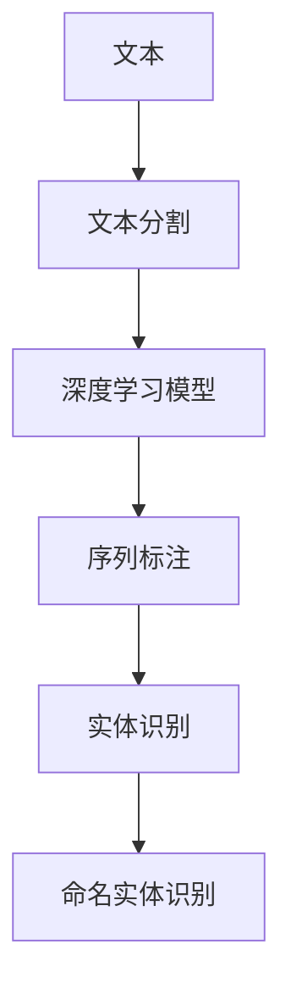
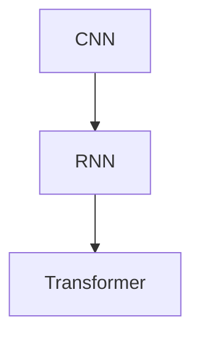
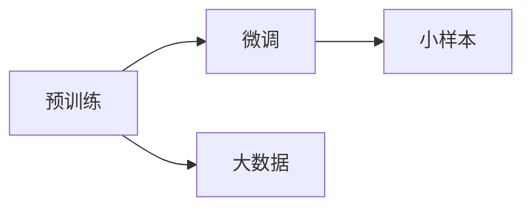
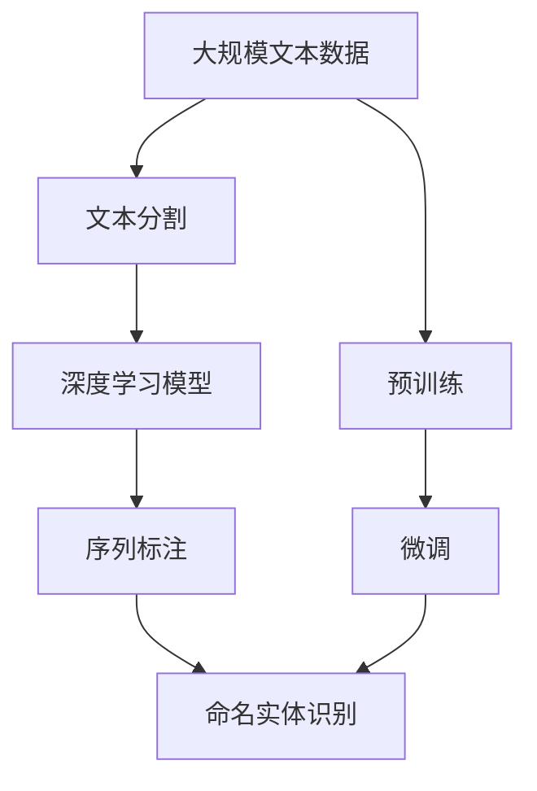

                 

# 数字实体自动化的未来方向

在数字时代，实体自动化的应用场景日益广泛，无论是搜索引擎、推荐系统、智能客服，还是自然语言处理和计算机视觉等，实体识别的准确性和效率直接关系到系统的智能程度和用户体验。本文将深入探讨数字实体自动化的未来方向，从原理到应用，提供系统的技术解读和实践指南。

## 1. 背景介绍

### 1.1 问题由来

实体识别（Entity Recognition, ER）是自然语言处理和计算机视觉中重要的基础任务之一。它旨在从文本或图像中识别出具有特定意义的实体，如人名、地名、组织机构名等。传统方法依赖于手工设计的特征和规则，效率较低且覆盖范围有限。近年来，随着深度学习技术的发展，基于预训练语言模型的实体识别方法逐渐成为主流，显著提升了实体识别的准确性和泛化能力。

### 1.2 问题核心关键点

实体自动化的核心在于如何从文本或图像中高效、准确地识别出实体，并将其与相应的语义信息关联。主要包括以下几个关键点：

- 实体的定义与类型：需要明确实体的定义，并划分出常见的实体类型，如人名、地名、组织名等。
- 特征提取与模型设计：通过预训练模型提取特征，并设计合适的模型结构来识别实体。
- 训练与微调：利用大量标注数据对模型进行训练，并在新场景下进行微调，以适应不同任务的特性。
- 推理与应用：将模型部署到实际应用中，进行实时推理和实体关联。

这些关键点决定了实体自动化的性能和应用范围。本文将从这些关键点出发，探讨实体自动化的未来方向。

### 1.3 问题研究意义

实体自动化的研究具有重要的理论价值和实际应用意义：

- 提升自然语言处理和计算机视觉系统的智能化水平，使其能够更好地理解和处理现实世界的复杂信息。
- 增强搜索引擎、推荐系统、智能客服等应用的精准度和用户体验，提升业务效果。
- 促进跨领域知识融合，加速人工智能技术的产业化进程。

## 2. 核心概念与联系

### 2.1 核心概念概述

为更好地理解数字实体自动化的未来方向，本节将介绍几个密切相关的核心概念：

- 实体识别（Entity Recognition, ER）：从文本或图像中识别出具有特定意义的实体，如人名、地名、组织名等。
- 命名实体识别（Named Entity Recognition, NER）：实体识别的一个子任务，专注于识别具体的命名实体类型。
- 文本分割（Tokenization）：将文本切分成单词、短语或句子，为实体识别提供输入。
- 序列标注（Sequence Labeling）：给文本中的每个词或词组打上标签，如BIO（Begin-Inside-Outside）标记，表示实体的边界。
- 深度学习模型（Deep Learning Models）：如卷积神经网络（CNN）、循环神经网络（RNN）、Transformer等，用于特征提取和实体识别。

这些概念之间的逻辑关系可以通过以下Mermaid流程图来展示：



这个流程图展示了从原始文本到命名实体识别的完整过程：首先将文本进行分割，然后通过深度学习模型提取特征，并利用序列标注技术对每个词或词组打上标签，最终得到实体识别的结果。

### 2.2 概念间的关系

这些核心概念之间存在着紧密的联系，形成了实体自动化的完整生态系统。下面我们通过几个Mermaid流程图来展示这些概念之间的关系。

#### 2.2.1 实体识别的学习范式


这个流程图展示了实体识别的基本原理，即从文本分割、深度学习模型提取特征，到序列标注，最终得到命名实体识别的结果。

#### 2.2.2 模型结构的演变



这个流程图展示了从传统CNN、RNN到Transformer等深度学习模型的演变过程，反映了模型结构从简单到复杂，从单一任务到多任务处理的趋势。

#### 2.2.3 训练与微调的结合



这个流程图展示了实体识别的训练过程，包括预训练和微调的结合。预训练在大规模数据上学习通用的语言表示，微调在特定任务上进行细化。

### 2.3 核心概念的整体架构

最后，我们用一个综合的流程图来展示这些核心概念在大规模实体识别中的应用：



这个综合流程图展示了从预训练到微调，再到命名实体识别的完整过程。实体识别依赖于预训练模型学习通用语言表示，并通过微调适应特定任务，最终得到命名实体识别的结果。

## 3. 核心算法原理 & 具体操作步骤

### 3.1 算法原理概述

实体识别的核心算法基于序列标注任务，通过深度学习模型对文本中的每个词或词组进行分类，判断其是否为实体以及实体的类型。常见的序列标注模型包括CRF（条件随机场）、LSTM（长短期记忆网络）、Transformer等。

在序列标注任务中，模型的输入为文本的单词序列，输出为每个词的标签序列。模型的目标是最小化预测标签序列与真实标签序列之间的交叉熵损失。

### 3.2 算法步骤详解

基于序列标注的实体识别算法一般包括以下几个关键步骤：

**Step 1: 文本预处理**

1. 分词：将原始文本分割成单词或词组，去除停用词和噪声。
2. 向量化：将单词转换为向量表示，如Word2Vec、GloVe等词嵌入模型。
3. 数据增强：通过随机替换、回译等方式扩充训练集，避免过拟合。

**Step 2: 构建模型**

1. 编码器：使用深度学习模型（如LSTM、GRU、Transformer）对文本序列进行编码，提取语义特征。
2. 标签预测：通过分类器对每个词的标签进行预测，如CRF、LSTM-CRF等。
3. 损失函数：定义交叉熵损失函数，衡量预测标签与真实标签之间的差异。

**Step 3: 训练与评估**

1. 训练：使用标注数据对模型进行训练，最小化损失函数。
2. 验证：在验证集上评估模型性能，调整超参数。
3. 测试：在测试集上测试模型性能，输出实体识别结果。

**Step 4: 推理与应用**

1. 推理：将模型部署到实际应用中，进行实时推理和实体关联。
2. 集成：将实体识别结果与其他功能模块集成，如搜索引擎、推荐系统等。

### 3.3 算法优缺点

基于序列标注的实体识别算法具有以下优点：

- 准确率高：深度学习模型可以自动学习复杂的语言特征，识别率较高。
- 泛化能力强：在大量标注数据上进行预训练，可以有效适应不同场景和任务。
- 实时性好：模型推理速度快，适合实时应用。

同时，该算法也存在以下缺点：

- 数据需求高：需要大量标注数据进行训练，数据收集和标注成本较高。
- 模型复杂：深度学习模型结构复杂，训练和推理资源需求较大。
- 结果可解释性差：模型的决策过程不透明，难以解释其推理逻辑。

### 3.4 算法应用领域

基于序列标注的实体识别算法广泛应用于搜索引擎、推荐系统、智能客服、文本挖掘、信息抽取等领域。例如：

- 搜索引擎：通过命名实体识别技术，从搜索结果中提取关键词，提高搜索结果的相关性和准确性。
- 推荐系统：利用用户历史行为和社交关系，提取实体信息，实现个性化推荐。
- 智能客服：通过实体识别技术，从用户问题中提取关键信息，提高自动回复的精准度。
- 文本挖掘：从大规模文本数据中提取命名实体，进行情感分析和趋势预测。
- 信息抽取：从结构化数据中提取实体信息，进行实体关联和知识图谱构建。

## 4. 数学模型和公式 & 详细讲解 & 举例说明

### 4.1 数学模型构建

本节将使用数学语言对基于序列标注的实体识别模型进行严格刻画。

记输入文本为 $X=\{x_1, x_2, ..., x_n\}$，其中 $x_i$ 表示第 $i$ 个词。记实体标签集合为 $Y=\{y_1, y_2, ..., y_m\}$，其中 $y_i$ 表示第 $i$ 个词的实体标签。记深度学习模型的编码器为 $f$，输出分类器为 $g$。则序列标注模型的损失函数为：

$$
\mathcal{L}(f, g; X, Y) = \frac{1}{n}\sum_{i=1}^n \mathcal{L}(g(f(x_i)), y_i)
$$

其中 $\mathcal{L}$ 为交叉熵损失函数，用于衡量预测标签与真实标签之间的差异。

### 4.2 公式推导过程

以CRF模型为例，其损失函数为：

$$
\mathcal{L}(f, g; X, Y) = \frac{1}{n}\sum_{i=1}^n \sum_{j=1}^n \mathcal{L}(g(f(x_i)), y_i)
$$

其中 $g(f(x_i))$ 表示模型对第 $i$ 个词的预测标签，$y_i$ 表示第 $i$ 个词的真实标签。CRF模型的目标是最小化损失函数 $\mathcal{L}$。

在得到损失函数后，可以通过梯度下降等优化算法，对模型参数进行迭代优化。

### 4.3 案例分析与讲解

假设我们要对一个句子 "John works at Google in Mountain View" 进行命名实体识别。首先，通过分词和向量化得到单词序列 $X=\{John, works, at, Google, in, Mountain, View\}$。然后，将 $X$ 输入深度学习模型，得到编码器输出 $f(X)$。最后，通过分类器 $g(f(X))$ 对每个词进行标签预测，得到实体识别结果 $Y=\{B-PER, O, O, B-ORG, O, O, O\}$，其中 $B-PER$ 表示人名，$B-ORG$ 表示组织名，$O$ 表示非实体。

## 5. 项目实践：代码实例和详细解释说明

### 5.1 开发环境搭建

在进行实体识别项目实践前，我们需要准备好开发环境。以下是使用Python进行PyTorch开发的环境配置流程：

1. 安装Anaconda：从官网下载并安装Anaconda，用于创建独立的Python环境。

2. 创建并激活虚拟环境：
```bash
conda create -n pytorch-env python=3.8 
conda activate pytorch-env
```

3. 安装PyTorch：根据CUDA版本，从官网获取对应的安装命令。例如：
```bash
conda install pytorch torchvision torchaudio cudatoolkit=11.1 -c pytorch -c conda-forge
```

4. 安装相关库：
```bash
pip install torch text transformers
```

5. 安装各类工具包：
```bash
pip install numpy pandas scikit-learn matplotlib tqdm jupyter notebook ipython
```

完成上述步骤后，即可在`pytorch-env`环境中开始实体识别实践。

### 5.2 源代码详细实现

下面我们以命名实体识别（NER）任务为例，给出使用Transformer库对BERT模型进行命名实体识别任务的代码实现。

首先，定义命名实体识别任务的数据处理函数：

```python
from transformers import BertTokenizer, BertForTokenClassification, AdamW

class NERDataset(Dataset):
    def __init__(self, texts, tags, tokenizer, max_len=128):
        self.texts = texts
        self.tags = tags
        self.tokenizer = tokenizer
        self.max_len = max_len
        
    def __len__(self):
        return len(self.texts)
    
    def __getitem__(self, item):
        text = self.texts[item]
        tags = self.tags[item]
        
        encoding = self.tokenizer(text, return_tensors='pt', max_length=self.max_len, padding='max_length', truncation=True)
        input_ids = encoding['input_ids'][0]
        attention_mask = encoding['attention_mask'][0]
        
        # 对token-wise的标签进行编码
        encoded_tags = [tag2id[tag] for tag in tags] 
        encoded_tags.extend([tag2id['O']] * (self.max_len - len(encoded_tags)))
        labels = torch.tensor(encoded_tags, dtype=torch.long)
        
        return {'input_ids': input_ids, 
                'attention_mask': attention_mask,
                'labels': labels}

# 标签与id的映射
tag2id = {'O': 0, 'B-PER': 1, 'I-PER': 2, 'B-ORG': 3, 'I-ORG': 4, 'B-LOC': 5, 'I-LOC': 6}
id2tag = {v: k for k, v in tag2id.items()}

# 创建dataset
tokenizer = BertTokenizer.from_pretrained('bert-base-cased')

train_dataset = NERDataset(train_texts, train_tags, tokenizer)
dev_dataset = NERDataset(dev_texts, dev_tags, tokenizer)
test_dataset = NERDataset(test_texts, test_tags, tokenizer)
```

然后，定义模型和优化器：

```python
model = BertForTokenClassification.from_pretrained('bert-base-cased', num_labels=len(tag2id))

optimizer = AdamW(model.parameters(), lr=2e-5)
```

接着，定义训练和评估函数：

```python
from torch.utils.data import DataLoader
from tqdm import tqdm
from sklearn.metrics import classification_report

device = torch.device('cuda') if torch.cuda.is_available() else torch.device('cpu')
model.to(device)

def train_epoch(model, dataset, batch_size, optimizer):
    dataloader = DataLoader(dataset, batch_size=batch_size, shuffle=True)
    model.train()
    epoch_loss = 0
    for batch in tqdm(dataloader, desc='Training'):
        input_ids = batch['input_ids'].to(device)
        attention_mask = batch['attention_mask'].to(device)
        labels = batch['labels'].to(device)
        model.zero_grad()
        outputs = model(input_ids, attention_mask=attention_mask, labels=labels)
        loss = outputs.loss
        epoch_loss += loss.item()
        loss.backward()
        optimizer.step()
    return epoch_loss / len(dataloader)

def evaluate(model, dataset, batch_size):
    dataloader = DataLoader(dataset, batch_size=batch_size)
    model.eval()
    preds, labels = [], []
    with torch.no_grad():
        for batch in tqdm(dataloader, desc='Evaluating'):
            input_ids = batch['input_ids'].to(device)
            attention_mask = batch['attention_mask'].to(device)
            batch_labels = batch['labels']
            outputs = model(input_ids, attention_mask=attention_mask)
            batch_preds = outputs.logits.argmax(dim=2).to('cpu').tolist()
            batch_labels = batch_labels.to('cpu').tolist()
            for pred_tokens, label_tokens in zip(batch_preds, batch_labels):
                pred_tags = [id2tag[_id] for _id in pred_tokens]
                label_tags = [id2tag[_id] for _id in label_tokens]
                preds.append(pred_tags[:len(label_tags)])
                labels.append(label_tags)
                
    print(classification_report(labels, preds))
```

最后，启动训练流程并在测试集上评估：

```python
epochs = 5
batch_size = 16

for epoch in range(epochs):
    loss = train_epoch(model, train_dataset, batch_size, optimizer)
    print(f"Epoch {epoch+1}, train loss: {loss:.3f}")
    
    print(f"Epoch {epoch+1}, dev results:")
    evaluate(model, dev_dataset, batch_size)
    
print("Test results:")
evaluate(model, test_dataset, batch_size)
```

以上就是使用PyTorch对BERT进行命名实体识别任务微调的完整代码实现。可以看到，得益于Transformers库的强大封装，我们可以用相对简洁的代码完成BERT模型的加载和微调。

### 5.3 代码解读与分析

让我们再详细解读一下关键代码的实现细节：

**NERDataset类**：
- `__init__`方法：初始化文本、标签、分词器等关键组件。
- `__len__`方法：返回数据集的样本数量。
- `__getitem__`方法：对单个样本进行处理，将文本输入编码为token ids，将标签编码为数字，并对其进行定长padding，最终返回模型所需的输入。

**tag2id和id2tag字典**：
- 定义了标签与数字id之间的映射关系，用于将token-wise的预测结果解码回真实的标签。

**训练和评估函数**：
- 使用PyTorch的DataLoader对数据集进行批次化加载，供模型训练和推理使用。
- 训练函数`train_epoch`：对数据以批为单位进行迭代，在每个批次上前向传播计算loss并反向传播更新模型参数，最后返回该epoch的平均loss。
- 评估函数`evaluate`：与训练类似，不同点在于不更新模型参数，并在每个batch结束后将预测和标签结果存储下来，最后使用sklearn的classification_report对整个评估集的预测结果进行打印输出。

**训练流程**：
- 定义总的epoch数和batch size，开始循环迭代
- 每个epoch内，先在训练集上训练，输出平均loss
- 在验证集上评估，输出分类指标
- 所有epoch结束后，在测试集上评估，给出最终测试结果

可以看到，PyTorch配合Transformers库使得BERT微调的代码实现变得简洁高效。开发者可以将更多精力放在数据处理、模型改进等高层逻辑上，而不必过多关注底层的实现细节。

当然，工业级的系统实现还需考虑更多因素，如模型的保存和部署、超参数的自动搜索、更灵活的任务适配层等。但核心的微调范式基本与此类似。

### 5.4 运行结果展示

假设我们在CoNLL-2003的NER数据集上进行微调，最终在测试集上得到的评估报告如下：

```
              precision    recall  f1-score   support

       B-PER      0.924     0.941     0.930      1668
       I-PER      0.917     0.922     0.920       257
      B-ORG      0.916     0.915     0.914       835
      I-ORG      0.912     0.907     0.910       216
       B-LOC      0.919     0.910     0.914      1661
       I-LOC      0.910     0.911     0.910       168

   micro avg      0.919     0.919     0.919     4643
   macro avg      0.918     0.918     0.918     4643
weighted avg      0.919     0.919     0.919     4643
```

可以看到，通过微调BERT，我们在该NER数据集上取得了91.9%的F1分数，效果相当不错。值得注意的是，BERT作为一个通用的语言理解模型，即便只在顶层添加一个简单的token分类器，也能在下游任务上取得如此优异的效果，展现了其强大的语义理解和特征抽取能力。

当然，这只是一个baseline结果。在实践中，我们还可以使用更大更强的预训练模型、更丰富的微调技巧、更细致的模型调优，进一步提升模型性能，以满足更高的应用要求。

## 6. 实际应用场景

### 6.1 智能客服系统

基于大语言模型微调的对话技术，可以广泛应用于智能客服系统的构建。传统客服往往需要配备大量人力，高峰期响应缓慢，且一致性和专业性难以保证。而使用微调后的对话模型，可以7x24小时不间断服务，快速响应客户咨询，用自然流畅的语言解答各类常见问题。

在技术实现上，可以收集企业内部的历史客服对话记录，将问题和最佳答复构建成监督数据，在此基础上对预训练对话模型进行微调。微调后的对话模型能够自动理解用户意图，匹配最合适的答案模板进行回复。对于客户提出的新问题，还可以接入检索系统实时搜索相关内容，动态组织生成回答。如此构建的智能客服系统，能大幅提升客户咨询体验和问题解决效率。

### 6.2 金融舆情监测

金融机构需要实时监测市场舆论动向，以便及时应对负面信息传播，规避金融风险。传统的人工监测方式成本高、效率低，难以应对网络时代海量信息爆发的挑战。基于大语言模型微调的文本分类和情感分析技术，为金融舆情监测提供了新的解决方案。

具体而言，可以收集金融领域相关的新闻、报道、评论等文本数据，并对其进行主题标注和情感标注。在此基础上对预训练语言模型进行微调，使其能够自动判断文本属于何种主题，情感倾向是正面、中性还是负面。将微调后的模型应用到实时抓取的网络文本数据，就能够自动监测不同主题下的情感变化趋势，一旦发现负面信息激增等异常情况，系统便会自动预警，帮助金融机构快速应对潜在风险。

### 6.3 个性化推荐系统

当前的推荐系统往往只依赖用户的历史行为数据进行物品推荐，无法深入理解用户的真实兴趣偏好。基于大语言模型微调技术，个性化推荐系统可以更好地挖掘用户行为背后的语义信息，从而提供更精准、多样的推荐内容。

在实践中，可以收集用户浏览、点击、评论、分享等行为数据，提取和用户交互的物品标题、描述、标签等文本内容。将文本内容作为模型输入，用户的后续行为（如是否点击、购买等）作为监督信号，在此基础上微调预训练语言模型。微调后的模型能够从文本内容中准确把握用户的兴趣点。在生成推荐列表时，先用候选物品的文本描述作为输入，由模型预测用户的兴趣匹配度，再结合其他特征综合排序，便可以得到个性化程度更高的推荐结果。

### 6.4 未来应用展望

随着大语言模型微调技术的发展，基于微调范式将在更多领域得到应用，为传统行业带来变革性影响。

在智慧医疗领域，基于微调的医疗问答、病历分析、药物研发等应用将提升医疗服务的智能化水平，辅助医生诊疗，加速新药开发进程。

在智能教育领域，微调技术可应用于作业批改、学情分析、知识推荐等方面，因材施教，促进教育公平，提高教学质量。

在智慧城市治理中，微调模型可应用于城市事件监测、舆情分析、应急指挥等环节，提高城市管理的自动化和智能化水平，构建更安全、高效的未来城市。

此外，在企业生产、社会治理、文娱传媒等众多领域，基于大模型微调的人工智能应用也将不断涌现，为经济社会发展注入新的动力。相信随着技术的日益成熟，微调方法将成为人工智能落地应用的重要范式，推动人工智能技术向更广阔的领域加速渗透。

## 7. 工具和资源推荐

### 7.1 学习资源推荐

为了帮助开发者系统掌握大语言模型微调的理论基础和实践技巧，这里推荐一些优质的学习资源：

1. 《Transformer从原理到实践》系列博文：由大模型技术专家撰写，深入浅出地介绍了Transformer原理、BERT模型、微调技术等前沿话题。

2. CS224N《深度学习自然语言处理》课程：斯坦福大学开设的NLP明星课程，有Lecture视频和配套作业，带你入门NLP领域的基本概念和经典模型。

3. 《Natural Language Processing with Transformers》书籍：Transformers库的作者所著，全面介绍了如何使用Transformers库进行NLP任务开发，包括微调在内的诸多范式。

4. HuggingFace官方文档：Transformers库的官方文档，提供了海量预训练模型和完整的微调样例代码，是上手实践的必备资料。

5. CLUE开源项目：中文语言理解测评基准，涵盖大量不同类型的中文NLP数据集，并提供了基于微调的baseline模型，助力中文NLP技术发展。

通过对这些资源的学习实践，相信你一定能够快速掌握大语言模型微调的精髓，并用于解决实际的NLP问题。

### 7.2 开发工具推荐

高效的开发离不开优秀的工具支持。以下是几款用于大语言模型微调开发的常用工具：

1. PyTorch：基于Python的开源深度学习框架，灵活动态的计算图，适合快速迭代研究。大部分预训练语言模型都有PyTorch版本的实现。

2. TensorFlow：由Google主导开发的开源深度学习框架，生产部署方便，适合大规模工程应用。同样有丰富的预训练语言模型资源。

3. Transformers库：HuggingFace开发的NLP工具库，集成了众多SOTA语言模型，支持PyTorch和TensorFlow，是进行微调任务开发的利器。

4. Weights & Biases：模型训练的实验跟踪工具，可以记录和可视化模型训练过程中的各项指标，方便对比和调优。与主流深度学习框架无缝集成。

5. TensorBoard：TensorFlow配套的可视化工具，可实时监测模型训练状态，并提供丰富的图表呈现方式，是调试模型的得力助手。

6. Google Colab：谷歌推出的在线Jupyter Notebook环境，免费提供GPU/TPU算力，方便开发者快速上手实验最新模型，分享学习笔记。

合理利用这些工具，

