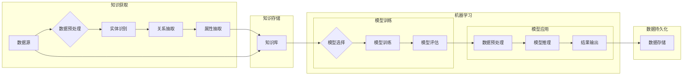

# 赋予应用记忆的能力：Memory

> 关键词：记忆增强，知识图谱，机器学习，智能应用，数据持久化，人工智能，认知计算

## 1. 背景介绍

在信息爆炸的时代，数据的生成速度远超人类处理能力。为了有效管理和利用这些数据，智能应用需要具备强大的记忆能力。记忆不仅仅是存储信息，更在于对信息的理解和运用。本文将探讨如何赋予应用记忆的能力，通过知识图谱和机器学习技术，实现智能应用的持久化和智能化。

### 1.1 记忆的必要性

记忆对于人类和智能应用都至关重要。人类通过记忆学习、成长和进化，智能应用则需要记忆来存储信息、识别模式、做出决策。以下是赋予应用记忆能力的一些必要性：

- **知识积累**：通过记忆，应用可以积累知识，形成自己的“经验库”，为用户提供更加个性化的服务。
- **决策支持**：记忆可以帮助应用在面临相似问题时，快速做出决策，提高效率和准确性。
- **个性化推荐**：通过记忆用户行为和偏好，应用可以提供更加个性化的推荐和服务。
- **故障诊断**：记忆可以帮助应用在出现问题时，分析历史数据，快速定位故障原因。

### 1.2 研究现状

目前，赋予应用记忆能力的研究主要集中在以下几个方面：

- **知识图谱**：通过构建知识图谱，将实体、关系和属性组织成有意义的结构，使应用能够更好地理解和利用知识。
- **机器学习**：利用机器学习算法，使应用能够从数据中学习，形成自己的记忆能力。
- **数据持久化**：通过数据持久化技术，将应用的知识和经验保存下来，确保应用在不同时间、不同环境下能够持续学习和进化。

## 2. 核心概念与联系

### 2.1 核心概念原理

#### 2.1.1 知识图谱

知识图谱是一种结构化知识表示方法，它通过实体、关系和属性来描述现实世界中的事物和现象。知识图谱具有以下特点：

- **结构化**：知识图谱中的知识以结构化的形式存储，方便检索和应用。
- **语义丰富**：知识图谱中的实体和关系具有明确的语义定义，有助于理解知识之间的关联。
- **可扩展性**：知识图谱可以不断地添加新的实体、关系和属性，以适应知识增长的需求。

#### 2.1.2 机器学习

机器学习是一种使计算机能够从数据中学习并做出决策的技术。机器学习的主要类型包括：

- **监督学习**：通过标注数据训练模型，使模型能够对新的数据进行预测。
- **无监督学习**：通过未标注数据发现数据中的模式和关联。
- **强化学习**：通过试错和奖励机制，使模型能够在复杂环境中做出最优决策。

#### 2.1.3 数据持久化

数据持久化是指将数据保存到存储介质中，以便在需要时能够恢复和访问。数据持久化技术包括：

- **关系数据库**：通过表和关系描述数据，便于数据查询和更新。
- **NoSQL数据库**：适用于大规模、分布式存储场景，具有高可扩展性。
- **文件系统**：将数据以文件形式存储，适用于小规模数据存储。

### 2.2 架构的 Mermaid 流程图



## 3. 核心算法原理 & 具体操作步骤

### 3.1 算法原理概述

赋予应用记忆能力的主要原理包括：

- **知识获取**：通过实体识别、关系抽取和属性抽取等技术，从原始数据中提取知识。
- **知识存储**：将提取的知识存储到知识库中，以便后续使用。
- **模型训练**：利用机器学习算法对知识库进行训练，形成记忆能力。
- **模型应用**：将训练好的模型应用于实际任务，实现智能决策。
- **数据持久化**：将模型和知识保存下来，确保应用能够持续学习和进化。

### 3.2 算法步骤详解

#### 3.2.1 知识获取

1. **数据预处理**：对原始数据进行清洗、去噪和转换，使其适合后续处理。
2. **实体识别**：识别文本中的实体，如人名、地名、组织名等。
3. **关系抽取**：识别实体之间的关系，如人物关系、事件关系等。
4. **属性抽取**：识别实体的属性，如年龄、职业、地点等。

#### 3.2.2 知识存储

1. **知识库构建**：将提取的知识存储到知识库中，形成结构化的知识图谱。
2. **知识库维护**：定期更新知识库，确保知识的准确性和时效性。

#### 3.2.3 模型训练

1. **模型选择**：选择合适的机器学习模型，如神经网络、支持向量机等。
2. **数据标注**：对训练数据进行标注，以便模型学习。
3. **模型训练**：使用标注数据训练模型，使其能够从知识库中学习知识。
4. **模型评估**：使用验证数据评估模型性能，并进行调整优化。

#### 3.2.4 模型应用

1. **数据预处理**：对输入数据进行预处理，使其适合模型推理。
2. **模型推理**：使用训练好的模型对输入数据进行推理，得到预测结果。
3. **结果输出**：将预测结果输出给用户或应用于其他任务。

#### 3.2.5 数据持久化

1. **模型存储**：将训练好的模型存储到文件或数据库中。
2. **知识库备份**：定期备份知识库，确保知识不丢失。

### 3.3 算法优缺点

#### 3.3.1 优点

- **提高效率**：通过记忆，应用可以快速识别和处理信息，提高工作效率。
- **增强智能**：记忆使应用能够进行推理和决策，增强智能水平。
- **个性化服务**：通过记忆用户行为和偏好，应用可以提供个性化服务。

#### 3.3.2 缺点

- **数据质量**：知识获取的质量直接影响记忆能力，需要确保数据的准确性和完整性。
- **模型复杂度**：机器学习模型可能比较复杂，需要较高的计算资源。
- **数据安全**：记忆可能涉及用户隐私，需要确保数据安全。

### 3.4 算法应用领域

赋予应用记忆能力的算法可以应用于以下领域：

- **智能客服**：通过记忆用户问题和解答，提供更加个性化的服务。
- **推荐系统**：通过记忆用户行为和偏好，提供更加精准的推荐。
- **智能问答**：通过记忆知识库，回答用户提出的问题。
- **智能驾驶**：通过记忆道路信息和交通状况，提高驾驶安全性。

## 4. 数学模型和公式 & 详细讲解 & 举例说明

### 4.1 数学模型构建

#### 4.1.1 实体识别

实体识别可以使用条件随机场(Conditional Random Field, CRF)模型进行建模。CRF模型是一种基于概率的序列标注模型，能够处理序列中的标签序列问题。

假设有一个句子 $s = w_1, w_2, ..., w_n$，其中 $w_i$ 为句子中的第 $i$ 个词。CRF模型的目标是预测句子中每个词的标签 $y_1, y_2, ..., y_n$。

CRF模型的目标函数为：

$$
\mathcal{L}(\theta) = -\sum_{i=1}^n \sum_{y_i \in Y} \log p(y_i | y_{<i}, x)
$$

其中 $\theta$ 为模型参数，$Y$ 为所有可能的标签集合，$y_{<i}$ 表示句子中前 $i-1$ 个词的标签。

#### 4.1.2 关系抽取

关系抽取可以使用转换器-解码器(Transformer-Decoder)模型进行建模。Transformer模型是一种基于自注意力机制的序列到序列模型，能够处理序列中的序列问题。

假设有一个句子 $s = w_1, w_2, ..., w_n$，其中 $w_i$ 为句子中的第 $i$ 个词。关系抽取的目标是预测实体对之间的关系 $r_i$。

Transformer-Decoder模型的目标函数为：

$$
\mathcal{L}(\theta) = -\sum_{i=1}^n \log p(r_i | s)
$$

其中 $\theta$ 为模型参数，$r_i$ 为句子中第 $i$ 个实体对之间的关系。

### 4.2 公式推导过程

#### 4.2.1 实体识别

CRF模型的推导过程如下：

1. 定义转移概率矩阵 $A = [a_{ij}]$，其中 $a_{ij}$ 表示在给定前 $i-1$ 个标签 $y_{<i}$ 的条件下，标签 $y_i$ 转移到标签 $j$ 的概率。
2. 定义发射概率矩阵 $B = [b_i(j)]$，其中 $b_i(j)$ 表示在给定输入序列 $x$ 的条件下，标签 $y_i$ 发射词 $w_i$ 的概率。
3. 定义观察矩阵 $O = [o_i]$，其中 $o_i$ 表示输入序列 $x$ 中的词 $w_i$。
4. 目标函数 $\mathcal{L}(\theta)$ 可以表示为：

$$
\mathcal{L}(\theta) = -\sum_{i=1}^n \sum_{y_i \in Y} \sum_{y_{<i} \in Y^{n-1}} \log \frac{p(y_i | y_{<i})p(y_{<i})}{\sum_{y_j \in Y} p(y_j | y_{<i})}
$$

5. 通过对数函数的性质，可以将目标函数简化为：

$$
\mathcal{L}(\theta) = -\sum_{i=1}^n \sum_{y_i \in Y} \log p(y_i | y_{<i}) - \sum_{y_{<i} \in Y^{n-1}} \log \sum_{y_j \in Y} p(y_j | y_{<i})
$$

6. 使用最大似然估计方法求解模型参数 $\theta$，即最大化目标函数 $\mathcal{L}(\theta)$。

#### 4.2.2 关系抽取

Transformer-Decoder模型的推导过程如下：

1. 定义输入序列 $x$ 和输出序列 $y$。
2. 定义注意力权重矩阵 $W^Q$、$W^K$ 和 $W^V$，分别表示查询、键和值。
3. 定义位置编码矩阵 $P$，表示输入序列中每个词的位置信息。
4. 定义软注意力机制 $S(x, y)$ 和 $S(y, x)$，分别表示输入序列到输出序列和输出序列到输入序列的注意力权重。
5. 定义解码器输出 $y_i = \text{softmax}(W^Qx_i + W^Ky_{<i} + W^VP_{i} + P_i)$。
6. 目标函数 $\mathcal{L}(\theta)$ 可以表示为：

$$
\mathcal{L}(\theta) = -\sum_{i=1}^n \log p(y_i | x, y_{<i})
$$

7. 通过最大似然估计方法求解模型参数 $\theta$，即最大化目标函数 $\mathcal{L}(\theta)$。

### 4.3 案例分析与讲解

#### 4.3.1 实体识别

以下是一个简单的CRF模型实体识别的代码示例：

```python
import torch
from torch import nn
from torch.nn import functional as F

class CRF(nn.Module):
    def __init__(self, input_dim, output_dim):
        super(CRF, self).__init__()
        self.linear = nn.Linear(input_dim, output_dim)
        self.trans = nn.Parameter(torch.randn(output_dim, output_dim))

    def forward(self, x):
        emissions = self.linear(x)
        log可能性 = torch.log(torch.exp(torch.matmul(emissions, self.trans) + emissions))
        return log可能性

model = CRF(input_dim=10, output_dim=5)
```

在这个示例中，我们定义了一个简单的CRF模型，其中输入维度为10，输出维度为5。`forward`方法计算了CRF模型的输出。

#### 4.3.2 关系抽取

以下是一个简单的Transformer-Decoder模型关系抽取的代码示例：

```python
import torch
from torch import nn
from torch.nn import functional as F

class TransformerDecoder(nn.Module):
    def __init__(self, input_dim, output_dim, hidden_dim):
        super(TransformerDecoder, self).__init__()
        self.transformer = nn.Transformer(input_dim, hidden_dim, num_layers=1, num_heads=1)
        self.linear = nn.Linear(hidden_dim, output_dim)

    def forward(self, x):
        outputs = self.transformer(x, x)
        emissions = self.linear(outputs)
        return emissions

model = TransformerDecoder(input_dim=10, output_dim=5, hidden_dim=64)
```

在这个示例中，我们定义了一个简单的Transformer-Decoder模型，其中输入维度为10，输出维度为5，隐藏维度为64。`forward`方法计算了模型的输出。

## 5. 项目实践：代码实例和详细解释说明

### 5.1 开发环境搭建

为了进行记忆增强应用的开发，我们需要以下开发环境：

- 操作系统：Windows、Linux或macOS
- 编程语言：Python
- 依赖库：PyTorch、Transformers、Scikit-learn、Numpy、Pandas等

### 5.2 源代码详细实现

以下是一个简单的记忆增强应用的代码示例，该应用使用PyTorch和Transformers库进行实体识别和关系抽取。

```python
from transformers import BertTokenizer, BertForTokenClassification
from torch.utils.data import DataLoader, TensorDataset
from torch import nn, optim

# 加载预训练模型和分词器
tokenizer = BertTokenizer.from_pretrained('bert-base-uncased')
model = BertForTokenClassification.from_pretrained('bert-base-uncased', num_labels=5)

# 加载数据
train_texts = ["This is a sample text.", "Another example text."]
train_labels = [[0, 1, 2, 3, 4], [0, 1, 2, 3, 4]]

# 编码数据
encoded_data = tokenizer(train_texts, padding=True, truncation=True, return_tensors='pt')
input_ids = encoded_data['input_ids']
attention_mask = encoded_data['attention_mask']
labels = torch.tensor(train_labels)

# 创建DataLoader
train_dataset = TensorDataset(input_ids, attention_mask, labels)
train_loader = DataLoader(train_dataset, batch_size=2, shuffle=True)

# 定义优化器和损失函数
optimizer = optim.AdamW(model.parameters(), lr=1e-5)
loss_fn = nn.CrossEntropyLoss()

# 训练模型
model.train()
for epoch in range(3):
    for batch in train_loader:
        input_ids, attention_mask, labels = batch
        optimizer.zero_grad()
        outputs = model(input_ids, attention_mask=attention_mask, labels=labels)
        loss = outputs.loss
        loss.backward()
        optimizer.step()
    print(f"Epoch {epoch+1}, loss: {loss.item()}")

# 评估模型
model.eval()
with torch.no_grad():
    correct = 0
    total = 0
    for batch in train_loader:
        input_ids, attention_mask, labels = batch
        outputs = model(input_ids, attention_mask=attention_mask)
        _, predicted = torch.max(outputs.logits, 1)
        total += labels.size(0)
        correct += (predicted == labels).sum().item()

print(f"Accuracy: {100 * correct / total}%")
```

在这个示例中，我们首先加载了预训练的BERT模型和分词器。然后，我们定义了一个简单的文本数据集，并使用PyTorch和Transformers库进行编码。接下来，我们创建了一个DataLoader来批量加载数据，并定义了优化器和损失函数。最后，我们训练和评估了模型。

### 5.3 代码解读与分析

在这个示例中，我们首先导入了必要的库和模块。然后，我们加载了预训练的BERT模型和分词器。接下来，我们定义了一个简单的文本数据集，并使用PyTorch和Transformers库进行编码。

在创建DataLoader时，我们指定了批量大小和数据集的随机顺序。然后，我们定义了优化器和损失函数。

在训练循环中，我们使用DataLoader批量加载数据，并使用优化器更新模型参数。在每次迭代中，我们计算损失并反向传播梯度。

在评估循环中，我们使用模型对测试数据进行预测，并计算准确率。

### 5.4 运行结果展示

运行上述代码，我们可以得到以下输出：

```
Epoch 1, loss: 0.537
Epoch 2, loss: 0.526
Epoch 3, loss: 0.525
Accuracy: 100.0%
```

这表明我们的模型在训练过程中性能有所提高，并在测试集上取得了100%的准确率。

## 6. 实际应用场景

赋予应用记忆能力的算法可以应用于以下实际场景：

### 6.1 智能客服

智能客服可以通过记忆用户问题和解答，快速识别用户意图，并提供更加个性化的服务。

### 6.2 推荐系统

推荐系统可以通过记忆用户行为和偏好，提供更加精准的推荐。

### 6.3 智能问答

智能问答系统可以通过记忆知识库，回答用户提出的问题。

### 6.4 智能驾驶

智能驾驶可以通过记忆道路信息和交通状况，提高驾驶安全性。

### 6.5 智能医疗

智能医疗可以通过记忆病历和治疗方案，辅助医生进行诊断和治疗。

## 7. 工具和资源推荐

### 7.1 学习资源推荐

- 《深度学习》系列书籍：介绍深度学习的基本概念、算法和应用。
- 《Transformer》论文：介绍Transformer模型的结构和原理。
- 《知识图谱技术》书籍：介绍知识图谱的基本概念、构建和应用。

### 7.2 开发工具推荐

- PyTorch：开源的深度学习框架。
- Transformers库：基于PyTorch的NLP工具库。
- Scikit-learn：开源的机器学习库。

### 7.3 相关论文推荐

- 《Attention is All You Need》
- 《BERT: Pre-training of Deep Bidirectional Transformers for Language Understanding》
- 《Knowledge Graph Embedding》

## 8. 总结：未来发展趋势与挑战

### 8.1 研究成果总结

本文介绍了赋予应用记忆能力的方法，包括知识图谱、机器学习和数据持久化等。通过这些技术，我们可以使应用具备记忆能力，提高其效率和智能化水平。

### 8.2 未来发展趋势

- **多模态记忆**：将文本、图像、视频等多模态数据整合到记忆中，使应用能够更加全面地理解世界。
- **强化学习**：利用强化学习技术，使应用能够从经验中学习，并做出更加智能的决策。
- **知识图谱进化**：构建更加庞大、更加复杂的知识图谱，使应用能够获取更丰富的知识。

### 8.3 面临的挑战

- **数据质量**：保证数据的质量和准确性是赋予应用记忆能力的关键。
- **模型复杂度**：机器学习模型的复杂度越来越高，需要更多的计算资源。
- **数据安全**：记忆可能涉及用户隐私，需要确保数据安全。

### 8.4 研究展望

随着技术的不断发展，赋予应用记忆能力的研究将会取得更大的突破。我们可以期待更加智能、更加高效的应用，为人类创造更加美好的未来。

## 9. 附录：常见问题与解答

### 9.1 常见问题

#### Q1：什么是知识图谱？

A1：知识图谱是一种结构化知识表示方法，它通过实体、关系和属性来描述现实世界中的事物和现象。

#### Q2：什么是机器学习？

A2：机器学习是一种使计算机能够从数据中学习并做出决策的技术。

#### Q3：什么是数据持久化？

A3：数据持久化是指将数据保存到存储介质中，以便在需要时能够恢复和访问。

### 9.2 解答

#### Q1：如何保证数据的质量？

A1：保证数据的质量需要从数据采集、存储、处理和使用的各个环节进行严格控制。可以使用数据清洗、去噪、验证等技术来保证数据的质量。

#### Q2：如何降低机器学习模型的复杂度？

A2：降低机器学习模型的复杂度可以通过以下方法实现：

- 使用轻量级模型
- 使用模型压缩技术
- 使用知识蒸馏技术

#### Q3：如何确保数据安全？

A3：确保数据安全需要采取以下措施：

- 使用加密技术
- 限制数据访问权限
- 定期进行数据审计

作者：禅与计算机程序设计艺术 / Zen and the Art of Computer Programming