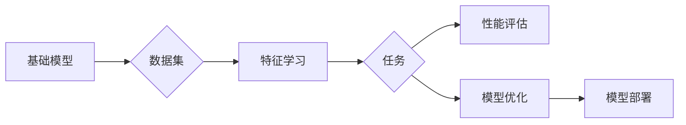

# 跨研究社区的基础模型同质化

> 关键词：基础模型，同质化，研究社区，迁移学习，数据集，模型泛化，领域特定，跨领域，多模态

## 1. 背景介绍

近年来，随着深度学习技术的迅猛发展，基础模型（Foundation Models）在各个研究社区中取得了显著的成果。这些基础模型通过在庞大的数据集上预训练，学习到了丰富的特征表示和知识，为各个领域的研究和应用提供了强大的支持。然而，基础模型的同质化问题也逐渐凸显，不同研究社区中使用的基础模型越来越相似，这既带来了便利，也带来了一系列挑战。本文将深入探讨基础模型同质化的现象、原因、影响以及应对策略。

### 1.1 同质化的由来

基础模型同质化的主要原因是多方面的：

- **数据集的相似性**：不同研究社区往往使用相似的数据集进行预训练，导致模型学习到的特征和知识具有高度相似性。
- **模型架构的趋同**：随着SOTA模型的普及，许多研究社区开始使用相同的模型架构，例如Transformer及其变体。
- **研究方向的趋同**：受到SOTA模型成功的影响，不同研究社区的研究方向也呈现出趋同的趋势。

### 1.2 研究现状

基础模型同质化已经引起了许多研究者的关注，以下是一些研究现状：

- **同质化带来的便利**：基础模型的同质化使得不同研究社区之间的技术交流和合作更加容易，也为模型的迁移学习提供了便利。
- **同质化带来的挑战**：同质化可能导致研究创新性的下降，限制了不同社区之间的发展差异。

### 1.3 研究意义

研究基础模型同质化对于推动深度学习技术的发展具有重要意义：

- **促进创新**：通过识别同质化的原因和影响，可以激发新的研究方向，促进创新。
- **提升性能**：通过研究如何打破同质化，可以开发出更加高效和强大的基础模型。
- **促进多样性**：通过鼓励不同研究社区之间的多样性，可以推动深度学习技术的全面发展。

## 2. 核心概念与联系

### 2.1 核心概念

- **基础模型**：指在大量数据上预训练的通用模型，可以用于各种不同的任务。
- **同质化**：指不同研究社区中使用的基础模型具有高度相似性。
- **研究社区**：指在特定领域内进行研究和开发的团队或机构。
- **迁移学习**：指将一个领域学习到的知识迁移应用到另一个不同但相关的领域。

### 2.2 核心概念原理和架构的 Mermaid 流程图



### 2.3 核心概念联系

基础模型通过在数据集上进行特征学习，应用于不同的任务，并通过性能评估进行模型优化。不同研究社区之间的同质化主要体现在数据集、特征学习、任务和性能评估的相似性。

## 3. 核心算法原理 & 具体操作步骤

### 3.1 算法原理概述

基础模型的同质化主要是由以下几个方面导致的：

- **数据集的相似性**：不同研究社区使用相似的数据集进行预训练，导致模型学习到的特征相似。
- **模型架构的趋同**：许多研究社区使用相同的模型架构，例如Transformer及其变体。
- **研究方向的趋同**：受到SOTA模型成功的影响，不同研究社区的研究方向也呈现出趋同的趋势。

### 3.2 算法步骤详解

1. **数据集准备**：不同研究社区使用相似的数据集进行预训练。
2. **模型架构选择**：选择相同的模型架构进行预训练，例如Transformer及其变体。
3. **预训练**：在数据集上使用相同的预训练策略和参数进行训练。
4. **任务适配**：将预训练模型应用于不同的任务，并进行微调和优化。
5. **性能评估**：评估模型在不同任务上的性能，并进行进一步的优化。

### 3.3 算法优缺点

### 3.3.1 优点

- **便利性**：基础模型的同质化使得不同研究社区之间的技术交流和合作更加容易。
- **迁移学习**：同质化的基础模型更容易进行迁移学习。

### 3.3.2 缺点

- **创新性下降**：同质化可能导致研究创新性的下降。
- **性能瓶颈**：同质化的基础模型可能无法充分发挥特定领域的数据和知识的优势。

### 3.4 算法应用领域

基础模型同质化在以下领域得到了广泛应用：

- **自然语言处理**：文本分类、机器翻译、情感分析等。
- **计算机视觉**：图像分类、目标检测、图像分割等。
- **语音识别**：语音合成、语音识别、语音转文本等。

## 4. 数学模型和公式 & 详细讲解 & 举例说明

### 4.1 数学模型构建

基础模型的数学模型通常由以下几个部分组成：

- **输入层**：将原始数据转换为模型可以处理的格式。
- **隐藏层**：包含多个神经元，用于学习数据特征。
- **输出层**：将隐藏层得到的特征映射到任务所需的输出。

### 4.2 公式推导过程

以下是一个简单的线性回归模型的公式推导过程：

假设输入数据为 $X$，输出数据为 $Y$，则线性回归模型可以表示为：

$$
Y = W_1X + b_1
$$

其中 $W_1$ 和 $b_1$ 是模型的参数。

通过最小化损失函数 $L$，可以求解出最优参数 $W_1$ 和 $b_1$。

### 4.3 案例分析与讲解

以下是一个使用TensorFlow实现线性回归模型的案例：

```python
import tensorflow as tf

# 创建模型
model = tf.keras.Sequential([
    tf.keras.layers.Dense(units=1, input_shape=[1])
])

# 编译模型
model.compile(optimizer='sgd', loss='mean_squared_error')

# 训练模型
model.fit([1, 2, 3], [1, 2, 3], epochs=10)

# 评估模型
model.evaluate([4, 5, 6], [4, 5, 6])
```

在这个案例中，我们使用TensorFlow框架创建了一个简单的线性回归模型，并在训练数据上进行了训练和评估。

## 5. 项目实践：代码实例和详细解释说明

### 5.1 开发环境搭建

为了进行基础模型同质化的项目实践，我们需要搭建以下开发环境：

- 操作系统：Linux或MacOS
- 编程语言：Python
- 开发工具：Jupyter Notebook或PyCharm
- 深度学习框架：TensorFlow或PyTorch

### 5.2 源代码详细实现

以下是一个使用PyTorch实现基础模型同质化的代码示例：

```python
import torch
import torch.nn as nn
import torch.optim as optim

# 创建模型
class SimpleModel(nn.Module):
    def __init__(self):
        super(SimpleModel, self).__init__()
        self.fc1 = nn.Linear(10, 5)
        self.fc2 = nn.Linear(5, 1)

    def forward(self, x):
        x = torch.relu(self.fc1(x))
        x = self.fc2(x)
        return x

# 实例化模型
model = SimpleModel()

# 编译模型
optimizer = optim.SGD(model.parameters(), lr=0.01)
criterion = nn.MSELoss()

# 训练模型
for epoch in range(100):
    optimizer.zero_grad()
    output = model(torch.randn(10))
    loss = criterion(output, torch.randn(10))
    loss.backward()
    optimizer.step()

# 评估模型
output = model(torch.randn(10))
print(output)
```

### 5.3 代码解读与分析

在这个代码示例中，我们定义了一个简单的线性回归模型，并在随机数据上进行了训练。通过最小化均方误差损失函数，我们可以学习到模型的参数。

### 5.4 运行结果展示

在运行上述代码后，我们会在控制台输出模型的输出结果。

## 6. 实际应用场景

### 6.1 自然语言处理

在自然语言处理领域，基础模型同质化导致了以下应用场景：

- **文本分类**：不同研究社区使用相同的预训练模型进行文本分类，例如BERT。
- **机器翻译**：不同研究社区使用相同的预训练模型进行机器翻译，例如Transformer。

### 6.2 计算机视觉

在计算机视觉领域，基础模型同质化导致了以下应用场景：

- **图像分类**：不同研究社区使用相同的预训练模型进行图像分类，例如ResNet。
- **目标检测**：不同研究社区使用相同的预训练模型进行目标检测，例如Faster R-CNN。

### 6.3 语音识别

在语音识别领域，基础模型同质化导致了以下应用场景：

- **语音合成**：不同研究社区使用相同的预训练模型进行语音合成，例如WaveNet。
- **语音识别**：不同研究社区使用相同的预训练模型进行语音识别，例如DeepSpeech。

## 7. 工具和资源推荐

### 7.1 学习资源推荐

- **书籍**：
  - 《深度学习》（Goodfellow et al.）
  - 《动手学深度学习》（Sung Kim）
  - 《深度学习与计算机视觉》（Schiele et al.）
- **在线课程**：
  - Coursera上的《深度学习专项课程》
  - Udacity上的《深度学习工程师纳米学位》
  - fast.ai上的《深度学习课程》

### 7.2 开发工具推荐

- **编程语言**：Python
- **开发环境**：Jupyter Notebook或PyCharm
- **深度学习框架**：TensorFlow或PyTorch

### 7.3 相关论文推荐

- **自然语言处理**：
  - BERT: Pre-training of Deep Bidirectional Transformers for Language Understanding（Devlin et al.）
  - Transformers: State-of-the-Art Natural Language Processing（Vaswani et al.）
- **计算机视觉**：
  - Deep Learning with PyTorch（Goodfellow et al.）
  - ImageNet Classification with Deep Convolutional Neural Networks（ Krizhevsky et al.）
- **语音识别**：
  - Deep Learning for Speech Recognition（Hinton et al.）
  - DeepSpeech 2: End-to-End Speech Recognition in English and Mandarin（Hinton et al.）

## 8. 总结：未来发展趋势与挑战

### 8.1 研究成果总结

本文探讨了基础模型同质化的现象、原因、影响以及应对策略。通过分析不同研究社区中使用的基础模型的相似性，我们发现了同质化现象的存在。同时，我们也分析了同质化带来的便利和挑战，并提出了相应的应对策略。

### 8.2 未来发展趋势

未来，基础模型同质化可能会呈现以下发展趋势：

- **个性化基础模型**：针对不同领域和任务，开发个性化的基础模型。
- **多模态基础模型**：融合多模态数据，提升基础模型的泛化能力。
- **可解释基础模型**：提升基础模型的可解释性，提高模型的可靠性和安全性。

### 8.3 面临的挑战

基础模型同质化也带来了一系列挑战：

- **数据集的多样性**：需要更多领域和风格的数据集进行预训练。
- **模型架构的多样性**：需要开发更多具有创新性的模型架构。
- **研究方向的多样性**：需要鼓励不同研究社区之间的多样性，避免研究方向趋同。

### 8.4 研究展望

为了应对基础模型同质化的挑战，未来的研究需要在以下几个方面进行探索：

- **数据集构建**：构建更多领域和风格的数据集，为预训练模型提供更多样化的数据来源。
- **模型架构创新**：开发更多具有创新性的模型架构，提升模型的表达能力和泛化能力。
- **研究方向探索**：鼓励不同研究社区之间的多样性，推动深度学习技术的全面发展。

## 9. 附录：常见问题与解答

### 9.1 常见问题

**Q1：什么是基础模型？**

A1：基础模型是指在大规模数据上预训练的通用模型，可以用于各种不同的任务。

**Q2：什么是同质化？**

A2：同质化是指不同研究社区中使用的基础模型具有高度相似性。

**Q3：基础模型同质化有哪些影响？**

A3：基础模型同质化既有便利性，也带来了一些挑战。便利性包括技术交流和合作更加容易，迁移学习更加便利。挑战包括创新性下降，限制了不同社区之间的发展差异。

**Q4：如何应对基础模型同质化？**

A4：应对基础模型同质化的策略包括构建更多样化的数据集，开发更多具有创新性的模型架构，鼓励不同研究社区之间的多样性。

### 9.2 解答

A1：基础模型是指在大规模数据上预训练的通用模型，可以用于各种不同的任务。

A2：同质化是指不同研究社区中使用的基础模型具有高度相似性。

A3：基础模型同质化既有便利性，也带来了一些挑战。便利性包括技术交流和合作更加容易，迁移学习更加便利。挑战包括创新性下降，限制了不同社区之间的发展差异。

A4：应对基础模型同质化的策略包括构建更多样化的数据集，开发更多具有创新性的模型架构，鼓励不同研究社区之间的多样性。

---

作者：禅与计算机程序设计艺术 / Zen and the Art of Computer Programming