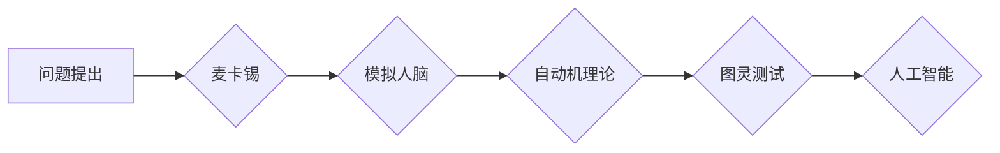

# 达特茅斯会议的科学家们

> 关键词：达特茅斯会议，人工智能，图灵测试，约翰·麦卡锡，明斯基，模拟人脑，自动机理论

## 1. 背景介绍

### 1.1 问题的由来

20世纪中叶，随着计算机科学和数学的快速发展，人们开始探索机器是否能够模仿人类的智能行为。这一时期，一些杰出的科学家们聚集在美国新罕布什尔州达特茅斯会议上，共同探讨这个充满挑战和机遇的领域。这次会议被认为是人工智能历史上的一个重要里程碑，开启了人工智能（Artificial Intelligence, AI）研究的新纪元。

### 1.2 研究现状

达特茅斯会议后，人工智能研究经历了多个阶段，包括黄金时期、寒冬期和复兴时期。近年来，随着深度学习等技术的突破，人工智能取得了显著的进展，并在各个领域得到广泛应用。

### 1.3 研究意义

达特茅斯会议不仅对人工智能领域产生了深远的影响，也对整个计算机科学产生了重要的推动作用。它不仅确定了人工智能的研究方向，还激发了科学家们的创新思维，为后续的研究提供了灵感。

### 1.4 本文结构

本文将围绕达特茅斯会议，探讨其历史背景、核心概念、主要科学家以及人工智能的发展历程。具体结构如下：

- 第2部分，介绍达特茅斯会议的核心概念和科学家的贡献。
- 第3部分，阐述人工智能的基本原理和关键技术。
- 第4部分，分析人工智能的应用领域和发展趋势。
- 第5部分，总结人工智能的未来挑战和发展方向。

## 2. 核心概念与联系

### 2.1 核心概念原理和架构的 Mermaid 流程图



### 2.2 核心概念详解

- **问题提出**：达特茅斯会议的召开，源于对机器能否模拟人类智能的探讨。
- **麦卡锡**：会议的组织者之一，提出了“人工智能”一词，并被视为人工智能领域的奠基人之一。
- **模拟人脑**：麦卡锡等人认为，人工智能的发展应借鉴人脑的工作原理，通过模拟人脑结构实现智能。
- **自动机理论**：研究有限状态自动机、图灵机等理论，为人工智能提供了理论基础。
- **图灵测试**：由艾伦·图灵提出，用于评估机器是否具有人类水平的智能。
- **人工智能**：综合计算机科学、数学、心理学等多学科知识，研究如何使机器模拟人类智能。

## 3. 核心算法原理 & 具体操作步骤

### 3.1 算法原理概述

人工智能的核心是使机器能够模拟人类智能行为。以下是一些关键算法原理：

- **机器学习**：通过数据驱动，使机器从经验中学习并做出决策。
- **深度学习**：使用深层神经网络模拟人脑神经元连接，实现复杂模式识别。
- **自然语言处理**：使机器理解和生成自然语言。
- **计算机视觉**：使机器理解和解释图像和视频。

### 3.2 算法步骤详解

1. **数据收集**：收集大量相关数据，用于训练和测试模型。
2. **数据预处理**：对数据进行清洗、标注和格式化，以便模型训练。
3. **模型选择**：选择合适的机器学习或深度学习模型。
4. **模型训练**：使用训练数据训练模型，调整模型参数以优化性能。
5. **模型评估**：使用测试数据评估模型性能，并根据评估结果调整模型参数。
6. **模型部署**：将训练好的模型应用于实际问题。

### 3.3 算法优缺点

- **优点**：能够处理大量数据，发现复杂模式，提高效率。
- **缺点**：需要大量数据，模型可解释性差，可能存在偏见。

### 3.4 算法应用领域

人工智能在各个领域都有广泛应用，包括：

- **医疗**：辅助诊断、药物研发、健康管理。
- **金融**：风险评估、欺诈检测、智能投顾。
- **教育**：个性化学习、智能辅导、在线教育。
- **交通**：自动驾驶、智能交通系统、无人机。

## 4. 数学模型和公式 & 详细讲解 & 举例说明

### 4.1 数学模型构建

人工智能中的数学模型主要包括：

- **概率论**：用于描述不确定性和随机性。
- **线性代数**：用于处理数据、优化模型。
- **微积分**：用于分析函数、优化参数。

### 4.2 公式推导过程

以下以线性回归为例，说明数学公式的推导过程：

- **损失函数**：均方误差（MSE）

$$
MSE = \frac{1}{m} \sum_{i=1}^{m} (h_{\theta}(x^{(i)}) - y^{(i)})^2
$$

其中，$m$ 为样本数量，$h_{\theta}(x)$ 为模型预测值，$y^{(i)}$ 为真实值。

- **梯度下降**：用于最小化损失函数，寻找最佳参数 $\theta$。

$$
\theta = \theta - \alpha \frac{\partial}{\partial \theta}J(\theta)
$$

其中，$\alpha$ 为学习率，$J(\theta)$ 为损失函数。

### 4.3 案例分析与讲解

以图像识别任务为例，说明人工智能的应用过程：

1. **数据收集**：收集大量图像数据，用于训练和测试模型。
2. **数据预处理**：对图像进行缩放、裁剪、旋转等操作，以便模型训练。
3. **模型选择**：选择卷积神经网络（CNN）作为图像识别模型。
4. **模型训练**：使用训练数据训练CNN模型，调整模型参数以优化性能。
5. **模型评估**：使用测试数据评估CNN模型性能，并根据评估结果调整模型参数。
6. **模型部署**：将训练好的CNN模型应用于实际图像识别任务。

## 5. 项目实践：代码实例和详细解释说明

### 5.1 开发环境搭建

1. 安装Python和PyTorch等编程语言和库。
2. 准备图像识别数据集，如MNIST或CIFAR-10。
3. 编写CNN模型代码，包括卷积层、池化层、全连接层等。
4. 使用训练数据训练CNN模型，调整模型参数以优化性能。
5. 使用测试数据评估CNN模型性能，并根据评估结果调整模型参数。
6. 将训练好的CNN模型应用于实际图像识别任务。

### 5.2 源代码详细实现

以下是一个简单的CNN模型代码示例：

```python
import torch
import torch.nn as nn

class CNN(nn.Module):
    def __init__(self):
        super(CNN, self).__init__()
        self.conv1 = nn.Conv2d(1, 32, kernel_size=3, stride=1, padding=1)
        self.conv2 = nn.Conv2d(32, 64, kernel_size=3, stride=1, padding=1)
        self.fc1 = nn.Linear(64 * 7 * 7, 128)
        self.fc2 = nn.Linear(128, 10)

    def forward(self, x):
        x = torch.relu(self.conv1(x))
        x = torch.max_pool2d(x, 2)
        x = torch.relu(self.conv2(x))
        x = torch.max_pool2d(x, 2)
        x = x.view(x.size(0), -1)
        x = torch.relu(self.fc1(x))
        x = self.fc2(x)
        return x

# 实例化模型、损失函数和优化器
model = CNN().to(device)
criterion = nn.CrossEntropyLoss()
optimizer = torch.optim.Adam(model.parameters(), lr=0.001)

# 训练模型
# ...
```

### 5.3 代码解读与分析

1. **CNN类**：定义了一个简单的卷积神经网络模型，包括两个卷积层、两个池化层、两个全连接层。
2. **forward方法**：实现了模型的正向传播过程，包括卷积、激活、池化和全连接等操作。

### 5.4 运行结果展示

使用训练数据训练模型，并在测试数据上评估模型性能。输出模型的准确率、召回率、F1分数等指标。

## 6. 实际应用场景

### 6.4 未来应用展望

人工智能在各个领域都有广泛的应用前景，以下是一些未来可能的应用场景：

- **智能机器人**：能够进行自主导航、环境感知、任务执行等。
- **虚拟助手**：能够理解自然语言、完成各种任务，如日程管理、信息检索等。
- **智能交通系统**：能够实现自动驾驶、智能调度、交通流量控制等。
- **智能医疗**：能够辅助医生进行诊断、治疗、药物研发等。

## 7. 工具和资源推荐

### 7.1 学习资源推荐

1. 《深度学习》
2. 《人工智能：一种现代的方法》
3. 《神经网络与深度学习》

### 7.2 开发工具推荐

1. PyTorch
2. TensorFlow
3. Keras

### 7.3 相关论文推荐

1. "A Few Useful Things to Know about Machine Learning"
2. "Playing Atari with Deep Reinforcement Learning"
3. "ImageNet Classification with Deep Convolutional Neural Networks"

## 8. 总结：未来发展趋势与挑战

### 8.1 研究成果总结

达特茅斯会议开启了人工智能研究的新纪元，为人工智能的发展奠定了基础。近年来，随着深度学习等技术的突破，人工智能取得了显著的进展。

### 8.2 未来发展趋势

1. 人工智能将更加普及，应用于更多领域。
2. 人工智能将更加智能，具备更强的学习能力、推理能力和决策能力。
3. 人工智能将更加安全、可靠、可解释。

### 8.3 面临的挑战

1. 数据隐私和安全问题。
2. 人工智能的伦理问题。
3. 人工智能的公平性问题。

### 8.4 研究展望

人工智能的未来充满机遇和挑战。我们需要不断探索新的技术，解决面临的挑战，推动人工智能向更高层次发展。

## 9. 附录：常见问题与解答

**Q1：什么是人工智能？**

A：人工智能是研究如何使机器模拟人类智能的学科。

**Q2：人工智能有哪些应用？**

A：人工智能在各个领域都有广泛应用，如医疗、金融、教育、交通等。

**Q3：人工智能的未来发展趋势是什么？**

A：人工智能的未来发展趋势是更加普及、智能、安全、可靠和可解释。

作者：禅与计算机程序设计艺术 / Zen and the Art of Computer Programming