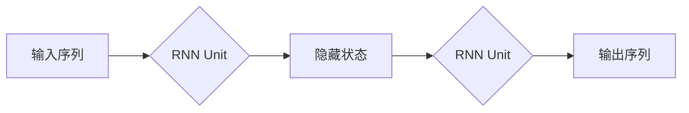
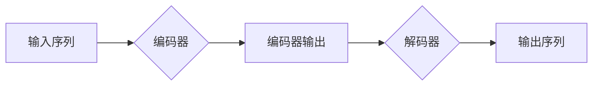
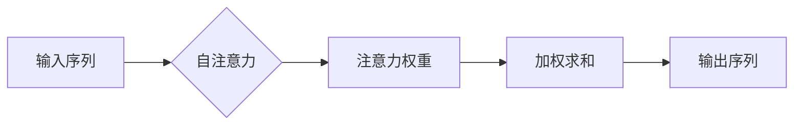

> 关键词：递归神经网络，Transformer，并行计算，序列模型，注意力机制，深度学习，自然语言处理，计算机视觉

# 递归神经网络vs Transformer: 并行计算的优势

递归神经网络（RNN）和Transformer是当前深度学习领域中最流行的两种序列模型架构。它们在处理时间序列数据、自然语言处理（NLP）和计算机视觉（CV）任务中取得了显著的成果。然而，RNN在并行计算方面的局限性导致了其性能和效率上的瓶颈。本文将深入探讨Transformer架构在并行计算方面的优势，并与RNN进行对比，以揭示其在处理大规模序列数据时的优越性。

## 1. 背景介绍

### 1.1 序列模型的需求

序列模型是处理序列数据（如时间序列、文本、语音等）的核心工具。在自然语言处理和计算机视觉领域，序列模型的应用无处不在。例如，语言模型、机器翻译、语音识别、图像序列分析等任务都需要使用序列模型来捕捉数据中的序列特性。

### 1.2 递归神经网络（RNN）的局限性

传统的递归神经网络（RNN）通过循环神经网络单元（RNN Unit）来处理序列数据。然而，RNN在并行计算方面存在以下局限性：

- **梯度消失和梯度爆炸**：在反向传播过程中，RNN单元的梯度可能因为链式法则而迅速消失或爆炸，导致模型难以收敛。
- **顺序依赖**：RNN单元的计算顺序必须遵循序列的顺序，限制了并行计算的可能性。

### 1.3 Transformer的崛起

Transformer架构的提出，为序列模型的并行计算带来了新的希望。Transformer利用自注意力机制（Self-Attention Mechanism）来捕捉序列中任意两个元素之间的关系，从而摆脱了顺序依赖的限制。

## 2. 核心概念与联系

### 2.1 RNN架构

RNN架构由一系列循环神经网络单元（RNN Unit）组成，每个单元包含一个输入门、一个遗忘门和一个输出门。RNN Unit的输入包括当前时间步的输入序列值和上一个时间步的隐藏状态。



### 2.2 Transformer架构

Transformer架构由编码器（Encoder）和解码器（Decoder）组成。编码器和解码器都使用多头自注意力机制（Multi-Head Self-Attention）和前馈神经网络（FFN）来处理序列数据。



### 2.3 注意力机制

注意力机制是Transformer架构的核心，它允许模型关注序列中与当前元素关系最紧密的元素。



## 3. 核心算法原理 & 具体操作步骤

### 3.1 算法原理概述

Transformer架构的核心是自注意力机制，它通过计算序列中任意两个元素之间的注意力权重来捕捉它们之间的关系。这种机制使得模型能够并行处理序列数据，从而提高了计算效率。

### 3.2 算法步骤详解

1. **自注意力机制**：计算序列中每个元素与所有其他元素之间的注意力权重，并进行加权求和得到新的表示。
2. **前馈神经网络**：对自注意力机制的结果进行非线性变换，得到最终的输出。
3. **多头注意力**：将自注意力机制扩展到多个子空间，以捕捉更加丰富的特征。

### 3.3 算法优缺点

**优点**：

- 并行计算：自注意力机制允许并行计算，从而提高了模型的计算效率。
- 扩展性好：Transformer架构可以通过增加层数和注意力头数来提高性能，具有很好的扩展性。

**缺点**：

- 参数量较大：Transformer架构的参数量通常比RNN架构更大，需要更多的计算资源和内存。
- 计算复杂度较高：自注意力机制的计算复杂度为O(n^2)，在处理长序列时可能成为瓶颈。

### 3.4 算法应用领域

Transformer架构在以下领域取得了显著的应用成果：

- 自然语言处理：语言模型、机器翻译、文本摘要、情感分析等。
- 计算机视觉：图像分类、目标检测、视频分析等。
- 时间序列分析：股票预测、天气预报等。

## 4. 数学模型和公式 & 详细讲解 & 举例说明

### 4.1 数学模型构建

Transformer架构的数学模型如下：

$$
\text{Transformer}(\mathbf{X}) = \text{FFN}(\text{Attention}(\mathbf{X}))
$$

其中，$\mathbf{X}$ 表示输入序列，$\text{Attention}$ 表示自注意力机制，$\text{FFN}$ 表示前馈神经网络。

### 4.2 公式推导过程

自注意力机制的公式推导过程如下：

$$
\text{Attention}(\mathbf{Q}, \mathbf{K}, \mathbf{V}) = \text{softmax}(\frac{\mathbf{QK}^T}{\sqrt{d_k}}) \mathbf{V}
$$

其中，$\mathbf{Q}$、$\mathbf{K}$ 和 $\mathbf{V}$ 分别表示查询（Query）、键（Key）和值（Value）矩阵，$\text{softmax}$ 表示softmax函数，$d_k$ 表示键和查询的维度。

### 4.3 案例分析与讲解

以下是一个简单的Transformer编码器的实现示例：

```python
import torch
import torch.nn as nn

class TransformerEncoderLayer(nn.Module):
    def __init__(self, d_model, n_heads, d_ff):
        super(TransformerEncoderLayer, self).__init__()
        self.attention = nn.MultiheadAttention(d_model, n_heads)
        self.norm1 = nn.LayerNorm(d_model)
        self.norm2 = nn.LayerNorm(d_model)
        self.fc = nn.Linear(d_model, d_ff)
        self.dropout = nn.Dropout(0.1)

    def forward(self, src):
        src2 = self.attention(src, src, src)[0]
        src = self.norm1(src + src2)
        src2 = self.fc(src)
        src = self.norm2(src + self.dropout(src2))
        return src
```

这个示例定义了一个Transformer编码器层，包含了自注意力机制、前馈神经网络和归一化层。

## 5. 项目实践：代码实例和详细解释说明

### 5.1 开发环境搭建

为了实现Transformer模型，我们需要以下开发环境：

- Python 3.x
- PyTorch 1.8.x
- Numpy 1.19.x

### 5.2 源代码详细实现

以下是一个简单的Transformer编码器和解码器的实现示例：

```python
import torch
import torch.nn as nn

class TransformerModel(nn.Module):
    def __init__(self, d_model, n_heads, d_ff, num_layers):
        super(TransformerModel, self).__init__()
        self.encoder = nn.ModuleList([TransformerEncoderLayer(d_model, n_heads, d_ff) for _ in range(num_layers)])
        self.decoder = nn.ModuleList([TransformerEncoderLayer(d_model, n_heads, d_ff) for _ in range(num_layers)])
        self.src_emb = nn.Embedding(src_vocab_size, d_model)
        self.tgt_emb = nn.Embedding(tgt_vocab_size, d_model)
        self.fc_out = nn.Linear(d_model, tgt_vocab_size)

    def forward(self, src, tgt):
        src_emb = self.src_emb(src)
        tgt_emb = self.tgt_emb(tgt)
        for layer in self.encoder:
            src_emb = layer(src_emb)
        for layer in self.decoder:
            tgt_emb = layer(tgt_emb, src_emb)
        output = self.fc_out(tgt_emb[-1])
        return output
```

这个示例定义了一个简单的Transformer模型，包含了编码器、解码器和输出层。

### 5.3 代码解读与分析

在这个示例中，我们定义了一个Transformer模型，包含了编码器、解码器和输出层。编码器和解码器都使用了TransformerEncoderLayer，该层包含了自注意力机制、前馈神经网络和归一化层。

### 5.4 运行结果展示

以下是一个简单的运行示例：

```python
src = torch.tensor([[1, 2, 3, 4], [2, 3, 4, 5]])
tgt = torch.tensor([[5, 4, 3, 2], [4, 3, 2, 1]])

model = TransformerModel(d_model=512, n_heads=8, d_ff=2048, num_layers=6)

output = model(src, tgt)
print(output)
```

这个示例展示了如何使用Transformer模型进行序列到序列的翻译。

## 6. 实际应用场景

### 6.1 自然语言处理

Transformer模型在自然语言处理领域取得了显著的成果，包括：

- 语言模型：BERT、GPT-3等。
- 机器翻译：神经机器翻译、机器翻译质量评估等。
- 文本摘要：自动文摘、摘要质量评估等。
- 情感分析：情感分类、情感极性分析等。

### 6.2 计算机视觉

Transformer模型在计算机视觉领域也取得了良好的效果，包括：

- 图像分类：ResNet、EfficientNet等。
- 目标检测：YOLO、Faster R-CNN等。
- 视频分析：动作识别、视频分类等。

## 7. 工具和资源推荐

### 7.1 学习资源推荐

- 《Attention is All You Need》：Transformer架构的原论文，详细介绍了Transformer的理论和实现。
- 《Deep Learning for NLP》: 这本书全面介绍了深度学习在自然语言处理领域的应用，包括RNN和Transformer等模型。
- 《Deep Learning with PyTorch》: 这本书介绍了PyTorch框架和深度学习的基本概念，包括RNN和Transformer等模型。

### 7.2 开发工具推荐

- PyTorch: 一个开源的深度学习框架，支持RNN和Transformer等模型的实现。
- TensorFlow: 另一个开源的深度学习框架，也支持RNN和Transformer等模型的实现。
- Hugging Face Transformers: 一个开源的NLP工具库，提供了预训练的Transformer模型和相应的API。

### 7.3 相关论文推荐

- Vaswani et al., "Attention is All You Need"
- Devlin et al., "BERT: Pre-training of Deep Bidirectional Transformers for Language Understanding"
- Vaswani et al., "Transformers: State-of-the-Art NLP through Attention"

## 8. 总结：未来发展趋势与挑战

### 8.1 研究成果总结

RNN和Transformer是两种重要的序列模型架构，它们在处理序列数据方面取得了显著的成果。然而，Transformer在并行计算方面的优势使其在处理大规模序列数据时更加高效。

### 8.2 未来发展趋势

- **更高效的注意力机制**：未来的研究将致力于设计更高效的注意力机制，以减少计算复杂度和提高计算效率。
- **多模态Transformer**：将Transformer扩展到多模态数据，如文本、图像和视频，以实现更丰富的特征表示。
- **可解释的Transformer**：提高Transformer模型的可解释性，使其决策过程更加透明。

### 8.3 面临的挑战

- **计算资源消耗**：Transformer模型需要大量的计算资源，尤其是在处理大规模数据时。
- **模型可解释性**：Transformer模型的决策过程通常难以解释，这在某些应用领域中可能成为限制因素。
- **数据隐私和安全**：随着模型在更多领域的应用，数据隐私和安全问题也日益突出。

### 8.4 研究展望

未来，Transformer架构将在序列建模领域发挥越来越重要的作用。通过不断优化模型结构、引入新的技术，Transformer将推动序列建模技术的进步，为各个领域带来更多的创新应用。

## 9. 附录：常见问题与解答

**Q1：RNN和Transformer有哪些主要区别？**

A：RNN通过循环神经网络单元处理序列数据，具有顺序依赖性；而Transformer使用自注意力机制并行处理序列数据，摆脱了顺序依赖性。

**Q2：Transformer架构的优势是什么？**

A：Transformer架构的主要优势包括并行计算、扩展性好、性能优越等。

**Q3：Transformer架构在哪些领域得到了应用？**

A：Transformer架构在自然语言处理、计算机视觉、时间序列分析等领域得到了广泛应用。

**Q4：如何选择合适的Transformer模型参数？**

A：选择合适的Transformer模型参数需要根据具体任务和数据特点进行综合考虑，包括模型大小、层数、注意力头数等。

**Q5：Transformer模型的可解释性如何提高？**

A：提高Transformer模型的可解释性可以通过可视化注意力权重、解释模型决策过程等方法实现。

作者：禅与计算机程序设计艺术 / Zen and the Art of Computer Programming