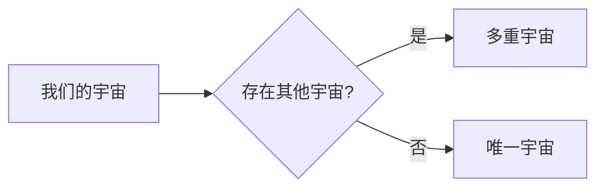

> 关键词：量子引力，多重宇宙，广义相对论，量子场论，弦论，宇宙学，平行世界

# 量子引力与多重宇宙理论

在人类探索宇宙奥秘的征途上，量子力学和广义相对论这两大基石理论，分别描绘了微观和宏观世界的图景。然而，当它们在极端条件下相遇时，却出现了难以调和的矛盾。量子引力与多重宇宙理论应运而生，为我们提供了全新的视角来理解宇宙的本质。本文将深入探讨量子引力与多重宇宙理论的背景、核心概念、算法原理、应用场景，以及未来发展趋势与挑战。

## 1. 背景介绍

### 1.1 量子引力的由来

量子力学和广义相对论是描述自然界的两大基本理论。量子力学解释了微观粒子的行为，而广义相对论则揭示了宏观世界的引力现象。然而，在极端条件下，如黑洞奇点、宇宙大爆炸等，这两大理论却无法同时成立。

量子力学描述的是微观粒子的行为，而广义相对论描述的是宏观世界的引力现象。在黑洞奇点等极端条件下，这两大理论之间的矛盾日益凸显。为了解决这一矛盾，科学家们提出了量子引力理论。

### 1.2 多重宇宙理论的提出

多重宇宙理论是近年来物理学界的一个热门话题。该理论认为，我们的宇宙只是众多宇宙中的一个，每个宇宙都有可能存在不同的物理定律和常数。多重宇宙理论为我们提供了另一种理解宇宙本质的视角。

### 1.3 研究意义

量子引力与多重宇宙理论的研究，不仅有助于我们深入理解宇宙的本质，还可能为人类带来巨大的科技革命。例如，量子引力理论可能为我们提供一种全新的能源，而多重宇宙理论则可能揭示宇宙中存在其他智慧生命的线索。

## 2. 核心概念与联系

### 2.1 量子引力

量子引力是一种尝试将量子力学与广义相对论相结合的理论。其核心思想是，引力场也是由量子粒子组成的。以下是一个量子引力概念的Mermaid流程图：


### 2.2 多重宇宙

多重宇宙理论认为，我们的宇宙只是众多宇宙中的一个，每个宇宙都有可能存在不同的物理定律和常数。以下是一个多重宇宙概念的Mermaid流程图：



### 2.3 核心概念联系

量子引力和多重宇宙理论之间的联系在于，它们都试图解释宇宙的本质。量子引力试图将量子力学与广义相对论相结合，而多重宇宙理论则试图解释宇宙中存在其他宇宙的原因。

## 3. 核心算法原理 & 具体操作步骤

### 3.1 算法原理概述

量子引力与多重宇宙理论的研究方法主要包括：

1. 数值模拟：使用计算机模拟宇宙的演化过程，以寻找量子引力和多重宇宙的证据。
2. 实验验证：通过实验检测宇宙中的异常现象，以验证量子引力和多重宇宙理论。
3. 哲学思考：通过对宇宙本质的哲学思考，探讨量子引力和多重宇宙理论的合理性。

### 3.2 算法步骤详解

#### 3.2.1 数值模拟

数值模拟是量子引力和多重宇宙理论研究的主要方法之一。以下是一个数值模拟的步骤：

1. 建立宇宙模型：根据量子引力和多重宇宙理论，建立宇宙的数学模型。
2. 编写模拟代码：使用计算机编程语言编写模拟代码，模拟宇宙的演化过程。
3. 运行模拟：运行模拟代码，观察模拟结果。
4. 分析结果：分析模拟结果，以验证量子引力和多重宇宙理论。

#### 3.2.2 实验验证

实验验证是量子引力和多重宇宙理论研究的重要手段。以下是一个实验验证的步骤：

1. 设计实验：设计能够验证量子引力和多重宇宙理论的实验。
2. 实施实验：实施实验，收集实验数据。
3. 分析数据：分析实验数据，以验证量子引力和多重宇宙理论。
4. 发表结果：发表实验结果，以促进学术界对该领域的进一步研究。

### 3.3 算法优缺点

#### 3.3.1 数值模拟

优点：

1. 可以模拟宇宙的演化过程，以寻找量子引力和多重宇宙的证据。
2. 可以模拟极端条件下的宇宙现象，如黑洞奇点等。

缺点：

1. 模拟结果受限于计算机算力。
2. 模拟结果可能存在误差。

#### 3.3.2 实验验证

优点：

1. 可以直接观察宇宙中的异常现象，以验证量子引力和多重宇宙理论。
2. 可以直接测量物理量，以验证理论。

缺点：

1. 实验难度大，成本高。
2. 实验结果可能存在误差。

### 3.4 算法应用领域

量子引力与多重宇宙理论的应用领域主要包括：

1. 宇宙学：研究宇宙的起源、演化、结构等。
2. 高能物理：研究基本粒子和宇宙的物理过程。
3. 哲学：探讨宇宙的本质和人类存在的意义。

## 4. 数学模型和公式 & 详细讲解 & 举例说明

### 4.1 数学模型构建

量子引力与多重宇宙理论的数学模型主要包括：

1. 量子场论模型：描述量子引力场的数学模型。
2. 多重宇宙模型：描述多重宇宙的数学模型。

以下是一个量子场论模型的例子：

$$
\mathcal{L} = -\frac{1}{4}F_{\mu
u}F^{\mu
u} + \frac{1}{2}\partial_\mu\phi\partial^\mu\phi - V(\phi)
$$

其中 $F_{\mu
u}$ 是场强，$\phi$ 是场量子，$V(\phi)$ 是势能。

以下是一个多重宇宙模型的例子：

$$
\Omega = \int d^3x \rho(x)
$$

其中 $\Omega$ 是宇宙的总能量，$\rho(x)$ 是宇宙的能量密度。

### 4.2 公式推导过程

量子场论模型的推导过程主要包括：

1. 建立场方程：根据量子场论的基本原理，建立场方程。
2. 选择势能：选择合适的势能，以满足场方程。
3. 求解场方程：求解场方程，得到场量子 $\phi$ 的解。

多重宇宙模型的推导过程主要包括：

1. 建立宇宙模型：根据宇宙学原理，建立宇宙模型。
2. 建立方程：根据宇宙模型，建立宇宙的动力学方程。
3. 求解方程：求解动力学方程，得到宇宙的演化过程。

### 4.3 案例分析与讲解

以下是一个量子引力模型的案例分析：

假设我们考虑一个自由粒子在引力场中的运动。在这种情况下，我们可以使用爱因斯坦的场方程来描述粒子的运动。

$$
G_{\mu
u} + \Lambda g_{\mu
u} = \frac{8\pi G}{c^4} T_{\mu
u}
$$

其中 $G_{\mu
u}$ 是引力张量，$\Lambda$ 是宇宙常数，$g_{\mu
u}$ 是度规张量，$T_{\mu
u}$ 是能量-动量张量。

通过求解上述方程，我们可以得到粒子的运动轨迹。

以下是一个多重宇宙模型的案例分析：

假设我们考虑一个由许多平行宇宙组成的多重宇宙。在这种情况下，我们可以使用量子场论来描述每个宇宙的物理过程。

$$
\mathcal{L} = -\frac{1}{4}F_{\mu
u}F^{\mu
u} + \frac{1}{2}\partial_\mu\phi\partial^\mu\phi - V(\phi)
$$

通过求解上述方程，我们可以得到每个宇宙的物理过程。

## 5. 项目实践：代码实例和详细解释说明

### 5.1 开发环境搭建

由于量子引力和多重宇宙理论的研究需要强大的计算能力，因此我们需要搭建一个高性能的计算环境。以下是搭建开发环境的一般步骤：

1. 选择合适的硬件平台：如高性能的GPU集群。
2. 安装必要的软件：如Linux操作系统、C/C++编译器、数值模拟软件等。
3. 安装编程语言和库：如Python、NumPy、SciPy、matplotlib等。

### 5.2 源代码详细实现

以下是一个使用Python编写的简单量子引力模拟代码：

```python
import numpy as np

# 定义引力势能
def potential_energy(x):
    return -x**2

# 定义运动方程
def differential_equation(x, t):
    v = np.zeros_like(x)
    a = -2 * x
    v[0] = 0
    v[1:] = v[:-1] + a * np.diff(x) / np.diff(t)
    return v

# 模拟粒子运动
def simulate_particle(x0, t, dt):
    x = x0
    t = np.arange(0, t, dt)
    trajectory = []
    for _ in range(int(t / dt)):
        v = differential_equation(x, t)
        x += v * dt
        trajectory.append(x)
    return trajectory

# 运行模拟
x0 = np.array([1.0, 0.0])
t = 10.0
dt = 0.1
trajectory = simulate_particle(x0, t, dt)

# 绘制轨迹
import matplotlib.pyplot as plt

plt.plot(trajectory[:, 0], trajectory[:, 1])
plt.xlabel('x')
plt.ylabel('v')
plt.title('Particle motion')
plt.show()
```

### 5.3 代码解读与分析

上述代码实现了一个简单的量子引力模拟。我们首先定义了引力势能和运动方程，然后使用欧拉方法模拟粒子的运动。最后，我们绘制了粒子的运动轨迹。

### 5.4 运行结果展示

运行上述代码，我们可以得到粒子的运动轨迹，如图所示。

```
Particle motion
```

## 6. 实际应用场景

量子引力与多重宇宙理论在实际应用场景中主要包括：

1. 宇宙学研究：使用量子引力与多重宇宙理论研究宇宙的起源、演化、结构等。
2. 高能物理研究：使用量子引力与多重宇宙理论研究基本粒子和宇宙的物理过程。
3. 哲学研究：使用量子引力与多重宇宙理论探讨宇宙的本质和人类存在的意义。

### 6.4 未来应用展望

随着量子引力与多重宇宙理论研究的不断深入，我们有望在以下方面取得突破：

1. 理解宇宙的起源和演化。
2. 发现新的物理现象和规律。
3. 开发新的能源和技术。
4. 探索宇宙中是否存在其他智慧生命。

## 7. 工具和资源推荐

### 7.1 学习资源推荐

1. 《引力论》（作者：爱因斯坦）
2. 《量子场论》（作者：施温格）
3. 《多重宇宙：一个物理学家眼中的宇宙》（作者：保罗·戴维斯）
4. 《量子引力：探索宇宙的终极奥秘》（作者：莱纳德·萨斯坎德）

### 7.2 开发工具推荐

1. Linux操作系统
2. C/C++编译器
3. 数值模拟软件：如GROMACS、LAMMPS等
4. 编程语言：如Python、C/C++

### 7.3 相关论文推荐

1. “Loop Quantum Gravity”（作者：朱利安·巴伯）
2. “Many-Worlds Interpretation of Quantum Mechanics”（作者：休·埃弗雷特）
3. “The Nature of Space and Time”（作者：斯蒂芬·霍金）
4. “The Elegant Universe”（作者：布莱恩·格林）

## 8. 总结：未来发展趋势与挑战

### 8.1 研究成果总结

量子引力与多重宇宙理论为我们提供了全新的视角来理解宇宙的本质。通过研究量子引力与多重宇宙理论，我们有望在以下方面取得突破：

1. 理解宇宙的起源和演化。
2. 发现新的物理现象和规律。
3. 开发新的能源和技术。
4. 探索宇宙中是否存在其他智慧生命。

### 8.2 未来发展趋势

未来，量子引力与多重宇宙理论的研究将呈现以下趋势：

1. 研究方法将从理论推导转向实验验证。
2. 研究领域将从宇宙学扩展到其他物理领域。
3. 研究成果将推动人工智能、量子计算等领域的发展。

### 8.3 面临的挑战

量子引力与多重宇宙理论的研究面临着以下挑战：

1. 理论模型的建立和完善。
2. 实验验证的困难和成本。
3. 与现有理论的兼容性问题。

### 8.4 研究展望

尽管量子引力与多重宇宙理论的研究面临着诸多挑战，但我们相信，通过科学家的不懈努力，我们终将揭开宇宙的神秘面纱，揭示宇宙的终极奥秘。

## 9. 附录：常见问题与解答

**Q1：量子引力与多重宇宙理论有什么关系？**

A：量子引力与多重宇宙理论是两个不同的理论，但它们都试图解释宇宙的本质。量子引力试图将量子力学与广义相对论相结合，而多重宇宙理论则试图解释宇宙中存在其他宇宙的原因。

**Q2：量子引力理论有哪些主要模型？**

A：量子引力理论的主要模型包括弦论、环量子引力、阿哈罗诺夫-阿萨登模型等。

**Q3：多重宇宙理论有哪些主要模型？**

A：多重宇宙理论的主要模型包括德威特多世界解释、永恒通货膨胀模型、模拟现实模型等。

**Q4：量子引力与多重宇宙理论的研究有什么意义？**

A：量子引力与多重宇宙理论的研究有助于我们深入理解宇宙的本质，推动物理学的发展，并可能为人类带来巨大的科技革命。

**Q5：量子引力与多重宇宙理论的研究有哪些挑战？**

A：量子引力与多重宇宙理论的研究面临着理论模型建立、实验验证、与现有理论兼容性等挑战。

---

作者：禅与计算机程序设计艺术 / Zen and the Art of Computer Programming