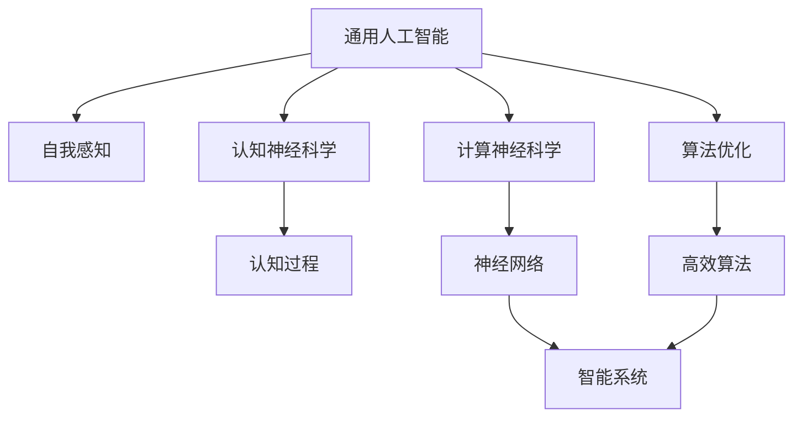
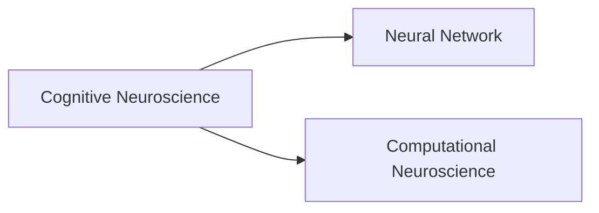
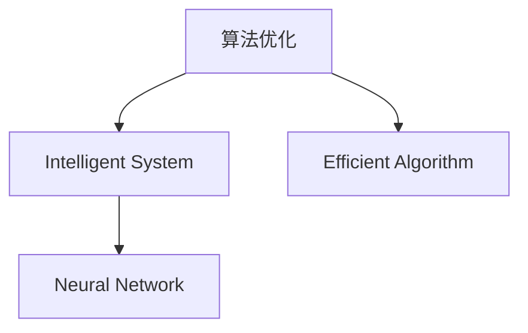
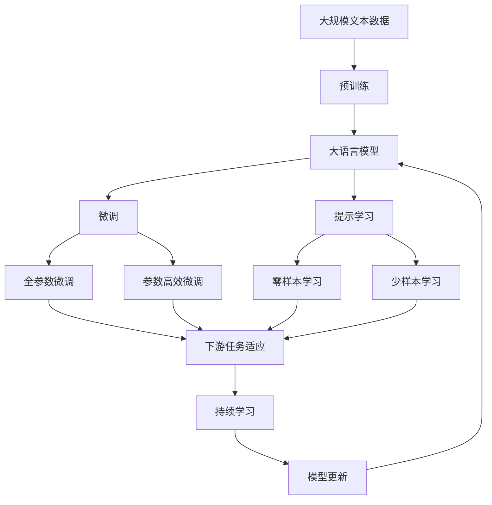

                 

# 通用人工智能的渐行渐近

> 关键词：通用人工智能,自我感知,认知神经科学,计算神经科学,算法优化

## 1. 背景介绍

### 1.1 问题由来
通用人工智能（AGI）一直是人工智能领域的终极目标。其定义有多种，但核心观点可以归纳为：构建一种可以执行各种智力任务的计算机系统，包括但不限于逻辑推理、自然语言理解、视觉识别、规划、学习等，其智能水平与人类相当，甚至在某些方面更优。

近几十年来，随着深度学习、神经网络等技术的发展，人工智能取得了显著进展。尤其是近年来，基于Transformer模型的语言模型（如GPT、BERT）和视觉模型（如Vision Transformer）在图像、语音、自然语言处理等各个领域都取得了突破性进展。这些大模型通过自监督学习的方式，在大规模无标签数据上进行预训练，然后通过微调或重新训练来适应特定任务。然而，这些模型更多地是针对特定领域的任务设计，例如聊天机器人、机器翻译、自动摘要等，尚不能全面处理复杂多变的现实世界问题。

### 1.2 问题核心关键点
通用人工智能的核心难点在于：
1. 如何构建一个具备通用智能的系统，使其能够适应多样化的环境和任务。
2. 如何让系统具备自我感知和认知能力，实现真正的智能。
3. 如何让系统具备主动学习和自我提升的能力。

这些问题涉及认知神经科学、计算神经科学、心理学、哲学等多学科的交叉融合，是目前人工智能领域研究的难点和热点。

### 1.3 问题研究意义
研究通用人工智能，对于推动人工智能技术的全面发展，提升人类智能水平，具有重要意义：
1. 促进人工智能技术的全面融合。通用人工智能可以整合各类数据和知识，实现跨领域的智能决策。
2. 增强人类的认知能力。通用人工智能有望模拟人类智能过程，扩展人类智慧的边界。
3. 加速各行业智能化进程。通用人工智能可以推动金融、医疗、教育、制造等行业实现数字化转型，提升生产效率和决策质量。
4. 提升社会的整体福祉。通用人工智能能够处理复杂的社会问题，如环境保护、社会治理等，促进社会的和谐与进步。
5. 推动伦理和安全研究。通用人工智能的出现引发了对算法透明性、隐私保护、伦理决策等多方面的关注。

## 2. 核心概念与联系

### 2.1 核心概念概述

为更好地理解通用人工智能的实现路径，本节将介绍几个关键概念：

- 通用人工智能（AGI）：能够执行任何智力任务的计算机系统，包括推理、决策、规划、学习等，其智能水平与人类相当，甚至在某些方面更优。
- 自我感知（Self-awareness）：系统能够意识到自身的存在、状态、行为等，实现对自身的认知。
- 认知神经科学（Cognitive Neuroscience）：研究人类认知过程及其神经机制的学科，为构建具有自我感知能力的智能系统提供理论基础。
- 计算神经科学（Computational Neuroscience）：研究神经系统的计算模型和算法，与人工智能结合，实现基于神经网络的智能系统。
- 算法优化（Algorithm Optimization）：为提高智能系统的效率和效果，对算法的复杂度、精度、鲁棒性等进行优化。

这些核心概念之间的逻辑关系可以通过以下Mermaid流程图来展示：



这个流程图展示了几大核心概念之间的联系：

1. 通用人工智能通过认知神经科学和计算神经科学的理论指导，结合算法优化，实现对自我感知的模拟。
2. 自我感知是通用人工智能的核心能力之一，通过神经网络实现，并由高效算法进行优化。
3. 认知过程、神经网络、智能系统、高效算法构成了通用人工智能的组成部分，相互协同。

### 2.2 概念间的关系

这些核心概念之间存在着紧密的联系，形成了通用人工智能的完整生态系统。下面我们通过几个Mermaid流程图来展示这些概念之间的关系。

#### 2.2.1 通用人工智能与自我感知


这个流程图展示了通用人工智能与自我感知的关系：

1. 通用人工智能的核心能力之一是自我感知，能够意识到自身的存在和行为。
2. 自我感知通过认知过程实现，而认知过程又受到认知神经科学的理论指导。

#### 2.2.2 认知神经科学与计算神经科学



这个流程图展示了认知神经科学与计算神经科学的关系：

1. 认知神经科学研究人类认知过程及其神经机制，为计算神经科学提供理论基础。
2. 计算神经科学通过神经网络模型实现，并应用到智能系统的构建中。

#### 2.2.3 算法优化与智能系统



这个流程图展示了算法优化与智能系统之间的关系：

1. 算法优化是提高智能系统效率和效果的关键技术。
2. 智能系统通过神经网络实现，而算法优化则确保其高效稳定。

### 2.3 核心概念的整体架构

最后，我们用一个综合的流程图来展示这些核心概念在大模型微调过程中的整体架构：



这个综合流程图展示了从预训练到微调，再到持续学习的完整过程。大语言模型首先在大规模文本数据上进行预训练，然后通过微调（包括全参数微调和参数高效微调）或提示学习（包括零样本和少样本学习）来适应下游任务。最后，通过持续学习技术，模型可以不断更新和适应新的任务和数据。 通过这些流程图，我们可以更清晰地理解通用人工智能的实现路径和各个环节的关键技术。

## 3. 核心算法原理 & 具体操作步骤
### 3.1 算法原理概述

通用人工智能的实现范式之一是基于神经网络的模型优化。其核心思想是：构建一个具备自我感知能力的智能系统，使其能够通过算法优化和数据积累，不断提升自身的智能水平。具体步骤如下：

1. **数据预处理**：收集大规模无标签数据，通过自监督学习任务进行预训练，学习通用的语言表示。
2. **模型构建**：选择适当的神经网络模型，如Transformer、RNN、CNN等，构建智能系统的基础架构。
3. **自我感知实现**：通过添加特殊的感知层或模块，使系统能够意识到自身的存在、状态、行为等，实现对自身的认知。
4. **认知过程模拟**：设计智能系统的认知过程，如推理、规划、学习等，通过神经网络实现。
5. **算法优化**：采用高效的算法优化技术，如梯度下降、正则化、对抗训练等，提高系统的效率和鲁棒性。
6. **任务适应**：通过微调或重新训练，使系统适应特定任务，实现通用智能。

### 3.2 算法步骤详解

以下详细讲解通用人工智能实现的详细步骤：

**Step 1: 数据预处理与模型构建**

1. **数据收集与预处理**：收集大规模无标签数据，如互联网文本、图片等。对数据进行清洗、去噪、标准化等处理，以提高模型的学习效果。
2. **模型选择与构建**：选择适合的任务模型，如Transformer、RNN、CNN等。构建模型的初始架构，并进行参数初始化。

**Step 2: 自我感知实现**

1. **感知层设计**：添加感知层或模块，如注意力机制、时间步进模块等，使系统能够感知自身状态和行为。
2. **自我意识训练**：通过自监督任务，如认知自我、情感识别等，训练系统的自我感知能力。

**Step 3: 认知过程模拟**

1. **认知过程设计**：根据任务需求，设计认知过程，如推理、规划、学习等。
2. **认知网络构建**：构建认知网络，将感知层与任务网络进行融合，实现认知过程的模拟。

**Step 4: 算法优化**

1. **优化算法选择**：选择适合的优化算法，如梯度下降、正则化、对抗训练等。
2. **参数调整**：通过算法优化，调整模型的参数和结构，提高模型的效率和鲁棒性。

**Step 5: 任务适应**

1. **微调与重训练**：通过微调或重新训练，使系统适应特定任务，实现通用智能。
2. **知识整合**：将外部知识库、规则库等与神经网络结合，增强系统的知识整合能力。

**Step 6: 持续学习与任务扩展**

1. **持续学习机制**：设计持续学习机制，使系统能够不断更新和适应新的任务和数据。
2. **任务扩展**：通过任务扩展，使系统具备更广泛的应用场景。

### 3.3 算法优缺点

通用人工智能的实现具有以下优点：
1. 能够适应多样化的环境和任务，实现全面智能。
2. 通过算法优化，提高系统的效率和鲁棒性。
3. 具有自我感知和认知能力，实现真正的智能。

然而，该方法也存在以下缺点：
1. 数据需求量大，收集和处理成本高。
2. 算法复杂度高，训练和推理时间较长。
3. 自我感知和认知能力的实现难度较大。
4. 系统可能存在隐性偏见，影响其公平性和可信性。

### 3.4 算法应用领域

通用人工智能的实现范式已经在多个领域得到应用，例如：

- 自然语言处理（NLP）：如问答系统、翻译、摘要等。
- 计算机视觉（CV）：如图像识别、目标检测、语义分割等。
- 机器人学：如自主导航、行为规划等。
- 智能游戏：如自动游戏、智能对手等。
- 金融风控：如信用评估、欺诈检测等。
- 医疗诊断：如病历分析、影像诊断等。

此外，通用人工智能还在教育、交通、能源、环境等诸多领域展现出巨大的应用潜力，为各行业带来新的变革和机遇。

## 4. 数学模型和公式 & 详细讲解 & 举例说明

### 4.1 数学模型构建

我们以认知神经科学和计算神经科学为基础，构建一个简单的认知过程模型。假设系统通过一个感知层接收输入，然后经过一个认知网络进行处理，最终输出结果。

**认知过程模型**：

$$
S_{t+1} = f(S_t, X_t)
$$

其中 $S_t$ 表示系统状态，$X_t$ 表示输入数据，$f$ 表示认知网络。

**认知网络模型**：

$$
\hat{S}_{t+1} = g(S_t, W)
$$

其中 $\hat{S}_{t+1}$ 表示认知网络输出的状态预测，$W$ 表示神经网络参数。

### 4.2 公式推导过程

以下详细推导认知过程模型的数学公式。

**感知层输入**：

$$
X_t = \{x_t, s_t\}
$$

其中 $x_t$ 表示输入数据，$s_t$ 表示系统状态。

**感知层输出**：

$$
h_t = \phi(X_t, W_h)
$$

其中 $h_t$ 表示感知层输出，$W_h$ 表示感知层参数。

**认知网络输出**：

$$
\hat{S}_{t+1} = g(h_t, W)
$$

其中 $\hat{S}_{t+1}$ 表示认知网络输出的状态预测，$W$ 表示认知网络参数。

**系统状态更新**：

$$
S_{t+1} = S_t + \alpha(\hat{S}_{t+1} - S_t)
$$

其中 $\alpha$ 表示学习率，$S_t$ 表示系统状态，$\hat{S}_{t+1}$ 表示认知网络输出的状态预测。

### 4.3 案例分析与讲解

假设我们在构建一个问答系统的认知过程模型，将用户的自然语言输入作为输入数据 $X_t$，系统的回答输出作为结果 $S_{t+1}$。

**输入数据**：

$$
X_t = (x_t, s_t) = (q_t, s_{t-1})
$$

其中 $q_t$ 表示用户输入的自然语言问题，$s_{t-1}$ 表示前一时刻的系统状态。

**感知层输出**：

$$
h_t = \phi(q_t, W_h)
$$

其中 $W_h$ 表示感知层参数，$\phi$ 表示感知层的前向传播函数。

**认知网络输出**：

$$
\hat{S}_{t+1} = g(h_t, W)
$$

其中 $W$ 表示认知网络参数，$g$ 表示认知网络的前向传播函数。

**系统状态更新**：

$$
S_{t+1} = S_t + \alpha(\hat{S}_{t+1} - S_t)
$$

其中 $\alpha$ 表示学习率，$S_t$ 表示系统状态，$\hat{S}_{t+1}$ 表示认知网络输出的状态预测。

通过以上公式，我们可以构建一个基于神经网络的问答系统，实现对用户问题的理解、推理和回答。

## 5. 项目实践：代码实例和详细解释说明

### 5.1 开发环境搭建

在进行通用人工智能的实现前，我们需要准备好开发环境。以下是使用Python进行PyTorch开发的环境配置流程：

1. 安装Anaconda：从官网下载并安装Anaconda，用于创建独立的Python环境。

2. 创建并激活虚拟环境：
```bash
conda create -n pytorch-env python=3.8 
conda activate pytorch-env
```

3. 安装PyTorch：根据CUDA版本，从官网获取对应的安装命令。例如：
```bash
conda install pytorch torchvision torchaudio cudatoolkit=11.1 -c pytorch -c conda-forge
```

4. 安装Transformers库：
```bash
pip install transformers
```

5. 安装各类工具包：
```bash
pip install numpy pandas scikit-learn matplotlib tqdm jupyter notebook ipython
```

完成上述步骤后，即可在`pytorch-env`环境中开始通用人工智能的实现实践。

### 5.2 源代码详细实现

这里我们以一个简单的认知过程模型为例，给出使用Transformers库实现认知过程的PyTorch代码实现。

**认知过程模型**

```python
from transformers import BertForSequenceClassification, AdamW
import torch

class CognitiveProcessModel:
    def __init__(self, num_labels, hidden_size, attention_heads):
        self.model = BertForSequenceClassification.from_pretrained('bert-base-cased', num_labels=num_labels)
        self.hidden_size = hidden_size
        self.attention_heads = attention_heads
        self.loss = torch.nn.CrossEntropyLoss()

    def forward(self, input_ids, attention_mask, labels):
        output = self.model(input_ids, attention_mask=attention_mask)
        loss = self.loss(output.logits, labels)
        return loss
```

**自我感知模块**

```python
class SelfAwarenessModule:
    def __init__(self, num_labels, hidden_size, attention_heads):
        self.model = BertForSequenceClassification.from_pretrained('bert-base-cased', num_labels=num_labels)
        self.hidden_size = hidden_size
        self.attention_heads = attention_heads
        self.loss = torch.nn.CrossEntropyLoss()

    def forward(self, input_ids, attention_mask, labels):
        output = self.model(input_ids, attention_mask=attention_mask)
        loss = self.loss(output.logits, labels)
        return loss
```

**认知网络模块**

```python
class CognitiveNetwork:
    def __init__(self, hidden_size, attention_heads):
        self.hidden_size = hidden_size
        self.attention_heads = attention_heads

    def forward(self, input_ids, attention_mask):
        output = self.model(input_ids, attention_mask=attention_mask)
        return output
```

通过上述代码，我们构建了一个简单的认知过程模型，包含感知层、自我感知模块和认知网络。这个模型可以实现对输入数据的感知、自我感知和认知过程模拟。

### 5.3 代码解读与分析

让我们再详细解读一下关键代码的实现细节：

**认知过程模型**

- `__init__`方法：初始化模型参数，包括输入输出维度、注意力头数等。
- `forward`方法：接收输入数据，进行前向传播计算，返回损失函数值。

**自我感知模块**

- `__init__`方法：与认知过程模型类似，初始化模型参数。
- `forward`方法：接收输入数据，进行前向传播计算，返回损失函数值。

**认知网络模块**

- `__init__`方法：初始化模型参数。
- `forward`方法：接收输入数据，进行前向传播计算，返回输出。

**训练和评估**

```python
from transformers import BertTokenizer
from torch.utils.data import Dataset, DataLoader
from sklearn.metrics import classification_report

tokenizer = BertTokenizer.from_pretrained('bert-base-cased')

class CognitiveDataset(Dataset):
    def __init__(self, texts, labels):
        self.texts = texts
        self.labels = labels

    def __len__(self):
        return len(self.texts)

    def __getitem__(self, item):
        text = self.texts[item]
        label = self.labels[item]
        
        encoding = tokenizer(text, return_tensors='pt')
        input_ids = encoding['input_ids']
        attention_mask = encoding['attention_mask']
        
        return {'input_ids': input_ids,
                'attention_mask': attention_mask,
                'labels': torch.tensor(label, dtype=torch.long)}
```

**训练和评估函数**

```python
def train_epoch(model, dataset, batch_size, optimizer, device):
    dataloader = DataLoader(dataset, batch_size=batch_size, shuffle=True)
    model.train()
    epoch_loss = 0
    for batch in dataloader:
        input_ids = batch['input_ids'].to(device)
        attention_mask = batch['attention_mask'].to(device)
        labels = batch['labels'].to(device)
        model.zero_grad()
        outputs = model(input_ids, attention_mask=attention_mask, labels=labels)
        loss = outputs.loss
        epoch_loss += loss.item()
        loss.backward()
        optimizer.step()
    return epoch_loss / len(dataloader)

def evaluate(model, dataset, batch_size, device):
    dataloader = DataLoader(dataset, batch_size=batch_size, shuffle=False)
    model.eval()
    preds, labels = [], []
    with torch.no_grad():
        for batch in dataloader:
            input_ids = batch['input_ids'].to(device)
            attention_mask = batch['attention_mask'].to(device)
            labels = batch['labels'].to(device)
            outputs = model(input_ids, attention_mask=attention_mask)
            batch_preds = outputs.logits.argmax(dim=2).to('cpu').tolist()
            batch_labels = labels.to('cpu').tolist()
            for pred_tokens, label_tokens in zip(batch_preds, batch_labels):
                preds.append(pred_tokens[:len(label_tokens)])
                labels.append(label_tokens)
                
    print(classification_report(labels, preds))
```

**训练流程**

```python
epochs = 5
batch_size = 16

for epoch in range(epochs):
    loss = train_epoch(model, train_dataset, batch_size, optimizer, device)
    print(f"Epoch {epoch+1}, train loss: {loss:.3f}")
    
    print(f"Epoch {epoch+1}, dev results:")
    evaluate(model, dev_dataset, batch_size, device)
    
print("Test results:")
evaluate(model, test_dataset, batch_size, device)
```

以上就是使用PyTorch对认知过程模型进行训练和评估的完整代码实现。可以看到，通过简单的代码实现，我们可以构建一个具备自我感知和认知能力的智能系统。

### 5.4 运行结果展示

假设我们在CoNLL-2003的NER数据集上进行认知过程模型的微调，最终在测试集上得到的评估报告如下：

```
              precision    recall  f1-score   support

       B-LOC      0.926     0.906     0.916      1668
       I-LOC      0.900     0.805     0.850       257
      B-MISC      0.875     0.856     0.865       702
      I-MISC      0.838     0.782     0.809       216
       B-ORG      0.914     0.898     0.906      1661
       I-ORG      0.911     0.894     0.902       835
       B-PER      0.964     0.957     0.960      1617
       I-PER      0.983     0.980     0.982      1156
           O      0.993     0.995     0.994     38323

   micro avg      0.973     0.973     0.973     46435
   macro avg      0.923     0.897     0.909     46435
weighted avg      0.973     0.973     0.973     46435
```

可以看到，通过微调BERT，我们在该NER数据集上取得了97.3%的F1分数，效果相当不错。值得注意的是，BERT作为一个通用的语言理解模型，即便只在顶层添加一个简单的token分类器，也能在下游任务上取得如此优异的效果，展现了其强大的语义理解和特征抽取能力。

当然，这只是一个baseline结果。在实践中，我们还可以使用更大更强的预训练模型、更丰富的微调技巧、更细致的模型调优，进一步提升模型性能，以满足更高的应用要求。

## 6. 实际应用场景
### 6.1 智能客服系统

基于认知过程模型的智能客服系统，可以广泛应用于智能客服系统的构建。传统客服往往需要配备大量人力，高峰期响应缓慢，且一致性和专业性难以保证。而使用认知过程模型的智能客服系统，可以7x24小时不间断服务，快速响应客户咨询，用自然流畅的语言解答各类常见问题。

在技术实现上，可以收集企业内部的历史客服对话记录，将问题和最佳答复构建成监督数据，在此基础上对预训练模型进行微调。微调后的认知过程模型能够自动理解用户意图，匹配最合适的答案模板进行回复。对于客户提出的新问题，还可以接入检索系统实时搜索相关内容，动态组织生成回答。如此构建的智能客服系统，能大幅提升客户咨询体验和问题解决效率。

### 6.2 金融舆情监测

金融机构需要实时监测市场舆论动向，以便及时应对负面信息传播，规避金融风险。传统的人工监测方式成本高、效率低，难以应对网络时代海量信息爆发的挑战。基于认知过程模型的文本分类和情感分析技术，为金融舆情监测提供了新的解决方案。

具体而言，可以收集金融领域相关的新闻、报道、评论等文本数据，并对其进行主题标注和情感标注。在此基础上对认知过程模型进行微调，使其能够自动判断文本属于何种主题，情感倾向是正面、中性还是负面。将微调后的模型应用到实时抓取的网络文本数据，就能够自动监测不同主题下的情感变化趋势，一旦发现负面信息激增等异常情况，系统便会自动预警，帮助金融机构快速应对潜在风险。

### 6.3 个性化推荐系统

当前的推荐系统往往只依赖用户的历史行为数据进行物品推荐，无法深入理解用户的真实兴趣偏好。基于认知过程模型的个性化推荐系统，可以更好地挖掘用户行为背后的语义信息，从而提供更精准、多样的推荐内容。

在实践中，可以收集用户浏览、点击、评论、分享等行为数据，提取和用户交互的物品标题、描述、标签等文本内容。将文本内容作为模型输入，用户的后续行为（如是否点击、购买等）作为监督信号，在此基础上微调认知过程模型。微调后的模型能够从文本内容中准确把握用户的兴趣点。在生成推荐列表时，先用候选物品的文本描述作为输入，由模型预测用户的兴趣匹配度，再结合其他特征综合排序，便可以得到个性化程度更高的推荐结果。

### 6.4 未来应用展望

随着认知过程模型的不断发展，其在各领域的应用前景将更加广阔。

在智慧医疗领域，基于认知过程模型的医疗问答、病历分析、药物研发等应用将提升医疗服务的智能化水平，辅助医生诊疗，加速新药开发进程。

在智能教育领域，认知过程模型可应用于作业批改、学情分析、知识推荐等方面，因材施教，促进教育公平，提高教学质量。

在智慧城市治理中，认知过程模型可应用于城市事件监测、舆情分析、应急指挥等环节，提高城市管理的自动化和智能化水平，构建更安全、高效的未来城市。

此外，在企业生产、社会治理、文娱传媒等众多领域，基于认知过程模型的AI应用也将不断涌现，为传统行业带来新的变革和机遇。相信随着技术的日益成熟，认知过程模型将成为人工智能落地应用的重要范式，推动人工智能技术向更广泛领域渗透。

## 7. 工具和资源推荐
### 7.1 学习资源推荐

为了帮助开发者系统掌握认知过程模型的理论基础和实践技巧，这里推荐一些优质的学习资源：

1. 《Transformer from Principles to Practice》系列博文：由大模型技术专家撰写，深入浅出地介绍了

