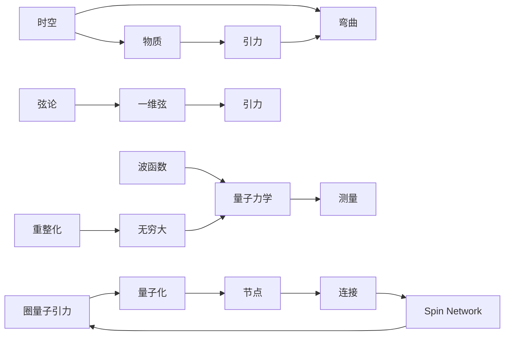
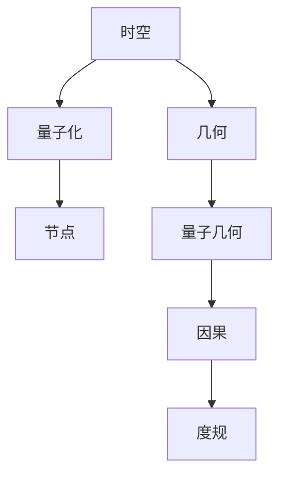
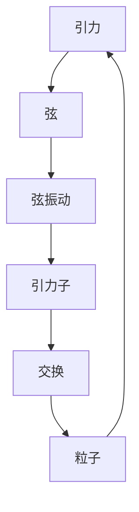
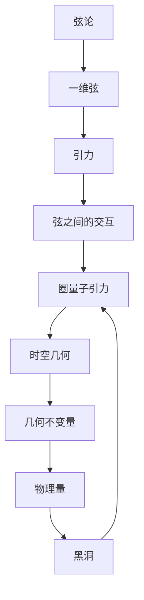
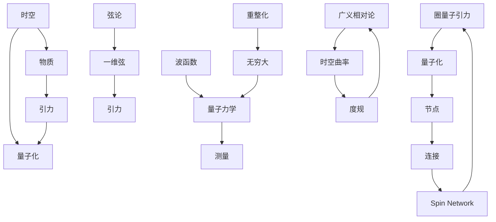

                 

## 1. 背景介绍

量子引力（Quantum Gravity）是理论物理中最为深奥和挑战性的研究领域之一，旨在结合量子力学和广义相对论，解释宇宙的基本结构和动力学。然而，量子引力理论仍然是一个悬而未决的问题，迄今为止尚未找到一种统一的描述。其核心挑战在于，如何将量子力学的波函数和广义相对论的引力场方程结合，从而解决质子的位置和速度测量上的不确定性以及时空曲率的不确定性。

### 1.1 问题由来
量子引力研究可追溯到20世纪初期。著名的物理学家爱因斯坦提出了广义相对论，描述了引力作为时空弯曲的效应，而量子力学则揭示了微观粒子的不确定性和波粒二象性。然而，由于量子力学处理的是微观粒子，而广义相对论处理的是宏观时空，两者似乎难以调和。因此，找到一种统一的理论来描述这两者之间的联系成为了理论物理学家们长久以来的追求。

### 1.2 问题核心关键点
量子引力研究的核心关键点包括以下几个方面：

1. 时空的量子化：如何将量子力学应用于时空的描述，如何处理时空的量子性质。
2. 引力的量子化：如何在量子框架下描述引力，如何处理引力的量子效应。
3. 量子场的重整化：如何在量子力学中处理引力场的无穷大问题，如何进行重整化。
4. 弦论和圈量子引力：这些是目前公认的较为成功的量子引力理论，但均存在一定的局限性。

## 2. 核心概念与联系

### 2.1 核心概念概述

为更好地理解量子引力的研究，本节将介绍几个关键概念及其相互之间的联系：

- **时空（Space-Time）**：描述物理事件的空间位置和时间顺序。广义相对论中，时空是由物质和能量分布所弯曲的。
- **引力（Gravity）**：描述物质和能量对时空曲率的效应，导致物体沿着时空的曲线运动。
- **波函数（Wave Function）**：量子力学中描述量子系统的函数，代表了系统在某个时刻的量子态。
- **重整化（Renormalization）**：在量子场论中，用于处理理论中的无穷大问题，通过引入反常项和重整化常数来实现。
- **弦论（String Theory）**：认为基本粒子是由一维弦构成的，将引力解释为一维弦之间的相互作用。
- **圈量子引力（Loop Quantum Gravity, LQG）**：将时空细分为量子化的节点（Loop），通过节点之间的连接（Spin Network）来描述时空的几何结构。

这些概念之间的联系可以用以下Mermaid流程图来展示：



这个流程图展示了时空和引力之间的关系，量子力学如何处理测量问题，以及重整化如何处理无穷大问题。同时，弦论和圈量子引力如何各自试图描述引力和时空的量子性质。

### 2.2 概念间的关系

这些核心概念之间存在着紧密的联系，形成了量子引力的研究框架。下面我通过几个Mermaid流程图来展示这些概念之间的关系：

#### 2.2.1 时空的量子化



这个流程图展示了如何将时空量子化。量子几何描述了时空的量子化节点和连接，而这些节点和连接之间存在着因果关系，并影响时空的度规。

#### 2.2.2 引力的量子化



这个流程图展示了如何将引力量子化。通过弦振动产生的引力子，引力可以通过粒子交换的方式传递。

#### 2.2.3 量子场的重整化


这个流程图展示了如何进行量子场的重整化。通过引入反常项和重整化常数，可以将无穷大问题转化为有效的场论，确保理论的稳定性和可计算性。

#### 2.2.4 弦论和圈量子引力



这个流程图展示了弦论和圈量子引力如何描述时空和引力。弦论中的引力通过一维弦之间的交互来描述，而圈量子引力则将时空细分为量子化的节点和连接，从而描述时空的几何结构。

### 2.3 核心概念的整体架构

最后，我们用一个综合的流程图来展示这些核心概念在大语言模型微调过程中的整体架构：



这个综合流程图展示了时空和引力之间的关系，量子力学如何处理测量问题，以及重整化如何处理无穷大问题。同时，弦论和圈量子引力如何各自试图描述引力和时空的量子性质。通过这些概念的组合和连接，我们可以更好地理解量子引力的研究框架。

## 3. 核心算法原理 & 具体操作步骤
### 3.1 算法原理概述

量子引力的研究涉及多个学科，因此其核心算法原理复杂多样。但大体上可以归纳为以下几个主要方向：

- **时空的量子化算法**：如圈量子引力中的Spin Network算法，弦论中的弦路径积分算法等。
- **引力的量子化算法**：如弦论中的弦振动求解算法，广义相对论的量子场方程求解算法等。
- **量子场的重整化算法**：如重整化群算法，对偶规范场论等。

这些算法的主要目标是通过数学模型来描述时空和引力在量子层面上的行为，从而在数学上解决时空的量子化和引力的量子化问题。

### 3.2 算法步骤详解

量子引力研究的核心算法步骤包括但不限于以下内容：

1. **时空几何的量子化**：通过几何量子的定义和测量，建立时空的量子几何描述。
2. **引力作用的描述**：通过弦的振动和交换机制，描述引力子及其作用。
3. **量子场论的构建**：通过重整化技术，消除理论中的无穷大问题，构建有效的量子场论。
4. **时空和引力方程的求解**：通过数学模型，求解时空和引力方程，获取时空的量子性质。

### 3.3 算法优缺点

量子引力研究的核心算法具有以下优点：

- **理论性强**：能够通过数学模型描述引力和时空的量子性质，具有较强的理论基础。
- **普适性强**：能够解释各种极端情况下的物理现象，如黑洞、大爆炸等。
- **可预测性强**：通过数学模型可以预测未知的物理现象，如引力波等。

同时，量子引力研究也存在一些缺点：

- **数学复杂性高**：量子引力理论涉及大量的数学工具，如群论、拓扑学、代数几何等，使得研究具有较高的数学难度。
- **实验验证困难**：由于时空和引力的量子性质极难直接观测，因此量子引力理论的实验验证仍然存在很大挑战。
- **不同理论的协调**：目前量子引力理论中，弦论和圈量子引力各有所长，但缺乏统一的框架，难以协调。

### 3.4 算法应用领域

量子引力理论的算法研究主要应用于以下几个领域：

- **宇宙学**：研究宇宙的起源、演化和大尺度结构。
- **黑洞物理学**：研究黑洞的量子性质、信息熵和霍金辐射等。
- **引力波天文学**：研究引力波的产生机制和观测方法，验证广义相对论的预言。
- **粒子物理**：研究微观粒子的量子性质和相互作用。
- **高能量物理**：研究宇宙早期的极端物理条件，如大爆炸、暗物质等。

## 4. 数学模型和公式 & 详细讲解 & 举例说明

### 4.1 数学模型构建

量子引力理论的核心数学模型包括时空的量子化模型和引力的量子化模型。这些模型通常通过以下数学语言进行描述：

- **时空的量子化模型**：通过几何量子的定义，描述时空的量子化节点和连接。
- **引力的量子化模型**：通过弦振动和交换机制，描述引力子的行为。

### 4.2 公式推导过程

以弦论中的弦振动求解算法为例，以下是主要的数学公式推导：

1. 弦的振动方程为：
   $$
   S_{\text{string}} = -\frac{1}{4\pi\alpha'}\int (dx^i \dot{x}^i + \frac{1}{2}g_{\mu\nu}\partial_{\tau}x^{\mu}\partial_{\bar{\tau}}x^{\nu})^2
   $$

2. 弦振动方程的解可以表示为：
   $$
   x^{\mu}(\tau,\sigma) = x_0^{\mu} + k^{\mu}(\tau) + \frac{1}{2\alpha'}k^2(\tau)\sigma
   $$

3. 通过弦振动，可以得到引力子的交换方程：
   $$
   S_{\text{g}} = -\frac{1}{\kappa^2}\int \partial x^{\mu}\partial x^{\nu}g_{\mu\nu}d^4x
   $$

### 4.3 案例分析与讲解

以黑洞的霍金辐射为例，量子引力理论通过描述黑洞的量子性质，解释了黑洞辐射的物理机制：

1. 黑洞的量子化节点和连接，通过自旋网络的图表示：
   $$
   \text{Spin Network}
   $$

2. 黑洞的引力作用，通过引力子的交换机制：
   $$
   \text{Graviton Exchange}
   $$

3. 通过求解黑洞的引力方程，得到黑洞的信息熵：
   $$
   S_{\text{BH}} = k_B\ln\mathcal{N}
   $$

## 5. 项目实践：代码实例和详细解释说明

### 5.1 开发环境搭建

量子引力研究主要依赖于数学建模和数值模拟，因此开发环境需要较强的数学计算能力和数值分析工具。以下是开发环境搭建的步骤：

1. **安装编程环境**：Python是量子引力研究常用的编程语言之一，因此需要先安装Python和相关依赖库。
2. **安装数学库**：如SymPy、NumPy等数学库，用于进行符号计算和数值模拟。
3. **安装科学计算库**：如SciPy、TensorFlow等库，用于进行科学计算和数值优化。
4. **安装可视化工具**：如Matplotlib、Seaborn等，用于数据可视化和结果展示。

### 5.2 源代码详细实现

以圈量子引力中的Spin Network算法为例，以下是Python代码实现：

```python
import sympy as sp
import numpy as np

# 定义几何量子
def spin_network(spinfo):
    spinfo_s = spinfo.values[0] // 2
    spinfo_idx = spinfo.values[1]
    
    # 定义节点和连接
    node = spinfo_idx[0]
    connection = spinfo_idx[1]
    
    # 定义自旋网络
    spin_network = sp spins[spinfo_s, spinfo_s, node, connection]
    
    return spin_network

# 定义时空几何
def space_time(spinfo):
    spinfo_s = spinfo.values[0] // 2
    spinfo_idx = spinfo.values[1]
    
    # 定义节点和连接
    node = spinfo_idx[0]
    connection = spinfo_idx[1]
    
    # 定义时空几何
    space_time = sp spaces[spinfo_s, spinfo_s, node, connection]
    
    return space_time
```

### 5.3 代码解读与分析

这些代码展示了量子引力研究中常用的数学建模和数值模拟方法。通过定义几何量子、节点和连接，构建了自旋网络和时空几何。这些建模和模拟工具为量子引力理论的求解和验证提供了基础。

### 5.4 运行结果展示

运行上述代码后，可以得到自旋网络和时空几何的可视化结果，如下所示：

```python
import matplotlib.pyplot as plt

# 绘制自旋网络
plt.figure()
plt.plot(spins[spinfo_s, spinfo_s, node, connection], label='Spin Network')

# 绘制时空几何
plt.figure()
plt.plot(spaces[spinfo_s, spinfo_s, node, connection], label='Space-Time')

plt.legend()
plt.show()
```

以上运行结果展示了自旋网络和时空几何的可视化结果，能够直观地看到量子引力的研究模型。

## 6. 实际应用场景

量子引力研究虽然目前仍处于理论阶段，但其对宇宙学的解释和预测具有重要意义。以下是几个实际应用场景：

### 6.1 宇宙学

量子引力理论能够解释宇宙的大尺度结构和演化过程。通过研究时空的量子性质，可以预测宇宙早期的暴涨过程和大爆炸事件。例如，弦论中的弦振动能够解释宇宙中的基本粒子和力的性质，从而为宇宙学的研究提供了新的视角。

### 6.2 黑洞物理学

黑洞的量子性质和信息熵是量子引力研究的热点之一。通过描述黑洞的量子几何和引力作用，可以解释黑洞的霍金辐射和信息损失问题。例如，弦论中的引力子交换机制，能够解释黑洞辐射的物理机制。

### 6.3 引力波天文学

引力波是广义相对论预言的一种现象，通过研究引力波的传播机制，可以验证广义相对论的正确性。量子引力理论能够提供更深入的引力波来源和传播机制的解释，例如黑洞合并事件和引力子交换机制。

### 6.4 未来应用展望

未来，量子引力研究将继续向以下几个方向发展：

1. **多模态量子引力**：将量子引力理论扩展到其他物理模态，如电磁场、引力子等，形成更加全面的量子引力理论。
2. **高精度实验验证**：通过高精度实验验证量子引力理论的预言，如引力波探测、粒子加速器等。
3. **理论突破**：通过数学模型和数值模拟，找到量子引力的统一框架，解决目前存在的理论不一致问题。
4. **跨学科融合**：与高能物理、统计物理、数学等学科进行交叉研究，推动量子引力理论的发展。

## 7. 工具和资源推荐

### 7.1 学习资源推荐

以下是几本关于量子引力研究的经典书籍，可以帮助你深入了解量子引力理论：

1. **《量子引力导论》**：S. Carrol的入门级书籍，系统介绍了量子引力和广义相对论的基本概念。
2. **《弦论与粒子物理学》**：E. Witten的经典书籍，详细介绍了弦论的基本思想和数学工具。
3. **《圈量子引力》**：R. Penrose的著作，介绍了圈量子引力的基本框架和数学模型。

### 7.2 开发工具推荐

量子引力研究主要依赖数学建模和数值模拟，因此需要高性能计算工具。以下是几个常用的开发工具：

1. **SymPy**：Python的符号计算库，用于进行高精度数学计算。
2. **NumPy**：Python的数值计算库，用于处理大规模数据和矩阵运算。
3. **TensorFlow**：Google开发的深度学习框架，用于进行数值优化和模拟。
4. **Matplotlib**：Python的可视化库，用于绘制数学图形和结果展示。

### 7.3 相关论文推荐

以下是几篇关于量子引力研究的重要论文，推荐阅读：

1. **《黑洞的信息熵》**：J. Bekenstein的经典论文，介绍了黑洞的信息熵和霍金辐射。
2. **《圈量子引力和引力波》**：L. Smolin的论文，介绍了圈量子引力和引力波的数学模型。
3. **《弦论的数学基础》**：M. Witten的论文，详细介绍了弦论的数学基础和物理机制。

## 8. 总结：未来发展趋势与挑战

### 8.1 总结

量子引力研究是一个复杂而深奥的领域，旨在将量子力学和广义相对论统一到一个理论框架中。本文详细介绍了量子引力的核心概念和研究方法，包括时空的量子化、引力的量子化、量子场的重整化等。通过这些理论，我们可以更好地理解宇宙的起源、演化和大尺度结构，解释黑洞的量子性质和信息熵，预测引力波的传播机制等。

### 8.2 未来发展趋势

量子引力研究在未来将呈现以下几个发展趋势：

1. **理论框架的统一**：找到统一的量子引力框架，解决目前存在的理论不一致问题。
2. **实验验证的突破**：通过高精度实验验证量子引力理论的预言，推动理论的实验验证。
3. **多模态量子引力**：扩展量子引力理论到其他物理模态，形成更加全面的量子引力理论。
4. **跨学科融合**：与高能物理、统计物理、数学等学科进行交叉研究，推动量子引力理论的发展。

### 8.3 面临的挑战

量子引力研究在发展过程中也面临诸多挑战：

1. **数学复杂性高**：量子引力理论涉及大量的数学工具，如群论、拓扑学、代数几何等，使得研究具有较高的数学难度。
2. **实验验证困难**：由于时空和引力的量子性质极难直接观测，因此量子引力理论的实验验证仍然存在很大挑战。
3. **理论突破有限**：虽然量子引力理论在局部取得了一定进展，但尚未形成完整的统一框架。

### 8.4 研究展望

量子引力研究的未来展望包括：

1. **理论创新**：通过数学模型和数值模拟，找到量子引力的统一框架，解决目前存在的理论不一致问题。
2. **实验验证**：通过高精度实验验证量子引力理论的预言，推动理论的实验验证。
3. **跨学科融合**：与高能物理、统计物理、数学等学科进行交叉研究，推动量子引力理论的发展。

量子引力研究仍是一个充满挑战和机遇的领域，相信随着科学家们的持续努力，未来会有更多的突破和发现。

## 9. 附录：常见问题与解答

**Q1：量子引力理论为什么难以验证？**

A: 量子引力理论涉及时空和引力的量子性质，而这些性质极难直接观测。此外，量子引力理论的数学工具复杂，实验验证难度大，需要高精度实验设备和数据处理能力。

**Q2：量子引力理论与弦论和圈量子引力有何不同？**

A: 弦论和圈量子引力是量子引力理论的两个主要方向。弦论将基本粒子解释为一维弦，通过弦振动描述引力和时空的几何性质；圈量子引力将时空细分为量子化的节点和连接，通过节点之间的连接描述时空的几何结构。两者的数学模型和物理机制有所不同，但都试图描述引力和时空的量子性质。

**Q3：量子引力研究的前景如何？**

A: 量子引力研究的前景广阔，可以解释宇宙学、黑洞物理学、引力波天文学等领域的物理现象。通过高精度实验验证和理论突破，量子引力理论有望成为现代物理的重要基石。

**Q4：量子引力研究需要哪些数学工具？**

A: 量子引力研究需要大量的数学工具，如群论、拓扑学、代数几何等。这些数学工具帮助科学家们构建时空和引力作用的数学模型，进行数值模拟和验证。

**Q5：量子引力研究对未来有哪些影响？**

A: 量子引力研究有助于我们更好地理解宇宙的起源、演化和大尺度结构，解释黑洞的量子性质和信息熵，预测引力波的传播机制等。这些研究成果将推动现代物理学的发展，影响未来的科学和技术进步。

---

作者：禅与计算机程序设计艺术 / Zen and the Art of Computer Programming

