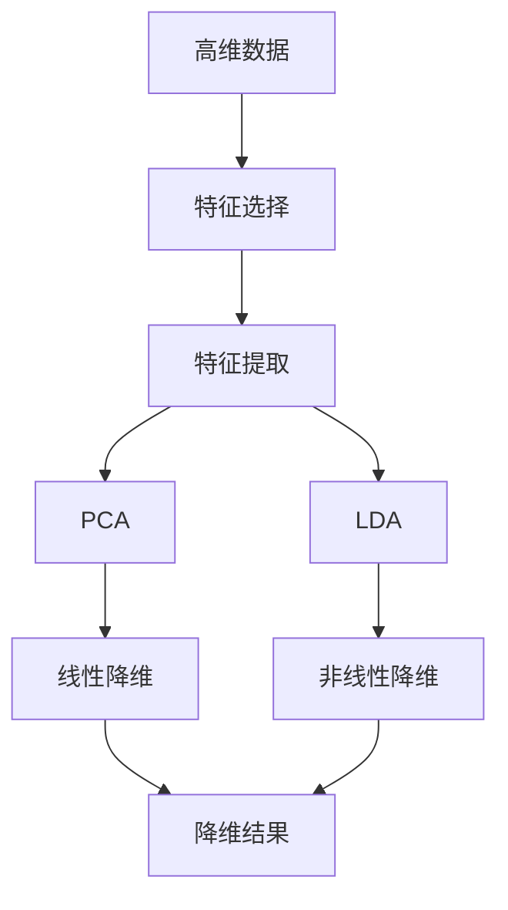

                 

# 降维算法 原理与代码实例讲解

> 关键词：降维算法,PCA,特征选择,特征提取,降维,主成分分析

## 1. 背景介绍

### 1.1 问题由来

在数据科学和机器学习领域，高维数据是一个常见的问题。随着技术的进步，我们可以收集到越来越多的数据，但这些数据往往具有极高的维度，使得模型难以训练和解释。例如，在图像识别任务中，一张彩色图像可能有数百万像素，每个像素都对应一个特征；在文本分类任务中，每个文档由数千个单词组成，每个单词都对应一个特征。如此高维的数据不仅会消耗大量的计算资源，还容易导致模型过拟合，降低泛化能力。

为了解决高维数据的问题，降维算法（Dimensionality Reduction）应运而生。降维算法通过减少数据维度，将高维数据映射到低维空间，从而在保证数据信息不变的情况下，简化数据结构，降低模型复杂度，提高模型的训练效率和泛化能力。

### 1.2 问题核心关键点

降维算法可以分为两类：线性降维和非线性降维。其中，线性降维主要包括主成分分析（PCA）、线性判别分析（LDA）等，而非线性降维则包括非线性降维算法，如局部线性嵌入（LLE）、等距映射（Isomap）等。在本文中，我们将重点介绍PCA算法，并结合代码实例进行详细讲解。

## 2. 核心概念与联系

### 2.1 核心概念概述

- **降维算法（Dimensionality Reduction）**：通过减少数据维度，将高维数据映射到低维空间，从而简化数据结构，提高模型训练效率和泛化能力。

- **主成分分析（Principal Component Analysis，PCA）**：一种线性降维算法，通过找到数据的最大方差方向，将高维数据投影到低维空间。

- **特征选择（Feature Selection）**：从原始特征中筛选出最具代表性和区分性的特征，以减少数据维度，提高模型性能。

- **特征提取（Feature Extraction）**：通过算法将原始数据转换为新的特征表示，从而实现降维。

- **线性降维（Linear Dimensionality Reduction）**：通过线性变换实现降维，如PCA、LDA等。

- **非线性降维（Nonlinear Dimensionality Reduction）**：通过非线性变换实现降维，如LLE、Isomap等。

这些核心概念之间存在着紧密的联系，形成了数据降维的完整框架。降维算法通过减少数据维度，使得模型能够更好地捕捉数据的本质特征，提升模型性能。特征选择和特征提取则通过精炼特征，进一步提高模型的泛化能力。

### 2.2 概念间的关系

以下是一个Mermaid流程图，展示了大数据降维的整体架构：



这个流程图展示了从高维数据到降维结果的完整流程，其中特征选择和特征提取是可选步骤，视具体任务而定。线性降维算法（如PCA）和非线性降维算法（如LLE）都可以实现降维，具体选择哪种算法取决于数据特性和任务需求。

## 3. 核心算法原理 & 具体操作步骤

### 3.1 算法原理概述

PCA是一种线性降维算法，其核心思想是通过寻找数据的最大方差方向，将高维数据投影到低维空间。PCA的目标是找到一个新的坐标系，使得数据的方差最大化，即保留数据的主要变化信息，同时尽可能减少数据的维度。

具体而言，PCA分为两个步骤：

1. **特征值分解**：计算数据协方差矩阵的特征值和特征向量，找到最大方差方向。
2. **投影变换**：将原始数据投影到低维空间中，以保留数据的最大方差。

### 3.2 算法步骤详解

以下是一个Python代码示例，展示如何使用PCA进行数据降维：

```python
import numpy as np
from sklearn.decomposition import PCA

# 构造一个随机的高维数据
X = np.random.randn(1000, 10)

# 创建PCA模型，设置降维维度为2
pca = PCA(n_components=2)

# 拟合PCA模型
pca.fit(X)

# 使用PCA模型进行降维
X_pca = pca.transform(X)
```

在上面的代码中，我们首先使用Numpy生成了一个1000个样本、10个特征的随机高维数据。然后，创建了一个PCA模型，并设置了降维维度为2。接着，使用`fit`方法拟合PCA模型，最后使用`transform`方法对原始数据进行降维，得到低维数据`X_pca`。

### 3.3 算法优缺点

PCA算法的优点包括：

- **计算简单**：PCA算法计算复杂度较低，适用于大规模数据集。
- **降维效果好**：PCA能够保留数据的主要变化信息，具有较好的降维效果。
- **可解释性强**：PCA的数学原理清晰，容易理解和解释。

PCA算法的主要缺点包括：

- **假设线性关系**：PCA假设数据线性可分，不适用于非线性数据。
- **对噪声敏感**：PCA对噪声敏感，存在一定的信息损失。
- **维度选择困难**：PCA的维度选择需要依赖经验，不具有严格的理论指导。

### 3.4 算法应用领域

PCA算法广泛应用于各个领域，包括：

- **数据可视化**：通过降维将高维数据可视化，方便观察数据分布。
- **特征提取**：将高维数据降维后提取关键特征，用于分类、聚类等任务。
- **信号处理**：在信号处理中，PCA可以用于去除噪声和冗余信息，提高信号质量。
- **图像处理**：在图像处理中，PCA可以用于图像压缩和去噪，提高图像质量。

## 4. 数学模型和公式 & 详细讲解  
### 4.1 数学模型构建

PCA算法涉及以下数学概念：

- **协方差矩阵**：用于衡量数据点之间的线性相关性，是PCA的核心工具。
- **特征值和特征向量**：协方差矩阵的特征值和特征向量代表了数据的主要变化方向，用于降维。

给定数据集 $X=\{ x_1, x_2, ..., x_n \} \in \mathbb{R}^{n \times d}$，其中 $x_i \in \mathbb{R}^d$，协方差矩阵定义为：

$$
\mathbf{C} = \frac{1}{n-1} \mathbf{X}^T \mathbf{X}
$$

其中，$\mathbf{X}$ 是数据矩阵，$n$ 是样本数，$d$ 是特征数。

PCA的目标是找到数据的主要变化方向，即协方差矩阵的最大特征值对应的特征向量。设 $\mathbf{U}$ 是协方差矩阵 $\mathbf{C}$ 的特征向量矩阵，$\mathbf{\Sigma}$ 是对角矩阵，对角线上的元素是协方差矩阵 $\mathbf{C}$ 的特征值，则：

$$
\mathbf{C} = \mathbf{U} \mathbf{\Sigma} \mathbf{U}^T
$$

其中，$\mathbf{U}$ 的列向量是协方差矩阵 $\mathbf{C}$ 的特征向量，$\mathbf{\Sigma}$ 的对角线上的元素是协方差矩阵 $\mathbf{C}$ 的特征值。

### 4.2 公式推导过程

在PCA中，我们寻找协方差矩阵 $\mathbf{C}$ 的最大特征值 $\lambda_1$，其对应的特征向量 $\mathbf{u}_1$，然后将其作为降维后的新坐标系的第一维。接着，我们可以重复这个过程，找到协方差矩阵 $\mathbf{C}$ 的次大特征值 $\lambda_2$，其对应的特征向量 $\mathbf{u}_2$，作为新坐标系的第二维。依此类推，直到达到预设的降维维度。

具体步骤如下：

1. **特征值分解**：计算协方差矩阵 $\mathbf{C}$ 的特征值和特征向量。

2. **选择特征向量**：选择特征值最大的 $k$ 个特征向量，构成新的坐标系。

3. **投影变换**：将原始数据投影到新的坐标系中，得到低维数据。

### 4.3 案例分析与讲解

假设我们有一个高维数据集，如下图所示：

```mermaid
graph LR
    A[x1] --> B[x2]
    B --> C[x3]
    C --> D[x4]
    D --> E[x5]
    E --> F[x6]
    F --> G[x7]
    G --> H[x8]
    H --> I[x9]
    I --> J[x10]
    J --> K[x11]
    K --> L[x12]
    L --> M[x13]
    M --> N[x14]
    N --> O[x15]
    O --> P[x16]
    P --> Q[x17]
    Q --> R[x18]
    R --> S[x19]
    S --> T[x20]
    T --> U[x21]
    U --> V[x22]
    V --> W[x23]
    W --> X[x24]
    X --> Y[x25]
    Y --> Z[x26]
```



我们希望将其降维到二维，即找到最大的两个特征值和对应的特征向量，将原始数据投影到新的二维坐标系中。

具体步骤如下：

1. 计算协方差矩阵 $\mathbf{C}$。

2. 对协方差矩阵 $\mathbf{C}$ 进行特征值分解，得到特征值和特征向量。

3. 选择前两个特征向量 $\mathbf{u}_1$ 和 $\mathbf{u}_2$，将其作为新坐标系。

4. 将原始数据投影到新坐标系中，得到降维后的数据。

这个过程可以使用Matplotlib进行可视化，代码如下：

```python
import numpy as np
import matplotlib.pyplot as plt

# 构造高维数据
X = np.random.randn(100, 3)

# 计算协方差矩阵
C = np.cov(X.T)

# 特征值分解
eigenvalues, eigenvectors = np.linalg.eig(C)

# 选择前两个特征向量
u1, u2 = eigenvectors[:, 0], eigenvectors[:, 1]

# 投影变换
X_pca = X @ np.array([u1, u2]).T

# 可视化降维结果
plt.scatter(X_pca[:, 0], X_pca[:, 1])
plt.show()
```

## 5. 项目实践：代码实例和详细解释说明
### 5.1 开发环境搭建

要使用PCA进行数据降维，我们需要安装Python的Numpy和Scikit-learn库。可以使用以下命令进行安装：

```
pip install numpy scikit-learn
```

### 5.2 源代码详细实现

以下是使用PCA进行数据降维的Python代码示例：

```python
import numpy as np
from sklearn.decomposition import PCA

# 构造一个随机的高维数据
X = np.random.randn(1000, 10)

# 创建PCA模型，设置降维维度为2
pca = PCA(n_components=2)

# 拟合PCA模型
pca.fit(X)

# 使用PCA模型进行降维
X_pca = pca.transform(X)
```

### 5.3 代码解读与分析

代码中，我们首先使用Numpy生成了一个1000个样本、10个特征的随机高维数据。然后，创建了一个PCA模型，并设置了降维维度为2。接着，使用`fit`方法拟合PCA模型，最后使用`transform`方法对原始数据进行降维，得到低维数据`X_pca`。

### 5.4 运行结果展示

运行上述代码，可以得到一个二维散点图，展示了原始数据和降维后的数据分布。如果降维成功，降维后的数据分布应该与原始数据分布相似。

## 6. 实际应用场景
### 6.1 金融风险控制

在金融领域，PCA算法可以用于风险控制和投资组合优化。例如，银行可以通过PCA算法对客户的信用评分进行降维，找出影响客户信用的关键特征，从而更准确地评估客户的信用风险。

### 6.2 生物信息学

在生物信息学中，PCA算法可以用于基因表达数据的降维，找出影响基因表达的关键特征，从而更好地理解基因功能和疾病机制。

### 6.3 图像处理

在图像处理中，PCA算法可以用于图像压缩和去噪，通过降维去除噪声和冗余信息，提高图像质量。

### 6.4 未来应用展望

未来的降维算法将更加智能化和自动化，通过机器学习和深度学习技术，实现自动化的特征选择和降维。此外，PCA算法还将与其他算法结合，实现更高效的降维效果。例如，结合非线性降维算法，可以处理非线性数据。

## 7. 工具和资源推荐
### 7.1 学习资源推荐

为了深入理解PCA算法，以下是一些学习资源推荐：

- **《机器学习》（周志华）**：本书详细介绍了机器学习的基本概念和算法，包括PCA算法。

- **《Python数据科学手册》（Jake VanderPlas）**：本书介绍了Python在数据科学中的应用，包括PCA算法。

- **Coursera上的《机器学习》课程（Andrew Ng）**：该课程详细介绍了机器学习的基本概念和算法，包括PCA算法。

- **Kaggle上的PCA算法竞赛**：通过参加PCA算法竞赛，可以更好地理解PCA算法的实际应用。

### 7.2 开发工具推荐

为了实现PCA算法，以下是一些常用的开发工具推荐：

- **Python**：Python是一种广泛应用于数据科学和机器学习的编程语言，其丰富的科学计算库（如Numpy、Scikit-learn）支持PCA算法。

- **Scikit-learn**：Scikit-learn是一个基于Python的机器学习库，提供了丰富的PCA算法实现。

- **TensorFlow**：TensorFlow是一个广泛使用的深度学习框架，支持PCA算法的实现。

### 7.3 相关论文推荐

以下是一些关于PCA算法的相关论文推荐：

- **《PCA: A review》（Bair et al.）**：该论文综述了PCA算法的基本概念和应用，是PCA算法的经典文献。

- **《Principal component analysis》（Jolliffe）**：该书籍详细介绍了PCA算法的基本概念和应用，是PCA算法的权威文献。

- **《A Tutorial on Principal Component Analysis》（Golub et al.）**：该论文介绍了PCA算法的基本概念和实现，是PCA算法的经典文献。

## 8. 总结：未来发展趋势与挑战
### 8.1 总结

本文介绍了PCA算法的原理和实现，通过代码示例展示了如何使用PCA进行数据降维。PCA算法通过找到数据的最大方差方向，将高维数据投影到低维空间，具有计算简单、降维效果好、可解释性强的优点。然而，PCA算法也存在假设线性关系、对噪声敏感、维度选择困难等缺点。

### 8.2 未来发展趋势

未来的PCA算法将更加智能化和自动化，结合机器学习和深度学习技术，实现自动化的特征选择和降维。此外，PCA算法还将与其他算法结合，实现更高效的降维效果，如结合非线性降维算法，处理非线性数据。

### 8.3 面临的挑战

尽管PCA算法在数据降维中具有广泛的应用，但也存在一些挑战：

- **维度选择困难**：PCA算法的维度选择需要依赖经验，不具有严格的理论指导。

- **对噪声敏感**：PCA算法对噪声敏感，存在一定的信息损失。

- **假设线性关系**：PCA算法假设数据线性可分，不适用于非线性数据。

### 8.4 研究展望

未来的研究将在以下几个方面进行：

- **自动化降维**：结合机器学习和深度学习技术，实现自动化的特征选择和降维。

- **非线性降维**：结合非线性降维算法，处理非线性数据。

- **高维数据处理**：结合高维数据处理技术，解决高维数据的降维问题。

- **应用扩展**：将PCA算法应用于更多的领域，如金融、生物信息学、图像处理等。

总之，PCA算法在数据降维中具有广泛的应用前景，未来的研究将进一步提升其性能和自动化水平，推动PCA算法在各个领域的应用。

## 9. 附录：常见问题与解答
### 问题1：PCA算法的主要思想是什么？

答：PCA算法的核心思想是通过寻找数据的最大方差方向，将高维数据投影到低维空间，从而简化数据结构，提高模型训练效率和泛化能力。

### 问题2：PCA算法对噪声敏感吗？

答：PCA算法对噪声敏感，存在一定的信息损失。在实际应用中，需要对数据进行预处理，如去除噪声、标准化等，以提高PCA算法的性能。

### 问题3：PCA算法适用于非线性数据吗？

答：PCA算法假设数据线性可分，不适用于非线性数据。对于非线性数据，可以结合非线性降维算法，如LLE、Isomap等。

### 问题4：PCA算法的降维维度如何选择？

答：PCA算法的降维维度选择需要依赖经验，不具有严格的理论指导。在实际应用中，可以通过试验确定最佳的降维维度。

### 问题5：PCA算法的计算复杂度是多少？

答：PCA算法的计算复杂度为 $O(d^3)$，其中 $d$ 是数据维度。在实际应用中，可以通过特征选择和特征提取等方法减少计算复杂度。

---

作者：禅与计算机程序设计艺术 / Zen and the Art of Computer Programming

