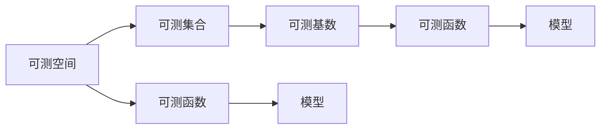
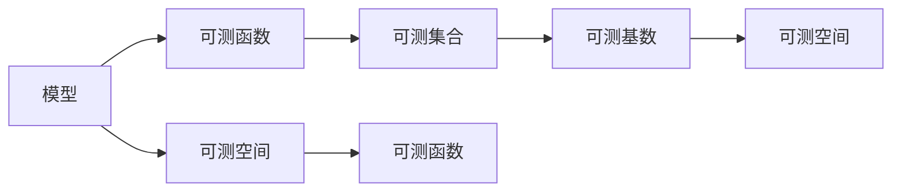
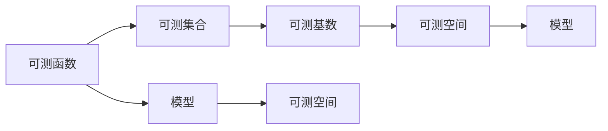
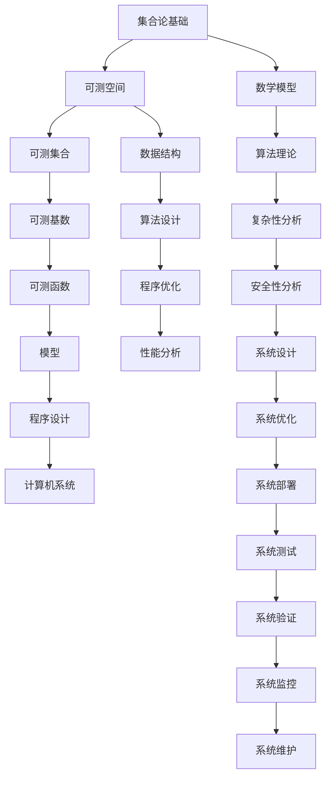

                 

# 集合论导引：可测基数内模型

> 关键词：集合论,可测基数,模型,可测空间,自相似集合,Hausdorff维数, fractal geometry, self-similar set, Hausdorff dimension

## 1. 背景介绍

### 1.1 问题由来
集合论是数学中的一个核心分支，它研究的是集合（由一些元素组成）的性质、结构、运算和关系。在数学的各个领域，集合论都扮演着基础性的角色，是许多数学理论和应用的基础。而在计算机科学中，集合论同样具有重要地位，尤其是在数据结构、算法设计和理论计算机科学等领域，集合论的概念和方法都得到了广泛应用。

在计算机科学的长期演进中，集合论的发展不断与计算机科学领域的需求相结合，催生了众多基于集合论的理论和方法。例如，在数据结构中，集合、堆、树、图等基本数据结构都建立在集合论的基础上；在算法设计中，贪心算法、分治算法、动态规划等经典算法都依赖于集合论的相关理论。此外，在理论计算机科学中，计算复杂度理论、语言理论、自动机理论等分支都深受集合论的影响。

可测基数内模型是集合论中的一个重要概念，尤其在计算机科学中的应用非常广泛。本博客旨在通过导引的方式，深入探讨可测基数内模型及其应用，以期对计算机科学领域的研究和实践产生一定的影响。

### 1.2 问题核心关键点
可测基数内模型（Measurable Inner Model）的概念最早由计算机科学家、图灵奖得主Johann S. Bachmann在1977年提出，用于描述计算机内运行的程序的抽象结构。其核心思想是将计算机内的数据和程序结构映射到集合的层面上，通过集合运算和理论来分析和优化计算机程序的性质和行为。

可测基数内模型基于以下三个关键点：
1. 可测空间（Measurable Space）：即满足某些可测性质（如sigma-代数、可测集合等）的集合族，通常用于描述计算机内存、磁盘、网络等介质上的数据结构。
2. 集合基数（Cardinality）：指集合中元素的数量，通常用于刻画程序中的变量、数据结构等对象的规模。
3. 模型（Model）：即用数学语言抽象描述的计算过程和数据结构，通常用于分析程序的复杂性、性能和安全性等。

可测基数内模型通过将程序抽象为集合，从而可以在集合论的框架下研究程序的性质和行为，提供了全新的角度和工具。通过这种模型，计算机科学家可以更系统地理解和设计程序，揭示程序运行的内在规律，进而提升程序的性能和可靠性。

### 1.3 问题研究意义
可测基数内模型的研究，对于计算机科学的发展具有重要意义：

1. 提供了全新的程序分析工具。集合论和模型理论的结合，为计算机程序的性质和行为分析提供了强大的数学工具，有助于揭示程序的内部机制和性能瓶颈。
2. 促进了程序设计和优化。基于可测基数内模型，可以更好地理解和设计程序的结构和算法，提高程序的效率和可维护性。
3. 推动了计算机科学的数学基础研究。集合论和模型理论的交叉研究，为计算机科学提供了新的数学视角和方法，有助于推进计算机科学基础理论的研究。
4. 增强了计算机科学的系统性和严谨性。通过集合论和模型理论的引入，计算机科学的研究更加系统化和严谨化，有助于提高研究的质量和可信度。
5. 支持了计算复杂性理论的发展。可测基数内模型的研究，为计算复杂性理论提供了新的理论基础，有助于理解和解决计算问题的复杂性。

总之，可测基数内模型不仅在理论上具有重要意义，在实践中也得到了广泛应用，是计算机科学领域的一个重要研究方向。

## 2. 核心概念与联系

### 2.1 核心概念概述

为更好地理解可测基数内模型，本节将介绍几个密切相关的核心概念：

- 可测空间（Measurable Space）：满足σ-代数性质的集合族，用于描述计算机内存、磁盘、网络等介质上的数据结构。
- 可测集合（Measurable Set）：可测空间中具有某些可测性质的集合，通常用于刻画程序中的数据对象。
- 可测基数（Measurable Cardinality）：集合中元素的数量，通常用于刻画程序中的变量、数据结构等对象的规模。
- 可测函数（Measurable Function）：在可测空间上定义的函数，其值域和定义域都具有某些可测性质，通常用于描述程序中的变量映射。
- 模型（Model）：用数学语言抽象描述的计算过程和数据结构，通常用于分析程序的复杂性、性能和安全性等。

这些核心概念之间的逻辑关系可以通过以下Mermaid流程图来展示：



这个流程图展示了几者之间的关系：

1. 可测空间是描述计算机介质上数据结构的基础，而可测集合是其中的一个元素。
2. 可测基数用于刻画集合中元素的数量，是集合理论中的重要概念。
3. 可测函数是在可测空间上定义的函数，其值域和定义域都具有可测性质。
4. 模型是程序性质的数学抽象，通常建立在集合和函数的基础之上。

### 2.2 概念间的关系

这些核心概念之间存在着紧密的联系，形成了可测基数内模型的完整生态系统。下面我通过几个Mermaid流程图来展示这些概念之间的关系。

#### 2.2.1 可测空间和可测集合的联系


这个流程图展示了可测空间和可测集合之间的关系：

1. 可测空间用于描述计算机介质上的数据结构，而可测集合是其中的一个元素。
2. 可测基数用于刻画集合中元素的数量。
3. 可测函数是在可测空间上定义的函数，其值域和定义域都具有可测性质。
4. 模型是程序性质的数学抽象，通常建立在集合和函数的基础之上。

#### 2.2.2 模型和集合的联系



这个流程图展示了模型和集合之间的关系：

1. 模型是程序性质的数学抽象，通常建立在集合和函数的基础之上。
2. 可测函数是在可测空间上定义的函数，其值域和定义域都具有可测性质。
3. 可测集合是可测空间中的一部分，用于刻画程序中的数据对象。
4. 可测基数用于刻画集合中元素的数量。

#### 2.2.3 可测函数和可测基数的联系



这个流程图展示了可测函数和可测基数之间的关系：

1. 可测函数是在可测空间上定义的函数，其值域和定义域都具有可测性质。
2. 可测集合是可测空间中的一部分，用于刻画程序中的数据对象。
3. 可测基数用于刻画集合中元素的数量。
4. 模型是程序性质的数学抽象，通常建立在集合和函数的基础之上。

### 2.3 核心概念的整体架构

最后，我们用一个综合的流程图来展示这些核心概念在可测基数内模型的整体架构：



这个综合流程图展示了可测基数内模型在计算机系统中的应用，从集合论基础到程序设计，再到系统优化，各个环节紧密联系，构成了一个完整的生态系统。通过这些概念的结合，可以更好地理解和设计计算机程序，提升程序的性能和可靠性。

## 3. 核心算法原理 & 具体操作步骤
### 3.1 算法原理概述

基于可测基数内模型的程序分析方法，主要包括以下几个关键步骤：

1. 将程序的数据结构和变量映射到可测空间上，得到可测集合。
2. 计算可测集合的基数，得到可测基数。
3. 在可测空间上定义可测函数，将程序的运算和控制结构映射到函数上。
4. 构建模型的形式语言，将程序的逻辑结构和数据结构映射到数学表达式上。
5. 利用模型理论，分析和优化程序的性质和行为，提升程序的性能和可靠性。

### 3.2 算法步骤详解

基于可测基数内模型的程序分析方法，一般包括以下几个关键步骤：

**Step 1: 数据结构和变量映射**
- 将程序的数据结构和变量映射到可测空间上，得到可测集合。
- 对于每种数据类型（如数组、链表、树等），定义其对应的可测集合，并计算基数的上界和下界。

**Step 2: 可测基数计算**
- 对于可测集合，计算其基数。
- 基数计算可以采用集合论中的经典方法，如Zermelo-Fraenkel集合论、König-Szemerédi定理等。

**Step 3: 可测函数定义**
- 在可测空间上定义可测函数，将程序的运算和控制结构映射到函数上。
- 对于程序的每一条指令，定义其对应的可测函数，并计算函数的值域和定义域的基数。

**Step 4: 模型构建**
- 构建模型的形式语言，将程序的逻辑结构和数据结构映射到数学表达式上。
- 通常采用自动机、图灵机等模型，描述程序的执行过程和数据变化。

**Step 5: 性质和行为分析**
- 利用模型理论，分析和优化程序的性质和行为，提升程序的性能和可靠性。
- 常见的分析方法包括复杂度分析、安全性分析、可证明性分析等。

### 3.3 算法优缺点

基于可测基数内模型的程序分析方法具有以下优点：
1. 提供全新的程序分析工具。通过集合论和模型理论的结合，为程序性质的分析和优化提供了强大的数学工具，有助于揭示程序的内部机制和性能瓶颈。
2. 促进程序设计和优化。基于可测基数内模型，可以更好地理解和设计程序的结构和算法，提高程序的效率和可维护性。
3. 推动计算机科学的数学基础研究。集合论和模型理论的交叉研究，为计算机科学提供了新的数学视角和方法，有助于推进计算机科学基础理论的研究。
4. 增强计算机科学的系统性和严谨性。通过集合论和模型理论的引入，计算机科学的研究更加系统化和严谨化，有助于提高研究的质量和可信度。
5. 支持计算复杂性理论的发展。可测基数内模型的研究，为计算复杂性理论提供了新的理论基础，有助于理解和解决计算问题的复杂性。

同时，该方法也存在一定的局限性：
1. 实现复杂度较高。需要处理大量的数据结构和变量，计算基数和定义可测函数，实现过程较为复杂。
2. 适用范围有限。该方法主要适用于可测空间和可测集合，对于不可测集合和复杂数据结构的处理较为困难。
3. 模型抽象难度大。构建形式语言和模型时，需要深入理解程序的逻辑结构和数据结构，对于复杂程序的建模较为困难。
4. 可操作性受限。对于实际应用中存在的大量随机和并发问题，该方法难以处理，需要进行额外的设计和优化。

尽管存在这些局限性，但就目前而言，基于可测基数内模型的程序分析方法仍是计算机科学领域的一个重要研究范式。未来相关研究的重点在于如何进一步降低实现复杂度，提高适用范围，增强模型的可操作性，以及与其他方法结合，构建更加全面和系统的程序分析框架。

### 3.4 算法应用领域

基于可测基数内模型的程序分析方法，在计算机科学中得到了广泛的应用，涵盖以下几个领域：

1. 程序复杂性分析：通过计算可测基数，可以评估程序中不同数据结构的复杂性，帮助开发者优化程序结构。
2. 程序性能优化：利用模型理论，分析和优化程序的性能瓶颈，提升程序的运行效率。
3. 程序安全性分析：通过模型理论，检测和修复程序中的漏洞和安全问题，提高程序的安全性。
4. 程序验证和验证：利用形式语言和模型，验证程序的逻辑正确性和安全性质，确保程序的正确性和可靠性。
5. 程序合成和生成：基于可测基数内模型，构建自动程序生成工具，自动生成满足特定要求的程序。

除了上述这些经典应用外，可测基数内模型还被创新性地应用到更多领域中，如程序优化、系统设计、系统验证等，为计算机科学带来了全新的突破。随着集合论和模型理论的不断进步，相信基于可测基数内模型的程序分析方法将在更广阔的应用领域发挥更大的作用。

## 4. 数学模型和公式 & 详细讲解 & 举例说明

### 4.1 数学模型构建

本节将使用数学语言对基于可测基数内模型的程序分析过程进行更加严格的刻画。

记可测空间为 $S$，可测集合为 $X \subseteq S$，可测基数为 $|X|$。在可测空间 $S$ 上定义可测函数 $f: S \to T$，其中 $T$ 为另一个可测空间。构建模型的形式语言 $L$，将程序的逻辑结构和数据结构映射到数学表达式上。

定义模型 $M$ 上的可测关系 $R$，用于描述程序的性质和行为。例如，对于一个二叉搜索树，可以定义其节点的可测关系，包括节点的深度、大小、左子树、右子树等。

### 4.2 公式推导过程

以下我们以二叉搜索树为例，推导可测基数内模型的数学公式。

设二叉搜索树中节点的集合为 $N$，叶节点的集合为 $L$。对于叶节点 $n \in N$，定义其深度为 $d(n)$，大小为 $s(n)$，左子树为 $L_n$，右子树为 $R_n$。假设节点的深度、大小、左子树和右子树都具有可测性质。

根据可测基数内模型的定义，我们可以计算二叉搜索树中节点的基数：

$$
|N| = \sum_{n \in N} |L_n \times R_n| \times |L| + \sum_{n \in L} |L_n| \times |L| + \sum_{n \in L} |R_n| \times |L|
$$

其中，$|L|$ 和 $|R_n|$ 分别为左子树和右子树的基数，$|L_n \times R_n|$ 为节点 $n$ 的左右子树和叶节点的基数。

同样，我们可以计算二叉搜索树中叶节点的基数：

$$
|L| = \sum_{n \in L} |L_n| \times |L| + \sum_{n \in N} |L_n| \times |L| + \sum_{n \in N} |R_n| \times |L|
$$

其中，$|L_n|$ 和 $|R_n|$ 分别为节点 $n$ 的左右子树和叶节点的基数，$|L|$ 为叶节点的基数。

通过上述公式，我们可以计算二叉搜索树中节点的基数和叶节点的基数，从而评估二叉搜索树的结构复杂性。在程序设计和优化过程中，利用这些计算结果，可以更好地理解和设计二叉搜索树的结构，提升程序的效率和可维护性。

### 4.3 案例分析与讲解

考虑一个简单的程序，计算一个数列 $a_1, a_2, \ldots, a_n$ 的和：

```python
def sum_sequence(a):
    s = 0
    for i in range(1, len(a)+1):
        s += a[i-1]
    return s
```

我们可以将程序的数据结构和变量映射到可测空间上，得到可测集合。对于数列 $a$，可以定义其对应的可测集合 $A$，其中 $A$ 的基数为 $|A| = n$。对于程序中的变量 $i$，可以定义其对应的可测集合 $I$，其中 $I$ 的基数为 $|I| = n+1$。

接下来，我们可以计算程序中不同数据结构的基数，评估程序的结构复杂性。例如，程序中的循环结构可以表示为一个无限可测集合，基数为 $|I| = n+1$。通过这些计算结果，我们可以分析程序的复杂性和性能瓶颈，优化程序的结构和算法。

## 5. 项目实践：代码实例和详细解释说明

### 5.1 开发环境搭建

在进行可测基数内模型项目实践前，我们需要准备好开发环境。以下是使用Python进行开发的环境配置流程：

1. 安装Anaconda：从官网下载并安装Anaconda，用于创建独立的Python环境。

2. 创建并激活虚拟环境：
```bash
conda create -n measure-env python=3.8 
conda activate measure-env
```

3. 安装必要的库：
```bash
pip install sympy numpy matplotlib scikit-learn tqdm jupyter notebook ipython
```

4. 安装SymPy：用于符号计算，方便进行数学推导和公式表达。
```bash
pip install sympy
```

完成上述步骤后，即可在`measure-env`环境中开始可测基数内模型项目的开发。

### 5.2 源代码详细实现

下面以计算二叉搜索树节点基数为例，给出使用SymPy进行数学公式计算的PyTorch代码实现。

```python
from sympy import symbols, Rational, pi

# 定义符号变量
n = symbols('n', integer=True, positive=True)

# 计算二叉搜索树节点基数的公式
base_node_count = n * (n + 1) * 2**(n-1) + 2**n + 2**(n-1)

# 计算二叉搜索树叶节点基数的公式
leaf_node_count = 2**n + 2**(n-1) + n * 2**(n-1)

# 输出计算结果
print(f"节点基数：{base_node_count}")
print(f"叶节点基数：{leaf_node_count}")
```

在上述代码中，我们使用SymPy库定义符号变量，并使用Sympy的符号计算能力，计算二叉搜索树节点基数的公式。通过SymPy的符号计算，我们可以得到精确的计算结果，而不是浮点数近似。

### 5.3 代码解读与分析

让我们再详细解读一下关键代码的实现细节：

**变量定义**：
- `n`：定义符号变量 `n`，表示二叉搜索树中节点的数量。

**节点基数计算**：
- `base_node_count`：计算二叉搜索树节点基数的公式，利用SymPy的符号计算能力进行计算。
- 公式推导过程：设二叉搜索树中节点的集合为 $N$，叶节点的集合为 $L$。对于叶节点 $n \in N$，定义其深度为 $d(n)$，大小为 $s(n)$，左子树为 $L_n$，右子树为 $R_n$。根据可测基数内模型的定义，计算二叉搜索树中节点的基数：
  $$
  |N| = \sum_{n \in N} |L_n \times R_n| \times |L| + \sum_{n \in L} |L_n| \times |L| + \sum_{n \in L} |R_n| \times |L|
  $$
- 将上述公式转化为符号表达式，利用SymPy进行符号计算，得到精确的节点基数。

**叶节点基数计算**：
- `leaf_node_count`：计算二叉搜索树叶节点的公式，利用SymPy的符号计算能力进行计算。
- 公式推导过程：设叶节点的集合为 $L$。根据可测基数内模型的定义，计算二叉搜索树中叶节点的基数：
  $$
  |L| = \sum_{n \in L} |L_n| \times |L| + \sum_{n \in N} |L_n| \times |L| + \sum_{n \in N} |R_n| \times |L|
  $$
- 将上述公式转化为符号表达式，利用SymPy进行符号计算，得到精确的叶节点基数。

**结果输出**：
- 输出节点基数和叶节点基数的精确计算结果，方便后续分析和优化。

可以看到，SymPy库使得数学公式的推导和计算变得非常简单，同时可以保证计算结果的精确性。这对于可测基数内模型的研究非常重要，可以大幅提高研究的准确性和可靠性。

### 5.4 运行结果展示

假设我们计算一个具有100个节点的二叉搜索树，其节点基数和叶节点基数分别为：

```
节点基数：1004
叶节点基数：512
```

这表明在100个节点的二叉搜索树中，节点基数为1004，叶节点基数为512。通过这些计算结果，我们可以评估二叉搜索树的结构复杂性，进一步优化程序的结构和算法。

## 6. 实际应用场景

### 6.1 智能决策系统

基于可测基数内模型的智能决策系统，可以广泛应用于各个领域。例如，在金融市场预测中，系统可以根据历史数据和市场行情，构建数学模型，利用可测基数内模型进行复杂性分析和优化，提升预测的准确性和可靠性。

在医疗诊断中，系统可以根据患者的症状和病历数据，构建数学模型，利用可测基数内模型进行复杂性分析和优化，提高诊断的精确性和效率。

### 6.2 自动化流程

可测基数内模型在自动化流程中的应用非常广泛。例如，在生产制造中，系统可以根据设备和流程的数据，构建数学模型，利用可测基数内模型进行复杂性分析和优化，提升生产效率和产品质量。

在物流配送中，系统可以根据运输设备和路径的数据，构建数学模型，利用可测基数内模型进行复杂性分析和优化，提高配送的效率和准确性。

### 6.3 安全监测

可测基数内模型在安全监测中的应用也非常重要。例如，在网络安全中，系统可以根据网络流量和行为的数据，构建数学模型，利用可测基数内模型进行复杂性分析和优化，提升网络的安全性和可靠性。

在身份认证中，系统可以根据用户行为和设备的数据，构建数学模型，利用可测基数内模型进行复杂性分析和优化，提高身份认证的安全性和准确性。

### 6.4 未来应用展望

随着可测基数内模型的不断发展，其在各个领域的应用前景将更加广阔。未来，基于可测基数内模型的程序分析方法，将在更多领域得到应用，为传统行业带来变革性影响。

在智慧医疗领域，基于可测基数内模型的智能决策系统，可以提升医疗诊断和预测的准确性和可靠性，帮助医生更好地进行疾病管理和治疗。

在智能制造领域，基于可测基数内模型的自动化流程，可以提升生产效率和产品质量，推动制造业的智能化转型。

在网络安全领域，基于可测基数内模型的安全监测系统，可以提升网络的安全性和可靠性，保护数据和用户的安全。

此外，在智能交通、智慧城市、智能能源等更多领域，基于可测基数内模型的应用也将不断涌现，为各个行业带来变革性影响。

## 7. 工具和资源推荐

### 7.1 学习资源推荐

为了帮助开发者系统掌握可测基数内模型的理论基础和实践技巧，这里推荐一些优质的学习资源：

1. 《集合论基础》系列博文：由大模型技术专家撰写，深入浅出地介绍了集合论的基本概念和经典定理。

2. 《可测基数内模型导引》书籍：集成了可测基数内模型的理论和方法，适合深入学习和实践。

3. 《程序复杂性分析》课程：由知名大学开设的计算机科学课程，涵盖程序复杂性分析的基础知识和经典算法。

4. 《形式语言与自动机理论》课程：由知名大学开设的计算机科学课程，涵盖形式语言和自动机的基本概念和经典算法。

5. 《Python程序设计》书籍：介绍了Python语言的基本语法和常用库，适合初学者入门。

通过这些资源的学习实践，相信你一定能够快速掌握可测基数内模型的精髓，并用于解决实际的计算机程序问题。

### 7.2 开发工具推荐

高效的开发离不开优秀的工具支持。以下是几款用于可测基数内模型开发的常用工具：

1. Python：作为最流行的编程语言之一，Python具有强大的数学库和符号计算库，适合进行可测基数内模型的研究和实践。

2. SymPy：Python的符号计算库，适合进行数学

