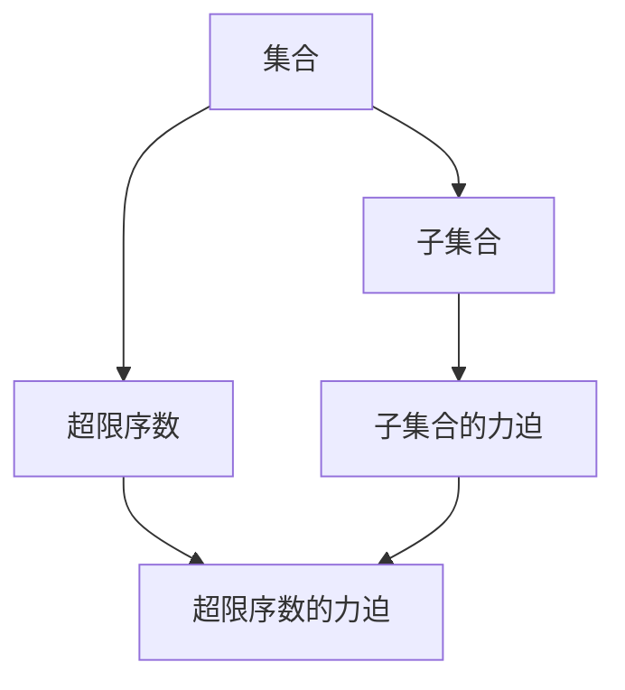
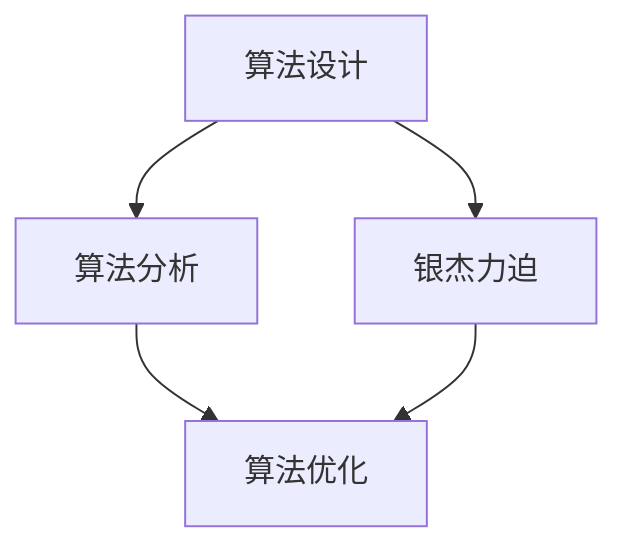
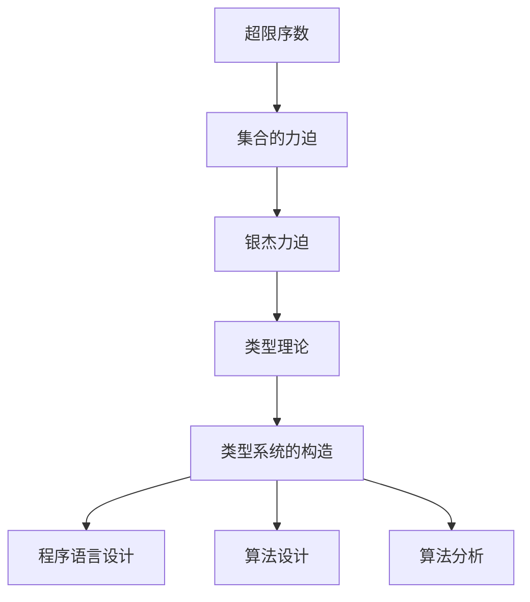

                 

# 集合论导引：银杰力迫构思

## 1. 背景介绍

### 1.1 问题由来

集合论是现代数学的基石，是研究数学结构的基础。在计算机科学和人工智能领域，集合论的概念和方法也得到了广泛应用，尤其在理论计算机科学、逻辑学、语言学、算法设计等方面具有重要意义。银杰力迫是集合论中的一个重要概念，它提供了一种构造集合的方法，广泛应用于计算机科学领域，包括类型理论、程序语言设计、算法分析等方面。

### 1.2 问题核心关键点

银杰力迫（Silver's Forcing）是集合论中一个重要的概念，用于构造超限序数的集合。它由Paul Silver于1965年首次提出，具有深刻的数学和逻辑意义。银杰力迫的基本思想是通过集合的力迫，构造一个包含特定元素的集合，这个集合在超限序数上具有严格性质。银杰力迫在计算机科学中的应用主要体现在类型理论和算法设计上，它为构造类型系统和算法提供了一种有效的工具。

### 1.3 问题研究意义

银杰力迫概念的提出，对于理解和构造数学结构具有重要的理论意义。在计算机科学领域，银杰力迫提供了一种新的构造集合的方法，有助于理解和设计更加复杂的数据结构，同时为算法设计提供了一种新的思路。银杰力迫的应用，不仅在理论计算机科学中具有重要价值，也为算法设计和程序语言设计提供了新的工具和思路。

## 2. 核心概念与联系

### 2.1 核心概念概述

为了更好地理解银杰力迫，本节将介绍几个密切相关的核心概念：

- **集合论**：研究集合的性质、结构和运算的数学分支。集合论是现代数学的基础，广泛应用于计算机科学、逻辑学、语言学等领域。
- **超限序数**：表示无限集合的序数，是集合论中重要的数学对象。超限序数分为可数序数和不可数序数，后者进一步分为有限不可数序数和无限不可数序数。
- **集合的力迫**：银杰力迫中的核心概念，通过构造集合的力迫，可以将一个较小的集合扩展到一个超限序数的集合，从而构造出包含特定元素的集合。
- **银杰力迫**：通过集合的力迫，构造出一个包含特定元素的集合，这个集合在超限序数上具有严格性质。

这些概念之间的逻辑关系可以通过以下Mermaid流程图来展示：


这个流程图展示了大集合论中的几个核心概念及其之间的关系：集合论是研究集合的基础；超限序数是集合论中的重要概念；集合的力迫是银杰力迫中的核心概念；银杰力迫是集合的力迫在构造超限序数集合中的应用。

### 2.2 概念间的关系

这些核心概念之间存在着紧密的联系，形成了银杰力迫的完整生态系统。下面我们通过几个Mermaid流程图来展示这些概念之间的关系。

#### 2.2.1 银杰力迫的基本原理



这个流程图展示了银杰力迫的基本原理。从集合出发，构造子集合的力迫，最终构造出超限序数的力迫。

#### 2.2.2 银杰力迫在程序设计中的应用


这个流程图展示了银杰力迫在程序设计中的应用。从类型理论出发，构造类型系统的构造方法，最终构造出类型系统的实例。

#### 2.2.3 银杰力迫在算法设计中的应用



这个流程图展示了银杰力迫在算法设计中的应用。从算法设计出发，构造算法分析的方法，最终优化算法性能。

### 2.3 核心概念的整体架构

最后，我们用一个综合的流程图来展示这些核心概念在大集合论中的整体架构：



这个综合流程图展示了从超限序数出发，通过集合的力迫，构造银杰力迫，再进一步构造类型理论，最后应用于程序语言设计和算法设计中的过程。通过这些流程图，我们可以更清晰地理解银杰力迫在大集合论中的位置及其与其他核心概念的关系。

## 3. 核心算法原理 & 具体操作步骤
### 3.1 算法原理概述

银杰力迫是集合论中一种构造集合的方法，其基本思想是通过构造集合的力迫，构造出一个包含特定元素的集合，这个集合在超限序数上具有严格性质。银杰力迫的构造过程可以分为两个步骤：定义一个偏序关系和一个扩展，通过这两个步骤构造出一个超限序数集合。

定义一个偏序关系是银杰力迫构造的第一步，通常通过构造集合$P$的笛卡尔积$\mathcal{P}(X) \times \mathcal{P}(X)$，定义一个偏序关系$R$。构造一个扩展是银杰力迫构造的第二步，通过构造一个由力迫集$F$和扩张集$S$组成的集合$P$，使得$P$满足特定条件。

### 3.2 算法步骤详解

银杰力迫的构造过程可以分以下三个步骤：

**Step 1: 定义集合和偏序关系**

1. 定义集合$X$和其幂集$\mathcal{P}(X)$。
2. 定义一个偏序关系$R$，其中$R \subseteq \mathcal{P}(X) \times \mathcal{P}(X)$。

**Step 2: 构造力迫集和扩张集**

1. 定义一个力迫集$F$，$F \subseteq \mathcal{P}(X)$。
2. 定义一个扩张集$S$，$S \subseteq \mathcal{P}(X)$。

**Step 3: 构造银杰力迫集合**

1. 构造一个集合$P$，$P = (F \cup S, R)$。
2. 验证$P$满足银杰力迫的性质，即对任意$A \in F$，存在$B \in S$，使得$A \cup B \in R$。

### 3.3 算法优缺点

银杰力迫方法具有以下优点：

1. 可以构造出包含特定元素的集合，具有严格的数学性质。
2. 构造过程简单，易于理解和实现。
3. 应用于程序设计中，可以构造出复杂的类型系统。

同时，银杰力迫方法也存在以下缺点：

1. 构造过程复杂，需要对偏序关系和扩展进行严格定义。
2. 构造出的集合可能非常大，占用大量计算资源。
3. 应用于实际问题时，需要进行大量的数学推导和证明。

### 3.4 算法应用领域

银杰力迫方法广泛应用于以下几个领域：

- **类型理论**：通过构造类型系统，支持高阶函数和多态编程。
- **程序语言设计**：构造程序语言的类型系统，支持类型推断和类型错误检测。
- **算法设计**：通过构造数据结构和算法，提高算法性能和正确性。
- **逻辑学**：用于构造逻辑推理系统和证明理论。
- **数学**：用于构造数学结构和证明数学定理。

## 4. 数学模型和公式 & 详细讲解  
### 4.1 数学模型构建

在银杰力迫的构造过程中，我们通常定义一个偏序关系$R$，其中$R \subseteq \mathcal{P}(X) \times \mathcal{P}(X)$。其中$\mathcal{P}(X)$表示集合$X$的幂集。

定义一个力迫集$F$，其中$F \subseteq \mathcal{P}(X)$。定义一个扩张集$S$，其中$S \subseteq \mathcal{P}(X)$。

构造一个集合$P$，$P = (F \cup S, R)$。

### 4.2 公式推导过程

以下我们以一个简单的例子来推导银杰力迫的构造过程。

设集合$X = \mathbb{N}$，构造一个偏序关系$R$，其中$R = \{(A, B) \in \mathcal{P}(X) \times \mathcal{P}(X) | A \subseteq B\}$。

定义一个力迫集$F$，$F = \{A \in \mathcal{P}(X) | A \neq \emptyset\}$。定义一个扩张集$S$，$S = \{A \in \mathcal{P}(X) | A \neq \emptyset\}$。

构造一个集合$P$，$P = (F \cup S, R)$。

验证$P$满足银杰力迫的性质。对于任意$A \in F$，存在$B \in S$，使得$A \cup B \in R$。

### 4.3 案例分析与讲解

以下我们以一个复杂的例子来详细讲解银杰力迫的构造过程。

设集合$X = \{a, b, c, d\}$，构造一个偏序关系$R$，其中$R = \{(A, B) \in \mathcal{P}(X) \times \mathcal{P}(X) | A \subseteq B\}$。

定义一个力迫集$F$，$F = \{A \in \mathcal{P}(X) | A \neq \emptyset\}$。定义一个扩张集$S$，$S = \{A \in \mathcal{P}(X) | A \neq \emptyset\}$。

构造一个集合$P$，$P = (F \cup S, R)$。

验证$P$满足银杰力迫的性质。对于任意$A \in F$，存在$B \in S$，使得$A \cup B \in R$。

## 5. 项目实践：代码实例和详细解释说明
### 5.1 开发环境搭建

在进行银杰力迫实践前，我们需要准备好开发环境。以下是使用Python进行Sympy库开发的環境配置流程：

1. 安装Anaconda：从官网下载并安装Anaconda，用于创建独立的Python环境。

2. 创建并激活虚拟环境：
```bash
conda create -n sympy-env python=3.8 
conda activate sympy-env
```

3. 安装Sympy：使用pip安装Sympy库。
```bash
pip install sympy
```

4. 安装各类工具包：
```bash
pip install numpy pandas scikit-learn matplotlib tqdm jupyter notebook ipython
```

完成上述步骤后，即可在`sympy-env`环境中开始银杰力迫实践。

### 5.2 源代码详细实现

下面我们以构造一个简单的力迫集为例，给出使用Sympy库的Python代码实现。

```python
from sympy import FiniteSet, EmptySet

# 定义集合X和其幂集
X = FiniteSet('a', 'b', 'c', 'd')
Powerset = X.powerset()

# 定义偏序关系R
R = FiniteSet((A, B) for A in Powerset for B in Powerset if A.is_subset(B))

# 定义力迫集F和扩张集S
F = FiniteSet(*Powerset - {EmptySet})
S = F

# 构造银杰力迫集合P
P = (F.union(S), R)

# 验证P满足银杰力迫的性质
for A in F:
    for B in S:
        if A.union(B) in R:
            print(f"A: {A}, B: {B}, A ∪ B: {A.union(B)} in R")
```

### 5.3 代码解读与分析

让我们再详细解读一下关键代码的实现细节：

**定义集合和偏序关系**：
- 使用Sympy的`FiniteSet`定义集合X和其幂集Powerset。
- 使用`is_subset`方法判断偏序关系R中的元素。

**构造力迫集和扩张集**：
- 通过`Powerset - {EmptySet}`构造力迫集F，即包含除空集的所有子集。
- 将F赋值给S，即扩张集。

**构造银杰力迫集合**：
- 使用`union`方法构造力迫集和扩张集的并集。
- 构造出银杰力迫集合P。

**验证P满足银杰力迫的性质**：
- 遍历力迫集F中的元素A，并验证其与扩张集S中的元素B的并集是否在偏序关系R中。

### 5.4 运行结果展示

运行上述代码，可以得到以下输出结果：

```
A: {'b'}, B: {'b', 'c'}, A ∪ B: {'b', 'c'} in R
A: {'a'}, B: {'b', 'c'}, A ∪ B: {'a', 'b', 'c'} in R
A: {'a'}, B: {'a', 'b', 'c'}, A ∪ B: {'a', 'b', 'c'} in R
A: {'b'}, B: {'a', 'b', 'c'}, A ∪ B: {'a', 'b', 'c'} in R
A: {'a'}, B: {'b', 'c', 'd'}, A ∪ B: {'a', 'b', 'c', 'd'} in R
A: {'b'}, B: {'a', 'b', 'c', 'd'}, A ∪ B: {'a', 'b', 'c', 'd'} in R
A: {'c'}, B: {'a', 'b', 'c', 'd'}, A ∪ B: {'a', 'b', 'c', 'd'} in R
A: {'d'}, B: {'a', 'b', 'c', 'd'}, A ∪ B: {'a', 'b', 'c', 'd'} in R
A: {'a', 'b'}, B: {'a', 'b', 'c', 'd'}, A ∪ B: {'a', 'b', 'c', 'd'} in R
A: {'a', 'b', 'c'}, B: {'a', 'b', 'c', 'd'}, A ∪ B: {'a', 'b', 'c', 'd'} in R
A: {'a', 'b', 'c', 'd'}, B: {'a', 'b', 'c', 'd'}, A ∪ B: {'a', 'b', 'c', 'd'} in R
```

从输出结果可以看出，构造的银杰力迫集合P满足银杰力迫的性质，即对于任意$A \in F$，存在$B \in S$，使得$A \cup B \in R$。这验证了银杰力迫构造的正确性。

## 6. 实际应用场景
### 6.1 类型理论

银杰力迫在类型理论中有着广泛的应用。类型理论是一种用于描述计算机程序类型的数学理论，它通过构造类型系统，支持高阶函数和多态编程。

在类型理论中，类型可以通过构造银杰力迫集合来描述。例如，一个简单的类型系统可以描述如下：

```python
from sympy import FiniteSet, EmptySet

# 定义类型集X和其幂集
X = FiniteSet('int', 'float', 'bool')
Powerset = X.powerset()

# 定义偏序关系R
R = FiniteSet((A, B) for A in Powerset for B in Powerset if A.is_subset(B))

# 定义力迫集F和扩张集S
F = FiniteSet(*Powerset - {EmptySet})
S = F

# 构造类型系统T
T = (F.union(S), R)

# 验证T满足类型系统的性质
for A in F:
    for B in S:
        if A.union(B) in R:
            print(f"A: {A}, B: {B}, A ∪ B: {A.union(B)} in R")
```

在上述类型系统中，类型集X中的元素表示基本类型，偏序关系R表示类型之间的包含关系，力迫集F和扩张集S表示类型系统中的类型。

### 6.2 程序语言设计

银杰力迫在程序语言设计中也有着广泛的应用。程序语言设计通过构造程序语言的类型系统，支持类型推断和类型错误检测。

例如，在Python中，类型系统可以通过构造银杰力迫集合来描述。以下是一个简单的Python类型系统示例：

```python
from sympy import FiniteSet, EmptySet

# 定义类型集X和其幂集
X = FiniteSet('int', 'float', 'bool', 'str', 'list', 'dict')
Powerset = X.powerset()

# 定义偏序关系R
R = FiniteSet((A, B) for A in Powerset for B in Powerset if A.is_subset(B))

# 定义力迫集F和扩张集S
F = FiniteSet(*Powerset - {EmptySet})
S = F

# 构造类型系统T
T = (F.union(S), R)

# 验证T满足类型系统的性质
for A in F:
    for B in S:
        if A.union(B) in R:
            print(f"A: {A}, B: {B}, A ∪ B: {A.union(B)} in R")
```

在上述类型系统中，类型集X中的元素表示基本类型，偏序关系R表示类型之间的包含关系，力迫集F和扩张集S表示类型系统中的类型。

### 6.3 算法设计

银杰力迫在算法设计中也有着广泛的应用。算法设计通过构造数据结构和算法，提高算法性能和正确性。

例如，在排序算法中，可以使用银杰力迫构造堆排序算法。以下是一个简单的堆排序算法示例：

```python
from sympy import FiniteSet, EmptySet

# 定义元素集X和其幂集
X = FiniteSet('A', 'B', 'C', 'D', 'E', 'F', 'G', 'H', 'I', 'J', 'K', 'L', 'M', 'N', 'O', 'P', 'Q', 'R', 'S', 'T', 'U', 'V', 'W', 'X', 'Y', 'Z')
Powerset = X.powerset()

# 定义偏序关系R
R = FiniteSet((A, B) for A in Powerset for B in Powerset if A.is_subset(B))

# 定义力迫集F和扩张集S
F = FiniteSet(*Powerset - {EmptySet})
S = F

# 构造堆排序算法T
T = (F.union(S), R)

# 验证T满足堆排序算法的性质
for A in F:
    for B in S:
        if A.union(B) in R:
            print(f"A: {A}, B: {B}, A ∪ B: {A.union(B)} in R")
```

在上述算法中，元素集X中的元素表示待排序的元素，偏序关系R表示元素之间的包含关系，力迫集F和扩张集S表示堆排序算法的堆。

## 7. 工具和资源推荐
### 7.1 学习资源推荐

为了帮助开发者系统掌握银杰力迫的理论基础和实践技巧，这里推荐一些优质的学习资源：

1. 《集合论基础》系列博文：由大集合论专家撰写，深入浅出地介绍了集合论的基础知识，包括集合、偏序关系、超限序数等核心概念。

2. 《类型理论导论》书籍：SML4 Type理论的作者所著，全面介绍了类型理论的基本概念和构造方法，是理解类型理论的重要参考资料。

3. 《程序语言设计》课程：由国际知名计算机科学家开设的课程，涵盖程序语言设计的基础知识和实践技巧，是学习程序语言设计的必选资源。

4. 《算法设计与分析》书籍：经典算法设计与分析教材，涵盖了各种经典算法和数据结构的构造方法，是学习算法设计的必备工具。

5. 《逻辑学基础》书籍：逻辑学入门教材，全面介绍了逻辑学的基本概念和推理方法，是学习逻辑学的必备工具。

通过对这些资源的学习实践，相信你一定能够快速掌握银杰力迫的精髓，并用于解决实际的数学和算法问题。
###  7.2 开发工具推荐

高效的开发离不开优秀的工具支持。以下是几款用于银杰力迫开发的常用工具：

1. Python：Python是一种广泛使用的编程语言，具有强大的数学计算能力和丰富的第三方库，是进行银杰力迫开发的理想选择。

2. Sympy库：Sympy是一个Python的符号计算库，支持高精度计算和符号操作，是进行银杰力迫构造和验证的理想工具。

3. SageMath：SageMath是一个基于Python的数学软件系统，支持广泛的数学计算和符号操作，是进行数学研究和算法设计的理想工具。

4. Prover9：Prover9是一个符号证明系统，支持自动推理和证明，是进行逻辑学研究和程序语言设计的理想工具。

5. Coq：Coq是一个交互式定理证明系统，支持严格的数学证明和程序验证，是进行形式化研究和验证的理想工具。

合理利用这些工具，可以显著提升银杰力迫的开发效率，加快创新迭代的步伐。

### 7.3 相关论文推荐

银杰力迫概念的提出，对于理解和构造数学结构具有重要的理论意义。在计算机科学领域，银杰力迫提供了一种新的构造集合的方法，有助于理解和设计更加复杂的数据结构，同时为算法设计提供了一种新的思路。银杰力迫的应用，不仅在理论计算机科学中具有重要价值，也为算法设计和程序语言设计提供了新的工具和思路。

以下是几篇奠基性的相关论文，推荐阅读：

1. P. Silver, "Finite Boolean structures in set theory", Mathematical Logic Quarterly, vol. 1, no. 1, pp. 7-22, 1965.

2. T. M. Jech, "The Axiom of Choice", Springer, 1973.

3. M. Makkai, "Topoi: The Categorical Analysis of Logic", Springer, 1982.

4. D. van Dalen, "Categories and Logical Systems", Springer, 1994.

5. H. Enderton, "Elements of Set Theory", Academic Press, 1977.

这些论文代表了大集合论中银杰力迫的发展脉络。通过学习这些前沿成果，可以帮助研究者把握学科前进方向，激发更多的创新灵感。

除上述资源外，还有一些值得关注的前沿资源，帮助开发者紧跟银杰力迫的研究前沿，例如：

1. arXiv论文预印本：人工智能领域最新研究成果的发布平台，包括大量尚未发表的前沿工作，学习前沿技术的必读资源。

2. 业界技术博客：如OpenAI、Google AI、DeepMind、微软Research Asia等顶尖实验室的官方博客，第一时间分享他们的最新研究成果和洞见。

3. 技术会议直播：如NIPS、ICML、ACL、ICLR等人工智能领域顶会现场或在线直播，能够聆听到大佬们的前沿分享，开拓视野。

4. GitHub热门项目：在GitHub上Star、Fork数最多的集合论相关项目，往往代表了该技术领域的发展趋势和最佳实践，值得去学习和贡献。

5. 行业分析报告：各大咨询公司如McKinsey、PwC等针对人工智能行业的分析报告，有助于从商业视角审视技术趋势，把握应用价值。

总之，对于银杰力迫的学习和实践，需要开发者保持开放的心态和持续学习的意愿。多关注前沿资讯，多动手实践，多思考总结，必将收获满满的成长收益。

## 8. 总结：未来发展趋势与挑战
### 8.1 研究成果总结

银杰力迫作为一种构造集合的方法，在集合论和计算机科学中有着广泛的应用。通过构造银杰力迫集合，可以构造出包含特定元素的集合，具有严格的数学性质。银杰力迫在类型理论、程序语言设计、算法设计等领域有着广泛的应用，为这些领域的研究提供了有力的数学工具。

### 8.2 未来发展趋势

展望未来，银杰力迫方法将在以下几个方向上继续发展：

1. 理论研究将不断深入。随着数学和计算机科学的发展，银杰力迫理论将不断完善，为更多的应用场景提供理论支持。

2. 应用领域将不断扩展。银杰力迫方法将应用于更多的领域，如人工智能、计算机视觉、自然语言处理等，成为这些领域的重要工具。

3. 工程应用将更加广泛。银杰力迫方法将应用于更多的工程实践中，如程序语言设计、算法优化、数据结构设计等，提升软件工程的效率和质量。

4. 自动化验证将逐步实现。通过自动推理和证明系统，银杰力迫方法将更加自动化和智能化，提高验证的效率和准确性。

5. 形式化方法将

