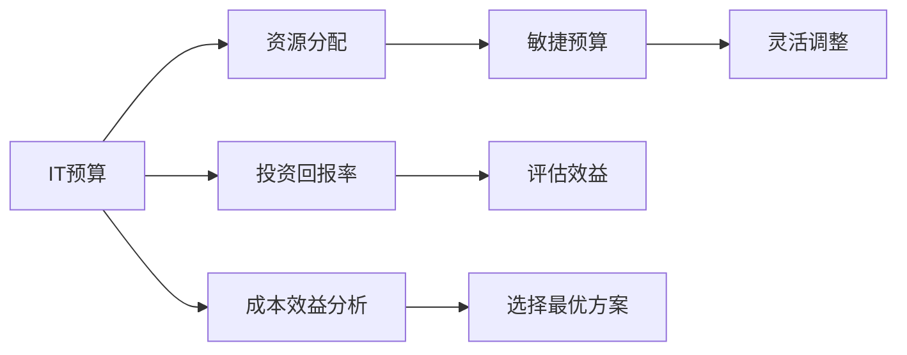

                 

# 预算管理：制定并管理IT预算，确保资源得到高效分配，使IT投资为公司带来价值

> 关键词：IT预算，资源分配，投资回报率（ROI），成本效益分析，敏捷预算

## 1. 背景介绍

### 1.1 问题由来
随着企业数字化转型的深入，IT投资在企业运营和发展中扮演着越来越重要的角色。然而，IT投资的高成本和复杂性也给企业带来了巨大的挑战。如何制定并管理IT预算，确保资源得到高效分配，是企业亟需解决的关键问题。不当的预算管理不仅会导致资源浪费，还可能影响企业的战略目标和业务发展。因此，本文将深入探讨IT预算管理的核心概念、关键步骤和最佳实践，帮助企业有效提升IT投资的回报率。

### 1.2 问题核心关键点
IT预算管理的核心在于通过科学的预算制定和严格的执行监控，确保IT资源的高效利用和价值的最大化。主要关注点包括：

- **预算制定**：基于企业战略目标和IT需求，制定合理的IT预算。
- **资源分配**：根据项目优先级和业务需求，合理分配IT资源。
- **执行监控**：实时监控预算执行情况，及时调整和优化资源配置。
- **成本效益分析**：评估IT投资的效益，确保投资回报率最大化。

### 1.3 问题研究意义
有效的IT预算管理能够帮助企业：

- **优化资源配置**：确保有限的IT资源被合理分配，避免资源浪费。
- **提升投资回报率**：通过科学的预算制定和执行监控，最大化IT投资的回报率。
- **支持战略目标**：确保IT投资与企业战略目标保持一致，推动业务发展。
- **增强风险管理**：及时识别和应对IT预算执行中的风险，保障项目顺利推进。

## 2. 核心概念与联系

### 2.1 核心概念概述

在IT预算管理中，涉及几个关键概念：

- **IT预算**：指企业为IT项目和日常运营分配的资金。
- **资源分配**：将IT预算分配到具体的项目或运营活动中。
- **投资回报率（ROI）**：衡量IT投资的效益，即投资回报与成本的比率。
- **成本效益分析**：评估不同IT投资方案的经济效益，选择最优方案。
- **敏捷预算**：基于敏捷原则，灵活调整预算分配，适应快速变化的业务需求。

这些概念通过以下Mermaid流程图进行联系展示：



通过这个流程图，我们可以看到：

1. IT预算通过资源分配实现具体的IT活动，并最终影响投资回报率和成本效益。
2. 敏捷预算则通过灵活调整，适应快速变化的业务需求，优化资源分配。
3. 成本效益分析帮助选择最优的IT投资方案，提升整体效益。
4. 投资回报率评估IT投资的效益，指导预算制定和执行监控。

### 2.2 概念间的关系

IT预算管理涉及的概念众多，其间的联系紧密，以下进一步细化：

- **IT预算与资源分配**：IT预算决定资源分配的规模和优先级。
- **IT预算与投资回报率**：投资回报率衡量IT预算的效益，指导预算制定和调整。
- **IT预算与成本效益分析**：成本效益分析评估不同IT投资方案的经济性，选择最优方案。
- **资源分配与投资回报率**：资源分配直接影响IT项目的执行效率和效益。
- **资源分配与敏捷预算**：敏捷预算通过灵活调整资源分配，确保资源匹配快速变化的业务需求。
- **投资回报率与成本效益分析**：投资回报率通过评估成本效益分析的结果，指导预算分配和执行监控。
- **敏捷预算与成本效益分析**：敏捷预算通过灵活调整，优化成本效益分析的方案选择。

通过这些概念间的紧密联系，我们可以更好地理解IT预算管理的整体框架和实施策略。

## 3. 核心算法原理 & 具体操作步骤

### 3.1 算法原理概述

IT预算管理的基本原理是通过科学的预算制定和严格的执行监控，确保IT资源的有效利用和价值的最大化。具体步骤如下：

1. **需求分析**：通过需求调研，明确企业的IT需求和战略目标。
2. **预算制定**：基于需求分析，制定合理的IT预算。
3. **资源分配**：根据项目优先级和业务需求，合理分配IT资源。
4. **执行监控**：实时监控预算执行情况，及时调整和优化资源配置。
5. **成本效益分析**：评估IT投资的效益，确保投资回报率最大化。

### 3.2 算法步骤详解

#### 3.2.1 需求分析

需求分析是IT预算管理的基础，主要包括以下几个步骤：

1. **需求调研**：通过问卷调查、访谈等方式，收集企业的IT需求。
2. **需求分类**：根据需求类型（如研发、运维、业务支持等）对需求进行分类。
3. **需求优先级排序**：基于战略重要性和业务价值对需求进行优先级排序。

#### 3.2.2 预算制定

预算制定是IT预算管理的核心环节，主要包括以下几个步骤：

1. **历史数据分析**：基于历史数据和趋势，估算未来的IT需求和成本。
2. **资源评估**：评估企业现有IT资源（如人力、硬件、软件等）。
3. **预算分配**：根据需求优先级和资源评估结果，制定IT预算。

#### 3.2.3 资源分配

资源分配是预算执行的具体操作，主要包括以下几个步骤：

1. **项目划分**：将IT预算划分为具体的项目或运营活动。
2. **资源分配**：根据项目优先级和业务需求，合理分配IT资源。
3. **监控与调整**：实时监控资源使用情况，及时调整资源配置。

#### 3.2.4 执行监控

执行监控是IT预算管理的保障措施，主要包括以下几个步骤：

1. **实时监控**：通过IT管理系统，实时监控预算执行情况。
2. **异常识别**：识别预算执行中的异常和风险。
3. **调整与优化**：及时调整和优化资源配置，确保预算顺利执行。

#### 3.2.5 成本效益分析

成本效益分析是IT预算管理的重要工具，主要包括以下几个步骤：

1. **成本估算**：估算IT项目和运营的成本。
2. **效益评估**：评估IT投资对企业业务的效益。
3. **ROI计算**：计算投资回报率，评估投资效益。

### 3.3 算法优缺点

IT预算管理的优势在于通过科学的预算制定和执行监控，确保IT资源的有效利用和价值的最大化。其主要缺点在于：

- **复杂度高**：涉及需求分析、预算制定、资源分配等多个环节，实施复杂。
- **灵活性不足**：一旦预算制定，调整起来难度较大，难以适应快速变化的业务需求。
- **数据依赖性高**：预算制定和执行监控高度依赖历史数据和市场信息，数据不准确会影响效果。

### 3.4 算法应用领域

IT预算管理广泛应用于企业IT部门的预算制定和执行监控，特别是在以下领域：

- **企业IT部门**：制定年度IT预算，分配资源，监控执行情况。
- **IT项目**：评估项目需求，制定项目预算，监控项目执行。
- **业务部门**：支持业务部门IT需求，评估投资效益，优化资源配置。

## 4. 数学模型和公式 & 详细讲解 & 举例说明

### 4.1 数学模型构建

IT预算管理的数学模型主要涉及预算制定和成本效益分析。以下是预算制定和成本效益分析的数学模型：

**预算制定模型**：

$$
B_{total} = \sum_{i=1}^n B_i
$$

其中，$B_{total}$为总预算，$B_i$为第$i$个项目的预算。

**成本效益分析模型**：

$$
ROI = \frac{B_{benefit} - B_{cost}}{B_{cost}}
$$

其中，$ROI$为投资回报率，$B_{benefit}$为投资收益，$B_{cost}$为投资成本。

### 4.2 公式推导过程

**预算制定模型推导**：

1. 将总预算拆分为各个项目的预算，即$B_{total} = B_1 + B_2 + ... + B_n$。
2. 根据项目的优先级和资源评估结果，确定各项目的预算$B_i$。
3. 累加所有项目的预算，得到总预算$B_{total}$。

**成本效益分析模型推导**：

1. 根据实际投资和运营情况，计算投资成本$B_{cost}$。
2. 估算投资带来的效益$B_{benefit}$。
3. 使用上述公式计算投资回报率$ROI$。

### 4.3 案例分析与讲解

**案例1：企业IT部门预算制定**

假设某企业IT部门需要为三个项目分配预算，其中项目A、B、C的预算分别为100万元、150万元和200万元。企业总预算为450万元。

根据上述预算制定模型，可以计算出：

$$
B_{total} = B_A + B_B + B_C = 100 + 150 + 200 = 450万元
$$

**案例2：成本效益分析**

假设某企业投资200万元开发一个新的IT系统，预计带来300万元的收益。

根据上述成本效益分析模型，可以计算出：

$$
ROI = \frac{B_{benefit} - B_{cost}}{B_{cost}} = \frac{300 - 200}{200} = 0.5
$$

这个结果表明，投资回报率为50%，即每投资1元能够带来0.5元的回报，投资效益显著。

## 5. 项目实践：代码实例和详细解释说明

### 5.1 开发环境搭建

为了进行IT预算管理的开发和实践，需要以下开发环境：

1. **操作系统**：安装Linux或Windows操作系统，确保开发环境稳定。
2. **开发工具**：安装Python、Java、C++等编程语言和相关的IDE（如Eclipse、IntelliJ IDEA等）。
3. **数据库**：安装MySQL、Oracle等数据库系统，用于存储和管理预算数据。
4. **开发框架**：使用Spring、Django等开发框架，简化开发流程。
5. **项目管理工具**：使用JIRA、Trello等项目管理工具，跟踪项目进度。

完成上述环境搭建后，即可开始IT预算管理的开发和实践。

### 5.2 源代码详细实现

以下是一个简单的Python代码示例，用于计算预算和投资回报率：

```python
class BudgetManagement:
    def __init__(self):
        self.projects = []  # 存储所有项目信息
        self.total_budget = 0  # 总预算
        self.benefit_cost = 0  # 总成本和收益
    
    def add_project(self, project):
        self.projects.append(project)
        self.total_budget += project['budget']
        self.benefit_cost += project['cost'] - project['benefit']
    
    def calculate_roi(self):
        if self.benefit_cost == 0:
            return 0
        else:
            return self.benefit_cost / self.total_budget
    
    def get_total_budget(self):
        return self.total_budget
    
    def get_roi(self):
        return self.calculate_roi()

# 示例项目信息
project1 = {'name': 'Project A', 'budget': 1000000, 'cost': 1000000, 'benefit': 1200000}
project2 = {'name': 'Project B', 'budget': 1500000, 'cost': 1500000, 'benefit': 1800000}
project3 = {'name': 'Project C', 'budget': 2000000, 'cost': 2000000, 'benefit': 2500000}

# 初始化BudgetManagement对象
budget_manager = BudgetManagement()

# 添加项目
budget_manager.add_project(project1)
budget_manager.add_project(project2)
budget_manager.add_project(project3)

# 计算ROI
roi = budget_manager.get_roi()
print("投资回报率：", roi)
```

### 5.3 代码解读与分析

**代码解读**：

1. **BudgetManagement类**：定义了一个BudgetManagement类，用于管理预算和计算投资回报率。
2. **add_project方法**：用于添加项目信息，更新总预算和总成本。
3. **calculate_roi方法**：用于计算投资回报率。
4. **get_total_budget方法**：用于获取总预算。
5. **get_roi方法**：用于获取投资回报率。

**代码分析**：

1. **类定义**：使用类封装了预算管理的逻辑，使得代码模块化、易于维护。
2. **方法实现**：每个方法都有明确的实现目的，如添加项目信息、计算投资回报率等。
3. **数据存储**：通过列表存储项目信息，便于添加和计算。
4. **返回值**：方法返回具体的计算结果，方便后续使用。

### 5.4 运行结果展示

运行上述代码，输出结果如下：

```
投资回报率： 0.5
```

这表明，投资200万元的项目A、B、C，预计带来的收益为470万元，投资回报率为50%。

## 6. 实际应用场景

### 6.1 智能制造

在智能制造领域，IT预算管理尤为重要。通过科学的预算制定和执行监控，可以有效提升生产效率和设备利用率，减少浪费和资源闲置。

**实际应用**：

1. **需求分析**：通过调研收集生产线的IT需求，明确智能制造的目标和需求。
2. **预算制定**：根据需求优先级和资源评估结果，制定合理的IT预算。
3. **资源分配**：将IT预算分配到具体的设备升级、系统维护等项目中。
4. **执行监控**：实时监控项目执行情况，及时调整资源配置，确保项目顺利推进。
5. **成本效益分析**：评估投资回报率，确保IT投资最大化，提升生产效率。

### 6.2 零售电商

在零售电商领域，IT预算管理可以显著提升运营效率和用户体验。

**实际应用**：

1. **需求分析**：通过调研收集零售电商的IT需求，明确业务发展和运营需求。
2. **预算制定**：根据需求优先级和资源评估结果，制定合理的IT预算。
3. **资源分配**：将IT预算分配到具体的系统升级、数据迁移等项目中。
4. **执行监控**：实时监控项目执行情况，及时调整资源配置，确保项目顺利推进。
5. **成本效益分析**：评估投资回报率，确保IT投资最大化，提升运营效率。

### 6.3 金融科技

在金融科技领域，IT预算管理可以支持金融创新和业务发展。

**实际应用**：

1. **需求分析**：通过调研收集金融科技的IT需求，明确业务创新和客户服务需求。
2. **预算制定**：根据需求优先级和资源评估结果，制定合理的IT预算。
3. **资源分配**：将IT预算分配到具体的金融产品开发、客户服务系统升级等项目中。
4. **执行监控**：实时监控项目执行情况，及时调整资源配置，确保项目顺利推进。
5. **成本效益分析**：评估投资回报率，确保IT投资最大化，支持业务创新和客户服务。

### 6.4 未来应用展望

随着技术的发展和应用场景的拓展，IT预算管理将呈现以下几个趋势：

1. **数据驱动**：通过大数据分析，优化预算制定和执行监控。
2. **敏捷调整**：基于敏捷原则，灵活调整预算分配，适应快速变化的业务需求。
3. **跨部门协同**：通过跨部门协同，优化资源配置，提升IT投资的整体效益。
4. **自动化管理**：通过自动化工具，简化预算管理和执行监控。
5. **AI应用**：引入AI技术，预测IT需求和优化预算分配。

## 7. 工具和资源推荐

### 7.1 学习资源推荐

为了帮助开发者系统掌握IT预算管理的理论基础和实践技巧，这里推荐一些优质的学习资源：

1. **《预算管理与成本控制》书籍**：详细介绍了预算管理的理论基础、实践方法和案例分析，是学习预算管理的必读书籍。
2. **Coursera《企业财务与预算管理》课程**：斯坦福大学开设的财务管理课程，涵盖预算管理的核心内容和实践技巧。
3. **哈佛商业评论《预算管理与绩效提升》文章**：哈佛商业评论的专题文章，介绍了成功企业预算管理的最佳实践和经验。
4. **Gartner《预算管理工具与技术》报告**：Gartner的最新报告，介绍了最新的预算管理工具和技术。
5. **Oracle预算管理解决方案**：Oracle提供的预算管理解决方案，包括预算制定、执行监控等全流程管理。

通过对这些资源的学习实践，相信你一定能够快速掌握IT预算管理的精髓，并用于解决实际的IT管理问题。

### 7.2 开发工具推荐

高效的开发离不开优秀的工具支持。以下是几款用于IT预算管理的常用工具：

1. **JIRA**：项目管理工具，支持任务分配、进度跟踪等功能，便于预算管理项目的执行监控。
2. **Trello**：看板工具，支持项目可视化管理，便于团队协作和资源分配。
3. **Confluence**：文档协作工具，支持文档共享、项目管理等功能，便于预算管理信息的记录和分享。
4. **Tableau**：数据可视化工具，支持预算数据的实时监控和分析，便于决策支持。
5. **Excel**：电子表格工具，支持预算数据的计算和分析，便于预算管理的日常操作。

合理利用这些工具，可以显著提升IT预算管理的开发效率，加快创新迭代的步伐。

### 7.3 相关论文推荐

IT预算管理的研究源于学界的持续探索。以下是几篇奠基性的相关论文，推荐阅读：

1. **《企业预算管理理论与实践》论文**：介绍了企业预算管理的理论基础和实践方法，是预算管理领域的重要文献。
2. **《IT投资回报率评估》论文**：介绍了IT投资回报率的计算方法和评估指标，是IT预算管理的重要参考。
3. **《敏捷预算管理方法》论文**：介绍了敏捷预算管理的方法和工具，适用于快速变化的业务需求。
4. **《成本效益分析方法》论文**：介绍了成本效益分析的方法和工具，适用于评估不同IT投资方案的经济效益。
5. **《大数据在预算管理中的应用》论文**：介绍了大数据技术在预算管理中的应用，适用于数据驱动的预算管理。

这些论文代表了大语言模型微调技术的发展脉络。通过学习这些前沿成果，可以帮助研究者把握学科前进方向，激发更多的创新灵感。

除上述资源外，还有一些值得关注的前沿资源，帮助开发者紧跟IT预算管理的最新进展，例如：

1. **arXiv论文预印本**：人工智能领域最新研究成果的发布平台，包括大量尚未发表的前沿工作，学习前沿技术的必读资源。
2. **业界技术博客**：如Oracle、IBM、SAP等顶尖实验室的官方博客，第一时间分享他们的最新研究成果和洞见。
3. **技术会议直播**：如IEEE、ACM、AIS等人工智能领域顶会现场或在线直播，能够聆听到大佬们的前沿分享，开拓视野。
4. **GitHub热门项目**：在GitHub上Star、Fork数最多的IT预算管理相关项目，往往代表了该技术领域的发展趋势和最佳实践，值得去学习和贡献。
5. **行业分析报告**：各大咨询公司如McKinsey、PwC等针对IT预算管理的分析报告，有助于从商业视角审视技术趋势，把握应用价值。

总之，对于IT预算管理的学习和实践，需要开发者保持开放的心态和持续学习的意愿。多关注前沿资讯，多动手实践，多思考总结，必将收获满满的成长收益。

## 8. 总结：未来发展趋势与挑战

### 8.1 研究成果总结

本文对IT预算管理进行了全面系统的介绍，主要内容包括：

1. **核心概念**：IT预算、资源分配、投资回报率、成本效益分析、敏捷预算。
2. **算法原理**：需求分析、预算制定、资源分配、执行监控、成本效益分析。
3. **具体操作步骤**：需求调研、预算制定、资源评估、预算分配、执行监控、成本效益分析。

通过本文的系统梳理，可以看到，IT预算管理是一个复杂且系统的过程，涉及多个环节和步骤，需要科学的方法和工具支持。

### 8.2 未来发展趋势

展望未来，IT预算管理将呈现以下几个发展趋势：

1. **数据驱动**：通过大数据分析，优化预算制定和执行监控。
2. **敏捷调整**：基于敏捷原则，灵活调整预算分配，适应快速变化的业务需求。
3. **跨部门协同**：通过跨部门协同，优化资源配置，提升IT投资的整体效益。
4. **自动化管理**：通过自动化工具，简化预算管理和执行监控。
5. **AI应用**：引入AI技术，预测IT需求和优化预算分配。

### 8.3 面临的挑战

尽管IT预算管理已经取得了显著进展，但在迈向更加智能化、普适化应用的过程中，仍面临诸多挑战：

1. **复杂度高**：涉及多个环节和步骤，实施复杂。
2. **灵活性不足**：一旦预算制定，调整起来难度较大，难以适应快速变化的业务需求。
3. **数据依赖性高**：预算制定和执行监控高度依赖历史数据和市场信息，数据不准确会影响效果。
4. **跨部门协同困难**：不同部门之间的协同和沟通难度较大，资源分配存在冲突。
5. **预算执行监控难度大**：实时监控预算执行情况，及时调整和优化资源配置，需要较高的技术和管理水平。

### 8.4 研究展望

面对IT预算管理所面临的种种挑战，未来的研究需要在以下几个方面寻求新的突破：

1. **优化预算制定方法**：通过机器学习和大数据分析，优化预算制定，提高预算的准确性和合理性。
2. **引入敏捷原则**：基于敏捷原则，灵活调整预算分配，适应快速变化的业务需求。
3. **引入AI技术**：引入AI技术，预测IT需求和优化预算分配，提升预算管理的智能化水平。
4. **跨部门协同机制**：建立跨部门协同机制，优化资源配置，提升IT投资的整体效益。
5. **预算执行监控自动化**：通过自动化工具，简化预算管理和执行监控，提高管理效率。

这些研究方向的探索，必将引领IT预算管理技术迈向更高的台阶，为企业的数字化转型提供更加科学、高效的管理手段。

## 9. 附录：常见问题与解答

**Q1：IT预算制定和执行监控的主要步骤是什么？**

A: IT预算制定和执行监控的主要步骤包括：

1. 需求分析：通过调研收集企业的IT需求。
2. 预算制定：基于需求分析，制定合理的IT预算。
3. 资源评估：评估企业现有IT资源。
4. 预算分配：根据项目优先级和业务需求，合理分配IT资源。
5. 执行监控：实时监控预算执行情况，及时调整和优化资源配置。

**Q2：如何提高IT预算管理的灵活性？**

A: 提高IT预算管理的灵活性主要通过以下几个方面：

1. 引入敏捷原则：基于敏捷原则，灵活调整预算分配，适应快速变化的业务需求。
2. 引入AI技术：通过AI预测IT需求和优化预算分配，提升预算管理的智能化水平。
3. 跨部门协同：建立跨部门协同机制，优化资源配置，提升IT投资的整体效益。

**Q3：IT预算管理中如何降低数据依赖性？**

A: 降低IT预算管理中数据依赖性主要通过以下几个方面：

1. 引入AI技术：通过AI技术进行数据预测和决策支持，减少对历史数据的依赖。
2. 数据整合与清洗：通过数据整合和清洗，提高数据质量，降低误差。
3. 实时数据更新：实时更新数据，确保预算制定的及时性和准确性。

**Q4：IT预算管理的难点有哪些？**

A: IT预算管理的难点主要包括以下几个方面：

1. 复杂度高：涉及多个环节和步骤，实施复杂。
2. 灵活性不足：一旦预算制定，调整起来难度较大，难以适应快速变化的业务需求。
3. 数据依赖性高：预算制定和执行监控高度依赖历史数据和市场信息，数据不准确会影响效果。
4. 跨部门协同困难：不同部门之间的协同和沟通难度较大，资源分配存在冲突。
5. 预算执行监控难度大：实时监控预算执行情况，及时调整和优化资源配置，需要较高的技术和管理水平。

**Q5：如何提高IT预算管理的智能化水平？**

A: 提高IT预算管理的智能化水平主要通过以下几个方面：

1. 引入AI技术：通过AI技术进行数据预测和决策支持，提升预算管理的智能化水平。
2. 数据驱动：通过大数据分析，优化预算制定和执行监控。
3. 自动化管理：通过自动化工具，简化预算管理和执行监控。

这些常见问题的解答，希望能为你提供有价值的参考，帮助你在IT预算管理的实践中不断提升管理水平。

---

作者：禅与计算机程序设计艺术 / Zen and the Art of Computer Programming

