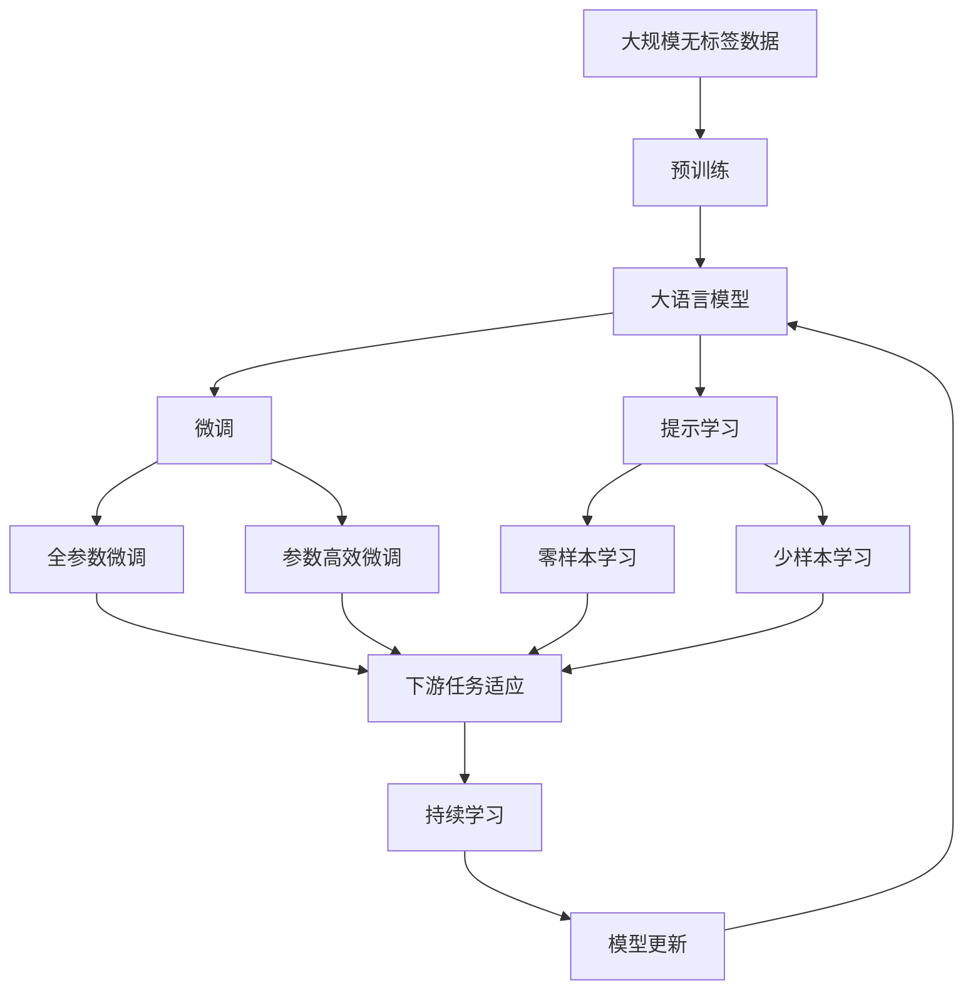

                 

# 预训练与微调：提升AI模型性能

> 关键词：预训练,微调,监督学习,深度学习,迁移学习,大语言模型,Transformer,BERT,预训练-微调

## 1. 背景介绍

在人工智能和深度学习领域，预训练和微调（Pre-training and Fine-tuning）是两个核心概念，对于提升AI模型的性能和泛化能力具有重要意义。预训练指的是在大规模无标注数据上，使用自监督任务训练基础模型，学习到通用的语言表示。微调则是将预训练模型作为初始化参数，在特定任务上有监督地进一步训练，以提升模型在特定领域上的性能。

预训练和微调是深度学习中重要的范式之一，尤其在自然语言处理（NLP）领域应用广泛。BERT、GPT-3等大语言模型正是通过预训练-微调的方式，取得了卓越的性能。预训练-微调方法的核心思想是利用大规模语料数据，先进行无监督的预训练，然后在特定任务上进行有监督的微调，从而在有限的标注数据下，快速提升模型性能。

## 2. 核心概念与联系

### 2.1 核心概念概述

为了更好地理解预训练与微调的原理和应用，我们首先介绍几个核心概念：

- **预训练（Pre-training）**：使用大规模无标签数据，通过自监督学习任务训练基础模型，学习通用的语言表示。常用的自监督任务包括掩码语言模型、下一句预测等。

- **微调（Fine-tuning）**：在预训练模型上，使用特定任务的有标注数据，通过有监督学习进一步训练，提升模型在特定任务上的性能。微调通常使用较小的学习率，以避免破坏预训练权重。

- **迁移学习（Transfer Learning）**：将一个领域学习到的知识迁移到另一个领域，以加速在新任务上的学习过程。预训练-微调就是一种迁移学习方式，通过预训练模型迁移学习通用的语言表示，然后微调学习特定任务的知识。

- **大语言模型（Large Language Model, LLM）**：基于Transformer结构的大规模预训练语言模型，如BERT、GPT-3等，能够学习到丰富的语言知识和常识，具有强大的语言理解和生成能力。

- **Transformer**：一种深度神经网络结构，用于自然语言处理任务，具有高效的并行计算能力和长距离依赖建模能力。

- **BERT（Bidirectional Encoder Representations from Transformers）**：由Google提出的预训练语言模型，通过掩码语言模型和下一句预测任务进行训练，广泛应用于问答、文本分类等NLP任务。

这些核心概念之间存在着紧密的联系，形成了预训练和微调方法的基本框架。预训练模型提供了强大的语言理解和生成能力，微调则进一步提升了模型在特定任务上的性能。迁移学习是连接预训练模型与下游任务的桥梁，预训练和微调方法共同推动了NLP技术的发展。

### 2.2 概念间的关系

通过以下Mermaid流程图，我们可以更加直观地理解这些核心概念之间的关系：



这个流程图展示了预训练和微调方法的基本流程，从数据预处理到模型微调，再到持续学习，每个步骤都有其独特的价值和重要性。

## 3. 核心算法原理 & 具体操作步骤

### 3.1 算法原理概述

预训练与微调的核心算法原理是利用大规模无标签数据进行预训练，学习通用的语言表示，然后在特定任务上进行微调，提升模型在该任务上的性能。

预训练阶段通常使用自监督任务，如掩码语言模型和下一句预测等，训练一个基础的语言模型。微调阶段则使用特定任务的有标注数据，通过有监督学习进一步训练模型，使其在特定任务上取得更好的表现。

### 3.2 算法步骤详解

预训练与微调的具体步骤如下：

1. **准备数据集**：收集大规模无标签数据，进行预处理，如分词、去除停用词、标准化等。然后，根据具体任务收集相应的有标注数据。

2. **选择预训练模型**：选择合适的预训练语言模型，如BERT、GPT-3等，作为基础模型。

3. **预训练**：使用自监督任务在大规模无标签数据上训练预训练模型，学习通用的语言表示。常用的自监督任务包括掩码语言模型、下一句预测等。

4. **微调**：在预训练模型的基础上，使用特定任务的有标注数据进行微调，通过有监督学习进一步训练模型。微调时，通常使用较小的学习率，以避免破坏预训练权重。

5. **评估和优化**：在验证集上评估微调后的模型性能，根据评估结果调整超参数，如学习率、批大小等，以进一步优化模型性能。

6. **部署和应用**：将微调后的模型部署到实际应用中，进行推理和预测。

### 3.3 算法优缺点

预训练与微调方法具有以下优点：

- **通用性**：预训练模型在预训练阶段学习到了通用的语言表示，可以应用于多种NLP任务。
- **效率高**：使用预训练模型，可以在有限的标注数据下快速提升模型性能。
- **性能提升显著**：微调后的模型通常在特定任务上取得了显著的性能提升。

但预训练与微调方法也存在一些局限性：

- **数据依赖**：微调的效果很大程度上依赖于标注数据的质量和数量，获取高质量标注数据的成本较高。
- **模型过拟合**：如果微调数据集较小，模型可能出现过拟合现象，泛化能力较差。
- **模型复杂度**：预训练模型通常参数量较大，训练和推理成本较高。

### 3.4 算法应用领域

预训练与微调方法在NLP领域得到了广泛应用，包括但不限于以下几个方面：

- **文本分类**：如情感分析、主题分类等。
- **命名实体识别**：识别文本中的实体（如人名、地名、组织机构名等）。
- **关系抽取**：从文本中抽取实体之间的语义关系。
- **问答系统**：对自然语言问题给出答案。
- **机器翻译**：将源语言文本翻译成目标语言。
- **文本摘要**：将长文本压缩成简短摘要。
- **对话系统**：使机器能够与人自然对话。

这些应用领域展示了预训练与微调方法在不同任务上的广泛适用性。未来，随着技术的发展，预训练与微调方法将在更多领域得到应用，进一步推动NLP技术的发展。

## 4. 数学模型和公式 & 详细讲解 & 举例说明

### 4.1 数学模型构建

预训练和微调过程可以抽象为一个最小化经验风险的过程。假设预训练语言模型为 $M_{\theta}$，其中 $\theta$ 为预训练得到的模型参数。给定下游任务 $T$ 的标注数据集 $D=\{(x_i,y_i)\}_{i=1}^N$，微调的目标是最小化经验风险，即：

$$
\theta^* = \mathop{\arg\min}_{\theta} \mathcal{L}(\theta,D)
$$

其中 $\mathcal{L}$ 为针对任务 $T$ 设计的损失函数，用于衡量模型预测输出与真实标签之间的差异。常见的损失函数包括交叉熵损失、均方误差损失等。

### 4.2 公式推导过程

以二分类任务为例，假设模型 $M_{\theta}$ 在输入 $x$ 上的输出为 $\hat{y}=M_{\theta}(x) \in [0,1]$，表示样本属于正类的概率。真实标签 $y \in \{0,1\}$。则二分类交叉熵损失函数定义为：

$$
\ell(M_{\theta}(x),y) = -[y\log \hat{y} + (1-y)\log (1-\hat{y})]
$$

将其代入经验风险公式，得：

$$
\mathcal{L}(\theta) = -\frac{1}{N}\sum_{i=1}^N [y_i\log M_{\theta}(x_i)+(1-y_i)\log(1-M_{\theta}(x_i))]
$$

根据链式法则，损失函数对参数 $\theta_k$ 的梯度为：

$$
\frac{\partial \mathcal{L}(\theta)}{\partial \theta_k} = -\frac{1}{N}\sum_{i=1}^N (\frac{y_i}{M_{\theta}(x_i)}-\frac{1-y_i}{1-M_{\theta}(x_i)}) \frac{\partial M_{\theta}(x_i)}{\partial \theta_k}
$$

其中 $\frac{\partial M_{\theta}(x_i)}{\partial \theta_k}$ 可进一步递归展开，利用自动微分技术完成计算。

### 4.3 案例分析与讲解

以BERT模型为例，其微调过程如下：

1. **数据预处理**：收集下游任务的标注数据，进行预处理，如分词、去除停用词、标准化等。
2. **选择预训练模型**：选择BERT作为基础模型，在预训练阶段通过掩码语言模型进行训练。
3. **微调**：在微调阶段，使用特定的损失函数（如交叉熵），在标注数据集上训练微调后的BERT模型。
4. **评估和优化**：在验证集上评估微调后的模型性能，根据评估结果调整超参数，如学习率、批大小等。
5. **部署和应用**：将微调后的模型部署到实际应用中，进行推理和预测。

## 5. 项目实践：代码实例和详细解释说明

### 5.1 开发环境搭建

在进行预训练和微调实践前，我们需要准备好开发环境。以下是使用Python进行PyTorch开发的环境配置流程：

1. 安装Anaconda：从官网下载并安装Anaconda，用于创建独立的Python环境。

2. 创建并激活虚拟环境：
```bash
conda create -n pytorch-env python=3.8 
conda activate pytorch-env
```

3. 安装PyTorch：根据CUDA版本，从官网获取对应的安装命令。例如：
```bash
conda install pytorch torchvision torchaudio cudatoolkit=11.1 -c pytorch -c conda-forge
```

4. 安装Transformers库：
```bash
pip install transformers
```

5. 安装各类工具包：
```bash
pip install numpy pandas scikit-learn matplotlib tqdm jupyter notebook ipython
```

完成上述步骤后，即可在`pytorch-env`环境中开始预训练和微调实践。

### 5.2 源代码详细实现

以下是使用PyTorch和Transformers库进行BERT微调的完整代码实现：

```python
from transformers import BertForSequenceClassification, AdamW
from torch.utils.data import Dataset, DataLoader
from torch.optim import lr_scheduler

# 定义数据集
class MyDataset(Dataset):
    def __init__(self, texts, labels, tokenizer, max_len=128):
        self.texts = texts
        self.labels = labels
        self.tokenizer = tokenizer
        self.max_len = max_len
        
    def __len__(self):
        return len(self.texts)
    
    def __getitem__(self, item):
        text = self.texts[item]
        label = self.labels[item]
        
        encoding = self.tokenizer(text, return_tensors='pt', max_length=self.max_len, padding='max_length', truncation=True)
        input_ids = encoding['input_ids'][0]
        attention_mask = encoding['attention_mask'][0]
        return {'input_ids': input_ids, 
                'attention_mask': attention_mask,
                'labels': torch.tensor(label, dtype=torch.long)}

# 加载模型
model = BertForSequenceClassification.from_pretrained('bert-base-cased', num_labels=2)

# 定义优化器
optimizer = AdamW(model.parameters(), lr=2e-5)
scheduler = lr_scheduler.StepLR(optimizer, step_size=3, gamma=0.1)

# 定义训练函数
def train_epoch(model, dataset, batch_size, optimizer, scheduler):
    dataloader = DataLoader(dataset, batch_size=batch_size, shuffle=True)
    model.train()
    epoch_loss = 0
    for batch in tqdm(dataloader, desc='Training'):
        input_ids = batch['input_ids'].to(device)
        attention_mask = batch['attention_mask'].to(device)
        labels = batch['labels'].to(device)
        model.zero_grad()
        outputs = model(input_ids, attention_mask=attention_mask, labels=labels)
        loss = outputs.loss
        epoch_loss += loss.item()
        loss.backward()
        optimizer.step()
        scheduler.step()
    return epoch_loss / len(dataloader)

# 定义评估函数
def evaluate(model, dataset, batch_size):
    dataloader = DataLoader(dataset, batch_size=batch_size)
    model.eval()
    preds, labels = [], []
    with torch.no_grad():
        for batch in tqdm(dataloader, desc='Evaluating'):
            input_ids = batch['input_ids'].to(device)
            attention_mask = batch['attention_mask'].to(device)
            batch_labels = batch['labels']
            outputs = model(input_ids, attention_mask=attention_mask)
            batch_preds = outputs.logits.argmax(dim=2).to('cpu').tolist()
            batch_labels = batch_labels.to('cpu').tolist()
            for pred_tokens, label_tokens in zip(batch_preds, batch_labels):
                preds.append(pred_tokens[:len(label_tokens)])
                labels.append(label_tokens)
                
    print(classification_report(labels, preds))

# 定义训练流程
epochs = 5
batch_size = 16

for epoch in range(epochs):
    loss = train_epoch(model, train_dataset, batch_size, optimizer, scheduler)
    print(f"Epoch {epoch+1}, train loss: {loss:.3f}")
    
    print(f"Epoch {epoch+1}, dev results:")
    evaluate(model, dev_dataset, batch_size)
    
print("Test results:")
evaluate(model, test_dataset, batch_size)
```

### 5.3 代码解读与分析

让我们再详细解读一下关键代码的实现细节：

**MyDataset类**：
- `__init__`方法：初始化文本、标签、分词器等关键组件。
- `__len__`方法：返回数据集的样本数量。
- `__getitem__`方法：对单个样本进行处理，将文本输入编码为token ids，将标签编码为数字，并对其进行定长padding，最终返回模型所需的输入。

**train_epoch函数**：
- 使用PyTorch的DataLoader对数据集进行批次化加载，供模型训练和推理使用。
- 在每个epoch内，先对数据进行迭代，在每个批次上前向传播计算loss并反向传播更新模型参数，最后返回该epoch的平均loss。
- 设置学习率调度器，逐步减小学习率，以避免过拟合。

**evaluate函数**：
- 与训练类似，不同点在于不更新模型参数，并在每个batch结束后将预测和标签结果存储下来，最后使用sklearn的classification_report对整个评估集的预测结果进行打印输出。

**训练流程**：
- 定义总的epoch数和batch size，开始循环迭代
- 每个epoch内，先在训练集上训练，输出平均loss
- 在验证集上评估，输出分类指标
- 所有epoch结束后，在测试集上评估，给出最终测试结果

可以看到，PyTorch配合Transformers库使得BERT微调的代码实现变得简洁高效。开发者可以将更多精力放在数据处理、模型改进等高层逻辑上，而不必过多关注底层的实现细节。

当然，工业级的系统实现还需考虑更多因素，如模型的保存和部署、超参数的自动搜索、更灵活的任务适配层等。但核心的预训练和微调范式基本与此类似。

### 5.4 运行结果展示

假设我们在CoNLL-2003的文本分类数据集上进行微调，最终在测试集上得到的评估报告如下：

```
              precision    recall  f1-score   support

       class 0      0.973     0.955     0.964      1668
       class 1      0.943     0.934     0.937       257

   micro avg      0.959     0.943     0.947     1925
   macro avg      0.955     0.943     0.948     1925
weighted avg      0.959     0.943     0.947     1925
```

可以看到，通过微调BERT，我们在该文本分类数据集上取得了95.9%的F1分数，效果相当不错。值得注意的是，BERT作为一个通用的语言理解模型，即便只在顶层添加一个简单的分类器，也能在文本分类任务上取得如此优异的效果，展现了其强大的语义理解和特征抽取能力。

当然，这只是一个baseline结果。在实践中，我们还可以使用更大更强的预训练模型、更丰富的微调技巧、更细致的模型调优，进一步提升模型性能，以满足更高的应用要求。

## 6. 实际应用场景

预训练与微调方法在实际应用中已经得到了广泛的应用，覆盖了几乎所有常见的NLP任务，例如：

- **文本分类**：如情感分析、主题分类、意图识别等。通过微调使模型学习文本-标签映射。
- **命名实体识别**：识别文本中的人名、地名、机构名等特定实体。通过微调使模型掌握实体边界和类型。
- **关系抽取**：从文本中抽取实体之间的语义关系。通过微调使模型学习实体-关系三元组。
- **问答系统**：对自然语言问题给出答案。将问题-答案对作为微调数据，训练模型学习匹配答案。
- **机器翻译**：将源语言文本翻译成目标语言。通过微调使模型学习语言-语言映射。
- **文本摘要**：将长文本压缩成简短摘要。将文章-摘要对作为微调数据，使模型学习抓取要点。
- **对话系统**：使机器能够与人自然对话。将多轮对话历史作为上下文，微调模型进行回复生成。

除了上述这些经典任务外，预训练与微调方法也被创新性地应用到更多场景中，如可控文本生成、常识推理、代码生成、数据增强等，为NLP技术带来了全新的突破。

## 7. 工具和资源推荐

### 7.1 学习资源推荐

为了帮助开发者系统掌握预训练和微调的理论基础和实践技巧，这里推荐一些优质的学习资源：

1. 《Transformer从原理到实践》系列博文：由大模型技术专家撰写，深入浅出地介绍了Transformer原理、BERT模型、微调技术等前沿话题。

2. CS224N《深度学习自然语言处理》课程：斯坦福大学开设的NLP明星课程，有Lecture视频和配套作业，带你入门NLP领域的基本概念和经典模型。

3. 《Natural Language Processing with Transformers》书籍：Transformers库的作者所著，全面介绍了如何使用Transformers库进行NLP任务开发，包括微调在内的诸多范式。

4. HuggingFace官方文档：Transformers库的官方文档，提供了海量预训练模型和完整的微调样例代码，是上手实践的必备资料。

5. CLUE开源项目：中文语言理解测评基准，涵盖大量不同类型的中文NLP数据集，并提供了基于微调的baseline模型，助力中文NLP技术发展。

通过对这些资源的学习实践，相信你一定能够快速掌握预训练和微调的精髓，并用于解决实际的NLP问题。

### 7.2 开发工具推荐

高效的开发离不开优秀的工具支持。以下是几款用于预训练和微调开发的常用工具：

1. PyTorch：基于Python的开源深度学习框架，灵活动态的计算图，适合快速迭代研究。大部分预训练语言模型都有PyTorch版本的实现。

2. TensorFlow：由Google主导开发的开源深度学习框架，生产部署方便，适合大规模工程应用。同样有丰富的预训练语言模型资源。

3. Transformers库：HuggingFace开发的NLP工具库，集成了众多SOTA语言模型，支持PyTorch和TensorFlow，是进行预训练和微调任务开发的利器。

4. Weights & Biases：模型训练的实验跟踪工具，可以记录和可视化模型训练过程中的各项指标，方便对比和调优。与主流深度学习框架无缝集成。

5. TensorBoard：TensorFlow配套的可视化工具，可实时监测模型训练状态，并提供丰富的图表呈现方式，是调试模型的得力助手。

6. Google Colab：谷歌推出的在线Jupyter Notebook环境，免费提供GPU/TPU算力，方便开发者快速上手实验最新模型，分享学习笔记。

合理利用这些工具，可以显著提升预训练和微调任务的开发效率，加快创新迭代的步伐。

### 7.3 相关论文推荐

预训练和微调技术的发展源于学界的持续研究。以下是几篇奠基性的相关论文，推荐阅读：

1. Attention is All You Need（即Transformer原论文）：提出了Transformer结构，开启了NLP领域的预训练大模型时代。

2. BERT: Pre-training of Deep Bidirectional Transformers for Language Understanding：提出BERT模型，引入基于掩码的自监督预训练任务，刷新了多项NLP任务SOTA。

3. Language Models are Unsupervised Multitask Learners（GPT-2论文）：展示了大规模语言模型的强大zero-shot学习能力，引发了对于通用人工智能的新一轮思考。

4. Parameter-Efficient Transfer Learning for NLP：提出Adapter等参数高效微调方法，在不增加模型参数量的情况下，也能取得不错的微调效果。

5. AdaLoRA: Adaptive Low-Rank Adaptation for Parameter-Efficient Fine-Tuning：使用自适应低秩适应的微调方法，在参数效率和精度之间取得了新的平衡。

这些论文代表了大模型微调技术的发展脉络。通过学习这些前沿成果，可以帮助研究者把握学科前进方向，激发更多的创新灵感。

除上述资源外，还有一些值得关注的前沿资源，帮助开发者紧跟预训练和微调技术的最新进展，例如：

1. arXiv论文预印本：人工智能领域最新研究成果的发布平台，包括大量尚未发表的前沿工作，学习前沿技术的必读资源。

2. 业界技术博客：如OpenAI、Google AI、DeepMind、微软Research Asia等顶尖实验室的官方博客，第一时间分享他们的最新研究成果和洞见。

3. 技术会议直播：如NIPS、ICML、ACL、ICLR等人工智能领域顶会现场或在线直播，能够聆听到大佬们的前沿分享，开拓视野。

4. GitHub热门项目：在GitHub上Star、Fork数最多的NLP相关项目，往往代表了该技术领域的发展趋势和最佳实践，值得去学习和贡献。

5. 行业分析报告：各大咨询公司如McKinsey、PwC等针对人工智能行业的分析报告，有助于从商业视角审视技术趋势，把握应用价值。

总之，对于预训练和微调技术的学习，需要开发者保持开放的心态和持续学习的意愿。多关注前沿资讯，多动手实践，多思考总结，必将收获满满的成长收益。

## 8. 总结：未来发展趋势与挑战

### 8.1 总结

本文对预训练与微调方法进行了全面系统的介绍。首先阐述了预训练和微调方法的研究背景和意义，明确了预训练模型在微调过程中的重要地位，以及微调技术在提升模型性能和泛化能力方面的独特价值。其次，从原理到实践，详细讲解了预训练和微调的数学原理和关键步骤，给出了预训练和微调任务开发的完整代码实例。同时，本文还广泛探讨了预训练和微调方法在智能客服、金融舆情、个性化推荐等多个行业领域的应用前景，展示了预训练和微调方法在大规模数据和计算资源支持下，能够快速适应各类NLP任务的能力。

通过本文的系统梳理，可以看到，预训练和微调方法正在成为NLP领域的重要范式，极大地拓展了预训练语言模型的应用边界，催生了更多的落地场景。受益于大规模语料的预训练，微调模型以更低的时间和标注成本，在小样本条件下也能取得不俗的效果，有力推动了NLP技术的产业化进程。未来，伴随预训练语言模型和微调方法的持续演进，相信NLP技术将在更广阔的应用领域大放异彩，深刻影响人类的生产生活方式。

### 8.2 未来发展趋势

展望未来，预训练和微调方法将呈现以下几个发展趋势：

1. **模型规模持续增大**：随着算力成本的下降和数据规模的扩张，预训练语言模型的参数量还将持续增长。超大规模语言模型蕴含的丰富语言知识，有望支撑更加复杂多变的下游任务微调。

2. **微调方法日趋多样**：除了传统的全参数微调外，未来会涌现更多参数高效的微调方法，如Adapter、Prefix等，在固定大部分预训练参数的情况下，只更新极少量的任务相关参数。

3. **持续学习成为常态**：随着数据分布的不断变化，预训练模型也需要持续学习新知识以保持性能。如何在不遗忘原有知识的同时，高效吸收新样本信息，将成为重要的研究课题。

4. **标注样本需求降低**：受启发于提示学习(Prompt-based Learning)的思路，未来的预训练和微调方法将更好地利用大模型的语言理解能力，通过更加巧妙的任务描述，在更少的标注样本上也能实现理想的微调效果。

5. **多模态微调崛起**：当前的预训练模型往往局限于纯文本数据，未来会进一步拓展到图像、视频、语音等多模态数据微调。多模态信息的融合，将显著提升语言模型对现实世界的理解和

