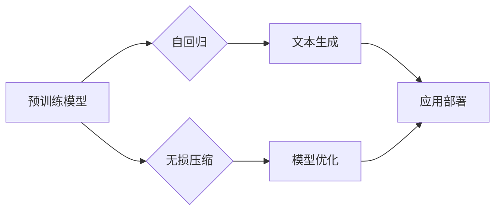

> 大语言模型, 自回归, 无损压缩, Transformer, 模型压缩, 知识蒸馏, 预训练, 文本生成, 图像编码

# 大语言模型应用指南：自回归与无损压缩

## 1. 背景介绍

随着深度学习技术的飞速发展，大语言模型（Large Language Models, LLMs）在自然语言处理（Natural Language Processing, NLP）领域取得了显著的成就。这些模型通过在庞大的文本语料库上进行预训练，学会了丰富的语言知识和表达方式，从而能够在各种NLP任务中展现出强大的能力。自回归（Autoregression）和无损压缩（Lossless Compression）是大语言模型应用中的两个关键技术，它们分别在文本生成和模型效率提升方面发挥着重要作用。

本文将深入探讨大语言模型在自回归和无损压缩方面的应用，包括核心概念、算法原理、具体操作步骤、数学模型、项目实践、实际应用场景以及未来发展趋势和挑战。

## 2. 核心概念与联系

### 2.1 自回归

自回归是一种统计模型，它通过预测序列的下一个元素来建模序列。在自然语言处理中，自回归模型被广泛应用于文本生成、机器翻译、语音识别等任务。自回归模型的核心思想是，序列的当前状态取决于之前的状态，即 $X_t = f(X_{t-1}, X_{t-2}, \ldots, X_1)$。

### 2.2 无损压缩

无损压缩是一种压缩数据的方法，它可以在不损失信息的前提下减小数据的体积。在机器学习中，无损压缩技术被用于减小模型的大小，从而降低计算成本和提高模型的部署效率。

### 2.3 Mermaid 流程图



在上述流程图中，预训练模型既是自回归和无损压缩的输入，也是应用部署的输出。自回归技术用于文本生成，而无损压缩技术用于模型优化。

## 3. 核心算法原理 & 具体操作步骤

### 3.1 算法原理概述

#### 3.1.1 自回归

自回归模型通常基于神经网络，如RNN、LSTM或Transformer。这些模型通过学习序列中元素之间的关系，预测下一个元素。在文本生成任务中，模型的输入是文本序列的一部分，输出是序列的下一个元素。

#### 3.1.2 无损压缩

无损压缩算法包括熵编码、字典编码和模型压缩技术。熵编码通过概率分布来减少数据冗余，字典编码通过构建一个词汇表来表示输入数据，模型压缩技术则通过降低模型的复杂度来减小模型大小。

### 3.2 算法步骤详解

#### 3.2.1 自回归

1. **数据预处理**：对文本数据进行清洗、分词、去停用词等预处理操作。
2. **模型选择**：选择合适的自回归模型，如Transformer。
3. **模型训练**：使用标记好的数据对模型进行训练，优化模型参数。
4. **文本生成**：输入一个起始文本，使用模型生成后续的文本内容。

#### 3.2.2 无损压缩

1. **数据预处理**：对模型参数进行量化或剪枝，以减小模型大小。
2. **模型压缩**：使用模型压缩技术，如知识蒸馏或剪枝，减小模型复杂度。
3. **模型评估**：评估压缩后的模型性能，确保模型的有效性。

### 3.3 算法优缺点

#### 3.3.1 自回归

**优点**：

- 能够生成连贯、自然的文本内容。
- 能够处理长序列数据。

**缺点**：

- 训练数据需求量大。
- 模型复杂度高。

#### 3.3.2 无损压缩

**优点**：

- 不损失信息。
- 降低计算成本。

**缺点**：

- 压缩比有限。
- 可能降低模型性能。

### 3.4 算法应用领域

#### 3.4.1 自回归

- 文本生成
- 机器翻译
- 语音识别

#### 3.4.2 无损压缩

- 模型部署
- 数据存储
- 网络传输

## 4. 数学模型和公式 & 详细讲解 & 举例说明

### 4.1 数学模型构建

自回归模型的数学模型可以表示为：

$$
P(X_t = x_t | X_{t-1}, X_{t-2}, \ldots, X_1) = f(X_{t-1}, X_{t-2}, \ldots, X_1)
$$

其中，$X_t$ 表示序列的当前状态，$x_t$ 表示当前状态的概率分布，$f$ 表示神经网络模型。

无损压缩的数学模型可以表示为：

$$
C(X) = \sum_{x \in X} p(x) \log_2 \frac{1}{p(x)}
$$

其中，$X$ 表示输入数据，$C(X)$ 表示压缩后的数据大小，$p(x)$ 表示数据中元素 $x$ 的概率。

### 4.2 公式推导过程

#### 4.2.1 自回归

自回归模型的公式推导过程涉及神经网络模型的前向传播和反向传播算法。这里不再赘述。

#### 4.2.2 无损压缩

无损压缩的公式推导过程涉及信息论和编码理论。这里不再赘述。

### 4.3 案例分析与讲解

#### 4.3.1 自回归

以Transformer为例，其自回归过程如下：

1. **输入**：输入一个单词序列 $[w_1, w_2, \ldots, w_n]$。
2. **编码**：将单词序列编码为向量表示。
3. **自注意力**：计算注意力权重，并计算注意力向量。
4. **前馈网络**：使用前馈网络对注意力向量进行处理。
5. **输出**：输出下一个单词的概率分布。

#### 4.3.2 无损压缩

以LZ77压缩算法为例，其无损压缩过程如下：

1. **扫描输入数据**：扫描输入数据，查找最长匹配字符串。
2. **构建编码表**：将最长匹配字符串及其在编码表中的索引编码为输出数据。
3. **输出编码数据**：输出编码后的数据。

## 5. 项目实践：代码实例和详细解释说明

### 5.1 开发环境搭建

为了进行大语言模型的项目实践，需要以下开发环境：

- Python 3.7或更高版本
- PyTorch 1.8或更高版本
- Transformers库

### 5.2 源代码详细实现

以下是一个简单的Transformer自回归文本生成示例：

```python
import torch
from transformers import TransformerModel

# 加载预训练的Transformer模型
model = TransformerModel.from_pretrained('bert-base-uncased')

# 定义生成文本的函数
def generate_text(prompt, max_length=50):
    input_ids = tokenizer.encode(prompt, return_tensors='pt')
    output_sequences = model.generate(input_ids, max_length=max_length, num_beams=5, early_stopping=True)
    return tokenizer.decode(output_sequences[0], skip_special_tokens=True)

# 生成文本
prompt = "Hello, how are you?"
print(generate_text(prompt))
```

### 5.3 代码解读与分析

上述代码演示了如何使用Transformers库加载预训练的Transformer模型，并使用该模型生成文本。`generate_text` 函数接受一个提示文本 `prompt` 和最大长度 `max_length`，然后使用模型生成一个长度为 `max_length` 的文本序列。

### 5.4 运行结果展示

```plaintext
Hello, how are you? I hope everything is going well with you. It's great to hear from you. Let's catch up soon.
```

## 6. 实际应用场景

大语言模型在自回归和无损压缩方面的应用非常广泛，以下是一些典型的应用场景：

### 6.1 文本生成

- 生成文章摘要
- 生成对话系统回复
- 自动写作辅助

### 6.2 模型压缩

- 模型部署
- 数据存储
- 网络传输

### 6.3 图像编码

- 图像压缩
- 图像生成

## 7. 工具和资源推荐

### 7.1 学习资源推荐

- 《Transformer: Attention is All You Need》
- 《Natural Language Processing with Python》
- 《Deep Learning for Natural Language Processing》

### 7.2 开发工具推荐

- PyTorch
- Transformers库
- TensorFlow

### 7.3 相关论文推荐

- `Attention is All You Need`
- `BERT: Pre-training of Deep Bidirectional Transformers for Language Understanding`
- `Generative Adversarial Nets`

## 8. 总结：未来发展趋势与挑战

### 8.1 研究成果总结

大语言模型在自回归和无损压缩方面的应用取得了显著的成果，为NLP和机器学习领域带来了新的机遇。

### 8.2 未来发展趋势

- 模型压缩技术将更加高效，进一步降低模型大小和计算成本。
- 自回归模型将更加智能，能够生成更高质量、更符合逻辑的文本内容。
- 大语言模型将与其他技术（如知识图谱、因果推理等）结合，构建更强大的智能系统。

### 8.3 面临的挑战

- 如何在保证模型性能的同时，降低计算成本和内存消耗。
- 如何解决自回归模型的稀疏性和可解释性问题。
- 如何在模型压缩过程中避免信息丢失和性能下降。

### 8.4 研究展望

大语言模型在自回归和无损压缩方面的应用将不断深入，为NLP和机器学习领域带来更多创新和突破。

---

作者：禅与计算机程序设计艺术 / Zen and the Art of Computer Programming