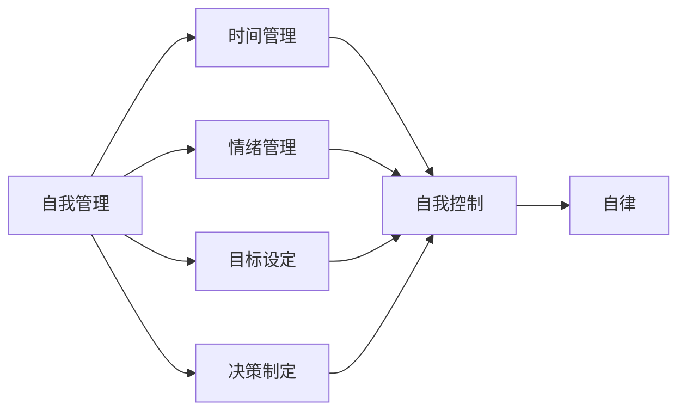

# 如何进行自我管理：如何提高自我控制和自律能力？

> 关键词：自我管理，自我控制，自律，习惯养成，时间管理，目标设定，决策制定

## 1. 背景介绍

在快节奏的现代生活中，自我管理成为了我们实现个人成长和职业成功的关键因素。自我控制是指个体在面对诱惑和挑战时，能够坚持自己的目标和原则，不被外界干扰的能力。自律则是个体在缺乏外部约束的情况下，依然能够按照预定计划行动的能力。本文将深入探讨自我管理和提高自我控制与自律能力的方法，帮助读者在个人和职业生活中取得更大的成功。

### 1.1 问题的由来

随着社会竞争的加剧，人们面临着越来越多的诱惑和挑战。工作压力、社交媒体、个人欲望等都可能成为我们实现目标的障碍。因此，如何进行有效的自我管理，提高自我控制和自律能力，成为了每个人都需要面对的问题。

### 1.2 研究现状

目前，关于自我管理和自律的研究已经相当丰富。心理学、管理学、教育学等多个领域都对这一问题进行了深入探讨。研究结果表明，自我管理和自律能力并非天生的，而是可以通过后天训练和实践逐步提高的。

### 1.3 研究意义

提高自我控制和自律能力对于个人的成长和发展具有重要意义。它可以帮助我们：

- 更有效地管理时间和资源
- 提高工作效率和创造力
- 增强决策力和问题解决能力
- 建立健康的个人生活和职业关系
- 实现个人目标和梦想

### 1.4 本文结构

本文将分为以下章节：

- 2. 核心概念与联系
- 3. 核心算法原理 & 具体操作步骤
- 4. 数学模型和公式 & 详细讲解 & 举例说明
- 5. 项目实践：代码实例和详细解释说明
- 6. 实际应用场景
- 7. 工具和资源推荐
- 8. 总结：未来发展趋势与挑战
- 9. 附录：常见问题与解答

## 2. 核心概念与联系

### 2.1 核心概念原理

自我管理、自我控制和自律是三个相互关联的核心概念。

- **自我管理**：是指个体对自己行为、情绪和认知过程进行有效调节的过程。它涵盖了时间管理、情绪管理、目标设定、决策制定等多个方面。
- **自我控制**：是自我管理的重要组成部分，指的是个体在面对诱惑和挑战时，能够抵制诱惑，坚持自己的目标和原则的能力。
- **自律**：是自我控制的最高形式，指的是个体在缺乏外部约束的情况下，依然能够按照预定计划行动的能力。

### 2.2 架构的 Mermaid 流程图



## 3. 核心算法原理 & 具体操作步骤

### 3.1 算法原理概述

自我管理和自律能力的提升是一个系统性的过程，需要从以下几个方面入手：

- **建立清晰的目标**：明确自己的长期和短期目标，制定可行的计划。
- **制定行动计划**：将目标分解为具体的行动步骤，设定完成时间。
- **时间管理**：合理安排时间，提高工作效率。
- **情绪管理**：学会识别和调节自己的情绪，保持积极的心态。
- **决策制定**：学会理性分析问题，做出明智的决策。
- **自我监控**：定期评估自己的行为和进度，及时调整计划。

### 3.2 算法步骤详解

#### 3.2.1 建立清晰的目标

1. **设定SMART目标**：确保目标具体、可衡量、可实现、相关性、时限性。
2. **分解目标**：将长期目标分解为短期目标，逐步实现。
3. **制定行动计划**：将短期目标转化为具体的行动步骤，设定完成时间。

#### 3.2.2 制定行动计划

1. **确定行动步骤**：将目标分解为具体的行动步骤。
2. **设定优先级**：根据重要性和紧急性对行动步骤进行排序。
3. **设定完成时间**：为每个行动步骤设定明确的完成时间。

#### 3.2.3 时间管理

1. **制定日程表**：合理安排每天的工作和生活，避免时间浪费。
2. **使用时间管理工具**：如番茄工作法、时间块等，提高工作效率。
3. **避免拖延**：识别导致拖延的原因，并采取相应措施。

#### 3.2.4 情绪管理

1. **识别情绪**：学会识别自己的情绪状态。
2. **情绪调节**：采取适当的措施调节情绪，如深呼吸、冥想、运动等。
3. **保持积极心态**：积极面对生活中的挑战。

#### 3.2.5 决策制定

1. **收集信息**：充分了解问题的各个方面。
2. **分析信息**：对收集到的信息进行分析和评估。
3. **制定方案**：根据分析结果制定可行的方案。
4. **评估方案**：对方案进行评估，选择最佳方案。

#### 3.2.6 自我监控

1. **定期评估**：定期评估自己的行为和进度。
2. **调整计划**：根据评估结果调整计划。
3. **持续改进**：不断优化自己的行为和习惯。

### 3.3 算法优缺点

#### 3.3.1 优点

- 系统性强：从多个方面入手，全面提高自我管理和自律能力。
- 实用性强：提供具体的操作步骤，易于实践。
- 可持续性强：通过持续的训练和实践，能够持续提升自我管理和自律能力。

#### 3.3.2 缺点

- 需要时间和耐心：自我管理和自律能力的提升是一个长期的过程，需要付出持续的努力。
- 需要自我反思：需要定期反思自己的行为和习惯，不断调整和改进。

### 3.4 算法应用领域

自我管理和自律能力的提升可以应用于以下领域：

- 个人成长：提高学习效率、提升职业技能、实现个人目标。
- 职业发展：提高工作效率、提升职业素养、实现职业目标。
- 生活管理：合理安排时间、管理财务、保持健康的生活方式。

## 4. 数学模型和公式 & 详细讲解 & 举例说明

### 4.1 数学模型构建

自我管理和自律能力的提升可以通过以下数学模型进行建模：

$$
\text{自我管理能力} = f(\text{目标设定}, \text{行动计划}, \text{时间管理}, \text{情绪管理}, \text{决策制定}, \text{自我监控})
$$

### 4.2 公式推导过程

该公式表明，自我管理能力是目标设定、行动计划、时间管理、情绪管理、决策制定和自我监控等多个因素的综合体现。

### 4.3 案例分析与讲解

假设小明想要提高自己的工作效率，他可以按照以下步骤进行自我管理：

1. **目标设定**：设定短期目标，如每天完成一定数量的工作任务。
2. **行动计划**：将目标分解为具体的行动步骤，如每天早晨制定计划、每完成一个任务勾选。
3. **时间管理**：使用番茄工作法，每工作25分钟后休息5分钟。
4. **情绪管理**：通过运动和冥想来保持积极的心态。
5. **决策制定**：在面对选择时，优先考虑对工作最有益的选项。
6. **自我监控**：每天晚上回顾自己的工作进度，总结经验教训。

通过以上步骤，小明可以逐步提高自己的工作效率，实现自我管理能力。

## 5. 项目实践：代码实例和详细解释说明

### 5.1 开发环境搭建

为了帮助读者更好地理解自我管理的过程，以下是一个简单的Python代码实例，用于跟踪个人目标完成情况。

```python
class SelfManagementTracker:
    def __init__(self, goals):
        self.goals = goals
        self.completion_status = {goal: 0 for goal in goals}

    def update_goal(self, goal, completed):
        if goal in self.goals:
            self.completion_status[goal] += completed

    def get_completion_status(self):
        return self.completion_status
```

### 5.2 源代码详细实现

上述代码定义了一个`SelfManagementTracker`类，用于跟踪个人目标的完成情况。

- `__init__`方法：初始化目标列表和完成状态字典。
- `update_goal`方法：更新特定目标的完成情况。
- `get_completion_status`方法：获取所有目标的完成情况。

### 5.3 代码解读与分析

该代码实例通过以下步骤实现自我管理的跟踪：

1. 创建`SelfManagementTracker`对象，传入目标列表。
2. 使用`update_goal`方法更新目标的完成情况。
3. 使用`get_completion_status`方法获取所有目标的完成情况。

### 5.4 运行结果展示

假设小明有以下目标：

- 每天阅读1小时
- 每天锻炼30分钟
- 每周完成3个编程任务

小明可以通过以下方式使用`SelfManagementTracker`类：

```python
tracker = SelfManagementTracker(['阅读', '锻炼', '编程'])

# 更新目标完成情况
tracker.update_goal('阅读', 1)  # 阅读完成1小时
tracker.update_goal('锻炼', 1)  # 锻炼完成1小时
tracker.update_goal('编程', 1)  # 编程完成1个任务

# 获取目标完成情况
print(tracker.get_completion_status())  # 输出：{'阅读': 1, '锻炼': 1, '编程': 1}
```

## 6. 实际应用场景

自我管理和自律能力在以下场景中具有重要意义：

- **学习**：提高学习效率，实现学习目标。
- **工作**：提高工作效率，实现工作目标。
- **健康**：保持健康的生活方式，实现健康目标。
- **生活**：合理安排时间，提高生活质量。

## 7. 工具和资源推荐

### 7.1 学习资源推荐

- **书籍**：
  - 《自控力》
  - 《原子习惯》
  - 《高效能人士的七个习惯》
- **在线课程**：
  - Coursera的《时间管理和自我管理》课程
  - Udemy的《提高自我控制力》课程
- **应用**：
  - Trello
  - Asana
  - Google Keep

### 7.2 开发工具推荐

- **时间管理工具**：
  - Todoist
  - Todo.txt
  - Microsoft To Do
- **情绪管理工具**：
  - Headspace
  - Calm
  - MyLife Meditation

### 7.3 相关论文推荐

- **《自我控制的力量》**
- **《习惯的力量》**
- **《意志力》**

## 8. 总结：未来发展趋势与挑战

### 8.1 研究成果总结

本文从自我管理、自我控制和自律能力三个方面，探讨了如何进行有效的自我管理，提高自我控制和自律能力。通过建立清晰的目标、制定行动计划、时间管理、情绪管理、决策制定和自我监控等步骤，我们可以逐步提升自我管理和自律能力，实现个人和职业目标。

### 8.2 未来发展趋势

随着人工智能、大数据和云计算等技术的发展，自我管理和自律能力的研究将朝着以下方向发展：

- **个性化自我管理**：根据个体的特点和需求，提供个性化的自我管理方案。
- **智能自我管理**：利用人工智能技术，实现自动化的自我管理，如自动记录行为、提供反馈等。
- **跨领域自我管理**：将自我管理方法应用于更多领域，如教育、医疗、心理健康等。

### 8.3 面临的挑战

尽管自我管理和自律能力的研究取得了显著进展，但仍然面临着以下挑战：

- **个体差异**：每个人的特点和需求不同，需要开发更具针对性的自我管理方法。
- **技术挑战**：如何利用人工智能、大数据等技术开发出有效的自我管理工具。
- **伦理挑战**：如何确保自我管理工具的隐私保护和数据安全。

### 8.4 研究展望

未来，自我管理和自律能力的研究将更加注重以下方面：

- **跨学科研究**：结合心理学、管理学、教育学等多学科知识，开发更具科学性的自我管理方法。
- **技术融合**：将人工智能、大数据、云计算等技术与自我管理相结合，实现智能化、个性化的自我管理。
- **社会应用**：将自我管理方法应用于更广泛的领域，推动社会进步。

## 9. 附录：常见问题与解答

**Q1：如何设定SMART目标？**

A：SMART目标是指具体、可衡量、可实现、相关性、时限性的目标。例如，设定目标“每天阅读1小时”，可以改为“每天阅读1小时，选择一本专业书籍，阅读前20页”。

**Q2：如何提高时间管理能力？**

A：可以使用以下方法提高时间管理能力：
- 制定日程表，合理安排每天的工作和生活。
- 使用时间管理工具，如番茄工作法、时间块等。
- 避免拖延，识别导致拖延的原因，并采取相应措施。

**Q3：如何提高情绪管理能力？**

A：可以使用以下方法提高情绪管理能力：
- 学会识别自己的情绪状态。
- 采取适当的措施调节情绪，如深呼吸、冥想、运动等。
- 保持积极的心态，积极面对生活中的挑战。

**Q4：如何提高决策制定能力？**

A：可以使用以下方法提高决策制定能力：
- 收集信息，充分了解问题的各个方面。
- 分析信息，对收集到的信息进行分析和评估。
- 制定方案，根据分析结果制定可行的方案。
- 评估方案，对方案进行评估，选择最佳方案。

**Q5：如何提高自我监控能力？**

A：可以使用以下方法提高自我监控能力：
- 定期评估自己的行为和进度。
- 根据评估结果调整计划。
- 持续改进自己的行为和习惯。

作者：禅与计算机程序设计艺术 / Zen and the Art of Computer Programming