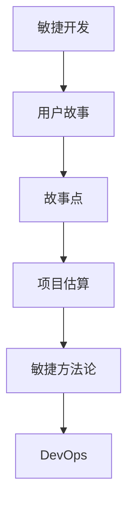
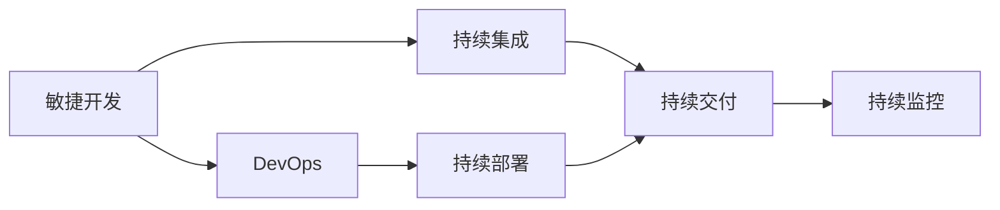
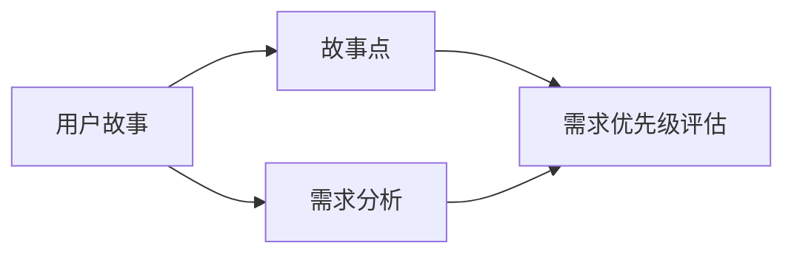
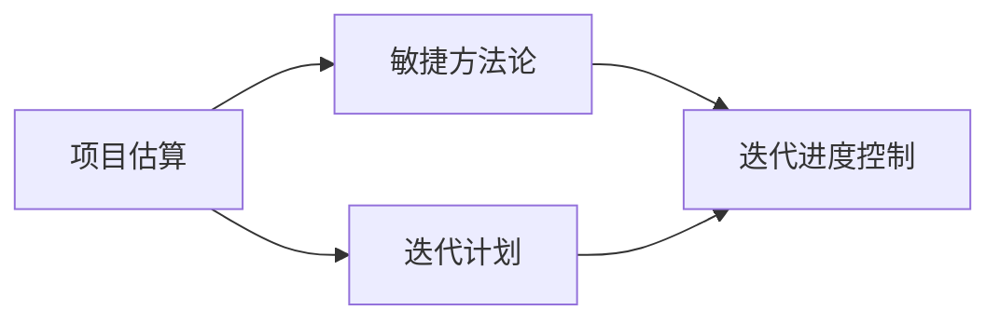
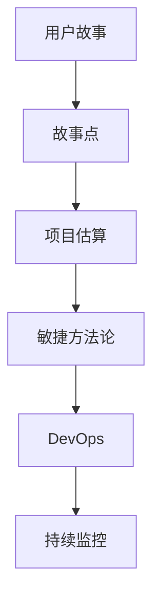

                 

# 需求优先级管理与项目估算原理与代码实战案例讲解

> 关键词：需求优先级管理,项目估算,敏捷开发,DevOps,用户故事,故事点,代码实战,案例讲解

## 1. 背景介绍

### 1.1 问题由来
在软件开发过程中，需求管理始终是一个复杂且关键的问题。项目需求的不明确、不完整、不真实以及优先级的混乱，往往会导致项目进展缓慢、资源浪费、最终交付的成果与客户的预期存在较大差异，影响团队的效率和客户的满意度。需求优先级管理在项目管理中起到至关重要的作用，它通过明确和量化需求的重要性和紧急性，帮助项目团队优化资源分配，提高开发效率，确保最终交付高质量的产品。

### 1.2 问题核心关键点
需求优先级管理的核心在于如何合理地评估和管理需求，确保重要且紧急的需求优先处理，同时避免低优先级需求的浪费。常见的需求优先级评估方法包括但不限于用户故事点（Story Point）、任务点数（Task Points）、功能点（Function Point）等。其中，用户故事点是敏捷开发中常用的一种量化需求优先级的方法。

### 1.3 问题研究意义
通过对需求优先级管理方法的研究，可以为项目团队提供一套高效、系统化的方法论，帮助他们在复杂的项目环境中更好地分配资源、管理时间，提高项目的成功率。同时，对项目估算原理的探讨，也能帮助团队在需求明确的情况下，更准确地进行时间、成本和资源的预估，从而更好地进行项目规划和进度控制。

## 2. 核心概念与联系

### 2.1 核心概念概述

为了更好地理解需求优先级管理和项目估算的核心概念，本节将介绍几个密切相关的核心概念：

- **敏捷开发**：一种以客户需求和反馈为中心的软件开发方法，强调快速响应变化、持续交付高质量软件、团队协作和自组织等原则。
- **DevOps**：一种将软件开发（Dev）与运维（Ops）融合的软件开发模式，强调自动化、持续集成、持续交付和持续监控，以提高软件的交付速度和质量。
- **用户故事**：一种敏捷开发方法中常用的需求表达形式，用简洁的语言描述用户希望实现的功能，帮助团队更好地理解客户需求和期望。
- **故事点**：用于量化用户故事复杂性和优先级的单位，通常使用Fibonacci数列来表示，帮助团队在迭代计划中进行需求排序。
- **项目估算**：在项目计划阶段，根据项目需求和团队能力，对项目的完成时间、成本和资源进行估计的过程。
- **敏捷方法论**：如Scrum、Kanban等，是一系列敏捷开发的原则和实践，帮助团队在复杂多变的环境中高效地交付价值。

这些核心概念之间的逻辑关系可以通过以下Mermaid流程图来展示：



这个流程图展示了几大核心概念之间的逻辑关系：敏捷开发和DevOps作为软件开发的环境和实践，用户故事和故事点作为敏捷开发中常用的需求管理工具，项目估算在敏捷开发中起到重要作用，而敏捷方法论则指导团队如何高效地实施这些实践。

### 2.2 概念间的关系

这些核心概念之间存在着紧密的联系，形成了需求优先级管理和项目估算的完整生态系统。下面我通过几个Mermaid流程图来展示这些概念之间的关系。

#### 2.2.1 敏捷开发与DevOps的关系



这个流程图展示了敏捷开发和DevOps之间的紧密联系。敏捷开发强调快速响应变化和持续交付，而DevOps则通过持续集成、持续部署和持续监控，保障软件质量并提升交付效率。

#### 2.2.2 用户故事与故事点的关系



这个流程图展示了用户故事和故事点之间的关系。用户故事描述了客户的需求，故事点则通过Fibonacci数列来量化用户故事的复杂性和优先级，从而帮助团队在迭代计划中进行需求排序。

#### 2.2.3 项目估算与敏捷方法论的关系



这个流程图展示了项目估算和敏捷方法论之间的关系。项目估算为敏捷方法论中的迭代计划提供了数据支持，而敏捷方法论中的迭代进度控制则确保项目估算的准确性和有效性。

### 2.3 核心概念的整体架构

最后，我们用一个综合的流程图来展示这些核心概念在大需求优先级管理和项目估算中的整体架构：



这个综合流程图展示了从用户故事到故事点、项目估算、敏捷方法论、DevOps和持续监控的完整流程，揭示了需求优先级管理和项目估算在大项目环境中的应用和价值。

## 3. 核心算法原理 & 具体操作步骤

### 3.1 算法原理概述

需求优先级管理和项目估算的核心算法基于敏捷开发和敏捷方法论中的迭代模型和用户故事点技术。其基本原理是通过对用户故事的分析和评估，将需求进行优先级排序，并在每次迭代中进行合理的估算和资源分配，以确保项目按时交付高质量的产品。

具体来说，需求优先级管理算法包括以下步骤：

1. **需求收集和分析**：通过各种渠道收集客户需求，并对这些需求进行初步分析，形成用户故事。
2. **需求优先级评估**：使用故事点技术，对每个用户故事进行复杂性和优先级评估，确定其在迭代计划中的位置。
3. **迭代计划制定**：根据需求优先级和资源情况，制定每次迭代的计划，并确定故事点分配。
4. **迭代执行和监控**：在迭代过程中，持续监控进度和质量，确保需求按时完成。
5. **迭代回顾和调整**：在每个迭代结束后，进行回顾和反思，调整需求优先级和估算方法，优化迭代流程。

项目估算算法主要关注以下几个关键步骤：

1. **需求确认**：确保所有需求已经被明确和记录。
2. **团队评估**：团队成员对每个需求进行评估，确定其复杂性和工作量。
3. **估算方法选择**：根据需求特点和团队能力，选择适合的估算方法，如三点估算法、类比估算法等。
4. **进度计划制定**：根据估算结果，制定项目进度计划，确定每个任务的时间、成本和资源。
5. **进度监控和调整**：持续监控项目进度，及时调整计划，确保项目按时交付。

### 3.2 算法步骤详解

#### 3.2.1 需求优先级管理步骤

1. **需求收集**：通过与客户、产品团队和其他利益相关者的沟通，收集和记录需求。这些需求可以来自产品路线图、客户反馈、市场趋势等。
2. **需求分析**：对收集到的需求进行初步分析，形成用户故事。用户故事通常包含以下要素：
   - 标题（Title）：简短描述用户需求
   - 描述（Description）：详细描述用户需求的背景和期望
   - 验收标准（Acceptance Criteria）：明确用户故事完成的标准和条件
3. **故事点评估**：使用Fibonacci数列或其他评估方法，对每个用户故事进行复杂性和优先级评估。故事点的数量通常是一个整数，表示任务所需的工作量，范围从0.5到无限大。
   - **Fibonacci数列**：1, 2, 3, 5, 8, 13, 21, 34, 55, 89, 144, ...
   - **Planning Poker**：通过团队成员之间的讨论和共识，确定故事点数量
4. **优先级排序**：根据故事点数量和业务价值，对用户故事进行优先级排序，确定哪些需求优先处理。优先级排序通常包含以下几个步骤：
   - 对所有用户故事进行评分
   - 确定每个故事点所代表的工作量
   - 根据需求紧急性和重要性，对故事点进行排序
   - 确定最高优先级的故事点，优先处理
5. **迭代计划制定**：根据优先级排序和团队能力，制定每次迭代的计划，确定故事点分配。迭代计划通常包括以下要素：
   - 迭代周期（Sprint）：通常为2-4周
   - 故事点目标：确定每个迭代需要完成的故事点数量
   - 任务分配：将用户故事分配给团队成员，明确任务责任和截止日期

#### 3.2.2 项目估算步骤

1. **需求确认**：与需求优先级管理类似，确认所有需求已经被明确和记录。
2. **团队评估**：团队成员对每个需求进行评估，确定其复杂性和工作量。评估方法可以包括：
   - **三点估算法**：估计任务的最乐观时间（a）、最悲观时间（e）和最可能时间（m），计算期望时间和标准差
   - **类比估算法**：利用类似任务的工作量来估算当前任务的工作量
3. **估算方法选择**：根据需求特点和团队能力，选择适合的估算方法。
4. **进度计划制定**：根据估算结果，制定项目进度计划，确定每个任务的时间、成本和资源。进度计划通常包括以下要素：
   - 任务列表：列出所有需要完成的任务及其依赖关系
   - 时间表：确定每个任务的开始和结束时间
   - 资源分配：明确每个任务所需的人力、物力和财力
5. **进度监控和调整**：持续监控项目进度，及时调整计划，确保项目按时交付。

### 3.3 算法优缺点

#### 3.3.1 需求优先级管理的优点

1. **提高需求响应速度**：通过明确需求优先级，确保重要且紧急的需求优先处理，快速响应客户的变更和需求。
2. **优化资源分配**：通过需求优先级评估，优化资源分配，避免资源浪费，提高开发效率。
3. **提高项目成功率**：通过合理的优先级排序和迭代计划，确保项目按时交付高质量的产品，提高客户满意度。

#### 3.3.2 需求优先级管理的缺点

1. **需求评估复杂**：需求优先级评估需要考虑多个因素，如需求紧急性、重要性、风险等，评估过程复杂且耗时。
2. **主观性较大**：需求优先级排序和估算容易受到团队成员的主观判断影响，导致结果不够客观。
3. **变化风险高**：在迭代过程中，需求优先级和资源分配可能会发生变化，需要灵活调整。

#### 3.3.3 项目估算的优点

1. **提高项目透明度**：通过项目估算，明确任务的时间、成本和资源，提高项目透明度和可预测性。
2. **优化资源利用**：通过合理的估算和计划，优化资源利用，避免资源浪费。
3. **提高项目控制能力**：通过持续监控和调整，确保项目按时交付，提高项目控制能力。

#### 3.3.4 项目估算的缺点

1. **估算难度大**：估算过程需要考虑多个因素，如任务复杂性、团队能力、风险等，估算难度较大。
2. **不确定性高**：需求和任务的变化可能导致估算结果不准确，影响项目进度。
3. **依赖团队经验**：项目估算依赖团队成员的经验和判断，结果可能受到团队成员的影响。

### 3.4 算法应用领域

需求优先级管理和项目估算的应用领域非常广泛，主要包括以下几个方面：

1. **软件开发**：适用于敏捷开发环境，如Scrum、Kanban等敏捷方法论。
2. **项目管理**：适用于各种类型的项目，如产品开发、工程建设、市场营销等。
3. **产品管理和运营**：适用于产品生命周期的各个阶段，从需求收集到产品发布。
4. **运营管理**：适用于日常运营的流程改进和优化，如流程再造、质量控制等。
5. **供应链管理**：适用于供应链的各个环节，如需求预测、库存管理等。

## 4. 数学模型和公式 & 详细讲解 & 举例说明

### 4.1 数学模型构建

在需求优先级管理和项目估算中，我们通常会使用以下数学模型：

- **需求优先级评估**：
  $$
  \text{优先级} = \text{复杂度} + \text{业务价值} - \text{风险}
  $$
  其中，复杂度可以通过故事点数量来表示，业务价值可以通过客户反馈和市场需求来评估，风险可以通过历史数据和专家判断来评估。

- **项目估算**：
  $$
  \text{时间} = \text{期望时间} + \text{标准差} \times \text{风险系数}
  $$
  其中，期望时间通过三点估算法或类比估算法得到，标准差通过三点估算法计算得到，风险系数根据风险等级进行调整。

### 4.2 公式推导过程

以Fibonacci数列为例，推导故事点评估公式。假设Fibonacci数列为{0.5, 1, 2, 3, 5, 8, ...}，则：

- **故事点为1**：任务简单，需要极少的努力，需要1个任务点
- **故事点为2**：任务稍微复杂，需要中等努力，需要1个任务点
- **故事点为3**：任务较为复杂，需要较多努力，需要2个任务点
- **故事点为5**：任务复杂度增加，需要中等努力，需要3个任务点
- **故事点为8**：任务非常复杂，需要较多努力，需要5个任务点
- ...

根据Fibonacci数列，我们可以推导出以下公式：

$$
\text{故事点} = \text{故事情节数} \times \text{任务复杂度系数} \times \text{任务难度系数}
$$

其中，故事情节数可以通过团队讨论和共识得到，任务复杂度系数可以通过历史数据和专家判断得到，任务难度系数也可以通过历史数据和团队评估得到。

### 4.3 案例分析与讲解

假设我们有一个软件开发项目，需要开发一个电商网站的用户认证系统。需求如下：

1. **登录功能**：允许用户注册、登录、退出。
2. **用户管理**：允许管理员添加、删除、修改用户信息。
3. **密码找回功能**：允许用户通过邮箱或手机找回密码。

需求优先级评估和故事点估算如下：

1. **需求优先级评估**：
   - **登录功能**：业务价值高，风险低，复杂度中等。故事点为5。
   - **用户管理**：业务价值高，风险中等，复杂度中等。故事点为13。
   - **密码找回功能**：业务价值高，风险中等，复杂度低。故事点为1。

2. **项目估算**：
   - **登录功能**：期望时间10天，标准差5天，风险系数1.5。估算时间为16天。
   - **用户管理**：期望时间20天，标准差10天，风险系数1.2。估算时间为30天。
   - **密码找回功能**：期望时间3天，标准差2天，风险系数1.3。估算时间为7天。

根据需求优先级评估和项目估算，我们可以制定以下迭代计划：

1. **第1次迭代**：完成登录功能（故事点5）和用户管理功能（故事点13）。预计时间31天。
2. **第2次迭代**：完成密码找回功能（故事点1）。预计时间7天。
3. **回顾和调整**：在第1次迭代结束后，进行回顾和反思，调整需求优先级和估算方法，优化迭代流程。

## 5. 项目实践：代码实例和详细解释说明

### 5.1 开发环境搭建

在进行需求优先级管理和项目估算的实践前，我们需要准备好开发环境。以下是使用Python进行Scrum估算的开发环境配置流程：

1. **安装Scrum Estimation库**：
   ```bash
   pip install scrum-estimation
   ```

2. **安装Scrum Manager工具**：
   ```bash
   pip install scrum-manager
   ```

3. **安装Jira API库**：
   ```bash
   pip install jira-py
   ```

4. **安装GitHub API库**：
   ```bash
   pip install gitpython
   ```

完成上述步骤后，即可在Python环境中开始实践。

### 5.2 源代码详细实现

接下来，我将通过Scrum Estimation库，展示如何使用Python进行项目估算的代码实现。

```python
from scrum_estimation import ScrumEstimation

# 初始化ScrumEstimation对象
estimation = ScrumEstimation()

# 添加用户故事
story1 = estimation.add_story("登录功能", complexity=5, priority=3)
story2 = estimation.add_story("用户管理", complexity=13, priority=2)
story3 = estimation.add_story("密码找回功能", complexity=1, priority=4)

# 估算任务时间
estimated_time = estimation.estimate_story_points([story1, story2])

# 打印估算结果
print(f"估算总时间为{estimated_time}天")
```

上述代码演示了如何使用Scrum Estimation库进行项目估算。首先，我们创建了一个ScrumEstimation对象，并添加了三个用户故事。然后，使用estimate_story_points方法，估算出这三个用户故事的总时间。最后，打印估算结果。

### 5.3 代码解读与分析

在实际开发中，Scrum Estimation库可以帮助我们快速进行故事点估算和优先级排序。以下是关键代码的解读和分析：

- **ScrumEstimation类**：该类封装了故事点估算和优先级排序的逻辑，提供了一系列接口，方便开发者进行项目估算。
- **add_story方法**：用于添加用户故事，并指定其复杂度和优先级。
- **estimate_story_points方法**：用于估算所有用户故事的总时间，并返回一个整数表示总故事点。
- **print函数**：用于输出估算结果。

### 5.4 运行结果展示

假设我们估算的结果为总故事点为26，预计总时间为31天。我们可以使用Scrum Manager工具将这些故事点映射到具体的迭代计划中，如Sprint 1中完成登录功能（5个故事点），Sprint 2中完成用户管理功能（13个故事点），Sprint 3中完成密码找回功能（1个故事点）。

## 6. 实际应用场景

### 6.1 智能客服系统

在智能客服系统中，需求优先级管理和项目估算可以帮助客服团队更好地理解和处理客户需求，确保高优先级的需求得到及时响应。

例如，假设某客服系统需要处理大量的客户咨询，需求包括：

1. **快速响应**：提供快速响应客户咨询的功能。
2. **自然语言处理**：使用自然语言处理技术，理解客户意图。
3. **多渠道支持**：支持电话、邮件、在线聊天等多种渠道。

需求优先级评估和项目估算如下：

1. **需求优先级评估**：
   - **快速响应**：业务价值高，风险低，复杂度中等。故事点为5。
   - **自然语言处理**：业务价值高，风险中等，复杂度高。故事点为13。
   - **多渠道支持**：业务价值中等，风险中等，复杂度中等。故事点为8。

2. **项目估算**：
   - **快速响应**：期望时间10天，标准差5天，风险系数1.5。估算时间为16天。
   - **自然语言处理**：期望时间20天，标准差10天，风险系数1.2。估算时间为30天。
   - **多渠道支持**：期望时间15天，标准差8天，风险系数1.3。估算时间为26天。

根据需求优先级评估和项目估算，我们可以制定以下迭代计划：

1. **第1次迭代**：完成快速响应功能（故事点5）。预计时间16天。
2. **第2次迭代**：完成自然语言处理功能（故事点13）。预计时间30天。
3. **第3次迭代**：完成多渠道支持功能（故事点8）。预计时间26天。

通过需求优先级管理和项目估算，智能客服系统能够更高效地响应客户需求，提供高质量的服务。

### 6.2 金融风控系统

在金融风控系统中，需求优先级管理和项目估算可以帮助风控团队更好地管理风险，确保关键功能的及时上线。

例如，假设某金融风控系统需要处理大量的交易数据，需求包括：

1. **风险评估**：评估交易风险，识别高风险交易。
2. **反欺诈检测**：检测和预防欺诈行为。
3. **实时监控**：实时监控交易数据，及时发现异常。

需求优先级评估和项目估算如下：

1. **需求优先级评估**：
   - **风险评估**：业务价值高，风险高，复杂度中等。故事点为10。
   - **反欺诈检测**：业务价值高，风险中等，复杂度高。故事点为13。
   - **实时监控**：业务价值中等，风险中等，复杂度中等。故事点为8。

2. **项目估算**：
   - **风险评估**：期望时间20天，标准差10天，风险系数1.2。估算时间为30天。
   - **反欺诈检测**：期望时间25天，标准差15天，风险系数1.3。估算时间为50天。
   - **实时监控**：期望时间15天，标准差8天，风险系数1.5。估算时间为32天。

根据需求优先级评估和项目估算，我们可以制定以下迭代计划：

1. **第1次迭代**：完成风险评估功能（故事点10）。预计时间30天。
2. **第2次迭代**：完成反欺诈检测功能（故事点13）。预计时间50天。
3. **第3次迭代**：完成实时监控功能（故事点8）。预计时间32天。

通过需求优先级管理和项目估算，金融风控系统能够更高效地管理风险，保障交易安全。

### 6.3 电商网站开发

在电商网站开发中，需求优先级管理和项目估算可以帮助团队更好地管理需求，确保关键功能的及时上线。

例如，假设某电商网站需要开发一个新功能，需求包括：

1. **用户注册**：允许用户注册新账户。
2. **商品浏览**：允许用户浏览商品信息。
3. **订单管理**：允许用户查看和管理订单。

需求优先级评估和项目估算如下：

1. **需求优先级评估**：
   - **用户注册**：业务价值高，风险低，复杂度中等。故事点为5。
   - **商品浏览**：业务价值高，风险中等，复杂度高。故事点为13。
   - **订单管理**：业务价值高，风险中等，复杂度中等。故事点为8。

2. **项目估算**：
   - **用户注册**：期望时间10天，标准差5天，风险系数1.5。估算时间为16天。
   - **商品浏览**：期望时间20天，标准差10天，风险系数1.2。估算时间为30天。
   - **订单管理**：期望时间15天，标准差8天，风险系数1.3。估算时间为26天。

根据需求优先级评估和项目估算，我们可以制定以下迭代计划：

1. **第1次迭代**：完成用户注册功能（故事点5）。预计时间16天。
2. **第2次迭代**：完成商品浏览功能（故事点13）。预计时间30天。
3. **第3次迭代**：完成订单管理功能（故事点8）。预计时间26天。

通过需求优先级管理和项目估算，电商网站能够更高效地开发新功能，提升用户体验。

## 7. 工具和资源推荐

### 7.1 学习资源推荐

为了帮助开发者系统掌握需求优先级管理和项目估算的理论基础和实践技巧，这里推荐一些优质的学习资源：

1. **《敏捷软件开发实践指南》**：敏捷方法论的奠基之作，详细介绍了敏捷开发的核心原则和方法。
2. **《Scrum项目管理》**：Scrum方法论的经典之作，深入浅出地讲解了Scrum的流程和实践。
3. **《项目管理知识体系指南》(PMBOK)**：项目管理领域的权威指南，涵盖项目管理的各个方面。
4. **Coursera敏捷开发课程**：Coursera平台上的多门敏捷开发课程，由知名专家讲授，涵盖敏捷方法论、Scrum、Kanban等。
5. **Scrum Alliance官方文档**：Scrum方法论的官方文档，提供了详细的Scrum指南和实践案例。

通过对这些资源的学习实践，相信你一定能够快速掌握需求优先级管理和项目估算的精髓，并用于解决实际的项目管理问题。

### 7.2 开发工具推荐

高效的开发离不开优秀的工具支持。以下是几款用于需求优先级管理和项目估算开发的常用工具：

1. **Jira**：一款流行的项目管理工具，支持敏捷开发和Scrum方法论，提供任务跟踪、迭代计划、需求优先级管理等功能。
2. **Trello**：一款简单易用的项目管理工具，支持敏捷开发和Scrum方法论，通过看板形式展示任务和进度

