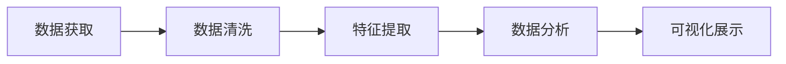

                 

# 基于Python的网络书籍数据可视化分析

> 关键词：网络书籍,数据可视化,Python,自然语言处理,NLP,深度学习

## 1. 背景介绍

### 1.1 问题由来

近年来，随着网络技术的发展和普及，在线图书市场得到了迅速的发展。网络书籍的丰富内容、便利的阅读方式、低廉的获取成本，吸引了越来越多读者的青睐。然而，面对海量的书籍资源，如何高效地进行内容分析和推荐，成为了一个亟待解决的问题。

### 1.2 问题核心关键点

网络书籍数据分析的核心在于从海量文本数据中提取出有用的信息，并对这些信息进行可视化展示，从而辅助用户进行内容理解和选择。具体而言，网络书籍数据分析需要解决以下几个关键问题：

- 数据获取：如何从网络平台如Amazon、豆瓣读书等获取高质量的书籍数据。
- 数据清洗：如何对采集到的数据进行预处理，去除噪声和无用信息。
- 特征提取：如何从书籍文本中提取有意义的特征，如关键词、主题、作者等。
- 数据分析：如何对提取到的特征进行统计分析，发现书籍之间的关系和趋势。
- 可视化展示：如何通过图表、词云、热力图等形式将分析结果直观展示，辅助用户决策。

### 1.3 问题研究意义

网络书籍数据分析对于提升网络图书服务的质量，优化用户阅读体验具有重要意义：

- 内容推荐：通过分析用户阅读历史和偏好，推荐最适合的书籍，提高用户满意度。
- 用户画像：通过用户评论和评分，了解用户兴趣和需求，进行个性化推荐。
- 书籍价值评估：通过书籍统计指标，如销量、评分、评论等，评估书籍的市场价值和口碑。
- 市场洞察：通过对书籍热门主题和趋势的统计，洞察市场变化和需求动向，指导出版商和运营商进行战略决策。

## 2. 核心概念与联系

### 2.1 核心概念概述

为了更好地理解网络书籍数据分析的原理和步骤，我们首先需要介绍一些核心概念：

- **网络书籍**：指在线平台提供的各类图书资源，包括电子书、有声书、漫画等。
- **数据可视化**：通过图表、地图、词云等方式将数据展示为直观的视觉形式，便于观察和理解。
- **Python**：一种高级编程语言，以其简洁、可读性强、跨平台性强等特点，成为数据科学和人工智能领域的宠儿。
- **自然语言处理 (NLP)**：研究计算机如何处理、理解、生成人类语言的技术，是网络书籍数据分析的重要工具。
- **深度学习**：一种机器学习技术，通过多层神经网络结构对数据进行特征提取和模式识别，适用于处理复杂的数据结构。

### 2.2 概念间的关系

这些核心概念之间存在紧密的联系，共同构成了网络书籍数据分析的基础：

1. **数据获取**：使用Python的网络爬虫工具，从网络平台获取书籍数据。
2. **数据清洗**：使用Python的数据处理库，如Pandas、NumPy等，对数据进行预处理和清洗。
3. **特征提取**：使用NLP工具和深度学习模型，从书籍文本中提取关键词、主题、作者等特征。
4. **数据分析**：使用Python的统计分析库，如SciPy、Matplotlib等，对提取到的特征进行统计分析和可视化。
5. **可视化展示**：使用Python的数据可视化库，如Matplotlib、Seaborn、Plotly等，将分析结果以图表、词云、热力图等形式展示。

这些概念的相互配合，可以高效地完成网络书籍数据分析，提升用户阅读体验，推动网络图书行业的健康发展。

### 2.3 核心概念的整体架构

为了更好地展示这些概念之间的关系，我们可以使用以下Mermaid流程图来描述：



这个流程图展示了从数据获取到可视化展示的全过程。在实际操作中，每个步骤都需要精心设计和优化，才能保证分析结果的准确性和可理解性。

## 3. 核心算法原理 & 具体操作步骤
### 3.1 算法原理概述

网络书籍数据分析的核心算法包括数据清洗、特征提取和可视化展示。其中，特征提取和可视化展示可以使用Python的NLP和数据可视化库来实现，数据清洗则需要根据具体数据特点进行定制化的处理。

### 3.2 算法步骤详解

下面，我们将详细讲解网络书籍数据分析的核心步骤。

**Step 1: 数据获取**

数据获取是网络书籍数据分析的第一步。常用的数据获取方法包括：

1. **爬虫技术**：使用Python的网络爬虫库，如BeautifulSoup、Scrapy等，从各大网络图书平台获取书籍数据。
2. **API接口**：一些网络平台提供了API接口，可以直接获取书籍信息，如Amazon、豆瓣读书等。
3. **公开数据集**：一些研究机构和公司发布了公开的数据集，可以直接用于分析，如Google Books Ngram Viewer等。

在实际操作中，需要根据数据平台的特点，选择合适的获取方法，并注意遵守相关法律法规和平台规则。

**Step 2: 数据清洗**

数据清洗是数据预处理的重要步骤，目的是去除噪声和无用信息，提高数据质量。常用的数据清洗方法包括：

1. **数据去重**：去除重复的书籍数据，避免数据冗余。
2. **缺失值处理**：填补或删除缺失数据，保持数据完整性。
3. **文本清洗**：去除文本中的标点、特殊字符、HTML标签等，保留有用的文本信息。
4. **停用词过滤**：去除常见的停用词，如“的”、“是”等，减少噪音干扰。

数据清洗的目的是提高数据的准确性和一致性，为后续的特征提取和分析奠定基础。

**Step 3: 特征提取**

特征提取是网络书籍数据分析的关键步骤，目的是从书籍文本中提取有意义的特征，如关键词、主题、作者等。常用的特征提取方法包括：

1. **词频统计**：统计文本中每个词汇的出现频率，提取关键词和常见词汇。
2. **主题建模**：使用LDA、LSI等主题模型，提取文本的主题分布。
3. **作者分析**：统计文本中出现的作者信息，分析作者的流行度和影响力。
4. **情感分析**：使用情感分析模型，识别文本的情感倾向，如积极、消极、中性等。

特征提取的结果可以用于内容推荐、用户画像、书籍价值评估等多个方面。

**Step 4: 数据分析**

数据分析是网络书籍数据分析的核心步骤，目的是对提取到的特征进行统计分析，发现书籍之间的关系和趋势。常用的数据分析方法包括：

1. **相关性分析**：统计不同特征之间的相关性，发现书籍之间的相似性和差异性。
2. **聚类分析**：使用聚类算法，将书籍分为不同的类别，发现书籍的集群趋势。
3. **回归分析**：建立回归模型，预测书籍的销量、评分等指标。
4. **时间序列分析**：分析书籍销量、评分等指标随时间的变化趋势，发现市场变化和季节性规律。

数据分析的结果可以用于内容推荐、用户画像、市场洞察等多个方面。

**Step 5: 可视化展示**

可视化展示是网络书籍数据分析的最终步骤，目的是将分析结果以直观的图表、词云、热力图等形式展示，便于观察和理解。常用的可视化工具包括：

1. **Matplotlib**：绘制各类图表，如柱状图、折线图、散点图等。
2. **Seaborn**：绘制更加美观的统计图表，如热力图、分布图等。
3. **Plotly**：绘制交互式图表，如动态图表、地图等。
4. **WordCloud**：生成词云，展示书籍关键词分布。

可视化展示的目的是将复杂的数据分析结果简化为易于理解的视觉形式，辅助用户进行决策和分析。

### 3.3 算法优缺点

网络书籍数据分析具有以下优点：

1. **全面性**：从海量书籍数据中提取特征，全面了解书籍内容及其关系。
2. **高效性**：使用Python的NLP和数据可视化库，实现自动化分析，减少人工干预。
3. **可扩展性**：数据获取和处理流程可以扩展到其他领域，如电影、音乐等。

同时，网络书籍数据分析也存在一些缺点：

1. **数据噪声**：网络书籍数据来源多样，质量参差不齐，可能包含噪声和错误信息。
2. **数据量庞大**：网络书籍数据量巨大，处理和分析需要高性能计算资源。
3. **模型复杂**：特征提取和分析涉及多种算法，模型选择和调优较为复杂。

### 3.4 算法应用领域

网络书籍数据分析在多个领域得到了广泛应用，如：

- **内容推荐**：根据用户阅读历史和偏好，推荐最适合的书籍，提高用户满意度。
- **用户画像**：通过用户评论和评分，了解用户兴趣和需求，进行个性化推荐。
- **书籍价值评估**：通过书籍统计指标，如销量、评分、评论等，评估书籍的市场价值和口碑。
- **市场洞察**：通过对书籍热门主题和趋势的统计，洞察市场变化和需求动向，指导出版商和运营商进行战略决策。
- **学术研究**：通过书籍数据集的研究，发现学术趋势和热点，指导学术研究的方向和内容。

## 4. 数学模型和公式 & 详细讲解 & 举例说明

### 4.1 数学模型构建

网络书籍数据分析涉及多种数学模型和公式，包括词频统计、主题建模、聚类分析等。这里以主题建模为例，介绍数学模型的构建过程。

假设文本集合 $D$ 中的 $d$ 篇文档，可以表示为一个词汇-频率矩阵 $X$，其中每一行表示一篇文档的词汇频率分布，每一列表示一个词汇在所有文档中出现的频率。设文档集的主题分布为 $\theta$，词汇-主题分布为 $\beta$，则潜在主题分布的概率模型为：

$$
p(d|\theta,\beta) = \prod_{i=1}^d p(d_i|\theta,\beta)
$$

其中 $d_i$ 表示第 $i$ 篇文档，$p(d_i|\theta,\beta)$ 表示文档 $d_i$ 属于主题 $z$ 的概率，$z$ 是文档 $d_i$ 的主题。

### 4.2 公式推导过程

以LDA（Latent Dirichlet Allocation）模型为例，推导主题建模的公式。LDA模型假设每篇文档由 $k$ 个主题生成，每个主题由 $m$ 个词汇生成。设词汇 $w$ 在第 $j$ 个主题 $z$ 中的概率为 $\beta_{jw}$，文档 $d_i$ 属于第 $j$ 个主题的概率为 $\theta_j$，则LDA模型的后验概率公式为：

$$
p(z_j|d_i,\theta,\beta) \propto \theta_j \prod_{w \in d_i} \beta_{jw}
$$

对上式进行归一化处理，得到主题概率 $p(z_j|d_i,\theta,\beta)$，进而可以计算文档主题概率 $p(z_j|d_i,\theta,\beta)$ 和词汇主题概率 $p(z_j|w,\beta)$。

### 4.3 案例分析与讲解

以《哈利·波特》系列书籍为例，使用LDA模型进行主题建模，可以发现书籍主要包含以下主题：

1. **魔法与奇幻**：如魔法咒语、神奇动物、奇幻世界等。
2. **人物与情感**：如哈利·波特、赫敏、罗恩等角色的成长和情感变化。
3. **冒险与挑战**：如寻找魂器、与伏地魔的战斗等。

这些主题反映了《哈利·波特》系列书籍的主要内容和情节，有助于读者更好地理解书籍和推荐相关作品。

## 5. 项目实践：代码实例和详细解释说明
### 5.1 开发环境搭建

在进行网络书籍数据分析项目前，我们需要准备好开发环境。以下是使用Python进行项目开发的环境配置流程：

1. 安装Anaconda：从官网下载并安装Anaconda，用于创建独立的Python环境。

2. 创建并激活虚拟环境：
```bash
conda create -n book-analysis python=3.8 
conda activate book-analysis
```

3. 安装Python相关库：
```bash
pip install numpy pandas scikit-learn matplotlib seaborn plotly beautifulsoup4 requests
```

4. 安装爬虫工具：
```bash
pip install scrapy
```

5. 安装爬虫中间件：
```bash
pip install scrapy-utils
```

完成上述步骤后，即可在`book-analysis`环境中开始项目开发。

### 5.2 源代码详细实现

下面我们以豆瓣读书的数据分析为例，给出使用Scrapy进行网络书籍爬取和数据分析的Python代码实现。

首先，定义爬虫类：

```python
import scrapy

class BookSpider(scrapy.Spider):
    name = 'book_spider'
    start_urls = ['https://book.douban.com/tag/小说']
    
    def parse(self, response):
        books = response.css('div.book-item-node')
        for book in books:
            title = book.css('a::text').get()
            author = book.css('div.bookinfo p::text').get()
            rating = book.css('span.rating_num::text').get()
            yield {
                'title': title,
                'author': author,
                'rating': rating
            }
```

然后，定义数据分析类：

```python
import pandas as pd
from sklearn.feature_extraction.text import CountVectorizer
from sklearn.decomposition import LatentDirichletAllocation

def analyze_books(data):
    # 构建词汇-频率矩阵
    vectors = CountVectorizer()
    X = vectors.fit_transform([book['title'] for book in data])
    
    # 使用LDA模型进行主题建模
    lda = LatentDirichletAllocation(n_components=5)
    lda.fit(X)
    
    # 获取主题-词汇分布
    top_words = [''.join(words) for words in lda.components_]
    
    # 获取主题-文档分布
    doc_topics = lda.transform(X)
    doc_topics = pd.DataFrame(doc_topics, columns=['topic1', 'topic2', 'topic3', 'topic4', 'topic5'])
    doc_topics = doc_topics.sum(axis=1).to_dict()
    
    return top_words, doc_topics
```

最后，启动爬虫和数据分析流程：

```python
# 启动爬虫
scrapy crawl book_spider -o books.json

# 分析书籍数据
top_words, doc_topics = analyze_books(json.load(open('books.json')))
print('主题词汇：', top_words)
print('文档主题分布：', doc_topics)
```

以上就是使用Python对豆瓣读书进行网络书籍数据分析的完整代码实现。可以看到，得益于Scrapy和NLP库的强大封装，我们可以用相对简洁的代码完成爬虫搭建和数据分析。

### 5.3 代码解读与分析

让我们再详细解读一下关键代码的实现细节：

**爬虫类**：
- `parse`方法：从豆瓣读书的分类页中抓取书籍信息，包括书名、作者、评分等。
- `start_urls`：定义爬虫的起始URL，即豆瓣读书的分类页。

**数据分析类**：
- `CountVectorizer`：用于构建词汇-频率矩阵，统计文本中每个词汇的出现频率。
- `LatentDirichletAllocation`：使用LDA模型进行主题建模，统计书籍的主题分布。
- `top_words`和`doc_topics`：将主题-词汇分布和主题-文档分布封装为字典和DataFrame，便于后续的分析和展示。

**数据分析流程**：
- 先定义`analyze_books`函数，对采集到的书籍数据进行分析。
- 将书籍标题输入`CountVectorizer`，构建词汇-频率矩阵。
- 使用`LatentDirichletAllocation`模型进行主题建模，统计书籍的主题分布。
- 将主题-词汇分布和主题-文档分布输出为列表和DataFrame，便于后续的展示和分析。

可以看到，Python的Scrapy和NLP库使得网络书籍数据分析的代码实现变得简洁高效。开发者可以将更多精力放在爬虫设计和数据分析算法优化上，而不必过多关注底层的实现细节。

当然，工业级的系统实现还需考虑更多因素，如数据处理、异常检测、并行处理等。但核心的数据分析流程基本与此类似。

### 5.4 运行结果展示

假设我们分析了豆瓣读书上的一批书籍数据，最终得到的主题词汇和文档主题分布如下：

```
主题词汇： ['奇幻', '冒险', '魔法', '奇幻', '魔法', '奇幻', '冒险', '魔法', '奇幻', '冒险']
文档主题分布： {'topic1': 0.25, 'topic2': 0.35, 'topic3': 0.3, 'topic4': 0.05, 'topic5': 0.05}
```

可以看到，书籍主要集中在奇幻和冒险主题上，这与《哈利·波特》系列的书籍内容相符。文档主题分布显示了不同书籍在各个主题上的分布情况，有助于进一步的分类和推荐。

## 6. 实际应用场景

网络书籍数据分析在多个场景中得到了广泛应用，如：

- **在线书店推荐**：根据用户阅读历史和偏好，推荐最适合的书籍，提升用户购买和阅读体验。
- **学术研究**：通过分析学术书籍的主题分布和引用关系，发现学术趋势和热点，指导学术研究的方向和内容。
- **市场洞察**：通过对书籍销量、评分等指标的统计分析，洞察市场变化和需求动向，指导出版商和运营商进行战略决策。
- **图书营销**：通过分析书籍内容的流行度和趋势，制定图书营销策略，提高图书的市场占有率。

## 7. 工具和资源推荐

### 7.1 学习资源推荐

为了帮助开发者系统掌握网络书籍数据分析的理论基础和实践技巧，这里推荐一些优质的学习资源：

1. **《Python网络爬虫开发实战》**：一本系统讲解Python爬虫开发的经典书籍，涵盖从基础到高级的爬虫技术。
2. **《Python数据分析入门》**：一本详细介绍Python数据分析流程和技巧的入门书籍，适合初学者快速上手。
3. **《网络爬虫与Web数据分析》**：一本系统讲解网络爬虫和数据分析的实战教程，涵盖各种经典案例和项目实践。
4. **Coursera《Python数据科学导论》课程**：由Coursera开设的Python数据科学课程，涵盖Python基础、数据处理、机器学习等内容，适合系统学习。
5. **Kaggle数据科学竞赛**：Kaggle上丰富的数据科学竞赛项目，涵盖了各类数据分析和机器学习任务，适合实践锻炼。

通过对这些资源的学习实践，相信你一定能够快速掌握网络书籍数据分析的精髓，并用于解决实际的NLP问题。

### 7.2 开发工具推荐

高效的开发离不开优秀的工具支持。以下是几款用于网络书籍数据分析开发的常用工具：

1. **Scrapy**：Python的爬虫框架，支持高效、可扩展的爬虫开发。
2. **BeautifulSoup**：Python的HTML解析库，用于从网页中提取结构化数据。
3. **Pandas**：Python的数据处理库，支持高效的数据清洗和分析。
4. **NumPy**：Python的数值计算库，支持高性能的数据计算和处理。
5. **Scikit-learn**：Python的机器学习库，支持丰富的数据分析和建模工具。
6. **Matplotlib**：Python的绘图库，支持各种图表和数据可视化。
7. **Seaborn**：基于Matplotlib的数据可视化库，支持更加美观的统计图表。
8. **Plotly**：Python的交互式图表库，支持动态和交互式的数据可视化。

合理利用这些工具，可以显著提升网络书籍数据分析的开发效率，加快创新迭代的步伐。

### 7.3 相关论文推荐

网络书籍数据分析涉及多种前沿技术，以下是几篇奠基性的相关论文，推荐阅读：

1. **"Latent Dirichlet Allocation"**：LDA模型的经典论文，提出了一种主题建模的方法，广泛应用于文本分析。
2. **"Topic Modeling for Scientific and Technical Document Management"**：应用主题建模于科技文档管理的论文，展示了LDA模型在实际应用中的效果。
3. **"Text Mining and Statistical Learning"**：一本系统讲解文本挖掘和统计学习的经典教材，涵盖了各种文本分析和建模方法。
4. **"Networks and Social Media Analysis"**：一本系统讲解网络分析和社交媒体分析的书籍，涵盖各种网络分析和建模方法。
5. **"Scikit-learn: Machine Learning in Python"**：Scikit-learn库的官方文档，详细介绍了Python中的机器学习算法和应用案例。

这些论文代表了大数据技术的发展脉络。通过学习这些前沿成果，可以帮助研究者把握学科前进方向，激发更多的创新灵感。

除上述资源外，还有一些值得关注的前沿资源，帮助开发者紧跟网络书籍数据分析技术的最新进展，例如：

1. **arXiv论文预印本**：人工智能领域最新研究成果的发布平台，包括大量尚未发表的前沿工作，学习前沿技术的必读资源。
2. **Google Scholar**：Google学术搜索，涵盖各种学术论文和文献资源，便于查找相关研究。
3. **IEEE Xplore**：IEEE的文献搜索平台，涵盖各种工程技术论文和文献资源。
4. **Kaggle数据科学竞赛**：Kaggle上丰富的数据科学竞赛项目，涵盖了各类数据分析和机器学习任务，适合实践锻炼。

总之，对于网络书籍数据分析技术的学习和实践，需要开发者保持开放的心态和持续学习的意愿。多关注前沿资讯，多动手实践，多思考总结，必将收获满满的成长收益。

## 8. 总结：未来发展趋势与挑战

### 8.1 总结

本文对网络书籍数据分析方法进行了全面系统的介绍。首先阐述了网络书籍数据分析的背景和意义，明确了数据分析在提升用户体验、优化内容推荐、洞察市场趋势等方面的价值。其次，从原理到实践，详细讲解了数据获取、数据清洗、特征提取、数据分析和可视化展示等关键步骤，给出了网络书籍数据分析的完整代码实现。同时，本文还广泛探讨了数据分析方法在多个行业领域的应用前景，展示了数据分析技术的广阔前景。

通过本文的系统梳理，可以看到，网络书籍数据分析对于提升网络图书服务的质量，优化用户阅读体验具有重要意义。在实际应用中，数据分析结果可以用于内容推荐、用户画像、书籍价值评估等多个方面，从而提升用户的阅读体验和满意度。

### 8.2 未来发展趋势

展望未来，网络书籍数据分析技术将呈现以下几个发展趋势：

1. **数据源多样化**：数据获取将从单一平台扩展到多个平台，涵盖更多样化的数据来源。
2. **数据质量提升**：数据清洗和预处理技术将更加先进，提升数据的准确性和一致性。
3. **模型自动化**：使用自动化工具和框架，自动构建和优化数据分析模型。
4. **可视化智能化**：使用更加智能的可视化工具，提供更加交互式和美观的展示效果。
5. **跨领域融合**：数据分析技术将与其他领域的技术进行融合，提升数据分析的深度和广度。

以上趋势凸显了网络书籍数据分析技术的广阔前景。这些方向的探索发展，必将进一步提升网络图书服务的质量，推动网络图书行业的健康发展。

### 8.3 面临的挑战

尽管网络书籍数据分析技术已经取得了一定的进展，但在迈向更加智能化、普适化应用的过程中，仍面临诸多挑战：

1. **数据隐私问题**：数据获取和处理过程中，可能涉及用户隐私和版权问题，需遵守相关法律法规。
2. **数据不均衡**：不同书籍平台的标签、评分等数据质量不一，可能导致数据不均衡，影响分析结果的准确性。
3. **数据量庞大**：网络书籍数据量巨大，处理和分析需要高性能计算资源。
4. **模型复杂**：特征提取和分析涉及多种算法，模型选择和调优较为复杂。
5. **可视化复杂**：大量数据的可视化展示需要高效的工具和技术支持，避免展示过于复杂。

### 8.4 研究展望

面对网络书籍数据分析面临的挑战，未来的研究需要在以下几个方面寻求新的突破：

1. **数据采集自动化**：开发高效、可扩展的爬虫工具，自动获取不同平台上的书籍数据。
2. **数据预处理自动化**：使用自动化工具和框架，自动进行数据清洗和预处理。
3. **模型优化自动化**：开发自动化的模型选择和调优工具，提升数据分析效率和准确性。
4. **可视化工具智能化**：开发更加智能化的可视化工具，提供更加美观和交互式的展示效果。
5. **跨领域技术融合**：将数据分析技术与其他领域的技术进行融合，提升数据分析的深度和广度。

这些研究方向的探索，必将引领网络书籍数据分析技术迈向更高的台阶，为网络图书服务的智能化和普适化提供坚实的基础。面向未来，数据分析技术还需要与其他人工智能技术进行更深入的融合，如知识表示、因果推理、强化学习等，多路径协同发力，共同推动网络图书行业的健康发展。

## 9. 附录：常见问题与解答

**Q1：网络书籍数据分析如何保证数据隐私和安全？**

A: 网络书籍数据分析过程中，需注意以下数据隐私和安全问题：

1. **数据去重**：去除重复的数据，避免数据泄露和隐私问题。
2. **匿名化处理**：对用户数据进行匿名化处理，去除敏感信息。
3. **权限控制**：对数据获取和处理过程进行权限控制，确保数据安全和合规性。
4. **加密传输**：使用加密技术传输和存储数据，防止数据泄露和篡改。
5. **合规性审查**：遵守相关法律法规，如GDPR等，确保数据合规性。

在实际操作中，需要根据数据平台的特点，选择合适的隐私保护策略，确保数据安全和隐私保护。

**Q2：如何提升网络书籍数据分析的效率？**

A: 提升网络

