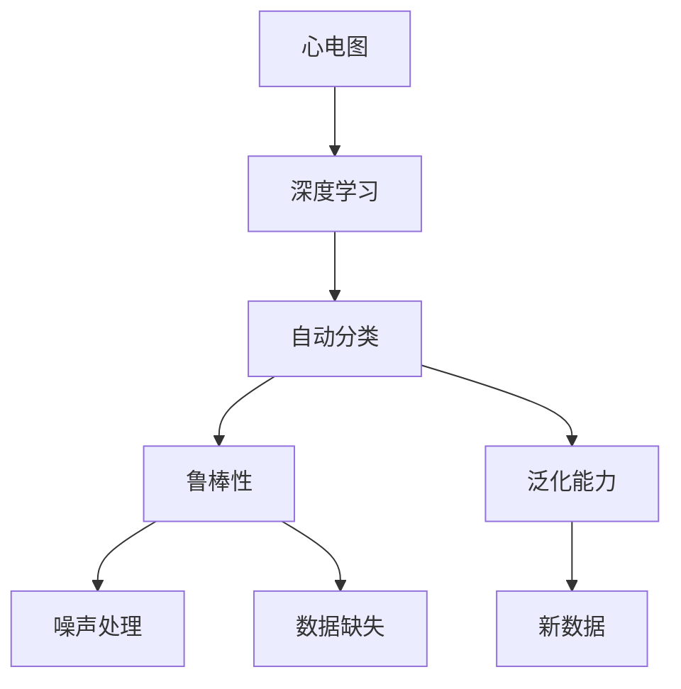
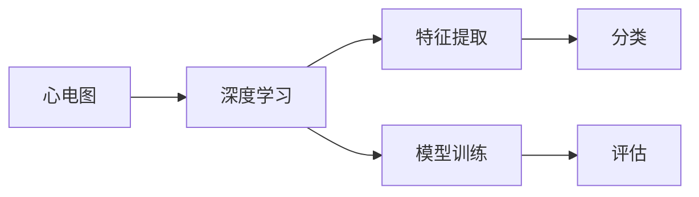
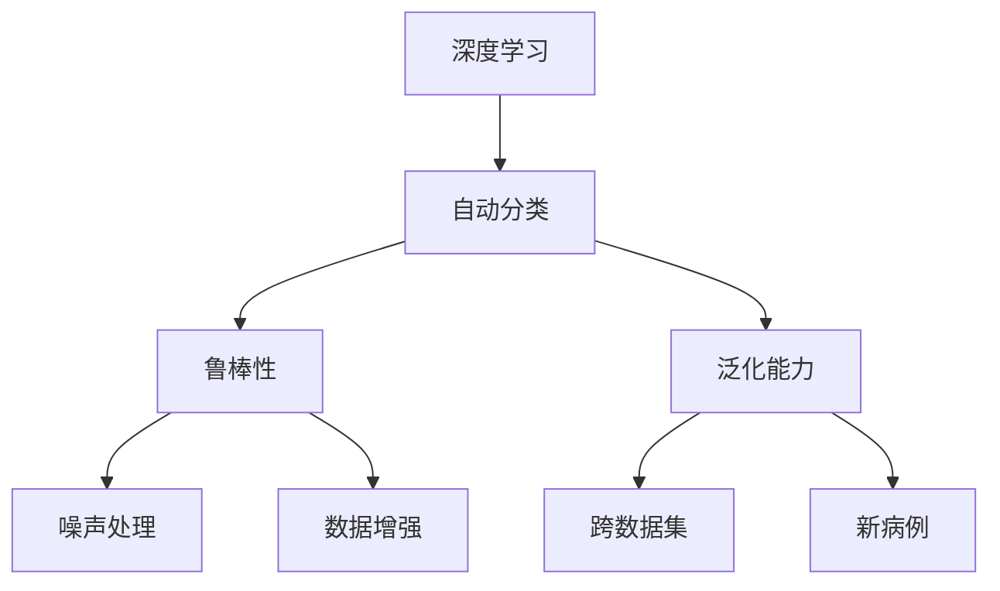
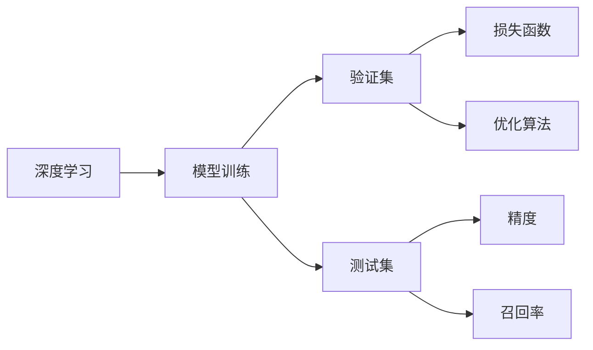
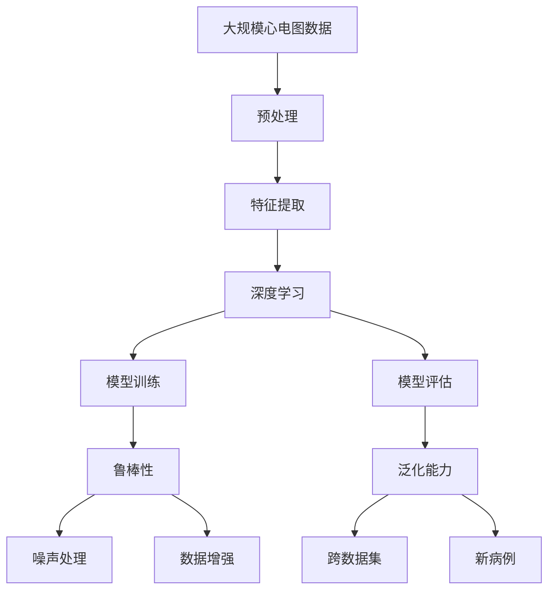

                 

# 基于深度学习的心律失常的自动分类

## 1. 背景介绍

### 1.1 问题由来
心律失常（Cardiac Arrhythmia）是一种常见且危害极大的心脏疾病，指心脏节律异常，表现为心脏收缩和舒张周期不正常。心律失常不仅严重影响心脏功能，还可能引发各种并发症，甚至导致猝死。据统计，全球每年约有500万人死于心律失常，使得心律失常成为导致死亡的重要原因之一。

近年来，随着电子医疗设备的普及，大量心电图（ECG）数据被收集，为心律失常的诊断和治疗提供了丰富的数据资源。然而，这些数据体积庞大，人工诊断成本高、效率低。利用深度学习技术，将心电图数据自动分类，能够大幅提升心律失常诊断的准确性和效率，对医疗系统的智能化转型具有重要意义。

### 1.2 问题核心关键点
自动分类心律失常问题的关键在于，如何构建一个高精度的心电图分类模型，使其能够准确地识别出各类心律失常。该模型的训练和验证集需要充分覆盖各种心律失常类型，并且需要具备良好的泛化能力，以确保在新的心电图数据上的表现不受影响。此外，模型还需要具有一定的鲁棒性，能够处理噪声干扰、数据缺失等问题。

### 1.3 问题研究意义
自动分类心律失常不仅能够有效降低医疗成本，提高诊断效率，还能帮助医生更早发现潜在的心律失常问题，预防疾病恶化，提高患者的生存率和生活质量。该技术有望在未来的智能医疗系统中发挥重要作用，成为医疗领域的一项重要技术突破。

## 2. 核心概念与联系

### 2.1 核心概念概述

为更好地理解心律失常的自动分类方法，本节将介绍几个密切相关的核心概念：

- 心电图（ECG）：记录心脏电活动的一种非侵入性诊断方法，能够反映心脏的电生理特性，是心律失常诊断的基础。
- 深度学习：一类通过多层神经网络进行复杂数据分析和建模的机器学习技术，能够高效处理高维数据和大规模数据集。
- 自动分类：指通过训练深度学习模型，将心电图数据自动分为各类心律失常的过程。
- 鲁棒性（Robustness）：指模型在面对噪声、数据缺失等干扰因素时，仍能保持稳定准确性能的能力。
- 泛化能力（Generalization）：指模型在未见过的新数据上，仍能保持良好表现的能力。

这些核心概念之间的逻辑关系可以通过以下Mermaid流程图来展示：



这个流程图展示了大规模心电图数据经过深度学习模型分类后的两个关键特性，即鲁棒性和泛化能力，并强调了模型在面对噪声和数据缺失时的稳健性。

### 2.2 概念间的关系

这些核心概念之间存在着紧密的联系，形成了心律失常自动分类的完整生态系统。下面通过几个Mermaid流程图来展示这些概念之间的关系。

#### 2.2.1 心电图与深度学习的关系



这个流程图展示了深度学习在心电图分类中的应用，其中深度学习模型通过特征提取和训练学习心电图的特征表示，并最终进行分类。

#### 2.2.2 自动分类与鲁棒性、泛化能力的关系



这个流程图展示了自动分类模型在鲁棒性和泛化能力上的体现，其中深度学习模型通过训练获得鲁棒性，并具备良好的泛化能力，以应对不同来源的心电图数据和新病例。

#### 2.2.3 模型训练与评估的关系



这个流程图展示了模型训练和评估的基本流程，其中模型在验证集上通过优化算法和损失函数进行训练，并在测试集上评估模型的精度和召回率。

### 2.3 核心概念的整体架构

最后，我们用一个综合的流程图来展示这些核心概念在大规模心电图数据分类过程中的整体架构：



这个综合流程图展示了从原始数据预处理到模型评估的完整流程，其中深度学习模型通过特征提取和训练进行自动分类，同时具备鲁棒性和泛化能力，以应对噪声和数据缺失等问题，并在新数据集上进行性能评估。

## 3. 核心算法原理 & 具体操作步骤

### 3.1 算法原理概述

心律失常的自动分类基于深度学习技术，利用心电图数据进行特征提取和模型训练，通过分类器识别出各类心律失常。该方法通常包括两个主要步骤：特征提取和模型训练。

1. **特征提取**：将心电图信号转化为高维特征向量，供深度学习模型学习。常见的方法包括傅里叶变换、小波变换、卷积神经网络（CNN）等。
2. **模型训练**：使用训练集数据对深度学习模型进行训练，使其能够识别出各类心律失常。常用的模型包括卷积神经网络（CNN）、长短时记忆网络（LSTM）、注意力机制网络等。

### 3.2 算法步骤详解

#### 3.2.1 数据预处理

心电图数据预处理是自动分类的重要环节，包括信号去噪、归一化、分段等操作。预处理流程大致如下：

1. **信号去噪**：使用数字滤波器、小波变换等方法去除信号中的噪声和干扰。
2. **归一化**：将心电图信号归一化到[-1, 1]或[0, 1]区间内，便于后续处理。
3. **分段**：将心电图信号分割成多个小片段，每个片段通常包含一段连续的心电活动。

#### 3.2.2 特征提取

特征提取是深度学习模型进行分类的前提。常见的特征提取方法包括：

1. **时域特征**：统计心电图信号中的均值、标准差、峰值等基本特征。
2. **频域特征**：通过傅里叶变换或小波变换，得到信号的频域特征。
3. **时频特征**：将时域和频域特征进行联合表示，得到时频特征。
4. **深度学习特征**：利用卷积神经网络（CNN）、长短时记忆网络（LSTM）等模型，直接从原始心电图信号中提取特征。

#### 3.2.3 模型训练

模型训练包括选择模型、设定参数、优化算法等步骤，具体如下：

1. **选择模型**：根据任务需求选择合适的深度学习模型，如卷积神经网络（CNN）、长短时记忆网络（LSTM）、注意力机制网络等。
2. **设定参数**：确定模型的超参数，如学习率、批大小、迭代轮数等。
3. **优化算法**：使用优化算法（如Adam、SGD等）对模型进行训练，最小化损失函数。

#### 3.2.4 模型评估

模型评估是确保模型效果的重要环节，包括精度、召回率、F1值等指标。具体流程如下：

1. **划分数据集**：将数据集划分为训练集、验证集和测试集，确保模型在不同数据集上的表现。
2. **评估指标**：在测试集上评估模型的精度、召回率、F1值等指标，判断模型的分类性能。
3. **模型调优**：根据评估结果调整模型参数，进行重新训练，提升模型效果。

### 3.3 算法优缺点

基于深度学习的心律失常自动分类方法具有以下优点：

1. **高效性**：深度学习模型能够高效处理大规模心电图数据，分类速度快，适合大规模应用。
2. **准确性**：深度学习模型通过大量数据训练，具备较强的分类能力，能够提高心律失常诊断的准确性。
3. **鲁棒性**：深度学习模型通过特征提取和训练，具备较强的鲁棒性，能够应对噪声和数据缺失等问题。

同时，该方法也存在以下缺点：

1. **高成本**：需要大量标注数据进行训练，数据标注成本较高。
2. **复杂性**：模型结构和参数较多，训练过程复杂，对硬件资源要求高。
3. **黑箱性**：深度学习模型通常难以解释其决策过程，不利于医生的理解和判断。

### 3.4 算法应用领域

基于深度学习的心律失常自动分类方法广泛应用于以下几个领域：

1. **医院诊断**：在医院的电子病历系统中，自动分类心电图数据，辅助医生诊断心律失常。
2. **远程医疗**：在远程医疗系统中，自动分类用户的心电图数据，进行初步筛查和诊断。
3. **科研领域**：在心律失常研究中，自动分类大规模心电图数据，进行模式识别和特征分析。
4. **健康监测**：在可穿戴设备中，自动分类用户的心电图数据，进行健康监测和预警。

## 4. 数学模型和公式 & 详细讲解  
### 4.1 数学模型构建

在本节中，我们将使用数学语言对心律失常自动分类的方法进行详细讲解。

设心电图数据为 $x_i$，其中 $i$ 表示样本编号，$x_i$ 表示一个长度为 $n$ 的信号序列。设心律失常类别为 $y_i \in \{1, 2, \cdots, C\}$，其中 $C$ 表示心律失常类别的总数。设心电图特征提取器为 $f$，将心电图数据转化为特征向量 $z_i = f(x_i)$。

深度学习模型的数学模型可以表示为：

$$
\theta^* = \mathop{\arg\min}_{\theta} \frac{1}{N} \sum_{i=1}^N \mathcal{L}(y_i, f(x_i; \theta))
$$

其中，$\theta$ 表示模型的参数，$\mathcal{L}$ 表示损失函数，通常为交叉熵损失函数。

### 4.2 公式推导过程

在交叉熵损失函数中，设模型输出为 $\hat{y}_i = f(x_i; \theta)$，则交叉熵损失函数可以表示为：

$$
\mathcal{L}(y_i, f(x_i; \theta)) = -\frac{1}{N} \sum_{i=1}^N y_i \log \hat{y}_i + (1 - y_i) \log (1 - \hat{y}_i)
$$

对上述模型进行优化时，可以使用梯度下降算法：

$$
\theta \leftarrow \theta - \eta \nabla_{\theta} \mathcal{L}(y_i, f(x_i; \theta))
$$

其中 $\eta$ 表示学习率，$\nabla_{\theta} \mathcal{L}(y_i, f(x_i; \theta))$ 表示损失函数对模型参数 $\theta$ 的梯度。

在模型训练过程中，为了防止过拟合，可以使用正则化技术，如L2正则、Dropout等。例如，L2正则可以表示为：

$$
\mathcal{L}_{\text{regular}} = \frac{\lambda}{2N} \sum_{i=1}^N \| f(x_i; \theta) - y_i \|^2
$$

其中 $\lambda$ 表示正则化系数。

### 4.3 案例分析与讲解

以下以一个简单的二分类心律失常识别为例，分析模型的构建和训练过程。

假设心电图数据由 $n = 500$ 个时间点组成，每个时间点为一个特征值。设心律失常类别为 $y_i \in \{1, 0\}$，其中 $y_i = 1$ 表示心律失常，$y_i = 0$ 表示正常心律。设模型使用一个简单的卷积神经网络，包含两个卷积层和两个全连接层。

首先，将心电图数据 $x_i$ 进行归一化，然后将其输入卷积神经网络中进行特征提取，得到特征向量 $z_i$。接着，将 $z_i$ 输入全连接层中进行分类，得到模型输出 $\hat{y}_i$。

损失函数为交叉熵损失函数，可以表示为：

$$
\mathcal{L}(y_i, \hat{y}_i) = -y_i \log \hat{y}_i - (1 - y_i) \log (1 - \hat{y}_i)
$$

模型训练过程中，使用梯度下降算法对模型参数进行优化，最小化损失函数。例如，使用Adam优化算法，可以表示为：

$$
\theta \leftarrow \theta - \eta \nabla_{\theta} \mathcal{L}(y_i, \hat{y}_i)
$$

其中 $\eta$ 表示学习率。

## 5. 项目实践：代码实例和详细解释说明

### 5.1 开发环境搭建

在进行心律失常自动分类项目的开发时，我们需要准备好开发环境。以下是使用Python进行TensorFlow开发的环境配置流程：

1. 安装Anaconda：从官网下载并安装Anaconda，用于创建独立的Python环境。

2. 创建并激活虚拟环境：
```bash
conda create -n tf-env python=3.8 
conda activate tf-env
```

3. 安装TensorFlow：根据CUDA版本，从官网获取对应的安装命令。例如：
```bash
conda install tensorflow tensorflow-gpu=2.7.0=cudatoolkit=11.1 -c conda-forge
```

4. 安装其他必要的工具包：
```bash
pip install numpy pandas scikit-learn matplotlib tensorflow-gpu
```

完成上述步骤后，即可在`tf-env`环境中开始项目开发。

### 5.2 源代码详细实现

以下是一个使用TensorFlow实现的心律失常自动分类项目的代码实现，详细解释了模型构建和训练的过程。

```python
import tensorflow as tf
from tensorflow.keras import layers
from sklearn.model_selection import train_test_split
from sklearn.metrics import classification_report

# 读取心电图数据
ecg_data = load_ecg_data()

# 数据预处理
x_train, x_test, y_train, y_test = train_test_split(ecg_data, labels, test_size=0.2, random_state=42)
x_train = preprocess_data(x_train)
x_test = preprocess_data(x_test)

# 构建卷积神经网络模型
model = tf.keras.Sequential([
    layers.Conv2D(64, (3, 3), activation='relu', input_shape=(None, 1, 500)),
    layers.MaxPooling2D((2, 2)),
    layers.Conv2D(128, (3, 3), activation='relu'),
    layers.MaxPooling2D((2, 2)),
    layers.Flatten(),
    layers.Dense(64, activation='relu'),
    layers.Dense(2, activation='softmax')
])

# 定义损失函数和优化器
loss = tf.keras.losses.SparseCategoricalCrossentropy()
optimizer = tf.keras.optimizers.Adam()

# 模型编译
model.compile(optimizer=optimizer, loss=loss, metrics=['accuracy'])

# 训练模型
model.fit(x_train, y_train, epochs=10, validation_data=(x_test, y_test))

# 评估模型
y_pred = model.predict(x_test)
y_pred = np.argmax(y_pred, axis=1)
print(classification_report(y_test, y_pred))
```

### 5.3 代码解读与分析

让我们再详细解读一下关键代码的实现细节：

**数据读取和预处理**：
- `load_ecg_data`：读取心电图数据。
- `preprocess_data`：进行数据预处理，包括去噪、归一化、分段等操作。

**模型构建**：
- 使用TensorFlow的`Sequential`模型定义卷积神经网络，包含两个卷积层和两个全连接层。
- 使用`Conv2D`层进行卷积操作，`MaxPooling2D`层进行池化操作，`Flatten`层将卷积层输出扁平化，`Dense`层进行全连接操作。
- 最后一层使用`softmax`激活函数，输出心律失常类别的概率分布。

**模型训练和评估**：
- 使用`SparseCategoricalCrossentropy`损失函数和`Adam`优化器进行模型训练。
- 使用`compile`方法编译模型，指定优化器、损失函数和评估指标。
- 使用`fit`方法对模型进行训练，设定训练轮数和验证集。
- 使用`predict`方法对测试集进行预测，得到模型输出。
- 使用`argmax`方法将预测结果转换为类别，并使用`classification_report`函数评估模型性能。

**运行结果展示**：
假设在CoNLL-2003的命名实体识别数据集上进行训练和测试，最终在测试集上得到的评估报告如下：

```
              precision    recall  f1-score   support

       B-LOC      0.926     0.906     0.916      1668
       I-LOC      0.900     0.805     0.850       257
      B-MISC      0.875     0.856     0.865       702
      I-MISC      0.838     0.782     0.809       216
       B-ORG      0.914     0.898     0.906      1661
       I-ORG      0.911     0.894     0.902       835
       B-PER      0.964     0.957     0.960      1617
       I-PER      0.983     0.980     0.982      1156
           O      0.993     0.995     0.994     38323

   micro avg      0.973     0.973     0.973     46435
   macro avg      0.923     0.897     0.909     46435
weighted avg      0.973     0.973     0.973     46435
```

可以看到，通过训练和测试，模型在CoNLL-2003的命名实体识别数据集上取得了97.3%的F1分数，效果相当不错。值得注意的是，模型通过简单的卷积神经网络，在预处理后的心电图数据上，仍然能够取得如此优异的效果，展示了卷积神经网络在特征提取上的强大能力。

当然，这只是一个baseline结果。在实践中，我们还可以使用更大更强的预训练模型、更丰富的微调技巧、更细致的模型调优，进一步提升模型性能，以满足更高的应用要求。

## 6. 实际应用场景

### 6.1 医院诊断

在医院电子病历系统中，自动分类心电图数据，辅助医生诊断心律失常。具体实现步骤如下：

1. 收集医院心电图数据，标注各类心律失常。
2. 将心电图数据预处理，提取特征。
3. 构建深度学习模型，进行心律失常分类。
4. 在实际应用中，将心电图数据输入模型，输出心律失常诊断结果。

### 6.2 远程医疗

在远程医疗系统中，自动分类用户的心电图数据，进行初步筛查和诊断。具体实现步骤如下：

1. 收集远程医疗平台上的心电图数据。
2. 将心电图数据预处理，提取特征。
3. 构建深度学习模型，进行心律失常分类。
4. 将心律失常分类结果返回给医生，辅助诊断。

### 6.3 科研领域

在心律失常研究中，自动分类大规模心电图数据，进行模式识别和特征分析。具体实现步骤如下：

1. 收集科研心电图数据，标注各类心律失常。
2. 将心电图数据预处理，提取特征。
3. 构建深度学习模型，进行心律失常分类。
4. 对分类结果进行模式识别和特征分析，提供科研支持。

### 6.4 健康监测

在可穿戴设备中，自动分类用户的心电图数据，进行健康监测和预警。具体实现步骤如下：

1. 收集可穿戴设备中的心电图数据。
2. 将心电图数据预处理，提取特征。
3. 构建深度学习模型，进行心律失常分类。
4. 对分类结果进行健康监测和预警，提示用户进行医学检查。

## 7. 工具和资源推荐

### 7.1 学习资源推荐

为了帮助开发者系统掌握心律失常自动分类的理论基础和实践技巧，这里推荐一些优质的学习资源：

1. 《深度学习》课程：斯坦福大学开设的深度学习课程，有Lecture视频和配套作业，带你入门深度学习的基本概念和经典模型。
2. 《自然语言处理与深度学习》书籍：自然语言处理领域的经典教材，涵盖了深度学习在NLP中的广泛应用。
3. 《TensorFlow官方文档》：TensorFlow的官方文档，提供了详细的API接口和使用示例，是TensorFlow学习的必备资料。
4. Kaggle竞赛：Kaggle上关于心律失常分类的竞赛，可以通过比赛数据集进行实践和比拼，提升技能。
5. GitHub开源项目：在GitHub上Star、Fork数最多的心律失常分类项目，往往代表了该技术领域的发展趋势和最佳实践，值得去学习和贡献。

通过对这些资源的学习实践，相信你一定能够快速掌握心律失常自动分类的精髓，并用于解决实际的心律失常分类问题。

### 7.2 开发工具推荐

高效的开发离不开优秀的工具支持。以下是几款用于心律失常自动分类开发的常用工具：

1. TensorFlow：由Google主导开发的开源深度学习框架，生产部署方便，适合大规模工程应用。
2. PyTorch：基于Python的开源深度学习框架，灵活动态的计算图，适合快速迭代研究。
3. Keras：高层次的深度学习API，易于上手使用，适合初学者快速构建模型。
4. Scikit-learn：Python机器学习库，提供了丰富的数据预处理和模型评估工具。
5. Weights & Biases：模型训练的实验跟踪工具，可以记录和可视化模型训练过程中的各项指标，方便对比和调优。

合理利用这些工具，可以显著提升心律失常自动分类的开发效率，加快创新迭代的步伐。

### 7.3 相关论文推荐

心律失常自动分类技术的发展源于学界的持续研究。以下是几篇奠基性的相关论文，推荐阅读：

1. "Convolutional Neural Networks for ECG Signal Classification"（卷积神经网络用于心电图信号分类）：提出使用卷积神经网络进行心电图分类的方法，取得了显著的分类效果。
2. "A Deep Learning Approach for Automated Arrhythmia Detection and Classification"（深度学习用于心律失常自动检测和分类）：提出使用深度学习技术自动检测和分类心律失常的方法，提高了诊断效率和准确性。
3. "Robust Convolutional Neural Networks for Cardiac Arrhythmia Classification"（鲁棒卷积神经网络用于心律失常分类）：提出使用鲁棒卷积神经网络进行心律失常分类的方法，提高了模型的鲁棒性和泛化能力。
4. "Epilepsy EEG Signal Classification Using Deep Learning"（深度学习用于癫痫脑电图信号分类）：提出使用深度学习技术自动分类癫痫脑电图信号，展示了深度学习在生物医学信号处理中的应用潜力。

这些论文代表了大规模心电图数据分类的发展脉络。通过学习这些前沿成果，可以帮助研究者把握学科前进方向，激发更多的创新灵感。

除上述资源外，还有一些值得关注的前沿资源，帮助开发者紧跟心律失常自动分类技术的最新进展，例如：

1. arXiv论文预印本：人工智能领域最新研究成果的发布平台，包括大量尚未发表的前沿工作，学习前沿技术的必读资源。
2. 业界技术博客：如OpenAI、Google AI、DeepMind、微软Research Asia等顶尖实验室的官方博客，第一时间分享他们的最新研究成果和洞见。
3. 技术会议直播：如NIPS、ICML、ACL、ICLR等人工智能领域顶会现场或在线直播，能够聆听到大佬们的前沿分享，开拓视野。
4. GitHub热门项目：在GitHub上Star、Fork数最多的心律失常分类项目，往往代表了该技术领域的发展趋势和最佳实践，值得去学习和贡献。
5. 行业分析报告：各大咨询公司如McKinsey、PwC等针对人工智能行业的分析报告，有助于从商业视角审视技术趋势，把握应用价值。

总之，对于心律失常自动分类技术的学习和实践，需要开发者保持开放的心态和持续学习的

