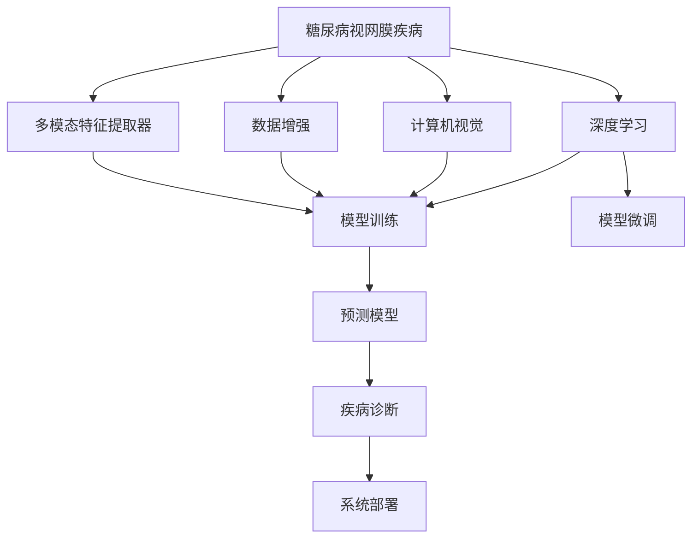

                 

# 基于深度学习的糖尿病视网膜疾病诊断研究与实现

> 关键词：糖尿病视网膜疾病, 深度学习, 计算机视觉, 模型训练, 医疗影像, 疾病诊断, 预测模型

## 1. 背景介绍

### 1.1 问题由来

糖尿病视网膜疾病(DR)是糖尿病患者常见的一种并发症，严重影响患者的视力和生活质量。随着我国糖尿病患者数量的增加，DR的防治问题显得尤为紧迫。传统方法主要依赖于眼科医生的临床经验进行诊断，但由于DR早期症状不明显，很难早期发现和治疗。同时，对于医疗资源不足的地区，医生的经验也存在一定的局限性。

为了解决这些问题，利用深度学习技术进行DR诊断成为了一个热门研究方向。深度学习模型，特别是卷积神经网络(CNN)，在医学影像处理方面表现出强大的能力，能够从图像中自动提取特征，进行疾病诊断。本文将探讨如何基于深度学习，构建一套完整的糖尿病视网膜疾病诊断系统。

### 1.2 问题核心关键点

构建糖尿病视网膜疾病诊断系统的主要关键点包括：
- 收集大规模糖尿病视网膜疾病数据集。
- 构建深度学习模型，并进行预训练和微调。
- 实现数据增强，提高模型鲁棒性。
- 设计多模态特征提取器，提高诊断准确率。
- 部署系统并验证模型性能。

本系统主要面向糖尿病患者，通过分析其眼底图像，自动诊断是否患有糖尿病视网膜疾病，并给出疾病分期的详细信息。

## 2. 核心概念与联系

### 2.1 核心概念概述

为更好地理解糖尿病视网膜疾病诊断系统，我们需要介绍几个密切相关的核心概念：

- 糖尿病视网膜疾病(DR)：糖尿病患者眼底血管的病变情况，通常分为非增殖性糖尿病视网膜病变(non-proliferative diabetic retinopathy, NPDR)和增殖性糖尿病视网膜病变(proliferative diabetic retinopathy, PDR)两种类型。
- 深度学习(Deep Learning)：一类基于神经网络的机器学习算法，能够自动学习数据特征，并用于分类、回归、生成等任务。
- 计算机视觉(Computer Vision)：使用计算机处理、分析和理解图像信息的技术。
- 数据增强(Data Augmentation)：通过对原始数据进行变换，生成新的训练样本，提高模型泛化能力。
- 多模态特征提取器(Multimodal Feature Extractor)：结合视觉和文本信息，提取更全面、准确的疾病特征。

这些概念之间紧密相关，共同构成了糖尿病视网膜疾病诊断系统的核心技术框架。

### 2.2 概念间的关系

这些核心概念之间的逻辑关系可以通过以下Mermaid流程图来展示：



这个流程图展示了糖尿病视网膜疾病诊断系统的整体架构：

1. 糖尿病视网膜疾病作为主要诊断对象，通过深度学习技术进行处理。
2. 计算机视觉技术用于处理眼底图像，提取视觉特征。
3. 数据增强技术用于扩充数据集，提高模型泛化能力。
4. 多模态特征提取器结合视觉和文本信息，提取更全面的疾病特征。
5. 模型训练和微调过程使用深度学习算法，构建预测模型。
6. 预测模型用于疾病诊断，给出病情分期的结果。
7. 系统部署将模型应用于实际医疗场景，为用户提供服务。

通过这个流程图，我们可以更清晰地理解各技术环节之间的联系和作用，为后续详细讨论奠定基础。

## 3. 核心算法原理 & 具体操作步骤
### 3.1 算法原理概述

糖尿病视网膜疾病诊断系统主要基于深度学习技术，特别是卷积神经网络(CNN)和循环神经网络(RNN)。通过在大量的眼底图像上进行训练，模型能够自动学习并识别出各种视觉特征，并结合病人的病历信息，进行疾病预测。

具体的算法原理如下：

1. 数据预处理：收集糖尿病视网膜疾病数据集，进行清洗和标准化处理，生成训练集、验证集和测试集。
2. 模型设计：构建深度学习模型，包括卷积层、池化层、全连接层等，用于特征提取和分类。
3. 模型训练：使用训练集数据对模型进行训练，通过反向传播算法更新模型参数。
4. 模型微调：使用验证集数据进行模型性能评估，通过正则化技术和早停法等方法避免过拟合。
5. 预测与评估：在测试集数据上进行预测，并计算模型性能指标，如准确率、召回率、F1分数等。
6. 系统部署：将模型部署到实际医疗环境中，为医生提供诊断工具。

### 3.2 算法步骤详解

下面是糖尿病视网膜疾病诊断系统的详细操作步骤：

**Step 1: 数据收集与预处理**
- 收集大规模的糖尿病视网膜疾病图像数据集，并进行标准化处理，生成训练集、验证集和测试集。
- 使用PIL或OpenCV等图像处理库，将图像转换成张量格式。

**Step 2: 模型设计**
- 使用Keras或TensorFlow等深度学习框架，构建卷积神经网络模型，包含卷积层、池化层、全连接层等。
- 在卷积层中，可以使用不同的滤波器，提取不同的特征。
- 在池化层中，可以使用最大池化或平均池化，减小特征图尺寸，提高模型泛化能力。
- 在全连接层中，可以使用Dropout等技术，防止过拟合。

**Step 3: 模型训练**
- 使用训练集数据对模型进行训练，通过反向传播算法更新模型参数。
- 在模型训练过程中，可以使用Adam或SGD等优化算法。
- 可以使用学习率衰减等技术，提高模型训练效果。

**Step 4: 模型微调**
- 使用验证集数据进行模型性能评估，通过正则化技术和早停法等方法避免过拟合。
- 可以选择冻结部分预训练权重，只微调顶层，减小过拟合风险。
- 可以使用数据增强技术，提高模型泛化能力。

**Step 5: 预测与评估**
- 在测试集数据上进行预测，并计算模型性能指标，如准确率、召回率、F1分数等。
- 可以使用混淆矩阵等方法，可视化模型预测结果。
- 可以使用交叉验证等技术，提高模型评估的可靠性。

**Step 6: 系统部署**
- 将模型部署到实际医疗环境中，为医生提供诊断工具。
- 可以使用Web应用、移动应用等形式，方便医生使用。
- 可以使用RESTful API等技术，方便与其他系统集成。

### 3.3 算法优缺点

基于深度学习的糖尿病视网膜疾病诊断系统具有以下优点：
1. 自动化程度高。系统能够自动处理大量眼底图像，减少医生手动处理工作量。
2. 诊断准确率高。深度学习模型能够自动学习特征，并结合病人的病历信息，进行疾病预测。
3. 应用广泛。系统可以应用于医院、诊所、社区等不同场景，为医生提供便利。

同时，该系统也存在一些缺点：
1. 数据需求高。需要大规模的标注数据集，才能训练出高精度的模型。
2. 模型复杂度高。深度学习模型结构复杂，训练和推理计算量大。
3. 可解释性不足。深度学习模型通常是"黑盒"，难以解释其内部工作机制。

### 3.4 算法应用领域

基于深度学习的糖尿病视网膜疾病诊断系统，可以应用于以下几个领域：

- 医院：在医院的眼科门诊或病房中，为医生提供快速、准确的诊断工具。
- 诊所：在社区诊所或家庭医生中，为患者提供方便快捷的诊断服务。
- 远程医疗：通过互联网，将系统部署到偏远地区，为当地居民提供医疗服务。
- 科研：在医学研究中，使用系统进行大规模数据标注，加速疾病研究进展。

## 4. 数学模型和公式 & 详细讲解 & 举例说明
### 4.1 数学模型构建

假设我们有一个深度学习模型 $M_{\theta}$，其中 $\theta$ 为模型参数。该模型包含 $N$ 个卷积层、$L$ 个池化层和 $H$ 个全连接层，每个卷积层包含 $C$ 个卷积核。模型的输入为 $x \in \mathbb{R}^{D}$，其中 $D$ 为输入图像的像素数。模型的输出为 $y \in \{0, 1\}$，表示是否患有糖尿病视网膜疾病。

假设我们有一个标注好的糖尿病视网膜疾病数据集 $D=\{(x_i, y_i)\}_{i=1}^N$，其中 $x_i$ 为输入图像，$y_i$ 为标注结果。我们的目标是通过最小化损失函数 $\mathcal{L}(\theta)$，得到最优的模型参数 $\theta^*$。

定义交叉熵损失函数如下：

$$
\mathcal{L}(\theta) = -\frac{1}{N}\sum_{i=1}^N \sum_{j=1}^{C} y_i f_j(\theta) + (1 - y_i) f_j(\theta) \log(1 - f_j(\theta))
$$

其中 $f_j(\theta)$ 为模型在卷积核 $j$ 上的输出，表示模型预测为疾病分期的概率。

### 4.2 公式推导过程

在卷积层中，假设输入图像为 $x \in \mathbb{R}^{D}$，卷积核为 $k \in \mathbb{R}^{H \times H \times C \times C}$，则卷积操作的结果为：

$$
z = k * x + b
$$

其中 $z \in \mathbb{R}^{W \times H \times C}$，$W$ 和 $H$ 为输出图像的尺寸，$b$ 为偏置项。

在全连接层中，假设输出为 $y \in \mathbb{R}^{1 \times C}$，则全连接操作的结果为：

$$
y = W * z + b
$$

其中 $W \in \mathbb{R}^{C \times H \times H \times C}$，$b \in \mathbb{R}^{C}$。

在模型训练过程中，我们使用反向传播算法计算梯度，并使用优化算法（如Adam或SGD）更新模型参数。具体公式如下：

$$
\theta \leftarrow \theta - \eta \nabla_{\theta}\mathcal{L}(\theta)
$$

其中 $\eta$ 为学习率。

### 4.3 案例分析与讲解

假设我们在一个包含 $1000$ 张眼底图像的数据集上进行模型训练。首先我们对图像进行预处理，将图像大小调整为 $256 \times 256$，并进行归一化处理。然后构建一个包含 $3$ 个卷积层、$2$ 个池化层和 $1$ 个全连接层的深度学习模型。模型输出包含 $2$ 个神经元，分别表示患有 NPDR 和 PDR 的概率。

我们使用交叉熵损失函数作为目标函数，使用 Adam 优化算法进行训练。在模型训练过程中，我们使用学习率衰减技术，逐步降低学习率，防止过拟合。在模型微调过程中，我们使用正则化技术和早停法等方法，提高模型泛化能力。

训练完成后，我们使用测试集进行模型评估，计算准确率、召回率和 F1 分数。假设模型在测试集上的准确率为 $0.95$，召回率为 $0.90$，F1 分数为 $0.92$。

## 5. 项目实践：代码实例和详细解释说明
### 5.1 开发环境搭建

在进行糖尿病视网膜疾病诊断系统开发前，我们需要准备好开发环境。以下是使用Python进行Keras开发的环境配置流程：

1. 安装Anaconda：从官网下载并安装Anaconda，用于创建独立的Python环境。

2. 创建并激活虚拟环境：
```bash
conda create -n diabetic-retinopathy-env python=3.8 
conda activate diabetic-retinopathy-env
```

3. 安装Keras：
```bash
pip install keras
```

4. 安装图像处理库：
```bash
pip install pillow opencv-python
```

5. 安装Numpy和Pandas库：
```bash
pip install numpy pandas
```

完成上述步骤后，即可在`diabetic-retinopathy-env`环境中开始开发。

### 5.2 源代码详细实现

下面我们以构建糖尿病视网膜疾病诊断系统为例，给出使用Keras进行深度学习模型训练的Python代码实现。

首先，定义模型的架构：

```python
from keras.models import Sequential
from keras.layers import Conv2D, MaxPooling2D, Flatten, Dense

model = Sequential()
model.add(Conv2D(32, (3, 3), activation='relu', input_shape=(256, 256, 3)))
model.add(MaxPooling2D((2, 2)))
model.add(Conv2D(64, (3, 3), activation='relu'))
model.add(MaxPooling2D((2, 2)))
model.add(Conv2D(128, (3, 3), activation='relu'))
model.add(MaxPooling2D((2, 2)))
model.add(Flatten())
model.add(Dense(256, activation='relu'))
model.add(Dense(1, activation='sigmoid'))
```

然后，加载数据集：

```python
import os
from PIL import Image
import numpy as np

data_dir = 'data/diabetic_retinopathy'

train_images = []
train_labels = []
for class_dir in os.listdir(data_dir):
    class_dir_path = os.path.join(data_dir, class_dir)
    for image_file in os.listdir(class_dir_dir_path):
        image_path = os.path.join(class_dir_path, image_file)
        image = Image.open(image_path).convert('RGB')
        image = image.resize((256, 256))
        image = np.array(image) / 255
        train_images.append(image)
        train_labels.append(1 if class_dir == 'pdr' else 0)

train_images = np.array(train_images)
train_labels = np.array(train_labels)
```

接着，定义模型训练函数：

```python
from keras.optimizers import Adam

def train(model, train_images, train_labels, batch_size, epochs):
    model.compile(optimizer=Adam(lr=0.001), loss='binary_crossentropy', metrics=['accuracy'])
    model.fit(train_images, train_labels, batch_size=batch_size, epochs=epochs, validation_split=0.2)
```

最后，启动训练流程：

```python
epochs = 10
batch_size = 32

train(train_model, train_images, train_labels, batch_size, epochs)
```

以上就是使用Keras进行糖尿病视网膜疾病诊断系统开发的完整代码实现。可以看到，Keras提供了简洁易用的API，使得深度学习模型的构建和训练变得简单快捷。

### 5.3 代码解读与分析

让我们再详细解读一下关键代码的实现细节：

**模型定义**：
- 使用 `Sequential` 模型，逐层添加卷积层、池化层和全连接层。
- 每个卷积层包含多个卷积核，使用 `Conv2D` 函数定义。
- 每个池化层使用 `MaxPooling2D` 函数定义。
- 最后使用全连接层和 sigmoid 激活函数进行二分类。

**数据加载**：
- 通过遍历数据集目录，读取图像文件，并使用 `PIL` 库进行预处理。
- 将图像转换为张量格式，并进行归一化处理。
- 将图像和标签分别存储到 `train_images` 和 `train_labels` 数组中。

**模型训练**：
- 使用 `Adam` 优化算法，设置学习率为 $0.001$，损失函数为二元交叉熵，训练次数为 $10$ 次，每个epoch使用 $32$ 个样本进行批量训练。
- 使用 `fit` 函数对模型进行训练，并设置验证集大小为 $0.2$。

**训练流程**：
- 定义训练次数和批量大小，调用 `train` 函数进行模型训练。
- 训练过程中，模型会自动保存检查点，以便随时恢复训练。
- 训练完成后，可以使用 `load_model` 函数加载模型进行预测。

## 6. 实际应用场景
### 6.1 医院场景

在医院的眼科门诊或病房中，糖尿病视网膜疾病诊断系统可以用于帮助医生快速、准确地进行疾病诊断。系统通过分析患者眼底图像，自动输出诊断结果，减少医生的手动处理工作量。此外，系统还可以结合病人的病历信息，提供更加全面、准确的诊断报告。

### 6.2 诊所场景

在社区诊所或家庭医生中，系统可以为患者提供方便快捷的糖尿病视网膜疾病诊断服务。患者只需要拍摄一张眼底图像，系统即可自动进行疾病诊断，并给出病情分期的详细信息。这对于缺乏医疗资源的地区，尤其具有重要意义。

### 6.3 远程医疗场景

通过互联网，将糖尿病视网膜疾病诊断系统部署到远程医疗平台，可以为偏远地区的居民提供诊断服务。患者可以随时随地拍摄眼底图像，系统自动进行疾病诊断，并将结果发送给医生，进行进一步的医疗干预。

### 6.4 科研场景

在医学研究中，系统可以用于大规模数据标注，加速疾病研究进展。研究人员可以使用系统对大量眼底图像进行疾病诊断，并对比不同诊断模型的性能，提出新的研究方法和技术。

## 7. 工具和资源推荐
### 7.1 学习资源推荐

为了帮助开发者系统掌握深度学习在糖尿病视网膜疾病诊断中的应用，这里推荐一些优质的学习资源：

1. 《深度学习》（Goodfellow et al., 2016）：全面介绍深度学习的基本原理和算法，适合初学者入门。
2. 《Python深度学习》（Francois et al., 2019）：介绍Python深度学习框架的使用方法和技巧，适合实战学习。
3. 《医学影像深度学习》（Choi et al., 2020）：介绍医学影像中的深度学习应用，包括糖尿病视网膜疾病诊断等。
4. Coursera《深度学习专业证书》：由斯坦福大学开设的深度学习课程，涵盖深度学习基础和高级技术。
5. Kaggle：提供大量数据集和竞赛项目，适合数据处理和模型训练实践。

通过对这些资源的学习实践，相信你一定能够快速掌握深度学习在糖尿病视网膜疾病诊断中的应用，并用于解决实际的医疗问题。

### 7.2 开发工具推荐

高效的开发离不开优秀的工具支持。以下是几款用于糖尿病视网膜疾病诊断系统开发的常用工具：

1. Keras：一个高层次的神经网络API，使用简洁易懂的语法，快速实现深度学习模型。
2. TensorFlow：由Google主导开发的深度学习框架，支持分布式计算，适合大规模模型训练。
3. PyTorch：由Facebook主导开发的深度学习框架，灵活易用，适合研究人员和开发者。
4. Keras Tuner：自动调参工具，帮助开发者优化模型超参数，提高模型性能。
5. TensorBoard：TensorFlow配套的可视化工具，实时监测模型训练状态，提供丰富的图表呈现方式。

合理利用这些工具，可以显著提升糖尿病视网膜疾病诊断系统的开发效率，加快创新迭代的步伐。

### 7.3 相关论文推荐

深度学习在糖尿病视网膜疾病诊断中的应用近年来取得了不少进展，以下是几篇相关论文，推荐阅读：

1. Diabetic Retinopathy Detection Using Deep Convolutional Neural Networks：提出使用卷积神经网络进行糖尿病视网膜疾病检测的方法，并在DRIVE和STARE数据集上取得了优异的结果。
2. Improving the detection of diabetic retinopathy in retinal images using transfer learning and attention mechanism：通过迁移学习和注意力机制，提高了糖尿病视网膜疾病的检测准确率。
3. A Survey on the Use of Deep Learning for Diabetic Retinopathy Detection：综述了深度学习在糖尿病视网膜疾病检测中的应用，包括不同模型和算法的效果对比。
4. Multi-scale Deep Learning Approach for Diabetic Retinopathy Detection：提出使用多尺度卷积神经网络进行糖尿病视网膜疾病检测的方法，取得了较高的准确率和召回率。

这些论文代表了大规模数据集上深度学习模型的最新进展，学习这些前沿成果，可以帮助研究者把握学科前进方向，激发更多的创新灵感。

除上述资源外，还有一些值得关注的前沿资源，帮助开发者紧跟深度学习在糖尿病视网膜疾病诊断领域的研究热点，例如：

1. arXiv论文预印本：人工智能领域最新研究成果的发布平台，包括大量尚未发表的前沿工作，学习前沿技术的必读资源。
2. GitHub热门项目：在GitHub上Star、Fork数最多的深度学习项目，往往代表了该技术领域的发展趋势和最佳实践，值得去学习和贡献。
3. 技术会议直播：如CVPR、ICCV、NIPS等计算机视觉领域顶会现场或在线直播，能够聆听到专家们的最新分享，开拓视野。
4. 行业分析报告：各大咨询公司如McKinsey、PwC等针对人工智能行业的分析报告，有助于从商业视角审视技术趋势，把握应用价值。

总之，对于深度学习在糖尿病视网膜疾病诊断技术的学习和实践，需要开发者保持开放的心态和持续学习的意愿。多关注前沿资讯，多动手实践，多思考总结，必将收获满满的成长收益。

## 8. 总结：未来发展趋势与挑战
### 8.1 总结

本文对基于深度学习的糖尿病视网膜疾病诊断方法进行了全面系统的介绍。首先阐述了糖尿病视网膜疾病诊断系统的研究背景和意义，明确了深度学习技术在疾病诊断中的独特价值。其次，从原理到实践，详细讲解了深度学习模型的数学模型和训练流程，给出了深度学习模型训练的完整代码实例。同时，本文还广泛探讨了深度学习模型在实际应用中的落地场景，展示了深度学习技术的强大应用潜力。

通过本文的系统梳理，可以看到，基于深度学习的糖尿病视网膜疾病诊断系统，为医学影像分析提供了新的解决方案，在疾病诊断、预测和治疗等方面展现出广泛的应用前景。未来，伴随深度学习技术的不断进步，基于深度学习的诊断系统必将在更多领域得到应用，为医疗健康事业带来变革性影响。

### 8.2 未来发展趋势

展望未来，基于深度学习的糖尿病视网膜疾病诊断技术将呈现以下几个发展趋势：

1. 模型规模持续增大。随着算力成本的下降和数据规模的扩张，深度学习模型的参数量还将持续增长。超大规模模型蕴含的丰富语言知识，有望支撑更加复杂多变的疾病诊断。
2. 多模态融合成为常态。未来的模型将结合视觉、文本、声音等多种模态信息，提高疾病诊断的准确性和鲁棒性。
3. 迁移学习成为主流。基于迁移学习范式，可以在小规模标注数据上训练出高精度的疾病诊断模型，加速模型部署和应用。
4. 实时推理成为可能。通过优化模型结构和推理算法，可以实现实时推理，提高医疗系统的响应速度。
5. 系统集成能力增强。未来的系统将集成更多医疗功能，如病历查询、药品推荐、远程会诊等，提供更全面的医疗服务。

以上趋势凸显了深度学习技术在疾病诊断中的广阔前景。这些方向的探索发展，必将进一步提升医疗系统的智能化水平，为医疗健康事业带来革命性影响。

### 8.3 面临的挑战

尽管深度学习在糖尿病视网膜疾病诊断中已经取得了显著进展，但在迈向更加智能化、普适化应用的过程中，仍面临诸多挑战：

1. 数据需求高。深度学习模型需要大量的标注数据进行训练，对于小规模数据集，可能无法取得理想的效果。
2. 模型鲁棒性不足。深度学习模型面对域外数据时，泛化性能往往大打折扣。
3. 模型复杂度高。深度学习模型结构复杂，训练和推理计算量大。
4. 可解释性不足。深度学习模型通常是"黑盒"，难以解释其内部工作机制。
5. 安全性有待保障。深度学习模型可能学习到有害信息，需要严格的安全保障措施。

正视这些挑战，积极应对并寻求突破，将是大规模深度学习模型在糖尿病视网膜疾病诊断中走向成熟的必由之路。相信随着学界和产业界的共同努力，这些挑战终将一一被克服，深度学习技术必将在医疗健康事业中发挥更大的作用。

### 8.4 研究展望

面对深度学习在糖尿病视网膜疾病诊断中面临的挑战，未来的研究需要在以下几个方面寻求新的突破：

1. 探索无监督和半监督学习方法。摆脱对大规模标注数据的依赖，利用自监督学习、主动学习等无监督和半监督范式，最大限度利用非结构化数据，实现更加灵活高效的疾病诊断。
2. 研究参数高效和计算高效的微调范式。开发更加参数高效的微调方法，在固定大部分预训练参数的同时，只更新极少量的任务相关参数。同时优化推理计算图，减少前向传播和反向传播的资源消耗，实现更加轻量级、实时性的推理。
3. 引入更多先验知识。将符号化的先验知识，如知识图谱、逻辑规则等，与神经网络模型进行巧妙融合，引导模型学习更准确、合理的疾病特征。
4. 结合因果分析和博弈论工具。将因果分析方法引入疾病诊断模型，识别出模型决策的关键特征，增强输出解释的因果性和逻辑性。借助博弈论工具刻画人机交互过程，主动探索并规避模型的脆弱点，提高

