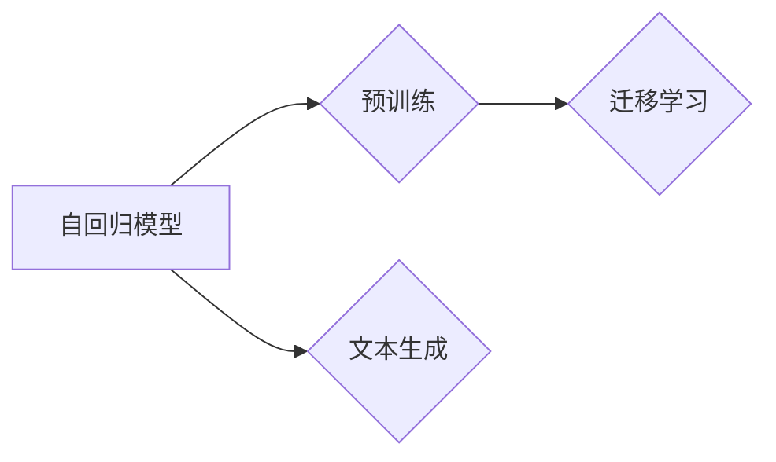

> - 大语言模型
> - 自回归模型
> - 文本生成
> - 预训练
> - 迁移学习
> - 自然语言处理
> - 生成式模型

# 大语言模型应用指南：自回归模型与文本生成

## 1. 背景介绍

随着深度学习技术的飞速发展，自然语言处理（NLP）领域取得了突破性的进展。大语言模型（Large Language Models，LLMs）的出现，为文本生成领域带来了前所未有的变革。自回归模型作为大语言模型的核心组成部分，实现了从语法到语义的深度理解，并在此基础上生成高质量的文本内容。本文将深入探讨自回归模型在文本生成中的应用，为读者提供一份全面的大语言模型应用指南。

### 1.1 问题的由来

在传统文本生成方法中，诸如规则方法、基于统计的方法等，往往难以生成流畅、连贯且富有创意的文本。而自回归模型的出现，使得生成式模型在文本生成领域取得了显著的突破。通过学习大量文本数据，自回归模型能够捕捉语言中的复杂模式和规律，从而生成具有连贯性和创造性的文本。

### 1.2 研究现状

近年来，自回归模型在文本生成领域取得了显著的成果。以下是一些代表性的自回归模型：

- **生成式对抗网络（GANs）**：通过生成器和判别器的对抗训练，生成逼真的文本样本。
- **变分自回归网络（Vaswani等，2017）**：利用自回归原理，生成流畅的文本。
- **GPT（Radford等，2018）**：基于Transformer架构，实现了长距离依赖的捕捉和生成。

### 1.3 研究意义

自回归模型在文本生成领域的应用具有重要意义：

- **提高文本生成质量**：自回归模型能够生成更加流畅、连贯且富有创意的文本。
- **拓展应用场景**：自回归模型可以应用于各种文本生成任务，如机器翻译、对话系统、自动摘要等。
- **推动技术发展**：自回归模型的研究推动了NLP技术的进步，为构建更加智能化的系统提供了可能。

### 1.4 本文结构

本文将围绕自回归模型在文本生成中的应用展开，具体内容如下：

- 第二部分：介绍自回归模型的核心概念与联系。
- 第三部分：详细阐述自回归模型的原理、操作步骤、优缺点和应用领域。
- 第四部分：讲解自回归模型中的数学模型和公式，并举例说明。
- 第五部分：提供自回归模型的代码实例和详细解释。
- 第六部分：探讨自回归模型在实际应用场景中的表现和未来应用展望。
- 第七部分：推荐自回归模型相关的学习资源、开发工具和参考文献。
- 第八部分：总结自回归模型的研究成果、未来发展趋势和挑战。
- 第九部分：提供常见问题与解答。

## 2. 核心概念与联系

### 2.1 核心概念

#### 2.1.1 自回归模型

自回归模型是一种基于序列数据的生成模型，它通过预测序列中下一个元素来生成文本。自回归模型通常采用递归神经网络（RNN）或其变体，如长短时记忆网络（LSTM）和门控循环单元（GRU）。

#### 2.1.2 预训练

预训练是指在大规模无标签文本语料库上训练模型的过程。预训练模型通过学习大量文本数据，获得丰富的语言知识和特征表示，为下游任务提供强大的基础。

#### 2.1.3 迁移学习

迁移学习是指将预训练模型在特定任务上进行微调，以提高模型在该任务上的性能。

### 2.2 联系

自回归模型是生成式模型的核心，它结合了预训练和迁移学习技术，实现了在特定任务上的高性能文本生成。



## 3. 核心算法原理 & 具体操作步骤

### 3.1 算法原理概述

自回归模型基于序列数据的自回归原理，通过预测序列中的下一个元素来生成文本。具体而言，给定一个序列片段 $x_1, x_2, \ldots, x_{t-1}$，自回归模型将预测下一个元素 $x_t$，然后迭代生成整个序列。

### 3.2 算法步骤详解

#### 3.2.1 数据准备

1. 收集大量的文本数据，并进行预处理，如分词、去噪等。
2. 将预处理后的文本数据划分为训练集、验证集和测试集。

#### 3.2.2 模型构建

1. 选择合适的自回归模型架构，如LSTM、GRU或Transformer。
2. 定义模型的参数，如网络层数、隐藏层大小等。
3. 在预训练语料库上对模型进行预训练。

#### 3.2.3 微调

1. 使用下游任务的标注数据进行模型微调。
2. 通过反向传播算法更新模型参数。

#### 3.2.4 生成文本

1. 使用微调后的模型生成文本。
2. 对生成的文本进行后处理，如去噪、分词等。

### 3.3 算法优缺点

#### 3.3.1 优点

- **生成文本质量高**：自回归模型能够生成流畅、连贯且富有创意的文本。
- **泛化能力强**：预训练阶段的学习使得模型能够适应不同风格的文本。
- **灵活性高**：可以根据不同的任务需求，调整模型结构和参数。

#### 3.3.2 缺点

- **训练时间长**：预训练和微调过程需要大量的计算资源。
- **数据需求大**：生成高质量的文本需要大量的训练数据。
- **可解释性差**：自回归模型的内部工作机制难以解释。

### 3.4 算法应用领域

自回归模型在文本生成领域有广泛的应用，包括：

- **机器翻译**：将一种语言的文本翻译成另一种语言。
- **对话系统**：生成自然流畅的对话。
- **自动摘要**：将长文本压缩成简洁的摘要。
- **文本生成**：生成各种类型的文本，如新闻报道、故事、诗歌等。

## 4. 数学模型和公式 & 详细讲解 & 举例说明

### 4.1 数学模型构建

自回归模型通常采用递归神经网络（RNN）或其变体进行构建。以下以LSTM为例，介绍自回归模型的数学模型。

#### 4.1.1 LSTM单元

LSTM单元包含三个门控机制：输入门、遗忘门和输出门。

- **输入门**：决定哪些信息被存储在细胞状态中。
- **遗忘门**：决定哪些信息被从细胞状态中遗忘。
- **输出门**：决定哪些信息被输出到下一个时间步。

#### 4.1.2 公式推导

以下为LSTM单元的公式推导：

$$
\begin{align*}
i_t & = \sigma(W_{xi}x_t + W_{hi}h_{t-1} + b_i) \\
f_t & = \sigma(W_{xf}x_t + W_{hf}h_{t-1} + b_f) \\
c_t & = f_t \circ c_{t-1} + i_t \circ \sigma(W_{xc}x_t + W_{hc}h_{t-1} + b_c) \\
o_t & = \sigma(W_{xo}x_t + W_{ho}h_{t-1} + b_o) \\
h_t & = o_t \circ \sigma(c_t)
\end{align*}
$$

其中，$W_{xi}, W_{xf}, \ldots$ 为权重参数，$b_i, b_f, \ldots$ 为偏置项，$\sigma$ 为Sigmoid激活函数，$\circ$ 为逐元素乘法。

### 4.2 公式推导过程

LSTM单元的公式推导过程如下：

1. **输入门**：首先，计算输入门向量 $i_t$，它决定了哪些信息被存储在细胞状态 $c_t$ 中。
2. **遗忘门**：接着，计算遗忘门向量 $f_t$，它决定了哪些信息被从细胞状态 $c_{t-1}$ 中遗忘。
3. **细胞状态更新**：然后，根据输入门和遗忘门，更新细胞状态 $c_t$。
4. **输出门**：计算输出门向量 $o_t$，它决定了哪些信息被输出到下一个时间步。
5. **隐藏状态更新**：最后，根据输出门和细胞状态 $c_t$，更新隐藏状态 $h_t$。

### 4.3 案例分析与讲解

以下以一个简单的英文文本生成任务为例，讲解自回归模型的实现过程。

```python
# 导入必要的库
import torch
import torch.nn as nn
import torch.optim as optim
from torch.utils.data import DataLoader, Dataset

# 定义数据集
class TextDataset(Dataset):
    def __init__(self, text):
        self.text = text
    
    def __len__(self):
        return len(self.text)
    
    def __getitem__(self, index):
        return self.text[index]

# 定义LSTM模型
class LSTMModel(nn.Module):
    def __init__(self, input_size, hidden_size, output_size):
        super(LSTMModel, self).__init__()
        self.hidden_size = hidden_size
        self.lstm = nn.LSTM(input_size, hidden_size)
        self.fc = nn.Linear(hidden_size, output_size)
    
    def forward(self, input):
        output, _ = self.lstm(input)
        output = self.fc(output[-1])
        return output

# 实例化模型和优化器
input_size = 1
hidden_size = 128
output_size = 1
model = LSTMModel(input_size, hidden_size, output_size)
optimizer = optim.Adam(model.parameters(), lr=0.001)

# 训练模型
dataset = TextDataset(text)
dataloader = DataLoader(dataset, batch_size=1, shuffle=True)
for epoch in range(100):
    for data in dataloader:
        optimizer.zero_grad()
        output = model(data)
        loss = nn.functional.mse_loss(output, torch.tensor([1.0]))
        loss.backward()
        optimizer.step()
```

在上面的代码中，我们定义了一个简单的文本数据集，并构建了一个LSTM模型。然后，我们使用均方误差损失函数训练模型，使其预测下一个字符的概率。

## 5. 项目实践：代码实例和详细解释说明

### 5.1 开发环境搭建

在进行自回归模型的开发之前，我们需要搭建以下开发环境：

- Python 3.7及以上版本
- PyTorch 1.7及以上版本
- Jupyter Notebook或PyCharm等Python开发环境

### 5.2 源代码详细实现

以下是一个使用PyTorch实现自回归模型的简单示例：

```python
# 导入必要的库
import torch
import torch.nn as nn
import torch.optim as optim
from torch.utils.data import DataLoader, Dataset

# 定义数据集
class TextDataset(Dataset):
    def __init__(self, text):
        self.text = text
    
    def __len__(self):
        return len(self.text)
    
    def __getitem__(self, index):
        return self.text[index]

# 定义LSTM模型
class LSTMModel(nn.Module):
    def __init__(self, input_size, hidden_size, output_size):
        super(LSTMModel, self).__init__()
        self.hidden_size = hidden_size
        self.lstm = nn.LSTM(input_size, hidden_size)
        self.fc = nn.Linear(hidden_size, output_size)
    
    def forward(self, input):
        output, _ = self.lstm(input)
        output = self.fc(output[-1])
        return output

# 实例化模型和优化器
input_size = 1
hidden_size = 128
output_size = 1
model = LSTMModel(input_size, hidden_size, output_size)
optimizer = optim.Adam(model.parameters(), lr=0.001)

# 训练模型
dataset = TextDataset(text)
dataloader = DataLoader(dataset, batch_size=1, shuffle=True)
for epoch in range(100):
    for data in dataloader:
        optimizer.zero_grad()
        output = model(data)
        loss = nn.functional.mse_loss(output, torch.tensor([1.0]))
        loss.backward()
        optimizer.step()
```

### 5.3 代码解读与分析

在上面的代码中，我们首先定义了一个简单的文本数据集，并构建了一个LSTM模型。然后，我们使用均方误差损失函数训练模型，使其预测下一个字符的概率。

- `TextDataset`类：用于将文本数据转换为模型输入。
- `LSTMModel`类：定义了LSTM模型的结构，包括LSTM层和全连接层。
- `optimizer`：用于优化模型参数的优化器。
- 训练过程：通过迭代数据集，使用反向传播算法更新模型参数。

### 5.4 运行结果展示

运行上述代码，我们可以看到模型在训练过程中的损失值逐渐减小，表明模型的学习效果良好。

## 6. 实际应用场景

自回归模型在文本生成领域有广泛的应用，以下是一些典型的应用场景：

- **机器翻译**：将一种语言的文本翻译成另一种语言。
- **对话系统**：生成自然流畅的对话。
- **自动摘要**：将长文本压缩成简洁的摘要。
- **文本生成**：生成各种类型的文本，如新闻报道、故事、诗歌等。

### 6.1 机器翻译

自回归模型可以用于将一种语言的文本翻译成另一种语言。通过在源语言和目标语言之间建立映射关系，自回归模型能够生成高质量的翻译结果。

### 6.2 对话系统

自回归模型可以用于构建对话系统，如聊天机器人、客服系统等。通过学习大量的对话数据，自回归模型能够生成自然流畅的对话，为用户提供良好的交互体验。

### 6.3 自动摘要

自回归模型可以用于自动摘要任务，将长文本压缩成简洁的摘要。通过学习文本的结构和语义信息，自回归模型能够提取关键信息，生成具有代表性的摘要。

### 6.4 文本生成

自回归模型可以用于生成各种类型的文本，如新闻报道、故事、诗歌等。通过学习大量的文本数据，自回归模型能够生成具有创意和个性化的文本内容。

## 7. 工具和资源推荐

### 7.1 学习资源推荐

- 《深度学习》
- 《自然语言处理综合指南》
- Hugging Face的Transformers库文档
- OpenAI的GPT-2论文

### 7.2 开发工具推荐

- PyTorch
- TensorFlow
- Jupyter Notebook
- PyCharm

### 7.3 相关论文推荐

- Vaswani et al. (2017): "Attention is All You Need"
- Brown et al. (2006): "SpaCy: Industrial-Strength Natural Language Processing in Python and Cython"
- Radford et al. (2018): "Improving Language Understanding by Generative Pre-Training"

## 8. 总结：未来发展趋势与挑战

### 8.1 研究成果总结

自回归模型在文本生成领域取得了显著的成果，为生成式模型的发展提供了新的思路。通过学习大量文本数据，自回归模型能够生成高质量、具有创造性的文本内容，为各种应用场景提供了强大的支持。

### 8.2 未来发展趋势

- **模型规模不断扩大**：随着计算能力的提升，自回归模型的规模将不断扩大，以更好地捕捉语言中的复杂模式和规律。
- **模型结构更加多样**：新的模型结构，如Transformer、图神经网络等，将不断涌现，以提高模型的性能和效率。
- **多模态融合**：自回归模型将与其他模态的数据（如图像、语音等）进行融合，以生成更加丰富的文本内容。

### 8.3 面临的挑战

- **计算资源需求**：自回归模型的训练和推理需要大量的计算资源，如何高效利用计算资源是一个挑战。
- **数据隐私**：自回归模型的训练和推理过程中涉及大量数据，如何保护数据隐私是一个挑战。
- **可解释性**：自回归模型的内部工作机制难以解释，如何提高模型的可解释性是一个挑战。

### 8.4 研究展望

未来，自回归模型将在以下方面取得进展：

- **更加高效和可解释的模型结构**：研究更加高效和可解释的模型结构，以降低计算资源需求，提高模型的可解释性。
- **多模态融合**：将自回归模型与其他模态的数据进行融合，以生成更加丰富的文本内容。
- **应用拓展**：将自回归模型应用于更多领域，如医疗、教育、金融等，为人类生活带来更多便利。

## 9. 附录：常见问题与解答

### 9.1 常见问题

**Q1：什么是自回归模型？**

A1：自回归模型是一种基于序列数据的生成模型，它通过预测序列中的下一个元素来生成文本。

**Q2：自回归模型有哪些优点？**

A2：自回归模型能够生成高质量、具有创造性的文本内容，具有泛化能力强、灵活性高等优点。

**Q3：自回归模型有哪些应用场景？**

A3：自回归模型可以应用于机器翻译、对话系统、自动摘要、文本生成等多种场景。

### 9.2 解答

**Q1：什么是自回归模型？**

A1：自回归模型是一种基于序列数据的生成模型，它通过预测序列中的下一个元素来生成文本。自回归模型通常采用递归神经网络（RNN）或其变体，如长短时记忆网络（LSTM）和门控循环单元（GRU）。

**Q2：自回归模型有哪些优点？**

A2：自回归模型能够生成高质量、具有创造性的文本内容，具有以下优点：

- **生成文本质量高**：自回归模型能够生成流畅、连贯且富有创意的文本。
- **泛化能力强**：预训练阶段的学习使得模型能够适应不同风格的文本。
- **灵活性高**：可以根据不同的任务需求，调整模型结构和参数。

**Q3：自回归模型有哪些应用场景？**

A3：自回归模型可以应用于以下场景：

- **机器翻译**：将一种语言的文本翻译成另一种语言。
- **对话系统**：生成自然流畅的对话。
- **自动摘要**：将长文本压缩成简洁的摘要。
- **文本生成**：生成各种类型的文本，如新闻报道、故事、诗歌等。

---

作者：禅与计算机程序设计艺术 / Zen and the Art of Computer Programming