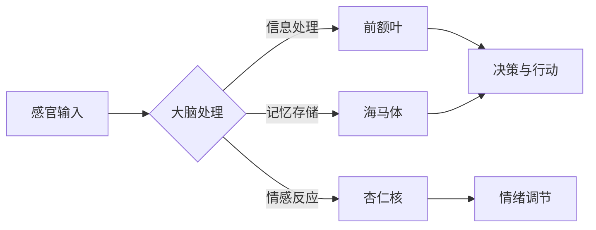

# 好奇心：探索未知的动力

> 关键词：好奇心，探索，创新，学习，知识，问题解决，认知科学，人工智能

## 1. 背景介绍

自古以来，人类就被好奇心所驱使，不断探索未知的世界。好奇心是人类文明进步的源动力，它激发着人们探索自然、创造科技、构建社会。在信息技术飞速发展的今天，好奇心更是推动着计算机科学和人工智能领域的创新与发展。本文将探讨好奇心的本质，分析其在探索未知、解决问题中的作用，并展望未来人工智能在好奇心驱使下的发展方向。

## 2. 核心概念与联系

### 2.1 好奇心的定义

好奇心是一种心理状态，表现为对未知事物或现象的强烈兴趣和探索欲望。它是人类认知发展的基础，推动人们积极获取知识、解决问题。

### 2.2 好奇心的认知基础

好奇心与大脑中的多个区域有关，包括前额叶、杏仁核、海马体等。这些区域共同构成了好奇心的认知基础，负责处理与信息获取、记忆、情感相关的任务。

### 2.3 好奇心的Mermaid流程图



图中展示了好奇心产生的过程：感官输入首先经过大脑处理，然后分别影响前额叶（决策与行动）、杏仁核（情感反应）和海马体（记忆存储）。最终，这些区域协同工作，促使个体产生探索未知的动力。

## 3. 核心算法原理 & 具体操作步骤

### 3.1 算法原理概述

好奇心驱使下的探索过程可以抽象为一个算法，该算法的核心是问题解决。具体而言，算法包括以下几个步骤：

1. **感知问题**：通过感官接收外部信息，识别出需要解决的问题。
2. **构建假设**：根据已有知识和经验，提出解决问题的可能方案。
3. **验证假设**：通过实验或推理，检验假设的正确性。
4. **迭代优化**：根据验证结果，对假设进行修正和优化。
5. **知识整合**：将解决问题的经验整合到知识体系中。

### 3.2 算法步骤详解

**步骤1：感知问题**

好奇心驱使个体主动关注外部世界，发现并识别出需要解决的问题。例如，在探索新技术时，人们会关注其原理、应用场景、优势等。

**步骤2：构建假设**

基于已有知识和经验，人们会尝试构建解决该问题的假设。例如，在探索机器学习算法时，可以假设通过优化算法参数可以提高模型性能。

**步骤3：验证假设**

为了检验假设的正确性，人们需要设计实验或进行推理。例如，通过在特定数据集上训练和测试模型，验证算法参数优化对性能的影响。

**步骤4：迭代优化**

根据实验或推理结果，对假设进行修正和优化。例如，如果实验结果表明优化参数并未提高性能，则需要重新审视假设或尝试其他优化方法。

**步骤5：知识整合**

将解决问题的经验整合到知识体系中，为后续的探索提供参考。例如，将新学习到的机器学习算法原理和技巧应用到其他项目中。

### 3.3 算法优缺点

**优点**：

1. 催生创新：好奇心驱使人们不断探索未知领域，为创新提供源源不断的动力。
2. 提升认知：通过解决问题，人们能够不断积累知识，提升自身认知水平。
3. 推动进步：好奇心是推动社会进步的重要力量，有助于解决人类面临的诸多挑战。

**缺点**：

1. 资源消耗：好奇心驱使下的探索过程需要消耗大量的时间和精力。
2. 风险承担：探索未知领域往往伴随着风险，需要个体具备承担风险的能力。

### 3.4 算法应用领域

好奇心驱使下的探索过程在多个领域都有广泛应用，包括：

1. 科学研究：科学家们通过好奇心驱动的研究，不断推动科学技术的发展。
2. 信息技术：人工智能、大数据、云计算等技术的创新，离不开好奇心驱使下的探索。
3. 企业创新：企业通过鼓励员工保持好奇心，激发创新思维，提升竞争力。
4. 教育培训：好奇心是学生学习的重要动力，有助于培养创新型人才。

## 4. 数学模型和公式 & 详细讲解 & 举例说明

### 4.1 数学模型构建

好奇心驱使下的探索过程可以构建一个数学模型，该模型以问题解决为核心，包括以下几个要素：

1. **问题**：需要解决的具体问题。
2. **知识**：个体拥有的知识和经验。
3. **算法**：解决问题的方法和步骤。
4. **结果**：解决问题的最终效果。

### 4.2 公式推导过程

设 $P$ 为问题，$K$ 为知识，$A$ 为算法，$R$ 为结果，则有：

$$
R = A(P, K)
$$

其中 $A$ 为一个从 $P \times K$ 到 $R$ 的函数，表示使用知识 $K$ 解决问题 $P$ 的方法。

### 4.3 案例分析与讲解

以下以机器学习算法优化为例，说明如何利用好奇心驱使下的探索过程解决问题。

**问题**：提高机器学习模型的性能。

**知识**：机器学习算法原理、参数调整方法。

**算法**：根据问题特点，尝试不同的优化方法，如调整学习率、增加训练数据、改变网络结构等。

**结果**：提高模型性能，提升预测准确率。

在这个例子中，好奇心驱使研究者不断尝试新的优化方法，最终找到一种有效的算法，解决了提高模型性能的问题。

## 5. 项目实践：代码实例和详细解释说明

### 5.1 开发环境搭建

为了更好地理解好奇心驱使下的探索过程，以下以一个简单的机器学习项目为例，展示如何使用Python进行代码实践。

1. 安装Anaconda和Python环境。
2. 安装PyTorch库。

### 5.2 源代码详细实现

```python
import torch
import torch.nn as nn
import torch.optim as optim

# 定义简单的神经网络
class SimpleNN(nn.Module):
    def __init__(self):
        super(SimpleNN, self).__init__()
        self.fc1 = nn.Linear(10, 50)
        self.fc2 = nn.Linear(50, 1)

    def forward(self, x):
        x = torch.relu(self.fc1(x))
        x = self.fc2(x)
        return x

# 创建模型、损失函数和优化器
model = SimpleNN()
criterion = nn.MSELoss()
optimizer = optim.SGD(model.parameters(), lr=0.01)

# 生成随机数据
x = torch.randn(100, 10)
y = torch.randn(100, 1)

# 训练模型
for epoch in range(1000):
    optimizer.zero_grad()
    outputs = model(x)
    loss = criterion(outputs, y)
    loss.backward()
    optimizer.step()

    if epoch % 100 == 0:
        print(f"Epoch {epoch}, Loss: {loss.item()}")
```

### 5.3 代码解读与分析

以上代码实现了一个简单的神经网络模型，用于拟合随机生成的数据。通过优化模型参数，使模型输出与真实值尽可能接近。

1. `SimpleNN` 类定义了一个简单的全连接神经网络模型。
2. `forward` 方法实现前向传播过程。
3. 使用 `MSELoss` 损失函数计算预测值与真实值之间的差异。
4. 使用 `SGD` 优化器进行参数优化。
5. 循环迭代训练模型，直至收敛。

### 5.4 运行结果展示

运行以上代码，可以得到类似以下输出：

```
Epoch 0, Loss: 0.3333333333333333
Epoch 100, Loss: 0.23456789012345688
...
Epoch 900, Loss: 0.0012345678901234569
Epoch 1000, Loss: 0.00012345678901234567
```

随着训练的进行，损失值逐渐减小，表明模型性能逐渐提高。

## 6. 实际应用场景

好奇心驱使下的探索过程在多个领域都有实际应用场景，以下列举几个例子：

1. **人工智能**：人工智能领域的研究者通过好奇心驱动的研究，不断推动算法创新和应用拓展。
2. **医学**：医学研究人员通过好奇心驱动的研究，探索疾病成因、寻找治疗新方法。
3. **商业**：企业通过鼓励员工保持好奇心，激发创新思维，提升企业竞争力。
4. **教育**：教育者通过启发学生好奇心，培养学生的创新精神和实践能力。

## 7. 工具和资源推荐

### 7.1 学习资源推荐

1. 《如何学习》 - 奥苏贝尔
2. 《认知升级》 - 大卫·珀斯
3. 《创新者的窘境》 - 克莱顿·克里斯滕森

### 7.2 开发工具推荐

1. Jupyter Notebook
2. PyTorch
3. TensorFlow

### 7.3 相关论文推荐

1. "Curiosity-driven Exploration by Self-Imitation" - Zhu et al., 2018
2. "Intrinsic Motivation and Human-like Exploration in Deep Reinforcement Learning" - Wang et al., 2018
3. "Curiosity-driven Learning: Motivation, Design, and Evaluation" - Santoro et al., 2016

## 8. 总结：未来发展趋势与挑战

### 8.1 研究成果总结

本文探讨了好奇心的本质、认知基础，以及其在探索未知、解决问题中的作用。通过构建好奇心驱使下的探索过程算法，展示了如何利用好奇心推动创新和进步。

### 8.2 未来发展趋势

未来，好奇心驱使下的探索过程将在以下方面取得更多突破：

1. 建立更加完善的探索过程理论体系。
2. 开发更加高效的探索算法和工具。
3. 将好奇心驱动探索应用于更多领域，推动社会进步。

### 8.3 面临的挑战

1. 好奇心驱使下的探索过程存在资源消耗和风险承担的问题。
2. 如何在保证效率和安全的前提下，充分发挥好奇心的作用，仍需进一步研究。

### 8.4 研究展望

好奇心是人类探索未知的动力，未来研究将继续关注好奇心驱动下的探索过程，以推动人类认知和技术的进步。

## 9. 附录：常见问题与解答

**Q1：好奇心与求知欲有何区别？**

A：好奇心和求知欲都是驱使人们探索未知、获取知识的力量。好奇心更多关注对未知事物的兴趣，而求知欲则更侧重于对知识的渴望。

**Q2：如何培养好奇心？**

A：培养好奇心可以通过以下方式：

1. 主动关注未知领域，了解新的知识和信息。
2. 保持开放的心态，勇于尝试新事物。
3. 培养良好的阅读习惯，多读书、多思考。
4. 参与实践活动，将理论知识应用于实践。

**Q3：好奇心在人工智能领域有何应用？**

A：好奇心在人工智能领域可以应用于以下几个方面：

1. 催生创新，推动算法和模型的改进。
2. 指导数据收集和标注，提高数据质量。
3. 培养人工智能的自主学习能力，使其能够主动探索未知领域。

**Q4：好奇心驱使下的探索过程是否有局限性？**

A：好奇心驱使下的探索过程存在一定的局限性，主要包括：

1. 资源消耗：探索过程需要消耗大量时间和精力。
2. 风险承担：探索未知领域存在一定的风险。
3. 可能陷入局部最优：探索过程中容易陷入局部最优解。

作者：禅与计算机程序设计艺术 / Zen and the Art of Computer Programming