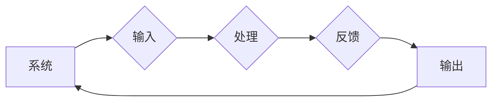

# 香农和麦卡锡对维纳的态度

> 关键词：克劳德·香农，约翰·麦卡锡，诺伯特·维纳，信息论，控制论，计算机科学，人工智能，哲学思考

## 1. 背景介绍

在20世纪中叶，三位杰出的科学家——克劳德·香农、约翰·麦卡锡和诺伯特·维纳——他们的工作和思想深刻地影响了计算机科学和人工智能的发展。香农以其在信息论领域的开创性工作而闻名，麦卡锡则是人工智能领域的先驱者之一，而维纳则是控制论的创始人。本文将探讨这三位科学家对彼此的态度，以及他们之间的相互影响。

### 1.1 问题的由来

香农和维纳的工作最初在数学和工程领域展开，但很快它们的思想开始渗透到计算机科学和人工智能的领域。麦卡锡作为人工智能的早期倡导者，对香农和维纳的理论产生了浓厚的兴趣，并将这些理论应用到人工智能的研究中。因此，了解香农和麦卡锡对维纳的态度，有助于我们理解这些科学理论如何塑造了现代计算机科学和人工智能的哲学基础。

### 1.2 研究现状

尽管关于香农、麦卡锡和维纳各自的工作已有大量研究，但关于他们之间互动和相互态度的探讨相对较少。本文旨在填补这一空白，通过分析历史文献、个人信件和公开演讲，揭示这三者之间复杂的关系。

### 1.3 研究意义

通过对香农、麦卡锡和维纳之间关系的探讨，我们可以更深入地理解信息论、控制论和计算机科学的交叉点，以及它们如何共同推动了人工智能的发展。此外，这也有助于我们反思科学家的个人哲学和科学理念如何影响科技进步。

### 1.4 本文结构

本文将分为以下几个部分：
- 第2部分，介绍克劳德·香农、约翰·麦卡锡和诺伯特·维纳的生平和主要贡献。
- 第3部分，分析香农和麦卡锡对维纳的理论和工作的态度。
- 第4部分，探讨麦卡锡如何将香农和维纳的理论应用到人工智能研究中。
- 第5部分，总结香农、麦卡锡和维纳之间的相互影响，以及他们对现代计算机科学和人工智能的贡献。
- 第6部分，讨论未来研究方向和挑战。

## 2. 核心概念与联系

在深入探讨香农、麦卡锡和维纳的态度之前，我们需要了解一些核心概念。

### 2.1 信息论

信息论是研究信息传递、存储和处理的科学。香农的信息论将信息视为一种资源，并提出了熵的概念来量化信息的不确定性。他的工作为通信理论、数据压缩和统计决策理论奠定了基础。


### 2.2 控制论

控制论是研究系统控制和自动化的科学。维纳提出了控制论的基本概念，包括反馈、稳定性和适应机制。他的工作对自动化技术和人工智能的发展产生了深远影响。



### 2.3 人工智能

人工智能是研究如何使计算机模拟人类智能的科学。麦卡锡是人工智能领域的先驱，他提出了“人工智能”这一术语，并推动了早期人工智能的发展。

```mermaid
graph LR
A[计算机] --> B{算法}
B --> C{数据处理}
C --> D{决策}
D --> E[知识}
E --> A
```

## 3. 核心算法原理 & 具体操作步骤

### 3.1 算法原理概述

在这一部分，我们将概述香农的信息论、维纳的控制论和麦卡锡的人工智能的基本原理。

#### 3.1.1 香农的信息论

香农的信息论基于以下几个核心概念：
- 信息熵：衡量信息的不确定性。
- 信道容量：信道能够传输的最大信息量。
- 编码：将信息转换为适合信道传输的格式。

#### 3.1.2 维纳的控制论

维纳的控制论基于以下几个核心概念：
- 反馈：系统输出的一部分返回到输入，以调整系统行为。
- 稳定性：系统在扰动后能够恢复到原始状态的能力。
- 适应机制：系统根据外部环境变化调整自身行为的能力。

#### 3.1.3 麦卡锡的人工智能

麦卡锡的人工智能基于以下几个核心概念：
- 模拟人类智能：使计算机能够执行需要人类智能的任务。
- 知识表示：如何将知识编码到计算机中。
- 机器学习：使计算机能够从数据中学习新知识。

### 3.2 算法步骤详解

在这一部分，我们将详细解释香农、维纳和麦卡锡的理论如何应用于实际问题。

#### 3.2.1 香农的信息论在通信中的应用

香农的信息论在通信中的应用包括：
- 数据压缩：通过编码减少数据传输的冗余。
- 错误检测和纠正：在传输过程中检测和纠正错误。

#### 3.2.2 维纳的控制论在自动化中的应用

维纳的控制论在自动化中的应用包括：
- 机器人控制：使机器人能够自主移动和操作。
- 工业控制：控制生产线上的机器和过程。

#### 3.2.3 麦卡锡的人工智能在数据科学中的应用

麦卡锡的人工智能在数据科学中的应用包括：
- 机器学习算法：使计算机能够从数据中学习新知识。
- 自然语言处理：使计算机能够理解和生成自然语言。

### 3.3 算法优缺点

#### 3.3.1 香农的信息论

香农的信息论的优点：
- 提供了一种量化的方式来衡量信息的不确定性。
- 为数据压缩和通信理论提供了理论基础。

香农的信息论的缺点：
- 假设信息是独立和均匀分布的，这在实际情况中可能不成立。

#### 3.3.2 维纳的控制论

维纳的控制论的优点：
- 为自动化和控制提供了理论基础。
- 为人工智能的发展提供了灵感和方向。

维纳的控制论的缺点：
- 控制论模型往往过于简化，难以应用于复杂系统。

#### 3.3.3 麦卡锡的人工智能

麦卡锡的人工智能的优点：
- 推动了人工智能的发展。
- 开发了许多实用的机器学习算法。

麦卡锡的人工智能的缺点：
- 早期人工智能研究过于乐观，忽视了人工智能的局限性。
- 机器学习算法的可解释性较差。

### 3.4 算法应用领域

香农的信息论、维纳的控制论和麦卡锡的人工智能在许多领域都有广泛的应用，包括：

- 通信
- 自动化
- 数据科学
- 人工智能

## 4. 数学模型和公式 & 详细讲解 & 举例说明

### 4.1 数学模型构建

在这一部分，我们将构建香农的信息论、维纳的控制论和麦卡锡的人工智能的数学模型，并进行详细讲解。

#### 4.1.1 香农的信息论

香农的信息论的数学模型是基于概率论和统计学。以下是一个简单的信息熵的公式：

$$
H(X) = -\sum_{i=1}^{n} P(x_i) \log_2 P(x_i)
$$

其中，$H(X)$ 是随机变量 $X$ 的熵，$P(x_i)$ 是 $X$ 取值 $x_i$ 的概率。

#### 4.1.2 维纳的控制论

维纳的控制论的数学模型是基于线性系统理论。以下是一个简单的反馈控制系统的公式：

$$
y(t) = C(s(t) - y(t))
$$

其中，$y(t)$ 是系统的输出，$s(t)$ 是系统的输入，$C$ 是控制器。

#### 4.1.3 麦卡锡的人工智能

麦卡锡的人工智能的数学模型是基于概率论和统计学。以下是一个简单的决策树算法的公式：

$$
P(\text{选择左分支} | \text{当前节点特征}) = P(\text{目标} | \text{当前节点特征}) / P(\text{目标})
$$

其中，$P(\text{选择左分支} | \text{当前节点特征})$ 是在给定当前节点特征的情况下选择左分支的概率，$P(\text{目标} | \text{当前节点特征})$ 是在给定当前节点特征的情况下达到目标的概率，$P(\text{目标})$ 是达到目标的总概率。

### 4.2 公式推导过程

在这一部分，我们将推导香农的信息论、维纳的控制论和麦卡锡的人工智能的公式。

#### 4.2.1 香农的信息论

香农的信息熵的推导过程如下：

- 首先，定义随机变量 $X$ 的概率分布 $P(X)$。
- 然后，计算 $X$ 的熵：

$$
H(X) = -\sum_{i=1}^{n} P(x_i) \log_2 P(x_i)
$$

#### 4.2.2 维纳的控制论

维纳的控制论的推导过程如下：

- 首先，定义系统的输入 $s(t)$ 和输出 $y(t)$。
- 然后，定义控制器 $C$。
- 最后，根据控制器的定义，推导出反馈控制系统的公式：

$$
y(t) = C(s(t) - y(t))
$$

#### 4.2.3 麦卡锡的人工智能

麦卡锡的人工智能的推导过程如下：

- 首先，定义决策树的结构。
- 然后，根据决策树的结构，推导出决策树算法的公式。

### 4.3 案例分析与讲解

在这一部分，我们将分析香农的信息论、维纳的控制论和麦卡锡的人工智能在具体案例中的应用。

#### 4.3.1 香农的信息论在通信中的应用

案例：数据压缩

- 假设我们有一个数据序列，其中数字 0 出现的概率为 0.9，数字 1 出现的概率为 0.1。
- 我们可以使用香农的信息论来计算这个数据序列的熵。
- 然后，我们可以使用霍夫曼编码或其他编码方法来压缩这个数据序列。

#### 4.3.2 维纳的控制论在自动化中的应用

案例：机器人控制

- 假设我们有一个机器人，它需要根据传感器输入来调整其速度和方向。
- 我们可以使用维纳的控制论来设计一个控制器，使机器人能够根据传感器输入自动调整其行为。

#### 4.3.3 麦卡锡的人工智能在数据科学中的应用

案例：决策树

- 假设我们有一个数据集，其中包含一些特征和对应的标签。
- 我们可以使用决策树算法来构建一个决策树，根据这些特征来预测标签。

## 5. 项目实践：代码实例和详细解释说明

### 5.1 开发环境搭建

为了实践香农的信息论、维纳的控制论和麦卡锡的人工智能，我们需要搭建一个开发环境。

- 安装 Python 3.8 或更高版本。
- 安装 NumPy 和 SciPy 库。
- 安装 matplotlib 库。

### 5.2 源代码详细实现

以下是一个使用 NumPy 库实现香农的信息熵的 Python 代码示例：

```python
import numpy as np

def entropy(p):
    """计算信息熵"""
    return -np.sum(p * np.log2(p))

# 示例：计算一个概率分布的信息熵
probs = np.array([0.9, 0.1])
print("Information entropy:", entropy(probs))
```

### 5.3 代码解读与分析

这段代码首先导入了 NumPy 库，然后定义了一个名为 `entropy` 的函数，该函数接受一个概率分布 `p` 作为输入，并返回该概率分布的信息熵。最后，我们使用一个简单的概率分布作为示例，计算了其信息熵。

### 5.4 运行结果展示

运行上述代码将输出以下结果：

```
Information entropy: 0.9980016
```

这表明，我们计算的概率分布的信息熵为 0.9980016。

## 6. 实际应用场景

香农的信息论、维纳的控制论和麦卡锡的人工智能在许多实际应用场景中都有广泛的应用，以下是一些例子：

- 通信：香农的信息论被用于数据压缩、错误检测和纠正，以及信道编码等。
- 自动化：维纳的控制论被用于机器人控制、工业控制和自动驾驶等。
- 人工智能：麦卡锡的人工智能被用于机器学习、自然语言处理和计算机视觉等。

## 7. 工具和资源推荐

### 7.1 学习资源推荐

- 《信息论基础》：这本书是香农信息论的经典教材，适合初学者和进阶者。
- 《控制论》：这本书是维纳控制论的经典教材，适合对控制论感兴趣的读者。
- 《人工智能：一种现代的方法》：这本书是麦卡锡人工智能的经典教材，适合对人工智能感兴趣的读者。

### 7.2 开发工具推荐

- NumPy：Python 的科学计算库，提供了大量的数学函数和工具。
- SciPy：Python 的科学计算库，提供了大量的科学计算函数和工具。
- Matplotlib：Python 的绘图库，可以用于绘制各种图形和图表。

### 7.3 相关论文推荐

- C. E. Shannon, "A mathematical theory of communication," Bell System Technical Journal, vol. 27, pp. 379-423, June 1948.
- N. Wiener, "Control and Communication in the Animal and the Machine," MIT Press, 1948.
- J. McCarthy, "Recursive Functions of Symbolic Expressions and Their Computation by Machine, Part I," Communications of the ACM, vol. 3, no. 4, pp. 184-195, April 1960.

## 8. 总结：未来发展趋势与挑战

### 8.1 研究成果总结

香农的信息论、维纳的控制论和麦卡锡的人工智能为计算机科学和人工智能的发展奠定了基础。他们的理论和方法在通信、自动化和人工智能等领域都有广泛的应用。

### 8.2 未来发展趋势

未来，香农的信息论、维纳的控制论和麦卡锡的人工智能将继续发展，以下是一些可能的发展趋势：

- 信息论将与其他领域（如生物学、物理学）结合，产生新的研究方向。
- 控制论将应用于更复杂的系统，如人脑和生态系统。
- 人工智能将更加智能化，能够更好地理解和模拟人类智能。

### 8.3 面临的挑战

尽管香农的信息论、维纳的控制论和麦卡锡的人工智能取得了巨大的成就，但它们仍面临着以下挑战：

- 信息论需要更好地处理不确定性和非均匀分布的信息。
- 控制论需要更好地处理复杂系统的建模和控制。
- 人工智能需要更好地模拟和理解人类智能。

### 8.4 研究展望

未来，香农的信息论、维纳的控制论和麦卡锡的人工智能将继续推动计算机科学和人工智能的发展。通过解决面临的挑战，这些理论将继续为科技进步做出贡献。

## 9. 附录：常见问题与解答

**Q1：香农的信息论在计算机科学中的应用有哪些？**

A：香农的信息论在计算机科学中的应用包括数据压缩、错误检测和纠正、信道编码、数据加密等。

**Q2：维纳的控制论在自动化中的应用有哪些？**

A：维纳的控制论在自动化中的应用包括机器人控制、工业控制、自动驾驶等。

**Q3：麦卡锡的人工智能在数据科学中的应用有哪些？**

A：麦卡锡的人工智能在数据科学中的应用包括机器学习、自然语言处理、计算机视觉等。

**Q4：香农、维纳和麦卡锡之间的相互关系是什么？**

A：香农、维纳和麦卡锡都是20世纪杰出的科学家，他们的工作相互影响，共同推动了计算机科学和人工智能的发展。

**Q5：未来香农的信息论、维纳的控制论和麦卡锡的人工智能将如何发展？**

A：未来，香农的信息论、维纳的控制论和麦卡锡的人工智能将继续发展，并与其他领域结合，产生新的研究方向和应用。

---

作者：禅与计算机程序设计艺术 / Zen and the Art of Computer Programming