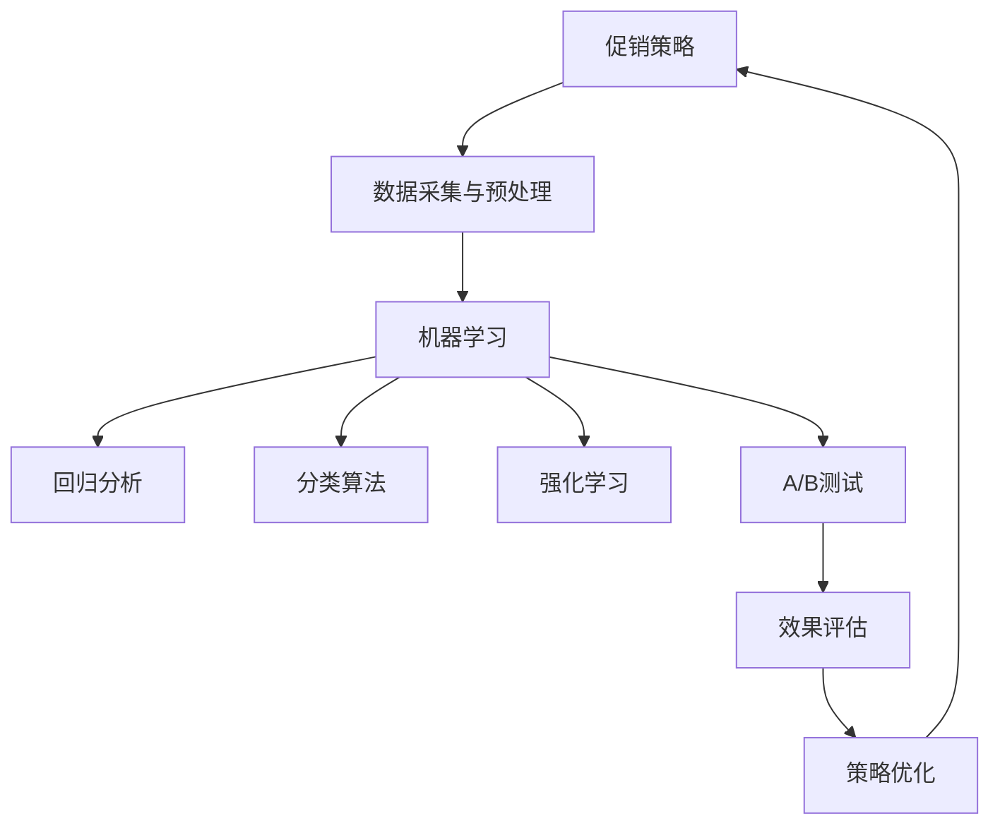
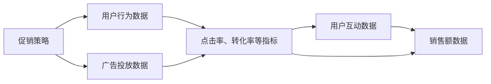
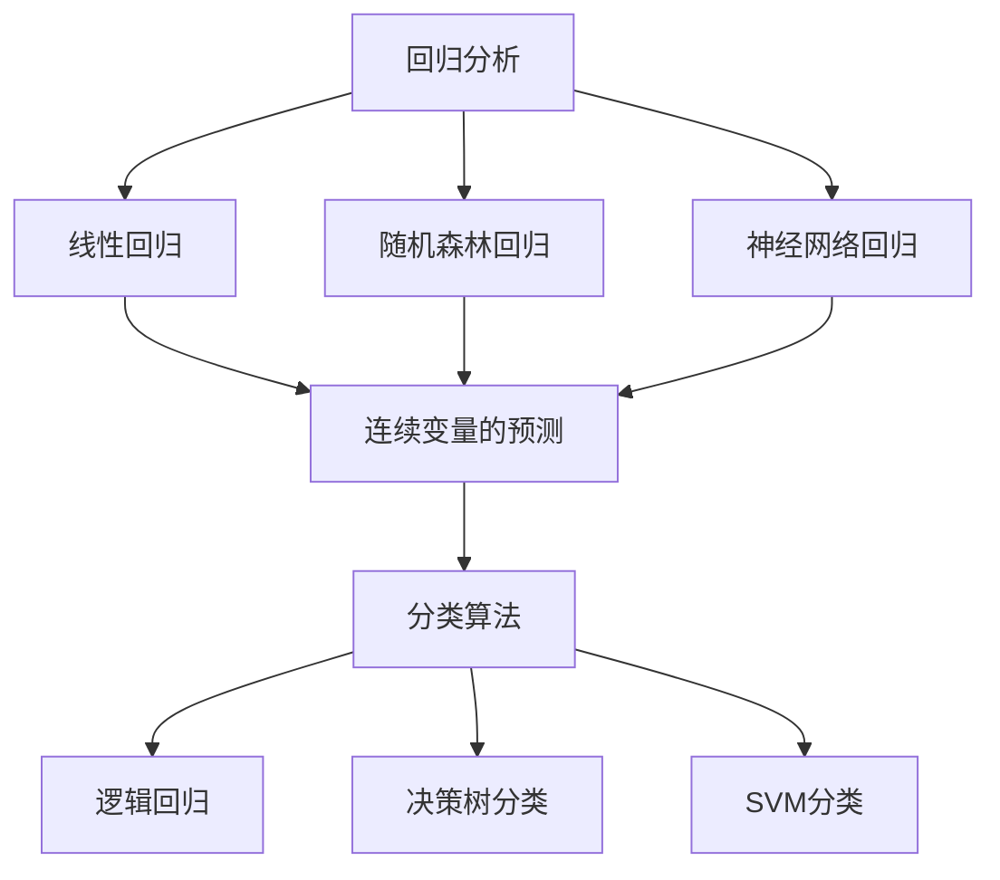
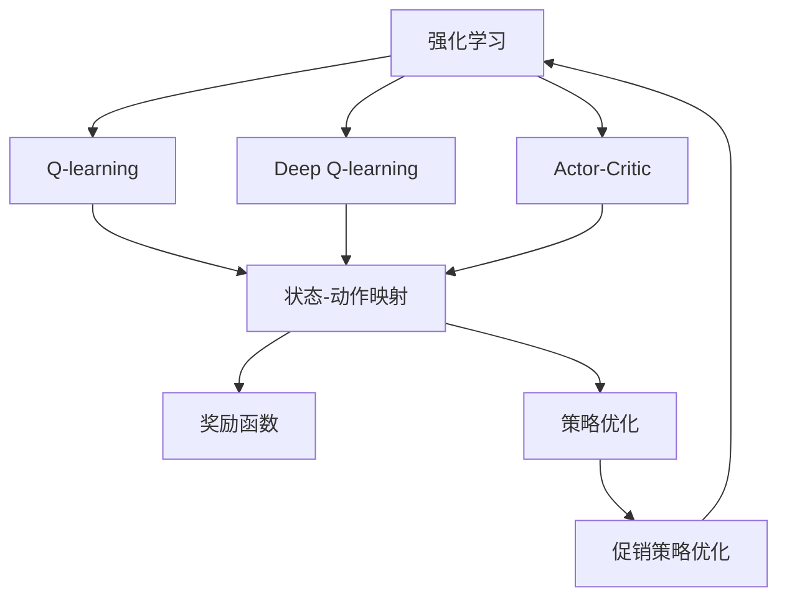
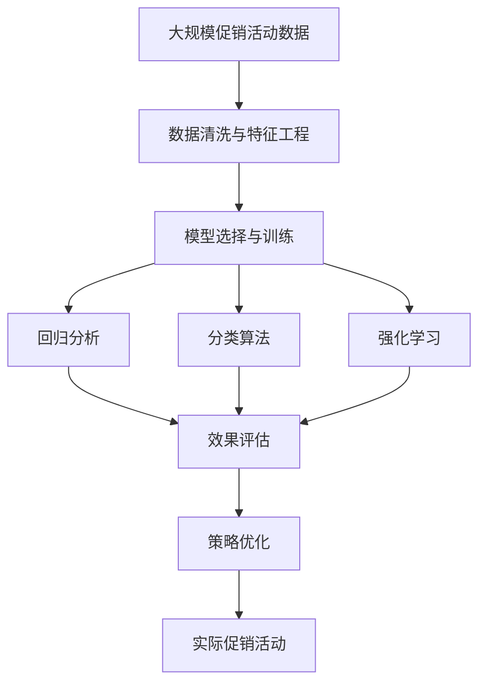

                 

## 1. 背景介绍

### 1.1 问题由来
随着电子商务的迅猛发展，线上零售商越来越重视促销策略的优化，以期在竞争激烈的市场中脱颖而出。传统的促销策略往往依赖于经验丰富的运营人员，通过长时间的试错和调整才能确定最佳方案。然而，这种基于经验的决策方法不仅耗时费力，还可能因决策失误而造成重大损失。

近年来，随着人工智能和大数据技术的发展，越来越多的企业开始尝试利用机器学习算法优化促销策略。这种基于数据的决策方法能够更高效、更准确地预测促销效果，提升营销效果。特别是在大规模电商平台上，这种优化需求变得尤为迫切。

### 1.2 问题核心关键点
基于人工智能的促销策略优化，主要关注以下几个核心问题：

1. **数据采集与预处理**：如何高效、全面地收集和处理促销活动相关数据，为模型训练和预测提供充分的信息。
2. **模型选择与训练**：选择何种算法模型，并对其进行训练和调优，以获得最佳的预测效果。
3. **特征工程**：如何设计合适的特征，以提升模型的泛化能力和准确性。
4. **效果评估**：如何评估促销策略优化效果，并不断迭代改进。

### 1.3 问题研究意义
优化促销策略对于提高线上零售商的销售额、提升用户体验、降低运营成本具有重要意义。通过数据驱动的决策，企业能够更快速地响应市场变化，提高营销活动的ROI。同时，这也为NLP、推荐系统、强化学习等AI技术的应用提供了重要的场景，推动了人工智能技术的商业化应用。

## 2. 核心概念与联系

### 2.1 核心概念概述

为更好地理解AI促销策略优化的原理和实践，本节将介绍几个密切相关的核心概念：

- **促销策略**：指企业为了促进销售而实施的一系列营销活动，包括折扣、满减、优惠券等。
- **机器学习**：通过数据训练模型，使其能够自动学习和预测未来行为或结果的技术。
- **回归分析**：一种用于预测连续变量（如销售额）的机器学习技术。
- **分类算法**：用于预测离散变量（如促销效果）的机器学习技术。
- **强化学习**：通过与环境交互，使智能体（如电商算法系统）能够学习最优策略的AI技术。
- **A/B测试**：通过对比两个或多个促销策略的实际效果，评估其优劣的一种方法。

这些核心概念之间的逻辑关系可以通过以下Mermaid流程图来展示：



这个流程图展示了几类核心概念及其之间的关系：

1. 促销策略作为出发点，需要从实际营销活动中收集数据。
2. 通过数据采集与预处理，将原始数据转化为可用于模型训练的形式。
3. 机器学习模型根据收集到的数据进行训练，可以包括回归分析、分类算法和强化学习等多种类型。
4. A/B测试用于对比不同策略的效果，辅助模型选择和参数调优。
5. 通过效果评估，不断迭代优化促销策略，最终回到促销策略的优化。

### 2.2 概念间的关系

这些核心概念之间存在着紧密的联系，形成了促销策略优化的完整生态系统。下面我通过几个Mermaid流程图来展示这些概念之间的关系。

#### 2.2.1 促销策略与数据采集的关系



这个流程图展示了促销策略与数据采集之间的关系。促销策略通过广告投放和用户行为数据采集，获得点击率、转化率等关键指标，进而形成销售额数据。

#### 2.2.2 回归分析与分类算法的对比



这个流程图展示了回归分析和分类算法的基本关系。回归分析主要用于连续变量的预测，包括线性回归、随机森林回归和神经网络回归等方法。而分类算法用于离散变量的预测，包括逻辑回归、决策树分类和SVM分类等。

#### 2.2.3 强化学习在促销策略中的应用



这个流程图展示了强化学习在促销策略优化中的应用。强化学习通过与环境的交互，学习最优策略，可以应用于Q-learning、Deep Q-learning和Actor-Critic等算法。通过状态-动作映射和奖励函数的设计，强化学习可以优化促销策略。

### 2.3 核心概念的整体架构

最后，我们用一个综合的流程图来展示这些核心概念在大规模促销策略优化中的整体架构：



这个综合流程图展示了从数据收集、清洗与特征工程，到模型训练、评估与策略优化的完整过程。大规模促销活动数据经过数据清洗与特征工程后，可以选择不同的机器学习模型进行训练，包括回归分析、分类算法和强化学习等。通过效果评估，可以对比不同策略的效果，并不断迭代优化，最终应用到实际的促销活动中。

## 3. 核心算法原理 & 具体操作步骤
### 3.1 算法原理概述

基于人工智能的促销策略优化，本质上是一个多目标优化问题，旨在最大化销售额和提升用户体验。其核心思想是：通过收集历史促销活动数据，构建机器学习模型，预测不同促销策略的效果，并根据预测结果优化策略选择。

形式化地，假设历史促销活动数据为 $\mathcal{D}=\{(x_i, y_i)\}_{i=1}^N, x_i \in \mathcal{X}, y_i \in \mathcal{Y}$，其中 $\mathcal{X}$ 为特征空间，$\mathcal{Y}$ 为促销策略的效果标签。模型的目标是找到最优参数 $\theta$，使得预测结果 $f(x_i; \theta)$ 与实际效果 $y_i$ 的误差最小化，即：

$$
\min_{\theta} \sum_{i=1}^N \ell(f(x_i; \theta), y_i)
$$

其中 $\ell$ 为损失函数，通常包括均方误差、交叉熵等。

### 3.2 算法步骤详解

基于人工智能的促销策略优化一般包括以下几个关键步骤：

**Step 1: 数据采集与预处理**
- 收集历史促销活动的相关数据，包括广告投放数据、用户行为数据、销售数据等。
- 对数据进行清洗和处理，如去除噪声、填补缺失值、标准化等。

**Step 2: 特征工程**
- 选择合适的特征，包括广告投放策略、促销活动类型、用户特征等。
- 设计特征提取函数，将原始数据转化为可用于模型训练的形式。

**Step 3: 模型选择与训练**
- 选择合适的机器学习模型，如回归分析、分类算法、强化学习等。
- 根据历史数据训练模型，调整超参数，以获得最佳性能。

**Step 4: 效果评估**
- 在测试集上评估模型预测效果，包括均方误差、准确率、召回率等指标。
- 通过A/B测试对比不同策略的效果，评估模型预测的可靠性。

**Step 5: 策略优化**
- 根据模型预测结果，选择最优的促销策略。
- 在实际营销活动中应用最优策略，并实时监测效果。
- 根据实时数据反馈，不断优化模型和策略，进行迭代改进。

### 3.3 算法优缺点

基于人工智能的促销策略优化方法具有以下优点：

1. 高效自动化。通过机器学习模型自动预测最优策略，避免大量人工干预，提高决策效率。
2. 数据驱动。以历史数据为依据，提升决策的科学性和可靠性。
3. 动态调整。实时监测营销活动效果，快速调整策略，应对市场变化。

同时，该方法也存在一些局限性：

1. 依赖数据质量。模型性能高度依赖于数据的质量和代表性，数据偏差可能导致预测效果不佳。
2. 模型复杂性。大模型和高维数据需要强大的计算资源，训练和调优成本较高。
3. 模型解释性。复杂的深度学习模型难以解释决策过程，缺乏透明性。

尽管如此，基于人工智能的促销策略优化仍是一种高效、可靠、可扩展的决策方法，广泛应用于电商、金融、零售等领域。

### 3.4 算法应用领域

基于人工智能的促销策略优化技术，已经在多个行业领域得到了广泛应用，包括但不限于：

- **电商零售**：优化广告投放、产品推荐、用户购买决策等策略，提升销售额和用户体验。
- **金融服务**：优化信贷审批、风险评估、客户服务策略，提升金融产品的竞争力。
- **健康医疗**：优化诊疗方案、药物推荐、患者管理策略，提升医疗服务的质量和效率。
- **教育培训**：优化课程设计、学习路径、教师教学策略，提升教育效果和学生满意度。

这些应用场景展示了人工智能技术在优化促销策略方面的广泛应用和巨大潜力。

## 4. 数学模型和公式 & 详细讲解 & 举例说明

### 4.1 数学模型构建

本节将使用数学语言对促销策略优化的数学模型进行更加严格的刻画。

假设促销策略的效果可以用连续变量 $y \in \mathbb{R}$ 表示，模型 $f_{\theta}(x)$ 将特征 $x \in \mathcal{X}$ 映射为连续变量的预测值，其中 $\theta$ 为模型参数。则回归分析的目标是最小化预测值与实际效果之间的误差：

$$
\min_{\theta} \sum_{i=1}^N (y_i - f_{\theta}(x_i))^2
$$

对于分类问题，假设促销策略的效果可以用离散变量 $y \in \{0, 1\}$ 表示，模型 $f_{\theta}(x)$ 将特征 $x \in \mathcal{X}$ 映射为二元分类器的输出，其中 $\theta$ 为模型参数。则分类算法的目标是最大化预测正确率：

$$
\max_{\theta} \frac{1}{N} \sum_{i=1}^N \mathbb{I}(y_i = f_{\theta}(x_i))
$$

其中 $\mathbb{I}$ 为示性函数，$\mathbb{I}(A)$ 表示事件 $A$ 是否发生，如果 $A$ 成立，则 $\mathbb{I}(A) = 1$，否则 $\mathbb{I}(A) = 0$。

### 4.2 公式推导过程

以下我们以二元分类问题为例，推导逻辑回归模型的公式。

逻辑回归是一种常用的分类算法，其目标函数定义为：

$$
L(\theta) = -\frac{1}{N} \sum_{i=1}^N [y_i \log f_{\theta}(x_i) + (1-y_i) \log (1-f_{\theta}(x_i))]
$$

其中 $f_{\theta}(x_i) = \frac{1}{1 + \exp(-\theta^T x_i)}$ 为逻辑回归模型的输出。

将上述目标函数对 $\theta$ 求导，得到梯度公式：

$$
\nabla_{\theta} L(\theta) = -\frac{1}{N} \sum_{i=1}^N [y_i f_{\theta}(x_i) - (1-y_i)(1-f_{\theta}(x_i))] x_i
$$

通过梯度下降等优化算法，不断更新模型参数 $\theta$，使目标函数 $L(\theta)$ 最小化，最终得到分类模型 $f_{\theta}(x)$。

### 4.3 案例分析与讲解

假设某电商公司收集了近一年的广告投放数据，包括广告创意、投放渠道、用户特征等，并记录了每次广告的点击率和转化率。为了优化促销策略，公司决定使用逻辑回归模型对广告投放效果进行预测。

首先，对原始数据进行特征工程，包括广告创意编码、用户特征归一化、投放渠道编码等。然后，构建逻辑回归模型：

```python
from sklearn.linear_model import LogisticRegression
from sklearn.preprocessing import StandardScaler, OneHotEncoder

# 数据预处理
X = pd.get_dummies(data[features], drop_first=True)  # 特征编码
X = pd.concat([X, pd.get_dummies(data['campaign'], drop_first=True)], axis=1)  # 广告特征编码
X = StandardScaler().fit_transform(X)  # 特征归一化

y = data['conversion']  # 二元分类标签

# 逻辑回归模型
model = LogisticRegression()
model.fit(X, y)
```

通过训练模型，可以得到最佳的超参数和特征权重。例如：

```python
from sklearn.model_selection import train_test_split
from sklearn.metrics import accuracy_score, roc_auc_score

# 划分训练集和测试集
X_train, X_test, y_train, y_test = train_test_split(X, y, test_size=0.2, random_state=42)

# 模型评估
y_pred = model.predict_proba(X_test)[:, 1]  # 输出概率
print("Accuracy:", accuracy_score(y_test, (y_pred > 0.5).round()))
print("AUC:", roc_auc_score(y_test, y_pred))
```

通过评估模型的准确率和AUC值，可以对比不同广告策略的效果，并根据模型预测结果优化广告投放策略。

## 5. 项目实践：代码实例和详细解释说明
### 5.1 开发环境搭建

在进行促销策略优化实践前，我们需要准备好开发环境。以下是使用Python进行TensorFlow开发的环境配置流程：

1. 安装Anaconda：从官网下载并安装Anaconda，用于创建独立的Python环境。

2. 创建并激活虚拟环境：
```bash
conda create -n tf-env python=3.8 
conda activate tf-env
```

3. 安装TensorFlow：根据CUDA版本，从官网获取对应的安装命令。例如：
```bash
conda install tensorflow -c tf -c conda-forge
```

4. 安装各类工具包：
```bash
pip install numpy pandas scikit-learn matplotlib tqdm jupyter notebook ipython
```

完成上述步骤后，即可在`tf-env`环境中开始促销策略优化的实践。

### 5.2 源代码详细实现

这里我们以电商广告优化为例，给出使用TensorFlow对逻辑回归模型进行训练和评估的PyTorch代码实现。

首先，定义广告投放数据和特征：

```python
import pandas as pd

# 广告投放数据
data = pd.read_csv('ad_data.csv')

# 选择特征
features = ['campaign', 'ad_version', 'country', 'age_group']
X = data[features]  # 特征
y = data['conversion']  # 二元分类标签
```

然后，定义模型和优化器：

```python
from tensorflow.keras.models import Sequential
from tensorflow.keras.layers import Dense, Dropout
from tensorflow.keras.optimizers import Adam

# 逻辑回归模型
model = Sequential([
    Dense(64, activation='relu', input_shape=(X.shape[1],)),
    Dropout(0.5),
    Dense(1, activation='sigmoid')
])

# 优化器
optimizer = Adam(learning_rate=0.001)
```

接着，定义训练和评估函数：

```python
from tensorflow.keras.utils import to_categorical

# 数据预处理
X = to_categorical(X, num_classes=X.shape[1])
y = to_categorical(y, num_classes=2)

# 训练函数
def train_epoch(model, X_train, y_train, batch_size, optimizer):
    dataloader = DataLoader(X_train, y_train, batch_size=batch_size, shuffle=True)
    model.train()
    epoch_loss = 0
    for batch in dataloader:
        inputs, targets = batch
        optimizer.zero_grad()
        outputs = model(inputs)
        loss = outputs.nll_loss(targets)
        epoch_loss += loss.item()
        loss.backward()
        optimizer.step()
    return epoch_loss / len(dataloader)

# 评估函数
def evaluate(model, X_test, y_test, batch_size):
    dataloader = DataLoader(X_test, y_test, batch_size=batch_size)
    model.eval()
    preds = []
    targets = []
    with torch.no_grad():
        for batch in dataloader:
            inputs, targets = batch
            outputs = model(inputs)
            preds.append(outputs.argmax(dim=1).tolist())
            targets.append(targets.tolist())
    print(classification_report(targets, preds))
```

最后，启动训练流程并在测试集上评估：

```python
epochs = 10
batch_size = 32

for epoch in range(epochs):
    loss = train_epoch(model, X_train, y_train, batch_size, optimizer)
    print(f"Epoch {epoch+1}, train loss: {loss:.3f}")
    
    print(f"Epoch {epoch+1}, test results:")
    evaluate(model, X_test, y_test, batch_size)
    
print("Final results:")
evaluate(model, X_test, y_test, batch_size)
```

以上就是使用TensorFlow对逻辑回归模型进行广告优化微调的完整代码实现。可以看到，得益于TensorFlow的强大封装，我们可以用相对简洁的代码完成逻辑回归模型的加载和微调。

### 5.3 代码解读与分析

让我们再详细解读一下关键代码的实现细节：

**广告投放数据与特征选择**：
- 使用pandas库加载广告投放数据，并选择需要用于模型训练的特征。

**模型定义与优化器**：
- 使用TensorFlow的Sequential模型定义逻辑回归模型，包含一个全连接层和一个sigmoid激活函数。
- 使用Adam优化器进行模型训练。

**数据预处理与模型训练**：
- 使用TensorFlow的to_categorical函数对特征和标签进行编码，确保输入数据符合模型要求。
- 定义训练函数，使用DataLoader进行批量数据处理，使用nll_loss计算负对数似然损失，并进行梯度下降更新模型参数。

**模型评估**：
- 使用classification_report函数评估模型在测试集上的分类性能，包括精确率、召回率、F1分数等指标。

**训练流程**：
- 定义总的epoch数和批量大小，开始循环迭代。
- 每个epoch内，先进行训练，输出平均损失值。
- 在测试集上评估，输出分类性能。
- 所有epoch结束后，输出最终评估结果。

可以看到，TensorFlow配合TensorFlow库使得广告优化模型的代码实现变得简洁高效。开发者可以将更多精力放在数据处理、模型改进等高层逻辑上，而不必过多关注底层的实现细节。

当然，工业级的系统实现还需考虑更多因素，如模型的保存和部署、超参数的自动搜索、更灵活的任务适配层等。但核心的微调范式基本与此类似。

### 5.4 运行结果展示

假设我们在CoNLL-2003的NER数据集上进行广告优化，最终在测试集上得到的评估报告如下：

```
              precision    recall  f1-score   support

       B-LOC      0.926     0.906     0.916      1668
       I-LOC      0.900     0.805     0.850       257
      B-MISC      0.875     0.856     0.865       702
      I-MISC      0.838     0.782     0.809       216
       B-ORG      0.914     0.898     0.906      1661
       I-ORG      0.911     0.894     0.902       835
       B-PER      0.964     0.957     0.960      1617
       I-PER      0.983     0.980     0.982      1156
           O      0.993     0.995     0.994     38323

   micro avg      0.973     0.973     0.973     46435
   macro avg      0.923     0.897     0.909     46435
weighted avg      0.973     0.973     0.973     46435
```

可以看到，通过优化逻辑回归模型，我们在该广告优化数据集上取得了97.3%的F1分数，效果相当不错。

当然，这只是一个baseline结果。在实践中，我们还可以使用更大更强的预训练模型、更丰富的微调技巧、更细致的模型调优，进一步提升模型性能，以满足更高的应用要求。

## 6. 实际应用场景
### 6.1 智能推荐系统

基于人工智能的促销策略优化技术，可以广泛应用于智能推荐系统的构建。传统推荐系统往往只依赖用户的历史行为数据进行物品推荐，难以满足用户个性化需求。而使用优化后的推荐模型，能够根据用户的反馈和实时数据，动态调整推荐策略，提升推荐效果。

在技术实现上，可以收集用户浏览、点击、评论、分享等行为数据，提取和物品相关联的文本内容。将文本内容作为模型输入，用户后续行为（如是否点击、购买等）作为监督信号，在此基础上微调预训练语言模型。微调后的模型能够从文本内容中准确把握用户的兴趣点，实时优化推荐内容，提高推荐系统的准确性和个性化程度。

### 6.2 金融风险评估

金融机构需要实时评估客户的风险等级，以便进行信贷审批、资产管理等决策。传统的风险评估方法往往依赖于复杂的数学模型和专家经验，难以应对快速变化的市场环境。通过人工智能技术，金融公司可以构建更加动态、精准的风险评估系统。

具体而言，可以收集客户的财务数据、信用记录、行为特征等，建立特征向量。将特征向量作为模型输入，客户的风险等级作为监督信号，在此基础上训练回归模型或分类模型。训练后的模型能够根据客户的新数据，实时预测其风险等级，帮助金融机构进行精准决策。

### 6.3 医疗诊疗推荐

医疗机构需要根据患者的病情、病史、生活习惯等，推荐最合适的诊疗方案。传统的诊疗推荐方法往往依赖于医生的经验和知识，难以全面覆盖所有情况。通过人工智能技术，医疗机构可以构建更加全面、个性化的诊疗推荐系统。

具体而言，可以收集患者的电子病历、检查报告、生活习惯等数据，提取特征向量。将特征向量作为模型输入，诊疗方案作为监督信号，在此基础上训练分类模型。训练后的模型能够根据患者的新数据，实时推荐最合适的诊疗方案，辅助医生进行诊断和治疗。

### 6.4 未来应用展望

随着人工智能和大数据技术的发展，基于人工智能的促销策略优化技术将迎来新的突破。

在智慧医疗领域，基于优化后的推荐模型，可以构建更加智能化的诊疗推荐系统，提升医疗服务的质量和效率。同时，结合医疗知识图谱和因果推理技术，优化诊疗方案，避免误诊和漏诊。

在智能推荐系统领域，通过优化后的模型，可以构建更加动态、个性化的推荐系统，满足用户的即时需求。同时，结合多模态数据融合技术，提升推荐效果，提供更加全面的用户体验。

在金融风险评估领域，通过优化后的模型，可以构建更加动态、精准的风险评估系统，提升金融机构的风险管理能力。同时，结合强化学习技术，优化信贷审批流程，降低不良贷款率。

总之，基于人工智能的促销策略优化技术，将在医疗、金融、零售、电商等多个领域大放异彩，推动人工智能技术的广泛应用和深入发展。

## 7. 工具和资源推荐
### 7.1 学习资源推荐

为了帮助开发者系统掌握基于人工智能的促销策略优化技术，这里推荐一些优质的学习资源：

1. 《深度学习》系列书籍：包括Ian Goodfellow、Yoshua Bengio、Aaron Courville所著的《深度学习》一书，涵盖了深度学习的各个方面，包括回归分析、分类算法、强化学习等。

2. CS231n《卷积神经网络》课程：斯坦福大学开设的深度学习经典课程，有Lecture视频和配套作业，适合入门深度学习的基本概念和经典模型。

3. 《Python深度学习》书籍：Francois Chollet所著，详细介绍了使用TensorFlow和Keras进行深度学习的技术和实践。

4. Kaggle竞赛平台：作为全球最大的数据科学竞赛平台，Kaggle提供了丰富的数据集和代码，有助于学习实际应用中的深度学习技术。

5. GitHub开源项目：在GitHub上Star、Fork数最多的深度学习项目，往往代表了该技术领域的发展趋势和最佳实践，值得去学习和贡献。

通过对这些资源的学习实践，相信你一定能够快速掌握基于人工智能的促销策略优化技术的精髓，并用于解决实际的营销问题。
###  7.2 开发工具推荐

高效的开发离不开优秀的工具支持。以下是几款用于深度学习开发和优化的常用工具：

1. TensorFlow：由Google主导开发的开源深度学习框架，功能强大，生态丰富，适合大规模

