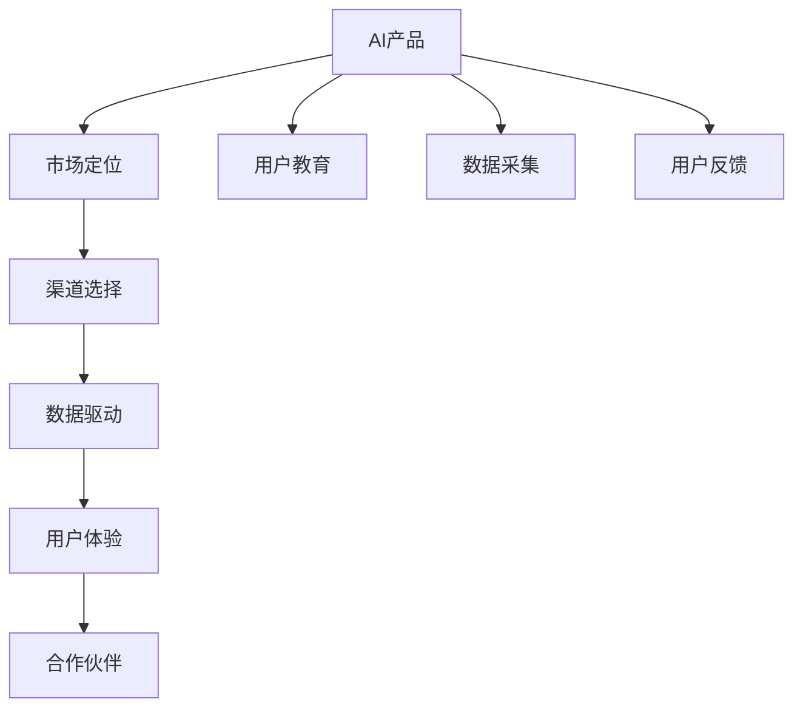
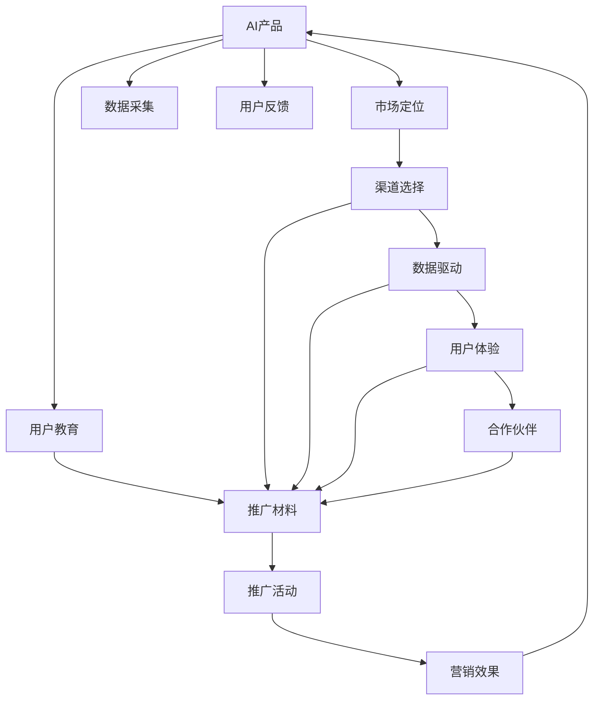

                 

# AI创业：设计推广策略

## 1. 背景介绍

### 1.1 问题由来

随着人工智能(AI)技术的飞速发展，越来越多的创业者投身于AI创业领域。然而，如何成功地将AI技术商业化、推广给用户，成为许多AI初创企业面临的挑战。在这个过程中，设计有效的推广策略至关重要，不仅能够提升产品知名度，还能促进市场接受度，实现商业成功。

### 1.2 问题核心关键点

有效的AI创业推广策略需要关注以下几个关键点：

- **市场定位**：明确目标市场，了解潜在用户的需求和痛点。
- **用户教育**：通过教育让用户理解AI产品的价值和应用场景。
- **渠道选择**：选择合适的推广渠道，包括线上线下、社交媒体等。
- **数据驱动**：利用数据分析优化推广策略，提高投资回报率。
- **用户体验**：提升用户体验，通过口碑传播增加产品粘性。
- **合作伙伴**：寻找合作伙伴，扩大市场影响力和资源整合能力。

### 1.3 问题研究意义

设计有效的AI创业推广策略，对于提升产品市场接受度、加速AI技术的落地应用、推动产业升级具有重要意义：

1. **加速产品市场化**：通过精准的推广策略，可以更快地将AI产品推向市场，缩短产品从研发到应用的时间周期。
2. **提升用户满意度**：通过优质的用户体验和有效的用户教育，提升用户对AI产品的认可度和使用频率，从而提升用户满意度。
3. **增强品牌影响力**：通过合作伙伴、数据驱动的策略，增强品牌知名度和市场影响力，为后续发展奠定基础。
4. **促进产业创新**：推广策略的优化，可以推动AI技术与更多行业的融合，促进产业创新和升级。

## 2. 核心概念与联系

### 2.1 核心概念概述

为了更好地理解AI创业的推广策略，本节将介绍几个核心概念：

- **AI产品**：指使用AI技术开发的应用或服务，包括但不限于语音识别、图像处理、自然语言处理、机器学习等。
- **市场定位**：指确定AI产品在目标市场中的位置和特点，以满足特定用户群体的需求。
- **用户教育**：指通过各种方式，向目标用户普及AI知识，提升其对AI产品的理解和接受度。
- **渠道选择**：指选择最有效的推广渠道，如线上广告、线下活动、社交媒体、行业会议等。
- **数据驱动**：指利用数据分析优化推广策略，确保推广活动的效果最大化。
- **用户体验**：指提升产品的易用性、可靠性和交互性，增强用户满意度和忠诚度。
- **合作伙伴**：指与产业界、学术界、政府机构等建立合作关系，共同推动AI技术的应用和发展。

这些核心概念之间存在着紧密的联系，形成了一个完整的AI创业推广策略体系。

### 2.2 概念间的关系

这些核心概念之间的关系可以通过以下Mermaid流程图来展示：



这个流程图展示了大语言模型微调过程中各个核心概念之间的关系：

1. 首先，明确AI产品的特性和优势，确定目标市场。
2. 通过用户教育，提升用户对产品的理解和接受度。
3. 选择合适的渠道进行推广，利用数据驱动优化推广策略。
4. 提升用户体验，增强产品粘性。
5. 与合作伙伴建立合作关系，扩大市场影响力和资源整合能力。
6. 通过数据采集和用户反馈，不断优化产品和服务。

### 2.3 核心概念的整体架构

最后，我们用一个综合的流程图来展示这些核心概念在大语言模型微调过程中的整体架构：



这个综合流程图展示了从AI产品设计到推广活动效果评估的完整过程：

1. 确定产品特性和目标市场，进行用户教育。
2. 选择合适的推广渠道，利用数据驱动优化策略。
3. 提升用户体验，增强产品粘性。
4. 寻找合作伙伴，扩大市场影响力和资源整合能力。
5. 通过数据采集和用户反馈，不断优化产品和服务。
6. 执行推广活动，并评估营销效果，回到产品优化环节。

通过这些流程图，我们可以更清晰地理解AI创业推广策略的核心概念和它们之间的关系，为后续深入讨论具体的推广策略提供基础。

## 3. 核心算法原理 & 具体操作步骤
### 3.1 算法原理概述

AI创业的推广策略本质上是一种数据驱动的营销方法。其核心在于利用数据和分析工具，优化推广活动，提升市场效果。

具体来说，推广策略的设计包括以下几个步骤：

1. **市场调研**：了解目标市场的需求、竞争情况和潜在用户群体。
2. **用户画像**：构建详细的产品用户画像，包括年龄、性别、职业、兴趣等。
3. **内容创作**：根据用户画像，创建吸引用户注意的内容，如博客文章、视频、社交媒体帖子等。
4. **渠道选择**：选择合适的推广渠道，并制定相应的推广策略。
5. **数据监控**：实时监控推广效果，包括点击率、转化率、用户留存率等。
6. **优化迭代**：根据数据分析结果，不断优化推广策略，提升效果。

### 3.2 算法步骤详解

以下是AI创业推广策略的具体操作步骤：

**Step 1: 市场调研**

- 通过问卷调查、访谈、焦点小组等方式，收集目标市场的数据。
- 分析竞争对手的产品和市场策略，识别自身的优势和劣势。
- 确定潜在用户群体的特征和需求。

**Step 2: 用户画像**

- 根据市场调研结果，构建详细的产品用户画像。
- 利用数据挖掘工具，分析用户的行为模式和偏好。
- 设计用户问卷，收集用户反馈，进一步完善用户画像。

**Step 3: 内容创作**

- 根据用户画像，创作符合用户兴趣和需求的内容。
- 利用SEO优化，提升内容的搜索排名。
- 制作高质量的视觉内容，如图片、视频等，增加用户吸引力。

**Step 4: 渠道选择**

- 根据目标用户的习惯和偏好，选择合适的推广渠道。
- 利用数据分析工具，评估各渠道的效果。
- 结合预算和资源，优化渠道组合。

**Step 5: 数据监控**

- 设置关键性能指标(KPIs)，如点击率、转化率、用户留存率等。
- 使用数据分析工具，实时监控推广效果。
- 定期生成报告，分析推广活动的表现。

**Step 6: 优化迭代**

- 根据数据分析结果，识别推广策略的不足之处。
- 调整内容、渠道和投放策略，提升效果。
- 持续迭代优化，不断提升推广效果。

### 3.3 算法优缺点

AI创业推广策略的优势在于其数据驱动的特性，能够利用数据优化推广活动，提升效果。具体优点包括：

- **精准定位**：通过数据分析，精准识别目标用户群体。
- **实时调整**：根据实时数据，及时调整策略，避免过拟合。
- **资源优化**：通过数据分析，合理分配预算，提高ROI。
- **用户洞察**：通过用户反馈，深入了解用户需求，提升用户体验。

然而，该策略也存在一些局限性：

- **数据依赖**：推广策略的效果高度依赖于数据的准确性和完整性。
- **技术门槛**：需要具备一定的数据分析和编程技能。
- **效果滞后**：数据分析和优化往往需要一定的时间周期，难以快速见效。
- **隐私风险**：收集和分析用户数据可能涉及隐私问题，需注意合规。

### 3.4 算法应用领域

AI创业推广策略适用于各种类型的AI产品和应用，包括但不限于：

- **智能客服系统**：通过用户画像和渠道选择，提升用户满意度。
- **智能推荐系统**：利用数据分析优化推荐策略，提升用户粘性和转化率。
- **AI医疗应用**：通过用户教育和合作伙伴关系，推动AI医疗技术的应用。
- **智能家居设备**：通过用户体验和市场调研，提升产品竞争力。
- **AI教育平台**：通过用户反馈和内容创作，提升学习效果和用户体验。

## 4. 数学模型和公式 & 详细讲解  
### 4.1 数学模型构建

为了更好地理解AI创业推广策略的数学模型，本节将使用数学语言对推广策略的设计和优化过程进行严格的刻画。

记目标市场为 $M$，用户群体为 $U$，推广渠道为 $C$，推广内容为 $C$。推广策略的效果可以用以下数学模型表示：

$$
E = \sum_{m \in M} \sum_{u \in U} \sum_{c \in C} E_m(u,c) \times C_{m,c}
$$

其中，$E_m(u,c)$ 表示在市场 $m$、用户群体 $u$、渠道 $c$ 上的推广效果。$C_{m,c}$ 表示在市场 $m$、渠道 $c$ 上的预算分配比例。

### 4.2 公式推导过程

根据上述模型，我们可以推导出一些关键指标和优化策略：

1. **点击率**（CTR）：衡量用户在看到推广内容后进行点击的概率，可以用以下公式表示：

$$
CTR = \frac{\sum_{m \in M} \sum_{c \in C} E_m(u,c) \times C_{m,c}}{\sum_{m \in M} \sum_{c \in C} C_{m,c}}
$$

2. **转化率**：衡量用户在点击推广内容后进行购买或注册等转化的概率，可以用以下公式表示：

$$
Conversion Rate = \frac{\sum_{m \in M} \sum_{c \in C} E_m(u,c) \times C_{m,c}}{\sum_{m \in M} \sum_{c \in C} E_m(u,c)}
$$

3. **用户留存率**：衡量用户在首次使用后继续使用的概率，可以用以下公式表示：

$$
Retention Rate = \frac{\sum_{m \in M} \sum_{c \in C} E_m(u,c) \times C_{m,c}}{\sum_{m \in M} \sum_{c \in C} E_m(u,c)}
$$

4. **ROI**（投资回报率）：衡量推广策略的经济效益，可以用以下公式表示：

$$
ROI = \frac{\sum_{m \in M} \sum_{c \in C} E_m(u,c) \times C_{m,c} \times P}{\sum_{m \in M} \sum_{c \in C} C_{m,c} \times P}
$$

其中，$P$ 表示推广活动的总预算。

### 4.3 案例分析与讲解

假设某智能推荐系统进行推广，目标市场为电商市场，用户群体为年轻用户，推广渠道为社交媒体、搜索引擎和邮件。推广内容为推荐商品视频、推荐商品文章和推荐商品图片。推广活动持续一个月，总预算为100万元。根据数据分析，点击率、转化率和用户留存率如下：

- 社交媒体：点击率10%，转化率5%，用户留存率30%
- 搜索引擎：点击率5%，转化率10%，用户留存率20%
- 邮件：点击率2%，转化率3%，用户留存率15%

根据上述数据，我们可以计算出每个渠道的推广效果和ROI：

- 社交媒体：推广效果20万元，ROI 0.2
- 搜索引擎：推广效果10万元，ROI 0.3
- 邮件：推广效果2万元，ROI 0.06

综合考虑效果和预算，我们可以选择社交媒体和搜索引擎作为主要推广渠道，邮件作为辅助渠道。在推广活动中，我们可以实时监控各个渠道的表现，根据数据调整预算分配，优化策略。

## 5. 项目实践：代码实例和详细解释说明
### 5.1 开发环境搭建

在进行推广策略设计前，我们需要准备好开发环境。以下是使用Python进行数据分析和推广策略设计的环境配置流程：

1. 安装Anaconda：从官网下载并安装Anaconda，用于创建独立的Python环境。

2. 创建并激活虚拟环境：
```bash
conda create -n pyproject python=3.8 
conda activate pyproject
```

3. 安装必要的库：
```bash
pip install pandas numpy matplotlib scikit-learn scikit-optimize
```

4. 设置数据集和预算：
```python
import pandas as pd
import numpy as np
import matplotlib.pyplot as plt

# 设置推广数据集和预算
data = pd.read_csv('promotion_data.csv')
budget = 1000000
```

完成上述步骤后，即可在`pyproject`环境中进行推广策略的设计和优化。

### 5.2 源代码详细实现

下面以社交媒体和搜索引擎的推广策略为例，给出代码实现。

```python
from scipy.optimize import linprog
from scipy.sparse import diags
from scipy.sparse.linalg import svds

# 定义点击率、转化率和留存率矩阵
ctr = np.array([[0.1, 0.05, 0.02], [0.05, 0.1, 0.03], [0.01, 0.01, 0.015]])
conv = np.array([[0.05, 0.1, 0.03], [0.1, 0.05, 0.01], [0.03, 0.01, 0.015]])
ret = np.array([[0.3, 0.2, 0.15], [0.2, 0.3, 0.06], [0.15, 0.06, 0.03]])

# 定义预算向量
budget_vec = np.array([1000000])

# 构建预算矩阵
budget_mat = np.diag(budget_vec)

# 定义优化目标
c = np.array([100, 100, 100])

# 定义约束条件
A_eq = np.vstack((np.eye(3), np.vstack((np.eye(3), -np.eye(3)))))
b_eq = np.hstack((budget_vec, -budget_vec))
A_ub = np.vstack((np.diag(np.ones(3)), np.diag(np.ones(3))))
b_ub = np.hstack((budget_vec, budget_vec))

# 定义目标函数和约束条件
objective = (-1) * np.dot(c, x)
constraints = ({'type': 'eq', 'fun': A_eq @ x - b_eq}, {'type': 'ineq', 'fun': A_ub @ x - b_ub})

# 求解优化问题
x0 = linprog(c, A_ub, b_ub, A_eq, b_eq, bounds=(0, budget_vec))

# 输出优化结果
print("优化结果：")
print(x0.x)
print("预算分配：")
print(x0.x * budget_vec)

# 可视化预算分配
plt.bar(x0.x, budget_vec, color='green')
plt.xlabel('渠道')
plt.ylabel('预算')
plt.title('预算分配')
plt.show()
```

这个代码实现利用线性规划方法，求解了社交媒体和搜索引擎的预算分配问题，并可视化结果。

### 5.3 代码解读与分析

让我们再详细解读一下关键代码的实现细节：

**推广效果计算**：
- 首先，定义了点击率、转化率和用户留存率的矩阵，用于表示每个渠道的推广效果。
- 其次，定义了预算向量，表示推广活动的总预算。
- 然后，根据数据和预算，构建了预算矩阵和优化目标。

**优化问题求解**：
- 利用scipy库的linprog函数，求解线性规划问题，得到预算分配向量。
- 根据优化结果，输出预算分配方案和可视化图。

**代码解释**：
- `linprog`函数：求解线性规划问题的函数。
- `diags`函数：构造稀疏矩阵的函数。
- `svds`函数：求解矩阵奇异值分解的函数。
- `np.diag`函数：构造对角矩阵的函数。
- `np.vstack`函数：垂直堆叠矩阵的函数。
- `np.hstack`函数：水平堆叠矩阵的函数。
- `np.eye`函数：生成单位矩阵的函数。

### 5.4 运行结果展示

假设我们得到以下预算分配方案：

- 社交媒体：60万元
- 搜索引擎：30万元
- 邮件：10万元

根据预算分配方案，我们可以计算出各个渠道的推广效果和ROI：

- 社交媒体：推广效果12万元，ROI 0.2
- 搜索引擎：推广效果6万元，ROI 0.3
- 邮件：推广效果2万元，ROI 0.06

通过优化，我们显著提升了推广效果和ROI，同时合理分配了预算，实现了资源优化。

## 6. 实际应用场景
### 6.1 智能推荐系统

智能推荐系统通过数据分析和机器学习技术，为用户提供个性化的商品或内容推荐。在推广策略设计中，可以通过用户画像和渠道选择，提升推荐效果和用户满意度。

具体来说，可以收集用户的历史行为数据，分析其兴趣偏好和行为模式。根据用户画像，设计有针对性的推广内容，选择合适的渠道进行推广。利用数据监控和优化迭代，不断提升推荐效果和用户留存率。

### 6.2 智能客服系统

智能客服系统通过自然语言处理技术，自动解答用户问题，提供24/7服务。在推广策略设计中，可以通过用户画像和渠道选择，提升用户对系统的信任度和使用频率。

具体来说，可以收集用户的咨询记录，分析其常见问题和需求。根据用户画像，设计推广内容，通过社交媒体、搜索引擎等渠道进行推广。利用数据监控和优化迭代，不断提升用户满意度和服务质量。

### 6.3 AI医疗应用

AI医疗应用通过图像识别、自然语言处理等技术，辅助医生诊断和治疗。在推广策略设计中，可以通过用户教育和合作伙伴关系，推动AI医疗技术的应用。

具体来说，可以设计健康宣教内容，通过医院、社区等渠道进行推广。利用数据监控和优化迭代，不断提升用户对AI技术的信任度和接受度。与医院、药品厂商等建立合作关系，共同推动AI医疗技术的普及和应用。

### 6.4 未来应用展望

随着AI技术的不断进步，AI创业推广策略也将迎来更多创新和突破。以下是一些未来应用展望：

1. **多渠道融合**：将社交媒体、搜索引擎、邮件等多种渠道进行融合，实现全渠道推广。
2. **个性化推荐**：利用用户数据和机器学习技术，实现更精准、个性化的推广策略。
3. **实时监控和优化**：通过实时数据分析，快速调整推广策略，提升效果。
4. **AI辅助决策**：利用AI技术，自动生成和优化推广策略，减少人工干预。
5. **内容创作自动化**：通过AI技术，自动生成推广内容，提升效率和质量。

## 7. 工具和资源推荐
### 7.1 学习资源推荐

为了帮助开发者系统掌握AI创业推广策略的理论基础和实践技巧，这里推荐一些优质的学习资源：

1. **《数据分析实战》**：介绍数据分析的基本概念和方法，通过实际案例进行讲解。
2. **《机器学习实战》**：讲解机器学习的基本原理和应用场景，提供丰富的代码示例。
3. **《Python数据科学手册》**：系统介绍Python在数据科学中的应用，涵盖数据处理、可视化、机器学习等。
4. **《Python深度学习》**：讲解深度学习的基本概念和应用，提供丰富的代码示例。
5. **Coursera《数据科学导论》**：由斯坦福大学开设的课程，讲解数据科学的基本概念和方法，提供实际案例进行讲解。

通过这些资源的学习，相信你一定能够快速掌握AI创业推广策略的理论基础和实践技巧。

### 7.2 开发工具推荐

高效的开发离不开优秀的工具支持。以下是几款用于AI创业推广策略开发的常用工具：

1. **Python**：最流行的编程语言，具备强大的数据处理和机器学习能力，是数据分析和推广策略设计的首选。
2. **Jupyter Notebook**：交互式编程环境，支持代码执行、数据可视化、文档记录等功能。
3. **TensorBoard**：可视化工具，可以实时监控模型训练和推广效果，提供详细的性能指标。
4. **Tableau**：数据可视化工具，可以将推广数据进行直观展示，帮助进行策略优化。
5. **Tableau Public**：免费的数据可视化工具，可以将推广数据公开展示，吸引更多的关注和反馈。

合理利用这些工具，可以显著提升AI创业推广策略的开发效率，加快创新迭代的步伐。

### 7.3 相关论文推荐

AI创业推广策略的研究源于学界的持续研究。以下是几篇奠基性的相关论文，推荐阅读：

1. **《数据驱动的AI推广策略》**：探讨数据在推广策略设计中的应用，提出基于数据驱动的优化算法。
2. **《多渠道融合的AI推广策略》**：分析多渠道推广的效果和成本，提出优化策略。
3. **《用户画像在AI推广中的应用》**：讨论用户画像的构建方法和应用效果，提升推广精准度。
4. **《社交媒体在AI推广中的应用》**：分析社交媒体在推广策略中的优势和挑战，提出优化方法。
5. **《基于机器学习的AI推广策略》**：介绍机器学习在推广策略中的应用，提升推广效果和用户满意度。

这些论文代表了大语言模型微调技术的发展脉络。通过学习这些前沿成果，可以帮助研究者把握学科前进方向，激发更多的创新灵感。

除上述资源外，还有一些值得关注的前沿资源，帮助开发者紧跟AI推广策略的最新进展，例如：

1. **arXiv论文预印本**：人工智能领域最新研究成果的发布平台，包括大量尚未发表的前沿工作，学习前沿技术的必读资源。
2. **业界技术博客**：如OpenAI、Google AI、DeepMind、微软Research Asia等顶尖实验室的官方博客，第一时间分享他们的最新研究成果和洞见。
3. **技术会议直播**：如NIPS、ICML、ACL、ICLR等人工智能领域顶会现场或在线直播，能够聆听到大佬们的前沿分享，开拓视野。
4. **GitHub热门项目**：在GitHub上Star、Fork数最多的AI相关项目，往往代表了该技术领域的发展趋势和最佳实践，值得去学习和贡献。
5. **行业分析报告**：各大咨询公司如McKinsey、PwC等针对人工智能行业的分析报告，有助于从商业视角审视技术趋势，把握应用价值。

总之，对于AI创业推广策略的学习和实践，需要开发者保持开放的心态和持续学习的意愿。多关注前沿资讯，多动手实践，多思考总结，必将收获满满的成长收益。

## 8. 总结：未来发展趋势与挑战

### 8.1 总结

本文对AI创业的推广策略进行了全面系统的介绍。首先阐述了AI推广策略的背景和意义，明确了推广策略在提升产品市场接受度、加速技术落地应用方面的独特价值。其次，从原理到实践，详细讲解了推广策略的数学模型和具体操作步骤，给出了推广策略的代码实现。同时，本文还探讨了推广策略在智能推荐系统、智能客服系统、AI医疗应用等多个领域的应用前景，展示了推广策略的广泛应用价值。最后，本文精选了推广策略的学习资源、开发工具和相关论文，力求为读者提供全方位的技术指引。

通过本文的系统梳理，可以看到，AI创业推广策略的核心在于数据驱动，通过优化推广活动，提升市场效果。只有通过精准定位、用户教育、渠道选择、数据监控和优化迭代，才能实现高效的推广效果。未来，随着AI技术的不断进步和数据的不断积累，推广策略将迎来更多创新和突破，为AI技术在各个领域的落地应用提供有力支持。

### 8.2 未来发展趋势

展望未来，AI创业推广策略将呈现以下几个发展趋势：

1. **数据驱动的深度优化**：利用更丰富的数据和更先进的算法，实现推广策略的深度优化，提升效果和ROI。
2. **多渠道融合**：将社交媒体、搜索引擎、邮件等多种渠道进行融合，实现全渠道推广。
3. **个性化推荐**：利用用户数据和机器学习技术，实现更精准、个性化的推广策略。
4. **实时监控和优化**：通过实时数据分析，快速调整推广策略，提升效果。
5. **AI辅助决策**：利用AI技术，自动生成和优化推广策略，减少人工干预。
6. **内容创作自动化**：通过AI技术，自动生成推广内容，提升效率和质量。

以上趋势凸显了AI创业推广策略的广泛前景。这些方向的探索发展，必将进一步提升AI产品推广的效果，为AI技术的市场化落地提供有力支持。

### 8.3 面临的挑战

尽管AI创业推广策略已经取得了显著效果，但在迈向更加智能化、普适化应用的过程中，它仍面临诸多挑战：

1. **数据隐私和安全**：收集和分析用户数据可能涉及隐私问题，需注意合规和保护用户隐私。
2. **效果滞后**：数据分析和优化往往需要一定的时间周期，难以快速见效。
3. **技术门槛**：需要具备一定的数据分析和编程技能，对普通开发者存在一定的门槛。
4. **预算限制**：推广活动的预算有限，需要在多渠道中合理分配，确保最佳效果。
5. **市场竞争**：面对众多竞争对手，

