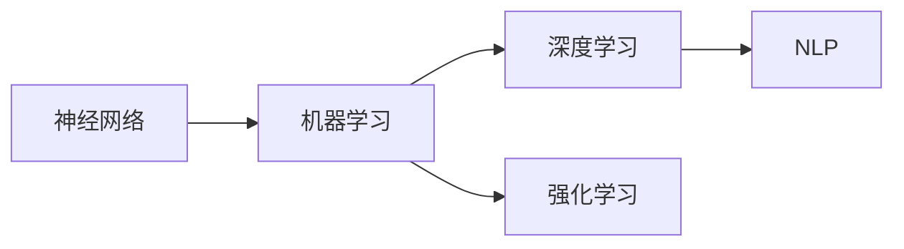

                 

# AI发展历程中的关键人物与技术

在人工智能（AI）的发展历程中，有许多关键人物和技术的出现，它们对AI的发展产生了深远影响。本文将从历史脉络的角度，探讨这些关键人物与技术，并对AI的过去、现在与未来进行全面梳理。

## 1. 背景介绍

人工智能的历史可以追溯到20世纪中叶，但其真正意义上的发展始于1950年代。在过去的几十年里，AI经历了从理论研究到实际应用的多个阶段，涌现出一系列影响深远的关键人物和核心技术。

## 2. 核心概念与联系

### 2.1 核心概念概述

人工智能领域涉及许多核心概念和技术，主要包括：

- **神经网络（Neural Networks）**：通过模拟人脑神经元的工作机制，实现信息处理和模式识别。
- **机器学习（Machine Learning）**：让机器通过数据学习，自动改进算法以提高性能。
- **深度学习（Deep Learning）**：使用深层神经网络，通过多层次的数据抽象和特征学习，解决复杂的模式识别和预测问题。
- **强化学习（Reinforcement Learning）**：通过试错和奖励机制，让智能体学习如何在特定环境中做出最优决策。
- **自然语言处理（Natural Language Processing, NLP）**：让计算机理解和生成自然语言，处理文本数据和信息。

这些核心概念和技术构成了AI发展的基石，通过它们的发展和演变，AI领域不断向前推进。

### 2.2 概念间的关系

人工智能领域中的这些核心概念和技术之间存在着紧密的联系，形成了一个复杂的生态系统。以下是这些概念和技术的相互作用关系：



从上述关系图中可以看出，神经网络是机器学习和深度学习的基础，机器学习和深度学习提供了处理复杂模式识别和预测问题的工具，而强化学习则强调智能体在特定环境中的决策学习。NLP作为AI的一个重要分支，利用机器学习和深度学习处理自然语言数据，实现理解和生成。

## 3. 核心算法原理 & 具体操作步骤
### 3.1 算法原理概述

人工智能中的许多算法原理和技术，都是建立在数学和统计学的基础之上的。以下是一些核心算法和技术的原理概述：

- **反向传播算法（Backpropagation）**：用于训练神经网络和深度学习模型，通过反向传播误差信号，调整网络权重以最小化损失函数。
- **支持向量机（Support Vector Machines, SVM）**：通过将数据映射到高维空间，寻找最佳的超平面，实现分类和回归任务。
- **朴素贝叶斯分类器（Naive Bayes Classifier）**：利用贝叶斯定理和特征独立性假设，快速高效地实现文本分类任务。
- **决策树（Decision Trees）**：通过树形结构，根据特征信息对数据进行分割，构建分类和回归模型。
- **随机森林（Random Forests）**：通过集成多个决策树，减少过拟合，提高模型的泛化能力。

这些算法和技术在各自的领域内都有着广泛的应用，推动了AI的发展。

### 3.2 算法步骤详解

以深度学习中的卷积神经网络（Convolutional Neural Networks, CNNs）为例，介绍其具体的算法步骤：

1. **数据准备**：收集并预处理训练数据，将图像数据转换为模型可处理的张量形式。
2. **模型构建**：定义卷积神经网络的结构，包括卷积层、池化层、全连接层等。
3. **损失函数定义**：根据任务类型（如分类、回归）选择适当的损失函数，如交叉熵损失、均方误差损失等。
4. **前向传播**：将输入数据送入网络，通过卷积和池化等操作，逐层提取特征。
5. **反向传播**：计算损失函数对网络权重的梯度，反向传播误差信号，更新网络参数。
6. **模型评估**：在测试集上评估模型性能，使用准确率、召回率、F1分数等指标评估模型效果。

### 3.3 算法优缺点

深度学习和神经网络技术在处理大规模复杂数据方面具有显著优势，但也存在一些缺点：

- **计算资源需求高**：训练深层神经网络需要大量的计算资源和存储空间。
- **模型复杂性**：深层神经网络结构复杂，难以解释和调试。
- **数据依赖性强**：模型性能高度依赖于数据质量，需要大量标注数据进行训练。

### 3.4 算法应用领域

深度学习和神经网络技术广泛应用于图像识别、语音识别、自然语言处理、推荐系统等多个领域。以下是一些具体的应用场景：

- **图像识别**：通过卷积神经网络，实现图像分类、目标检测、人脸识别等任务。
- **语音识别**：使用卷积神经网络和循环神经网络，实现语音转文本、语音命令识别等。
- **自然语言处理**：通过循环神经网络和长短期记忆网络，实现语言模型的训练、机器翻译、情感分析等任务。
- **推荐系统**：利用深度学习模型，对用户行为数据进行特征提取和模式识别，推荐个性化的商品和内容。

## 4. 数学模型和公式 & 详细讲解 & 举例说明

### 4.1 数学模型构建

深度学习中的卷积神经网络，其数学模型可以表示为：

$$
\begin{aligned}
L &= \frac{1}{N} \sum_{i=1}^N L(y_i, \hat{y}_i) \\
\hat{y}_i &= \sigma(W^1 \cdot \sigma(W^0 \cdot X_i + b^0) + b^1) \\
L(y_i, \hat{y}_i) &= \frac{1}{2}(y_i - \hat{y}_i)^2
\end{aligned}
$$

其中，$X_i$ 表示输入图像，$y_i$ 表示标签，$\hat{y}_i$ 表示模型预测值，$\sigma$ 表示激活函数，$W^0$ 和 $W^1$ 表示卷积核和权重矩阵，$b^0$ 和 $b^1$ 表示偏置项。

### 4.2 公式推导过程

在上述数学模型中，反向传播算法的推导过程如下：

1. **前向传播**：将输入数据 $X_i$ 逐层传递，计算各层的输出值 $Z^l$ 和激活值 $A^l$。
2. **反向传播误差**：从输出层开始，反向传播误差信号 $\delta^L$，计算损失函数对输出层的梯度 $\nabla_{W^L} L$ 和 $\nabla_{b^L} L$。
3. **更新权重和偏置**：根据梯度下降算法，更新权重和偏置项，使模型在损失函数的最小值处收敛。

### 4.3 案例分析与讲解

以图像分类任务为例，使用卷积神经网络进行模型训练。假设有一个包含 $N$ 个样本的数据集，每个样本包含 $d$ 个特征，使用交叉熵损失函数：

$$
L = -\frac{1}{N} \sum_{i=1}^N \sum_{j=1}^C y_i^j \log \hat{y}_i^j
$$

其中，$C$ 表示类别数，$y_i^j$ 表示第 $i$ 个样本的第 $j$ 个类别的标签，$\hat{y}_i^j$ 表示模型预测第 $i$ 个样本属于第 $j$ 个类别的概率。

## 5. 项目实践：代码实例和详细解释说明

### 5.1 开发环境搭建

在开始实践前，需要准备Python和相关的深度学习框架，如TensorFlow或PyTorch。以下是具体的搭建流程：

1. **安装Python和必要的库**：
```bash
sudo apt-get update
sudo apt-get install python3
sudo apt-get install pip3
pip3 install tensorflow
```

2. **安装深度学习框架**：
```bash
pip3 install tensorflow
```

3. **搭建虚拟环境**：
```bash
python3 -m venv venv
source venv/bin/activate
```

### 5.2 源代码详细实现

以下是一个简单的卷积神经网络模型实现示例：

```python
import tensorflow as tf

model = tf.keras.Sequential([
    tf.keras.layers.Conv2D(32, (3, 3), activation='relu', input_shape=(28, 28, 1)),
    tf.keras.layers.MaxPooling2D((2, 2)),
    tf.keras.layers.Flatten(),
    tf.keras.layers.Dense(10, activation='softmax')
])

model.compile(optimizer='adam', loss='categorical_crossentropy', metrics=['accuracy'])
```

### 5.3 代码解读与分析

在上述代码中，我们使用了TensorFlow框架，构建了一个简单的卷积神经网络模型。具体步骤如下：

1. **模型定义**：首先定义了包含卷积层、池化层和全连接层的模型结构。
2. **编译模型**：使用Adam优化器，交叉熵损失函数，评估指标为准确率。
3. **训练模型**：使用训练数据集进行模型训练，定义训练批次大小和迭代次数。

### 5.4 运行结果展示

在训练完成后，可以使用测试数据集评估模型性能：

```python
test_loss, test_acc = model.evaluate(test_images, test_labels, verbose=2)
print('Test accuracy:', test_acc)
```

## 6. 实际应用场景

### 6.1 智能家居

智能家居是AI应用的重要领域之一，通过语音识别和自然语言处理技术，可以实现语音控制家电、场景设置、智能推荐等功能。

- **语音识别**：使用深度学习模型对语音进行特征提取和识别，将语音命令转换为文本指令。
- **自然语言处理**：通过理解用户指令，执行相应的场景设置和设备控制操作。

### 6.2 医疗影像

在医疗影像领域，AI可以通过图像分类和目标检测技术，辅助医生进行疾病诊断和治疗方案制定。

- **图像分类**：使用卷积神经网络对医学影像进行分类，识别出正常和异常区域。
- **目标检测**：通过卷积神经网络检测出病变区域，提供精准的定位信息。

### 6.3 金融风险管理

在金融领域，AI可以通过数据挖掘和预测分析技术，进行风险评估和管理。

- **数据挖掘**：利用深度学习模型对历史交易数据进行分析，提取特征和模式。
- **预测分析**：通过构建回归模型，预测未来的金融风险，提供决策支持。

### 6.4 未来应用展望

未来，AI将在更多领域发挥作用，推动社会进步和经济发展。以下是一些未来应用展望：

- **自动驾驶**：通过计算机视觉和强化学习技术，实现智能驾驶和自动驾驶系统。
- **智能制造**：利用机器学习和深度学习技术，优化生产流程，提高生产效率和质量。
- **智慧城市**：通过AI技术实现城市管理智能化，提高资源利用效率，提升居民生活质量。

## 7. 工具和资源推荐

### 7.1 学习资源推荐

1. **《深度学习》（Ian Goodfellow）**：全面介绍深度学习的原理和应用，是入门和进阶的必读书籍。
2. **DeepLearning.ai课程**：由Andrew Ng教授开设的深度学习课程，涵盖从基础到高级的内容，适合不同层次的学习者。
3. **Kaggle竞赛**：参加Kaggle数据科学竞赛，积累实战经验，学习最新的AI技术。

### 7.2 开发工具推荐

1. **Jupyter Notebook**：用于数据科学和机器学习项目，支持代码编写、数据可视化等。
2. **TensorFlow**：谷歌开源的深度学习框架，支持分布式计算和动态图机制。
3. **PyTorch**：Facebook开源的深度学习框架，支持动态图和静态图机制。

### 7.3 相关论文推荐

1. **《ImageNet Classification with Deep Convolutional Neural Networks》（AlexNet论文）**：介绍卷积神经网络在图像分类任务上的应用，是深度学习的里程碑论文。
2. **《On the Importance of Initialization and Momentum in Deep Learning》（Kaiming He论文）**：探讨深度学习模型的初始化和优化器选择，对深度学习实践有重要指导意义。
3. **《Attention is All You Need》（Transformer论文）**：介绍Transformer模型在自然语言处理中的应用，推动了NLP领域的发展。

## 8. 总结：未来发展趋势与挑战

### 8.1 研究成果总结

人工智能领域在过去几十年里取得了显著的进展，涌现出许多重要的研究成果和应用。从早期的符号逻辑推理，到深度学习、强化学习等新技术的提出，AI逐渐从理论研究走向实际应用。

### 8.2 未来发展趋势

未来，AI将继续在各个领域中发挥重要作用，推动科技进步和社会进步。以下是一些未来发展趋势：

1. **多模态学习**：融合视觉、语音、文本等多种模态信息，实现更全面的智能感知和理解。
2. **自监督学习**：利用无监督学习方法，从大规模数据中学习通用特征，提升模型泛化能力。
3. **联邦学习**：分布式训练，保护数据隐私，提高模型训练效率和鲁棒性。
4. **人机协同**：将AI技术与人类智慧相结合，实现更高效、更可靠的系统。
5. **伦理与安全性**：引入伦理和安全性约束，确保AI系统的公正性和安全性。

### 8.3 面临的挑战

尽管AI取得了许多进展，但在实际应用中仍然面临一些挑战：

1. **数据隐私和安全**：大规模数据采集和使用，可能涉及隐私和安全问题。
2. **公平性和偏见**：AI系统可能存在偏见和歧视，影响社会公平性。
3. **资源需求高**：训练和推理深度学习模型需要大量计算资源和能源。
4. **模型可解释性**：深度学习模型的黑盒特性，使得其决策难以解释和调试。
5. **跨领域应用**：AI系统在特定领域内的应用效果，可能与其他领域存在差异。

### 8.4 研究展望

未来的研究需要在以下几个方面进行突破：

1. **隐私保护**：研究分布式训练和联邦学习技术，确保数据隐私和安全。
2. **公平性**：引入公平性和多样性约束，消除模型偏见。
3. **高效计算**：研究高效计算和模型压缩技术，降低资源消耗。
4. **可解释性**：发展可解释性方法和工具，提升模型的透明性。
5. **跨领域应用**：结合领域知识，开发更加通用和灵活的AI系统。

## 9. 附录：常见问题与解答

**Q1：深度学习与传统机器学习有什么区别？**

A: 深度学习与传统机器学习的主要区别在于模型的复杂度和数据驱动能力。深度学习使用深层神经网络，自动从数据中学习特征表示，而传统机器学习依赖手工设计的特征提取器。深度学习需要大量标注数据进行训练，但通常能获得更好的性能。

**Q2：什么是卷积神经网络？**

A: 卷积神经网络（CNN）是一种广泛应用于图像处理和计算机视觉领域的深度学习模型。它通过卷积和池化操作，提取图像的局部特征，并使用全连接层进行分类或回归。

**Q3：什么是强化学习？**

A: 强化学习是一种通过试错和奖励机制，让智能体学习如何在特定环境中做出最优决策的机器学习方法。它通过与环境交互，不断调整策略，最终达到最优策略。

**Q4：什么是自然语言处理？**

A: 自然语言处理（NLP）是指让计算机理解和生成自然语言的技术，包括文本分类、情感分析、机器翻译、问答系统等。

**Q5：如何优化深度学习模型？**

A: 深度学习模型的优化主要通过调整学习率、正则化、数据增强等方法进行。常用的优化算法包括梯度下降、Adam、RMSprop等。

---

作者：禅与计算机程序设计艺术 / Zen and the Art of Computer Programming

