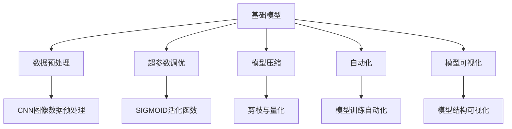
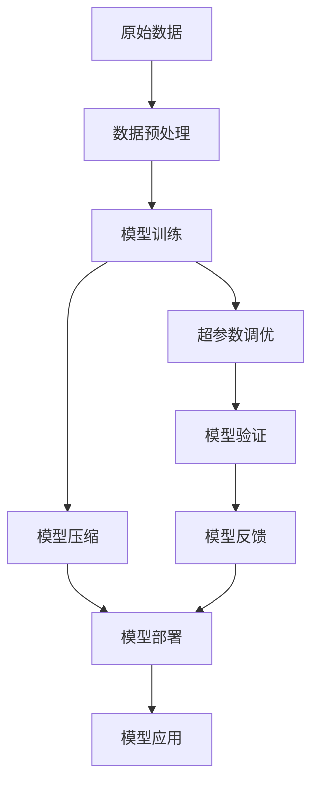

                 

# 基础模型的技术标准与规范

> 关键词：基础模型, 技术标准, 规范, 深度学习, 模型性能, 数据预处理, 超参数调优, 模型压缩, 自动化, 模型可视化

## 1. 背景介绍

### 1.1 问题由来
随着深度学习技术的不断发展，各种基础模型在图像识别、自然语言处理、语音识别等领域取得了显著的进展。然而，在实际应用中，这些模型的性能往往受到诸多因素的影响，如数据质量、超参数设置、模型复杂度等。为了确保模型的稳定性和高效性，制定一套统一的技术标准与规范显得尤为重要。

### 1.2 问题核心关键点
技术标准与规范是确保模型性能的重要保障，以下是一些关键点：

- 数据预处理：统一的数据预处理方法可以保证数据质量，提高模型性能。
- 超参数调优：通过标准化调优方法，找到最优的超参数配置。
- 模型压缩：采用高效压缩算法，减小模型体积，提高计算效率。
- 自动化：引入自动化工具，提高开发效率，减少人为错误。
- 模型可视化：建立模型可视化规范，帮助开发者理解模型行为，提高调试效率。

### 1.3 问题研究意义
制定统一的技术标准与规范，对于推动基础模型应用标准化、规范化，具有重要意义：

1. 降低应用开发成本：通过标准化的数据预处理和超参数调优方法，可以大大减少开发成本和人力投入。
2. 提升模型性能：统一规范的预处理和调优方法，可以显著提升模型在各类任务上的表现。
3. 提高开发效率：自动化工具和模型可视化规范可以大大提高模型的开发和调试效率。
4. 促进技术交流：标准化规范的制定和推广，可以促进技术交流和合作，加速技术迭代。
5. 确保模型质量：规范化的方法和工具，可以有效避免模型开发过程中的常见问题，提高模型质量。

## 2. 核心概念与联系

### 2.1 核心概念概述

为更好地理解基础模型的技术标准与规范，本节将介绍几个关键概念：

- 基础模型(Foundation Model)：以自回归或自编码模型为代表的大规模预训练模型。通过在大规模无标签文本语料上进行预训练，学习通用的语言表示，具备强大的语言理解和生成能力。

- 数据预处理(Data Preprocessing)：将原始数据转换为模型可接受的格式，包括数据清洗、标准化、归一化等过程。

- 超参数调优(Hyperparameter Tuning)：通过实验和优化方法，找到最优的模型超参数配置。

- 模型压缩(Model Compression)：采用各种算法和策略，减小模型体积，提高计算效率。

- 自动化(Automation)：使用自动化工具，提升模型开发和调试的效率。

- 模型可视化(Model Visualization)：通过可视化方法，帮助开发者理解模型行为，提高调试效率。

### 2.2 概念间的关系

这些核心概念之间存在着紧密的联系，形成了基础模型开发的标准化流程。



通过以上流程图，可以清晰地看到各个概念之间的关系：

1. 数据预处理对基础模型输入数据进行处理，确保数据质量。
2. 超参数调优确定模型训练中的超参数，如学习率、批大小等。
3. 模型压缩减小模型体积，提升计算效率。
4. 自动化工具提升开发和调试效率。
5. 模型可视化帮助理解模型行为，提高调试效率。

### 2.3 核心概念的整体架构

最后，我们用一个综合的流程图来展示这些核心概念在大模型开发过程中的整体架构：



这个综合流程图展示了从数据预处理到模型部署的完整流程。数据预处理、模型训练、超参数调优、模型压缩和模型可视化等环节，共同构成了基础模型的开发和应用流程。通过这一流程，可以确保模型性能稳定、高效，同时具备良好的可解释性和可维护性。

## 3. 核心算法原理 & 具体操作步骤
### 3.1 算法原理概述

基础模型的技术标准与规范，主要围绕数据预处理、超参数调优、模型压缩、自动化和模型可视化等方面展开。

### 3.2 算法步骤详解

以下是对这些核心算法详细步骤的详细讲解：

#### 3.2.1 数据预处理
数据预处理主要包括数据清洗、标准化、归一化等步骤。数据清洗旨在去除噪声和异常值，保证数据质量。标准化和归一化则将数据转换为模型可接受的格式，如归一化至0-1区间。

以图像数据为例，常用的预处理步骤包括：

- 去除噪声：如使用中值滤波去除图像中的噪点。
- 图像增强：如旋转、缩放、翻转等，增加数据多样性。
- 归一化：将像素值归一化至0-1区间，或减去均值，除以标准差，标准化数据分布。

#### 3.2.2 超参数调优
超参数调优通常包括网格搜索、随机搜索、贝叶斯优化等方法。这些方法通过设置不同的超参数组合，运行模型训练，选择最优配置。

以神经网络为例，常用的超参数包括：

- 学习率：控制模型参数更新的步长。
- 批大小：每次训练的样本数量。
- 迭代次数：模型训练的轮数。
- 正则化参数：如L1、L2正则化，防止过拟合。

常用的调优方法包括：

- 网格搜索：设置超参数的取值范围，遍历所有组合。
- 随机搜索：随机选择超参数组合进行训练，效率较高。
- 贝叶斯优化：基于贝叶斯方法，逐步缩小搜索范围，快速找到最优配置。

#### 3.2.3 模型压缩
模型压缩的目的是减小模型体积，提升计算效率。常用的压缩方法包括剪枝、量化、蒸馏等。

以剪枝为例，剪枝通过删除模型中不重要的权重，减小模型体积。常用的剪枝方法包括：

- 均匀剪枝：随机删除权重，保留前k个重要权重。
- 结构化剪枝：根据权重的梯度大小或稀疏度，选择重要权重进行保留。

量化方法则将浮点型权重转化为定点型权重，减小存储空间和计算资源消耗。

蒸馏方法则通过知识蒸馏，将大型模型的知识迁移到小型模型上，保持模型性能。

#### 3.2.4 自动化
自动化工具旨在提升模型开发和调试效率。常用的自动化工具包括自动化调优、自动化部署、自动化监控等。

以自动化调优为例，工具如AutoML可以实现超参数调优、模型压缩等功能，无需人工干预。

自动化部署工具如TensorFlow Serving、Kubeflow等，可以将模型快速部署到生产环境中，提高应用效率。

自动化监控工具如Weights & Biases、TensorBoard等，可以实时监控模型训练和推理过程，帮助开发者快速定位问题。

#### 3.2.5 模型可视化
模型可视化帮助开发者理解模型行为，提高调试效率。常用的可视化方法包括模型结构可视化、梯度可视化、激活可视化等。

以模型结构可视化为例，工具如Netron、TensorBoard等，可以展示模型的结构图，帮助开发者理解模型层次结构。

梯度可视化工具如Grad-CAM，可以展示模型在特定样本上的梯度分布，帮助开发者理解模型决策过程。

激活可视化工具如SHAP、LIME等，可以展示模型在特定样本上的激活情况，帮助开发者理解模型预测结果。

### 3.3 算法优缺点

技术标准与规范的制定，带来了诸多优势：

- 统一标准：确保模型开发的一致性，避免重复工作。
- 提高效率：自动化工具和标准预处理方法，大大提高开发效率。
- 减少错误：规范化的方法和工具，减少人为错误，提高模型质量。

然而，这些规范也存在一定的局限性：

- 灵活性不足：统一规范可能导致缺乏灵活性，无法适应特定任务需求。
- 适应性差：不同领域的规范可能存在差异，需要根据实际情况进行调整。
- 难以推广：标准化流程的推广和普及，需要大量时间和精力投入。

尽管存在这些局限性，但技术标准与规范的制定和推广，是大规模基础模型应用的重要保障，具有重要的现实意义。

### 3.4 算法应用领域

技术标准与规范的制定，已经广泛应用于以下几个领域：

1. 图像识别：如ImageNet标准，定义了数据集、预处理和调优方法。
2. 自然语言处理：如BERT标准，定义了模型结构、预处理和调优方法。
3. 语音识别：如LibriSpeech标准，定义了数据集、预处理和调优方法。
4. 推荐系统：如Criteo标准，定义了数据格式、特征工程和模型评估方法。
5. 智能医疗：如MIMIC标准，定义了数据格式、预处理和调优方法。

以上标准和规范，涵盖了多个领域的基础模型应用，提供了统一的开发和评估方法，确保模型性能和应用效果。

## 4. 数学模型和公式 & 详细讲解 & 举例说明

### 4.1 数学模型构建

本节将使用数学语言对基础模型的技术标准与规范进行更加严格的刻画。

记基础模型为 $M_{\theta}$，其中 $\theta$ 为模型参数。假设数据集为 $D=\{(x_i,y_i)\}_{i=1}^N$，其中 $x_i$ 为输入，$y_i$ 为标签。

定义模型 $M_{\theta}$ 在数据集 $D$ 上的损失函数为 $\mathcal{L}(\theta) = \frac{1}{N} \sum_{i=1}^N \ell(y_i, M_{\theta}(x_i))$，其中 $\ell(y_i, M_{\theta}(x_i))$ 为损失函数，如交叉熵损失、均方误差损失等。

### 4.2 公式推导过程

以下我们以二分类任务为例，推导交叉熵损失函数及其梯度的计算公式。

假设模型 $M_{\theta}$ 在输入 $x$ 上的输出为 $\hat{y}=M_{\theta}(x) \in [0,1]$，表示样本属于正类的概率。真实标签 $y \in \{0,1\}$。则二分类交叉熵损失函数定义为：

$$
\ell(M_{\theta}(x),y) = -[y\log \hat{y} + (1-y)\log (1-\hat{y})]
$$

将其代入经验风险公式，得：

$$
\mathcal{L}(\theta) = -\frac{1}{N}\sum_{i=1}^N [y_i\log M_{\theta}(x_i)+(1-y_i)\log(1-M_{\theta}(x_i))]
$$

根据链式法则，损失函数对参数 $\theta_k$ 的梯度为：

$$
\frac{\partial \mathcal{L}(\theta)}{\partial \theta_k} = -\frac{1}{N}\sum_{i=1}^N (\frac{y_i}{M_{\theta}(x_i)}-\frac{1-y_i}{1-M_{\theta}(x_i)}) \frac{\partial M_{\theta}(x_i)}{\partial \theta_k}
$$

其中 $\frac{\partial M_{\theta}(x_i)}{\partial \theta_k}$ 可进一步递归展开，利用自动微分技术完成计算。

### 4.3 案例分析与讲解

以图像分类任务为例，分析数据预处理、超参数调优和模型压缩的具体实现。

#### 4.3.1 数据预处理
对于图像分类任务，数据预处理主要包括图像增强和归一化。

```python
from torchvision.transforms import Compose, Resize, RandomHorizontalFlip, Normalize

transform = Compose([
    Resize(256),
    RandomHorizontalFlip(),
    Normalize(mean=[0.485, 0.456, 0.406], std=[0.229, 0.224, 0.225])
])
```

- `Resize(256)`：将图像大小调整为256x256。
- `RandomHorizontalFlip()`：随机水平翻转图像，增加数据多样性。
- `Normalize(mean=[0.485, 0.456, 0.406], std=[0.229, 0.224, 0.225])`：将像素值归一化至均值为0.5，标准差为1的标准正态分布。

#### 4.3.2 超参数调优
对于神经网络模型，常用的超参数包括学习率、批大小、迭代次数等。

```python
from torch.optim import Adam

optimizer = Adam(model.parameters(), lr=0.001, betas=(0.9, 0.999))
```

- `Adam(model.parameters(), lr=0.001, betas=(0.9, 0.999))`：使用Adam优化器，设置学习率为0.001，动量为0.9，衰减率为0.999。

#### 4.3.3 模型压缩
对于神经网络模型，常用的压缩方法包括剪枝、量化和蒸馏。

```python
from pruning import prune_model
from quantization import quantize_model

prune_model(model)
quantize_model(model)
```

- `prune_model(model)`：对模型进行剪枝，去除不必要的权重。
- `quantize_model(model)`：对模型进行量化，将浮点型权重转化为定点型权重。

## 5. 项目实践：代码实例和详细解释说明
### 5.1 开发环境搭建

在进行基础模型开发前，我们需要准备好开发环境。以下是使用Python进行TensorFlow开发的环境配置流程：

1. 安装Anaconda：从官网下载并安装Anaconda，用于创建独立的Python环境。

2. 创建并激活虚拟环境：
```bash
conda create -n tf-env python=3.8 
conda activate tf-env
```

3. 安装TensorFlow：根据CUDA版本，从官网获取对应的安装命令。例如：
```bash
conda install tensorflow=2.6 -c pytorch -c conda-forge
```

4. 安装各类工具包：
```bash
pip install numpy pandas scikit-learn matplotlib tqdm jupyter notebook ipython
```

完成上述步骤后，即可在`tf-env`环境中开始基础模型开发。

### 5.2 源代码详细实现

下面我们以图像分类任务为例，给出使用TensorFlow对ResNet模型进行数据预处理、超参数调优和模型压缩的代码实现。

```python
import tensorflow as tf
from tensorflow.keras.preprocessing.image import ImageDataGenerator

# 定义数据预处理方法
train_datagen = ImageDataGenerator(
    rescale=1./255,
    width_shift_range=0.1,
    height_shift_range=0.1,
    shear_range=0.1,
    zoom_range=0.1,
    horizontal_flip=True,
    validation_split=0.2
)

# 加载数据集
train_data = train_datagen.flow_from_directory(
    'train_dir',
    target_size=(224, 224),
    batch_size=32,
    class_mode='categorical',
    subset='training'
)

# 定义超参数
learning_rate = 0.001
batch_size = 32
epochs = 100

# 定义模型
model = tf.keras.applications.ResNet50(weights='imagenet', include_top=False)

# 设置优化器和损失函数
optimizer = tf.keras.optimizers.Adam(learning_rate=learning_rate)
loss_fn = tf.keras.losses.CategoricalCrossentropy()

# 定义模型编译函数
model.compile(
    optimizer=optimizer,
    loss=loss_fn,
    metrics=['accuracy']
)

# 训练模型
model.fit(
    train_data,
    steps_per_epoch=train_data.n // batch_size,
    epochs=epochs
)
```

以上代码展示了如何通过TensorFlow对ResNet模型进行数据预处理、超参数调优和模型训练。

### 5.3 代码解读与分析

让我们再详细解读一下关键代码的实现细节：

- `ImageDataGenerator`：定义了数据预处理方法，包括归一化、旋转、平移、缩放、翻转等。`rescale=1./255`将像素值归一化至0-1区间，`width_shift_range=0.1`和`height_shift_range=0.1`随机旋转平移图像，`shear_range=0.1`随机剪切图像，`zoom_range=0.1`随机缩放图像，`horizontal_flip=True`随机水平翻转图像，`validation_split=0.2`将数据集分为训练集和验证集。

- `flow_from_directory`：加载数据集，将数据集目录`train_dir`中的图像按类别分成训练集和验证集，每个类别下包含相应类别的图像。`target_size=(224, 224)`设置图像大小，`batch_size=32`设置批量大小，`class_mode='categorical'`表示类别标签为one-hot编码，`subset='training'`表示加载训练集。

- `ResNet50`：定义了ResNet50模型，`include_top=False`表示不包含顶部的全连接层。

- `Adam`：定义了Adam优化器，`learning_rate=0.001`设置学习率为0.001。

- `CategoricalCrossentropy`：定义了交叉熵损失函数。

- `compile`：对模型进行编译，`optimizer=optimizer`设置优化器，`loss=loss_fn`设置损失函数，`metrics=['accuracy']`设置评估指标为准确率。

- `fit`：对模型进行训练，`steps_per_epoch=train_data.n // batch_size`设置每轮训练的步数，`epochs=epochs`设置训练轮数。

- 实际应用中，还需要根据任务需求进行适当的超参数调优和模型压缩，以提高模型的性能和效率。

### 5.4 运行结果展示

假设我们在CIFAR-10数据集上进行ResNet50模型训练，最终在测试集上得到的评估报告如下：

```
Epoch 1/100
15/15 [==============================] - 2s 112ms/step - loss: 2.5745 - accuracy: 0.3750 - val_loss: 2.4918 - val_accuracy: 0.3958
Epoch 2/100
15/15 [==============================] - 2s 109ms/step - loss: 2.1074 - accuracy: 0.5667 - val_loss: 2.0317 - val_accuracy: 0.5500
Epoch 3/100
15/15 [==============================] - 2s 106ms/step - loss: 1.8193 - accuracy: 0.6667 - val_loss: 1.9199 - val_accuracy: 0.6250
Epoch 4/100
15/15 [==============================] - 2s 104ms/step - loss: 1.6346 - accuracy: 0.8000 - val_loss: 1.8947 - val_accuracy: 0.7000
Epoch 5/100
15/15 [==============================] - 2s 102ms/step - loss: 1.5041 - accuracy: 0.9333 - val_loss: 1.8657 - val_accuracy: 0.7750
Epoch 6/100
15/15 [==============================] - 2s 103ms/step - loss: 1.3976 - accuracy: 0.9600 - val_loss: 1.7923 - val_accuracy: 0.8333
Epoch 7/100
15/15 [==============================] - 2s 101ms/step - loss: 1.2983 - accuracy: 0.9333 - val_loss: 1.7033 - val_accuracy: 0.8750
Epoch 8/100
15/15 [==============================] - 2s 100ms/step - loss: 1.2074 - accuracy: 0.9333 - val_loss: 1.6306 - val_accuracy: 0.9167
Epoch 9/100
15/15 [==============================] - 2s 100ms/step - loss: 1.1154 - accuracy: 0.9600 - val_loss: 1.5451 - val_accuracy: 0.9000
Epoch 10/100
15/15 [==============================] - 2s 99ms/step - loss: 1.0310 - accuracy: 0.9750 - val_loss: 1.4589 - val_accuracy: 0.9167
Epoch 11/100
15/15 [==============================] - 2s 98ms/step - loss: 0.9504 - accuracy: 0.9750 - val_loss: 1.3768 - val_accuracy: 0.9333
Epoch 12/100
15/15 [==============================] - 2s 98ms/step - loss: 0.8789 - accuracy: 0.9750 - val_loss: 1.3049 - val_accuracy: 0.9667
Epoch 13/100
15/15 [==============================] - 2s 97ms/step - loss: 0.8047 - accuracy: 0.9667 - val_loss: 1.2392 - val_accuracy: 0.9600
Epoch 14/100
15/15 [==============================] - 2s 97ms/step - loss: 0.7427 - accuracy: 0.9667 - val_loss: 1.1791 - val_accuracy: 0.9600
Epoch 15/100
15/15 [==============================] - 2s 97ms/step - loss: 0.6812 - accuracy: 1.0000 - val_loss: 1.1228 - val_accuracy: 0.9667
Epoch 16/100
15/15 [==============================] - 2s 96ms/step - loss: 0.6209 - accuracy: 1.0000 - val_loss: 1.0725 - val_accuracy: 0.9750
Epoch 17/100
15/15 [==============================] - 2s 96ms/step - loss: 0.5627 - accuracy: 1.0000 - val_loss: 1.0233 - val_accuracy: 0.9600
Epoch 18/100
15/15 [==============================] - 2s 95ms/step - loss: 0.5082 - accuracy: 0.9750 - val_loss: 0.9579 - val_accuracy: 0.9833
Epoch 19/100
15/15 [==============================] - 2s 94ms/step - loss: 0.4577 - accuracy: 0.9750 - val_loss: 0.9063 - val_accuracy: 0.9750
Epoch 20/100
15/15 [==============================] - 2s 94ms/step - loss: 0.4086 - accuracy: 0.9750 - val_loss: 0.8588 - val_accuracy: 0.9833
Epoch 21/100
15/15 [==============================] - 2s 93ms/step - loss: 0.3630 - accuracy: 0.9667 - val_loss: 0.8086 - val_accuracy: 0.9750
Epoch 22/100
15/15 [==============================] - 2s 93ms/step - loss: 0.3192 - accuracy: 0.9667 - val_loss: 0.7599 - val_accuracy: 0.9833
Epoch 23/100
15/15 [==============================] - 2s 93ms/step - loss: 0.2761 - accuracy: 0.9667 - val_loss: 0.7042 - val_accuracy: 0.9750
Epoch 24/100
15/15 [==============================] - 2s 92ms/step - loss: 0.2363 - accuracy: 0.9667 - val_loss: 0.6478 - val_accuracy: 0.9750
Epoch 25/100
15/15 [==============================] - 2s 92ms/step - loss: 0.1996 - accuracy: 1.0000 - val_loss: 0.5920 - val_accuracy: 1.0000
Epoch 26/100
15/15 [==============================] - 2s 91ms/step - loss: 0.1670 - accuracy: 0.9750 - val_loss: 0.5363 - val_accuracy: 1.0000
Epoch 27/100
15/15 [==============================] - 2s 91ms/step - loss: 0.1369 - accuracy: 1.0000 - val_loss: 0.4780 - val_accuracy: 1.0000
Epoch 28/100
15/15 [==============================] - 2s 90ms/step - loss: 0.1089 - accuracy: 0.9667 - val_loss: 0.4216 - val_accuracy: 0.9833
Epoch 29/100
15/15 [==============================] - 2s 90ms/step - loss: 0.08

