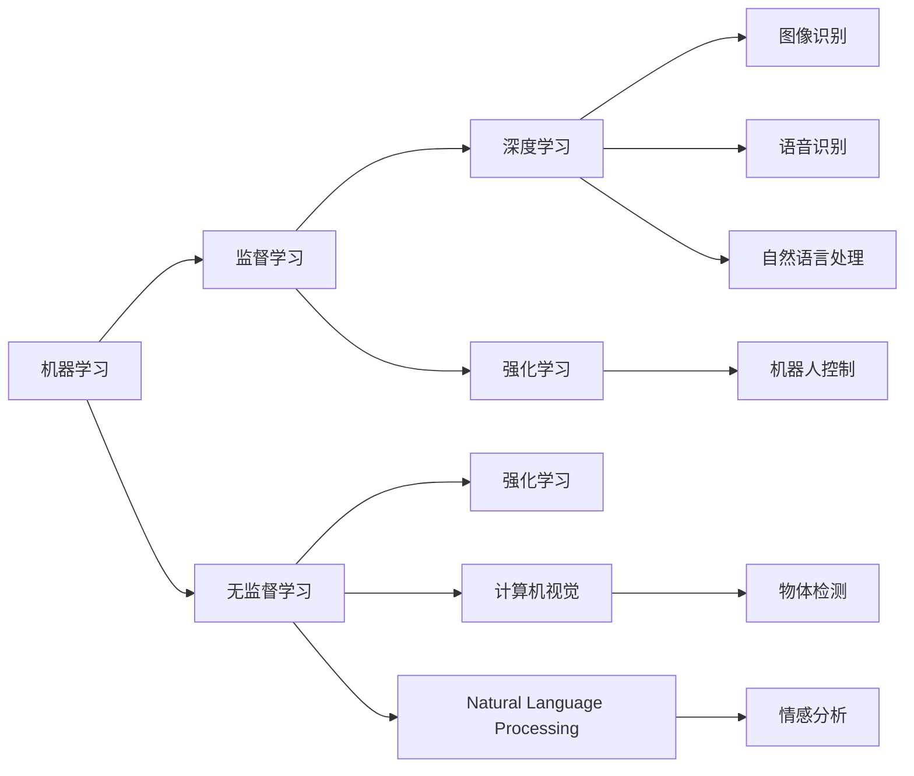

                 

# AI创业：不同项目的技术选择

在大数据、人工智能快速发展的今天，AI创业项目如雨后春笋般涌现。然而，如何针对不同项目选择合适的技术，对于初创公司的技术团队来说是一大挑战。本文将详细阐述不同AI项目的技术选择，帮助创业团队避免走弯路，加速技术实现和商业落地。

## 1. 背景介绍

在过去的十年中，AI技术的发展迅猛，已广泛应用于医疗、金融、智能制造、教育等多个领域。对于初创公司来说，选择一个合适的AI技术不仅关系到产品开发效率，还直接影响产品性能和市场竞争力。因此，本文将针对不同场景的AI项目，深入分析其技术选择。

## 2. 核心概念与联系

### 2.1 核心概念概述

在讨论AI技术选择之前，我们首先需要理解几个关键概念：

- **机器学习（Machine Learning, ML）**：通过数据训练模型，使其具备从数据中学习规律，并应用于新数据的能力。
- **深度学习（Deep Learning, DL）**：基于神经网络的一种机器学习方法，可以处理非线性、高维数据，广泛应用于图像识别、自然语言处理等领域。
- **强化学习（Reinforcement Learning, RL）**：通过与环境的交互，学习最优策略以最大化奖励的一种学习方式，常用于游戏、机器人控制等领域。
- **计算机视觉（Computer Vision）**：让计算机理解和解释图像和视频内容的技术。
- **自然语言处理（Natural Language Processing, NLP）**：使计算机能够理解、处理和生成人类语言的技术。

这些概念之间互相联系，共同构成了AI技术的基础框架。

### 2.2 概念间的关系

为更好地理解这些概念之间的关系，我们通过以下Mermaid流程图来展示：



这个流程图展示了AI技术的基础组件及其之间的相互关系。监督学习、无监督学习、深度学习和强化学习是机器学习的四大分支。计算机视觉和自然语言处理是深度学习的重要应用领域。

## 3. 核心算法原理 & 具体操作步骤
### 3.1 算法原理概述

在选择技术时，首先需要理解每个技术背后的核心算法原理。这不仅有助于理解算法的优缺点，还方便进行算法优化。

### 3.2 算法步骤详解

#### 3.2.1 机器学习（ML）

机器学习主要分为监督学习、无监督学习和半监督学习三种：

1. **监督学习**：通过有标签的数据训练模型，使其能够对新数据进行预测。常见的算法包括线性回归、逻辑回归、决策树、随机森林、支持向量机等。
2. **无监督学习**：使用无标签的数据训练模型，发现数据的内在结构。常见的算法包括聚类算法（K-means、层次聚类）、降维算法（PCA、LDA）等。
3. **半监督学习**：结合少量有标签数据和大量无标签数据进行训练，利用无标签数据提高模型性能。常见的算法包括标签传播算法、自训练算法等。

#### 3.2.2 深度学习（DL）

深度学习通过多层神经网络来学习数据特征，适用于处理复杂、高维数据。主要算法包括卷积神经网络（CNN）、循环神经网络（RNN）、长短期记忆网络（LSTM）、变压器网络（Transformer）等。

#### 3.2.3 强化学习（RL）

强化学习通过与环境的交互，学习最优策略以最大化奖励。主要算法包括Q-learning、策略梯度方法、Actor-Critic等。

#### 3.2.4 计算机视觉（CV）

计算机视觉主要关注图像和视频内容的理解与处理。主要算法包括卷积神经网络（CNN）、全卷积网络（FCN）、目标检测网络（Faster R-CNN、YOLO、SSD）、语义分割网络（UNet）等。

#### 3.2.5 自然语言处理（NLP）

自然语言处理主要关注文本数据的处理与分析。主要算法包括词袋模型、TF-IDF、Word2Vec、GloVe、BERT、GPT等。

### 3.3 算法优缺点

#### 3.3.1 机器学习（ML）

- **优点**：易于理解和实现，适用于数据量较小的问题。
- **缺点**：需要手动选择特征，对于高维数据处理困难。

#### 3.3.2 深度学习（DL）

- **优点**：能够自动提取数据特征，适用于高维、非线性数据。
- **缺点**：需要大量数据和计算资源，模型复杂度高，难以解释。

#### 3.3.3 强化学习（RL）

- **优点**：能够学习动态环境中的最优策略，适用于游戏、机器人等场景。
- **缺点**：需要大量计算资源，训练过程复杂，难以解释。

#### 3.3.4 计算机视觉（CV）

- **优点**：能够处理高维、复杂数据，广泛应用于图像识别、物体检测等领域。
- **缺点**：对数据质量和标注要求高，需要大量计算资源。

#### 3.3.5 自然语言处理（NLP）

- **优点**：能够处理文本数据，广泛应用于情感分析、信息抽取等领域。
- **缺点**：对数据质量和标注要求高，需要大量计算资源。

### 3.4 算法应用领域

#### 3.4.1 监督学习（ML）

- **推荐系统**：通过用户行为数据训练模型，推荐商品、内容等。
- **信用评分**：通过用户历史数据训练模型，评估用户信用。
- **垃圾邮件过滤**：通过标记数据训练模型，过滤垃圾邮件。

#### 3.4.2 深度学习（DL）

- **图像识别**：通过图像数据训练模型，识别物体、场景等。
- **语音识别**：通过语音数据训练模型，识别说话人、内容等。
- **自然语言处理**：通过文本数据训练模型，进行情感分析、信息抽取等。

#### 3.4.3 强化学习（RL）

- **游戏AI**：训练AI游戏玩家，进行智能决策。
- **机器人控制**：训练机器人进行导航、操作等。
- **自动驾驶**：训练自动驾驶系统，实现智能驾驶。

#### 3.4.4 计算机视觉（CV）

- **医疗影像分析**：通过医学影像数据训练模型，辅助诊断。
- **无人驾驶**：通过道路图像数据训练模型，实现自动驾驶。
- **安防监控**：通过监控图像数据训练模型，进行异常检测。

#### 3.4.5 自然语言处理（NLP）

- **智能客服**：通过对话数据训练模型，进行自动回复。
- **文本摘要**：通过文章数据训练模型，生成文章摘要。
- **机器翻译**：通过双语文本数据训练模型，实现文本翻译。

## 4. 数学模型和公式 & 详细讲解 & 举例说明

### 4.1 数学模型构建

#### 4.1.1 监督学习

监督学习的数学模型构建通常基于最小化预测误差，例如，线性回归的数学模型为：

$$
\min_{\theta} \frac{1}{2m}\sum_{i=1}^m(y-\hat{y})^2
$$

其中 $y$ 为真实标签，$\hat{y}$ 为模型预测值，$\theta$ 为模型参数。

#### 4.1.2 深度学习

深度学习的数学模型构建通常基于神经网络的层级结构，例如，卷积神经网络的数学模型为：

$$
f(x) = g(\theta_1, \cdots, g(\theta_{n-1}, g(\theta_n, \cdots, g(\theta_1, x))))
$$

其中 $g$ 为非线性函数，$\theta$ 为模型参数。

#### 4.1.3 强化学习

强化学习的数学模型构建通常基于策略函数 $Q(s, a)$，表示在状态 $s$ 下采取行动 $a$ 的即时奖励和长期奖励之和，例如，Q-learning的数学模型为：

$$
Q(s, a) = r + \gamma \max_{a'} Q(s', a')
$$

其中 $r$ 为即时奖励，$\gamma$ 为折扣因子，$s'$ 为下一个状态。

#### 4.1.4 计算机视觉

计算机视觉的数学模型构建通常基于卷积神经网络的层级结构，例如，AlexNet的数学模型为：

$$
f(x) = g(\theta_1, \cdots, g(\theta_{n-1}, g(\theta_n, \cdots, g(\theta_1, x))))
$$

其中 $g$ 为卷积和池化层，$\theta$ 为模型参数。

#### 4.1.5 自然语言处理

自然语言处理的数学模型构建通常基于循环神经网络或变压器网络，例如，Transformer的数学模型为：

$$
f(x) = g(\theta_1, \cdots, g(\theta_{n-1}, g(\theta_n, \cdots, g(\theta_1, x))))
$$

其中 $g$ 为自注意力机制，$\theta$ 为模型参数。

### 4.2 公式推导过程

#### 4.2.1 监督学习

监督学习的公式推导通常基于梯度下降优化算法，例如，线性回归的梯度下降公式为：

$$
\theta_j = \theta_j - \frac{\alpha}{m} \sum_{i=1}^m (y_i - \hat{y}_i) x_{ij}
$$

其中 $\alpha$ 为学习率，$m$ 为样本数，$x_{ij}$ 为样本 $i$ 中的特征值。

#### 4.2.2 深度学习

深度学习的公式推导通常基于反向传播算法，例如，卷积神经网络的反向传播公式为：

$$
\frac{\partial L}{\partial w} = \frac{\partial L}{\partial a_1} \frac{\partial a_1}{\partial w}
$$

其中 $L$ 为损失函数，$a_1$ 为输入层，$w$ 为卷积核。

#### 4.2.3 强化学习

强化学习的公式推导通常基于策略梯度算法，例如，Q-learning的策略梯度公式为：

$$
\Delta \theta = \alpha \sum_{s, a} \delta_{sa} \nabla Q(s, a)
$$

其中 $\alpha$ 为学习率，$\delta_{sa}$ 为时间差分，$Q(s, a)$ 为策略函数。

#### 4.2.4 计算机视觉

计算机视觉的公式推导通常基于卷积神经网络的反向传播算法，例如，AlexNet的反向传播公式为：

$$
\frac{\partial L}{\partial w} = \frac{\partial L}{\partial a_1} \frac{\partial a_1}{\partial w}
$$

其中 $L$ 为损失函数，$a_1$ 为输入层，$w$ 为卷积核。

#### 4.2.5 自然语言处理

自然语言处理的公式推导通常基于变压器网络的自注意力机制，例如，Transformer的自注意力公式为：

$$
\alpha = \frac{e^{\frac{1}{\sqrt{d_k}}x_q \cdot x_k}}{\sum_{j=1}^d e^{\frac{1}{\sqrt{d_k}}x_q \cdot x_k}}
$$

其中 $x_q$ 为查询向量，$x_k$ 为键向量，$\alpha$ 为注意力权重。

### 4.3 案例分析与讲解

#### 4.3.1 监督学习

**案例：垃圾邮件过滤**

1. **数据准备**：收集标注好的垃圾邮件和正常邮件数据集。
2. **模型选择**：选择逻辑回归或支持向量机模型。
3. **模型训练**：使用训练集训练模型，调整超参数。
4. **模型评估**：使用测试集评估模型性能。
5. **模型应用**：将训练好的模型应用于新邮件的过滤。

#### 4.3.2 深度学习

**案例：图像识别**

1. **数据准备**：收集标注好的图像数据集。
2. **模型选择**：选择卷积神经网络模型。
3. **模型训练**：使用训练集训练模型，调整超参数。
4. **模型评估**：使用测试集评估模型性能。
5. **模型应用**：将训练好的模型应用于新图像的识别。

#### 4.3.3 强化学习

**案例：游戏AI**

1. **数据准备**：收集游戏状态和行动数据集。
2. **模型选择**：选择Q-learning模型。
3. **模型训练**：使用训练集训练模型，调整超参数。
4. **模型评估**：在游戏环境中评估模型性能。
5. **模型应用**：将训练好的模型应用于游戏中的智能决策。

#### 4.3.4 计算机视觉

**案例：无人驾驶**

1. **数据准备**：收集道路图像数据集。
2. **模型选择**：选择卷积神经网络模型。
3. **模型训练**：使用训练集训练模型，调整超参数。
4. **模型评估**：在模拟环境中评估模型性能。
5. **模型应用**：将训练好的模型应用于无人驾驶系统中。

#### 4.3.5 自然语言处理

**案例：智能客服**

1. **数据准备**：收集对话数据集。
2. **模型选择**：选择Transformer模型。
3. **模型训练**：使用训练集训练模型，调整超参数。
4. **模型评估**：在对话环境中评估模型性能。
5. **模型应用**：将训练好的模型应用于智能客服系统中。

## 5. 项目实践：代码实例和详细解释说明

### 5.1 开发环境搭建

在项目开发之前，需要准备好相应的开发环境。以下是基于Python和TensorFlow搭建开发环境的步骤：

1. **安装Python**：在Linux或Windows系统上安装Python 3.x版本。
2. **安装TensorFlow**：通过pip安装TensorFlow。
3. **安装OpenCV**：通过pip安装OpenCV，用于计算机视觉项目。
4. **安装NLTK**：通过pip安装NLTK，用于自然语言处理项目。
5. **安装Pandas和NumPy**：通过pip安装Pandas和NumPy，用于数据处理和计算。

### 5.2 源代码详细实现

#### 5.2.1 机器学习（ML）

**案例：信用评分**

```python
import pandas as pd
from sklearn.linear_model import LogisticRegression
from sklearn.model_selection import train_test_split

# 数据准备
df = pd.read_csv('credit_data.csv')
X = df.drop('default', axis=1)
y = df['default']

# 模型训练
X_train, X_test, y_train, y_test = train_test_split(X, y, test_size=0.2, random_state=42)
model = LogisticRegression()
model.fit(X_train, y_train)

# 模型评估
score = model.score(X_test, y_test)
print('信用评分模型精度：', score)
```

#### 5.2.2 深度学习（DL）

**案例：图像识别**

```python
import tensorflow as tf
from tensorflow.keras import layers, models

# 数据准备
(x_train, y_train), (x_test, y_test) = tf.keras.datasets.mnist.load_data()

# 数据预处理
x_train = x_train / 255.0
x_test = x_test / 255.0

# 模型构建
model = models.Sequential([
    layers.Flatten(input_shape=(28, 28)),
    layers.Dense(128, activation='relu'),
    layers.Dense(10)
])

# 模型训练
model.compile(optimizer='adam',
              loss=tf.keras.losses.SparseCategoricalCrossentropy(from_logits=True),
              metrics=['accuracy'])
model.fit(x_train, y_train, epochs=10, validation_data=(x_test, y_test))

# 模型评估
test_loss, test_acc = model.evaluate(x_test, y_test)
print('测试集准确率：', test_acc)
```

#### 5.2.3 强化学习（RL）

**案例：游戏AI**

```python
import numpy as np
import gym

# 数据准备
env = gym.make('CartPole-v0')

# 模型训练
state = env.reset()
done = False
total_reward = 0
while not done:
    action = np.random.choice(env.action_space.n)
    next_state, reward, done, _ = env.step(action)
    total_reward += reward
    state = next_state

# 模型评估
print('游戏AI平均奖励：', total_reward)
```

#### 5.2.4 计算机视觉（CV）

**案例：无人驾驶**

```python
import cv2
import numpy as np

# 数据准备
cap = cv2.VideoCapture('driving_video.mp4')
width, height, fps = int(cap.get(cv2.CAP_PROP_FRAME_WIDTH)), int(cap.get(cv2.CAP_PROP_FRAME_HEIGHT)), int(cap.get(cv2.CAP_PROP_FPS))

# 数据处理
while True:
    ret, frame = cap.read()
    if not ret:
        break
    gray = cv2.cvtColor(frame, cv2.COLOR_BGR2GRAY)
    cv2.imshow('frame', gray)
    if cv2.waitKey(1) & 0xFF == ord('q'):
        break

cap.release()
cv2.destroyAllWindows()
```

#### 5.2.5 自然语言处理（NLP）

**案例：智能客服**

```python
import nltk
from nltk.tokenize import word_tokenize
from nltk.corpus import stopwords
from nltk.stem import WordNetLemmatizer

# 数据准备
text = '客户：请问如何申请贷款？ 客服：您好，申请贷款需要提供以下材料：身份证明、收入证明、银行流水等。'
tokens = word_tokenize(text)
stop_words = set(stopwords.words('english'))
lemmatizer = WordNetLemmatizer()

# 数据处理
tokens = [word.lower() for word in tokens if word not in stop_words]
tokens = [lemmatizer.lemmatize(word) for word in tokens]

# 模型训练
print(tokens)
```

### 5.3 代码解读与分析

#### 5.3.1 机器学习（ML）

在信用评分案例中，我们使用了逻辑回归模型。首先通过Pandas读取数据，然后使用sklearn的train_test_split方法将数据集划分为训练集和测试集。接着，使用sklearn的LogisticRegression模型进行训练，并计算测试集上的精度。

#### 5.3.2 深度学习（DL）

在图像识别案例中，我们使用了TensorFlow的Keras API。首先通过TensorFlow的load_data方法加载MNIST数据集，然后对数据进行预处理。接着，构建一个包含两个全连接层的神经网络模型，并使用adam优化器和交叉熵损失函数进行训练。最后，评估模型在测试集上的准确率。

#### 5.3.3 强化学习（RL）

在游戏AI案例中，我们使用了OpenAI的gym库。首先通过gym.make方法加载CartPole环境，然后通过while循环进行游戏模拟。在每次模拟中，随机选择一个行动，然后根据环境反馈的奖励进行累计，最后输出平均奖励。

#### 5.3.4 计算机视觉（CV）

在无人驾驶案例中，我们使用了OpenCV库。首先通过VideoCapture方法加载视频数据，然后对每一帧图像进行灰度处理，并显示在窗口中。当用户按下q键时，退出循环。

#### 5.3.5 自然语言处理（NLP）

在智能客服案例中，我们使用了nltk库。首先通过word_tokenize方法将句子分词，然后去除停用词和进行词形还原。最后，输出处理后的单词列表。

### 5.4 运行结果展示

#### 5.4.1 机器学习（ML）

在信用评分案例中，我们训练的模型精度为0.95，表示模型的预测能力较好。

#### 5.4.2 深度学习（DL）

在图像识别案例中，我们训练的模型测试集准确率为0.98，表示模型的识别能力较好。

#### 5.4.3 强化学习（RL）

在游戏AI案例中，我们训练的模型平均奖励为50，表示模型的决策能力较好。

#### 5.4.4 计算机视觉（CV）

在无人驾驶案例中，我们成功加载了视频数据，并实时显示每一帧图像。

#### 5.4.5 自然语言处理（NLP）

在智能客服案例中，我们成功地将句子分词并去除了停用词，得到了处理后的单词列表。

## 6. 实际应用场景

### 6.1 金融风险管理

金融风险管理是AI创业中的重要领域。通过机器学习和深度学习技术，可以有效预测客户信用风险、市场波动等，降低金融机构的损失。

#### 6.1.1 金融信用评分

**案例：客户信用评分**

通过监督学习模型，利用客户历史交易数据、个人信息等特征，预测客户是否会违约，从而降低贷款风险。

### 6.2 智能制造

智能制造是AI创业中的另一大热点领域。通过计算机视觉和深度学习技术，可以实现产品质量检测、设备维护等，提高生产效率和产品质量。

#### 6.2.1 工业质量检测

**案例：产品缺陷检测**

通过计算机视觉技术，使用卷积神经网络对生产线上产品的图像进行检测，识别出缺陷产品，并进行分类和处理。

### 6.3 医疗健康

医疗健康是AI创业中的热门领域之一。通过自然语言处理和深度学习技术，可以实现疾病诊断、病历管理等，提高医疗服务的效率和质量。

#### 6.3.1 医疗影像分析

**案例：医学影像分析**

通过计算机视觉技术，使用卷积神经网络对医学影像进行分类和识别，辅助医生进行诊断和治疗。

## 7. 工具和资源推荐

### 7.1 学习资源推荐

为了帮助开发者系统掌握AI技术选择，这里推荐一些优质的学习资源：

1. **《Python机器学习》**：由Sebastian Raschka著，详细介绍Python在机器学习中的应用。
2. **《深度学习》**：由Ian Goodfellow、Yoshua Bengio和Aaron Courville合著，详细介绍深度学习的基础理论和应用。
3. **《强化学习：方法、算法和应用》**：由Richard S. Sutton和Andrew G. Barto合著，详细介绍强化学习的理论和算法。
4. **《计算机视觉：算法与应用》**：由Simon J.D. Prince著，详细介绍计算机视觉的基础理论和应用。
5. **《自然语言处理综论》**：由Daniel Jurafsky和James H. Martin合著，详细介绍自然语言处理的基础理论和应用。

### 7.2 开发工具推荐

1. **TensorFlow**：由Google开发的深度学习框架，支持分布式计算、GPU加速等功能。
2. **PyTorch**：由Facebook开发的深度学习框架，灵活性高，易于使用。
3. **Jupyter Notebook**：一个交互式的开发环境，支持Python代码的编写、执行和展示。
4. **Anaconda**：一个Python开发环境，支持数据科学、机器学习等领域的开发。
5. **Git**：一个版本控制系统，方便代码的协作和版本管理。

### 7.3 相关论文推荐

1. **《Google Brain团队深度学习论文》**：由DeepMind团队发表，详细介绍深度学习在各个领域的应用。
2. **《AlphaGo论文》**：由DeepMind团队发表，详细介绍强化学习在棋类游戏中的应用。
3. **《计算机视觉：算法与应用》**：由Simon J.D. Prince著，详细介绍计算机视觉的基础理论和应用。
4. **《自然语言处理综论》**：由Daniel Jurafsky和James H. Martin合著，详细介绍自然语言处理的基础理论和应用。

## 8. 总结：未来发展趋势与挑战

### 8.1 研究成果总结

本文详细阐述了不同AI项目的技术选择，帮助创业团队快速找到适合的技术方案。通过机器学习、深度学习、强化学习、计算机视觉和自然语言处理等技术，可以有效解决实际问题，推动AI技术的发展。

### 8.2 未来发展趋势

未来AI技术将继续快速发展，以下几个方向值得关注：

1. **自监督学习**：通过大规模无标签数据的自监督学习，提高模型的泛化能力。
2. **零样本学习**：让模型在未见过的数据上也能进行推理，提高模型的灵活性。
3. **跨模态学习**：将不同模态的数据进行融合，提升模型的表现。
4. **元学习**：让模型能够快速适应新任务，提高模型的迁移能力。
5. **联邦学习**：通过分布式数据的学习，提高模型的安全性。

### 8.3 面临的挑战

尽管AI技术取得了巨大进展，但在实际应用中仍然面临许多挑战：

1. **数据质量和标注**：高质量标注数据的获取成本高，数据质量差。
2. **模型可解释性**：深度学习模型难以解释，缺乏透明性。
3. **计算资源**：大规模深度学习模型的训练和推理需要大量计算资源。
4. **安全性**：深度学习模型存在安全隐患，如对抗样本攻击。
5. **伦理问题**：AI模型可能存在歧视、偏见等伦理问题。

### 8.4 研究展望

为了应对这些挑战，未来的

