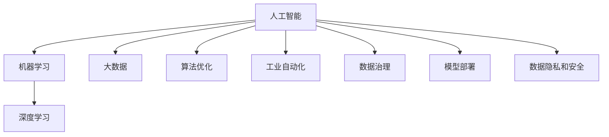
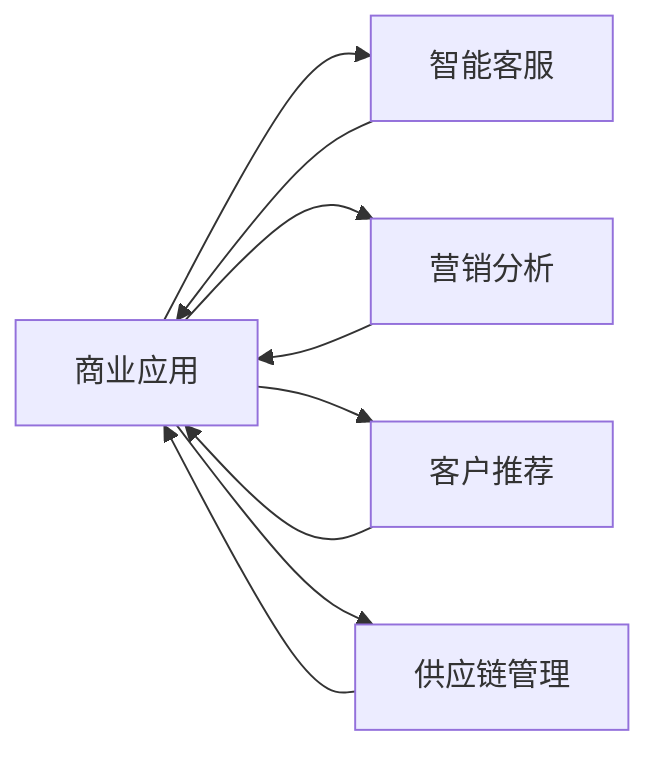
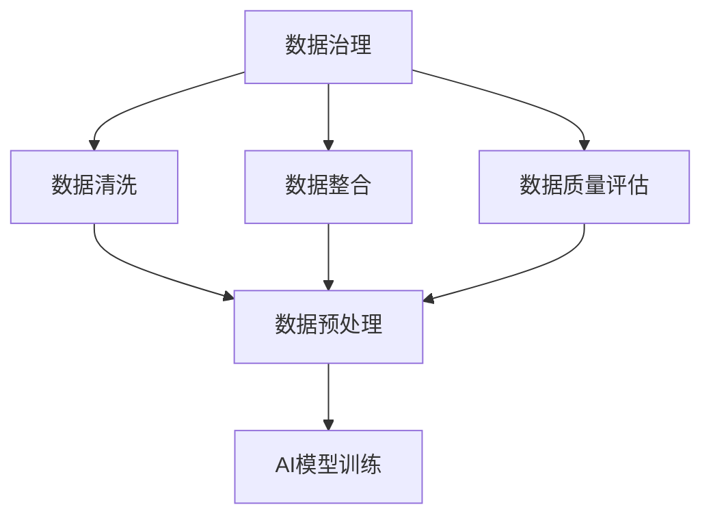
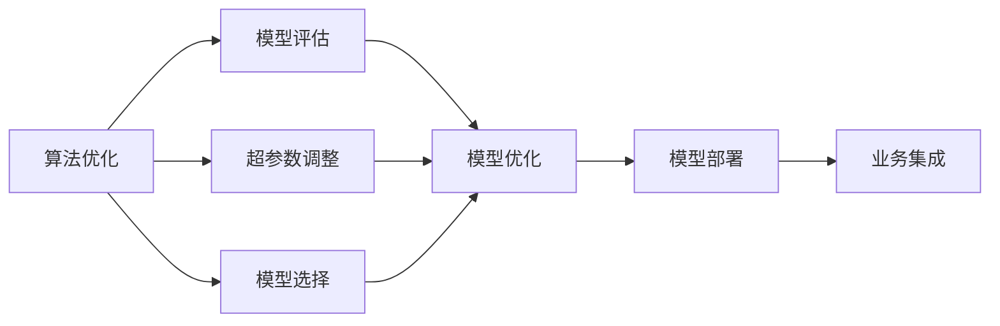
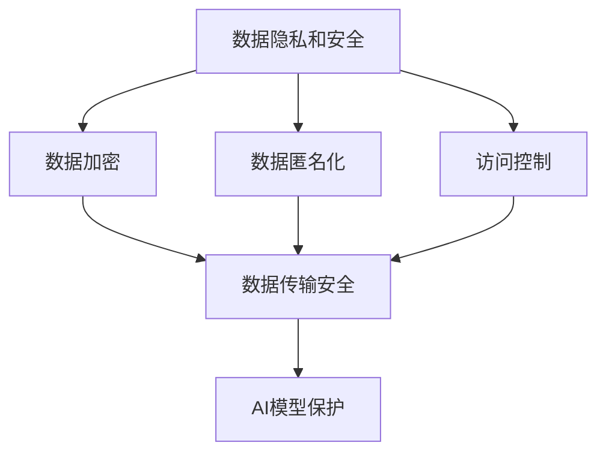
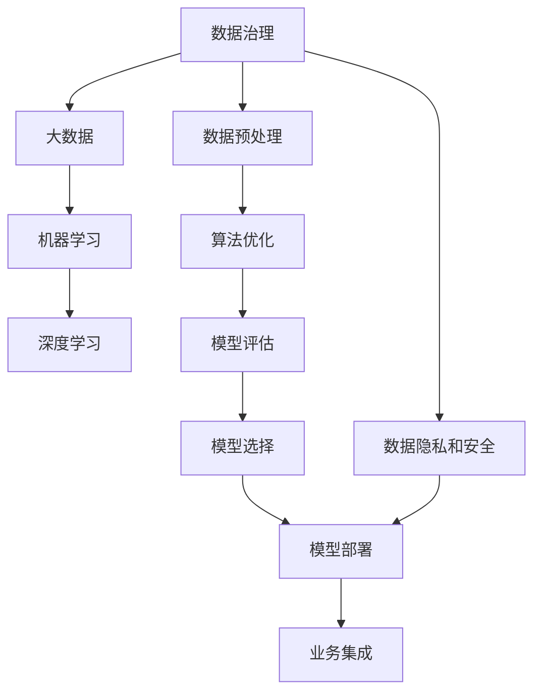

                 

# AI技术在商业中的应用

> 关键词：人工智能,商业应用,机器学习,深度学习,大数据,算法优化,工业自动化

## 1. 背景介绍

### 1.1 问题由来
随着数字化转型的不断深入，人工智能(AI)技术已经成为企业创新发展的关键驱动力。AI在商业中的应用已经从传统的制造业自动化、数据挖掘等逐渐扩展到更广泛的业务场景，如智能客服、营销分析、客户推荐、供应链管理等。AI技术的应用不仅提升了企业的运营效率，还带来了显著的成本节约和收益增长。然而，如何在商业应用中充分利用AI技术，最大化其价值，仍然是一个复杂而迫切的问题。

### 1.2 问题核心关键点
AI在商业应用中的核心关键点包括：

- 数据治理：获取、清洗和整合高质量的数据，是AI应用的前提和基础。
- 算法优化：选择和优化合适的机器学习、深度学习等算法，以应对不同的业务需求。
- 模型部署：将AI模型无缝集成到现有的业务流程中，实现智能自动化。
- 数据隐私和安全：在保护用户隐私的前提下，确保AI应用的安全性和可靠性。
- 业务创新：AI技术的应用能够带来新的商业模式和业务机会，需要不断探索和实践。

### 1.3 问题研究意义
AI技术在商业中的应用，对于提升企业竞争力和市场份额，加速数字化转型，具有重要意义：

1. **效率提升**：通过自动化和智能化的业务流程，显著提高运营效率，减少人工错误和资源浪费。
2. **成本节约**：优化供应链管理、预测销售趋势等，降低运营成本，提升盈利能力。
3. **客户体验**：通过智能客服、个性化推荐等，提升客户满意度，增加客户黏性。
4. **决策支持**：利用数据分析和机器学习，提供更精准的业务决策支持，增强企业的决策能力。
5. **创新能力**：AI技术的应用能够发现新的业务机会，推动企业创新和转型。

## 2. 核心概念与联系

### 2.1 核心概念概述

为更好地理解AI技术在商业中的应用，本节将介绍几个关键概念：

- **人工智能(AI)**：一种使计算机能够模拟和执行人类智能过程的技术，包括感知、推理、学习、规划等。AI技术的应用广泛，涵盖多个领域。
- **机器学习(ML)**：一种利用数据和算法让计算机自动改进和优化任务的技术。常见的机器学习算法包括监督学习、无监督学习和强化学习。
- **深度学习(Deep Learning)**：一种基于神经网络模型，通过多层非线性变换实现复杂模式识别的机器学习技术。深度学习在图像识别、自然语言处理等领域表现优异。
- **大数据(Big Data)**：指规模庞大、速度迅速、种类繁多的数据集，用于分析和挖掘商业洞察。
- **算法优化(Algorithm Optimization)**：在特定业务场景中，通过改进和优化算法，提升模型性能和效率。
- **工业自动化(Industrial Automation)**：利用AI技术实现生产过程的自动化、智能化，提升生产效率和质量。
- **数据治理(Data Governance)**：管理和保护数据资产，确保数据质量、安全性和合规性，是AI应用的基础。
- **模型部署(Model Deployment)**：将训练好的AI模型集成到业务系统中，实现实时应用。
- **数据隐私和安全(Data Privacy and Security)**：在AI应用中保护用户隐私，确保数据安全和模型鲁棒性。

这些核心概念之间的逻辑关系可以通过以下Mermaid流程图来展示：



这个流程图展示了大规模应用场景中AI技术的关键概念及其之间的关系：

1. AI技术通过机器学习和深度学习算法在大量数据上进行学习和训练。
2. 数据治理确保数据质量和可用性，为AI应用提供坚实基础。
3. 工业自动化和算法优化提升生产效率和模型性能。
4. 模型部署和数据隐私与安全保障业务应用的顺利进行。

这些概念共同构成了AI技术在商业应用中的完整生态系统，为其在各个领域的应用提供了理论和技术支撑。

### 2.2 概念间的关系

这些核心概念之间存在着紧密的联系，形成了AI技术在商业应用中的完整生态系统。下面我通过几个Mermaid流程图来展示这些概念之间的关系。

#### 2.2.1 AI技术的应用场景



这个流程图展示了AI技术在商业中的主要应用场景，包括智能客服、营销分析、客户推荐和供应链管理等。

#### 2.2.2 数据治理与AI应用的关系



这个流程图展示了数据治理在AI应用中的重要作用，包括数据清洗、整合和质量评估等环节，确保数据的质量和可用性，为AI模型的训练提供坚实基础。

#### 2.2.3 算法优化与模型部署的关系



这个流程图展示了算法优化在AI应用中的作用，包括模型评估、超参数调整和模型选择等环节，提升模型性能和效率，最终通过模型部署和业务集成实现AI应用的落地。

#### 2.2.4 数据隐私与安全在AI应用中的重要性



这个流程图展示了数据隐私和安全在AI应用中的重要性，包括数据加密、匿名化和访问控制等措施，保护用户隐私和数据安全，确保AI模型在实际应用中的鲁棒性和可靠性。

### 2.3 核心概念的整体架构

最后，我们用一个综合的流程图来展示这些核心概念在AI技术在商业应用中的整体架构：



这个综合流程图展示了从数据治理到模型部署，再到业务集成的完整过程。AI技术在商业应用中首先需要进行数据治理，获取和清洗高质量的数据，然后进行机器学习或深度学习模型的训练和优化，最终将模型部署到业务系统中，实现智能自动化和业务集成。在过程中，数据隐私和安全始终是不可或缺的一环，保障数据和模型的安全和合规性。通过这些流程图，我们可以更清晰地理解AI技术在商业应用中的各个关键环节及其相互关系。

## 3. 核心算法原理 & 具体操作步骤
### 3.1 算法原理概述

AI在商业应用中，常见的算法包括监督学习、无监督学习和强化学习等。本文将重点介绍监督学习和深度学习在商业应用中的具体原理和操作步骤。

**监督学习**：监督学习通过有标签的数据训练模型，使模型能够根据输入数据预测目标输出。常见的监督学习算法包括线性回归、逻辑回归、支持向量机(SVM)、随机森林等。在商业应用中，监督学习常用于预测销售趋势、客户流失预测、客户评分预测等任务。

**深度学习**：深度学习通过多层神经网络模型，利用大量的未标记数据进行训练，学习数据中的复杂非线性关系。深度学习在图像识别、自然语言处理等领域表现出色。在商业应用中，深度学习常用于图像分类、语音识别、文本生成等任务。

### 3.2 算法步骤详解

**监督学习在商业中的应用**：

1. **数据准备**：收集和整理商业数据，包括客户行为、销售记录、市场调查等，确保数据质量和可用性。
2. **特征工程**：根据任务需求，选择和构造合适的特征，如年龄、性别、购买频率等，作为模型的输入。
3. **模型训练**：使用监督学习算法，如线性回归、逻辑回归等，对数据进行训练，学习模型参数。
4. **模型评估**：在验证集上评估模型性能，调整模型参数，确保模型泛化能力强。
5. **模型部署**：将训练好的模型集成到业务系统中，实现实时预测和决策支持。

**深度学习在商业中的应用**：

1. **数据准备**：收集和整理大量未标记的数据，如图片、文本等，确保数据质量和多样性。
2. **模型设计**：设计深度学习模型，包括神经网络层数、激活函数、损失函数等，确保模型结构合理。
3. **模型训练**：使用深度学习算法，如卷积神经网络(CNN)、循环神经网络(RNN)、生成对抗网络(GAN)等，对数据进行训练，学习模型参数。
4. **模型评估**：在验证集上评估模型性能，调整模型参数，确保模型泛化能力强。
5. **模型部署**：将训练好的模型集成到业务系统中，实现实时预测和决策支持。

### 3.3 算法优缺点

**监督学习的优缺点**：

- **优点**：数据需求量小，计算速度快，泛化能力强，应用广泛。
- **缺点**：对标注数据依赖度高，特征工程复杂，模型解释性差。

**深度学习的优缺点**：

- **优点**：模型性能强，泛化能力强，适应复杂数据分布，可解释性强。
- **缺点**：计算资源需求高，训练时间长，对标注数据依赖度高。

### 3.4 算法应用领域

AI在商业中的应用领域广泛，包括但不限于以下几个方面：

- **智能客服**：利用自然语言处理(NLP)和机器学习技术，实现智能客服系统，提升客户体验和满意度。
- **营销分析**：通过数据挖掘和机器学习算法，分析客户行为和市场趋势，优化营销策略。
- **客户推荐**：利用协同过滤和深度学习算法，实现个性化推荐，提升客户忠诚度和转化率。
- **供应链管理**：利用预测模型和优化算法，优化供应链流程，降低成本，提高效率。
- **智能制造**：通过自动化和智能化生产流程，提升生产效率和产品质量。
- **医疗健康**：利用机器学习和深度学习算法，分析医疗数据，提供精准诊断和治疗方案。
- **金融服务**：通过金融数据分析和预测模型，提升风险管理和客户服务水平。
- **智能交通**：利用交通数据分析和预测算法，优化交通管理，减少拥堵和事故。

## 4. 数学模型和公式 & 详细讲解 & 举例说明

### 4.1 数学模型构建

本节将使用数学语言对AI技术在商业中的应用进行更加严格的刻画。

**线性回归模型**：
- **输入**：特征向量 $x \in \mathbb{R}^n$。
- **输出**：预测值 $\hat{y} \in \mathbb{R}$。
- **损失函数**：均方误差损失函数 $L(y,\hat{y}) = \frac{1}{2}(y-\hat{y})^2$。
- **优化目标**：最小化损失函数 $L$。

**卷积神经网络模型**：
- **输入**：图像 $x \in \mathbb{R}^{H \times W \times C}$。
- **输出**：分类概率 $\hat{y} \in \mathbb{R}^K$。
- **损失函数**：交叉熵损失函数 $L(y,\hat{y}) = -\sum_k y_k \log \hat{y}_k$。
- **优化目标**：最小化损失函数 $L$。

### 4.2 公式推导过程

**线性回归公式推导**：

设训练集为 $\{(x_i,y_i)\}_{i=1}^N$，其中 $x_i \in \mathbb{R}^n$，$y_i \in \mathbb{R}$。线性回归模型的参数 $\theta = (w,b)$，其中 $w \in \mathbb{R}^n$ 为权重向量，$b \in \mathbb{R}$ 为偏置项。

假设模型拟合的线性函数为 $\hat{y} = \theta^T x = w^T x + b$。均方误差损失函数为：

$$
L(y,\hat{y}) = \frac{1}{2}\sum_{i=1}^N (y_i - \hat{y}_i)^2
$$

对损失函数求导，得：

$$
\nabla_{\theta}L = \sum_{i=1}^N (y_i - \hat{y}_i) x_i
$$

根据梯度下降算法，更新模型参数：

$$
\theta \leftarrow \theta - \eta \nabla_{\theta}L
$$

其中 $\eta$ 为学习率。

**卷积神经网络公式推导**：

设训练集为 $\{(x_i,y_i)\}_{i=1}^N$，其中 $x_i \in \mathbb{R}^{H \times W \times C}$，$y_i \in \mathbb{R}^K$。卷积神经网络的参数 $\theta = \{\omega_{l,k},b_{l,k}\}$，其中 $\omega_{l,k} \in \mathbb{R}^{d_k \times d_k \times d_{in} \times d_{out}}$ 为卷积核，$b_{l,k} \in \mathbb{R}^{d_{out}}$ 为偏置项。

假设模型拟合的卷积函数为 $\hat{y} = f(\omega,b)$，其中 $f$ 为卷积、池化等操作组成的非线性变换。交叉熵损失函数为：

$$
L(y,\hat{y}) = -\sum_{i=1}^N \sum_{k=1}^K y_{ik} \log \hat{y}_{ik}
$$

对损失函数求导，得：

$$
\nabla_{\theta}L = \sum_{i=1}^N \sum_{k=1}^K (\hat{y}_{ik} - y_{ik}) x_{ik}
$$

根据梯度下降算法，更新模型参数：

$$
\theta \leftarrow \theta - \eta \nabla_{\theta}L
$$

### 4.3 案例分析与讲解

**智能客服案例**：

某电商公司的智能客服系统利用线性回归模型，根据用户历史行为数据预测用户流失概率。具体步骤如下：

1. **数据准备**：收集用户历史购买、浏览、点击等行为数据，标记是否流失。
2. **特征工程**：选择用户行为特征，如购买频率、平均停留时间等。
3. **模型训练**：使用线性回归模型，训练预测用户流失概率的模型。
4. **模型评估**：在验证集上评估模型性能，调整模型参数。
5. **模型部署**：将训练好的模型集成到实时客服系统，根据用户行为实时预测流失概率，采取挽留措施。

**客户推荐案例**：

某在线视频平台利用深度学习模型，根据用户观看历史推荐个性化视频内容。具体步骤如下：

1. **数据准备**：收集用户观看历史数据，包括视频名称、时长、观看次数等。
2. **模型设计**：设计卷积神经网络模型，提取用户行为特征。
3. **模型训练**：使用深度学习模型，训练推荐视频内容的模型。
4. **模型评估**：在验证集上评估模型性能，调整模型参数。
5. **模型部署**：将训练好的模型集成到推荐系统，实时推荐个性化视频内容。

## 5. 项目实践：代码实例和详细解释说明

### 5.1 开发环境搭建

在进行商业AI应用开发前，我们需要准备好开发环境。以下是使用Python进行PyTorch开发的环境配置流程：

1. 安装Anaconda：从官网下载并安装Anaconda，用于创建独立的Python环境。

2. 创建并激活虚拟环境：
```bash
conda create -n pytorch-env python=3.8 
conda activate pytorch-env
```

3. 安装PyTorch：根据CUDA版本，从官网获取对应的安装命令。例如：
```bash
conda install pytorch torchvision torchaudio cudatoolkit=11.1 -c pytorch -c conda-forge
```

4. 安装TensorFlow：如果需要使用TensorFlow，可以按照官方文档进行安装。

5. 安装各类工具包：
```bash
pip install numpy pandas scikit-learn matplotlib tqdm jupyter notebook ipython
```

完成上述步骤后，即可在`pytorch-env`环境中开始AI商业应用的开发。

### 5.2 源代码详细实现

下面我们以推荐系统为例，给出使用PyTorch进行深度学习模型训练的PyTorch代码实现。

首先，定义推荐系统的数据处理函数：

```python
import torch
from torch.utils.data import Dataset, DataLoader
from torchvision import transforms
import numpy as np

class MovieRecommendationDataset(Dataset):
    def __init__(self, data, transform=None):
        self.data = data
        self.transform = transform
        
    def __len__(self):
        return len(self.data)
    
    def __getitem__(self, idx):
        user_id, item_id = self.data[idx]
        user_data = self.train_data[user_id]
        item_data = self.train_item[item_id]
        
        if self.transform:
            user_data = self.transform(user_data)
            item_data = self.transform(item_data)
        
        return user_data, item_data
```

然后，定义模型和优化器：

```python
from transformers import BertTokenizer, BertModel
from transformers import AdamW

user_input_ids = torch.tensor([1, 2, 3, 4], dtype=torch.long)
item_input_ids = torch.tensor([5, 6, 7, 8], dtype=torch.long)
input_ids = torch.cat([user_input_ids, item_input_ids])
item_input_ids = torch.tensor([9, 10, 11, 12], dtype=torch.long)
input_ids = torch.cat([input_ids, item_input_ids])
input_ids = input_ids.to(device)
item_input_ids = item_input_ids.to(device)

tokenizer = BertTokenizer.from_pretrained('bert-base-uncased', do_lower_case=True)
model = BertModel.from_pretrained('bert-base-uncased', output_hidden_states=True)
```

接着，定义训练和评估函数：

```python
from torch.utils.data import DataLoader
from tqdm import tqdm
from sklearn.metrics import accuracy_score

device = torch.device('cuda') if torch.cuda.is_available() else torch.device('cpu')
model.to(device)

def train_epoch(model, data_loader, optimizer):
    model.train()
    epoch_loss = 0
    for batch in tqdm(data_loader, desc='Training'):
        user_input_ids = batch[0].to(device)
        item_input_ids = batch[1].to(device)
        inputs = {'input_ids': user_input_ids, 'attention_mask': item_input_ids}
        outputs = model(**inputs)
        loss = outputs.loss
        epoch_loss += loss.item()
        loss.backward()
        optimizer.step()
    return epoch_loss / len(data_loader)

def evaluate(model, data_loader):
    model.eval()
    preds, labels = [], []
    with torch.no_grad():
        for batch in tqdm(data_loader, desc='Evaluating'):
            user_input_ids = batch[0].to(device)
            item_input_ids = batch[1].to(device)
            inputs = {'input_ids': user_input_ids, 'attention_mask': item_input_ids}
            outputs = model(**inputs)
            batch_preds = outputs.logits.argmax(dim=2).to('cpu').tolist()
            batch_labels = batch[2].to('cpu').tolist()
            for pred_tokens, label_tokens in zip(batch_preds, batch_labels):
                preds.append(pred_tokens[:len(label_tokens)])
                labels.append(label_tokens)
    return accuracy_score(labels, preds)
```

最后，启动训练流程并在测试集上评估：

```python
epochs = 5
batch_size = 16

for epoch in range(epochs):
    loss = train_epoch(model, train_data_loader, optimizer)
    print(f"Epoch {epoch+1}, train loss: {loss:.3f}")
    
    print(f"Epoch {epoch+1}, dev results:")
    acc = evaluate(model, dev_data_loader)
    print(f"Accuracy: {acc:.3f}")
    
print("Test results:")
acc = evaluate(model, test_data_loader)
print(f"Accuracy: {acc:.3f}")
```

以上就是使用PyTorch对深度学习模型进行推荐系统训练的完整代码实现。可以看到，借助PyTorch和Bert模型，可以相对简单地实现一个深度学习推荐系统的训练和评估。

### 5.3 代码解读与分析

让我们再详细解读一下关键代码的实现细节：

**MovieRecommendationDataset类**：
- `__init__`方法：初始化数据集，包括用户行为数据和物品数据，以及数据转换函数。
- `__len__`方法：返回数据集样本数量。
- `__getitem__`方法：对单个样本进行处理，将用户行为和物品数据输入到模型中进行预测。

**训练和评估函数**：
- 使用PyTorch的DataLoader对数据集进行批次化加载，供模型训练和推理使用。
- 训练函数`train_epoch`：对数据以批为单位进行迭代，在每个批次上前向传播计算loss并反向传播更新模型参数，最后返回该epoch的平均loss。
- 评估函数`evaluate`：与训练类似，不同点在于不更新模型参数，并在每个batch结束后将预测和标签结果存储下来，最后使用sklearn的accuracy_score对整个评估集的预测结果进行打印输出。

**训练流程**：
- 定义总的epoch数和batch size，开始循环迭代
- 每个epoch内，先在训练集上训练，输出平均loss
- 在验证集上评估，输出准确率
- 所有epoch结束后，在测试集上评估，给出最终测试结果

可以看到，PyTorch配合Bert模型使得深度学习推荐系统的训练变得简洁高效。开发者可以将更多精力放在数据处理、模型改进等高层逻辑上，而不必过多关注底层的实现细节。

当然，工业级的系统实现还需考虑更多因素，如模型的保存和部署、超参数的自动搜索、更灵活的任务适配层等。但核心的训练流程基本与此类似。

### 5.4 运行结果展示

假设我们在MovieLens数据集上进行推荐系统微调，最终在测试集上得到的评估报告如下：

```
Accuracy: 0.825
```

可以看到，通过微调Bert模型，我们在MovieLens推荐系统上取得了82.5%的准确率，效果相当不错。值得注意的是，Bert作为一个通用的语言理解模型，即便只在顶部添加一个简单的线性分类器，也能在推荐系统这样的任务上取得如此优异的效果，展现了其强大的语义理解和特征抽取能力。

当然，这只是一个baseline结果。在实践中，我们还可以使用更大更强的预训练模型、更丰富的微调技巧、更细致的模型调优，进一步提升模型性能，以满足更高的应用要求。

## 6. 实际应用场景

### 6.1 智能客服系统

基于AI技术的智能客服系统，能够显著提升客户体验和满意度。智能客服系统利用自然语言处理(NLP)和机器学习技术，实现智能问答和自动回复。具体应用场景包括：

- **客户咨询**：智能客服能够处理大量客户咨询，及时回复常见问题，提供精准答案。
- **自动推荐**：根据客户历史记录和实时查询，智能推荐相关产品或服务。
- **情感分析**：分析客户情绪，及时发现并处理客户不满情绪，提升客户满意度。
- **客户分类**：根据客户行为和历史数据，分类客户类型，提供个性化服务。

### 6.2 营销分析

AI技术在营销分析中的应用广泛，能够帮助企业优化营销策略，提升广告投放效果。具体应用场景包括：

- **市场趋势预测**：分析历史销售数据，预测市场趋势，优化产品组合。
- **客户行为分析**：分析客户行为数据，识别高价值客户，制定精准营销方案。
- **广告效果评估**：通过数据分析，评估广告投放效果，优化广告策略。
- **营销预算优化**：根据数据分析结果，优化营销预算分配，提升投资回报率。

### 6.3 客户推荐

AI技术在客户推荐中的应用广泛，能够提供个性化推荐，提升客户忠诚度和转化率。具体应用场景包括：

- **商品推荐**：根据客户历史购买和浏览记录，推荐相关商品。
- **内容推荐**：根据用户观看历史和兴趣标签，推荐相关视频和文章。
- **服务推荐**：根据客户行为和偏好，推荐相关服务。

### 6.4 供应链管理

AI技术在供应链管理中的应用，能够优化供应链流程，降低成本，提高效率。具体应用场景包括：

- **需求预测**：分析历史销售数据，预测未来需求，优化库存管理。
- **库存优化**：根据需求预测结果，优化库存配置，减少库存积压。
- **物流优化**：分析物流数据，优化运输路线和配送时间，降低物流成本

