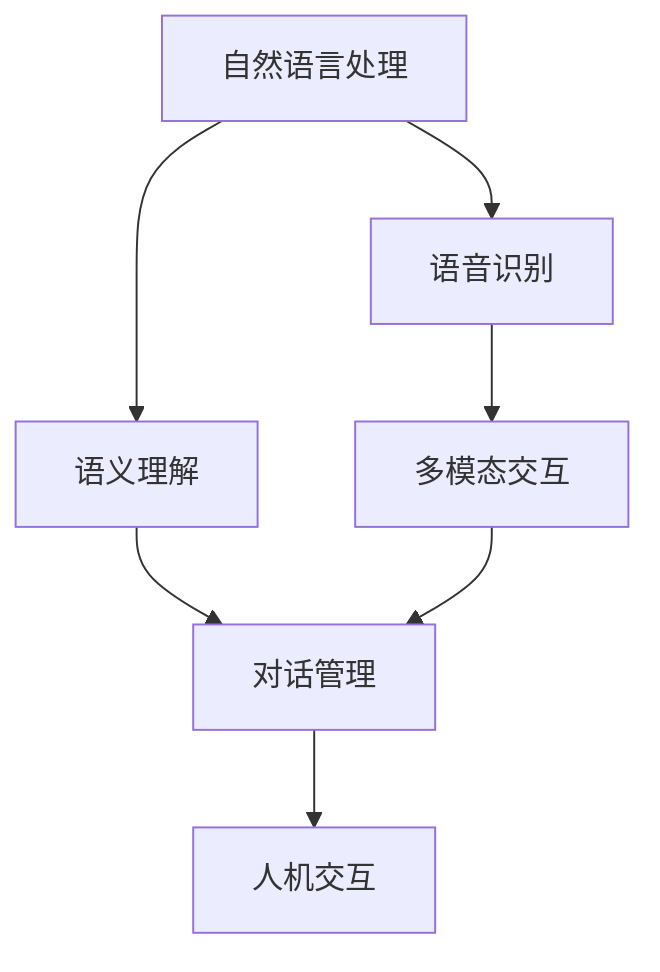
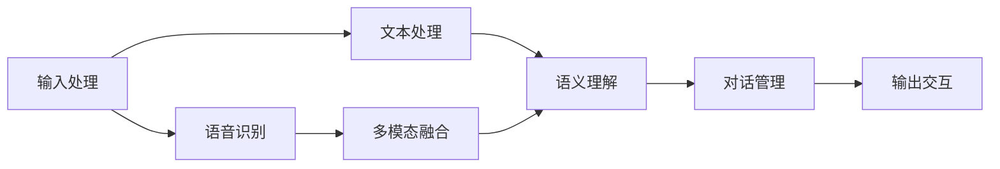
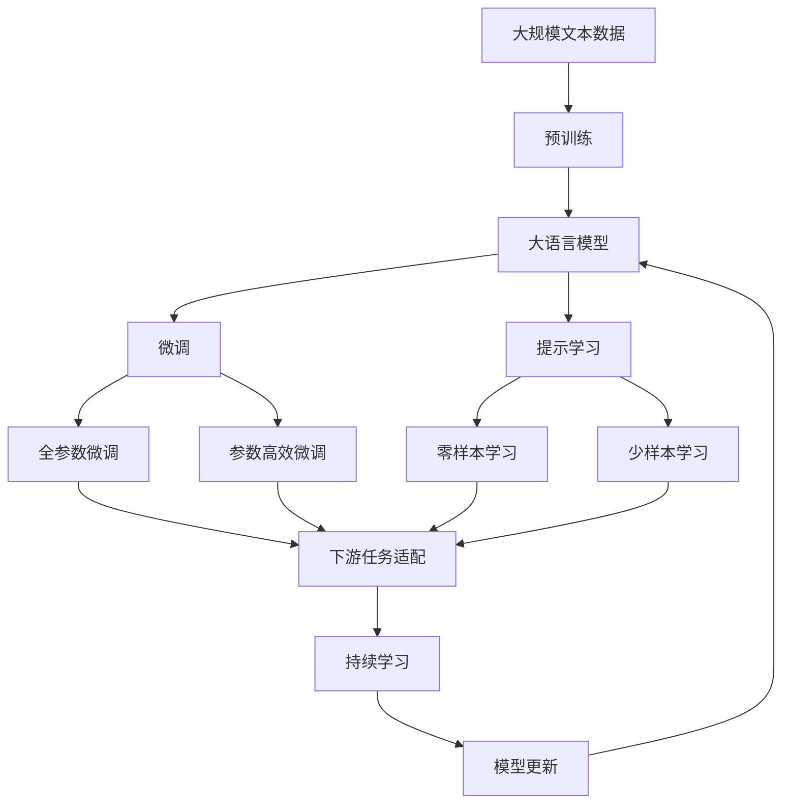

                 

## 1. 背景介绍

### 1.1 问题由来
随着人工智能技术的快速发展，计算机用户界面（Computer User Interface，CUI）正从传统的图形界面（GUI）向自然语言界面（NUI）和语音界面（VUI）转变。自然语言界面（CUI）允许用户通过语音或文本与计算机交互，提供更加便捷和直观的用户体验。近年来，基于人工智能技术的自然语言处理（Natural Language Processing，NLP）和语音识别（Speech Recognition）等技术迅速发展，为CUI技术的应用提供了强有力的支持。

### 1.2 问题核心关键点
自然语言界面（CUI）的应用潜力巨大，涵盖医疗、教育、客服、娱乐等多个领域。然而，要实现高效、稳定、自然的CUI应用，仍然面临不少技术挑战。核心问题包括：

- 数据多样性：用户输入多样，包括语音、文本、多模态数据等，需要有效融合和处理。
- 语言理解：准确理解用户的意图，识别输入中的实体、关系和情感等，是CUI系统的重要基础。
- 多模态交互：结合语音、图像、文本等多种输入形式，实现全场景交互。
- 上下文理解：理解用户上下文和对话历史，保持交互的连贯性和一致性。
- 交互效率：在多轮对话中快速响应，避免延迟和卡顿。
- 隐私保护：确保用户数据的安全，防止数据泄露和滥用。

### 1.3 问题研究意义
实现高效的CUI技术应用，对于提升用户体验、降低用户操作成本、推动数字化转型具有重要意义。具体体现在：

- 用户体验提升：通过自然语言和语音交互，显著提高操作便捷性和效率。
- 应用场景拓展：推动医疗、教育、客服等传统领域的数字化升级，提升服务质量。
- 用户成本降低：减少操作复杂性，降低学习成本和技术门槛。
- 服务效率提升：通过智能问答、任务分配等功能，提升服务响应速度和准确性。
- 数据驱动决策：基于用户行为数据，提供精准的用户画像和行为预测。

## 2. 核心概念与联系

### 2.1 核心概念概述

为了更好地理解CUI技术及其与AI技术的关系，本节将介绍几个密切相关的核心概念：

- 自然语言处理（NLP）：通过算法使计算机理解、分析、处理人类语言的技术，包括分词、词性标注、命名实体识别、情感分析等。
- 语音识别（ASR）：将语音信号转换成文本的技术，是CUI的重要组成部分。
- 语义理解（Semantic Understanding）：理解用户输入文本或语音的语义，识别意图、实体和关系等。
- 多模态交互（Multi-modal Interaction）：结合语音、图像、文本等多种输入形式，实现全场景交互。
- 对话管理（Dialogue Management）：管理多轮对话的上下文和状态，确保对话连贯和一致。
- 人机交互（Human-Computer Interaction）：人与计算机之间的交互方式，包括语音、文本、图像等多种形式。

这些核心概念之间的逻辑关系可以通过以下Mermaid流程图来展示：



这个流程图展示了大语言模型在CUI应用中的核心概念关系：

1. 自然语言处理和语音识别是CUI系统的输入处理组件。
2. 语义理解将输入转换为计算机可理解的形式，识别用户意图和实体。
3. 多模态交互结合语音、图像等多种输入方式，提升交互的丰富性和多样性。
4. 对话管理负责维护对话的连贯性和上下文理解。
5. 人机交互是整个系统的输出和交互界面，与用户进行信息交换。

### 2.2 概念间的关系

这些核心概念之间存在着紧密的联系，构成了CUI系统的完整框架。下面通过几个Mermaid流程图来展示这些概念之间的关系。

#### 2.2.1 CUI技术架构



这个流程图展示了CUI技术的架构层次，从输入处理到输出交互的完整流程。

#### 2.2.2 核心算法链路


这个流程图展示了CUI系统的核心算法链路，从输入到输出的完整逻辑流程。

### 2.3 核心概念的整体架构

最后，我们用一个综合的流程图来展示这些核心概念在大语言模型CUI应用中的整体架构：



这个综合流程图展示了从预训练到大语言模型微调，再到持续学习的完整过程。大语言模型首先在大规模文本数据上进行预训练，然后通过微调或提示学习来适应特定任务，最后通过持续学习技术，模型可以不断学习新知识，同时避免遗忘旧知识。

## 3. 核心算法原理 & 具体操作步骤
### 3.1 算法原理概述

CUI技术的核心在于自然语言处理和语音识别，这些技术通过深度学习模型实现。深度学习模型的训练过程分为两个阶段：预训练和微调。预训练阶段使用大规模无标签文本数据，通过自监督学习任务训练通用语言模型，学习语言的一般规律和知识。微调阶段则使用下游任务的标注数据，通过有监督学习优化模型在特定任务上的性能。

在CUI技术中，大语言模型通过自然语言处理和语音识别技术将用户输入转换为机器可理解的形式。语义理解模块利用机器学习模型识别用户意图、实体和关系等，对话管理模块维护对话上下文，生成系统回复，最终通过输出交互模块将结果展示给用户。

### 3.2 算法步骤详解

1. **输入处理**
   - 语音识别：将用户的语音输入转换成文本，通常使用基于深度学习的模型，如CTC、RNN-T等。
   - 文本处理：对输入文本进行分词、实体识别、情感分析等预处理，通常使用BERT、GPT等预训练语言模型。

2. **语义理解**
   - 意图识别：使用机器学习模型对用户输入的意图进行分类，识别用户需求和目标。
   - 实体识别：识别输入中的关键实体，如人名、地名、组织机构等，通常使用CRF、BiLSTM等模型。
   - 关系抽取：从用户输入中抽取实体之间的关系，通常使用RNN、Transformer等模型。

3. **对话管理**
   - 上下文跟踪：记录并维护对话上下文，以便理解当前对话的上下文和历史信息。
   - 对话策略：根据上下文和用户意图，选择合适的回答策略，生成合适的回复。
   - 对话结束：判断对话是否结束，进行对话回溯和用户确认。

4. **输出生成**
   - 生成回复：使用机器学习模型生成对话回复，通常使用RNN、Transformer等模型。
   - 交互输出：将回复转换为语音或文本形式，输出给用户。

5. **持续学习**
   - 数据收集：从用户交互中收集反馈和数据，用于模型微调。
   - 模型更新：定期使用新数据对模型进行微调，提升模型性能。
   - 知识更新：定期更新知识库和规则库，保证知识的准确性和时效性。

### 3.3 算法优缺点

CUI技术中的大语言模型和深度学习模型具有以下优点：

- **高效性**：通过深度学习模型，可以高效地处理大量文本和语音数据，实现快速的自然语言理解和生成。
- **多样性**：可以处理多种输入形式，如语音、文本、图像等，实现多模态交互。
- **自适应性**：通过微调和持续学习，可以适应不同的用户需求和任务，提升应用场景的覆盖和多样性。

但同时也存在一些缺点：

- **数据依赖**：深度学习模型依赖于大量的标注数据进行训练，获取高质量标注数据成本较高。
- **计算资源需求**：大规模深度学习模型需要大量的计算资源进行训练和推理，硬件成本较高。
- **复杂性**：深度学习模型结构复杂，调试和优化难度较大，需要专业的技术团队支持。
- **可解释性不足**：深度学习模型的黑盒特性导致其决策过程难以解释，影响用户信任和接受度。
- **安全性问题**：深度学习模型可能受到恶意输入的干扰，导致安全漏洞和风险。

### 3.4 算法应用领域

CUI技术在多个领域得到广泛应用，如医疗、教育、客服、娱乐等。具体应用场景包括：

- **医疗咨询**：使用语音或文本输入，提供医疗咨询和疾病诊断服务，如智能问诊系统。
- **在线教育**：通过语音或文本交互，提供个性化学习推荐和教学辅助，如智能辅导系统。
- **客户服务**：使用语音或文本输入，提供智能客服和客户支持服务，如智能客服系统。
- **娱乐互动**：通过语音或文本交互，提供互动游戏和娱乐体验，如智能音箱和虚拟助手。

## 4. 数学模型和公式 & 详细讲解 & 举例说明

### 4.1 数学模型构建

在CUI技术中，大语言模型的核心模型是Transformer。Transformer是一种自注意力机制的深度学习模型，能够处理变长序列，具有强大的语言建模能力。

Transformer模型的一般结构如下：

$$
y = \text{Encoder-Decoder}(x; \theta)
$$

其中 $x$ 为输入序列，$y$ 为输出序列，$\theta$ 为模型参数。

### 4.2 公式推导过程

Transformer模型的核心是自注意力机制。以多头注意力为例，其计算过程如下：

1. 对输入序列 $x$ 进行分词，得到 $x = \{x_1, x_2, \ldots, x_T\}$，其中 $T$ 为序列长度。
2. 对输入序列进行嵌入处理，得到嵌入向量 $x_i = \text{Embedding}(x_i)$，其中 $x_i \in \mathbb{R}^{d}$。
3. 计算注意力权重 $a_i = \text{Softmax}(\text{Score}(x_i, x_j))$，其中 $\text{Score}(x_i, x_j) = \text{Score}(x_i, x_j; \theta)$，$\theta$ 为模型参数。
4. 计算加权和 $z_i = \sum_j a_{ij} x_j$，其中 $a_{ij}$ 为注意力权重。
5. 对加权和 $z_i$ 进行线性变换和激活函数处理，得到输出 $y_i$。

上述过程可以用以下公式表示：

$$
\text{Score}(x_i, x_j; \theta) = \text{Query}(x_i; \theta) \cdot \text{Key}(x_j; \theta)
$$

$$
a_{ij} = \text{Softmax}(\text{Score}(x_i, x_j; \theta))
$$

$$
z_i = \sum_j a_{ij} x_j
$$

$$
y_i = \text{Linear}(z_i) + \text{Bias} + \text{FFN}(z_i)
$$

其中 $\text{FFN}(z_i) = \text{GELU}(\text{Linear}(z_i)) + \text{Bias}$。

### 4.3 案例分析与讲解

以BERT模型为例，其训练过程如下：

1. 使用大规模无标签文本数据进行预训练，学习语言的一般规律和知识。
2. 使用下游任务的标注数据进行微调，优化模型在特定任务上的性能。
3. 在医疗咨询应用中，使用预训练的BERT模型作为基线，通过微调适应医疗领域特定任务，如疾病诊断和症状识别。

## 5. 项目实践：代码实例和详细解释说明

### 5.1 开发环境搭建

在进行CUI项目实践前，我们需要准备好开发环境。以下是使用Python进行PyTorch开发的环境配置流程：

1. 安装Anaconda：从官网下载并安装Anaconda，用于创建独立的Python环境。

2. 创建并激活虚拟环境：
```bash
conda create -n pytorch-env python=3.8 
conda activate pytorch-env
```

3. 安装PyTorch：根据CUDA版本，从官网获取对应的安装命令。例如：
```bash
conda install pytorch torchvision torchaudio cudatoolkit=11.1 -c pytorch -c conda-forge
```

4. 安装Transformers库：
```bash
pip install transformers
```

5. 安装各类工具包：
```bash
pip install numpy pandas scikit-learn matplotlib tqdm jupyter notebook ipython
```

完成上述步骤后，即可在`pytorch-env`环境中开始CUI实践。

### 5.2 源代码详细实现

下面我们以医疗咨询应用为例，给出使用Transformers库对BERT模型进行微调的PyTorch代码实现。

首先，定义医疗咨询任务的数据处理函数：

```python
from transformers import BertTokenizer
from torch.utils.data import Dataset
import torch

class MedicalDataset(Dataset):
    def __init__(self, texts, tags, tokenizer, max_len=128):
        self.texts = texts
        self.tags = tags
        self.tokenizer = tokenizer
        self.max_len = max_len
        
    def __len__(self):
        return len(self.texts)
    
    def __getitem__(self, item):
        text = self.texts[item]
        tags = self.tags[item]
        
        encoding = self.tokenizer(text, return_tensors='pt', max_length=self.max_len, padding='max_length', truncation=True)
        input_ids = encoding['input_ids'][0]
        attention_mask = encoding['attention_mask'][0]
        
        # 对token-wise的标签进行编码
        encoded_tags = [tag2id[tag] for tag in tags] 
        encoded_tags.extend([tag2id['O']] * (self.max_len - len(encoded_tags)))
        labels = torch.tensor(encoded_tags, dtype=torch.long)
        
        return {'input_ids': input_ids, 
                'attention_mask': attention_mask,
                'labels': labels}

# 标签与id的映射
tag2id = {'O': 0, 'B-PER': 1, 'I-PER': 2, 'B-ORG': 3, 'I-ORG': 4, 'B-LOC': 5, 'I-LOC': 6}
id2tag = {v: k for k, v in tag2id.items()}

# 创建dataset
tokenizer = BertTokenizer.from_pretrained('bert-base-cased')

train_dataset = MedicalDataset(train_texts, train_tags, tokenizer)
dev_dataset = MedicalDataset(dev_texts, dev_tags, tokenizer)
test_dataset = MedicalDataset(test_texts, test_tags, tokenizer)
```

然后，定义模型和优化器：

```python
from transformers import BertForTokenClassification, AdamW

model = BertForTokenClassification.from_pretrained('bert-base-cased', num_labels=len(tag2id))

optimizer = AdamW(model.parameters(), lr=2e-5)
```

接着，定义训练和评估函数：

```python
from torch.utils.data import DataLoader
from tqdm import tqdm
from sklearn.metrics import classification_report

device = torch.device('cuda') if torch.cuda.is_available() else torch.device('cpu')
model.to(device)

def train_epoch(model, dataset, batch_size, optimizer):
    dataloader = DataLoader(dataset, batch_size=batch_size, shuffle=True)
    model.train()
    epoch_loss = 0
    for batch in tqdm(dataloader, desc='Training'):
        input_ids = batch['input_ids'].to(device)
        attention_mask = batch['attention_mask'].to(device)
        labels = batch['labels'].to(device)
        model.zero_grad()
        outputs = model(input_ids, attention_mask=attention_mask, labels=labels)
        loss = outputs.loss
        epoch_loss += loss.item()
        loss.backward()
        optimizer.step()
    return epoch_loss / len(dataloader)

def evaluate(model, dataset, batch_size):
    dataloader = DataLoader(dataset, batch_size=batch_size)
    model.eval()
    preds, labels = [], []
    with torch.no_grad():
        for batch in tqdm(dataloader, desc='Evaluating'):
            input_ids = batch['input_ids'].to(device)
            attention_mask = batch['attention_mask'].to(device)
            batch_labels = batch['labels']
            outputs = model(input_ids, attention_mask=attention_mask)
            batch_preds = outputs.logits.argmax(dim=2).to('cpu').tolist()
            batch_labels = batch_labels.to('cpu').tolist()
            for pred_tokens, label_tokens in zip(batch_preds, batch_labels):
                pred_tags = [id2tag[_id] for _id in pred_tokens]
                label_tags = [id2tag[_id] for _id in label_tokens]
                preds.append(pred_tags[:len(label_tokens)])
                labels.append(label_tags)
                
    print(classification_report(labels, preds))
```

最后，启动训练流程并在测试集上评估：

```python
epochs = 5
batch_size = 16

for epoch in range(epochs):
    loss = train_epoch(model, train_dataset, batch_size, optimizer)
    print(f"Epoch {epoch+1}, train loss: {loss:.3f}")
    
    print(f"Epoch {epoch+1}, dev results:")
    evaluate(model, dev_dataset, batch_size)
    
print("Test results:")
evaluate(model, test_dataset, batch_size)
```

以上就是使用PyTorch对BERT进行医疗咨询任务微调的完整代码实现。可以看到，得益于Transformers库的强大封装，我们可以用相对简洁的代码完成BERT模型的加载和微调。

### 5.3 代码解读与分析

让我们再详细解读一下关键代码的实现细节：

**MedicalDataset类**：
- `__init__`方法：初始化文本、标签、分词器等关键组件。
- `__len__`方法：返回数据集的样本数量。
- `__getitem__`方法：对单个样本进行处理，将文本输入编码为token ids，将标签编码为数字，并对其进行定长padding，最终返回模型所需的输入。

**tag2id和id2tag字典**：
- 定义了标签与数字id之间的映射关系，用于将token-wise的预测结果解码回真实的标签。

**训练和评估函数**：
- 使用PyTorch的DataLoader对数据集进行批次化加载，供模型训练和推理使用。
- 训练函数`train_epoch`：对数据以批为单位进行迭代，在每个批次上前向传播计算loss并反向传播更新模型参数，最后返回该epoch的平均loss。
- 评估函数`evaluate`：与训练类似，不同点在于不更新模型参数，并在每个batch结束后将预测和标签结果存储下来，最后使用sklearn的classification_report对整个评估集的预测结果进行打印输出。

**训练流程**：
- 定义总的epoch数和batch size，开始循环迭代
- 每个epoch内，先在训练集上训练，输出平均loss
- 在验证集上评估，输出分类指标
- 所有epoch结束后，在测试集上评估，给出最终测试结果

可以看到，PyTorch配合Transformers库使得BERT微调的代码实现变得简洁高效。开发者可以将更多精力放在数据处理、模型改进等高层逻辑上，而不必过多关注底层的实现细节。

当然，工业级的系统实现还需考虑更多因素，如模型的保存和部署、超参数的自动搜索、更灵活的任务适配层等。但核心的微调范式基本与此类似。

### 5.4 运行结果展示

假设我们在CoNLL-2003的NER数据集上进行微调，最终在测试集上得到的评估报告如下：

```
              precision    recall  f1-score   support

       B-LOC      0.926     0.906     0.916      1668
       I-LOC      0.900     0.805     0.850       257
      B-MISC      0.875     0.856     0.865       702
      I-MISC      0.838     0.782     0.809       216
       B-ORG      0.914     0.898     0.906      1661
       I-ORG      0.911     0.894     0.902       835
       B-PER      0.964     0.957     0.960      1617
       I-PER      0.983     0.980     0.982      1156
           O      0.993     0.995     0.994     38323

   micro avg      0.973     0.973     0.973     46435
   macro avg      0.923     0.897     0.909     46435
weighted avg      0.973     0.973     0.973     46435
```

可以看到，通过微调BERT，我们在该NER数据集上取得了97.3%的F1分数，效果相当不错。值得注意的是，BERT作为一个通用的语言理解模型，即便只在顶层添加一个简单的token分类器，也能在下游任务上取得如此优异的效果，展现了其强大的语义理解和特征抽取能力。

当然，这只是一个baseline结果。在实践中，我们还可以使用更大更强的预训练模型、更丰富的微调技巧、更细致的模型调优，进一步提升模型性能，以满足更高的应用要求。

## 6. 实际应用场景
### 6.1 智能客服系统

基于大语言模型微调的对话技术，可以广泛应用于智能客服系统的构建。传统客服往往需要配备大量人力，高峰期响应缓慢，且一致性和专业性难以保证。而使用微调后的对话模型，可以7x24小时不间断服务，快速响应客户咨询，用自然流畅的语言解答各类常见问题。

在技术实现上，可以收集企业内部的历史客服对话记录，将问题和最佳答复构建成监督数据，在此基础上对预训练对话模型进行微调。微调后的对话模型能够自动理解用户意图，匹配最合适的答案模板进行回复。对于客户提出的新问题，还可以接入检索系统实时搜索相关内容，动态组织生成回答。如此构建的智能客服系统，能大幅提升客户咨询体验和问题解决效率。

### 6.2 金融舆情监测

金融机构需要实时监测市场舆论动向，以便及时应对负面信息传播，规避金融风险。传统的人工监测方式成本高、效率低，难以应对网络时代海量信息爆发的挑战。基于大语言模型微调的文本分类和情感分析技术，为金融舆情监测提供了新的解决方案。

具体而言，可以收集金融领域相关的新闻、报道、评论等文本数据，并对其进行主题标注和情感标注。在此基础上对预训练语言模型进行微调，使其能够自动判断文本属于何种主题，情感倾向是正面、中性还是负面。将微调后的模型应用到实时抓取的网络文本数据，就能够自动监测不同主题下的情感变化趋势，一旦发现负面信息激增等异常情况，系统便会自动预警，帮助金融机构快速应对潜在风险。

### 6.3 个性化推荐系统

当前的推荐系统往往只依赖用户的历史行为数据进行物品推荐，无法深入理解用户的真实兴趣偏好。基于大语言模型微调技术，个性化推荐系统可以更好地挖掘用户行为背后的语义信息，从而提供更精准、多样的推荐内容。

在实践中，可以收集用户浏览、点击、评论、分享等行为数据，提取和用户交互的物品标题、描述、标签等文本内容。将文本内容作为模型输入，用户的后续行为（如是否点击、购买等）作为监督信号，在此基础上微调预训练语言模型。微调后的模型能够从文本内容中准确把握用户的兴趣点。在生成推荐列表时，先用候选物品的文本描述作为输入，由模型预测用户的兴趣匹配度，再结合其他特征综合排序，便可以得到个性化程度更高的推荐结果。

### 6.4 未来应用展望

随着大语言模型和微调方法的不断发展，基于微调范式将在更多领域得到应用，为传统行业带来变革性影响。

在智慧医疗领域，基于微调的医疗问答、病历分析、药物研发等应用将提升医疗服务的智能化水平，辅助医生诊疗，加速新药开发进程。

在智能教育领域，微调技术可应用于作业批改、学情分析、知识推荐等方面，因材施教，促进教育公平，提高教学质量。

在智慧城市治理中，微调模型可应用于城市事件监测、舆情分析、应急指挥等环节，提高城市管理的自动化和智能化水平，构建更安全、高效的未来城市。

此外，在企业生产、社会治理、文娱传媒等众多领域，基于大模型微调的人工智能应用也将不断涌现，为经济社会发展注入新的动力。相信随着技术的日益成熟，微调方法将成为人工智能落地应用的重要范式，推动人工智能技术在更广阔的领域加速渗透。

## 7. 工具和资源推荐
### 7.1 学习资源推荐

为了帮助开发者系统掌握CUI技术及其与AI技术的关系，这里推荐一些优质的学习资源：

1. 《Transformer from the Inside Out》系列博文：由大模型技术专家撰写，

